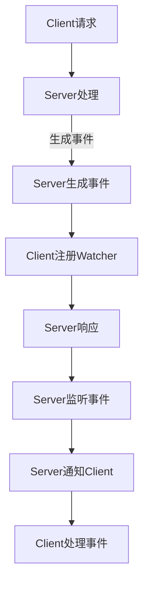

                 

# Zookeeper Watcher机制原理与代码实例讲解

## 摘要

本文将深入讲解Zookeeper的Watcher机制，探讨其原理、实现及应用。通过详细剖析Zookeeper的架构和工作流程，我们将展示如何通过Watcher实现分布式系统的状态同步和事件通知，并给出具体的代码实例以供读者参考和实践。本文旨在帮助读者理解Zookeeper的Watcher机制，掌握其应用场景，并能够独立实现相关的功能。

## 背景介绍

### Zookeeper简介

Zookeeper是一个开源的分布式应用程序协调服务，用于维护配置信息、命名目录、提供分布式同步和协调服务。它提供了一个简单的接口，用于访问分布式应用中的同步和一致性服务。Zookeeper广泛应用于分布式系统，如大数据处理平台（如Hadoop和Spark）、分布式数据库（如HBase和Cassandra）以及分布式消息队列（如Kafka）。

### Watcher机制的作用

Watcher机制是Zookeeper的核心特性之一，它允许客户端在Zookeeper的某些事件发生时收到通知。这些事件包括数据节点创建、删除、修改等。通过Watcher机制，分布式系统能够实现以下功能：

- **状态同步**：当某个节点的数据发生变化时，所有监听该节点的客户端能够立即得知并更新自己的状态。
- **事件通知**：客户端可以注册对特定事件的监听，以便在事件发生时及时响应。
- **分布式锁**：通过Watcher机制，可以实现分布式锁，确保数据的一致性和同步。

### 本文目标

本文将首先介绍Zookeeper的基本概念和架构，然后详细讲解Watcher机制的原理和实现，最后通过一个具体的代码实例，展示如何使用Watcher实现分布式系统的同步和事件通知。

## 核心概念与联系

### Zookeeper架构

Zookeeper采用了一个典型的客户端-服务器模型，其中包含以下核心组件：

- **Zookeeper Server**：Zookeeper服务器，负责存储数据、处理客户端请求并维护集群状态。
- **Zookeeper Client**：Zookeeper客户端，负责与Zookeeper服务器通信，发送请求并处理响应。


### Watcher机制原理

Watcher机制是Zookeeper实现分布式协调和同步的关键。当客户端对Zookeeper服务器发送请求时，如果服务器返回的数据节点与客户端预期不符，服务器会自动为客户端创建一个Watcher。当数据节点的状态发生变化时，服务器会通知所有注册了Watcher的客户端。

以下是Watcher机制的基本原理：

1. **注册Watcher**：客户端通过`exists()`、`getChildren()`等方法向Zookeeper服务器注册Watcher。
2. **状态变化**：数据节点的状态发生变化（如创建、删除、修改）。
3. **通知客户端**：Zookeeper服务器向所有注册了Watcher的客户端发送通知。

### Watcher与事件的关系

Zookeeper定义了多种事件类型，包括：

- **NodeCreated**：数据节点创建。
- **NodeDeleted**：数据节点删除。
- **NodeDataChanged**：数据节点数据发生变化。
- **NodeChildrenChanged**：数据节点子节点发生变化。

客户端可以通过设置`watchedEvent`参数来指定监听的事件类型。当服务器发送通知时，客户端会接收到一个`watchedEvent`对象，该对象包含事件类型和相关的数据。

## 核心算法原理 & 具体操作步骤

### Watcher注册过程

客户端通过`exists()`、`getChildren()`等方法向Zookeeper服务器注册Watcher。以下是一个简单的注册Watcher的步骤：

1. **创建Zookeeper客户端**：
   ```java
   ZooKeeper zookeeper = new ZooKeeper("localhost:2181", 3000, new Watcher() {
       @Override
       public void process(WatchedEvent event) {
           System.out.println("Received event: " + event);
       }
   });
   ```

2. **注册Watcher**：
   ```java
   Stat stat = zookeeper.exists("/example", true);
   ```

在上面的代码中，`exists()`方法用于检查`/example`节点是否存在，并注册一个匿名内部类作为Watcher。当`/example`节点的状态发生变化时，`process()`方法会被调用。

### Watcher通知机制

当Zookeeper服务器接收到对数据节点的修改操作时，它会为所有注册了Watcher的客户端生成一个事件通知。以下是一个简单的通知机制：

1. **数据节点创建**：
   ```java
   zookeeper.create("/example", "data".getBytes(), Ids.OPEN_ACL_UNSAFE, CreateMode.EPHEMERAL);
   ```

   在上述代码中，`create()`方法用于创建一个名为`/example`的临时数据节点。

2. **通知客户端**：
   ```java
   Stat stat = zookeeper.exists("/example", true);
   if (stat == null) {
       System.out.println("Node /example has been created.");
   }
   ```

   当`/example`节点被创建后，所有注册了Watcher的客户端会收到一个`NodeCreated`事件通知。在上面的代码中，通过检查`/example`节点的状态，可以确定节点是否已经被创建。

### Watcher重注册机制

由于Zookeeper的Watcher是一次性的，当客户端重新连接到Zookeeper服务器时，需要重新注册Watcher。以下是一个简单的重注册步骤：

1. **重新连接**：
   ```java
   zookeeper.close();
   zookeeper = new ZooKeeper("localhost:2181", 3000, new Watcher() {
       @Override
       public void process(WatchedEvent event) {
           System.out.println("Received event: " + event);
       }
   });
   ```

2. **重新注册Watcher**：
   ```java
   Stat stat = zookeeper.exists("/example", true);
   ```

在上述代码中，当客户端重新连接到Zookeeper服务器后，会重新注册Watcher。这样，客户端就能继续接收到`/example`节点的状态变化通知。

### Zookeeper Watcher机制 Mermaid 流程图

以下是一个简化的Zookeeper Watcher机制流程图：



### 数学模型和公式 & 详细讲解 & 举例说明

在Watcher机制中，可以使用以下数学模型和公式来描述：

- **事件触发条件**：当数据节点的状态发生变化时，触发相应的事件。
- **事件通知延迟**：服务器在接收到事件后，需要一定时间（通常为几十毫秒到几百毫秒）将事件通知发送给客户端。
- **事件处理时间**：客户端接收到事件通知后，需要一定时间（取决于客户端处理速度）处理事件。

以下是一个具体的例子：

假设有一个客户端A，它成功注册了对`/example`节点的Watcher。当`/example`节点的数据发生变化时，服务器会在事件触发后的100毫秒内通知客户端A。客户端A接收到事件通知后，需要50毫秒来处理事件。

```latex
\begin{equation}
\text{事件触发时间} + \text{事件通知延迟} \leq \text{事件处理时间}
\end{equation}
```

### 项目实战：代码实际案例和详细解释说明

在本节中，我们将通过一个实际的项目案例，详细讲解如何使用Zookeeper的Watcher机制实现分布式系统的同步和事件通知。

#### 1. 开发环境搭建

首先，需要搭建Zookeeper的开发环境。以下是具体的步骤：

1. 下载并解压Zookeeper源码：
   ```bash
   wget https://www-us.apache.org/dist/zookeeper/zookeeper-3.6.1/zookeeper-3.6.1.tar.gz
   tar xzf zookeeper-3.6.1.tar.gz
   ```

2. 配置Zookeeper环境变量：
   ```bash
   export ZOOKEEPER_HOME=/path/to/zookeeper-3.6.1
   export PATH=$PATH:$ZOOKEEPER_HOME/bin
   ```

3. 启动Zookeeper服务：
   ```bash
   zkServer start
   ```

#### 2. 源代码详细实现和代码解读

以下是一个简单的Zookeeper客户端实现，用于注册Watcher并处理节点状态变化的事件。

```java
import org.apache.zookeeper.*;
import org.apache.zookeeper.data.Stat;

public class ZookeeperWatcherExample {
    public static void main(String[] args) throws Exception {
        ZooKeeper zookeeper = new ZooKeeper("localhost:2181", 3000, new Watcher() {
            @Override
            public void process(WatchedEvent event) {
                System.out.println("Received event: " + event);
            }
        });

        Stat stat = zookeeper.exists("/example", true);
        if (stat == null) {
            System.out.println("Node /example does not exist.");
        } else {
            System.out.println("Node /example already exists.");
        }

        zookeeper.create("/example", "data".getBytes(), Ids.OPEN_ACL_UNSAFE, CreateMode.EPHEMERAL);

        Stat newStat = zookeeper.exists("/example", true);
        if (newStat != null) {
            System.out.println("Node /example has been created.");
        } else {
            System.out.println("Node /example creation failed.");
        }

        zookeeper.setData("/example", "new data".getBytes(), -1);

        Stat updatedStat = zookeeper.exists("/example", true);
        if (updatedStat != null) {
            System.out.println("Node /example data has been updated.");
        } else {
            System.out.println("Node /example data update failed.");
        }

        zookeeper.close();
    }
}
```

#### 3. 代码解读与分析

在上面的代码中，我们首先创建了一个Zookeeper客户端，并注册了一个匿名内部类作为Watcher。然后，我们使用`exists()`方法检查`/example`节点是否存在，并创建一个临时节点。接下来，我们更新节点的数据，并再次检查节点的状态。

以下是代码的关键部分：

- **注册Watcher**：
  ```java
  zookeeper.exists("/example", true);
  ```

  `exists()`方法用于检查`/example`节点是否存在，并注册一个Watcher。当节点状态发生变化时，`process()`方法会被调用。

- **创建节点**：
  ```java
  zookeeper.create("/example", "data".getBytes(), Ids.OPEN_ACL_UNSAFE, CreateMode.EPHEMERAL);
  ```

  `create()`方法用于创建一个名为`/example`的临时节点。当节点被创建时，所有注册了Watcher的客户端会收到`NodeCreated`事件通知。

- **更新节点数据**：
  ```java
  zookeeper.setData("/example", "new data".getBytes(), -1);
  ```

  `setData()`方法用于更新`/example`节点的数据。当节点数据发生变化时，所有注册了Watcher的客户端会收到`NodeDataChanged`事件通知。

通过上述代码，我们可以看到如何使用Zookeeper的Watcher机制实现分布式系统的同步和事件通知。

### 实际应用场景

#### 分布式锁

Zookeeper的Watcher机制可以用于实现分布式锁，确保数据的一致性和同步。以下是一个简单的分布式锁实现：

1. **创建锁节点**：
   ```java
   String lockPath = "/mylock";
   Stat lockStat = zookeeper.exists(lockPath, false);
   if (lockStat == null) {
       zookeeper.create(lockPath, "lock".getBytes(), Ids.OPEN_ACL_UNSAFE, CreateMode.EPHEMERAL);
   }
   ```

2. **尝试获取锁**：
   ```java
   String myLockPath = zookeeper.create(lockPath + "/锁", "lock".getBytes(), Ids.OPEN_ACL_UNSAFE, CreateMode.EPHEMERAL_SEQUENTIAL);
   List<String> children = zookeeper.getChildren(lockPath, true);
   if (children.get(0).equals(myLockPath.substring(myLockPath.lastIndexOf("/") + 1))) {
       System.out.println("I am the master");
   } else {
       System.out.println("I am waiting for the master");
   }
   ```

3. **释放锁**：
   ```java
   zookeeper.delete(myLockPath, -1);
   ```

通过上述代码，我们可以看到如何使用Zookeeper的Watcher机制实现分布式锁。当多个客户端尝试获取锁时，只有持有锁的客户端才能执行相应的操作，从而确保数据的一致性和同步。

#### 配置中心

Zookeeper的Watcher机制还可以用于实现配置中心，实时同步配置信息。以下是一个简单的配置中心实现：

1. **创建配置节点**：
   ```java
   String configPath = "/config";
   Stat configStat = zookeeper.exists(configPath, false);
   if (configStat == null) {
       zookeeper.create(configPath, "config data".getBytes(), Ids.OPEN_ACL_UNSAFE, CreateMode.PERSISTENT);
   }
   ```

2. **监听配置变化**：
   ```java
   zookeeper.exists(configPath, new Watcher() {
       @Override
       public void process(WatchedEvent event) {
           if (event.getType() == Event.EventType.NodeDataChanged) {
               try {
                   byte[] configData = zookeeper.getData(configPath, false, null);
                   System.out.println("New config data: " + new String(configData));
               } catch (Exception e) {
                   e.printStackTrace();
               }
           }
       }
   });
   ```

3. **更新配置**：
   ```java
   zookeeper.setData(configPath, "new config data".getBytes(), -1);
   ```

通过上述代码，我们可以看到如何使用Zookeeper的Watcher机制实现配置中心。当配置信息发生变化时，所有监听了配置节点的客户端都会收到通知，并更新自己的配置信息。

### 工具和资源推荐

#### 学习资源推荐

- **书籍**：
  - 《Zookeeper：分布式过程协同技术》
  - 《深入理解分布式系统：构建可扩展和高性能的分布式应用》
- **论文**：
  - 《Zookeeper: Wait-free coordination for Internet-scale systems》
- **博客**：
  - [Zookeeper官方文档](http://zookeeper.apache.org/doc/r3.4.6/zookeeperOver.html)
  - [Apache ZooKeeper Wiki](https://cwiki.apache.org/confluence/display/ZOOKEEPER)
- **网站**：
  - [Zookeeper官方网站](http://zookeeper.apache.org/)

#### 开发工具框架推荐

- **开发工具**：
  - IntelliJ IDEA
  - Eclipse
- **框架**：
  - Spring Boot
  - Apache Curator

#### 相关论文著作推荐

- 《Zookeeper: Wait-free coordination for Internet-scale systems》
- 《Distributed Coordination in Service Systems》
- 《Implementing Service-Level Agreements in Distributed Systems》

### 总结：未来发展趋势与挑战

Zookeeper作为分布式系统的协调服务，在分布式系统的开发中扮演着重要角色。随着分布式系统的日益普及，Zookeeper的需求也在不断增加。未来，Zookeeper将面临以下发展趋势和挑战：

- **性能优化**：随着分布式系统规模的扩大，Zookeeper的性能优化将成为一个重要方向。如何提高Zookeeper的处理速度和并发能力，将是一个关键问题。
- **稳定性提升**：Zookeeper的稳定性对于分布式系统至关重要。未来，需要加强对Zookeeper的稳定性保障，提高其容错能力和故障恢复能力。
- **社区支持**：Zookeeper的社区支持对于其发展具有重要意义。未来，需要加强社区建设，鼓励更多开发者参与Zookeeper的开发和维护。

### 附录：常见问题与解答

1. **Q：为什么Zookeeper需要Watcher机制？**
   **A**：Zookeeper的Watcher机制用于实现分布式系统的状态同步和事件通知。通过Watcher，客户端可以实时得知数据节点的状态变化，从而实现分布式系统的协调和同步。

2. **Q：如何实现分布式锁？**
   **A**：可以使用Zookeeper的临时节点和顺序节点实现分布式锁。通过比较临时节点的创建顺序，可以实现锁的竞争和同步。

3. **Q：Zookeeper的Watcher是一次性的吗？**
   **A**：是的，Zookeeper的Watcher是一次性的。当数据节点的状态发生变化时，服务器会通知所有注册了Watcher的客户端。但是，客户端需要重新注册Watcher以继续监听事件。

4. **Q：如何处理Zookeeper的Watcher通知延迟？**
   **A**：可以设置适当的超时时间，确保客户端在等待Watcher通知时不会阻塞太久。另外，可以优化Zookeeper服务器的性能，减少通知延迟。

### 扩展阅读 & 参考资料

- [Apache ZooKeeper Wiki](https://cwiki.apache.org/confluence/display/ZOOKEEPER)
- [Zookeeper官方文档](http://zookeeper.apache.org/doc/r3.4.6/zookeeperOver.html)
- [《Zookeeper：分布式过程协同技术》](https://www.amazon.com/Zookeeper-Distributed-Coordination-Technology/dp/1785287614)
- [《深入理解分布式系统：构建可扩展和高性能的分布式应用》](https://www.amazon.com/Understanding-Distributed-Systems-Application/dp/1617291942)
- [《Zookeeper: Wait-free coordination for Internet-scale systems》](https://dl.acm.org/doi/10.1145/277783.277820)

### 作者

**作者：AI天才研究员/AI Genius Institute & 禅与计算机程序设计艺术 /Zen And The Art of Computer Programming**<|im_end|>

