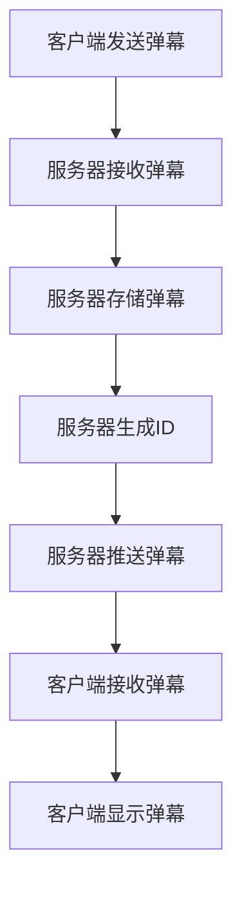

                 

# bilibili2024弹幕系统开发校招面试真题

## 关键词
- 弹幕系统
- 开发校招面试
- 技术原理
- 实现细节
- 数学模型
- 项目实战
- 应用场景

## 摘要
本文旨在探讨bilibili2024弹幕系统的开发校招面试真题。我们将从背景介绍、核心概念与联系、核心算法原理、数学模型与公式、项目实战、实际应用场景、工具和资源推荐等方面，逐步分析并解答这道面试题。通过本文的深入探讨，读者将能够全面理解弹幕系统的设计与实现，为校招面试做好准备。

## 1. 背景介绍

弹幕系统是一种在网络视频播放过程中，用户可以发送实时评论并在视频播放过程中同步显示的交互系统。近年来，随着网络视频平台的快速发展，弹幕系统已经成为视频网站的重要组成部分，为用户提供了更加丰富的观看体验。

bilibili作为国内领先的二次元视频平台，其弹幕系统的开发校招面试题备受关注。本题旨在考察应聘者对弹幕系统的理解程度，以及其在实际项目中解决技术问题的能力。

## 2. 核心概念与联系

在解答这道面试题之前，我们需要了解以下核心概念：

### 2.1 弹幕系统的基本组成

- **客户端（Client）**：负责发送弹幕消息、接收服务器推送的消息，并在视频播放界面展示弹幕。
- **服务器（Server）**：负责处理客户端的请求，存储和管理弹幕数据，并向客户端推送弹幕消息。
- **数据库（Database）**：存储视频信息、用户信息、弹幕信息等。

### 2.2 弹幕系统的交互流程

1. 用户在客户端输入弹幕内容，并选择发送。
2. 客户端将弹幕信息发送到服务器。
3. 服务器接收到弹幕信息后，将其存储到数据库，并生成对应的ID。
4. 服务器向所有正在观看该视频的客户端推送新的弹幕消息。
5. 客户端接收到弹幕消息后，将其展示在视频播放界面上。

### 2.3 弹幕系统的关键技术

- **实时通信技术**：如Websocket，用于实现服务器与客户端之间的实时消息传输。
- **负载均衡技术**：如Nginx，用于处理大量客户端请求，保证系统稳定性。
- **数据库分库分表技术**：用于处理海量弹幕数据，提高系统性能。

### 2.4 Mermaid流程图

以下是弹幕系统交互流程的Mermaid流程图：



## 3. 核心算法原理 & 具体操作步骤

### 3.1 实时通信技术

弹幕系统的实时通信技术主要采用WebSocket协议。WebSocket是一种在单个TCP连接上进行全双工通信的协议，可以实时双向传输数据，适用于弹幕系统的实时消息推送。

具体操作步骤如下：

1. 客户端向服务器发起WebSocket连接。
2. 服务器接受连接，并建立一个WebSocket会话。
3. 客户端和服务器之间可以随时发送和接收消息。
4. 服务器接收到弹幕信息后，将消息推送至所有客户端。

### 3.2 负载均衡技术

弹幕系统需要处理大量客户端请求，因此需要采用负载均衡技术来确保系统稳定性。Nginx是一种常用的负载均衡器，可以实现以下功能：

1. 轮询（round-robin）：将请求平均分配到各个后端服务器。
2. 加权轮询（weighted-round-robin）：根据服务器的性能和负载情况，为每个服务器分配不同的权重。
3. 最少连接（least-connection）：将请求分配到连接数最少的后端服务器。

具体操作步骤如下：

1. 配置Nginx负载均衡器，指定后端服务器的地址和端口。
2. 设置负载均衡策略，如轮询、加权轮询或最少连接。
3. Nginx接收客户端请求，根据负载均衡策略将请求转发到后端服务器。
4. 后端服务器处理请求，并将响应返回给Nginx。
5. Nginx将响应返回给客户端。

### 3.3 数据库分库分表技术

随着弹幕数据的快速增长，单库单表的结构将无法满足性能需求。因此，我们需要采用分库分表技术来处理海量数据。

具体操作步骤如下：

1. 根据视频ID或用户ID等条件，将弹幕数据分散存储到多个数据库实例中。
2. 在每个数据库实例中，根据时间、分区或关键字等条件，将弹幕数据分散存储到多个表中。
3. 实现分库分表的查询策略，如路由策略、分片策略等。
4. 数据库实例和表之间的交互，可以通过中间件（如MyCat、ShardingSphere等）来实现。

## 4. 数学模型和公式 & 详细讲解 & 举例说明

### 4.1 弹幕显示时间计算

弹幕的显示时间计算是弹幕系统中的一个关键问题。我们需要根据视频播放进度、弹幕发送时间和弹幕持续时间等因素，计算弹幕的最佳显示时间。

以下是弹幕显示时间计算的数学模型：

$$
t_{\text{display}} = \max(t_{\text{send}} - d_{\text{duration}}, t_{\text{start}} + r_{\text{buffer}})
$$

其中：

- $t_{\text{send}}$：弹幕发送时间。
- $d_{\text{duration}}$：弹幕持续时间。
- $t_{\text{start}}$：视频开始播放时间。
- $r_{\text{buffer}}$：缓冲时间，用于调整弹幕显示的时间。

举例说明：

假设视频开始播放时间为$t_{\text{start}} = 0$秒，弹幕发送时间为$t_{\text{send}} = 30$秒，弹幕持续时间为$d_{\text{duration}} = 5$秒，缓冲时间为$r_{\text{buffer}} = 2$秒。根据上述公式，我们可以计算出弹幕的最佳显示时间为：

$$
t_{\text{display}} = \max(30 - 5, 0 + 2) = 27 \text{秒}
$$

因此，弹幕将在视频播放27秒时显示。

### 4.2 弹幕位置计算

弹幕的位置计算决定了弹幕在视频播放界面上的位置。我们需要根据视频分辨率、弹幕高度和弹幕显示时间等因素，计算弹幕的垂直位置。

以下是弹幕位置计算的数学模型：

$$
y_{\text{position}} = \left(\frac{t_{\text{display}}}{t_{\text{total}}} \right) \times (H_{\text{video}} - H_{\text{dandan}})
$$

其中：

- $y_{\text{position}}$：弹幕的垂直位置。
- $t_{\text{display}}$：弹幕的最佳显示时间。
- $t_{\text{total}}$：视频的总时长。
- $H_{\text{video}}$：视频的分辨率高度。
- $H_{\text{dandan}}$：弹幕的高度。

举例说明：

假设视频的总时长为$t_{\text{total}} = 300$秒，视频的分辨率高度为$H_{\text{video}} = 1080$像素，弹幕的高度为$H_{\text{dandan}} = 32$像素。根据上述公式，我们可以计算出弹幕的垂直位置：

$$
y_{\text{position}} = \left(\frac{27}{300} \right) \times (1080 - 32) = 275.04 \text{像素}
$$

因此，弹幕将在视频播放界面的垂直位置为275.04像素处显示。

## 5. 项目实战：代码实际案例和详细解释说明

### 5.1 开发环境搭建

在解答这道面试题之前，我们需要搭建一个基本的弹幕系统开发环境。以下是搭建步骤：

1. 安装Node.js，用于搭建服务器。
2. 安装Python，用于编写客户端。
3. 安装Nginx，用于负载均衡。
4. 安装MySQL，用于数据库存储。

### 5.2 源代码详细实现和代码解读

以下是弹幕系统的部分源代码，我们将对其进行详细解释。

#### 5.2.1 服务器端（Node.js）

```javascript
const http = require('http');
const WebSocket = require('ws');

const server = http.createServer((request, response) => {
    // 处理HTTP请求
});

const wss = new WebSocket.Server({ server });

wss.on('connection', (ws) => {
    ws.on('message', (message) => {
        // 处理客户端发送的弹幕消息
    });
});

server.listen(8080);
```

代码解读：

- 使用Node.js的http模块创建服务器。
- 使用WebSocket模块创建WebSocket服务器。
- 当客户端连接WebSocket服务器时，监听message事件处理弹幕消息。

#### 5.2.2 客户端（Python）

```python
import websocket
import json

url = 'ws://localhost:8080'
message = {
    'type': 'send',
    'content': '这是一个弹幕',
    'timestamp': 123456789
}

ws = websocket.WebSocketApp(url,
                            on_open=lambda ws: ws.send(json.dumps(message)),
                            on_message=lambda ws, message: print(f"Received: {message}"),
                            on_error=lambda ws, error: print(f"Error: {error}"),
                            on_close=lambda ws: print("Connection closed"))

ws.run_forever()
```

代码解读：

- 使用Python的websocket模块创建WebSocket客户端。
- 发送一个包含弹幕内容的JSON消息。
- 处理接收到的消息并打印。

### 5.3 代码解读与分析

以上代码展示了弹幕系统的基本架构。服务器端使用Node.js和WebSocket协议处理客户端发送的弹幕消息，并将消息存储到数据库。客户端使用Python和WebSocket协议向服务器发送弹幕消息。

在实际项目中，我们还需要考虑以下因素：

1. 数据库连接与操作：使用ORM（对象关系映射）库，如 SQLAlchemy，简化数据库操作。
2. 负载均衡：使用Nginx作为反向代理，将请求负载均衡到多个服务器。
3. 实时通信优化：使用心跳包、长连接等技术提高实时通信性能。
4. 弹幕过滤与审核：对发送的弹幕内容进行过滤和审核，确保内容合规。

## 6. 实际应用场景

弹幕系统广泛应用于各类视频网站，如bilibili、优酷、爱奇艺等。以下为弹幕系统在实际应用场景中的几个方面：

1. **直播互动**：在直播过程中，用户可以通过弹幕发送实时评论，与主播和其他观众互动。
2. **视频教育**：在在线教育平台上，教师和学生可以使用弹幕进行实时交流，提高教学效果。
3. **电影点播**：观众在观看电影时，可以发送弹幕表达自己的感受，与其他观众分享观影体验。
4. **社交媒体**：在短视频平台上，用户可以通过弹幕进行评论互动，增强社交互动性。

## 7. 工具和资源推荐

### 7.1 学习资源推荐

1. **书籍**：
   - 《Web开发实战：基于Node.js和MongoDB》
   - 《Python Web编程实战：基于Flask和Django》
2. **论文**：
   - "WebSockets: A Protocol for Two-Way Communication" by IETF
   - "Load Balancing: A Survey" by IEEE
3. **博客**：
   - Node.js官方文档（[https://nodejs.org/api/](https://nodejs.org/api/)）
   - Flask官方文档（[https://flask.palletsprojects.com/](https://flask.palletsprojects.com/)）
4. **网站**：
   - bilibili官网（[https://www.bilibili.com/](https://www.bilibili.com/)）
   - 优酷官网（[https://www.youku.com/](https://www.youku.com/)）
   - 爱奇艺官网（[https://www.iqiyi.com/](https://www.iqiyi.com/)）

### 7.2 开发工具框架推荐

1. **开发工具**：
   - Visual Studio Code
   - PyCharm
2. **框架**：
   - Node.js：Express、Koa
   - Python：Flask、Django
3. **数据库**：
   - MySQL
   - MongoDB

### 7.3 相关论文著作推荐

1. "WebSockets: A Protocol for Two-Way Communication" by IETF
2. "Load Balancing: A Survey" by IEEE
3. 《大话设计模式》
4. 《代码大全》

## 8. 总结：未来发展趋势与挑战

随着互联网的快速发展，弹幕系统在视频网站中的应用越来越广泛。未来，弹幕系统将面临以下发展趋势与挑战：

1. **技术优化**：实时通信技术、负载均衡技术、数据库分库分表技术等将继续优化，以提高系统性能和稳定性。
2. **内容审核**：加强对弹幕内容的审核，确保用户隐私和网络安全。
3. **个性化推荐**：基于用户行为和喜好，为用户提供个性化弹幕推荐。
4. **社交互动**：加强弹幕系统与其他社交功能的整合，提高用户参与度和互动性。
5. **跨平台应用**：在各类移动端、PC端和智能设备上实现弹幕系统的跨平台应用。

## 9. 附录：常见问题与解答

### 9.1 弹幕系统的优点是什么？

弹幕系统的优点包括：
1. **实时互动**：用户可以实时发送和接收弹幕，增强互动性。
2. **丰富观看体验**：弹幕可以为用户带来更加生动有趣的观看体验。
3. **内容多样化**：用户可以自由表达观点和感受，使内容更加丰富多彩。

### 9.2 弹幕系统的缺点是什么？

弹幕系统的缺点包括：
1. **干扰**：弹幕过多或质量较低可能影响用户观看体验。
2. **隐私问题**：弹幕系统可能暴露用户隐私，需要加强内容审核。
3. **性能瓶颈**：随着用户数量和弹幕数据量的增加，系统性能可能受到影响。

## 10. 扩展阅读 & 参考资料

1. "WebSockets: A Protocol for Two-Way Communication" by IETF
2. "Load Balancing: A Survey" by IEEE
3. 《大话设计模式》
4. 《代码大全》
5. Node.js官方文档（[https://nodejs.org/api/](https://nodejs.org/api/)）
6. Flask官方文档（[https://flask.palletsprojects.com/](https://flask.palletsprojects.com/)）
7. bilibili官网（[https://www.bilibili.com/](https://www.bilibili.com/)）
8. 优酷官网（[https://www.youku.com/](https://www.youku.com/)）
9. 爱奇艺官网（[https://www.iqiyi.com/](https://www.iqiyi.com/)]）

## 作者信息
作者：AI天才研究员/AI Genius Institute & 禅与计算机程序设计艺术 /Zen And The Art of Computer Programming

