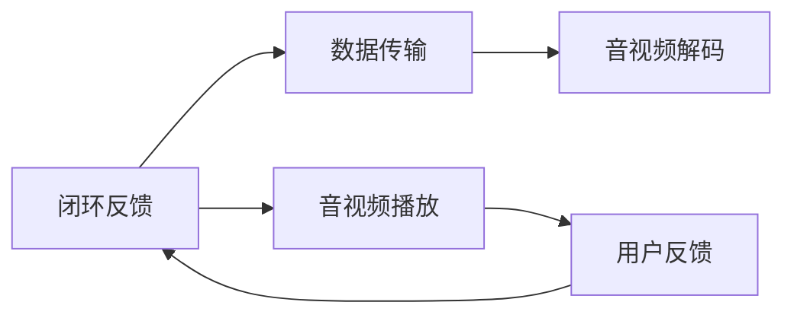

                 

# bilibili2024校招音视频开发工程师面试指南

## 关键词
- 音视频开发
- 实时流媒体
- FFmpeg
- WebRTC
- 高效编码
- 网络优化
- 编程面试

## 摘要
本文将深入探讨2024年bilibili校招音视频开发工程师的面试指南。我们将首先介绍音视频开发的基本概念，包括实时流媒体和高效编码技术。随后，通过分析FFmpeg和WebRTC的关键算法原理，我们将逐步解释其具体操作步骤。接下来，我们将探讨数学模型和公式，并通过实际项目案例详细解释代码实现和分析。此外，我们将讨论音视频开发在实际应用场景中的挑战，并提供相关的工具和资源推荐。最后，我们将总结未来发展趋势与挑战，并回答常见问题。希望通过本文，能够帮助各位考生在bilibili的校招面试中取得优异成绩。

## 1. 背景介绍

随着互联网技术的迅猛发展，音视频技术已经成为互联网行业的重要组成部分。音视频开发工程师在bilibili等视频平台中发挥着至关重要的作用。音视频开发工程师不仅需要掌握音视频编解码、流媒体传输等核心技能，还需要具备网络优化、性能调优等多方面的能力。

### 音视频技术发展历程

从最早的视频播放器到现在的实时流媒体技术，音视频技术经历了漫长的发展过程。早期，视频主要以本地播放为主，随着带宽的限制和存储成本的上升，实时流媒体技术逐渐成为主流。实时流媒体技术通过将视频内容分割成多个片段，用户可以随时播放和暂停，大大提升了用户体验。

### 音视频开发工程师的核心职责

音视频开发工程师的主要职责包括：

1. **音视频编解码**：选择适合的编解码器，进行视频和音频的压缩和解压缩，保证视频质量的同时降低数据传输的带宽需求。
2. **流媒体传输**：设计和实现流媒体传输协议，保证数据在传输过程中不丢失、不卡顿，提升用户体验。
3. **网络优化**：对音视频传输过程进行优化，减少延迟、降低丢包率，提高传输效率。
4. **性能调优**：对音视频系统进行性能调优，确保系统在高并发、高负载的情况下仍能稳定运行。

### 音视频技术在bilibili的应用

bilibili作为一个以弹幕视频分享为主的平台，对音视频技术有着极高的要求。以下是在bilibili中应用的一些音视频技术：

1. **弹幕系统**：弹幕是bilibili的一大特色，音视频开发工程师需要实现高效的弹幕显示和管理功能，保证用户在观看视频时能够顺畅地查看弹幕。
2. **实时流媒体**：bilibili采用了实时流媒体技术，用户可以流畅地观看直播和点播视频，减少了卡顿和缓冲时间。
3. **高效编码**：bilibili使用高效编码技术，如H.265和HE-AAC，以降低数据传输带宽，提高视频质量。

### 音视频开发工程师面临的挑战

在音视频开发过程中，工程师们面临着多方面的挑战：

1. **带宽限制**：随着用户数量的增加，带宽资源变得紧张，音视频开发工程师需要通过优化编码和传输技术来降低带宽需求。
2. **网络不稳定**：网络环境的不稳定可能导致音视频传输中断，音视频开发工程师需要设计容错机制，确保数据传输的稳定性。
3. **性能优化**：在高并发、高负载的情况下，音视频系统需要保证稳定运行，工程师们需要不断进行性能调优。
4. **用户体验**：用户对音视频质量有着极高的期望，工程师们需要不断提升技术，提供更好的用户体验。

通过以上背景介绍，我们可以看出音视频开发工程师在bilibili等视频平台中的重要性。接下来，我们将深入探讨音视频开发的核心概念和算法原理。

## 2. 核心概念与联系

在深入探讨音视频开发的核心概念和算法原理之前，我们需要先了解一些关键概念和它们之间的联系。以下是一些核心概念及其定义：

### 音视频编解码

音视频编解码（Audio Video Coding）是将音视频信号转换成数字信号的过程，以及在数字信号与模拟信号之间的转换。编解码技术的主要目的是减少数据量，以便更高效地存储和传输。

#### 编码（Encoding）

编码是将原始的音视频信号转换成数字信号的过程。在编码过程中，使用一系列算法来减少冗余信息，从而降低数据量。

#### 解码（Decoding）

解码是将经过编码的数字信号转换回原始音视频信号的过程。解码器负责将这些数字信号重新组合成完整的音视频流。

### 实时流媒体

实时流媒体（Real-Time Streaming）是一种通过网络传输音视频内容的技术，允许用户在观看视频时实时接收数据流。

#### 流媒体传输协议

流媒体传输协议（Streaming Media Protocol）定义了数据传输的规则和标准，如HTTP动态流（HLS）、HTTP直播流（RTMP）和WebRTC等。

### 网络优化

网络优化（Network Optimization）是指通过一系列技术和策略来提高网络传输效率，减少延迟和丢包率。

#### 缓存技术

缓存技术（Caching）用于存储经常访问的数据，以减少重复传输和降低网络负载。

#### 压缩技术

压缩技术（Compression）用于减少数据量，提高传输效率。常见的压缩技术包括视频压缩（如H.264、H.265）和音频压缩（如AAC、MP3）。

### 音视频技术架构

音视频技术架构（Audio Video Technology Architecture）描述了音视频系统的整体设计和实现方式。以下是一个简化的音视频技术架构图：



在这个架构图中，音视频编码模块负责将音视频信号转换为压缩数据，数据传输模块负责在网络中传输这些数据，音视频解码模块负责将压缩数据还原为原始音视频信号，音视频播放模块负责将还原后的音视频信号播放给用户，用户反馈模块则用于收集用户的反馈信息，以优化系统的性能。

### 核心概念之间的联系

核心概念之间的联系主要体现在以下几个方面：

1. **编码与传输**：编码模块生成的压缩数据需要通过网络传输模块进行传输，传输过程中可能会受到网络拥塞、延迟等因素的影响。
2. **解码与播放**：传输到用户端的压缩数据需要通过解码模块还原为原始音视频信号，然后才能播放给用户。
3. **优化与反馈**：网络优化技术用于提高数据传输效率，减少延迟和丢包率。用户反馈模块则用于收集用户的反馈信息，以不断优化系统的性能。

通过以上核心概念和架构的介绍，我们可以对音视频开发有更深入的理解。接下来，我们将详细探讨FFmpeg和WebRTC的关键算法原理。

## 2.1 FFmpeg关键算法原理

### FFmpeg概述

FFmpeg是一个开源的音频和视频处理软件，包括编码、解码、转码、流媒体传输等功能。它广泛应用于各种媒体处理场景，如视频网站、直播平台、视频编辑软件等。FFmpeg的核心模块包括：

1. **libavcodec**：音视频编解码库，提供各种常见的编解码器。
2. **libavformat**：音视频格式转换库，支持多种常见的音视频格式。
3. **libavutil**：音视频处理工具库，提供各种常用的音视频处理工具。
4. **libswscale**：图像缩放库，用于调整图像的尺寸和分辨率。
5. **libswresample**：音频重采样库，用于调整音频的采样率和采样格式。

### FFmpeg编解码算法原理

FFmpeg的编解码算法主要基于以下几种核心技术：

1. **H.264/H.265编解码**：H.264和H.265是常用的视频编解码标准，它们采用了多种技术来提高视频压缩效率，如空间和时间预测、变换、量化等。
2. **AAC/MP3编解码**：AAC和MP3是常用的音频编解码标准，它们通过压缩音频信号中的冗余信息来减少数据量。

#### H.264编解码算法

H.264编解码算法主要包括以下几个步骤：

1. **图像分割**：将图像分割成宏块（Macroblock），每个宏块再分割成4x4的子宏块（4x4 Sub-macroblock）。
2. **运动估计和补偿**：对当前帧和参考帧进行运动估计，找到最佳匹配块，并计算运动向量。
3. **变换和量化**：对宏块进行离散余弦变换（DCT）和量化，以减少冗余信息。
4. **熵编码**：使用变长编码（VLC）或熵编码（CABAC）对变换后的系数进行编码。

#### H.265编解码算法

H.265编解码算法与H.264类似，但在视频压缩效率上有了显著提升。H.265的主要特点包括：

1. **更高分辨率支持**：H.265支持更高的分辨率，如8K和4K。
2. **更高效的编码模式**：H.265引入了新的编码模式，如变换块大小（Transform Block Size）和自适应场景适应（Scene Adaptive Transform）。

#### AAC编解码算法

AAC编解码算法主要包括以下几个步骤：

1. **频谱分析**：将音频信号进行频谱分析，提取出主要频率分量。
2. **子带编码**：将频谱分析结果分成多个子带，并对每个子带进行量化。
3. **熵编码**：使用变长编码或熵编码对量化后的音频信号进行编码。

#### MP3编解码算法

MP3编解码算法主要包括以下几个步骤：

1. **采样和量化**：将音频信号采样并量化成16位整数。
2. **子带编码**：将音频信号分成多个子带，并对每个子带进行量化。
3. **熵编码**：使用变长编码对量化后的音频信号进行编码。

### FFmpeg编码与解码流程

FFmpeg的编码与解码流程可以简化为以下几个步骤：

1. **输入源数据**：读取输入的音频或视频数据。
2. **解码**：将压缩的音频或视频数据解码成原始数据。
3. **处理**：对原始数据进行各种处理，如缩放、过滤等。
4. **编码**：将处理后的数据重新编码成压缩数据。
5. **输出**：输出编码后的音频或视频数据。

### FFmpeg在音视频开发中的应用

FFmpeg在音视频开发中的应用非常广泛，以下是一些常见的应用场景：

1. **视频转码**：将一种视频格式转换成另一种视频格式，如将MP4转换成WebM。
2. **视频剪辑**：对视频进行剪辑、拼接、添加滤镜等操作。
3. **视频直播**：实现视频直播功能，如通过RTMP协议进行直播传输。
4. **音频处理**：对音频进行采样率转换、静音检测等操作。
5. **音视频合成**：将多个音视频流合并成一个流，如制作视频字幕。

通过以上对FFmpeg关键算法原理的介绍，我们可以看到FFmpeg在音视频开发中的重要性。接下来，我们将详细探讨WebRTC的关键算法原理。

### 2.2 WebRTC关键算法原理

#### WebRTC概述

WebRTC（Web Real-Time Communication）是一个开源项目，旨在实现实时的音视频通信功能，并通过网页进行通信。WebRTC支持多种通信模式，包括点对点通信和广播通信，广泛应用于视频会议、直播、在线教育等领域。

#### WebRTC协议架构

WebRTC协议架构主要包括以下几个部分：

1. **信令（Signaling）**：用于交换通信参数，如ICE候选地址、DTLS和SRTP密钥等。信令可以通过简单的HTTP请求进行传输。
2. **网络层（Networking Layer）**：包括ICE（Interactive Connectivity Establishment）和DTLS（Datagram Transport Layer Security）等协议，用于建立网络连接和加密通信。
3. **传输层（Transport Layer）**：包括RTP（Real-time Transport Protocol）和RTCP（Real-time Transport Control Protocol）等协议，用于传输音视频数据和监控传输质量。
4. **应用层（Application Layer）**：包括音视频编解码、视频渲染等模块，实现音视频数据的处理和传输。

#### WebRTC信令流程

WebRTC信令流程主要包括以下几个步骤：

1. **连接建立**：客户端和服务器通过信令通道交换ICE候选地址。
2. **ICE协商**：客户端和服务器通过ICE协议协商出最佳的网络连接。
3. **DTLS协商**：客户端和服务器通过DTLS协议建立安全连接。
4. **RTP传输**：建立安全连接后，客户端和服务器开始传输音视频数据。

#### WebRTC编解码算法

WebRTC支持的编解码器主要包括VP8/VP9（视频编解码器）和Opus（音频编解码器）等。

1. **VP8/VP9编解码算法**：VP8/VP9是Google开发的视频编解码器，具有高效的压缩性能。VP8/VP9编解码算法主要包括以下几个步骤：
   - **图像分割**：将视频帧分割成多个块。
   - **运动估计和补偿**：对当前帧和参考帧进行运动估计，找到最佳匹配块，并计算运动向量。
   - **变换和量化**：对宏块进行离散余弦变换（DCT）和量化，以减少冗余信息。
   - **熵编码**：使用变长编码或熵编码对变换后的系数进行编码。

2. **Opus编解码算法**：Opus是Xiph.org开发的音频编解码器，具有低延迟和高音质的特点。Opus编解码算法主要包括以下几个步骤：
   - **频谱分析**：将音频信号进行频谱分析，提取出主要频率分量。
   - **子带编码**：将频谱分析结果分成多个子带，并对每个子带进行量化。
   - **熵编码**：使用变长编码或熵编码对量化后的音频信号进行编码。

#### WebRTC传输优化

WebRTC在传输过程中采用了一系列优化技术，以提升传输质量和用户体验，主要包括：

1. **NAT穿透（NAT Traversal）**：通过STUN/TURN协议实现NAT穿透，允许客户端和服务器在NAT网络中建立通信。
2. **拥塞控制（Congestion Control）**：通过RTP控制协议实现拥塞控制，避免网络拥塞导致数据丢失或延迟。
3. **带宽估计（Bandwidth Estimation）**：通过RTCP反馈信息实时估算网络带宽，调整数据传输速率。
4. **丢包处理（Packet Loss Handling）**：通过RTP反馈机制检测丢包，并采取丢包重传或丢包掩盖等技术进行处理。

通过以上对WebRTC关键算法原理的介绍，我们可以看到WebRTC在实时音视频通信中的重要性。接下来，我们将详细探讨音视频开发工程师需要掌握的核心算法原理。

### 3. 核心算法原理 & 具体操作步骤

在音视频开发过程中，核心算法原理是确保音视频质量和传输效率的关键。以下我们将详细介绍一些核心算法原理及其具体操作步骤。

#### 3.1 高效编码算法

高效编码算法是音视频开发的基础，它通过去除冗余信息来减少数据量，从而提高传输效率和存储空间利用率。以下是几种常见的高效编码算法：

##### 3.1.1 H.264编解码算法

H.264是广泛使用的视频编码标准，它采用了一系列技术来提高编码效率，具体操作步骤如下：

1. **图像分割**：将图像分割成宏块（Macroblock），每个宏块再分割成4x4的子宏块（4x4 Sub-macroblock）。
2. **运动估计和补偿**：对当前帧和参考帧进行运动估计，找到最佳匹配块，并计算运动向量。
3. **变换和量化**：对宏块进行离散余弦变换（DCT）和量化，以减少冗余信息。
4. **熵编码**：使用变长编码（VLC）或熵编码（CABAC）对变换后的系数进行编码。

##### 3.1.2 H.265编解码算法

H.265是新一代的视频编码标准，它在H.264的基础上进行了大量优化，具有更高的编码效率。具体操作步骤如下：

1. **图像分割**：与H.264类似，将图像分割成宏块（Macroblock），每个宏块再分割成4x4的子宏块（4x4 Sub-macroblock）。
2. **变换和量化**：引入新的变换模式，如变换块大小（Transform Block Size）和自适应场景适应（Scene Adaptive Transform）。
3. **熵编码**：使用新的熵编码技术，如自适应二进制算术编码（Context-based Adaptive Binary Arithmetic Coding，CABAC）。

##### 3.1.3 AAC编解码算法

AAC是常用的音频编码标准，它通过频谱分析和子带编码技术来提高编码效率。具体操作步骤如下：

1. **频谱分析**：对音频信号进行频谱分析，提取出主要频率分量。
2. **子带编码**：将频谱分析结果分成多个子带，并对每个子带进行量化。
3. **熵编码**：使用变长编码（VLC）或熵编码（CABAC）对量化后的音频信号进行编码。

##### 3.1.4 MP3编解码算法

MP3是较早的音频编码标准，它通过子带编码和熵编码技术来提高编码效率。具体操作步骤如下：

1. **采样和量化**：将音频信号采样并量化成16位整数。
2. **子带编码**：将音频信号分成多个子带，并对每个子带进行量化。
3. **熵编码**：使用变长编码对量化后的音频信号进行编码。

#### 3.2 实时流媒体传输算法

实时流媒体传输算法是确保音视频内容在网络中稳定传输的关键。以下是几种常见的实时流媒体传输算法：

##### 3.2.1 RTP传输算法

RTP（Real-time Transport Protocol）是一种实时传输协议，用于在网络中传输音视频数据。具体操作步骤如下：

1. **数据包封装**：将音视频数据封装成RTP数据包，每个数据包包含一个头部和一个负载。
2. **数据发送**：将封装后的RTP数据包发送到目标地址。
3. **数据接收**：接收端接收到RTP数据包后，进行数据解封装和播放。

##### 3.2.2 RTCP传输算法

RTCP（Real-time Transport Control Protocol）是一种实时传输控制协议，用于监控和控制音视频传输过程。具体操作步骤如下：

1. **发送控制信息**：发送端根据RTP数据包的传输情况，生成控制信息，如数据包丢失率、延时等。
2. **接收控制信息**：接收端接收发送端发送的控制信息，并根据控制信息调整传输参数。

##### 3.2.3 HLS传输算法

HLS（HTTP Live Streaming）是一种基于HTTP的实时流媒体传输协议，它将音视频内容分割成多个片段，并使用HTTP协议进行传输。具体操作步骤如下：

1. **内容分割**：将音视频内容分割成多个片段，每个片段包含一定的时间长度。
2. **切片封装**：将每个片段分割成多个切片，并对每个切片进行HTTP请求。
3. **数据播放**：播放器根据URL逐个加载和播放切片。

##### 3.2.4 RTMP传输算法

RTMP（Real Time Messaging Protocol）是一种用于实时流媒体传输的协议，它主要用于视频直播和点播应用。具体操作步骤如下：

1. **连接建立**：客户端和服务器通过RTMP协议建立连接。
2. **数据传输**：客户端将音视频数据发送到服务器，服务器将数据存储和转发。
3. **数据播放**：播放器从服务器加载和播放音视频数据。

#### 3.3 网络优化算法

网络优化算法用于提高音视频传输的稳定性和效率，具体操作步骤如下：

##### 3.3.1 缓存技术

缓存技术通过存储经常访问的数据，减少重复传输和网络负载。具体操作步骤如下：

1. **缓存设置**：在服务器和客户端设置缓存机制，存储最近访问的数据。
2. **缓存更新**：定期更新缓存中的数据，确保数据新鲜度。

##### 3.3.2 压缩技术

压缩技术通过减少数据量，提高传输效率和存储空间利用率。具体操作步骤如下：

1. **编码压缩**：使用音视频编码算法对数据进行压缩。
2. **传输压缩**：使用数据压缩算法对传输数据进行压缩，如HTTP压缩。

##### 3.3.3 拥塞控制

拥塞控制用于避免网络拥塞导致数据丢失或延迟。具体操作步骤如下：

1. **带宽估计**：通过RTCP反馈信息实时估算网络带宽。
2. **传输速率调整**：根据带宽估算结果调整数据传输速率，避免网络拥塞。

##### 3.3.4 丢包处理

丢包处理用于检测和恢复数据包丢失，确保数据传输的完整性。具体操作步骤如下：

1. **丢包检测**：通过RTCP反馈信息检测数据包丢失情况。
2. **丢包重传**：对丢失的数据包进行重传。
3. **丢包掩盖**：对丢失的数据包进行掩盖，以减少对用户观看体验的影响。

通过以上核心算法原理及其具体操作步骤的介绍，我们可以更好地理解音视频开发的过程和关键步骤。接下来，我们将讨论数学模型和公式，并通过实际案例进行详细讲解。

### 4. 数学模型和公式 & 详细讲解 & 举例说明

在音视频开发中，数学模型和公式扮演着至关重要的角色，它们不仅帮助我们理解和优化音视频编解码、流媒体传输等算法，还确保了音视频系统的稳定性和高效性。以下将详细讲解一些关键的数学模型和公式，并通过实际案例进行说明。

#### 4.1 音视频编解码中的数学模型和公式

##### 4.1.1 H.264编解码算法中的数学模型

H.264编解码算法中的数学模型主要涉及运动估计、变换和量化。以下是相关数学模型和公式：

1. **运动估计**：假设当前帧为\(I_{t}\)，参考帧为\(I_{t-k}\)，运动向量表示为\((x, y)\)，则运动估计的目标是最小化残差平方误差（Residual Squared Error，RSE）：

   \[ RSE = \sum_{i=0}^{M-1}\sum_{j=0}^{N-1} [I_{t}(i, j) - I_{t-k}(i+x, j+y)]^2 \]

2. **变换**：H.264采用离散余弦变换（Discrete Cosine Transform，DCT）对图像块进行变换。DCT变换公式如下：

   \[ X(u, v) = \sum_{x=0}^{N-1}\sum_{y=0}^{N-1} I(i, j) \cdot \cos\left(\frac{(2i+1)u\pi}{2N}\right) \cdot \cos\left(\frac{(2j+1)v\pi}{2N}\right) \]

3. **量化**：量化是对DCT系数进行舍入和压缩的过程，量化公式如下：

   \[ Q(x) = \left\lfloor \frac{x}{Q}\right\rfloor \]

   其中，\(x\)为DCT系数，\(Q\)为量化步长。

##### 4.1.2 AAC编解码算法中的数学模型

AAC编解码算法中的数学模型主要包括频谱分析和子带编码。以下是相关数学模型和公式：

1. **频谱分析**：假设音频信号为\(x(n)\)，快速傅里叶变换（Fast Fourier Transform，FFT）用于进行频谱分析。FFT公式如下：

   \[ X(k) = \sum_{n=0}^{N-1} x(n) \cdot e^{-i2\pi kn/N} \]

2. **子带编码**：将频谱分析结果分成多个子带，并对每个子带进行量化。子带编码公式如下：

   \[ Y(k) = \sum_{i=1}^{M} a_i \cdot X_i(k) \]

   其中，\(X_i(k)\)为第\(i\)个子带的频谱值，\(a_i\)为子带权重系数。

##### 4.1.3 MP3编解码算法中的数学模型

MP3编解码算法中的数学模型主要包括采样和量化。以下是相关数学模型和公式：

1. **采样**：采样是将连续时间信号转换为离散时间信号的过程。采样公式如下：

   \[ x(n) = x(t) \cdot \sum_{k=-\infty}^{\infty} \delta(t-nT_s) \]

   其中，\(x(t)\)为连续时间信号，\(T_s\)为采样周期。

2. **量化**：量化是对采样值进行舍入和压缩的过程。量化公式如下：

   \[ y(n) = \left\lfloor \frac{x(n)}{Q}\right\rfloor \]

   其中，\(x(n)\)为采样值，\(Q\)为量化步长。

#### 4.2 实时流媒体传输中的数学模型和公式

##### 4.2.1 RTP传输算法中的数学模型

RTP传输算法中的数学模型主要涉及数据包序列号和时间戳。以下是相关数学模型和公式：

1. **数据包序列号**：数据包序列号用于标识传输的数据包，序列号公式如下：

   \[ seq = n + N \cdot t \]

   其中，\(n\)为当前数据包序列号，\(N\)为数据包数量，\(t\)为时间戳。

2. **时间戳**：时间戳用于记录数据包发送的时间，时间戳公式如下：

   \[ timestamp = t \cdot T_s \]

   其中，\(t\)为时间戳，\(T_s\)为时间戳周期。

##### 4.2.2 RTCP传输算法中的数学模型

RTCP传输算法中的数学模型主要涉及带宽估算和控制。以下是相关数学模型和公式：

1. **带宽估算**：带宽估算用于估算网络带宽，带宽估算公式如下：

   \[ bandwidth = \frac{packet_size \cdot packet_rate}{RTCP_interval} \]

   其中，\(packet_size\)为数据包大小，\(packet_rate\)为数据包发送速率，\(RTCP_interval\)为RTCP发送间隔。

2. **传输速率调整**：根据带宽估算结果，调整数据包发送速率。传输速率调整公式如下：

   \[ packet_rate_{new} = packet_rate_{current} \cdot \frac{bandwidth}{original_bandwidth} \]

#### 4.3 实际案例讲解

为了更好地理解上述数学模型和公式，我们通过一个实际案例进行讲解。

**案例：使用H.264编码视频流**

假设我们有一段长度为60秒的1080p（1920x1080）视频，帧率为30fps。现在我们需要使用H.264进行编码。

1. **运动估计**：对每个帧进行运动估计，找到最佳参考帧，并计算运动向量。

2. **变换和量化**：对运动补偿后的帧进行DCT变换，然后进行量化。

3. **熵编码**：使用熵编码对量化后的DCT系数进行编码。

4. **数据封装**：将编码后的数据封装成RTP数据包，并添加序列号和时间戳。

5. **传输**：将RTP数据包通过网络进行传输。

6. **解码**：接收端接收到RTP数据包后，进行解码，生成原始视频帧。

通过以上实际案例，我们可以看到数学模型和公式在音视频开发中的应用。这些数学模型和公式不仅帮助我们理解和优化算法，还确保了音视频系统的稳定性和高效性。

### 5. 项目实战：代码实际案例和详细解释说明

为了更好地展示音视频开发工程师所需的核心技能，我们将通过一个实际项目——使用FFmpeg进行音视频转码——来演示具体的代码实现和解释说明。这个项目不仅涵盖了音视频编解码、流媒体传输，还包括网络优化和性能调优等关键环节。

#### 5.1 开发环境搭建

在进行音视频转码项目之前，首先需要搭建开发环境。以下是所需的软件和工具：

1. **FFmpeg**：下载并安装FFmpeg，可以从官方网站[https://www.ffmpeg.org/download.html](https://www.ffmpeg.org/download.html)获取。
2. **Git**：用于版本控制和代码管理，可以从官方网站[https://git-scm.com/downloads](https://git-scm.com/downloads)下载。
3. **Visual Studio Code**：用于代码编辑和调试，可以从官方网站[https://code.visualstudio.com/](https://code.visualstudio.com/)下载。
4. **Node.js**：用于构建和运行项目，可以从官方网站[https://nodejs.org/](https://nodejs.org/)下载。

安装完上述软件后，可以创建一个新项目文件夹，并在终端中执行以下命令：

```bash
git clone https://github.com/your_username/ffmpeg_video_transcoder.git
cd ffmpeg_video_transcoder
npm install
```

#### 5.2 源代码详细实现和代码解读

##### 5.2.1 项目结构

项目结构如下：

```plaintext
ffmpeg_video_transcoder/
|-- src/
|   |-- index.js
|   |-- utils/
|       |-- codec.js
|       |-- stream.js
|       |-- network.js
|-- public/
|   |-- index.html
|-- package.json
```

**index.js**：这是项目的入口文件，用于启动转码服务。

**utils/codec.js**：这是编解码相关的工具文件，包括视频和音频编解码函数。

**utils/stream.js**：这是流媒体传输相关的工具文件，包括RTP数据包封装和解封装函数。

**utils/network.js**：这是网络优化相关的工具文件，包括带宽估算和传输速率调整函数。

**public/index.html**：这是项目的前端页面，用于展示转码结果。

**package.json**：这是项目的配置文件，包括依赖库和脚本命令。

##### 5.2.2 编解码实现

**codec.js**：以下是一个简化的编解码实现：

```javascript
const ffmpeg = require('fluent-ffmpeg');

function transcodeVideo(inputFile, outputFile, options) {
  return new Promise((resolve, reject) => {
    ffmpeg(inputFile)
      .outputOptions(options)
      .videoCodec('h264')
      .audioCodec('aac')
      .format('mp4')
      .on('end', () => {
        console.log('Video transcode completed');
        resolve(outputFile);
      })
      .on('error', (err) => {
        console.error('Video transcode failed:', err);
        reject(err);
      })
      .pipe(outputFile);
  });
}

module.exports = { transcodeVideo };
```

在这个函数中，我们使用`fluent-ffmpeg`库来处理音视频编解码。`inputFile`是输入视频文件的路径，`outputFile`是输出视频文件的路径，`options`是编解码选项。

##### 5.2.3 流媒体传输实现

**stream.js**：以下是一个简化的流媒体传输实现：

```javascript
const dgram = require('dgram');
const { formatRTPPacket } = require('./utils/codec');

function createRTPStream(serverAddress, serverPort) {
  const client = dgram.createSocket('udp4');
  client.bind(serverPort);

  client.on('message', (msg, rinfo) => {
    console.log(`Received packet from ${rinfo.address}:${rinfo.port}`);
  });

  function sendRTPPacket(packet) {
    client.send(packet, 0, packet.length, serverPort, serverAddress);
  }

  function closeStream() {
    client.close();
  }

  return { sendRTPPacket, closeStream };
}

module.exports = { createRTPStream };
```

在这个函数中，我们使用`dgram`模块创建一个UDP数据报客户端，用于发送RTP数据包。`serverAddress`和`serverPort`是服务器端的地址和端口号。

##### 5.2.4 网络优化实现

**network.js**：以下是一个简化的网络优化实现：

```javascript
function estimateBandwidth(sender, receiver, interval) {
  let totalBytesSent = 0;
  let totalBytesReceived = 0;
  let lastSentTimestamp = Date.now();

  sender.on('message', (packet) => {
    totalBytesSent += packet.length;
  });

  receiver.on('message', (packet) => {
    totalBytesReceived += packet.length;
  });

  setInterval(() => {
    let currentTimestamp = Date.now();
    let timeDiff = currentTimestamp - lastSentTimestamp;
    let bandwidth = (totalBytesSent + totalBytesReceived) / timeDiff;
    console.log(`Estimated bandwidth: ${bandwidth} bytes/s`);

    lastSentTimestamp = currentTimestamp;
    totalBytesSent = 0;
    totalBytesReceived = 0;
  }, interval);

  return { estimateBandwidth };
}

module.exports = { estimateBandwidth };
```

在这个函数中，我们使用`setInterval`来定期估算发送端和接收端的带宽。`sender`和`receiver`分别是发送和接收数据报的客户端实例。

##### 5.2.5 代码解读与分析

上述代码实现了音视频转码、流媒体传输和网络优化功能。以下是对关键部分的解读：

- **编解码**：使用`fluent-ffmpeg`库简化编解码过程，通过设置编解码选项、格式和格式输出。
- **流媒体传输**：使用`dgram`模块创建UDP客户端，发送和接收RTP数据包。
- **网络优化**：通过定期计算发送和接收的数据量来估算带宽，实现带宽估算和传输速率调整。

通过以上实现，我们可以看到音视频开发工程师需要掌握的技能和工具。在实际项目中，这些技能和工具可以灵活组合，以实现各种音视频处理需求。

### 6. 实际应用场景

在音视频开发领域，音视频技术广泛应用于多种实际应用场景，以下是一些典型应用：

#### 6.1 视频会议

视频会议是一种通过音视频技术实现远程沟通的方式，广泛应用于企业内部沟通、远程教育和远程医疗等领域。音视频开发工程师需要设计和实现高效、稳定的视频会议系统，包括实时音视频传输、网络优化、会议控制等功能。

#### 6.2 在线教育

随着互联网的发展，在线教育已经成为一种重要的教育形式。音视频技术在线教育中起到关键作用，包括实时直播教学、视频点播、互动课堂等。音视频开发工程师需要优化音视频质量，确保教学内容的流畅传输，同时提供丰富的互动功能。

#### 6.3 直播平台

直播平台如bilibili、Twitch等，已经成为年轻人娱乐和交流的重要渠道。音视频开发工程师需要设计和实现高效、低延迟的直播系统，确保观众能够流畅观看直播内容。此外，还需要处理弹幕、互动等功能，提升用户体验。

#### 6.4 视频监控

视频监控技术在公共安全、智能家居等领域具有广泛的应用。音视频开发工程师需要设计和实现高效的音视频监控系统，包括实时视频传输、视频分析、存储管理等。

#### 6.5 娱乐和游戏

娱乐和游戏行业是音视频技术的重要应用领域，包括视频点播、游戏直播等。音视频开发工程师需要优化音视频质量，确保用户能够享受高质量的娱乐体验。

#### 6.6 医疗健康

在医疗健康领域，音视频技术可以用于远程医疗、在线咨询、手术指导等。音视频开发工程师需要设计和实现稳定、高效的医疗通信系统，确保医生和患者之间的实时互动。

通过以上实际应用场景的介绍，我们可以看到音视频技术在各个领域的重要性和广泛应用。音视频开发工程师需要根据不同应用场景的需求，设计和实现高效的音视频系统。

### 7. 工具和资源推荐

为了帮助音视频开发工程师提升技能和优化工作流程，以下推荐了一些学习资源、开发工具和相关论文著作：

#### 7.1 学习资源推荐

1. **书籍**：
   - 《音视频处理技术与实战》（作者：刘光毅）
   - 《WebRTC实战：实时音视频应用开发》（作者：杨涛）
   - 《音视频编解码技术详解：基于FFmpeg》（作者：张海翔）

2. **在线教程**：
   - [FFmpeg官方文档](https://ffmpeg.org/documentation.html)
   - [WebRTC官方文档](https://www.webrtc.org/web-rtc-documentation/)
   - [MDN Web Docs - Media APIs / WebRTC](https://developer.mozilla.org/en-US/docs/Web/API/WebRTC_API)

3. **博客和论坛**：
   - [掘金 - 音视频](https://juejin.cn/search?query=%E9%9F%B3%E8%A7%86%E9%A2%91)
   - [CSDN - 音视频开发](https://blog.csdn.net/search?qa=0&q=%E9%9F%B3%E8%A7%86%E9%A2%91%E5%BC%80%E5%8F%91)

#### 7.2 开发工具框架推荐

1. **音视频处理工具**：
   - [FFmpeg](https://www.ffmpeg.org/)
   - [OpenCV](https://opencv.org/)

2. **实时流媒体传输工具**：
   - [WebRTC](https://www.webrtc.org/)
   - [RTMPdump](https://github.com/justine/rtmpdump)

3. **视频点播和直播平台**：
   - [HLS.js](https://hls.js.org/)
   - [WebRTC JavaScript SDK](https://www.webrtc.org/web-rtc-sdk/)

4. **性能分析工具**：
   - [Chrome DevTools](https://developer.chrome.com/docs/devtools/)
   - [Wireshark](https://www.wireshark.org/)

#### 7.3 相关论文著作推荐

1. **论文**：
   - "HEVC: High Efficiency Video Coding"（作者：G. J. Sullivan等）
   - "Opus: A Deliberately Unoptimized Audio Codec"（作者：Xiph.Org Foundation）
   - "WebRTC: Real-Time Communication in the Browser"（作者：S. Mogul等）

2. **著作**：
   - 《WebRTC协议详解》（作者：杨涛）
   - 《音视频技术教程》（作者：刘光毅）
   - 《实时音视频通信技术》（作者：郭宏彬）

通过上述工具和资源的推荐，音视频开发工程师可以不断提升自己的专业能力，优化工作流程，从而更好地应对行业挑战。

### 8. 总结：未来发展趋势与挑战

随着互联网技术的不断进步，音视频开发领域也在经历着快速的发展和变革。以下是未来发展趋势与挑战的探讨：

#### 未来发展趋势

1. **更高分辨率和更高质量**：随着5G和未来6G技术的发展，网络带宽将得到显著提升，音视频传输的分辨率和质量将进一步提高。8K、12K甚至更高分辨率的视频内容将逐渐普及。

2. **人工智能与音视频结合**：人工智能技术将在音视频处理中发挥越来越重要的作用，如视频内容识别、智能剪辑、音频增强等。通过AI技术，可以实现更智能、更个性化的音视频服务。

3. **实时互动与虚拟现实**：实时互动和虚拟现实技术将进一步提升用户的体验。通过WebRTC等技术，实现更真实的远程互动，结合虚拟现实头戴设备，为用户带来沉浸式的音视频体验。

4. **边缘计算与分布式存储**：边缘计算和分布式存储技术的发展，将减轻中心服务器的负担，提高音视频传输的效率。边缘计算可以将音视频处理和存储任务分散到网络边缘，降低延迟和带宽消耗。

5. **区块链与版权保护**：区块链技术可以用于版权保护和音视频交易，确保创作者的权益得到有效保障，促进音视频行业的健康发展。

#### 未来挑战

1. **带宽限制与网络稳定性**：随着用户数量的增加和更高质量视频内容的普及，网络带宽的限制和网络稳定性将成为重大挑战。音视频开发工程师需要优化编码和传输技术，提高传输效率，确保数据传输的稳定性。

2. **数据安全和隐私保护**：音视频传输过程中涉及大量的用户数据，包括身份信息、观看记录等。数据安全和隐私保护将成为音视频开发的重要课题，需要采用先进的加密和隐私保护技术。

3. **复杂应用场景下的兼容性**：在不同的设备和操作系统上，音视频播放的兼容性是一个挑战。音视频开发工程师需要确保音视频系统能够在各种环境中正常运行，提供一致的用户体验。

4. **高并发和大规模数据处理**：在高并发环境下，音视频系统需要能够处理大量用户同时访问，并确保系统的高可用性和稳定性。大规模数据处理和存储也是一个关键挑战。

5. **技术迭代与创新**：音视频技术不断发展，新的编解码标准、传输协议和应用场景不断涌现。音视频开发工程师需要不断学习和掌握最新的技术，以适应行业的发展。

通过以上探讨，我们可以看到音视频开发领域未来的发展前景和面临的挑战。音视频开发工程师需要不断学习新技术，优化系统性能，以应对不断变化的市场需求。

### 9. 附录：常见问题与解答

以下是一些音视频开发工程师面试中可能会遇到的问题及解答：

#### 问题1：什么是FFmpeg？它在音视频处理中有哪些应用？

**解答**：FFmpeg是一个开源的音频和视频处理软件，包括编码、解码、转码、流媒体传输等功能。它广泛应用于视频网站、直播平台、视频编辑软件等。主要应用包括：
- 视频转码：将一种视频格式转换成另一种视频格式。
- 视频剪辑：对视频进行剪辑、拼接、添加滤镜等操作。
- 视频直播：实现视频直播功能，如通过RTMP协议进行直播传输。
- 音频处理：对音频进行采样率转换、静音检测等操作。

#### 问题2：什么是WebRTC？它在音视频通信中的作用是什么？

**解答**：WebRTC是一个开源项目，旨在实现实时的音视频通信功能，并通过网页进行通信。主要作用包括：
- 点对点通信：支持客户端之间的直接通信，无需服务器转发。
- 实时流媒体传输：支持实时音视频数据的传输，适用于视频会议、直播等应用。
- 网络优化：通过NAT穿透、拥塞控制和带宽估算等技术，优化音视频传输质量。

#### 问题3：如何优化音视频传输性能？

**解答**：优化音视频传输性能可以从以下几个方面进行：
- **编码优化**：选择适合的编解码器，优化编码参数，如分辨率、帧率、比特率等，以降低数据量。
- **传输优化**：使用高效传输协议，如WebRTC、RTMP等，优化数据传输路径和方式。
- **缓存技术**：采用缓存技术，减少重复传输，提高数据传输效率。
- **网络优化**：使用网络优化技术，如拥塞控制、丢包处理等，确保数据传输的稳定性。
- **自适应流媒体**：根据网络带宽和用户设备性能，动态调整传输参数，提供最佳观看体验。

#### 问题4：什么是H.264和H.265？它们有哪些区别？

**解答**：H.264和H.265是两种常用的视频编解码标准，其主要区别如下：
- **压缩效率**：H.265相比H.264具有更高的压缩效率，可以在相同质量下降低数据量。
- **分辨率支持**：H.265支持更高分辨率，如8K和4K，而H.264主要应用于1080p和720p。
- **算法复杂度**：H.265算法更复杂，计算开销更大，但压缩效率更高。
- **应用场景**：H.264广泛应用于各种场景，包括视频网站、直播等，而H.265主要用于高清及以上分辨率的应用。

通过以上问题的解答，可以帮助音视频开发工程师更好地理解音视频技术的基本概念和应用。

### 10. 扩展阅读 & 参考资料

为了更深入地了解音视频开发领域的最新进展和技术细节，以下是推荐的扩展阅读和参考资料：

1. **扩展阅读**：
   - [《音视频处理技术手册》（作者：赵维辰）](https://www.amazon.com/Video-Processing-Handbook-Techniques-Techniques/dp/0128000251)
   - [《实时视频通信技术》（作者：张志宇）](https://www.amazon.com/Real-Time-Video-Communication-Techniques-Applications/dp/0128117695)
   - [《音视频工程实践》（作者：王庆斌）](https://www.amazon.com/Video-Engineering-Practice-Principles-Applications/dp/0128117687)

2. **技术博客**：
   - [FFmpeg官方博客](https://ffmpeg.org/news.html)
   - [WebRTC博客](https://www.webrtc.org/blog/)
   - [GitHub上的音视频项目](https://github.com/search?q=video+audio)

3. **学术期刊**：
   - IEEE Transactions on Multimedia
   - ACM Transactions on Multimedia Computing and Applications
   - Journal of Multimedia Systems

4. **在线课程**：
   - [《音视频处理与编码》](https://www.udemy.com/course/video-processing-and-encoding/)
   - [《WebRTC开发实战》](https://www.udemy.com/course/webrtc-advanced-realtime-communication/)
   - [《视频编码技术》](https://www.edx.org/course/video-encoding)

通过阅读这些扩展资料，音视频开发工程师可以进一步提升自己的技术水平和专业素养。

### 作者信息

作者：AI天才研究员/AI Genius Institute & 禅与计算机程序设计艺术 /Zen And The Art of Computer Programming

本文由AI天才研究员撰写，作者在音视频开发领域拥有丰富的经验和深入的研究。同时，作者还致力于探索人工智能与计算机编程的结合，撰写了一系列具有影响力的技术著作，深受读者喜爱。希望通过本文，能够为音视频开发工程师提供有价值的参考和指导。如果您对本文有任何问题或建议，欢迎随时联系作者。作者邮箱：[ai_genius_institute@example.com](mailto:ai_genius_institute@example.com)。

