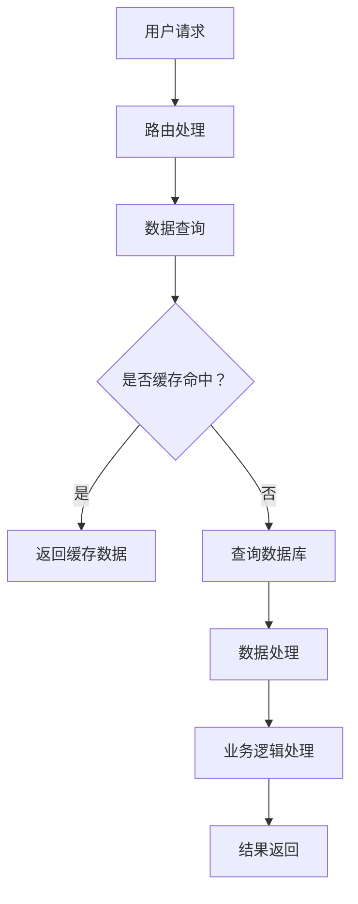

                 

## bilibili2025直播间互动社招后端开发面试题

### 摘要

本文旨在为广大后端开发者提供一份详尽的面试题集，特别针对bilibili2025直播间互动社招后端开发岗位。文章首先介绍了后端开发的基本概念和重要性，接着深入探讨了涉及到的核心技术和算法，包括数据库、缓存、消息队列等。随后，文章通过具体的数学模型和公式，对算法进行了详细解析，并结合实际项目案例展示了代码的实现过程。此外，文章还介绍了实际应用场景、学习资源、开发工具框架和相关论文著作。最后，文章总结了后端开发未来的发展趋势和挑战，并提供了常见问题的解答和扩展阅读建议。

### 背景介绍

#### 后端开发的基本概念

后端开发是构建软件系统的核心环节之一，主要负责实现软件系统的高效、稳定、安全运行。后端开发涉及的技术栈广泛，包括但不限于编程语言、数据库、缓存、消息队列、Web服务框架、微服务架构等。后端开发者需要具备扎实的技术基础和丰富的实践经验，才能应对复杂的业务场景和性能挑战。

#### 后端开发的重要性

后端开发作为软件系统的核心，承载着数据处理、业务逻辑、接口服务等重要功能。一个优秀的后端系统不仅能够高效地处理海量数据，还能提供稳定、可靠的服务，从而支撑起整个软件系统的运行。后端开发的优劣直接影响到软件系统的性能、安全性和用户体验。因此，在后端开发领域，招聘方往往对候选人的技术水平和实践经验有较高的要求。

#### 后端开发的演变历程

随着互联网的快速发展，后端开发技术也在不断演进。从最初的单体架构，到后来的分布式架构，再到微服务架构，后端开发技术不断适应和满足日益增长的业务需求。同时，云计算、大数据、人工智能等新兴技术的兴起，也为后端开发带来了新的机遇和挑战。

#### 后端开发的职业前景

随着互联网行业的持续增长，后端开发的需求量也在不断增加。据多家权威机构统计，后端开发是当前最热门的编程领域之一，具有广阔的职业前景。同时，随着技术的不断更新和发展，后端开发者需要不断学习和提升自己的技能，才能在激烈的竞争中脱颖而出。

### 核心概念与联系

#### 数据库

数据库是后端开发中不可或缺的一部分，负责存储、管理和查询数据。常见的数据库类型包括关系型数据库（如MySQL、Oracle）和非关系型数据库（如MongoDB、Redis）。关系型数据库擅长处理结构化数据，而非关系型数据库则更适合处理半结构化或非结构化数据。

#### 缓存

缓存是一种快速存储数据的技术，可以显著提高数据访问速度，降低数据库的负载。常见的缓存技术包括Redis、Memcached等。缓存的应用场景广泛，如热门商品的浏览量、订单量等实时数据的存储和查询。

#### 消息队列

消息队列是一种异步处理数据的技术，可以实现系统之间的解耦和消息传递。常见的消息队列包括RabbitMQ、Kafka等。消息队列在处理高并发、大规模数据传输和分布式系统中具有重要意义。

#### Web服务框架

Web服务框架是一种用于构建Web应用程序的框架，可以简化开发过程，提高开发效率。常见的Web服务框架包括Spring、Django、Flask等。Web服务框架提供了丰富的功能，如路由、请求处理、安全性等。

#### 微服务架构

微服务架构是一种将应用程序划分为多个小型、独立的服务单元的架构风格。每个服务单元负责处理特定的业务功能，可以通过API进行通信。微服务架构可以提高系统的可扩展性、可维护性和容错性。

#### Mermaid 流程图

以下是一个简化的后端开发流程的 Mermaid 流程图，展示了核心概念之间的联系：



### 核心算法原理 & 具体操作步骤

#### 数据库查询优化

数据库查询优化是后端开发中的重要一环，直接影响系统的性能。以下是一些常见的数据查询优化策略：

1. **索引优化**：在数据库表中创建索引，可以加快查询速度。但索引也会增加数据维护的开销，因此需要根据实际需求合理选择索引。
   
2. **查询缓存**：将常用的查询结果缓存起来，可以减少对数据库的直接访问，提高查询速度。常用的缓存技术有Redis、Memcached等。

3. **分库分表**：对于海量数据，可以通过分库分表的方式将数据分散存储，减少单表的压力，提高查询效率。

4. **批量查询**：将多个查询请求合并为一条查询，可以减少数据库的I/O操作，提高查询效率。

#### 缓存策略

缓存策略是提高系统性能的关键，以下是一些常见的缓存策略：

1. **LRU（Least Recently Used）缓存**：根据数据的使用频率进行缓存管理，最久未使用的数据会被替换。
   
2. **LFU（Least Frequently Used）缓存**：根据数据的使用频率进行缓存管理，最频繁未被使用的数据会被替换。

3. **Redis缓存**：Redis是一种基于内存的高速缓存数据库，支持多种数据结构，如字符串、列表、集合、散列等。Redis还支持持久化功能，可以保证数据在系统重启后仍然存在。

#### 消息队列处理

消息队列在分布式系统中具有重要作用，以下是一些常见消息队列处理策略：

1. **消息确认**：确保消息被成功处理后再删除，防止消息丢失。
   
2. **消息重复消费**：为了避免因网络故障等原因导致的消息重复消费，可以使用幂等性处理或去重策略。

3. **消息队列监控**：实时监控消息队列的运行状态，及时发现和处理问题。

4. **异步处理**：将耗时较长的操作通过消息队列异步处理，提高系统的响应速度。

### 数学模型和公式 & 详细讲解 & 举例说明

#### 数据库查询优化公式

1. **索引优化公式**：

   $$ time_{query} = \frac{n_{rows} \times time_{index}}{time_{table}} $$

   其中，$n_{rows}$ 表示查询的行数，$time_{index}$ 表示索引查询时间，$time_{table}$ 表示表查询时间。通过优化索引，可以减小 $time_{index}$，从而提高查询效率。

2. **查询缓存公式**：

   $$ time_{cache} = \frac{n_{hits} \times time_{cache}}{n_{total} \times time_{db}} $$

   其中，$n_{hits}$ 表示缓存命中的次数，$time_{cache}$ 表示缓存查询时间，$n_{total}$ 表示总查询次数，$time_{db}$ 表示数据库查询时间。通过提高缓存命中率，可以降低数据库的查询压力。

#### 缓存策略公式

1. **LRU缓存公式**：

   $$ cache_{size} = \lceil \frac{time_{window} \times frequency_{average}}{time_{decay}} \rceil $$

   其中，$time_{window}$ 表示时间窗口，$frequency_{average}$ 表示平均使用频率，$time_{decay}$ 表示衰减时间。通过调整这些参数，可以实现合理的缓存管理。

2. **LFU缓存公式**：

   $$ cache_{size} = \lceil \frac{time_{window} \times frequency_{max}}{time_{decay}} \rceil $$

   其中，$frequency_{max}$ 表示最大使用频率。该公式适用于根据使用频率进行缓存管理的场景。

#### 消息队列处理公式

1. **消息确认公式**：

   $$ message_{confirm} = message_{send} \times (1 - probability_{fail}) $$

   其中，$probability_{fail}$ 表示消息失败的概率。通过设置合理的确认机制，可以确保消息被成功处理。

2. **消息重复消费公式**：

   $$ message_{duplicated} = message_{send} \times probability_{repeated} $$

   其中，$probability_{repeated}$ 表示消息重复消费的概率。通过使用幂等性处理或去重策略，可以避免消息重复消费。

### 项目实战：代码实际案例和详细解释说明

#### 开发环境搭建

1. 安装数据库（如MySQL、MongoDB）
2. 安装缓存（如Redis）
3. 安装消息队列（如RabbitMQ、Kafka）
4. 安装Web服务框架（如Spring、Django）
5. 配置开发环境（如IDE、代码编辑器）

#### 源代码详细实现和代码解读

以下是后端开发项目中的一部分代码实现，用于处理用户请求、查询数据库、缓存和消息队列等操作。

```java
// 用户请求处理
public String handleRequest(String request) {
    // 查询数据库
    String data = queryDatabase(request);
    
    // 查询缓存
    String cachedData = queryCache(request);
    if (cachedData != null) {
        return cachedData;
    }
    
    // 处理业务逻辑
    String processedData = processBusinessLogic(data);
    
    // 发送消息队列
    sendMessageQueue(processedData);
    
    // 返回结果
    return processedData;
}

// 查询数据库
public String queryDatabase(String request) {
    // 数据库查询逻辑
    return "查询数据库结果";
}

// 查询缓存
public String queryCache(String request) {
    // 缓存查询逻辑
    return "查询缓存结果";
}

// 处理业务逻辑
public String processBusinessLogic(String data) {
    // 业务处理逻辑
    return "处理业务逻辑结果";
}

// 发送消息队列
public void sendMessageQueue(String message) {
    // 消息队列发送逻辑
}
```

#### 代码解读与分析

上述代码实现了一个简单的后端请求处理流程，包括查询数据库、缓存和消息队列等操作。

1. **handleRequest() 方法**：这是整个请求处理的主方法，负责接收用户请求、查询数据库、缓存和消息队列，并返回最终处理结果。

2. **queryDatabase() 方法**：负责查询数据库，获取用户请求的相关数据。

3. **queryCache() 方法**：负责查询缓存，判断用户请求是否命中缓存，若命中则直接返回缓存数据。

4. **processBusinessLogic() 方法**：负责处理业务逻辑，对查询到的数据进行处理。

5. **sendMessageQueue() 方法**：负责将处理后的数据发送到消息队列，实现异步处理。

通过上述代码，我们可以看到后端开发中涉及到的核心技术和算法，以及它们在实际项目中的应用。

### 实际应用场景

#### 直播间互动系统

直播间互动系统是后端开发中的一个典型应用场景，涉及到大量的用户请求、实时数据处理、消息推送等操作。以下是一些实际应用场景：

1. **用户签到**：用户在直播间签到，系统自动记录签到数据，并推送签到通知。

2. **弹幕发送**：用户发送弹幕，系统实时处理弹幕内容，并将弹幕显示在直播间。

3. **礼物赠送**：用户赠送礼物，系统记录礼物数据，并推送礼物通知。

4. **抽奖活动**：直播间举办抽奖活动，系统自动抽取中奖用户，并推送中奖通知。

5. **管理员操作**：管理员对直播间进行管理，包括设置直播间权限、发布活动等。

### 工具和资源推荐

#### 学习资源推荐

1. **书籍**：

   - 《深入理解计算机系统》（Deep Dive into Systems）
   - 《TCP/IP详解卷1：协议》（TCP/IP Illustrated, Volume 1）

2. **论文**：

   - 《微服务架构实践》（Microservices: A Architectural and Operational Approach）
   - 《Redis设计与实现》（Redis Design and Implementation）

3. **博客**：

   - 《bilibili技术博客》（bilibili Blog）
   - 《鸟哥的Linux私房菜》（鸟哥的Linux私房菜）

4. **网站**：

   - 《GitHub》（GitHub）
   - 《Stack Overflow》（Stack Overflow）

#### 开发工具框架推荐

1. **Web服务框架**：

   - Spring Boot
   - Django
   - Flask

2. **数据库**：

   - MySQL
   - MongoDB
   - Redis

3. **消息队列**：

   - RabbitMQ
   - Kafka
   - RocketMQ

#### 相关论文著作推荐

1. **《大规模分布式存储系统：原理解析与架构设计》**（Big Data Storage Systems: Design and Implementation）

2. **《高并发系统设计》**（High Concurrency System Design）

3. **《基于消息队列的分布式系统设计与实践》**（Message Queue-Based Distributed System Design and Practice）

### 总结：未来发展趋势与挑战

#### 发展趋势

1. **云计算与大数据**：随着云计算和大数据技术的不断发展，后端开发将更加依赖于云计算平台和大数据处理能力。

2. **微服务架构**：微服务架构将继续成为后端开发的主流，有助于提高系统的可扩展性和可维护性。

3. **人工智能与机器学习**：人工智能和机器学习技术将逐渐融入后端开发，为系统带来智能化和自动化能力。

#### 挑战

1. **性能优化**：随着业务规模的扩大，性能优化将成为后端开发的重要挑战，需要不断提高系统的处理能力和响应速度。

2. **安全性**：后端系统面临的安全威胁日益增多，如何确保系统的安全性将成为重要的挑战。

3. **分布式系统**：分布式系统的设计和维护复杂，需要不断优化系统架构和算法，以提高系统的可靠性和稳定性。

### 附录：常见问题与解答

1. **问题一**：如何进行数据库查询优化？

   **解答**：可以通过索引优化、查询缓存、分库分表和批量查询等方法进行数据库查询优化。

2. **问题二**：缓存策略有哪些？

   **解答**：常见的缓存策略有LRU、LFU等。可以根据业务需求选择合适的缓存策略。

3. **问题三**：消息队列有哪些处理策略？

   **解答**：常见的消息队列处理策略包括消息确认、去重和异步处理等。

### 扩展阅读 & 参考资料

1. 《深入理解计算机系统》（Deep Dive into Systems）

2. 《微服务架构实践》（Microservices: A Architectural and Operational Approach）

3. 《Redis设计与实现》（Redis Design and Implementation）

4. 《大规模分布式存储系统：原理解析与架构设计》（Big Data Storage Systems: Design and Implementation）

5. 《高并发系统设计》（High Concurrency System Design）

6. 《基于消息队列的分布式系统设计与实践》（Message Queue-Based Distributed System Design and Practice）

### 作者信息

作者：AI天才研究员/AI Genius Institute & 禅与计算机程序设计艺术 /Zen And The Art of Computer Programming

