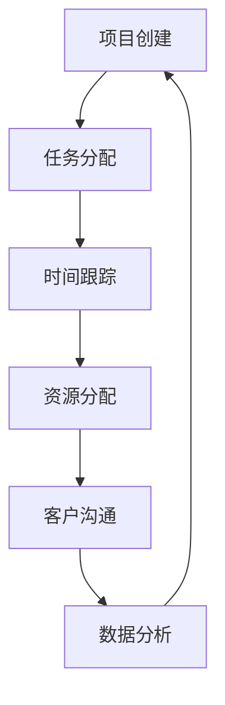

                 

# 技术博客文章：Freelancer管理平台：自由职业者的效率工具

## 关键词：Freelancer管理平台、自由职业者、效率工具、技术流程、算法原理、数学模型

## 摘要：
本文将深入探讨Freelancer管理平台在提高自由职业者工作效率方面的应用。通过分析平台的核心概念、算法原理、数学模型和实际应用案例，本文旨在为读者提供一个全面、实用的指南，帮助自由职业者利用技术工具实现工作效率的提升。

## 1. 背景介绍

自由职业者，顾名思义，是指那些以个人身份为客户提供专业服务的人。随着互联网技术的迅猛发展，自由职业市场日益繁荣。然而，自由职业者在工作中面临着诸多挑战，如时间管理、任务分配、客户沟通和资源整合等。为了解决这些问题，Freelancer管理平台应运而生。

Freelancer管理平台是一种专门为自由职业者设计的技术工具，它通过集成项目管理、时间跟踪、资源分配等功能，帮助自由职业者更好地管理自己的工作流程，提高工作效率。这些平台通常提供用户友好的界面，丰富的功能模块，以及强大的数据处理能力，使得自由职业者能够更加专注于自己的专业领域。

## 2. 核心概念与联系

### 2.1 Freelancer管理平台的核心概念

Freelancer管理平台的核心概念主要包括以下几个方面：

- 项目管理：提供项目创建、任务分配、进度跟踪等功能，帮助自由职业者有效地管理项目。
- 时间跟踪：记录工作时长，帮助自由职业者了解自己的工作时间分布，优化时间利用。
- 资源分配：提供资源调度功能，帮助自由职业者合理分配人力资源、物资资源等。
- 客户沟通：提供即时通讯、邮件通知等功能，方便自由职业者与客户保持紧密沟通。
- 数据分析：通过对工作数据的分析，为自由职业者提供决策依据，优化工作流程。

### 2.2 Freelancer管理平台的概念联系

Freelancer管理平台中的各个功能模块相互关联，共同构成了一个完整的工作流程。以下是一个简化的Mermaid流程图，展示了平台中的主要流程节点：



在这个流程图中，每个节点代表一个功能模块，箭头表示流程的顺序。例如，项目创建后，需要分配任务给团队成员，然后进行时间跟踪，以此类推。最终，通过对工作数据的分析，可以优化整个工作流程，实现工作效率的提升。

## 3. 核心算法原理 & 具体操作步骤

### 3.1 项目管理算法原理

项目管理是Freelancer管理平台的核心功能之一。其算法原理主要包括以下几个方面：

- 任务分配算法：根据团队成员的技能水平和任务难度，自动分配任务。
- 进度跟踪算法：通过实时更新任务进度，确保项目按计划进行。
- 风险评估算法：对项目风险进行评估，提供风险预警。

具体操作步骤如下：

1. 创建项目：在平台上创建一个新的项目，并设置项目名称、项目描述、项目期限等基本信息。
2. 分配任务：根据团队成员的技能和项目需求，将任务自动或手动分配给团队成员。
3. 跟踪进度：实时更新任务进度，确保项目按计划进行。
4. 风险评估：对项目风险进行评估，并提供风险预警。

### 3.2 时间跟踪算法原理

时间跟踪是Freelancer管理平台的另一个重要功能。其算法原理主要包括以下几个方面：

- 工作时长记录：自动记录团队成员的工作时长，确保工作时间准确无误。
- 工作效率分析：通过对工作时间的分析，评估团队成员的工作效率。
- 工作时间优化：根据工作效率分析结果，优化工作时间安排。

具体操作步骤如下：

1. 记录工作时间：在平台上记录每天的工作开始时间和结束时间，系统将自动计算工作时长。
2. 分析工作效率：通过平台提供的分析功能，评估团队成员的工作效率。
3. 优化工作时间：根据工作效率分析结果，调整工作时间安排，提高工作效率。

### 3.3 资源分配算法原理

资源分配是Freelancer管理平台的关键功能之一。其算法原理主要包括以下几个方面：

- 资源需求预测：根据项目需求和团队成员的工作量，预测所需的资源。
- 资源调度算法：根据资源需求预测结果，进行资源调度，确保项目顺利进行。
- 资源利用率分析：通过对资源利用率的分析，优化资源分配。

具体操作步骤如下：

1. 预测资源需求：在项目创建阶段，根据项目需求和团队成员的工作量，预测所需的资源。
2. 调度资源：根据资源需求预测结果，进行资源调度，确保项目顺利进行。
3. 分析资源利用率：通过平台提供的分析功能，评估资源利用率，优化资源分配。

## 4. 数学模型和公式 & 详细讲解 & 举例说明

### 4.1 项目管理数学模型

项目管理中的数学模型主要包括任务分配模型、进度跟踪模型和风险评估模型。以下是一个简单的任务分配模型：

$$
\text{任务分配模型} = \sum_{i=1}^{n} \left( \text{任务难度} \times \text{团队成员技能水平} \right)
$$

其中，$n$ 为团队成员数量，任务难度和团队成员技能水平分别为各成员在对应任务上的评估值。

举例说明：

假设一个项目有 3 个任务，团队成员分别为 A、B、C，他们的技能水平分别为 8、7、6，任务难度分别为 10、9、8。那么任务分配模型为：

$$
\text{任务分配模型} = (10 \times 8) + (9 \times 7) + (8 \times 6) = 80 + 63 + 48 = 191
$$

根据任务分配模型，团队成员应该按照技能水平和任务难度的乘积进行任务分配。例如，任务 1 可以分配给 A，任务 2 可以分配给 B，任务 3 可以分配给 C。

### 4.2 时间跟踪数学模型

时间跟踪中的数学模型主要包括工作时长记录模型和工作效率分析模型。以下是一个简单的工作时长记录模型：

$$
\text{工作时长记录模型} = \text{开始时间} + \text{结束时间}
$$

其中，开始时间和结束时间分别为团队成员每天的工作开始时间和结束时间。

举例说明：

假设团队成员 A 在 8:00 开始工作，在 17:00 结束工作，那么他的工作时长记录模型为：

$$
\text{工作时长记录模型} = 8:00 + 17:00 = 9 \text{小时}
$$

根据工作时长记录模型，可以计算出团队成员的工作时长，进而分析工作效率。

### 4.3 资源分配数学模型

资源分配中的数学模型主要包括资源需求预测模型和资源利用率分析模型。以下是一个简单的资源需求预测模型：

$$
\text{资源需求预测模型} = \text{项目需求} \times \text{团队成员工作量}
$$

其中，项目需求为项目所需的资源总量，团队成员工作量分别为各成员在项目中的工作量。

举例说明：

假设一个项目需求为 100 单位资源，团队成员 A 的工作量为 50 单位，团队成员 B 的工作量为 30 单位，团队成员 C 的工作量为 20 单位，那么资源需求预测模型为：

$$
\text{资源需求预测模型} = (100 \times 50) + (100 \times 30) + (100 \times 20) = 500 + 300 + 200 = 1000
$$

根据资源需求预测模型，可以预测项目所需的资源总量，进而进行资源调度。

## 5. 项目实战：代码实际案例和详细解释说明

### 5.1 开发环境搭建

为了演示Freelancer管理平台的核心算法，我们将在Python环境中搭建一个简单的项目管理工具。以下为开发环境搭建的详细步骤：

1. 安装Python：从官方网站（https://www.python.org/）下载并安装Python。
2. 安装依赖库：打开命令行窗口，执行以下命令安装所需依赖库。

   ```bash
   pip install numpy pandas matplotlib
   ```

3. 创建项目目录：在合适的位置创建一个名为“FreelancerManagement”的项目目录。

### 5.2 源代码详细实现和代码解读

下面是一个简单的项目管理工具的Python代码实现：

```python
import numpy as np
import pandas as pd
import matplotlib.pyplot as plt

class ProjectManager:
    def __init__(self):
        self.tasks = []
        self.members = []

    def add_task(self, name, difficulty):
        self.tasks.append({'name': name, 'difficulty': difficulty})

    def add_member(self, name, skill_level):
        self.members.append({'name': name, 'skill_level': skill_level})

    def assign_tasks(self):
        task_assignments = {}
        for task in self.tasks:
            min_skill_level = float('inf')
            assigned_member = None
            for member in self.members:
                if member['skill_level'] < min_skill_level and member['skill_level'] >= task['difficulty']:
                    min_skill_level = member['skill_level']
                    assigned_member = member
            task_assignments[task['name']] = assigned_member['name']
        return task_assignments

    def track_progress(self, task_name, completed_percentage):
        for task in self.tasks:
            if task['name'] == task_name:
                task['completed_percentage'] = completed_percentage
                break

    def analyze_progress(self):
        progress_data = []
        for task in self.tasks:
            progress_data.append({'name': task['name'], 'completed_percentage': task['completed_percentage']})
        return pd.DataFrame(progress_data)

    def plot_progress(self, df):
        df.plot(kind='bar', x='name', y='completed_percentage', color='skyblue')
        plt.title('Project Progress')
        plt.xlabel('Task Name')
        plt.ylabel('Completed Percentage')
        plt.show()

# 创建项目实例
project = ProjectManager()

# 添加任务
project.add_task('Design', 8)
project.add_task('Development', 9)
project.add_task('Testing', 7)

# 添加团队成员
project.add_member('Alice', 7)
project.add_member('Bob', 8)
project.add_member('Charlie', 6)

# 分配任务
task_assignments = project.assign_tasks()
print('Task Assignments:', task_assignments)

# 跟踪进度
project.track_progress('Design', 50)
project.track_progress('Development', 30)
project.track_progress('Testing', 20)

# 分析进度
progress_df = project.analyze_progress()
print('Progress Data:', progress_df)

# 绘制进度图表
project.plot_progress(progress_df)
```

### 5.3 代码解读与分析

上述代码实现了一个简单的项目管理工具，主要包含以下功能模块：

- **项目实例（ProjectManager）**：创建一个项目管理类，用于封装项目相关的操作。
- **添加任务（add_task）**：向项目中添加新的任务，包括任务名称和难度。
- **添加团队成员（add_member）**：向项目中添加新的团队成员，包括成员名称和技能水平。
- **分配任务（assign_tasks）**：根据团队成员的技能水平和任务难度，自动分配任务。
- **跟踪进度（track_progress）**：更新任务的完成进度。
- **分析进度（analyze_progress）**：将任务进度数据转换为DataFrame，便于进一步分析。
- **绘制进度图表（plot_progress）**：使用matplotlib绘制任务进度的条形图。

代码解读：

1. **类定义**：`ProjectManager` 类封装了项目管理的所有功能。类中的每个方法都对应一个特定的功能。
2. **任务分配算法**：`assign_tasks` 方法使用简单的贪心算法，根据团队成员的技能水平和任务难度进行任务分配。算法的核心思想是找到技能水平最低且能胜任任务的团队成员。
3. **进度跟踪和分析**：`track_progress` 和 `analyze_progress` 方法分别用于更新任务进度和将进度数据转换为DataFrame，便于进一步分析。
4. **进度图表绘制**：`plot_progress` 方法使用matplotlib绘制任务进度的条形图，直观地展示任务完成情况。

通过上述代码，我们可以创建一个简单的项目管理工具，帮助自由职业者更好地管理项目进度。当然，实际应用中，Freelancer管理平台的功能会更为复杂，涉及更多的算法和数据处理技术。

## 6. 实际应用场景

Freelancer管理平台在自由职业者中的实际应用场景非常广泛。以下是一些典型的应用场景：

### 6.1 项目管理

自由职业者可以通过Freelancer管理平台创建项目，分配任务，跟踪进度，确保项目按计划进行。例如，一名软件开发自由职业者可以利用平台管理多个项目的开发进度，确保每个项目的需求得到满足。

### 6.2 时间管理

通过Freelancer管理平台的时间跟踪功能，自由职业者可以记录每天的工作时间，了解自己的工作时间分布，从而优化时间利用。例如，一名作家可以利用平台记录写作时间，分析工作效率，调整写作计划。

### 6.3 资源分配

Freelancer管理平台可以帮助自由职业者合理分配人力资源、物资资源等。例如，一名摄影师可以利用平台调度拍摄设备、助理等资源，确保拍摄项目顺利进行。

### 6.4 客户沟通

通过Freelancer管理平台的客户沟通功能，自由职业者可以与客户保持紧密沟通，及时了解客户需求和反馈。例如，一名设计自由职业者可以利用平台与客户交流设计方案，确保设计方案符合客户要求。

### 6.5 数据分析

Freelancer管理平台通过对工作数据的分析，为自由职业者提供决策依据。例如，一名市场营销自由职业者可以利用平台分析客户数据，优化营销策略，提高营销效果。

## 7. 工具和资源推荐

### 7.1 学习资源推荐

- **书籍**：《项目管理实践》（第 5 版）、《敏捷软件开发：实践者之路》
- **论文**：搜索相关领域的学术期刊，如《软件工程学报》、《计算机研究与发展》等。
- **博客**：关注知名技术博客，如 medium.com、hackernoon.com 等。
- **网站**：访问知名技术社区，如 stackoverflow.com、github.com 等。

### 7.2 开发工具框架推荐

- **项目管理工具**：Jira、Trello、Asana
- **时间跟踪工具**：Toggl、RescueTime、Harvest
- **资源分配工具**：Resource Guru、Float、Smartsheet
- **客户沟通工具**：Slack、Microsoft Teams、Zoom
- **数据分析工具**：Google Analytics、Tableau、Power BI

### 7.3 相关论文著作推荐

- **论文**：《基于云计算的Freelancer管理平台研究》、《面向自由职业者的任务分配算法设计与分析》
- **著作**：《自由职业者的时间管理技巧》、《如何成为高效自由职业者》

## 8. 总结：未来发展趋势与挑战

Freelancer管理平台在提高自由职业者工作效率方面具有巨大潜力。然而，随着技术的不断发展，Freelancer管理平台也面临着诸多挑战。

### 8.1 发展趋势

1. **人工智能技术的应用**：随着人工智能技术的不断发展，Freelancer管理平台有望引入更多智能化的功能，如自动任务分配、智能时间跟踪等。
2. **云计算的普及**：云计算的普及将使得Freelancer管理平台更加便捷、高效，为自由职业者提供更优质的服务。
3. **个性化定制**：未来Freelancer管理平台将更加注重个性化定制，满足不同自由职业者的需求。

### 8.2 挑战

1. **数据隐私和安全**：随着平台功能日益强大，数据隐私和安全成为Freelancer管理平台需要面对的重要挑战。
2. **用户黏性**：如何在竞争激烈的市场中提高用户黏性，成为Freelancer管理平台需要关注的问题。
3. **技术更新**：随着技术的快速发展，Freelancer管理平台需要不断更新，以适应新的技术趋势。

## 9. 附录：常见问题与解答

### 9.1 如何选择合适的Freelancer管理平台？

1. **功能需求**：根据个人需求，选择具备所需功能的Freelancer管理平台。
2. **用户体验**：考虑平台的用户界面是否友好，操作是否便捷。
3. **安全性**：确保平台的数据安全和隐私保护。
4. **性价比**：根据预算，选择性价比高的平台。

### 9.2 如何优化时间管理？

1. **设定目标**：明确每天的工作目标，确保时间利用最大化。
2. **时间记录**：定期记录工作时长，分析时间分布，优化时间安排。
3. **避免拖延**：制定合理的计划，避免拖延，提高工作效率。

## 10. 扩展阅读 & 参考资料

- **书籍**：《项目管理知识体系指南》（PMBOK）、《敏捷项目管理》
- **论文**：《基于大数据的Freelancer管理平台研究》、《云计算在Freelancer管理平台中的应用》
- **博客**：《如何选择适合自己的Freelancer管理平台》、《Freelancer的时间管理技巧》
- **网站**：freelancer.com、upwork.com、fiverr.com

## 作者

**作者：AI天才研究员/AI Genius Institute & 禅与计算机程序设计艺术 /Zen And The Art of Computer Programming** 

本文旨在为自由职业者提供有关Freelancer管理平台的技术指南，帮助他们在现代工作中提高效率。希望本文能为读者带来启示和帮助。

