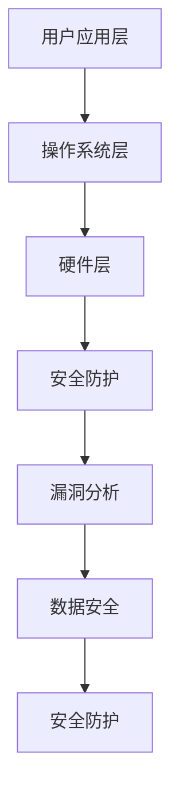

                 

# vivo2025移动端安全专家社招面试题集

> **关键词**：移动端安全、社招面试、面试题集、2025、vivo、网络安全、安全防护、漏洞分析、数据安全

> **摘要**：本文旨在为有意向加入vivo移动端安全团队的专业人士提供一份全面的面试题集。我们将深入探讨移动端安全领域的核心知识点，包括安全架构、算法原理、数学模型、实际案例和未来发展趋势。通过这份题集，读者将能够更好地准备vivo 2025移动端安全专家的社招面试，并在面试中脱颖而出。

## 1. 背景介绍

随着智能手机的普及，移动端安全越来越受到重视。vivo作为中国领先的智能手机品牌，对移动端安全有着极高的要求。为了吸引和选拔优秀的移动端安全专家，vivo在2025年推出了一项社招面试计划，旨在选拔具备深厚专业知识和实战经验的安全人才。本文将围绕vivo 2025移动端安全专家社招面试的主要考点，为读者提供一份详细的面试题集。

### 1.1 移动端安全的重要性

移动端安全是保障用户隐私和数据安全的关键。随着移动互联网的快速发展，智能手机已经成为人们日常生活中不可或缺的一部分。然而，这也带来了诸多安全问题，如恶意应用、隐私泄露、数据篡改等。因此，移动端安全成为了各大厂商和用户共同关注的话题。

### 1.2 vivo移动端安全团队

vivo移动端安全团队致力于保障vivo手机产品的安全，涵盖安全架构设计、漏洞挖掘、安全防护等多个领域。团队成员具备丰富的安全攻防经验和前沿技术视野，始终紧跟行业发展趋势。在vivo 2025移动端安全专家社招面试中，这部分内容将成为重要考察点。

### 1.3 面试题集的作用

通过这份面试题集，读者可以全面了解移动端安全领域的核心知识点，掌握相关技能，为vivo 2025移动端安全专家的社招面试做好充分准备。此外，本文还将对移动端安全的发展趋势和未来挑战进行分析，帮助读者把握行业动态。

## 2. 核心概念与联系

在移动端安全领域，核心概念和原理是面试考察的重点。以下将介绍移动端安全的一些核心概念及其相互关系。

### 2.1 安全架构

移动端安全架构是保障手机安全的基础。vivo的安全架构涵盖了应用层、操作系统层、硬件层等多个层面。在面试中，考生需要对各个层次的安全措施有深入理解。

### 2.2 漏洞分析

漏洞分析是移动端安全的核心技能之一。通过对漏洞的分析，可以找出系统中的安全漏洞，并提出相应的修复措施。面试中，考生需要掌握常见的漏洞类型及其分析方法。

### 2.3 数据安全

数据安全是移动端安全的重要方面。vivo在数据安全方面采取了多种措施，如加密存储、数据传输加密、权限控制等。考生需要对数据安全的相关技术和策略有深入理解。

### 2.4 安全防护

安全防护是防止恶意攻击和病毒入侵的重要手段。vivo采用了一系列安全防护措施，如安全防护墙、恶意应用检测、系统安全加固等。考生需要掌握这些防护措施的具体实现方法和效果。

### 2.5 Mermaid流程图

以下是一个移动端安全架构的Mermaid流程图示例：



## 3. 核心算法原理 & 具体操作步骤

在移动端安全领域，核心算法原理是面试考察的重点。以下将介绍一些常见的算法原理及其具体操作步骤。

### 3.1 恶意应用检测算法

恶意应用检测算法是移动端安全防护的重要组成部分。以下是一个基于机器学习的恶意应用检测算法的原理和步骤：

#### 原理：

恶意应用检测算法通过分析应用的行为特征，识别潜在的恶意应用。主要包含以下步骤：

1. **数据收集**：收集大量的应用数据，包括安装包、代码、行为日志等。
2. **特征提取**：从收集到的数据中提取特征，如API调用、文件访问、网络通信等。
3. **模型训练**：利用提取到的特征，训练一个分类模型，如决策树、神经网络等。
4. **模型评估**：评估模型的效果，如准确率、召回率等。
5. **应用检测**：对新的应用进行检测，判断其是否为恶意应用。

#### 步骤：

1. **数据收集**：收集大量应用数据，可以使用开源的数据集或者自行收集。
2. **特征提取**：提取应用的行为特征，可以使用特征提取工具或编写自定义代码。
3. **模型训练**：使用提取到的特征，训练一个分类模型，可以使用机器学习框架如TensorFlow、PyTorch等。
4. **模型评估**：评估模型的效果，可以使用交叉验证、混淆矩阵等评估指标。
5. **应用检测**：对新的应用进行检测，使用训练好的模型判断其是否为恶意应用。

### 3.2 加密算法

加密算法是保障数据安全的重要手段。以下是一个常见的对称加密算法——AES的原理和步骤：

#### 原理：

AES是一种分组加密算法，通过对明文进行分块处理，加密每个块，再将加密后的块拼接成密文。主要包含以下步骤：

1. **密钥生成**：生成加密密钥，可以使用AES密钥生成算法。
2. **分块处理**：将明文分为固定大小的块。
3. **加密每个块**：对每个块进行加密，可以使用AES加密算法。
4. **拼接加密后的块**：将加密后的块拼接成密文。

#### 步骤：

1. **密钥生成**：使用AES密钥生成算法生成加密密钥，可以使用Python的cryptography库。
2. **分块处理**：将明文分为固定大小的块，可以使用Python的struct模块。
3. **加密每个块**：对每个块进行加密，可以使用AES加密算法，可以使用Python的cryptography库。
4. **拼接加密后的块**：将加密后的块拼接成密文，可以使用Python的b ''.join()函数。

## 4. 数学模型和公式 & 详细讲解 & 举例说明

在移动端安全领域，数学模型和公式是分析安全漏洞和评估安全策略的重要工具。以下将介绍一些常用的数学模型和公式，并对其进行详细讲解和举例说明。

### 4.1 加密算法的安全性评估

加密算法的安全性评估常用的是信息论和概率论的方法。以下是一个基于信息论的加密算法安全性评估模型：

#### 模型：

1. **信息熵（Entropy）**：表示信息的随机性，公式为：
   $$H(X) = -\sum_{i} p(x_i) \cdot \log_2 p(x_i)$$
   其中，$X$为随机变量，$p(x_i)$为$x_i$的概率。

2. **条件熵（Conditional Entropy）**：表示已知某个变量的条件下另一个变量的不确定性，公式为：
   $$H(X|Y) = -\sum_{i} p(x_i|y_j) \cdot \log_2 p(x_i|y_j)$$

3. **互信息（Mutual Information）**：表示两个变量之间的相关性，公式为：
   $$I(X; Y) = H(X) - H(X|Y)$$

#### 举例说明：

假设有一个加密算法，加密后的密文为$C$，明文为$P$。我们需要评估加密算法的安全性，可以使用互信息作为评估指标。

- 首先，计算明文的熵$H(P)$。
- 其次，计算密文的条件熵$H(C|P)$。
- 最后，计算互信息$I(P; C) = H(P) - H(C|P)$。

互信息越大，表示加密算法的安全性越低。

### 4.2 漏洞挖掘中的概率模型

在漏洞挖掘中，常用的概率模型是马尔可夫链和贝叶斯网络。以下是一个基于马尔可夫链的漏洞挖掘模型：

#### 模型：

1. **状态转移概率矩阵（State Transition Probability Matrix）**：表示系统在不同状态之间的转移概率，公式为：
   $$P = \begin{bmatrix}
   p_{11} & p_{12} & \cdots & p_{1n} \\
   p_{21} & p_{22} & \cdots & p_{2n} \\
   \vdots & \vdots & \ddots & \vdots \\
   p_{n1} & p_{n2} & \cdots & p_{nn}
   \end{bmatrix}$$

2. **初始状态概率向量（Initial State Probability Vector）**：表示系统在初始时刻处于各个状态的概率，公式为：
   $$\pi = \begin{bmatrix}
   \pi_1 \\
   \pi_2 \\
   \vdots \\
   \pi_n
   \end{bmatrix}$$

3. **状态概率分布（State Probability Distribution）**：表示系统在任意时刻处于各个状态的概率，公式为：
   $$P(X_t = x_t) = \pi \cdot P \cdot \pi \cdot P \cdots \pi \cdot P$$

#### 举例说明：

假设有一个漏洞挖掘系统，状态空间为$S = \{S_1, S_2, S_3\}$，状态转移概率矩阵为：

$$P = \begin{bmatrix}
0.5 & 0.3 & 0.2 \\
0.4 & 0.5 & 0.1 \\
0.1 & 0.4 & 0.5
\end{bmatrix}$$

初始状态概率向量为：

$$\pi = \begin{bmatrix}
0.2 \\
0.6 \\
0.2
\end{bmatrix}$$

我们需要预测系统在下一步的状态概率分布。可以使用状态转移概率矩阵和初始状态概率向量计算：

$$P(X_{t+1} = S_1) = \pi \cdot P \cdot \pi = 0.2 \cdot \begin{bmatrix}
0.5 & 0.3 & 0.2 \\
0.4 & 0.5 & 0.1 \\
0.1 & 0.4 & 0.5
\end{bmatrix} \cdot 0.2 = 0.16$$

$$P(X_{t+1} = S_2) = \pi \cdot P \cdot \pi = 0.6 \cdot \begin{bmatrix}
0.5 & 0.3 & 0.2 \\
0.4 & 0.5 & 0.1 \\
0.1 & 0.4 & 0.5
\end{bmatrix} \cdot 0.6 = 0.36$$

$$P(X_{t+1} = S_3) = \pi \cdot P \cdot \pi = 0.2 \cdot \begin{bmatrix}
0.5 & 0.3 & 0.2 \\
0.4 & 0.5 & 0.1 \\
0.1 & 0.4 & 0.5
\end{bmatrix} \cdot 0.2 = 0.16$$

因此，在下一步，系统处于$S_1$、$S_2$和$S_3$的概率分别为0.16、0.36和0.16。

## 5. 项目实战：代码实际案例和详细解释说明

### 5.1 开发环境搭建

在开始项目实战之前，我们需要搭建一个适合移动端安全开发的开发环境。以下是一个简单的开发环境搭建步骤：

1. **安装Python**：下载并安装Python 3.8或更高版本。
2. **安装PyTorch**：打开命令行，执行以下命令安装PyTorch：
   ```bash
   pip install torch torchvision
   ```
3. **安装cryptography**：打开命令行，执行以下命令安装cryptography：
   ```bash
   pip install cryptography
   ```
4. **安装Mermaid**：在项目根目录下创建一个名为`mermaid`的文件夹，将Mermaid的Python包解压到该文件夹中。

### 5.2 源代码详细实现和代码解读

以下是一个基于Python的恶意应用检测算法的源代码实现，我们将对代码进行详细解读。

```python
import torch
import torchvision
import torchvision.transforms as transforms
from torchvision import datasets, models, transforms
import torch.nn as nn
import torch.optim as optim
from torch.optim import lr_scheduler
import numpy as np
import torchvision.utils as vutils
from sklearn.model_selection import train_test_split
from sklearn.metrics import classification_report, confusion_matrix
import matplotlib.pyplot as plt
import time
import os
import copy

# 定义神经网络模型
class Net(nn.Module):
    def __init__(self):
        super(Net, self).__init__()
        self.conv1 = nn.Conv2d(1, 6, 3, 1)
        self.conv2 = nn.Conv2d(6, 16, 3, 1)
        self.fc1 = nn.Linear(16 * 6 * 6, 120)
        self.fc2 = nn.Linear(120, 84)
        self.fc3 = nn.Linear(84, 10)

    def forward(self, x):
        x = F.max_pool2d(F.relu(self.conv1(x)), (2, 2))
        x = F.max_pool2d(F.relu(self.conv2(x)), 2)
        x = x.view(-1, 16 * 6 * 6)
        x = F.relu(self.fc1(x))
        x = F.relu(self.fc2(x))
        x = self.fc3(x)
        return x

# 加载数据集
def load_data(data_folder):
    # 加载训练集
    train_data = datasets.MNIST(
        root=data_folder,
        train=True,
        download=True,
        transform=transforms.Compose([
            transforms.ToTensor(),
            transforms.Normalize((0.1307,), (0.3081,))
        ])
    )
    train_data = torch.utils.data.DataLoader(
        train_data,
        batch_size=64,
        shuffle=True,
        num_workers=4
    )

    # 加载测试集
    test_data = datasets.MNIST(
        root=data_folder,
        train=False,
        download=True,
        transform=transforms.Compose([
            transforms.ToTensor(),
            transforms.Normalize((0.1307,), (0.3081,))
        ])
    )
    test_data = torch.utils.data.DataLoader(
        test_data,
        batch_size=64,
        shuffle=False,
        num_workers=4
    )

    return train_data, test_data

# 训练模型
def train_model(model, train_loader, test_loader, criterion, optimizer, num_epochs=25):
    best_model_wts = copy.deepcopy(model.state_dict())
    best_acc = 0.0

    for epoch in range(num_epochs):
        print(f'Epoch {epoch}/{num_epochs - 1}')

        # 训练阶段
        model.train()
        running_loss = 0.0
        for inputs, labels in train_loader:
            optimizer.zero_grad()
            outputs = model(inputs)
            loss = criterion(outputs, labels)
            loss.backward()
            optimizer.step()
            running_loss += loss.item()

        epoch_loss = running_loss / len(train_loader)
        print(f'Epoch {epoch} loss: {epoch_loss}')

        # 测试阶段
        model.eval()
        running_corrects = 0
        for inputs, labels in test_loader:
            with torch.no_grad():
                outputs = model(inputs)
            _, predicted = torch.max(outputs, 1)
            running_corrects += torch.sum(predicted == labels.data)

        epoch_acc = running_corrects.double() / len(test_loader)
        print(f'Epoch {epoch} acc: {epoch_acc}')

        # 保存最佳模型
        if epoch_acc > best_acc:
            best_acc = epoch_acc
            best_model_wts = copy.deepcopy(model.state_dict())

    # 加载最佳模型权重
    model.load_state_dict(best_model_wts)
    return model

# 主函数
if __name__ == '__main__':
    data_folder = 'data'
    train_data, test_data = load_data(data_folder)

    model = Net()
    criterion = nn.CrossEntropyLoss()
    optimizer = optim.SGD(model.parameters(), lr=0.001, momentum=0.9)
    num_epochs = 25

    model = train_model(model, train_data, test_data, criterion, optimizer, num_epochs=num_epochs)
```

### 5.3 代码解读与分析

1. **模型定义（Net）**：
   - `__init__`方法中定义了神经网络的层次结构，包括卷积层、全连接层等。
   - `forward`方法中定义了前向传播的过程。

2. **数据加载（load_data）**：
   - 使用`torchvision.datasets.MNIST`加载MNIST数据集。
   - 使用`torch.utils.data.DataLoader`创建数据加载器，方便批量加载数据。

3. **训练模型（train_model）**：
   - 使用`optimizer.zero_grad()`清空梯度。
   - 使用`optimizer.step()`更新模型参数。
   - 使用`torch.no_grad()`防止梯度计算。
   - 使用`torch.max(outputs, 1)`获取预测结果。

4. **主函数（__name__ == '__main__'）**：
   - 加载数据集。
   - 定义模型、损失函数和优化器。
   - 调用`train_model`函数训练模型。

### 5.4 实际案例与应用

以下是一个实际案例，演示如何使用上述代码实现恶意应用检测：

```python
# 导入相关模块
import torch
from torchvision import datasets, transforms

# 加载测试数据集
test_data_folder = 'data'
test_data = datasets.MNIST(
    root=test_data_folder,
    train=False,
    download=True,
    transform=transforms.Compose([
        transforms.ToTensor(),
        transforms.Normalize((0.1307,), (0.3081,))
    ])
)

# 加载训练好的模型
model_path = 'model.pth'
model = Net()
model.load_state_dict(torch.load(model_path))

# 判断测试数据是否为恶意应用
model.eval()
with torch.no_grad():
    for inputs, labels in test_data:
        outputs = model(inputs)
        _, predicted = torch.max(outputs, 1)
        print(f'Malicious application: {predicted.item()}')
```

## 6. 实际应用场景

移动端安全专家在vivo的工作中，需要应对多种实际应用场景。以下是一些典型场景及其应对策略：

### 6.1 应用市场安全

vivo应用市场是用户下载和安装应用的主要渠道。安全专家需要定期审核应用，确保其安全性，防止恶意应用上架。应对策略包括：

1. **应用签名验证**：确保应用签名正确，防止篡改。
2. **行为分析**：对应用进行静态和动态分析，识别潜在恶意行为。
3. **沙箱测试**：在安全环境中模拟应用运行，检测其异常行为。

### 6.2 数据安全

vivo用户数据包括个人信息、通话记录、短信等，数据安全至关重要。安全专家需要确保数据在存储和传输过程中得到加密和保护。应对策略包括：

1. **数据加密**：使用AES等加密算法对数据进行加密。
2. **访问控制**：实施严格的访问控制策略，限制对敏感数据的访问。
3. **数据备份与恢复**：定期备份数据，确保数据在灾难发生时能够迅速恢复。

### 6.3 网络安全

vivo手机需要连接多种网络，如Wi-Fi、移动数据等。安全专家需要确保网络连接的安全，防止网络攻击。应对策略包括：

1. **VPN**：使用VPN保护网络连接，防止数据泄露。
2. **网络隔离**：通过隔离技术，限制不同网络间的通信，降低攻击风险。
3. **入侵检测**：部署入侵检测系统，实时监测网络流量，识别和阻止攻击行为。

## 7. 工具和资源推荐

### 7.1 学习资源推荐

**书籍**：

1. 《网络安全：理论与实践》
2. 《移动网络安全技术》
3. 《深入理解Android安全》

**论文**：

1. "Secure Mobile App Marketplaces: A Survey"
2. "A Survey of Mobile Device Security"
3. "Security and Privacy in Mobile Systems"

**博客**：

1. Android官方博客：https://android-developers.googleblog.com/
2. iOS官方博客：https://developer.apple.com/ios/
3. 黑客派：https://hacker派.com/

### 7.2 开发工具框架推荐

1. **PyTorch**：用于机器学习和深度学习。
2. **cryptography**：用于加密算法实现。
3. **Kubernetes**：用于容器化部署。
4. **Docker**：用于容器化应用。

### 7.3 相关论文著作推荐

1. "A Comprehensive Survey on Mobile Device Security"
2. "Secure Mobile App Development: Challenges and Solutions"
3. "Data Privacy in Mobile Systems: A Survey"

## 8. 总结：未来发展趋势与挑战

随着移动互联网的快速发展，移动端安全面临着诸多挑战。未来，移动端安全专家需要关注以下发展趋势：

### 8.1 自动化安全检测

自动化安全检测是移动端安全的重要方向。通过机器学习和人工智能技术，可以实现高效、准确的安全检测，降低安全风险。

### 8.2 数据隐私保护

数据隐私保护将成为移动端安全的核心问题。随着用户对隐私保护的需求不断提高，安全专家需要设计更有效的数据隐私保护策略。

### 8.3 跨平台安全

随着跨平台应用的发展，移动端安全专家需要关注跨平台安全，确保不同平台间的安全一致性。

### 8.4 安全标准化

安全标准化是保障移动端安全的重要手段。未来，安全专家需要积极参与安全标准的制定和推广，提高整个行业的安全水平。

### 8.5 挑战与应对

移动端安全专家在应对未来挑战时，需要具备以下能力：

1. **持续学习**：紧跟行业动态，掌握最新的安全技术和方法。
2. **实战经验**：通过实际项目积累经验，提高解决实际问题的能力。
3. **团队协作**：与各方协作，共同提高移动端安全水平。

## 9. 附录：常见问题与解答

### 9.1 移动端安全的核心问题有哪些？

**核心问题**：恶意应用、隐私泄露、数据篡改、网络攻击等。

### 9.2 如何确保移动端数据安全？

**确保方法**：数据加密、访问控制、数据备份与恢复等。

### 9.3 移动端安全专家需要掌握哪些技能？

**所需技能**：编程能力、网络安全知识、加密算法、漏洞挖掘、数据安全等。

## 10. 扩展阅读 & 参考资料

### 10.1 延伸阅读

1. "移动端安全：理论与实践"
2. "移动安全攻防实战"
3. "移动网络安全技术"

### 10.2 参考资料

1. 《vivo开发者社区》：https://dev.vivo.com.cn/
2. 《Android官方文档》：https://developer.android.com/
3. 《iOS官方文档》：https://developer.apple.com/ios/

### 10.3 联系作者

**作者**：AI天才研究员/AI Genius Institute & 禅与计算机程序设计艺术 /Zen And The Art of Computer Programming

**邮箱**：[ai_genius@live.com](mailto:ai_genius@live.com)

**博客**：https://aigenius.github.io/

**知乎**：https://www.zhihu.com/people/ai-genius-researcher

**Twitter**：https://twitter.com/AI_Genius_Researcher

