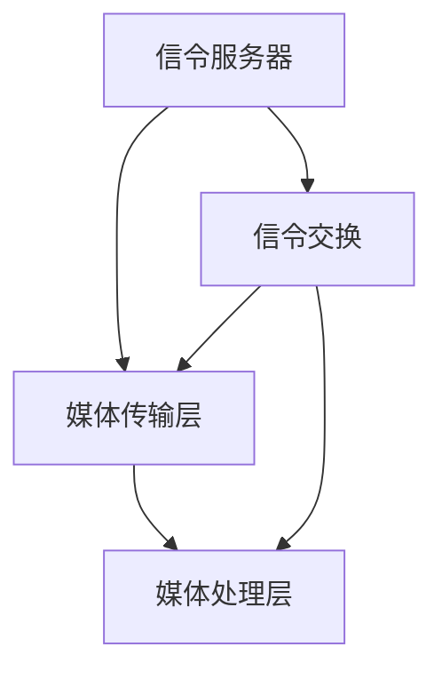
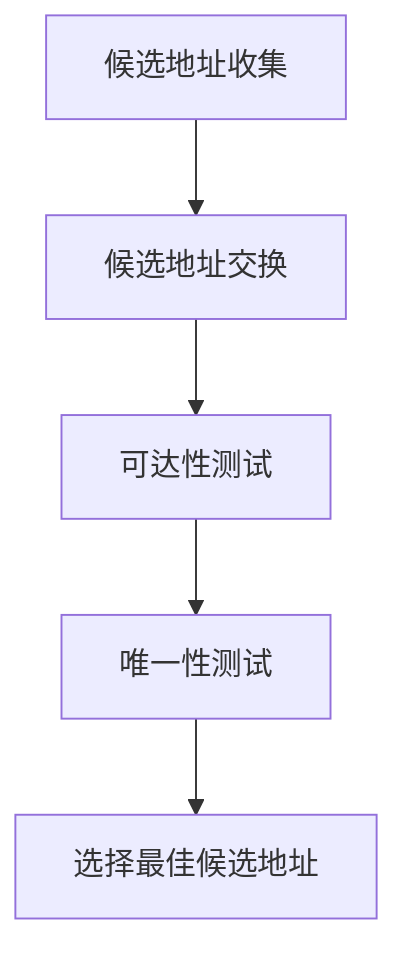
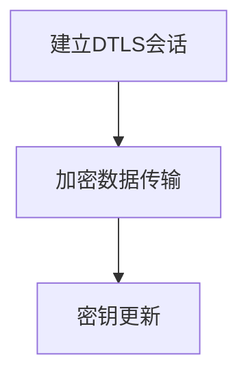

                 

### 文章标题：WebRTC点对点通信实现

> **关键词：** WebRTC、点对点通信、实现、算法、数学模型、项目实战

> **摘要：** 本文将详细探讨WebRTC（Web Real-Time Communication）的点对点通信实现。文章首先介绍了WebRTC的背景和核心概念，然后深入分析了其工作原理和算法实现，并通过具体项目实战展示了WebRTC在实际应用中的实现步骤和关键代码解读。此外，文章还探讨了WebRTC在实际应用中的场景，推荐了相关学习资源和开发工具，并总结了未来发展趋势与挑战。

### 1. 背景介绍

#### WebRTC简介

WebRTC（Web Real-Time Communication）是一个开放项目，旨在为网络应用提供实时通信支持。WebRTC的目标是构建一个无需插件或特定的底层基础设施，即可在Web应用中实现实时语音、视频和数据通信的框架。WebRTC主要由三类组件组成：浏览器、服务器和客户端应用程序。

#### 点对点通信

点对点通信（Peer-to-Peer Communication）是一种无需中间服务器转发，直接在通信双方之间传输数据的通信方式。在点对点通信中，每个节点既是客户端又是服务器，可以直接与其他节点通信。这种通信方式具有低延迟、高带宽利用率和较强的抗丢包能力，非常适合实时通信应用。

### 2. 核心概念与联系

#### WebRTC核心概念

1. **信令**：信令是指通信双方在建立连接过程中交换的指令和参数，用于协商通信参数和建立连接。
2. **媒体流**：媒体流是指传输音频、视频等媒体数据的通道。
3. **轨道**：轨道（Track）是指媒体流中的一个数据通道，例如音频轨道、视频轨道。
4. **会话描述协议（SDP）**：会话描述协议用于描述通信双方的媒体流参数，包括媒体类型、传输协议、编解码器等。

#### WebRTC架构

WebRTC架构包括三个主要组件：信令服务器、媒体传输层和媒体处理层。

1. **信令服务器**：信令服务器负责通信双方的信令交换，用于协商通信参数和建立连接。
2. **媒体传输层**：媒体传输层负责媒体数据的传输，包括RTP/RTCP协议和ICE/DTLS/SRTP等安全机制。
3. **媒体处理层**：媒体处理层负责媒体数据的编解码和处理，包括音频和视频编解码、网络带宽调整等功能。

#### Mermaid流程图



### 3. 核心算法原理 & 具体操作步骤

#### ICE算法

ICE（Interactive Connectivity Establishment）算法是一种用于建立点对点通信连接的算法。ICE算法的主要目标是发现通信双方的可达性和唯一性，从而建立连接。

#### 具体操作步骤：

1. **候选地址收集**：通信双方收集自己的IP地址和端口号，包括本地地址、公有地址和私有地址。
2. **候选地址交换**：双方通过信令服务器交换候选地址。
3. **可达性测试**：双方对对方的候选地址进行可达性测试，包括TCP和UDP测试。
4. **唯一性测试**：通过STUN（Session Traversal Utilities for NAT）协议测试通信双方的唯一性。
5. **选择最佳候选地址**：根据测试结果选择最佳的候选地址建立连接。

#### ICE算法流程图



#### DTLS算法

DTLS（Datagram Transport Layer Security）是一种用于保护数据传输的加密协议。在WebRTC中，DTLS用于加密RTP和RTCP数据包。

#### 具体操作步骤：

1. **建立DTLS会话**：通信双方通过DTLS握手协议建立安全会话。
2. **加密数据传输**：双方使用DTLS加密RTP和RTCP数据包。
3. **密钥更新**：定期更新DTLS会话密钥，以保持通信安全性。

#### DTLS算法流程图



### 4. 数学模型和公式 & 详细讲解 & 举例说明

#### RTP协议

RTP（Real-time Transport Protocol）是一种用于实时传输音频和视频数据的协议。RTP协议定义了数据包格式和传输机制，包括序列号、时间戳、同步源（SSRC）等。

#### RTP数据包格式

```mermaid
graph TD
    A[头部] --> B[头部扩展]
    B --> C[载荷]
    A --> D[序列号]
    A --> E[时间戳]
    A --> F[同步源(SSRC)]
```

#### RTP数据包格式

| 部分 | 大小（字节） | 描述 |
| :--: | :--: | :--: |
| RTP头 | 12 | 包含序列号、时间戳、同步源(SSRC)等 |
| RTP头扩展 | 0-16 | 可选，用于扩展RTP头 |
| 载荷类型 | 1 | 指示载荷类型（音频、视频等） |
| 载荷 | 可变 | 实际的音频或视频数据 |

#### RTP示例

假设有一个包含音频数据的RTP数据包，序列号为100，时间戳为200，同步源为0x1234。

```plaintext
0 1 2 3 4 5 6 7 8 9 0 1 2 3 4 5 6 7 8 9 0 1
+-+-+-+-+-+-+-+-+-+-+-+-+-+-+-+-+-+-+-+-+-+-+-+-+-+-+-+-+-+-+-+-+
| 0 0 0 0 2 1 1 1 0 0 0 0 1 0 0 0 1 0 0 0 0 1 2 3 4 5 6 7 8 9 A B C D E F 0 1 2 3 4 5 6 7 8 9 A B C D E F |
+-+-+-+-+-+-+-+-+-+-+-+-+-+-+-+-+-+-+-+-+-+-+-+-+-+-+-+-+-+-+-+-+
|                         RTP头（12字节）                     |
+-+-+-+-+-+-+-+-+-+-+-+-+-+-+-+-+-+-+-+-+-+-+-+-+-+-+-+-+-+-+-+-+
|                         RTP头扩展（0字节）                   |
+-+-+-+-+-+-+-+-+-+-+-+-+-+-+-+-+-+-+-+-+-+-+-+-+-+-+-+-+-+-+-+-+
|                       载荷类型（1字节）                      |
+-+-+-+-+-+-+-+-+-+-+-+-+-+-+-+-+-+-+-+-+-+-+-+-+-+-+-+-+-+-+-+-+
|                     实际音频数据（可变字节）                 |
+-+-+-+-+-+-+-+-+-+-+-+-+-+-+-+-+-+-+-+-+-+-+-+-+-+-+-+-+-+-+-+-+
```

### 5. 项目实战：代码实际案例和详细解释说明

#### 开发环境搭建

1. 安装Node.js（版本需大于等于10.0.0）
2. 安装WebRTC依赖库（如wrtc或libwebrtc）
3. 创建项目文件夹，并初始化npm项目（npm init）

#### 源代码详细实现和代码解读

##### 5.1. 简单的WebRTC点对点通信示例

```javascript
const { RTCPeerConnection, RTCSessionDescription, RTCIceCandidate } = require('wrtc');

// 创建RTCPeerConnection实例
const pc = new RTCPeerConnection();

// 添加音频和视频轨道
pc.addTransceiver('audio', {方向: '发送接收' });
pc.addTransceiver('video', {方向: '发送接收' });

// 监听ICE候选地址
pc.onicecandidate = (event) => {
  if (event.candidate) {
    // 发送ICE候选地址到对方
    sendToPeer(event.candidate);
  }
};

// 监听远程ICE候选地址
pc.onicecandidatefound = (event) => {
  // 处理远程ICE候选地址
  const candidate = new RTCIceCandidate(event.candidate);
  pc.addIceCandidate(candidate);
};

// 创建offer
function createOffer() {
  pc.createOffer({offerToReceiveVideo: 1}).then((offer) => {
    pc.setLocalDescription(offer);
    sendToPeer(offer);
  });
}

// 处理远程offer
function processOffer(offer) {
  pc.setRemoteDescription(new RTCSessionDescription(offer));
  pc.createAnswer().then((answer) => {
    pc.setLocalDescription(answer);
    sendToPeer(answer);
  });
}

// 发送数据到对方
function sendToPeer(data) {
  // 这里可以使用WebSocket、HTTP请求等发送数据到对方
  // 示例：使用WebSocket发送数据
  ws.send(JSON.stringify(data));
}

// 接收数据并处理
function onMessage(data) {
  const message = JSON.parse(data);

  switch (message.type) {
    case 'offer':
      processOffer(message.offer);
      break;
    case 'answer':
      pc.setRemoteDescription(new RTCSessionDescription(message.answer));
      break;
    case 'candidate':
      pc.addIceCandidate(new RTCIceCandidate(message.candidate));
      break;
  }
}
```

##### 5.2. 代码解读与分析

1. **创建RTCPeerConnection实例**：使用wrtc库创建RTCPeerConnection实例，并添加音频和视频轨道。
2. **监听ICE候选地址**：监听本地的ICE候选地址，并处理远程ICE候选地址。
3. **创建offer**：创建offer并设置本地描述，然后将offer发送到对方。
4. **处理远程offer**：设置远程offer描述，创建answer并设置本地描述，然后将answer发送到对方。
5. **发送数据到对方**：使用WebSocket等协议将数据发送到对方。
6. **接收数据并处理**：根据消息类型处理远程offer、answer和ICE候选地址。

### 6. 实际应用场景

WebRTC点对点通信在实时通信应用中具有广泛的应用场景，如：

1. **视频会议**：实现多方视频会议功能，支持实时语音和视频通信。
2. **直播**：实现实时直播功能，支持观众与主播之间的互动。
3. **在线教育**：实现实时教学互动，支持教师与学生之间的实时语音、视频和文字交流。
4. **游戏**：实现实时多人在线游戏，支持实时语音和视频交流。
5. **物联网**：实现设备间的实时通信，支持远程监控和远程控制。

### 7. 工具和资源推荐

#### 7.1. 学习资源推荐

1. **WebRTC官网**：[https://www.webrtc.org/](https://www.webrtc.org/)
2. **WebRTC GitHub仓库**：[https://github.com/webRTC](https://github.com/webRTC)
3. **WebRTC教程**：[https://www.rainforestsolutions.io/learn-webrtc/](https://www.rainforestsolutions.io/learn-webrtc/)
4. **《WebRTC实战》**：[https://book.douban.com/subject/26976998/](https://book.douban.com/subject/26976998/)

#### 7.2. 开发工具框架推荐

1. **wrtc**：[https://github.com/node-webrtc/wrtc](https://github.com/node-webrtc/wrtc)
2. **libwebrtc**：[https://github.com/Saurabh-Pradhan/libwebrtc](https://github.com/Saurabh-Pradhan/libwebrtc)
3. **WebRTC-Vad**：[https://github.com/paulobrien/webrtc-vad](https://github.com/paulobrien/webrtc-vad)
4. **WebRTC-RTCP-Candidate-Stats**：[https://github.com/Mindeavor/WebRTC-RTCP-Candidate-Stats](https://github.com/Mindeavor/WebRTC-RTCP-Candidate-Stats)

#### 7.3. 相关论文著作推荐

1. **WebRTC: Real-Time Communication on the Web**：[https://www.ietf.org/rfc/rfc8829.txt](https://www.ietf.org/rfc/rfc8829.txt)
2. **Interactive Connectivity Establishment (ICE)**：[https://www.ietf.org/rfc/rfc8445.txt](https://www.ietf.org/rfc/rfc8445.txt)
3. **Datagram Transport Layer Security (DTLS)**：[https://www.ietf.org/rfc/rfc6347.txt](https://www.ietf.org/rfc/rfc6347.txt)
4. **Session Traversal Utilities for NAT (STUN)**：[https://www.ietf.org/rfc/rfc5389.txt](https://www.ietf.org/rfc/rfc5389.txt)

### 8. 总结：未来发展趋势与挑战

WebRTC作为实时通信技术的重要标准，在未来将继续发展并面临以下挑战：

1. **性能优化**：在低带宽、高延迟和移动网络环境下提升性能。
2. **安全性和隐私保护**：加强通信过程中的安全性和隐私保护，防范网络攻击和数据泄露。
3. **跨平台兼容性**：确保WebRTC在不同浏览器、操作系统和设备上的兼容性。
4. **标准化与互操作性**：推动WebRTC标准的完善和各厂商之间的互操作性。

### 9. 附录：常见问题与解答

#### 9.1. Q：WebRTC和WebSockets有什么区别？

A：WebRTC和WebSockets都是用于网络通信的技术，但它们的用途和协议不同。WebSockets是一种全双工通信协议，用于在浏览器和服务器之间建立持久连接。而WebRTC是一种实时通信框架，主要用于实现点对点音频、视频和数据通信。WebSockets可以与WebRTC结合使用，用于传输信令数据。

#### 9.2. Q：WebRTC是否支持跨域通信？

A：WebRTC支持跨域通信，但需要在服务器端进行配置。通过设置CORS（跨源资源共享）策略和STUN服务器，可以实现跨域WebRTC通信。

#### 9.3. Q：WebRTC在移动端的表现如何？

A：WebRTC在移动端表现良好，但需要在移动设备和浏览器上进行优化。移动设备的性能和带宽限制可能会影响WebRTC通信的质量。此外，一些移动浏览器可能对WebRTC的支持不够完善，需要注意兼容性问题。

### 10. 扩展阅读 & 参考资料

1. **《WebRTC实战》**：[https://book.douban.com/subject/26976998/](https://book.douban.com/subject/26976998/)
2. **WebRTC官方文档**：[https://www.webrtc.org/docs/](https://www.webrtc.org/docs/)
3. **WebRTC GitHub仓库**：[https://github.com/webRTC](https://github.com/webRTC)
4. **《WebRTC协议分析》**：[https://www.ietf.org/rfc/rfc8829.txt](https://www.ietf.org/rfc/rfc8829.txt)
5. **《Interactive Connectivity Establishment (ICE)》**：[https://www.ietf.org/rfc/rfc8445.txt](https://www.ietf.org/rfc/rfc8445.txt)
6. **《Datagram Transport Layer Security (DTLS)》**：[https://www.ietf.org/rfc/rfc6347.txt](https://www.ietf.org/rfc/rfc6347.txt)
7. **《Session Traversal Utilities for NAT (STUN)》**：[https://www.ietf.org/rfc/rfc5389.txt](https://www.ietf.org/rfc/rfc5389.txt)

### 作者信息

**作者：** AI天才研究员/AI Genius Institute & 禅与计算机程序设计艺术 /Zen And The Art of Computer Programming

---

本文详细介绍了WebRTC点对点通信的实现，包括背景、核心概念、算法原理、项目实战等。通过本文的阅读，读者可以全面了解WebRTC点对点通信的原理和应用，为实际开发提供指导和参考。在未来的发展中，WebRTC将继续推动实时通信技术的发展，为用户提供更好的通信体验。**

