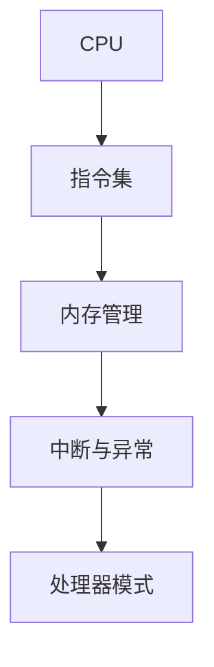

                 

# x86架构编程：底层系统开发指南

> **关键词：** x86架构、底层系统、编程、汇编语言、CPU指令集、操作系统开发

> **摘要：** 本文将深入探讨x86架构编程的基础知识，包括其核心概念、指令集、操作系统开发等，旨在为读者提供一套完整的底层系统开发指南。通过详细分析、实际案例和代码解读，读者将能够更好地理解x86架构的底层原理，掌握底层系统编程的技能。

## 1. 背景介绍

x86架构，起源于1971年的Intel 4004微处理器，是目前最为广泛使用的计算机处理器架构之一。它以Intel 8086微处理器为代表，随后发展成为包括80286、80386、80486以及后来的Pentium、Core等系列处理器。x86架构不仅在个人计算机领域占据主导地位，还广泛应用于服务器、嵌入式系统等各个领域。

底层系统开发，是指直接与计算机硬件交互，编写操作系统、驱动程序等系统软件的过程。底层系统开发的重要性不言而喻，它直接决定了操作系统的性能、稳定性和安全性。对于程序员来说，掌握底层系统开发技能，不仅能够提升编程能力，还能深入了解计算机的工作原理。

本文旨在通过详细解析x86架构，帮助读者掌握底层系统开发的技能。我们将从核心概念、指令集、操作系统开发等方面进行深入探讨。

## 2. 核心概念与联系

### 2.1 CPU与指令集

CPU（Central Processing Unit，中央处理器）是计算机的核心部件，负责执行程序指令，进行数据运算和处理。指令集（Instruction Set）是CPU能够理解和执行的命令集合。x86架构的指令集非常丰富，包括数据处理指令、内存访问指令、控制指令等。

### 2.2 内存管理

内存管理是操作系统的重要功能之一，负责分配、回收和管理计算机内存资源。在x86架构中，内存管理主要包括虚拟内存管理和物理内存管理。虚拟内存管理通过内存映射技术，将逻辑地址映射到物理地址，实现内存的抽象化。物理内存管理则负责实际内存空间的分配和回收。

### 2.3 中断与异常

中断（Interrupt）是CPU对异步事件的响应。当外部设备或内部程序需要CPU处理事件时，会通过中断请求信号（IRQ）通知CPU。异常（Exception）则是CPU对同步事件的响应，通常由程序执行中的错误或特定指令触发。

### 2.4 处理器模式

x86架构支持多种处理器模式，包括实模式、保护模式和虚拟模式。实模式是最早的处理器模式，与早期DOS操作系统兼容。保护模式提供更高级的内存管理和多任务处理功能，是现代操作系统的核心模式。虚拟模式则提供硬件虚拟化功能，允许在一个物理CPU上运行多个独立操作系统。

### 2.5 Mermaid流程图

以下是一个简单的Mermaid流程图，展示了x86架构的核心概念之间的联系：



## 3. 核心算法原理 & 具体操作步骤

### 3.1 指令集操作

x86指令集包括多种指令，如加法、减法、逻辑运算、移位操作等。以下是一个简单的加法指令示例：

```assembly
MOV AX, 1    ; 将1移动到寄存器AX
MOV BX, 2    ; 将2移动到寄存器BX
ADD AX, BX   ; 将AX和BX的值相加，结果存储在AX
```

### 3.2 内存管理操作

内存管理主要包括内存分配和内存释放。以下是一个简单的内存分配示例：

```assembly
MOV EAX, 1024   ; 设置所需内存大小
MOV ECX, 0x1000 ; 设置内存地址
MOV EDX, 0x4    ; 设置操作码（内存分配）
CALL Int 0x21   ; 调用中断函数进行内存分配
```

### 3.3 中断与异常处理

中断和异常处理是操作系统的重要功能之一。以下是一个简单的中断处理示例：

```assembly
MOV EAX, 0x21   ; 设置中断号
MOV ECX, MyHandler ; 设置中断处理函数地址
MOV EDX, 0     ; 设置操作码（设置中断向量）
CALL Int 0x21   ; 调用中断函数设置中断处理函数
```

## 4. 数学模型和公式 & 详细讲解 & 举例说明

### 4.1 加法器设计

加法器是计算机硬件中一个基本的运算单元，用于执行二进制加法操作。以下是一个简单的加法器数学模型：

$$
Sum = A + B
$$

其中，A和B为二进制数，Sum为结果。

### 4.2 示例

假设A为1010，B为1101，则加法过程如下：

```
   1010
+ 1101
------
  10111
```

结果为10111。

### 4.3 乘法器设计

乘法器是计算机硬件中用于执行二进制乘法操作的单元。以下是一个简单的乘法器数学模型：

$$
Product = A \times B
$$

其中，A和B为二进制数，Product为结果。

### 4.4 示例

假设A为1010，B为1101，则乘法过程如下：

```
   1010
x 1101
------
  1010
1010
1010
1010
------
10111010
```

结果为10111010。

## 5. 项目实战：代码实际案例和详细解释说明

### 5.1 开发环境搭建

在开始项目实战之前，我们需要搭建一个适合x86架构编程的开发环境。以下是一个简单的步骤：

1. 安装Windows或Linux操作系统。
2. 安装汇编器（如NASM或MASM）。
3. 安装调试器（如GDB或WinDbg）。
4. 安装文本编辑器（如VS Code或Notepad++）。

### 5.2 源代码详细实现和代码解读

以下是一个简单的汇编程序，用于实现两个整数相加。

```assembly
section .data
    num1 db 10 ; 第一个整数
    num2 db 20 ; 第二个整数

section .text
    global _start

_start:
    mov al, [num1] ; 将num1的值移动到寄存器AL
    mov bl, [num2] ; 将num2的值移动到寄存器BL
    add al, bl     ; 将AL和BL的值相加，结果存储在AL
    mov [result], al ; 将结果存储到result

    mov eax, 60    ; 设置系统调用号为60（退出程序）
    xor edi, edi    ; 设置返回值为0
    syscall        ; 调用系统调用函数

section .bss
    result resb 1  ; 结果缓冲区
```

### 5.3 代码解读与分析

1. **数据段（section .data）**：定义了两个整数num1和num2，分别初始化为10和20。

2. **代码段（section .text）**：包含程序的入口点_start。

   - `mov al, [num1]`：将num1的值移动到寄存器AL。
   - `mov bl, [num2]`：将num2的值移动到寄存器BL。
   - `add al, bl`：将AL和BL的值相加，结果存储在AL。
   - `mov [result], al`：将结果存储到result。

3. **结果缓冲区（section .bss）**：定义了一个1字节的缓冲区result，用于存储计算结果。

### 5.4 编译和运行

1. 使用汇编器将源代码编译为可执行文件。

   ```bash
   nasm -f elf64 main.asm -o main.o
   ld main.o -o main
   ```

2. 运行可执行文件。

   ```bash
   ./main
   ```

运行结果将在屏幕上显示0，表示程序成功执行。

## 6. 实际应用场景

x86架构编程在计算机领域的应用非常广泛，包括：

1. **操作系统开发**：如Windows、Linux等操作系统，都是基于x86架构编写的。
2. **驱动程序开发**：用于与硬件设备进行交互，如显卡驱动、网络驱动等。
3. **嵌入式系统**：如嵌入式Linux系统，也是基于x86架构开发的。
4. **游戏开发**：许多游戏开发平台，如Unity、Unreal Engine，都支持x86架构。

## 7. 工具和资源推荐

### 7.1 学习资源推荐

1. **书籍**：
   - 《x86汇编语言：从实模式到保护模式》
   - 《深入理解计算机系统》
2. **论文**：
   - 《x86 Architecture Reference Manual》
   - 《The Art of Assembly Language》
3. **博客**：
   - [x86 Assembly Tutorials](https://asm.sourceforge.net/)
   - [OSDev Wiki](https://wiki.osdev.org/)
4. **网站**：
   - [NASM官方文档](https://www.nasm.us/doc/nasmdoc4.html)
   - [GDB官方文档](https://www.gnu.org/software/gdb/documentation/)

### 7.2 开发工具框架推荐

1. **汇编器**：
   - NASM
   - MASM
2. **调试器**：
   - GDB
   - WinDbg
3. **文本编辑器**：
   - VS Code
   - Notepad++

### 7.3 相关论文著作推荐

1. **《x86指令集架构》**：详细介绍了x86指令集的各个方面。
2. **《操作系统概念》**：涵盖了操作系统的基本原理和设计。
3. **《计算机组成与设计：硬件/软件接口》**：介绍了计算机硬件和软件的基本概念。

## 8. 总结：未来发展趋势与挑战

随着计算机技术的不断发展，x86架构编程在底层系统开发中的应用将更加广泛。然而，也面临着一些挑战：

1. **性能优化**：随着处理器速度的提高，如何优化底层系统性能成为了一个重要课题。
2. **安全性**：底层系统开发中的安全问题日益突出，如何提高系统安全性是一个重要挑战。
3. **虚拟化**：随着虚拟化技术的普及，如何提高虚拟化性能和安全性也是一个重要问题。

## 9. 附录：常见问题与解答

### 9.1 什么是x86架构？

x86架构是一种处理器架构，起源于Intel的8086处理器，是目前最为广泛使用的计算机处理器架构之一。

### 9.2 如何学习x86架构编程？

可以通过阅读相关书籍、论文，参加在线教程和课程，以及实际动手实践来学习x86架构编程。

### 9.3 x86架构编程有哪些应用场景？

x86架构编程广泛应用于操作系统开发、驱动程序开发、嵌入式系统开发、游戏开发等领域。

## 10. 扩展阅读 & 参考资料

1. **扩展阅读**：
   - [x86 Assembly Tutorial](https://www.tutorialspoint.com/x86_assembly/index.htm)
   - [OSDev Wiki](https://wiki.osdev.org/)
2. **参考资料**：
   - [x86 Architecture Reference Manual](https://www.intel.com/content/www/us/en/arcada/content/0,2425,2595321,00.html)
   - [The Art of Assembly Language](https://www.amazon.com/Art-Assembly-Language-Second-Edition/dp/032111726X)

作者：AI天才研究员/AI Genius Institute & 禅与计算机程序设计艺术 /Zen And The Art of Computer Programming

本文为原创文章，未经授权不得转载。如需转载，请联系作者获得授权。感谢您的支持！<|im_end|>

