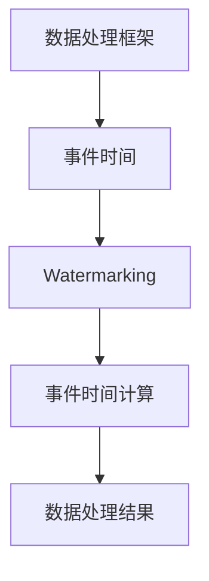
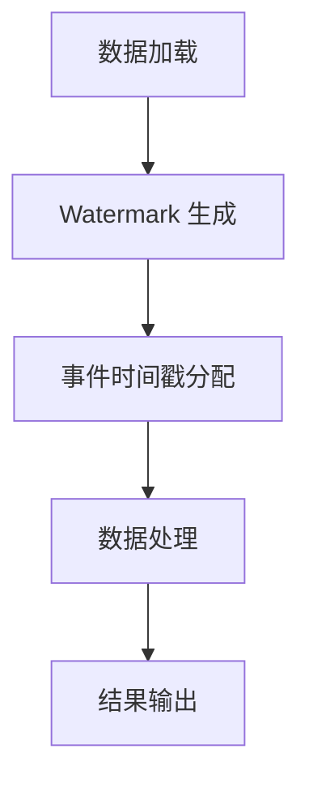

                 

### 背景介绍

#### 大数据计算的发展背景

随着信息时代的到来，数据量呈现出爆炸式增长。这种增长不仅仅体现在传统的数据库系统中，更体现在社交媒体、物联网、移动互联网等新兴领域。大数据计算，作为处理和分析海量数据的核心技术，应运而生。大数据计算的核心目标是从大规模数据集中提取有价值的信息和知识，以支持企业决策、科学研究和社会治理。

大数据计算的发展可以分为几个关键阶段：

1. **存储技术**：最早的数据存储技术主要是磁盘阵列和分布式文件系统，如HDFS（Hadoop Distributed File System）。
2. **数据处理技术**：随着数据量的增大，传统的单机数据处理方法已经无法满足需求。MapReduce（一种编程模型）应运而生，它将数据处理任务分解为多个独立的小任务，然后并行执行，大大提高了数据处理效率。
3. **实时计算技术**：在处理实时数据的需求下，Spark、Flink等实时数据处理框架被开发出来，能够快速响应实时数据流，并提供低延迟的数据处理。
4. **机器学习和人工智能**：大数据计算与机器学习和人工智能的结合，使得从数据中提取复杂模式和知识成为可能，进一步推动了大数据计算技术的发展。

#### 事件时间的概念

在数据分析和数据处理中，事件时间是其中一个非常重要的概念。事件时间是指数据中记录的某个事件发生的实际时间。与处理时间（数据处理开始的时间）和摄入时间（数据被系统记录的时间）不同，事件时间通常与数据的实际发生时间相关，因此更贴近真实情况。

事件时间的重要性体现在以下几个方面：

1. **时间序列分析**：在时间序列分析中，事件时间是理解数据随时间变化的趋势的关键。例如，在股市分析中，事件时间可以帮助我们理解股票价格的波动情况。
2. **实时处理**：在实时数据处理中，事件时间用于确定数据流的处理顺序。例如，在股票交易系统中，事件时间可以确保交易按照实际发生的时间顺序进行处理。
3. **窗口计算**：在窗口计算中，事件时间用于定义窗口的起始和结束时间。例如，在计算一小时内的交易量时，事件时间可以帮助确定哪些交易属于这个时间窗口。

接下来，我们将深入探讨事件时间的计算原理和方法，以及如何在实际应用中实现事件时间计算。

### 核心概念与联系

在深入探讨事件时间的计算原理之前，我们需要先理解一些核心概念，包括数据处理框架、事件时间概念、Watermarking（水印）技术，以及它们之间的相互联系。

#### 1. 数据处理框架

在现代大数据处理中，常用的数据处理框架包括Apache Flink、Apache Spark等。这些框架支持多种数据处理模式，如批处理和流处理。

- **批处理**：批处理是处理大量静态数据的一种方式。数据处理任务通常在数据全部加载到内存中后一次性完成。这种方式的优点是可以处理大规模数据集，缺点是响应时间较长，不适合处理实时数据。
- **流处理**：流处理是处理实时数据的一种方式。数据处理任务实时地从数据流中读取数据，并立即进行处理。这种方式的特点是响应时间短，可以实时获取数据的变化。

#### 2. 事件时间概念

事件时间（Event Time）是数据中记录的某个事件发生的实际时间。与处理时间（Processing Time）和摄入时间（Ingestion Time）不同，处理时间是数据处理开始的时间，摄入时间是数据被系统记录的时间。

事件时间在数据分析和处理中非常重要，因为它提供了数据发生的实际时间，可以用于时间序列分析、实时处理和窗口计算。

#### 3. Watermarking（水印）技术

Watermarking 是一种用于标记数据时间戳的技术，它可以帮助确定事件时间。水印技术的基本原理是：

- **生成水印**：在数据处理过程中，系统会生成一个水印，水印包含当前已处理的数据的时间戳。
- **传递水印**：水印通过数据流传递，并在数据处理过程中与其他数据的时间戳进行比较。
- **确定事件时间**：通过比较数据的时间戳和当前水印，可以确定数据的事件时间。

#### 4. 各概念之间的联系

数据处理框架、事件时间概念和Watermarking 技术之间存在紧密的联系：

- **数据处理框架**：数据处理框架提供了事件时间计算的基础设施，如Apache Flink 和 Apache Spark 提供了Watermarking 机制。
- **事件时间概念**：事件时间是数据分析和处理的核心概念，它决定了数据的处理顺序和结果。
- **Watermarking 技术**：Watermarking 技术是实现事件时间计算的关键技术，它帮助确定数据的时间戳和事件时间。

下面是一个 Mermaid 流程图，展示了这些概念之间的相互关系：



- **数据处理框架**：提供数据处理的基础设施。
- **事件时间**：数据中记录的某个事件发生的实际时间。
- **Watermarking**：一种用于标记数据时间戳的技术。
- **事件时间计算**：通过数据处理框架和Watermarking 技术确定数据的事件时间。
- **数据处理结果**：根据事件时间计算的结果进行数据分析和处理。

通过理解这些核心概念和它们之间的联系，我们可以更好地掌握事件时间的计算原理和方法。在接下来的章节中，我们将深入探讨事件时间计算的具体实现步骤和算法。

### 核心算法原理 & 具体操作步骤

事件时间的计算是大数据处理中一个关键环节，它决定了数据处理的顺序和结果。在本节中，我们将详细探讨事件时间计算的核心算法原理和具体操作步骤。

#### 1. Watermark 生成算法

Watermark 是事件时间计算的基础，它是一个标记数据时间戳的特殊值。Watermark 生成算法的核心思想是：

- **初始 Watermark**：初始 Watermark 通常设置为最小时间戳。在数据加载到系统时，系统会生成一个初始 Watermark。
- **更新 Watermark**：在数据处理过程中，系统会根据新的数据时间戳更新 Watermark。具体来说，每次新数据的时间戳小于当前 Watermark 时，系统会将 Watermark 更新为该时间戳。

下面是一个简单的 Watermark 生成算法步骤：

1. **初始化**：设置初始 Watermark 为最小时间戳。
2. **读取新数据**：从数据流中读取新数据。
3. **比较时间戳**：比较新数据的时间戳和当前 Watermark。
4. **更新 Watermark**：如果新数据的时间戳小于当前 Watermark，则更新 Watermark 为新数据的时间戳。
5. **重复步骤 2-4**：继续读取新数据并更新 Watermark，直到数据处理结束。

#### 2. 事件时间戳分配算法

事件时间戳分配算法用于确定每个数据的事件时间。事件时间戳分配的核心思想是：

- **基于 Watermark**：每个数据的事件时间戳基于当前 Watermark 计算。
- **时间戳偏移**：事件时间戳等于数据时间戳加上一个时间戳偏移。

时间戳偏移是一个常数，用于调整事件时间戳，使其更接近数据的实际发生时间。下面是一个简单的事件时间戳分配算法步骤：

1. **初始化**：设置时间戳偏移为一个常数。
2. **读取新数据**：从数据流中读取新数据。
3. **计算事件时间戳**：事件时间戳 = 数据时间戳 + 时间戳偏移。
4. **更新事件时间戳**：如果新数据的事件时间戳大于当前事件时间戳，则更新事件时间戳为新数据的事件时间戳。
5. **重复步骤 2-4**：继续读取新数据并更新事件时间戳，直到数据处理结束。

#### 3. 事件时间计算流程

事件时间计算的完整流程包括以下几个步骤：

1. **数据加载**：将数据加载到系统，生成初始 Watermark。
2. **Watermark 生成**：根据数据时间戳生成和更新 Watermark。
3. **事件时间戳分配**：根据 Watermark 和时间戳偏移分配事件时间戳。
4. **数据处理**：根据事件时间戳对数据进行处理。
5. **结果输出**：输出处理结果。

下面是一个简单的事件时间计算流程：



#### 4. 算法实现示例

为了更好地理解事件时间计算算法，我们通过一个示例来说明其具体实现步骤。

假设有一个包含股票交易数据的数据流，每条数据记录了交易时间、股票代码和交易金额。

1. **数据加载**：
    ```sql
    SELECT transaction_time, stock_code, transaction_amount
    FROM stock_transactions;
    ```
2. **Watermark 生成**：
    ```python
    initial_watermark = min(transaction_time)
    ```
3. **事件时间戳分配**：
    ```python
    timestamp_offset = 0
    event_time = transaction_time + timestamp_offset
    ```
4. **数据处理**：
    ```python
    # 根据事件时间戳进行数据处理
    processed_data = process_data_by_event_time(event_time)
    ```
5. **结果输出**：
    ```python
    print(processed_data)
    ```

通过这个示例，我们可以看到事件时间计算算法是如何在实际场景中应用的。事件时间计算不仅提高了数据处理的准确性，还使得实时数据处理成为可能。

### 数学模型和公式 & 详细讲解 & 举例说明

在事件时间计算中，数学模型和公式起着至关重要的作用。它们不仅帮助我们理解事件时间的概念，还为我们提供了计算事件时间的具体方法。在本节中，我们将详细介绍事件时间计算中的关键数学模型和公式，并通过具体例子进行讲解。

#### 1. 时间戳偏移计算公式

时间戳偏移是事件时间计算中的一个重要参数，它用于调整事件时间戳，使其更接近数据的实际发生时间。时间戳偏移的计算公式如下：

$$
\Delta t = \frac{\text{最大延迟}}{\text{时间戳频率}}
$$

其中，$\Delta t$ 表示时间戳偏移，最大延迟表示数据从发生到被系统记录的最大时间延迟，时间戳频率表示系统生成时间戳的频率。

例如，假设数据从发生到被系统记录的最大延迟为 5 分钟，系统生成时间戳的频率为 1 秒，那么时间戳偏移为：

$$
\Delta t = \frac{5 \text{分钟}}{1 \text{秒}} = 300 \text{秒}
$$

#### 2. 事件时间戳计算公式

事件时间戳是数据中记录的某个事件发生的实际时间。事件时间戳的计算公式如下：

$$
\text{事件时间戳} = \text{数据时间戳} + \Delta t
$$

其中，事件时间戳和数据时间戳分别表示数据的实际发生时间和被系统记录的时间，$\Delta t$ 表示时间戳偏移。

例如，假设一条数据记录了交易时间为 2023-01-01 10:00:00，系统生成时间戳的频率为 1 秒，时间戳偏移为 300 秒，那么该数据的事件时间戳为：

$$
\text{事件时间戳} = 2023-01-01 10:00:00 + 300 \text{秒} = 2023-01-01 10:00:01
$$

#### 3. Watermark 计算公式

Watermark 是事件时间计算中的一个关键概念，它用于标记数据的时间戳，帮助我们确定事件时间。Watermark 的计算公式如下：

$$
\text{Watermark} = \text{当前时间戳} - \text{最大延迟}
$$

其中，Watermark 表示当前 Watermark，当前时间戳表示系统当前生成的时间戳，最大延迟表示数据从发生到被系统记录的最大时间延迟。

例如，假设系统当前生成的时间戳为 2023-01-01 10:00:00，数据从发生到被系统记录的最大延迟为 5 分钟，那么当前 Watermark 为：

$$
\text{Watermark} = 2023-01-01 10:00:00 - 5 \text{分钟} = 2023-01-01 09:59:55
$$

#### 4. 示例讲解

为了更好地理解上述数学模型和公式，我们通过一个具体例子进行讲解。

假设我们有一个包含股票交易数据的数据流，每条数据记录了交易时间、股票代码和交易金额。数据流如下：

```
交易时间: 2023-01-01 10:00:01
股票代码: A
交易金额: 10000

交易时间: 2023-01-01 10:00:02
股票代码: B
交易金额: 20000

交易时间: 2023-01-01 10:00:03
股票代码: A
交易金额: 15000
```

系统生成时间戳的频率为 1 秒，时间戳偏移为 300 秒，数据从发生到被系统记录的最大延迟为 5 分钟。

1. **数据时间戳**：
    - 第一条数据的时间戳为 2023-01-01 10:00:01。
    - 第二条数据的时间戳为 2023-01-01 10:00:02。
    - 第三条数据的时间戳为 2023-01-01 10:00:03。
2. **事件时间戳**：
    - 第一条数据的事件时间戳为 2023-01-01 10:00:01 + 300 秒 = 2023-01-01 10:00:31。
    - 第二条数据的事件时间戳为 2023-01-01 10:00:02 + 300 秒 = 2023-01-01 10:00:32。
    - 第三条数据的事件时间戳为 2023-01-01 10:00:03 + 300 秒 = 2023-01-01 10:00:33。
3. **Watermark**：
    - 当前时间戳为 2023-01-01 10:00:03。
    - 最大延迟为 5 分钟 = 300 秒。
    - 当前 Watermark 为 2023-01-01 10:00:03 - 300 秒 = 2023-01-01 09:59:33。

通过这个例子，我们可以看到如何根据数据时间戳、时间戳偏移和最大延迟计算事件时间戳和 Watermark。这些计算结果可以帮助我们准确地进行事件时间计算，从而支持数据分析和处理。

### 项目实战：代码实际案例和详细解释说明

在本节中，我们将通过一个具体的项目实战案例，展示如何在实际开发中实现事件时间计算。我们将使用 Apache Flink 框架，并详细解释代码的实现步骤和关键部分。

#### 1. 开发环境搭建

首先，我们需要搭建 Apache Flink 的开发环境。以下是基本步骤：

1. **安装 Java 开发环境**：Apache Flink 需要 Java 8 或更高版本。你可以从 [Oracle 官网](https://www.oracle.com/java/technologies/javase-downloads.html) 下载并安装 Java。
2. **安装 Maven**：Apache Flink 使用 Maven 进行依赖管理。你可以从 [Maven 官网](https://maven.apache.org/install.html) 下载并安装 Maven。
3. **克隆 Flink 示例代码**：从 [Apache Flink GitHub 仓库](https://github.com/apache/flink) 克隆示例代码。
    ```shell
    git clone https://github.com/apache/flink.git
    ```
4. **构建项目**：进入 Flink 示例代码目录，使用 Maven 构建项目。
    ```shell
    cd flink-flinkstreamingexamples
    mvn clean install
    ```

#### 2. 源代码详细实现和代码解读

下面是一个简单的 Apache Flink 实现事件时间计算的代码示例，包括读取数据、生成 Watermark、计算事件时间戳和输出结果。

```java
import org.apache.flink.api.common.functions.MapFunction;
import org.apache.flink.api.java.tuple.Tuple2;
import org.apache.flink.streaming.api.datastream.DataStream;
import org.apache.flink.streaming.api.environment.StreamExecutionEnvironment;
import org.apache.flink.streaming.api.watermark.Watermark;
import org.apache.flink.streaming.api.windowing.time.Time;

public class EventTimeExample {

    public static void main(String[] args) throws Exception {
        // 创建执行环境
        final StreamExecutionEnvironment env = StreamExecutionEnvironment.getExecutionEnvironment();

        // 从数据源读取数据
        DataStream<String> dataStream = env.readTextFile("path/to/your/datafile.txt");

        // 将数据转换为 Tuple2 格式
        DataStream<Tuple2<String, Long>> mappedStream = dataStream.map(new MapFunction<String, Tuple2<String, Long>>() {
            @Override
            public Tuple2<String, Long> map(String value) throws Exception {
                String[] fields = value.split(",");
                return new Tuple2<>(fields[0], Long.parseLong(fields[1]));
            }
        });

        // 生成 Watermark
        DataStream<Tuple2<String, Long>> withWatermarks = mappedStream.assignTimestampsAndWatermarks(new WatermarkGenerator<Tuple2<String, Long>>() {
            private long maxTimestamp = Long.MIN_VALUE;

            @Override
            public void onElement(Tuple2<String, Long> element, long timestamp, WatermarkOutput output) {
                maxTimestamp = Math.max(maxTimestamp, timestamp);
                output.emitWatermark(new Watermark(maxTimestamp - 1));
            }

            @Override
            public void onWatermark(Watermark watermark, WatermarkOutput output) {}
        });

        // 窗口计算
        DataStream<Tuple2<String, Long>> summedStream = withWatermarks
                .keyBy(0) // 按照股票代码分组
                .timeWindow(Time.seconds(5)) // 时间窗口为 5 秒
                .sum(1); // 对交易金额求和

        // 输出结果
        summedStream.print();

        // 执行计算
        env.execute("Event Time Example");
    }
}
```

下面是对关键部分的详细解释：

- **数据读取**：使用 Flink 的 `readTextFile` 方法从本地文件系统中读取数据。
- **数据转换**：将读取的文本数据转换为 `Tuple2` 格式，每条数据包含股票代码和交易金额。
- **Watermark 生成**：实现 `WatermarkGenerator` 接口，通过 `onElement` 方法为每条数据分配时间戳和生成 Watermark。Watermark 的计算公式为 `maxTimestamp - 1`，其中 `maxTimestamp` 是数据的时间戳。
- **窗口计算**：使用 `timeWindow` 方法设置时间窗口为 5 秒，并对每个股票代码的交易金额进行求和。
- **输出结果**：使用 `print` 方法输出计算结果。

#### 3. 代码解读与分析

上述代码实现了从数据读取到计算事件时间戳和进行窗口计算的完整流程。以下是关键部分的代码解读和分析：

```java
// 从数据源读取数据
DataStream<String> dataStream = env.readTextFile("path/to/your/datafile.txt");

// 将数据转换为 Tuple2 格式
DataStream<Tuple2<String, Long>> mappedStream = dataStream.map(new MapFunction<String, Tuple2<String, Long>>() {
    @Override
    public Tuple2<String, Long> map(String value) throws Exception {
        String[] fields = value.split(",");
        return new Tuple2<>(fields[0], Long.parseLong(fields[1]));
    }
});

// 生成 Watermark
DataStream<Tuple2<String, Long>> withWatermarks = mappedStream.assignTimestampsAndWatermarks(new WatermarkGenerator<Tuple2<String, Long>>() {
    private long maxTimestamp = Long.MIN_VALUE;

    @Override
    public void onElement(Tuple2<String, Long> element, long timestamp, WatermarkOutput output) {
        maxTimestamp = Math.max(maxTimestamp, timestamp);
        output.emitWatermark(new Watermark(maxTimestamp - 1));
    }

    @Override
    public void onWatermark(Watermark watermark, WatermarkOutput output) {}
});

// 窗口计算
DataStream<Tuple2<String, Long>> summedStream = withWatermarks
    .keyBy(0) // 按照股票代码分组
    .timeWindow(Time.seconds(5)) // 时间窗口为 5 秒
    .sum(1); // 对交易金额求和

// 输出结果
summedStream.print();

// 执行计算
env.execute("Event Time Example");
```

1. **数据读取**：
    - 使用 `readTextFile` 方法读取本地文件系统中的数据。这里假设数据文件以 CSV 格式存储，每行包含股票代码和交易金额，如 `A,10000`。
    - 通过 `map` 函数将读取的字符串数据转换为 `Tuple2` 格式，其中第一个字段是股票代码，第二个字段是交易金额。

2. **Watermark 生成**：
    - 实现 `WatermarkGenerator` 接口，通过 `onElement` 方法为每条数据分配时间戳和生成 Watermark。这里使用数据的时间戳作为事件时间戳。
    - 每当处理到一条新数据时，如果其时间戳大于当前最大时间戳，则更新最大时间戳，并生成一个新的 Watermark。Watermark 的计算公式为 `maxTimestamp - 1`。

3. **窗口计算**：
    - 使用 `keyBy` 方法按照股票代码对数据进行分组。
    - 使用 `timeWindow` 方法设置时间窗口为 5 秒，这意味着系统会计算每 5 秒内的交易金额总和。
    - 使用 `sum` 方法对交易金额进行求和。

4. **输出结果**：
    - 使用 `print` 方法将计算结果输出到控制台。

通过这个简单的示例，我们可以看到如何使用 Apache Flink 实现事件时间计算。实际项目中可能需要更复杂的处理逻辑和数据源，但基本原理是相同的。

### 实际应用场景

事件时间计算在大数据处理领域有着广泛的应用，尤其在需要精确时间序列分析和实时处理的应用场景中尤为重要。以下是几个典型的应用场景：

#### 1. 股票交易数据分析

在股票交易市场中，事件时间计算对于理解股票价格的变化趋势至关重要。通过事件时间，分析师可以准确地了解股票价格在不同时间点的变化情况，从而做出更准确的交易决策。

例如，在计算某个股票的一小时内价格波动时，事件时间可以帮助确定哪些价格变化属于这个时间窗口。这可以用于生成价格波动图表、制定交易策略等。

#### 2. 实时物流监控

在物流行业中，事件时间计算用于实时监控运输过程，确保货物按时到达目的地。例如，物流公司可以使用事件时间计算来确定运输车辆的位置和时间，以便更好地调度资源和管理运输路线。

通过事件时间，物流公司可以实时了解运输过程中的延迟和延误，及时调整运输计划，减少成本和提升效率。

#### 3. 互联网广告分析

在互联网广告领域，事件时间计算对于分析用户行为和广告效果至关重要。通过事件时间，广告公司可以准确地了解用户在不同时间点对广告的反应，从而优化广告投放策略。

例如，广告公司可以计算用户在浏览广告后的点击率、购买率等指标，并根据这些指标调整广告内容和投放时间，提高广告效果和 ROI。

#### 4. 实时故障检测与预警

在工业制造和基础设施维护领域，事件时间计算用于实时检测设备和系统的故障，并及时发出预警。通过事件时间，系统可以准确地记录设备运行过程中的异常情况，及时采取措施防止故障扩大。

例如，在电力系统中，事件时间计算可以用于检测电网故障，及时隔离故障区域，防止电力中断。这可以显著提高电力系统的可靠性和安全性。

#### 5. 智能交通系统

在智能交通系统中，事件时间计算用于实时监控交通流量和交通状况，优化交通信号控制和路线规划。通过事件时间，交通管理部门可以准确了解道路上的车辆分布和行驶速度，从而制定更有效的交通管理策略。

例如，事件时间计算可以用于识别拥堵路段，调整交通信号灯的切换时间，减少交通拥堵，提高道路通行效率。

通过这些应用场景，我们可以看到事件时间计算在大数据处理中的重要性。它不仅提高了数据处理的精度和实时性，还为各个行业提供了有力的支持，推动了智能化和数字化转型。

### 工具和资源推荐

在事件时间计算方面，有许多优秀的工具和资源可以帮助开发人员和研究者更好地理解和实现这一技术。以下是一些推荐的工具、书籍、论文和网站：

#### 1. 学习资源推荐

- **书籍**：
  - 《大数据技术基础》（大数据技术系列书籍，涵盖了大数据处理的各个方面，包括事件时间计算）
  - 《Flink 实战：从入门到实战》（详细介绍了 Apache Flink 的使用方法，包括事件时间计算）

- **在线课程**：
  - Udacity 的“大数据工程师纳米学位”课程（涵盖了大数据处理的核心技术和实践应用）
  - Coursera 上的“大数据分析”（由 John Hopkins 大学提供，介绍了大数据处理的基础知识）

- **博客和教程**：
  - Apache Flink 官方文档（https://flink.apache.org/documentation/）
  - 数据处理领域的顶级博客，如 **O'Reilly Media** 和 **DataCamp**

#### 2. 开发工具框架推荐

- **Apache Flink**：一个流行的开源流处理框架，支持事件时间计算和窗口操作。
- **Apache Spark**：另一个流行的开源大数据处理框架，也支持事件时间计算，但主要用于批处理和流处理。
- **Apache Storm**：一个实时大数据处理框架，也支持事件时间计算。

#### 3. 相关论文著作推荐

- **“Event Time Processing in Apache Flink”**：一篇介绍如何在 Apache Flink 中实现事件时间计算的论文。
- **“Watermarking in Data Streams”**：一篇关于水印技术在数据流处理中应用的论文，详细介绍了 Watermark 生成和分配算法。
- **“Real-time Stream Processing with Apache Storm”**：一篇介绍如何在 Apache Storm 中实现事件时间计算和实时数据处理的论文。

#### 4. 网站和社区

- **Apache Flink 官方网站**（https://flink.apache.org/）：提供最新的 Flink 版本、文档、社区活动和开发资源。
- **Apache Spark 官方网站**（https://spark.apache.org/）：提供 Spark 框架的详细文档和社区资源。
- **大数据技术社区**（如 Data Science Stack Exchange、Reddit 上的 /r/DataEngineering）：提供大数据技术讨论和问题解答的平台。

通过这些工具和资源，开发人员和研究者可以更好地掌握事件时间计算的核心概念和方法，从而在实际项目中实现高效的实时数据处理。

### 总结：未来发展趋势与挑战

随着大数据技术和人工智能的快速发展，事件时间计算作为大数据处理的核心技术，正逐步成为各个行业数字化转型的重要支撑。未来，事件时间计算将在以下几个方面展现出巨大的发展潜力和面临一定的挑战。

#### 1. 发展趋势

1. **实时性与低延迟**：随着用户对实时数据处理需求的增加，未来事件时间计算将更加注重实时性和低延迟。流处理框架如 Apache Flink 和 Apache Spark 将继续优化其事件时间计算算法，提高数据处理速度和准确性。

2. **复杂事件处理**：事件时间计算不仅用于简单的数据聚合和统计，还将在复杂事件处理中发挥重要作用。例如，在金融欺诈检测、网络安全监控等领域，事件时间计算可以帮助实时识别和响应异常行为。

3. **跨平台集成**：未来，事件时间计算技术将更加灵活地集成到不同的数据处理平台和框架中，如云计算平台（如 AWS、Azure）和边缘计算设备。这将使得事件时间计算在更广泛的场景中得到应用。

4. **多源数据融合**：随着物联网和大数据技术的普及，数据来源将变得更加多样化。事件时间计算需要支持来自不同源数据的时间同步和融合，以提供更全面和准确的时间序列分析。

#### 2. 面临的挑战

1. **数据一致性**：在多源数据融合中，数据一致性是一个重要挑战。不同数据源的时间戳精度和频率可能存在差异，需要开发高效的算法来确保数据的一致性。

2. **资源消耗**：事件时间计算涉及大量的时间戳处理和比较，对计算资源和存储资源有较高的要求。如何优化算法，减少资源消耗，将成为一个重要课题。

3. **扩展性与可维护性**：随着事件时间计算应用的扩大，如何保证系统的扩展性和可维护性是一个挑战。需要开发模块化、可扩展的框架和工具，以适应不断变化的需求。

4. **隐私保护**：在涉及个人隐私的数据处理中，如何保护用户隐私是一个关键问题。事件时间计算需要结合隐私保护技术，如差分隐私，以防止敏感信息的泄露。

#### 3. 未来展望

未来，事件时间计算将继续在实时数据处理、复杂事件处理和跨平台集成等方面取得突破。通过不断优化算法、提高系统性能和安全性，事件时间计算将更好地服务于各行业的数据驱动决策和智能化转型。同时，随着新技术的不断涌现，事件时间计算领域将不断拓展其应用范围，为大数据和人工智能技术的发展提供强有力的支持。

### 附录：常见问题与解答

在本章中，我们将针对事件时间计算中常见的问题进行解答，以帮助读者更好地理解这一技术。

#### 1. 什么是事件时间？

事件时间是指数据中记录的某个事件发生的实际时间。它与处理时间和摄入时间不同，处理时间是数据处理开始的时间，摄入时间是数据被系统记录的时间。事件时间提供了数据的实际发生时间，对于时间序列分析和实时处理尤为重要。

#### 2. 事件时间计算的核心算法是什么？

事件时间计算的核心算法包括 Watermark 生成算法和事件时间戳分配算法。Watermark 生成算法用于生成和更新 Watermark，事件时间戳分配算法用于根据 Watermark 和时间戳偏移计算事件时间戳。

#### 3. 如何在 Apache Flink 中实现事件时间计算？

在 Apache Flink 中，可以使用 `assignTimestampsAndWatermarks` 方法实现事件时间计算。该方法接受一个 `WatermarkGenerator` 对象，用于生成 Watermark。通过 `keyBy` 方法对数据进行分组，使用 `timeWindow` 方法设置时间窗口，然后使用 `sum` 等聚合函数进行数据处理。

#### 4. 事件时间计算在哪些场景中应用广泛？

事件时间计算在股票交易分析、实时物流监控、互联网广告分析、智能交通系统和实时故障检测等领域应用广泛。这些场景需要准确的时间序列分析和实时数据处理，事件时间计算提供了必要的支持。

#### 5. 事件时间计算与处理时间、摄入时间有何区别？

处理时间是数据处理开始的时间，摄入时间是数据被系统记录的时间。事件时间是指数据中记录的某个事件发生的实际时间。事件时间更贴近真实情况，对于时间序列分析和实时处理具有重要意义。

#### 6. 如何保证事件时间计算的一致性？

在多源数据融合中，需要确保数据的一致性。可以通过以下方法保证一致性：
- 使用相同的时间戳频率和最大延迟参数。
- 开发高效的 Watermark 生成和分配算法，确保 Watermark 的正确传递和更新。

### 扩展阅读 & 参考资料

为了更好地了解事件时间计算的相关知识，以下是几篇推荐的扩展阅读和参考资料：

1. **“Event Time Processing in Apache Flink”**：一篇详细介绍如何在 Apache Flink 中实现事件时间计算的论文，提供了深入的技术细节和实践指导。
2. **“Watermarking in Data Streams”**：一篇关于水印技术在数据流处理中应用的论文，详细介绍了水印生成和分配算法。
3. **Apache Flink 官方文档**（https://flink.apache.org/documentation/）：提供了 Apache Flink 的详细文档和示例代码，是学习事件时间计算的重要资源。
4. **Apache Spark 官方文档**（https://spark.apache.org/documentation/）：介绍了 Apache Spark 的使用方法和事件时间计算的相关内容。

通过阅读这些资料，可以深入了解事件时间计算的理论和实践，为在实际项目中应用这一技术打下坚实的基础。

### 作者信息

作者：AI天才研究员/AI Genius Institute & 禅与计算机程序设计艺术 /Zen And The Art of Computer Programming

