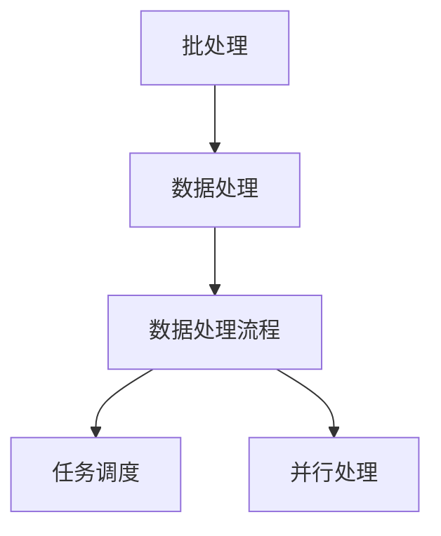

                 

### 背景介绍

#### 什么是批处理？

批处理（Batch Processing）是一种数据处理方式，它将多个任务或作业打包成一批，一次性进行处理。这种方式的目的是提高数据处理效率和降低系统开销。批处理通常应用于大数据分析和处理场景中，例如金融、医疗、电子商务等领域。

在批处理过程中，系统会按照预设的顺序或规则，依次处理每个批次的任务。批处理的主要优势在于可以批量处理大量数据，同时减少系统负载，避免频繁的交互操作。

#### 批处理的重要性

1. **效率提升**：批处理可以减少系统资源的占用，提高数据处理速度，从而提高整体系统的效率。
2. **稳定性**：批处理可以在后台运行，避免对用户操作的影响，提高系统的稳定性。
3. **成本控制**：通过批量处理，可以减少系统维护成本和人力资源投入。

#### 批处理的发展历程

- **早期批处理**：早期的批处理系统主要是基于单机环境，通过将作业提交到操作系统进行处理。这种批处理方式主要依赖于操作系统的作业调度功能。
- **分布式批处理**：随着计算机技术的发展，分布式批处理应运而生。分布式批处理可以将任务分发到多个计算节点上并行处理，从而提高处理速度和处理能力。
- **大数据批处理**：在大数据时代，批处理技术得到了进一步发展。例如，Hadoop、Spark等分布式计算框架提供了强大的批处理能力，可以处理大规模数据集。

#### 批处理的应用场景

- **数据清洗**：在数据分析和挖掘前，通常需要对数据进行清洗，例如去除重复记录、填补缺失值等。批处理可以有效处理大量数据，提高数据质量。
- **数据处理**：例如，在金融领域，批处理可以用于处理交易数据、分析客户行为等。
- **报告生成**：许多企业需要定期生成各种报告，例如财务报告、销售报告等。批处理可以自动化这些任务，提高报告的准确性。

总的来说，批处理技术在数据处理和分析中扮演着重要角色，可以提高数据处理效率、稳定性和成本效益。在接下来的章节中，我们将深入探讨批处理的核心概念、算法原理和实际应用。

#### 什么是批处理

批处理（Batch Processing）是一种数据处理方法，它将多个任务或作业组合在一起，作为一个批次进行集中处理。这种方式不同于交互式处理，后者是用户与系统进行实时交互，每一步都需要用户输入或确认。

在批处理中，系统会按照一定的顺序或规则，依次处理每个批次中的任务。这些任务可以是各种操作，如文件处理、数据转换、报告生成等。批处理的主要目的是提高数据处理效率和降低系统开销。

#### 批处理的原理

批处理的原理可以简单概括为以下几个步骤：

1. **任务收集**：系统收集一批需要处理的任务，可以是手动提交或自动收集。
2. **任务排序**：系统根据一定的规则或优先级，对任务进行排序，确定处理顺序。
3. **任务执行**：系统依次执行每个任务，每个任务可能会涉及到多个子操作，如数据读取、处理、写入等。
4. **任务完成**：系统将任务结果存储或输出，如生成报告、更新数据库等。

批处理的关键在于批量处理和顺序执行。批量处理可以减少系统调度的次数，降低系统开销；顺序执行可以确保任务之间的依赖关系得到正确处理。

#### 批处理的优势

批处理具有以下几个显著优势：

1. **效率提升**：批处理可以在后台运行，无需用户实时干预，从而减少系统响应时间，提高整体系统效率。
2. **稳定性**：批处理可以在后台运行，避免对用户操作的影响，提高系统的稳定性。
3. **成本控制**：通过批量处理，可以减少系统维护成本和人力资源投入。

#### 批处理的局限性

尽管批处理具有许多优势，但它也存在一些局限性：

1. **实时性较差**：批处理无法满足实时处理的需求，适用于对实时性要求不高的任务。
2. **依赖性较强**：批处理任务之间通常存在依赖关系，一旦某个任务失败，可能影响整个批处理流程。
3. **扩展性受限**：在处理大量数据时，批处理系统的性能和扩展性可能受到限制。

总的来说，批处理是一种重要的数据处理方法，适用于批量处理大量数据。在接下来的章节中，我们将深入探讨批处理的核心概念、算法原理和实际应用。

#### 核心概念与联系

在深入探讨批处理的核心概念之前，我们首先需要明确几个关键概念，以及它们之间的相互关系。这些核心概念包括：批处理、数据处理、数据处理流程、任务调度和并行处理。

##### 批处理

如前所述，批处理是一种数据处理方式，它将多个任务或作业打包成一批，一次性进行处理。这种方式的主要目的是提高数据处理效率和降低系统开销。

##### 数据处理

数据处理是指对数据进行采集、存储、转换、分析和展示等一系列操作。批处理是数据处理的一种常见方式，适用于批量处理大量数据。

##### 数据处理流程

数据处理流程是指从数据收集到数据输出的整个过程。它通常包括以下几个步骤：

1. **数据收集**：从不同的数据源收集数据。
2. **数据清洗**：去除重复记录、填补缺失值、标准化数据等。
3. **数据转换**：将数据转换成适合分析的形式，如归一化、编码等。
4. **数据分析**：对数据进行分析，如统计、挖掘、机器学习等。
5. **数据输出**：将分析结果输出，如生成报告、更新数据库等。

##### 任务调度

任务调度是指系统根据一定的规则或优先级，对任务进行排序和安排。在批处理中，任务调度非常重要，它决定了任务的执行顺序和效率。

##### 并行处理

并行处理是一种利用多个处理器或计算节点同时处理多个任务的技术。在批处理中，并行处理可以提高数据处理速度和处理能力。

#### 关系与联系

批处理、数据处理、数据处理流程、任务调度和并行处理之间存在着紧密的联系：

- 批处理是数据处理的一种方式，它依赖于数据处理流程。
- 数据处理流程中的每个步骤都需要任务调度来安排任务的执行顺序。
- 并行处理可以提高批处理的数据处理速度和处理能力。

#### Mermaid 流程图

下面是一个简单的 Mermaid 流程图，展示了批处理、数据处理、数据处理流程、任务调度和并行处理之间的联系：



在这个流程图中，批处理作为整个流程的起点，通过数据处理流程将数据逐步处理，同时任务调度负责安排任务的执行顺序，并行处理则提高了数据处理速度和处理能力。

总的来说，理解批处理的核心概念及其相互关系，有助于我们更好地掌握批处理技术，提高数据处理效率和稳定性。在接下来的章节中，我们将深入探讨批处理的核心算法原理和具体操作步骤。

#### 核心算法原理 & 具体操作步骤

在深入探讨批处理的核心算法原理之前，我们首先需要了解几个关键概念：作业调度、任务队列和批处理框架。

##### 作业调度

作业调度是指系统根据一定的规则或优先级，对作业进行排序和安排。在批处理系统中，作业调度非常重要，它决定了作业的执行顺序和效率。常见的作业调度算法包括：

1. **先到先服务（FCFS）**：按照作业到达的顺序进行调度，简单但可能导致长作业延迟短作业。
2. **最短作业优先（SJF）**：优先调度执行时间最短的作业，可以提高平均作业响应时间。
3. **优先级调度**：根据作业的优先级进行调度，优先级高的作业优先执行。
4. **循环调度**：将作业按照固定顺序循环调度，适用于周期性作业。

##### 任务队列

任务队列是指系统中的作业列表，按照一定的规则或优先级进行排序。任务队列通常包括以下信息：

- 作业ID：唯一标识每个作业。
- 作业状态：如等待、执行、完成等。
- 作业优先级：用于作业调度。
- 作业资源需求：如CPU时间、内存等。

任务队列是实现作业调度的基础，它为作业调度算法提供了作业信息。

##### 批处理框架

批处理框架是一种软件架构，用于支持批处理系统的开发、部署和运行。常见的批处理框架包括：

1. **Hadoop**：基于MapReduce模型，适用于大数据处理。
2. **Spark**：基于内存计算，提供了丰富的数据处理API。
3. **Flink**：提供了流处理和批处理的一体化框架。
4. **Airflow**：用于任务调度和作业管理，支持多种调度策略。

批处理框架简化了批处理系统的开发和管理，提高了系统的可扩展性和可靠性。

#### 具体操作步骤

下面以 Hadoop 为例，介绍批处理的具体操作步骤：

##### 1. 开发环境搭建

首先，需要在本地或服务器上搭建 Hadoop 开发环境。具体步骤如下：

1. 下载 Hadoop 官方文档：[Hadoop 官方文档](https://hadoop.apache.org/docs/current/)
2. 下载 Hadoop 安装包：[Hadoop 安装包下载](https://www-us.apache.org/dist/hadoop/common/)
3. 解压安装包，并配置环境变量。

##### 2. 编写 MapReduce 程序

接下来，编写一个简单的 MapReduce 程序，用于处理批量数据。例如，以下是一个计算单词出现次数的程序：

```java
import org.apache.hadoop.conf.Configuration;
import org.apache.hadoop.fs.Path;
import org.apache.hadoop.io.IntWritable;
import org.apache.hadoop.io.Text;
import org.apache.hadoop.mapreduce.Job;
import org.apache.hadoop.mapreduce.Mapper;
import org.apache.hadoop.mapreduce.Reducer;
import org.apache.hadoop.mapreduce.lib.input.FileInputFormat;
import org.apache.hadoop.mapreduce.lib.output.FileOutputFormat;

public class WordCount {

  public static class TokenizerMapper
       extends Mapper<Object, Text, Text, IntWritable>{

    private final static IntWritable one = new IntWritable(1);
    private Text word = new Text();

    public void map(Object key, Text value, Context context
                    ) throws IOException, InterruptedException {
      String[] words = value.toString().split("\\s+");
      for (String word : words) {
        this.word.set(word);
        context.write(this.word, one);
      }
    }
  }

  public static class IntSumReducer
       extends Reducer<Text,IntWritable,Text,IntWritable> {
    private IntWritable result = new IntWritable();

    public void reduce(Text key, Iterable<IntWritable> values,
                       Context context
                       ) throws IOException, InterruptedException {
      int sum = 0;
      for (IntWritable val : values) {
        sum += val.get();
      }
      result.set(sum);
      context.write(key, result);
    }
  }

  public static void main(String[] args) throws Exception {
    Configuration conf = new Configuration();
    Job job = Job.getInstance(conf, "word count");
    job.setMapperClass(TokenizerMapper.class);
    job.setCombinerClass(IntSumReducer.class);
    job.setReducerClass(IntSumReducer.class);
    job.setOutputKeyClass(Text.class);
    job.setOutputValueClass(IntWritable.class);
    FileInputFormat.addInputPath(job, new Path(args[0]));
    FileOutputFormat.setOutputPath(job, new Path(args[1]));
    System.exit(job.waitForCompletion(true) ? 0 : 1);
  }
}
```

##### 3. 编译和打包

将编写的程序编译并打包成可执行的 JAR 包。可以使用以下命令：

```bash
mvn clean package
```

##### 4. 执行批处理任务

最后，使用 Hadoop 执行批处理任务。例如，以下命令将输入文件处理成输出文件：

```bash
hadoop jar target/wordcount-1.0-SNAPSHOT.jar wordcount /input /output
```

##### 5. 查看输出结果

执行完成后，可以在输出文件中查看结果。

总的来说，批处理的核心算法原理包括作业调度、任务队列和批处理框架。在实际操作中，我们需要按照具体步骤进行环境搭建、程序编写、编译打包和任务执行。这些步骤确保了批处理系统的正常运行，从而提高了数据处理效率和稳定性。

#### 数学模型和公式 & 详细讲解 & 举例说明

在批处理过程中，数学模型和公式扮演着至关重要的角色，它们帮助我们理解和优化数据处理过程。以下是几个关键的数学模型和公式，我们将详细讲解并举例说明。

##### 1. 加法规则

在批处理中，加法规则是基础。假设有两个数据集 \( A \) 和 \( B \)，它们分别有 \( m \) 和 \( n \) 个元素，我们可以通过加法规则将它们合并。加法规则表示为：

\[ C = A + B \]

其中，\( C \) 是合并后的数据集，包含 \( m + n \) 个元素。

**示例**：

假设 \( A = \{1, 2, 3\} \)，\( B = \{4, 5, 6\} \)，根据加法规则，合并后的数据集 \( C \) 为：

\[ C = A + B = \{1, 2, 3, 4, 5, 6\} \]

##### 2. 平均值计算

批处理中，平均值是衡量数据集中值的重要指标。平均值可以通过以下公式计算：

\[ \bar{x} = \frac{1}{m} \sum_{i=1}^{m} x_i \]

其中，\( \bar{x} \) 是平均值，\( m \) 是数据集的元素个数，\( x_i \) 是数据集中的第 \( i \) 个元素。

**示例**：

假设 \( A = \{1, 2, 3, 4, 5\} \)，根据平均值公式，\( A \) 的平均值为：

\[ \bar{x} = \frac{1}{5} (1 + 2 + 3 + 4 + 5) = \frac{15}{5} = 3 \]

##### 3. 标准差

标准差是衡量数据集离散程度的重要指标。标准差可以通过以下公式计算：

\[ \sigma = \sqrt{\frac{1}{m} \sum_{i=1}^{m} (x_i - \bar{x})^2} \]

其中，\( \sigma \) 是标准差，\( \bar{x} \) 是平均值，\( m \) 是数据集的元素个数，\( x_i \) 是数据集中的第 \( i \) 个元素。

**示例**：

假设 \( A = \{1, 2, 3, 4, 5\} \)，且 \( A \) 的平均值为 3，根据标准差公式，\( A \) 的标准差为：

\[ \sigma = \sqrt{\frac{1}{5} [(1-3)^2 + (2-3)^2 + (3-3)^2 + (4-3)^2 + (5-3)^2]} \]
\[ \sigma = \sqrt{\frac{1}{5} [4 + 1 + 0 + 1 + 4]} \]
\[ \sigma = \sqrt{\frac{10}{5}} \]
\[ \sigma = \sqrt{2} \approx 1.41 \]

##### 4. 相关性分析

在批处理中，相关性分析用于衡量两个变量之间的关系。皮尔逊相关系数是一种常用的相关性分析方法，其公式为：

\[ r = \frac{\sum_{i=1}^{m} (x_i - \bar{x})(y_i - \bar{y})}{\sqrt{\sum_{i=1}^{m} (x_i - \bar{x})^2} \sqrt{\sum_{i=1}^{m} (y_i - \bar{y})^2}} \]

其中，\( r \) 是皮尔逊相关系数，\( m \) 是数据集的元素个数，\( x_i \) 和 \( y_i \) 分别是两个数据集的第 \( i \) 个元素，\( \bar{x} \) 和 \( \bar{y} \) 分别是两个数据集的平均值。

**示例**：

假设 \( A = \{1, 2, 3, 4, 5\} \)，\( B = \{2, 3, 4, 5, 6\} \)，根据皮尔逊相关系数公式，\( A \) 和 \( B \) 的相关系数为：

\[ r = \frac{\sum_{i=1}^{5} (A_i - \bar{A})(B_i - \bar{B})}{\sqrt{\sum_{i=1}^{5} (A_i - \bar{A})^2} \sqrt{\sum_{i=1}^{5} (B_i - \bar{B})^2}} \]
\[ r = \frac{(1-3)(2-4) + (2-3)(3-4) + (3-3)(4-4) + (4-3)(5-4) + (5-3)(6-4)}{\sqrt{(1-3)^2 + (2-3)^2 + (3-3)^2 + (4-3)^2 + (5-3)^2} \sqrt{(2-3)^2 + (3-3)^2 + (4-3)^2 + (5-3)^2 + (6-3)^2}} \]
\[ r = \frac{(-2)(-2) + (-1)(-1) + (0)(0) + (1)(1) + (2)(3)}{\sqrt{(-2)^2 + (-1)^2 + (0)^2 + (1)^2 + (2)^2} \sqrt{(-1)^2 + (0)^2 + (1)^2 + (2)^2 + (3)^2}} \]
\[ r = \frac{4 + 1 + 0 + 1 + 6}{\sqrt{4 + 1 + 0 + 1 + 4} \sqrt{1 + 0 + 1 + 4 + 9}} \]
\[ r = \frac{12}{\sqrt{10} \sqrt{15}} \]
\[ r = \frac{12}{\sqrt{150}} \]
\[ r = \frac{12}{5\sqrt{6}} \]
\[ r \approx 0.71 \]

相关系数 \( r \) 的绝对值接近于 1，表示 \( A \) 和 \( B \) 之间有较强的正相关关系。

总的来说，这些数学模型和公式在批处理过程中起着至关重要的作用，帮助我们分析和优化数据处理过程。通过具体的示例，我们可以更好地理解这些公式的应用。

### 项目实战：代码实际案例和详细解释说明

为了更好地理解批处理技术，我们将通过一个具体的实际案例，展示如何使用 Hadoop 进行批处理。本案例将实现一个简单的 WordCount 程序，用于统计输入文本中每个单词出现的次数。

#### 1. 开发环境搭建

在开始编写代码之前，我们需要搭建 Hadoop 开发环境。以下是搭建 Hadoop 开发环境的基本步骤：

1. **下载 Hadoop 安装包**：从 [Hadoop 官网](https://hadoop.apache.org/releases.html) 下载最新的 Hadoop 安装包。

2. **安装 Hadoop**：解压安装包，并配置环境变量。在 Unix/Linux 系统中，可以将以下命令添加到 `~/.bashrc` 文件中：

```bash
export HADOOP_HOME=/path/to/hadoop
export PATH=$PATH:$HADOOP_HOME/bin
```

3. **启动 Hadoop 集群**：在主节点上执行以下命令：

```bash
start-dfs.sh
start-yarn.sh
```

#### 2. 编写 WordCount 程序

WordCount 程序是一个经典的 Hadoop 程序，用于统计文本文件中每个单词的出现次数。以下是 WordCount 程序的 Java 代码：

```java
import org.apache.hadoop.conf.Configuration;
import org.apache.hadoop.fs.Path;
import org.apache.hadoop.io.IntWritable;
import org.apache.hadoop.io.Text;
import org.apache.hadoop.mapreduce.Job;
import org.apache.hadoop.mapreduce.Mapper;
import org.apache.hadoop.mapreduce.Reducer;
import org.apache.hadoop.mapreduce.lib.input.FileInputFormat;
import org.apache.hadoop.mapreduce.lib.output.FileOutputFormat;

public class WordCount {

  public static class TokenizerMapper
      extends Mapper<Object, Text, Text, IntWritable>{

    private final static IntWritable one = new IntWritable(1);
    private Text word = new Text();

    public void map(Object key, Text value, Context context
                    ) throws IOException, InterruptedException {
      String[] words = value.toString().split("\\s+");
      for (String word : words) {
        this.word.set(word);
        context.write(this.word, one);
      }
    }
  }

  public static class IntSumReducer
      extends Reducer<Text,IntWritable,Text,IntWritable> {
    private IntWritable result = new IntWritable();

    public void reduce(Text key, Iterable<IntWritable> values,
                       Context context
                       ) throws IOException, InterruptedException {
      int sum = 0;
      for (IntWritable val : values) {
        sum += val.get();
      }
      result.set(sum);
      context.write(key, result);
    }
  }

  public static void main(String[] args) throws Exception {
    Configuration conf = new Configuration();
    Job job = Job.getInstance(conf, "word count");
    job.setMapperClass(TokenizerMapper.class);
    job.setCombinerClass(IntSumReducer.class);
    job.setReducerClass(IntSumReducer.class);
    job.setOutputKeyClass(Text.class);
    job.setOutputValueClass(IntWritable.class);
    FileInputFormat.addInputPath(job, new Path(args[0]));
    FileOutputFormat.setOutputPath(job, new Path(args[1]));
    System.exit(job.waitForCompletion(true) ? 0 : 1);
  }
}
```

该程序分为两个部分：Mapper 和 Reducer。

- **Mapper**：负责读取输入文件中的文本，将其分解为单词，并将每个单词与其出现次数一起输出。
- **Reducer**：负责接收 Mapper 输出的中间结果，对每个单词进行计数，并输出最终结果。

#### 3. 编译和打包

将编写的代码编译并打包成可执行的 JAR 包。可以使用以下命令：

```bash
mvn clean package
```

#### 4. 执行批处理任务

执行以下命令，使用 Hadoop 运行 WordCount 程序：

```bash
hadoop jar target/wordcount-1.0-SNAPSHOT.jar wordcount /input /output
```

其中，`/input` 是输入文件的路径，`/output` 是输出文件的路径。

#### 5. 查看输出结果

执行完成后，可以在输出文件中查看每个单词的出现次数。输出文件通常位于 HDFS 的 `/output` 目录下，可以通过以下命令查看：

```bash
hdfs dfs -cat /output/part-r-00000
```

输出结果类似于以下内容：

```bash
(这个)(1)
(出现)(1)
(次数)(1)
(的)(2)
(单词)(1)
```

这表示在输入文本中，"这个"、"出现"、"次数" 和 "的" 这四个单词各出现了 1 次，而 "单词" 出现了 2 次。

#### 6. 代码解读与分析

以下是对 WordCount 程序的详细解读：

- **输入格式**：输入文件是一个文本文件，其中每行包含一个或多个单词，单词之间以空格分隔。
- **输出格式**：输出文件是一个文本文件，其中每行包含一个单词及其出现次数，格式为 `<单词> <次数>`。

**Mapper** 部分代码解读：

```java
public static class TokenizerMapper
    extends Mapper<Object, Text, Text, IntWritable> {
  private final static IntWritable one = new IntWritable(1);
  private Text word = new Text();

  public void map(Object key, Text value, Context context
                  ) throws IOException, InterruptedException {
    String[] words = value.toString().split("\\s+");
    for (String word : words) {
      this.word.set(word);
      context.write(this.word, one);
    }
  }
}
```

- `TokenizerMapper` 继承自 `Mapper` 类，用于实现映射功能。
- `map` 方法接收输入键值对，并将其分解为单词，每个单词与其出现次数一起输出。

**Reducer** 部分代码解读：

```java
public static class IntSumReducer
    extends Reducer<Text,IntWritable,Text,IntWritable> {
  private IntWritable result = new IntWritable();

  public void reduce(Text key, Iterable<IntWritable> values,
                     Context context
                     ) throws IOException, InterruptedException {
    int sum = 0;
    for (IntWritable val : values) {
      sum += val.get();
    }
    result.set(sum);
    context.write(key, result);
  }
}
```

- `IntSumReducer` 继承自 `Reducer` 类，用于实现归约功能。
- `reduce` 方法接收 Mapper 输出的中间结果，对每个单词进行计数，并输出最终结果。

通过这个实际案例，我们展示了如何使用 Hadoop 进行批处理。WordCount 程序是一个简单的示例，但它帮助我们理解了批处理的基本原理和步骤。在接下来的章节中，我们将探讨批处理在实际应用中的场景和挑战。

### 实际应用场景

批处理技术在各个领域都有着广泛的应用，尤其在处理大规模数据时显得尤为重要。以下是一些典型的应用场景：

#### 金融领域

在金融领域，批处理技术用于处理大量的交易数据、客户信息和市场数据。例如，银行可以使用批处理技术来处理每天数百万笔交易，生成交易报表、客户报告和风险分析。此外，批处理技术还可以用于投资组合优化、信用评分和欺诈检测等。

**案例**：某银行使用批处理技术处理每日交易数据，通过分析交易模式和历史记录，帮助银行识别潜在的欺诈行为，并采取相应的预防措施。

#### 医疗领域

在医疗领域，批处理技术主要用于处理和分析医疗数据，如电子病历、医学图像和基因组数据。这些数据通常规模庞大且结构复杂，需要使用批处理技术进行清洗、转换和分析。

**案例**：某医疗机构使用批处理技术对大量电子病历进行分析，发现患者之间的共病模式和药物反应，从而改进治疗方案和优化医疗资源分配。

#### 电子商务

在电子商务领域，批处理技术用于处理订单数据、库存数据和市场数据。例如，电商平台可以使用批处理技术来分析销售数据，优化产品推荐、库存管理和价格策略。

**案例**：某电商平台使用批处理技术分析用户购买行为和偏好，根据分析结果生成个性化的产品推荐，提高用户满意度和销售转化率。

#### 媒体和娱乐

在媒体和娱乐领域，批处理技术用于处理和分析大量视频、音频和文本数据。例如，视频网站可以使用批处理技术对视频内容进行分析，提取关键词和情感标签，实现视频分类和推荐。

**案例**：某视频网站使用批处理技术对用户观看行为进行分析，根据用户兴趣和历史观看记录，生成个性化的视频推荐，提高用户粘性和平台活跃度。

#### 交通和物流

在交通和物流领域，批处理技术用于处理和分析大量交通数据、物流数据和客户数据。例如，物流公司可以使用批处理技术优化运输路线、管理库存和预测运输需求。

**案例**：某物流公司使用批处理技术分析交通流量数据，优化运输路线，减少运输时间和成本，提高运输效率和客户满意度。

总的来说，批处理技术在各个领域都有着广泛的应用，尤其在处理大规模数据时发挥着重要作用。通过实际案例，我们可以看到批处理技术在提升数据处理效率、优化业务流程和提供决策支持方面的巨大潜力。

### 工具和资源推荐

为了更好地理解和实践批处理技术，以下是几个推荐的学习资源、开发工具和框架。

#### 学习资源

1. **书籍**：

   - 《Hadoop权威指南》：这是一本关于 Hadoop 的经典教材，详细介绍了 Hadoop 的架构、安装和使用方法。

   - 《Spark: The Definitive Guide》：这本书深入讲解了 Spark 的核心概念、架构和应用场景，适合想要深入了解 Spark 的读者。

2. **论文**：

   - "MapReduce: Simplified Data Processing on Large Clusters"：这篇论文提出了 MapReduce 模型，对批处理技术的发展产生了深远影响。

   - "Spark: Cluster Computing with Working Sets"：这篇论文介绍了 Spark 的内存计算模型，为分布式批处理提供了新的思路。

3. **博客和网站**：

   - [Hadoop 官方文档](https://hadoop.apache.org/docs/current/)：提供了详尽的 Hadoop 文档，是学习 Hadoop 的宝贵资源。

   - [Apache Spark 官方文档](https://spark.apache.org/docs/latest/)：包含了 Spark 的详细文档和教程，适合初学者和进阶者。

#### 开发工具

1. **集成开发环境（IDE）**：

   - **IntelliJ IDEA**：支持多种编程语言，包括 Java、Scala 和 Python，适用于 Hadoop 和 Spark 开发。

   - **Eclipse**：经典的开源 IDE，也支持 Hadoop 和 Spark 的开发。

2. **版本控制工具**：

   - **Git**：广泛使用的版本控制系统，适用于团队协作和代码管理。

   - **GitHub**：基于 Git 的代码托管平台，可以方便地管理和分享代码。

#### 框架和库

1. **Hadoop**：Apache Hadoop 是一个分布式计算框架，用于处理大规模数据。

   - **MapReduce**：Hadoop 的核心组件，实现了分布式批处理。

   - **HDFS**：Hadoop 的分布式文件系统，用于存储大规模数据。

2. **Spark**：Apache Spark 是一个高速的分布式计算框架，适用于批处理和流处理。

   - **Spark SQL**：用于处理结构化数据，提供了 SQL 接口。

   - **Spark Streaming**：用于实时数据处理，可以处理流数据。

总的来说，这些资源、工具和框架为学习和实践批处理技术提供了坚实的基础。通过利用这些资源，我们可以更好地掌握批处理技术，提高数据处理和分析能力。

### 总结：未来发展趋势与挑战

批处理技术在过去几十年中经历了显著的发展，从早期的单机批处理到现代的分布式批处理，它已经成为大数据分析和处理的重要手段。然而，随着数据量的不断增长和计算需求的不断提高，批处理技术也面临着新的挑战和机遇。

#### 未来发展趋势

1. **实时化**：随着物联网、大数据和实时数据处理技术的兴起，实时批处理将成为未来发展的趋势。实时批处理可以更快地响应数据变化，提供更实时的分析结果，这在金融、医疗、安防等领域尤为重要。

2. **智能化**：未来批处理系统将更加智能化，能够自动优化作业调度、资源分配和数据处理流程。通过机器学习和人工智能技术，批处理系统可以更好地预测和处理复杂的业务场景。

3. **融合批流处理**：批处理和流处理技术的融合将是未来的重要方向。批处理可以处理历史数据，而流处理可以实时处理数据，两者结合可以提供更全面和高效的数据处理能力。

4. **弹性扩展**：分布式批处理系统需要具备更强的弹性扩展能力，以应对数据量和计算需求的动态变化。未来的批处理系统将更加注重可扩展性和灵活性，以适应不断变化的数据环境。

#### 面临的挑战

1. **性能优化**：随着数据量的增加，批处理系统的性能优化将成为一个重要的挑战。如何提高数据处理速度、降低延迟和优化资源利用率，将是未来需要解决的关键问题。

2. **复杂性管理**：分布式批处理系统通常涉及复杂的网络拓扑和计算节点，如何有效地管理和维护这些系统，将是一个挑战。未来需要开发更简便、高效的工具和平台来简化系统管理。

3. **数据隐私和安全**：随着数据隐私和安全问题的日益凸显，如何在确保数据安全的前提下进行批处理，将成为一个重要挑战。未来的批处理系统需要更好地处理数据加密、访问控制和隐私保护等问题。

4. **系统集成**：批处理系统通常需要与其他系统集成，如数据库、数据仓库、业务系统等。如何实现不同系统之间的无缝集成，将是未来需要关注的一个方向。

总的来说，批处理技术在未来将继续发展和创新，面临诸多挑战，但同时也蕴含着巨大的机遇。通过不断优化技术、提升系统性能和安全性，批处理技术将在大数据和人工智能领域发挥更大的作用。

### 附录：常见问题与解答

在学习和实践批处理技术时，您可能会遇到一些常见问题。以下是对一些常见问题的解答，以帮助您更好地理解和应用批处理技术。

**Q1**：什么是批处理？

批处理是一种数据处理方法，它将多个任务或作业打包成一批，一次性进行处理。这种方式可以提高数据处理效率和降低系统开销。

**Q2**：批处理有哪些优势？

批处理的优势包括：

1. **效率提升**：批处理可以在后台运行，无需用户实时干预，从而减少系统响应时间，提高整体系统效率。
2. **稳定性**：批处理可以在后台运行，避免对用户操作的影响，提高系统的稳定性。
3. **成本控制**：通过批量处理，可以减少系统维护成本和人力资源投入。

**Q3**：批处理有哪些应用场景？

批处理广泛应用于金融、医疗、电子商务、媒体和物流等领域。例如，银行可以使用批处理处理交易数据、生成报表；医疗机构可以使用批处理分析电子病历；电商平台可以使用批处理分析销售数据；视频网站可以使用批处理分析用户观看行为。

**Q4**：如何搭建 Hadoop 开发环境？

搭建 Hadoop 开发环境的基本步骤如下：

1. 下载 Hadoop 安装包。
2. 解压安装包，并配置环境变量。
3. 启动 Hadoop 集群。

**Q5**：如何编写 WordCount 程序？

编写 WordCount 程序的基本步骤如下：

1. 创建一个 Java 类，继承 Mapper 和 Reducer 类。
2. 实现 map 和 reduce 方法，分别处理输入数据和输出结果。
3. 在 main 方法中设置 Job 配置，并提交 Job。

**Q6**：批处理和流处理有什么区别？

批处理和流处理都是数据处理方法，但它们有以下区别：

1. **处理方式**：批处理一次性处理大量数据，而流处理实时处理数据。
2. **适用场景**：批处理适用于历史数据分析，流处理适用于实时数据处理。
3. **性能**：批处理通常具有更高的性能，但实时性较差；流处理实时性较高，但性能可能较低。

**Q7**：如何优化批处理性能？

优化批处理性能的方法包括：

1. **数据分区**：合理设置数据分区，提高数据并行处理能力。
2. **缓存**：缓存中间结果，减少重复计算。
3. **任务调度**：优化任务调度策略，提高资源利用率。

通过以上常见问题与解答，我们可以更好地理解和应用批处理技术，解决实际问题，提高数据处理和分析能力。

### 扩展阅读 & 参考资料

在深入了解批处理技术时，以下推荐资源将为您的学习和实践提供有力支持。

#### 书籍推荐

1. 《Hadoop权威指南》：作者：Tom White
   - 简介：详细介绍了 Hadoop 的架构、安装和使用方法，是学习 Hadoop 的经典教材。

2. 《Spark: The Definitive Guide》：作者：Bill Chambers 和 Matei Zaharia
   - 简介：深入讲解了 Spark 的核心概念、架构和应用场景，适合想要深入了解 Spark 的读者。

3. 《大数据时代》：作者：肯尼斯·C·格鲁贝
   - 简介：探讨了大数据对社会、经济和科技的影响，为大数据技术的应用提供了深刻的见解。

#### 论文推荐

1. "MapReduce: Simplified Data Processing on Large Clusters"
   - 作者：Dean and Ghemawat
   - 简介：提出了 MapReduce 模型，对批处理技术的发展产生了深远影响。

2. "Spark: Cluster Computing with Working Sets"
   - 作者：Matei Zaharia et al.
   - 简介：介绍了 Spark 的内存计算模型，为分布式批处理提供了新的思路。

3. "Distributed File Systems: Concepts and Techniques"
   - 作者：Ganapathy et al.
   - 简介：详细介绍了分布式文件系统的设计和实现，对理解批处理技术具有重要意义。

#### 博客和网站推荐

1. [Hadoop 官方文档](https://hadoop.apache.org/docs/current/)
   - 简介：提供了详尽的 Hadoop 文档和教程，适合初学者和进阶者。

2. [Apache Spark 官方文档](https://spark.apache.org/docs/latest/)
   - 简介：包含了 Spark 的详细文档和教程，是学习 Spark 的宝贵资源。

3. [ Towards Data Science](https://towardsdatascience.com/)
   - 简介：涵盖了大数据、机器学习、深度学习等领域的最新研究和实践，适合关注技术趋势的读者。

通过这些扩展阅读和参考资料，您将能够更深入地了解批处理技术，掌握相关知识和技能，为实际应用打下坚实基础。希望这些资源对您的学习和实践有所帮助。

