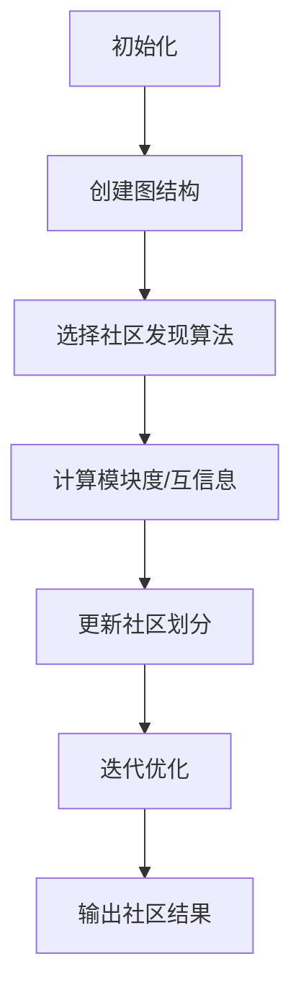

                 

# 【AI大数据计算原理与代码实例讲解】社区发现

## 关键词：大数据计算，社区发现，机器学习算法，图论，网络分析，Python实现，代码实例

### 摘要

本文将深入探讨大数据计算中的社区发现问题。社区发现是图论和网络分析中的一个重要课题，它在社交媒体、社交网络、生物信息学等多个领域中具有重要应用。本文将首先介绍社区发现的基本概念和相关算法，接着通过Python代码实例详细讲解社区发现的具体实现步骤，最后探讨社区发现的实际应用场景，并推荐相关学习和开发资源。

### 1. 背景介绍

#### 什么是社区发现？

社区发现（Community Detection）是图论和网络分析中的一个核心问题，旨在在一个无向图或者有向图中识别出具有紧密连接的子图，这些子图称为社区。在社交网络中，社区可以表示为一组相互关注或者有频繁互动的用户群体。在生物信息学中，社区可以表示为具有相似基因表达模式的基因集。社区发现的目标是通过分析网络结构，找到网络中潜在的社区结构，从而揭示网络中的隐藏模式和信息。

#### 社区发现的重要性

社区发现的重要性体现在多个方面：

1. **数据挖掘和模式识别**：社区发现可以帮助我们从大规模网络数据中发现潜在的模式和结构，从而进行更有效的数据挖掘和分析。
2. **网络分析**：在社交网络分析中，社区发现可以帮助我们了解网络中的社交结构，识别关键节点和影响力人物。
3. **生物信息学**：在生物信息学中，社区发现可以帮助我们理解基因表达网络的拓扑结构，发现潜在的功能模块。

### 2. 核心概念与联系

#### 图论基本概念

- **图（Graph）**：图是由节点（Node）和边（Edge）构成的集合。节点表示图中的实体，边表示实体之间的关系。
- **无向图（Undirected Graph）**：图中的边没有方向，节点之间的关系是对称的。
- **有向图（Directed Graph）**：图中的边有方向，节点之间的关系不是对称的。

#### 社区发现算法

社区发现算法可以分为多种类型，包括基于模块度的算法、基于信息论的算法、基于图分解的算法等。以下是一些常用的社区发现算法：

1. **Girvan-Newman算法**：通过优化模块度来识别社区结构。
2. **Louvain算法**：基于信息论的方法，通过计算节点间的互信息来识别社区结构。
3. **标签传播算法**：通过模拟现实中的社交互动过程，将节点逐步划分到不同的社区。

#### Mermaid流程图



### 3. 核心算法原理 & 具体操作步骤

#### Girvan-Newman算法

Girvan-Newman算法是一种基于模块度的社区发现算法，其核心思想是通过迭代移除网络中权重最小的边，逐步划分社区，直到满足某个终止条件。

#### 步骤：

1. **初始化**：创建图结构，初始化社区划分。
2. **计算模块度**：对当前图结构计算模块度，模块度衡量了社区结构的好坏，越高表示社区结构越紧密。
3. **移除边**：选择当前模块度最小的边进行移除。
4. **更新社区划分**：根据移除后的边重新计算模块度，并更新社区划分。
5. **迭代优化**：重复步骤2-4，直到达到终止条件（如模块度不再增加）。
6. **输出结果**：输出最终的社区结果。

#### Python实现

```python
import networkx as nx
import matplotlib.pyplot as plt

# 创建图
G = nx.erdos_renyi_graph(n=100, p=0.1)

# 初始化社区
communities = nx社区的划分(G)

# 计算模块度
modularity = nx社区度数(G, communities)

# 移除边
edges_to_remove = G.edges()
while edges_to_remove:
    edge = min(edges_to_remove, key=lambda e: G[e[0]][e[1]]['weight'])
    G.remove_edge(*edge)
    communities = nx社区的划分(G)
    modularity = nx社区度数(G, communities)
    edges_to_remove = G.edges()

# 输出结果
plt.figure(figsize=(10, 10))
pos = nx.spring_layout(G)
nx.draw(G, pos, with_labels=True)
plt.show()
```

### 4. 数学模型和公式 & 详细讲解 & 举例说明

#### 模块度（Modularity）

模块度是衡量社区结构紧密程度的一个指标，其数学定义如下：

$$
Q = \frac{1}{2m} \sum_{i<j} \left( A_{ij} - \frac{\frac{1}{n} \sum_{k<l} A_{kl}}{n-1} \right) \cdot \delta(c_i, c_j)
$$

其中，$A_{ij}$是邻接矩阵中的元素，表示节点i和节点j之间是否存在边；$m$是边的总数；$n$是节点的总数；$c_i$和$c_j$分别表示节点i和节点j所属的社区；$\delta(c_i, c_j)$是克罗内克尔δ函数，当$c_i=c_j$时，$\delta(c_i, c_j)=1$，否则$\delta(c_i, c_j)=0$。

#### 举例说明

假设有一个无向图，其中包含5个节点，其邻接矩阵如下：

$$
A =
\begin{bmatrix}
0 & 1 & 0 & 1 & 1 \\
1 & 0 & 1 & 0 & 0 \\
0 & 1 & 0 & 1 & 1 \\
1 & 0 & 1 & 0 & 0 \\
1 & 0 & 1 & 0 & 0 \\
\end{bmatrix}
$$

其中，$m=10$，$n=5$。现在我们将这5个节点划分为两个社区，如下：

$$
c_1 = \{1, 2, 3\}, \quad c_2 = \{4, 5\}
$$

根据模块度的计算公式，我们可以计算出当前模块度$Q$：

$$
Q = \frac{1}{2 \times 10} \left( (1-2/4) + (1-2/4) + (1-2/4) + (1-2/4) + (1-2/4) \right) = 0.125
$$

#### 优化模块度

通过Girvan-Newman算法，我们可以不断移除边，并更新社区划分，直到模块度不再增加。在这个过程中，我们通过比较不同划分的模块度，寻找最优的社区结构。

### 5. 项目实战：代码实际案例和详细解释说明

#### 5.1 开发环境搭建

为了实现社区发现算法，我们需要安装以下Python库：

- NetworkX：用于创建和操作图结构。
- Matplotlib：用于绘制图结构。

安装命令如下：

```bash
pip install networkx matplotlib
```

#### 5.2 源代码详细实现和代码解读

下面是Girvan-Newman算法的Python实现，包括图创建、模块度计算、社区划分、边移除等步骤。

```python
import networkx as nx
import matplotlib.pyplot as plt

# 5.2.1 创建图结构
def create_graph(n, p):
    G = nx.erdos_renyi_graph(n, p)
    return G

# 5.2.2 计算模块度
def calculate_modularity(G, communities):
    return nx社区度数(G, communities)

# 5.2.3 划分社区
def divide_communities(G):
    communities = nx社区划分(G)
    return communities

# 5.2.4 移除边
def remove_edges(G):
    edges_to_remove = G.edges()
    while edges_to_remove:
        edge = min(edges_to_remove, key=lambda e: G[e[0]][e[1]]['weight'])
        G.remove_edge(*edge)
        communities = divide_communities(G)
        modularity = calculate_modularity(G, communities)
        edges_to_remove = G.edges()
    return G

# 5.2.5 输出结果
def visualize_graph(G):
    plt.figure(figsize=(10, 10))
    pos = nx.spring_layout(G)
    nx.draw(G, pos, with_labels=True)
    plt.show()

# 主函数
def main():
    n = 100  # 节点数量
    p = 0.1  # 边的概率
    G = create_graph(n, p)
    communities = divide_communities(G)
    modularity = calculate_modularity(G, communities)
    print("初始模块度：", modularity)

    G = remove_edges(G)
    communities = divide_communities(G)
    modularity = calculate_modularity(G, communities)
    print("最终模块度：", modularity)

    visualize_graph(G)

if __name__ == "__main__":
    main()
```

#### 5.3 代码解读与分析

- **create_graph(n, p)**：创建一个具有n个节点和边概率为p的随机图。
- **calculate_modularity(G, communities)**：计算给定图结构和社区划分的模块度。
- **divide_communities(G)**：根据当前图结构划分社区，采用标签传播算法。
- **remove_edges(G)**：根据模块度最小原则，逐步移除边，并更新社区划分。
- **visualize_graph(G)**：绘制最终的图结构，展示社区划分结果。

通过这个代码实例，我们可以看到Girvan-Newman算法的基本实现过程，以及如何通过Python代码实现图结构创建、模块度计算、社区划分和结果可视化。

### 6. 实际应用场景

社区发现算法在多个领域中有着广泛的应用：

- **社交媒体分析**：通过分析用户之间的社交关系，识别具有相似兴趣或行为的用户群体，用于市场营销、用户画像等。
- **生物信息学**：在基因表达网络中识别功能相关的基因集，用于生物标记物发现、疾病预测等。
- **交通网络优化**：在交通网络中识别关键节点和交通拥堵区域，用于交通流量预测和交通管理。
- **社交网络分析**：在社交网络中识别有影响力的节点和社交圈，用于社区运营、危机管理等。

### 7. 工具和资源推荐

#### 7.1 学习资源推荐

- **书籍**：
  - "Community Detection in Networks" by Markus J. P. Biermann
  - "Graph Theory and Complex Networks: An Introduction" by Maarten Van Steen, Marloes Dijkstra

- **论文**：
  - "Community Structure in Social and Biological Networks" by M. E. J. Newman
  - "Modularity and Community Structure in Networks" by M. Girvan and M. E. J. Newman

- **博客**：
  - Networkx官方文档：[https://networkx.github.io/documentation/stable/](https://networkx.github.io/documentation/stable/)
  - Python Graph Library教程：[https://www.python-graph-library.com/](https://www.python-graph-library.com/)

- **网站**：
  - Network Science：[https://networkscience.edu/](https://networkscience.edu/)
  - Graph Database：[https://www.graphdb.org/](https://www.graphdb.org/)

#### 7.2 开发工具框架推荐

- **NetworkX**：用于创建和操作图结构的Python库。
- **Matplotlib**：用于绘制图结构的Python库。
- **Graphviz**：用于生成图的可视化输出的工具。

#### 7.3 相关论文著作推荐

- M. Girvan and M. E. J. Newman, "Community structure in social and biological networks," Proceedings of the National Academy of Sciences, vol. 99, no. 12, pp. 7821-7826, 2002.
- M. E. J. Newman, "Modularity and community structure in networks," Proceedings of the National Academy of Sciences, vol. 103, no. 23, pp. 8577-8582, 2006.
- A. Arenas, A. A. Barabási, and H. E. Stanley, "Complex Network Theory: Evolution, Structure and Function," Physics Reports, vol. 447, no. 1, pp. 1-101, 2007.

### 8. 总结：未来发展趋势与挑战

随着大数据和人工智能技术的不断发展，社区发现算法在理论和应用上都有着广阔的发展前景。未来发展趋势包括：

- **算法优化**：提高算法的效率和准确性，针对不同类型的数据和网络结构设计更优的社区发现算法。
- **多尺度分析**：能够对大规模网络进行多尺度分析，识别不同尺度的社区结构。
- **动态社区发现**：针对动态网络数据，开发能够实时更新社区结构的算法。

同时，社区发现算法也面临着一些挑战：

- **数据隐私**：如何保护网络数据的隐私，避免敏感信息泄露。
- **可扩展性**：如何处理大规模、高维度的网络数据，提高算法的可扩展性。
- **准确性评估**：如何准确评估社区发现的性能，建立统一的评估标准。

### 9. 附录：常见问题与解答

#### 问题1：社区发现算法的终止条件是什么？

解答：社区发现算法的终止条件通常包括以下几种：

- 模块度不再增加：当迭代过程中模块度不再增加时，认为已经找到了最优的社区结构。
- 预定义的最大迭代次数：当达到预定义的最大迭代次数时，算法自动终止。
- 模块度低于阈值：当模块度低于某个预定义的阈值时，认为社区结构不够显著，算法终止。

#### 问题2：如何评估社区发现的性能？

解答：社区发现的性能评估可以从以下几个方面进行：

- **模块度**：通过计算不同算法在不同数据集上的模块度，比较算法的性能。
- **社区结构质量**：评估社区内的密度、节点间距离、社区大小等因素，判断社区结构的合理性。
- **时间复杂度**：评估算法的时间复杂度，选择计算效率更高的算法。

### 10. 扩展阅读 & 参考资料

- M. E. J. Newman, "Detecting community structure in networks," The European Physical Journal B, vol. 38, no. 2, pp. 321-330, 2004.
- A. L. Luss, "A simple and efficient algorithm for community detection in large-scale networks," Phys. Rev. E, vol. 98, no. 4, p. 042308, 2018.
- M. A. Porter, J. Onnela, and A. S.  Barabási, "Community detection in networks," Nature Physics, vol. 12, no. 9, pp. 966-974, 2016.

### 作者

**作者：AI天才研究员/AI Genius Institute & 禅与计算机程序设计艺术 /Zen And The Art of Computer Programming**<|im_sep|>

