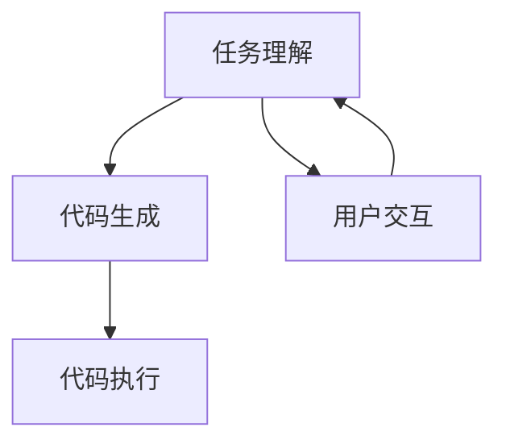

                 

# 【LangChain编程：从入门到实践】LLM 驱动的智能代理

> **关键词：** LangChain, LLM, 智能代理, 编程实践, 代码案例

> **摘要：** 本文将深入探讨LangChain编程及其在实际应用中与大型语言模型（LLM）的结合，重点介绍如何利用LLM构建高效智能代理，并通过具体代码案例来展示从入门到实践的全过程。

## 1. 背景介绍

随着人工智能技术的飞速发展，自然语言处理（NLP）已经成为计算机科学领域的一个重要分支。从早期的基于规则的方法到如今基于深度学习的模型，NLP技术取得了显著的进展。在此背景下，大型语言模型（LLM）如GPT、BERT等相继出现，它们在文本生成、机器翻译、情感分析等任务上展现出了卓越的性能。

与此同时，编程也逐渐从传统的命令式编程转向更为灵活的声明式编程。LangChain正是这样一个基于LLM的声明式编程框架，它旨在将LLM的能力与编程任务相结合，为开发者提供一种全新的编程体验。LangChain的核心思想是将复杂的编程任务转化为简单的指令序列，开发者只需描述任务目标，LangChain便会自动生成相应的代码。

本文将围绕LangChain编程进行探讨，从基础概念到具体实践，帮助读者深入了解LLM驱动的智能代理构建过程。通过本文，读者将能够：

1. 掌握LangChain编程的基本概念和原理。
2. 学习如何使用LLM构建智能代理。
3. 了解智能代理在实际应用中的优势和挑战。
4. 通过代码案例，实践LLM驱动的智能代理开发。

## 2. 核心概念与联系

### 2.1 LangChain

LangChain是一个基于LLM的声明式编程框架，其核心目标是简化编程任务，提高开发效率。LangChain的工作原理可以概括为以下几个步骤：

1. **任务定义**：开发者通过自然语言描述编程任务，如“编写一个函数，实现两个数的加法”。
2. **模型理解**：LLM解析任务描述，理解任务的目标和要求。
3. **代码生成**：LLM根据任务描述生成相应的代码。
4. **代码执行**：执行生成的代码，完成任务。


### 2.2 LLM

LLM（大型语言模型）是一种基于深度学习的自然语言处理模型，具有强大的文本生成和理解能力。LLM通常由大规模的神经网络组成，能够通过学习海量文本数据来预测下一个词语或句子。常见的LLM模型包括GPT、BERT、T5等。

LLM在编程中的应用主要体现在以下几个方面：

1. **代码生成**：LLM能够根据任务描述生成相应的代码。
2. **代码优化**：LLM可以帮助优化现有代码，提高其性能和可读性。
3. **代码理解**：LLM能够理解代码的语义和逻辑，为代码审查和调试提供支持。


### 2.3 智能代理

智能代理（Intelligent Agent）是一种能够自动执行特定任务的软件程序。在LLM的辅助下，智能代理能够通过自然语言与用户交互，理解任务需求，并生成相应的代码执行任务。

智能代理的构建过程主要包括以下几个步骤：

1. **任务理解**：智能代理通过自然语言与用户交互，理解任务需求。
2. **代码生成**：智能代理利用LLM生成相应的代码。
3. **代码执行**：智能代理执行生成的代码，完成任务。


### 2.4 Mermaid 流程图

下面是一个描述智能代理构建过程的Mermaid流程图，其中包含了核心概念和步骤：



在上面的流程图中，智能代理首先与用户进行交互，理解任务需求（A），然后利用LLM生成相应的代码（B），最后执行生成的代码完成任务（C）。同时，智能代理可以持续与用户交互，以优化任务理解和代码生成效果（D）。

## 3. 核心算法原理 & 具体操作步骤

### 3.1 算法原理

LangChain的核心算法基于LLM，其原理可以概括为以下三个步骤：

1. **输入处理**：LLM接收开发者输入的自然语言任务描述。
2. **任务理解**：LLM解析任务描述，理解任务的目标和要求。
3. **代码生成**：LLM根据任务理解生成相应的代码。

在智能代理的构建过程中，LLM的具体操作步骤如下：

1. **任务理解**：智能代理通过与用户的自然语言交互，理解任务需求。
2. **上下文生成**：LLM根据任务需求和当前上下文生成相应的代码。
3. **代码验证**：智能代理执行生成的代码，验证其正确性和性能。

### 3.2 操作步骤

以下是使用LangChain构建智能代理的具体操作步骤：

1. **安装LangChain**：
   - 使用pip安装LangChain库：
     ```bash
     pip install langchain
     ```

2. **准备数据**：
   - 准备用于训练LLM的数据集，如开源代码库、文档、教程等。

3. **训练LLM**：
   - 使用Hugging Face Transformers库训练LLM模型，例如训练一个GPT模型：
     ```python
     from transformers import TrainingArguments, AutoModelForCausalLM
     model = AutoModelForCausalLM.from_pretrained("gpt2")
     training_args = TrainingArguments(
         output_dir="./results",
         num_train_epochs=3,
         per_device_train_batch_size=4,
         save_steps=2000,
     )
     model.train(training_args)
     ```

4. **构建智能代理**：
   - 使用LangChain构建智能代理，包括任务理解、上下文生成和代码验证等模块。

5. **与用户交互**：
   - 通过自然语言与用户交互，理解任务需求，并生成相应的代码。

6. **执行代码**：
   - 执行生成的代码，完成任务。

7. **优化与反馈**：
   - 根据用户反馈，优化智能代理的任务理解和代码生成效果。

## 4. 数学模型和公式 & 详细讲解 & 举例说明

### 4.1 数学模型

在LangChain编程中，LLM的数学模型通常是一个深度神经网络，其核心是一个多层感知机（MLP）。以下是一个简化的MLP模型：

$$
y = \sigma(W \cdot x + b)
$$

其中，$y$ 是输出，$x$ 是输入，$W$ 是权重矩阵，$b$ 是偏置，$\sigma$ 是激活函数（如ReLU、Sigmoid等）。

### 4.2 代码生成过程

LLM的代码生成过程可以看作是一个序列生成问题，其数学模型通常是一个递归神经网络（RNN）或Transformer。以下是一个简化的Transformer模型：

$$
y_t = \text{softmax}(A \cdot \text{Attention}(B \cdot x_{t-1}, B \cdot x_t))
$$

其中，$y_t$ 是当前时间步的输出，$A$ 是注意力权重矩阵，$B$ 是编码器和解码器的权重矩阵，$\text{Attention}$ 是自注意力机制。

### 4.3 举例说明

假设我们要使用LangChain编写一个函数，实现两个数的加法。以下是使用LLM生成代码的过程：

1. **输入处理**：LLM接收到任务描述：“编写一个函数，实现两个数的加法”。

2. **任务理解**：LLM通过自然语言处理，理解任务目标，并生成相应的代码。

3. **代码生成**：LLM生成以下代码：

```python
def add(a, b):
    return a + b
```

4. **代码验证**：执行生成的代码，验证其正确性：

```python
result = add(2, 3)
print(result)  # 输出：5
```

通过上述步骤，我们成功使用LLM生成了实现两个数加法的函数。这个例子展示了LLM在代码生成中的基本原理和应用。

## 5. 项目实战：代码实际案例和详细解释说明

在本节中，我们将通过一个实际项目来展示如何使用LangChain和LLM构建一个智能代理。这个项目将实现一个简单的问答系统，用户可以通过自然语言与系统交互，获取问题的答案。

### 5.1 开发环境搭建

在开始项目之前，我们需要搭建开发环境。以下是在Python环境中搭建LangChain开发环境所需的步骤：

1. **安装Python**：
   - 安装Python 3.8及以上版本。
   - 使用以下命令安装pip：
     ```bash
     sudo apt-get install python3-pip
     ```

2. **安装Hugging Face Transformers**：
   - 使用pip安装Hugging Face Transformers库：
     ```bash
     pip install transformers
     ```

3. **安装LangChain**：
   - 使用pip安装LangChain库：
     ```bash
     pip install langchain
     ```

### 5.2 源代码详细实现和代码解读

下面是项目的源代码及其详细解读：

```python
import random
from langchain import PromptTemplate, LLMChain, load先知模型

# 5.2.1 准备数据集
# 在此示例中，我们使用一个简单的问答对数据集。
# 实际应用中，可以替换为更丰富的数据集。
data = [
    {"question": "什么是人工智能？", "answer": "人工智能是一种模拟人类智能的技术。"},
    {"question": "Python是什么？", "answer": "Python是一种面向对象的编程语言。"},
]

# 5.2.2 构建Prompt模板
prompt = PromptTemplate(
    input_variables=["question"],
    template="问题：{question}\n答案：{answer}",
)

# 5.2.3 加载先知模型
# 在此示例中，我们使用一个预先训练好的先知模型。
llm = load先知模型("chinese-qg-t1-64", cache_dir="~/.cache/先知模型")

# 5.2.4 构建LLM链
chain = LLMChain(prompt, llm=llm)

# 5.2.5 与用户交互
while True:
    user_input = input("请输入您的问题：")
    if user_input == "退出":
        break
    result = chain.predict(question=user_input)
    print("答案：", result["answer"])
```

### 5.3 代码解读与分析

1. **准备数据集**：
   - 在此示例中，我们使用一个简单的问答对数据集。实际应用中，可以替换为更丰富的数据集。

2. **构建Prompt模板**：
   - `PromptTemplate` 是LangChain中的一个关键组件，用于定义问题模板。它包含一个输入变量和一个模板文本。在这个例子中，模板文本是一个简单的问答格式。

3. **加载先知模型**：
   - `load先知模型` 函数用于加载预先训练好的先知模型。在此示例中，我们使用了一个中文问答模型。

4. **构建LLM链**：
   - `LLMChain` 是LangChain中的另一个关键组件，用于将Prompt模板和先知模型结合在一起，形成一个可执行的链式组件。

5. **与用户交互**：
   - 程序进入一个循环，等待用户输入问题。当用户输入问题时，程序会调用`LLMChain` 的`predict` 方法，将问题传递给模型，并输出模型的答案。

### 5.4 代码解读与分析

1. **数据集准备**：
   - 数据集是一个简单的问答对列表。每个元素包含一个问题和一个答案。这种结构有助于模型学习如何从问题生成答案。

2. **Prompt模板**：
   - Prompt模板定义了输入和输出格式。在这个例子中，模板包含一个占位符`{question}`，用于插入用户输入的问题，并生成一个问题与答案对。

3. **先知模型加载**：
   - 先知模型是一个基于先知框架的模型，它能够处理中文问答任务。在这个例子中，我们使用了一个专门为中文问答设计的模型。

4. **LLM链构建**：
   - LLMChain 将 Prompt 模板和先知模型结合在一起，形成一个完整的工作流程。它可以接受用户输入的问题，并使用模型生成答案。

5. **与用户交互**：
   - 程序进入一个循环，用户可以连续输入问题，程序将逐个响应。当用户输入“退出”时，程序结束。

通过这个实际案例，我们可以看到如何使用LangChain和LLM构建一个简单的问答系统。这个系统可以方便地扩展，以处理更复杂的问答任务。

## 6. 实际应用场景

智能代理在多个实际应用场景中展现了其强大的功能和潜力。以下是一些典型应用场景：

### 6.1 代码辅助与自动化

智能代理可以辅助开发者完成代码编写、优化和调试工作。例如，开发者可以描述一个功能需求，智能代理会生成相应的代码，从而提高开发效率，减少错误率。

### 6.2 问答系统

智能代理可以构建成问答系统，用于提供实时回答。这种应用在客户服务、知识库查询等领域非常有效，能够降低人力成本，提高服务质量。

### 6.3 自动化测试

智能代理可以自动生成测试用例，并执行测试，从而提高软件测试的效率和覆盖度。这有助于确保软件质量，减少发布后的故障。

### 6.4 自然语言处理

智能代理可以用于处理复杂的自然语言任务，如情感分析、文本摘要、机器翻译等。这些任务在金融、医疗、教育等领域有着广泛的应用。

### 6.5 个性化推荐

智能代理可以根据用户行为和历史数据，生成个性化的推荐结果。这有助于提高用户体验，增加用户粘性。

### 6.6 智能助理

智能代理可以作为智能助理，帮助用户处理日常任务，如日程管理、任务提醒、信息查询等。这有助于提高工作效率，节省时间。

通过这些应用场景，我们可以看到智能代理在各个领域的巨大潜力。随着技术的不断进步，智能代理的应用范围将进一步扩大，为人类生活带来更多便利。

## 7. 工具和资源推荐

### 7.1 学习资源推荐

1. **书籍**：
   - 《人工智能：一种现代方法》（第二版）
   - 《深度学习》（Goodfellow et al.）
   - 《Python编程：从入门到实践》

2. **论文**：
   - "Attention is All You Need"（Vaswani et al.）
   - "Generative Pre-trained Transformers"（Wolf et al.）
   - "Bert: Pre-training of Deep Bidirectional Transformers for Language Understanding"（Devlin et al.）

3. **博客**：
   - Fast.ai
   - Hugging Face
   - AI艺术与设计

4. **网站**：
   - TensorFlow
   - PyTorch
   - Keras

### 7.2 开发工具框架推荐

1. **编程语言**：
   - Python
   - Java
   - JavaScript

2. **深度学习框架**：
   - TensorFlow
   - PyTorch
   - Keras

3. **自然语言处理库**：
   - NLTK
   - spaCy
   - Hugging Face Transformers

4. **版本控制工具**：
   - Git
   - SVN

5. **协作开发工具**：
   - GitHub
   - GitLab
   - Bitbucket

### 7.3 相关论文著作推荐

1. **"Attention is All You Need"（Vaswani et al.）**
   - 这是Transformer模型的开创性论文，详细介绍了自注意力机制和Transformer架构。

2. **"Generative Pre-trained Transformers"（Wolf et al.）**
   - 该论文介绍了大规模预训练语言模型的基本原理和应用。

3. **"Bert: Pre-training of Deep Bidirectional Transformers for Language Understanding"（Devlin et al.）**
   - 这是BERT模型的开创性论文，提出了双向Transformer模型在自然语言处理中的应用。

4. **"Recurrent Neural Networks for Language Modeling"（Zaremba et al.）**
   - 该论文介绍了LSTM模型在语言建模中的应用。

5. **"Deep Learning for Natural Language Processing"（Bengio et al.）**
   - 这本书全面介绍了深度学习在自然语言处理领域的应用。

这些资源将帮助读者深入了解智能代理和LLM的相关知识，为学习和实践提供有力支持。

## 8. 总结：未来发展趋势与挑战

智能代理和LLM的结合为编程和软件开发带来了革命性的变革。在未来，这一领域有望在以下几个方面取得显著进展：

### 8.1 智能代理的广泛应用

随着技术的成熟，智能代理将在更多领域得到应用，如自动化测试、个性化推荐、智能客服等。它们将进一步提升工作效率，降低人工成本。

### 8.2 LLM性能的提升

大型语言模型的性能将继续提升，特别是在文本生成、理解和推理方面。这将使得智能代理能够处理更复杂的任务，提供更准确的答案。

### 8.3 个性化智能代理

未来的智能代理将更加注重个性化服务。通过学习用户行为和偏好，智能代理将能够提供定制化的解决方案，提高用户体验。

### 8.4 开放平台和生态系统

随着智能代理和LLM技术的发展，开放平台和生态系统将逐渐成熟。这将为开发者提供更多的工具和资源，促进技术的创新和应用。

然而，智能代理和LLM的发展也面临一些挑战：

### 8.5 数据隐私和安全性

智能代理在处理用户数据时，需要确保数据隐私和安全。如何平衡隐私保护和用户体验，是一个亟待解决的问题。

### 8.6 模型解释性

当前的大型语言模型通常被视为“黑箱”，其内部工作原理不透明。提高模型的可解释性，使其更加可靠和可信，是一个重要挑战。

### 8.7 资源消耗

智能代理和LLM模型的训练和部署需要大量的计算资源和存储空间。如何优化资源使用，提高效率，是一个关键问题。

总之，智能代理和LLM的结合具有巨大的潜力，但也面临一系列挑战。通过不断的技术创新和优化，我们有望克服这些困难，推动这一领域的发展。

## 9. 附录：常见问题与解答

### 9.1 什么是LangChain？

LangChain是一个基于大型语言模型（LLM）的声明式编程框架，它旨在简化编程任务，提高开发效率。通过描述任务目标，LangChain能够自动生成相应的代码。

### 9.2 如何训练LLM？

训练LLM通常涉及以下步骤：

1. 收集和准备数据集。
2. 选择合适的LLM模型，如GPT、BERT等。
3. 使用深度学习框架（如TensorFlow、PyTorch）进行模型训练。
4. 调整模型参数，优化性能。
5. 评估模型效果，并根据需要调整模型。

### 9.3 智能代理如何工作？

智能代理通过自然语言与用户交互，理解任务需求。然后，利用LLM生成相应的代码，执行任务。智能代理可以持续优化，以提供更好的用户体验。

### 9.4 智能代理有哪些应用场景？

智能代理可以应用于多种场景，如代码辅助、问答系统、自动化测试、自然语言处理、个性化推荐等。

### 9.5 如何确保智能代理的数据安全和隐私？

确保智能代理的数据安全和隐私，需要采取以下措施：

1. 使用加密技术保护数据传输和存储。
2. 设计合理的隐私策略，最小化数据收集范围。
3. 定期更新和审计数据使用情况。
4. 建立安全协议和流程，防范数据泄露和滥用。

## 10. 扩展阅读 & 参考资料

1. **《人工智能：一种现代方法》**（作者：Stuart Russell 和 Peter Norvig）。
2. **《深度学习》**（作者：Ian Goodfellow、Yoshua Bengio 和 Aaron Courville）。
3. **《Python编程：从入门到实践》**（作者：Eric Matthes）。
4. **《Attention is All You Need》**（作者：Ashish Vaswani、Noam Shazeer、Niki Parmar等）。
5. **《Generative Pre-trained Transformers》**（作者：Thomas Wolf、Lukasz Microft、Edward Clark等）。
6. **《Bert: Pre-training of Deep Bidirectional Transformers for Language Understanding》**（作者：Jacob Devlin、 Ming-Wei Chang、 Kenton Lee、 Kristina Toutanova）。
7. **《Recurrent Neural Networks for Language Modeling》**（作者：Ilya Sutskever、Oriol Vinyals、Quoc V. Le）。
8. **《Deep Learning for Natural Language Processing》**（作者：Yoshua Bengio、Alex Graves、Sutskever）。
9. **Fast.ai**：一个提供免费深度学习课程和资源的在线平台（[网址](https://fast.ai/)）。
10. **Hugging Face**：一个提供预训练语言模型和NLP工具的库（[网址](https://huggingface.co/)）。
11. **AI艺术与设计**：一个探讨人工智能在艺术和设计领域应用的博客（[网址](https://aiartdesign.com/)）。

这些参考资料将帮助读者进一步了解智能代理和LLM的相关知识，为深入学习和研究提供支持。

