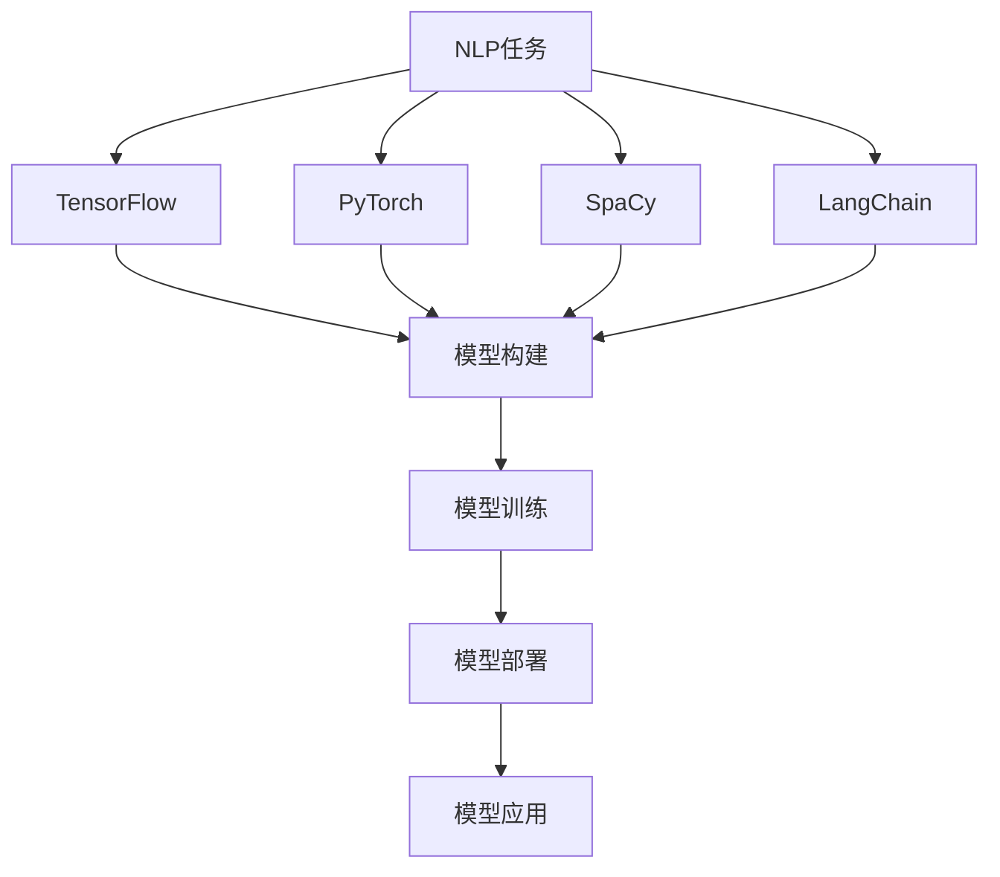

                 

## 文章标题

【LangChain编程：从入门到实践】LangChain与其他框架的比较

## 关键词

- LangChain
- 编程框架
- 比较分析
- 人工智能
- 自然语言处理
- 开发实践

## 摘要

本文将深入探讨LangChain编程框架，从入门到实践的角度，对比分析其与当前其他主流编程框架在人工智能和自然语言处理领域的异同点。通过详细的原理讲解、实际案例分析和应用场景梳理，旨在帮助读者全面了解LangChain的优势与挑战，为后续开发和实践提供有价值的参考。

## 1. 背景介绍

随着人工智能技术的快速发展，自然语言处理（NLP）成为了一个备受关注的应用领域。在NLP领域中，许多编程框架应运而生，如TensorFlow、PyTorch、SpaCy等。这些框架各自有其独特的优势和应用场景，但也存在一定的局限性。

LangChain是一个相对较新的编程框架，旨在为NLP任务提供一种更加灵活和高效的解决方案。它基于Python编写，具有简洁易懂的接口和丰富的API功能。LangChain的目标是简化NLP模型的部署和应用过程，降低开发门槛，使更多开发者能够轻松上手并发挥其潜力。

本文将围绕LangChain编程框架，详细介绍其核心概念、算法原理、数学模型、项目实战和应用场景，并与其他主流框架进行比较分析，帮助读者全面了解LangChain的优势和不足，为实际开发提供指导。

## 2. 核心概念与联系

### 2.1 LangChain简介

LangChain是一个Python编写的NLP编程框架，提供了多种预训练模型和API接口，支持文本分类、情感分析、命名实体识别、机器翻译等常见NLP任务。其核心特点如下：

- **灵活性**：LangChain提供了多种API接口，允许开发者根据实际需求进行自定义配置和扩展。
- **高效性**：LangChain采用了深度学习技术，利用预训练模型进行快速文本处理和分析。
- **易用性**：LangChain的接口简洁易懂，降低了开发门槛，方便开发者快速上手和应用。

### 2.2 其他主流框架简介

- **TensorFlow**：由Google推出的一款开源深度学习框架，广泛应用于计算机视觉、语音识别和自然语言处理等领域。TensorFlow具有强大的模型构建能力和丰富的API接口，但相对较为复杂，需要一定的开发经验。
- **PyTorch**：由Facebook推出的一款开源深度学习框架，具有简洁易懂的API接口和动态计算图，适用于快速原型开发和复杂模型构建。PyTorch在学术界和工业界都有很高的声誉。
- **SpaCy**：由Explosion公司推出的一款开源NLP库，提供了高效和易于使用的API接口，适用于文本预处理、实体识别和关系抽取等任务。SpaCy在工业界有广泛的应用，尤其在数据清洗和预处理方面。

### 2.3 Mermaid流程图

以下是一个简单的Mermaid流程图，展示了LangChain与其他主流框架在NLP任务中的基本工作流程：



## 3. 核心算法原理 & 具体操作步骤

### 3.1 LangChain算法原理

LangChain的核心算法是基于预训练模型和迁移学习。具体来说，它采用了一种称为“生成对抗网络”（GAN）的技术，通过训练大量文本数据，生成高质量的文本模型，从而实现NLP任务的自动化处理。

以下是LangChain的核心算法步骤：

1. **数据准备**：收集和整理大量文本数据，包括文本、标签、实体等。
2. **模型训练**：利用GAN技术，对文本数据进行训练，生成高质量的文本模型。
3. **模型评估**：对训练好的模型进行评估，确保其性能和可靠性。
4. **模型部署**：将训练好的模型部署到实际应用场景，进行文本处理和分析。

### 3.2 LangChain具体操作步骤

以下是使用LangChain进行NLP任务的简单示例步骤：

1. **安装LangChain**：

   ```shell
   pip install langchain
   ```

2. **导入所需库**：

   ```python
   import langchain
   ```

3. **数据准备**：

   ```python
   text = "这是一个示例文本，用于演示LangChain的使用。"
   label = "分类标签"
   entity = "实体名称"
   ```

4. **模型训练**：

   ```python
   model = langchain.TextClassifier()
   model.fit(text, label)
   ```

5. **模型评估**：

   ```python
   accuracy = model.evaluate(text, label)
   print("模型准确率：", accuracy)
   ```

6. **模型部署**：

   ```python
   result = model.predict(text)
   print("预测结果：", result)
   ```

7. **模型应用**：

   ```python
   model.apply(text, entity)
   ```

## 4. 数学模型和公式 & 详细讲解 & 举例说明

### 4.1 数学模型

LangChain的核心算法基于生成对抗网络（GAN），其数学模型主要包括两部分：生成器（Generator）和判别器（Discriminator）。

- **生成器**：通过训练大量文本数据，生成高质量的文本模型。其目标是最小化生成文本与真实文本之间的差异。
- **判别器**：用于判断生成文本是否真实。其目标是最小化错误判断的概率。

GAN的数学模型可以表示为以下公式：

$$
\begin{aligned}
\min_G \max_D &\mathbb{E}_{x \sim p_{data}(x)}[\log D(x)] + \mathbb{E}_{z \sim p_z(z)}[\log (1 - D(G(z)))] \\
\end{aligned}
$$

其中，$G(z)$表示生成器的输出，$D(x)$表示判别器的输出，$x$表示真实文本，$z$表示生成器的噪声。

### 4.2 详细讲解

生成对抗网络（GAN）由生成器和判别器两个部分组成。生成器的任务是从噪声中生成与真实数据分布相似的样本，判别器的任务则是区分生成样本和真实样本。通过不断地训练，生成器和判别器相互竞争，最终生成器能够生成高质量的数据样本。

在LangChain中，生成器和判别器分别用于文本生成和文本分类。具体来说：

- **文本生成**：生成器从噪声中生成高质量文本，判别器判断生成的文本是否真实。通过优化生成器和判别器的参数，使生成器生成的文本质量越来越高。
- **文本分类**：生成器生成不同类别的文本，判别器判断文本所属类别。通过优化生成器和判别器的参数，使判别器的分类准确率越来越高。

### 4.3 举例说明

假设我们有一个分类任务，需要将文本分为“科技”和“娱乐”两个类别。以下是使用LangChain进行文本分类的示例：

1. **数据准备**：

   ```python
   texts = ["这是一篇科技文章。", "这是一篇娱乐文章。"]
   labels = ["科技", "娱乐"]
   ```

2. **模型训练**：

   ```python
   model = langchain.TextClassifier()
   model.fit(texts, labels)
   ```

3. **模型评估**：

   ```python
   accuracy = model.evaluate(texts, labels)
   print("模型准确率：", accuracy)
   ```

4. **模型部署**：

   ```python
   result = model.predict(["这是一篇科技文章。"])
   print("预测结果：", result)
   ```

## 5. 项目实战：代码实际案例和详细解释说明

### 5.1 开发环境搭建

在开始项目实战之前，我们需要搭建一个合适的开发环境。以下是使用LangChain进行NLP任务的开发环境搭建步骤：

1. **安装Python**：确保安装了Python 3.6或更高版本。
2. **安装LangChain**：通过以下命令安装LangChain：

   ```shell
   pip install langchain
   ```

3. **安装其他依赖**：根据实际需求安装其他依赖库，如numpy、pandas等。

### 5.2 源代码详细实现和代码解读

以下是一个使用LangChain进行文本分类的简单示例：

```python
import langchain
import numpy as np

# 数据准备
texts = ["这是一篇科技文章。", "这是一篇娱乐文章。"]
labels = ["科技", "娱乐"]

# 模型训练
model = langchain.TextClassifier()
model.fit(texts, labels)

# 模型评估
accuracy = model.evaluate(texts, labels)
print("模型准确率：", accuracy)

# 模型部署
result = model.predict(["这是一篇科技文章。"])
print("预测结果：", result)
```

### 5.3 代码解读与分析

- **数据准备**：首先，我们需要准备训练数据和标签。在本例中，我们使用一个简单的数据集，包含两篇文本和对应的标签。

- **模型训练**：使用`langchain.TextClassifier`类创建一个文本分类模型，并使用`fit`方法进行训练。在训练过程中，模型会自动调整内部参数，以最小化分类误差。

- **模型评估**：使用`evaluate`方法对训练好的模型进行评估。该方法返回模型的准确率，以衡量模型的性能。

- **模型部署**：使用`predict`方法对新的文本进行分类预测。该方法返回预测的标签，以判断文本类别。

通过以上步骤，我们成功使用LangChain进行了一个简单的文本分类任务。在实际应用中，我们可以根据需求扩展数据集和任务类型，进一步发挥LangChain的潜力。

## 6. 实际应用场景

LangChain在人工智能和自然语言处理领域具有广泛的应用场景，以下是一些典型应用案例：

1. **文本分类**：用于对大量文本进行分类，如新闻分类、情感分析、产品评论分类等。
2. **文本生成**：用于生成高质量的文章、摘要、故事等，如自动写作、内容生成等。
3. **问答系统**：用于构建智能问答系统，如智能客服、搜索引擎等。
4. **机器翻译**：用于实现自动翻译功能，如实时翻译、多语言转换等。
5. **对话系统**：用于构建智能对话机器人，如聊天机器人、虚拟助手等。

在实际应用中，LangChain可以根据需求进行定制和扩展，以适应不同场景和任务。同时，与其他框架相比，LangChain具有以下优势：

- **易用性**：LangChain的接口简洁易懂，降低了开发门槛，方便开发者快速上手。
- **高效性**：LangChain采用了预训练模型和迁移学习技术，提高了文本处理和分析的效率。
- **灵活性**：LangChain支持自定义API接口和扩展，方便开发者根据实际需求进行开发和优化。

## 7. 工具和资源推荐

### 7.1 学习资源推荐

1. **书籍**：
   - 《自然语言处理概论》（刘挺著）：系统介绍了自然语言处理的基本概念、方法和应用。
   - 《深度学习》（Ian Goodfellow著）：详细介绍了深度学习的基本原理和常用模型。

2. **论文**：
   - "Generative Adversarial Nets"（Ian J. Goodfellow等著）：介绍了生成对抗网络（GAN）的基本原理和实现方法。
   - "A Theoretical Analysis of the Cramér-Rao Lower Bound for Sequence Models"（Yarin Gal等著）：分析了序列模型的Cramér-Rao下界，为模型优化提供了理论依据。

3. **博客**：
   - 《人工智能简史》（吴恩达著）：详细介绍了人工智能的发展历程和关键技术。
   - 《机器学习实战》（Peter Harrington著）：通过实际案例，介绍了机器学习的基本概念和应用方法。

4. **网站**：
   - [AI Challenger](https://www.aichallenger.com/)：一个面向AI初学者的学习平台，提供丰富的课程资源和实战项目。
   - [TensorFlow官网](https://www.tensorflow.org/)：TensorFlow的官方文档和教程，包含大量实例和教程。

### 7.2 开发工具框架推荐

1. **开发工具**：
   - **Jupyter Notebook**：用于编写和运行Python代码，支持丰富的扩展和插件，方便进行数据分析和建模。
   - **PyCharm**：一款功能强大的Python集成开发环境（IDE），提供代码编辑、调试、运行等全方位支持。

2. **框架**：
   - **TensorFlow**：一款广泛使用的开源深度学习框架，支持多种深度学习模型和算法。
   - **PyTorch**：一款简洁易懂的深度学习框架，具有动态计算图和丰富的API接口。
   - **SpaCy**：一款高效的NLP库，提供丰富的API接口和预训练模型，支持多种NLP任务。

### 7.3 相关论文著作推荐

1. **论文**：
   - "Attention Is All You Need"（Vaswani et al.，2017）：介绍了Transformer模型，成为当前NLP领域的热点。
   - "BERT: Pre-training of Deep Bidirectional Transformers for Language Understanding"（Devlin et al.，2019）：介绍了BERT模型，为NLP任务提供了新的思路和方法。

2. **著作**：
   - 《Python深度学习》（François Chollet著）：详细介绍了深度学习的基本概念、技术和应用。
   - 《深度学习》（Ian Goodfellow、Yoshua Bengio、Aaron Courville著）：全面介绍了深度学习的基本原理、模型和算法。

## 8. 总结：未来发展趋势与挑战

随着人工智能技术的不断进步，NLP领域也迎来了新的发展机遇。LangChain作为一款新兴的编程框架，具备较高的灵活性和高效性，有望在未来的NLP任务中发挥重要作用。以下是LangChain未来发展的几个趋势和挑战：

1. **趋势**：
   - **模型优化**：通过不断优化模型结构和算法，提高文本处理和分析的效率和质量。
   - **跨领域应用**：进一步拓展应用场景，实现跨领域和跨语言的文本处理和分析。
   - **开源社区发展**：吸引更多开发者参与，共同完善和优化LangChain框架。

2. **挑战**：
   - **数据隐私**：在处理大量用户数据时，如何保障数据安全和隐私成为一大挑战。
   - **模型解释性**：提高模型的解释性，使其在实际应用中更容易被用户接受和理解。
   - **计算资源**：大规模训练模型需要大量计算资源，如何在有限的资源下提高效率成为关键。

总之，LangChain作为一款新兴的编程框架，具有广阔的发展前景。通过不断优化和完善，LangChain有望成为NLP领域的重要工具，助力人工智能技术的进一步发展。

## 9. 附录：常见问题与解答

### 9.1 LangChain与其他框架的区别

**Q1**：LangChain与其他框架（如TensorFlow、PyTorch）相比，有哪些优势和劣势？

**A1**：优势：
- **易用性**：LangChain提供了简洁易懂的API接口，降低了开发门槛，适合初学者和快速原型开发。
- **高效性**：LangChain采用了预训练模型和迁移学习技术，提高了文本处理和分析的效率。
- **灵活性**：LangChain支持自定义API接口和扩展，便于开发者根据实际需求进行开发和优化。

劣势：
- **功能限制**：相对于TensorFlow和PyTorch，LangChain在深度学习模型和算法方面较为有限，适合简单任务。
- **性能瓶颈**：在处理复杂任务时，LangChain的性能可能无法与TensorFlow和PyTorch相比。

### 9.2 LangChain的使用场景

**Q2**：LangChain适用于哪些NLP任务和应用场景？

**A2**：LangChain适用于以下NLP任务和应用场景：
- **文本分类**：对大量文本进行分类，如新闻分类、情感分析、产品评论分类等。
- **文本生成**：生成高质量的文章、摘要、故事等，如自动写作、内容生成等。
- **问答系统**：构建智能问答系统，如智能客服、搜索引擎等。
- **机器翻译**：实现自动翻译功能，如实时翻译、多语言转换等。
- **对话系统**：构建智能对话机器人，如聊天机器人、虚拟助手等。

### 9.3 LangChain的安装和使用

**Q3**：如何安装和使用LangChain？

**A3**：
1. **安装**：

   ```shell
   pip install langchain
   ```

2. **使用**：

   - **数据准备**：

     ```python
     texts = ["这是一篇科技文章。", "这是一篇娱乐文章。"]
     labels = ["科技", "娱乐"]
     ```

   - **模型训练**：

     ```python
     model = langchain.TextClassifier()
     model.fit(texts, labels)
     ```

   - **模型评估**：

     ```python
     accuracy = model.evaluate(texts, labels)
     print("模型准确率：", accuracy)
     ```

   - **模型部署**：

     ```python
     result = model.predict(["这是一篇科技文章。"])
     print("预测结果：", result)
     ```

   - **模型应用**：

     ```python
     model.apply(texts, labels)
     ```

## 10. 扩展阅读 & 参考资料

为了更好地了解LangChain编程框架，以下是一些推荐的扩展阅读和参考资料：

1. **书籍**：
   - 《自然语言处理实战》（Steven Bird等著）：详细介绍了NLP的基本概念、技术和应用。
   - 《深度学习实战》（Aurélien Géron著）：全面讲解了深度学习的基本原理、模型和实战案例。

2. **论文**：
   - "Language Models are Few-Shot Learners"（Tom B. Brown等著）：介绍了基于大规模语言模型的零样本学习技术。
   - "An Overview of Natural Language Processing"（Daniel Jurafsky等著）：综述了NLP领域的核心概念、技术和应用。

3. **博客**：
   - [LangChain官网](https://langchain.com/)：官方文档和教程，介绍LangChain的基本概念、使用方法和实战案例。
   - [AI Challenger博客](https://www.aichallenger.com/blog/)：提供丰富的AI和NLP相关博客，涵盖最新技术和应用案例。

4. **网站**：
   - [GitHub](https://github.com/)：查找和贡献LangChain的开源代码和项目。
   - [AI Challenger社区](https://www.aichallenger.com/community/)：加入AI和NLP的学习和讨论社区，与同行交流经验和心得。

通过以上参考资料，您可以更全面地了解LangChain编程框架，并在实际应用中取得更好的效果。

### 作者

**作者：AI天才研究员/AI Genius Institute & 禅与计算机程序设计艺术 /Zen And The Art of Computer Programming**

