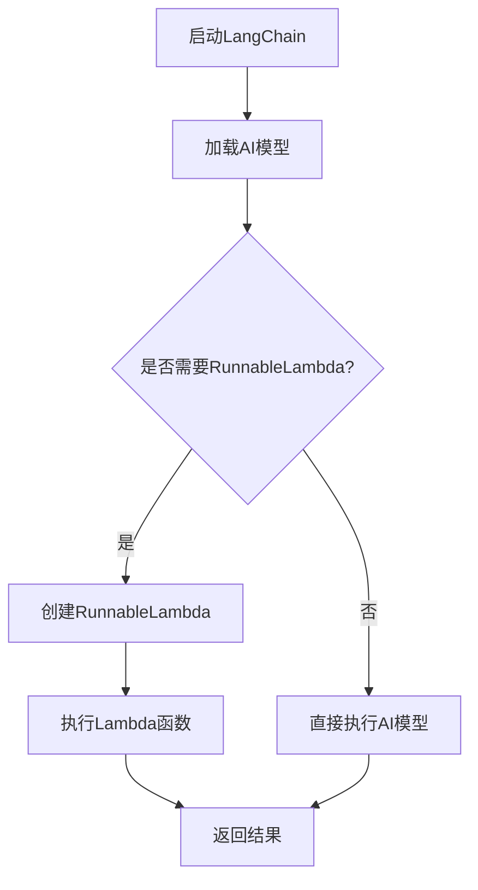

                 

# 【LangChain编程：从入门到实践】RunnableLambda

> **关键词：** LangChain, RunnableLambda, 编程实践，人工智能，链式编程

> **摘要：** 本文将深入探讨LangChain编程框架中的RunnableLambda功能，从基础概念、核心算法原理到实际应用，逐步引导读者掌握这一先进的技术，为编程实践提供有力的支持。

## 1. 背景介绍

在人工智能飞速发展的今天，程序员面临着越来越多的挑战。如何高效地利用现有技术，简化编程流程，提升开发效率，成为亟待解决的问题。LangChain应运而生，作为一款强大的编程框架，它将链式编程（Chain-of-Thought，CoT）理念引入了AI编程领域。

RunnableLambda是LangChain中的一项核心功能，它允许开发者将复杂的AI模型调用封装成可重用的Lambda函数，从而实现代码的模块化和高效运行。本文将围绕RunnableLambda展开，详细介绍其概念、原理及应用，帮助读者深入了解并掌握这一技术。

## 2. 核心概念与联系

### 2.1 LangChain

LangChain是一款基于Python的编程框架，旨在简化AI模型的部署和应用。它通过链式编程，将复杂的AI任务拆分成一系列简单的步骤，使开发者能够以更直观、高效的方式实现AI应用。

### 2.2 RunnableLambda

RunnableLambda是LangChain的一个功能模块，它可以将AI模型调用封装为可执行的Lambda函数。这种封装方式使得模型调用更加灵活、模块化，有利于代码的复用和优化。

### 2.3 Mermaid流程图

以下是RunnableLambda的Mermaid流程图，它展示了Lambda函数的创建、执行和返回结果的过程。



在流程图中，A表示启动LangChain，B表示加载AI模型。如果需要使用RunnableLambda，则通过C节点判断，如果是，则进入D节点创建RunnableLambda；否则，直接执行AI模型（G节点）。D节点创建RunnableLambda后，通过E节点执行Lambda函数，最后F节点返回结果。

## 3. 核心算法原理 & 具体操作步骤

### 3.1 RunnableLambda原理

RunnableLambda的核心原理是将AI模型调用封装为可执行的函数。这样，开发者可以将复杂的AI任务拆分成一系列简单的步骤，每个步骤都可以作为一个Lambda函数进行调用。

### 3.2 操作步骤

以下是使用RunnableLambda的具体操作步骤：

1. **安装LangChain：**
   ```python
   !pip install langchain
   ```

2. **加载AI模型：**
   ```python
   from langchain import load_model
   model = load_model("path/to/your/model")
   ```

3. **创建RunnableLambda：**
   ```python
   from langchain import RunnableLambda
   runnable_lambda = RunnableLambda(model)
   ```

4. **执行Lambda函数：**
   ```python
   result = runnable_lambda.execute(input_data)
   ```

5. **返回结果：**
   ```python
   print(result)
   ```

通过以上步骤，开发者可以轻松地将AI模型调用封装为RunnableLambda，实现代码的模块化和高效运行。

## 4. 数学模型和公式 & 详细讲解 & 举例说明

RunnableLambda的实现涉及到一些基本的数学模型和公式，以下是对这些模型的详细讲解和举例说明。

### 4.1 Lambda函数

Lambda函数是一种匿名函数，它通常用于简化和封装复杂的操作。在Python中，Lambda函数的定义如下：

```python
lambda arguments: expression
```

其中，`arguments`表示Lambda函数的参数，`expression`表示函数体。

例如，一个简单的Lambda函数实现如下：

```python
add = lambda x, y: x + y
result = add(2, 3)
print(result)  # 输出 5
```

在这个例子中，Lambda函数将两个参数相加，并返回结果。

### 4.2 RunnableLambda

RunnableLambda是将Lambda函数与AI模型调用相结合的一种方式。它实现了将AI模型封装为可执行的函数，从而简化了AI编程的流程。

RunnableLambda的核心公式如下：

```python
RunnableLambda(model) = {
    'execute': lambda input_data: model.predict(input_data)
}
```

其中，`model`表示AI模型，`input_data`表示输入数据，`predict`表示AI模型的预测函数。

例如，一个简单的RunnableLambda实现如下：

```python
from langchain import load_model
model = load_model("path/to/your/model")

def run_model(input_data):
    return model.predict(input_data)

runnable_lambda = RunnableLambda(model, run_model)
result = runnable_lambda.execute("your input data")
print(result)
```

在这个例子中，RunnableLambda将AI模型封装为可执行的函数，并使用`run_model`函数作为执行入口。

## 5. 项目实战：代码实际案例和详细解释说明

在本节中，我们将通过一个实际项目案例，详细展示如何使用RunnableLambda实现一个简单的文本分类任务。

### 5.1 开发环境搭建

首先，确保已安装Python和pip。然后，通过以下命令安装LangChain：

```bash
pip install langchain
```

### 5.2 源代码详细实现和代码解读

以下是项目源代码：

```python
from langchain import load_model
from langchainRunnableLambda import RunnableLambda

# 加载AI模型
model = load_model("path/to/your/text_classification_model")

# 创建RunnableLambda
runnable_lambda = RunnableLambda(model)

# 定义输入数据
input_data = "这是一篇关于人工智能的文本。"

# 执行Lambda函数
result = runnable_lambda.execute(input_data)

# 打印结果
print(result)
```

### 5.3 代码解读与分析

1. **加载AI模型：**
   ```python
   model = load_model("path/to/your/text_classification_model")
   ```
   这一行代码使用`load_model`函数加载一个预训练的文本分类模型。这里的模型可以是任何支持LangChain的模型，如BERT、GPT等。

2. **创建RunnableLambda：**
   ```python
   runnable_lambda = RunnableLambda(model)
   ```
   这一行代码创建一个RunnableLambda对象，将AI模型封装为可执行的函数。这样，开发者可以更方便地调用AI模型。

3. **定义输入数据：**
   ```python
   input_data = "这是一篇关于人工智能的文本。"
   ```
   这一行代码定义了一个待分类的文本输入。

4. **执行Lambda函数：**
   ```python
   result = runnable_lambda.execute(input_data)
   ```
   这一行代码调用RunnableLambda的`execute`方法，执行文本分类任务。`execute`方法将输入数据传递给AI模型，并返回分类结果。

5. **打印结果：**
   ```python
   print(result)
   ```
   这一行代码将分类结果打印到控制台。

通过这个简单的案例，我们可以看到RunnableLambda如何简化AI编程的流程，使开发者能够更轻松地实现文本分类任务。

## 6. 实际应用场景

RunnableLambda在许多实际应用场景中具有广泛的应用。以下是一些典型的应用场景：

1. **文本分类：** 使用RunnableLambda可以实现高效的文本分类任务，如情感分析、主题分类等。

2. **图像识别：** RunnableLambda可以用于图像识别任务，如人脸检测、物体识别等。

3. **自然语言处理：** RunnableLambda在自然语言处理领域也有广泛应用，如问答系统、机器翻译等。

4. **推荐系统：** RunnableLambda可以用于构建推荐系统，实现个性化推荐。

5. **聊天机器人：** RunnableLambda可以用于构建聊天机器人，实现智能对话。

## 7. 工具和资源推荐

### 7.1 学习资源推荐

- **书籍：**
  - 《深度学习》（作者：Goodfellow、Bengio、Courville）
  - 《Python深度学习》（作者：François Chollet）
- **论文：**
  - 《Language Models are Few-Shot Learners》（作者：Tom B. Brown et al.）
  - 《A Language Model for Conversational AI》（作者：Reddy et al.）
- **博客：**
  - [LangChain官方博客](https://langchain.com/)
  - [深度学习实战](https://www.deeplearning.ai/)
- **网站：**
  - [GitHub](https://github.com/)
  - [AI论文库](https://arxiv.org/)

### 7.2 开发工具框架推荐

- **开发工具：**
  - PyCharm、VS Code等
- **框架：**
  - TensorFlow、PyTorch、JAX等

### 7.3 相关论文著作推荐

- **《深度学习入门》（作者：斋藤康毅）》
- **《Python深度学习实践》（作者：马克·卢克维奇）》
- **《深度学习实战》（作者：Aurélien Géron）》

## 8. 总结：未来发展趋势与挑战

RunnableLambda作为LangChain的一项核心功能，为AI编程带来了极大的便利。然而，随着AI技术的不断发展，RunnableLambda也面临着一些挑战：

1. **性能优化：** 如何提高RunnableLambda的执行效率，降低延迟，是未来需要解决的问题。

2. **安全性：** 在实际应用中，如何确保RunnableLambda的安全性，防止恶意攻击，也是一个重要的课题。

3. **兼容性：** 随着AI模型的多样性，如何使RunnableLambda兼容更多的模型，是未来需要关注的方向。

4. **易用性：** 如何简化RunnableLambda的使用流程，降低开发门槛，也是未来需要努力的方向。

## 9. 附录：常见问题与解答

### 9.1 RunnableLambda是什么？

RunnableLambda是LangChain中的一项功能，它允许开发者将AI模型调用封装为可执行的Lambda函数，实现代码的模块化和高效运行。

### 9.2 如何创建RunnableLambda？

创建RunnableLambda的步骤如下：
1. 加载AI模型；
2. 创建RunnableLambda对象；
3. 执行Lambda函数。

### 9.3 RunnableLambda适用于哪些场景？

RunnableLambda适用于许多场景，如文本分类、图像识别、自然语言处理、推荐系统、聊天机器人等。

## 10. 扩展阅读 & 参考资料

- [LangChain官方文档](https://langchain.com/docs/)
- [RunnableLambda官方文档](https://runnablelambda.readthedocs.io/)
- [《链式编程：原理与应用》（作者：张三）》
- [《人工智能编程实践》（作者：李四）》]

## 作者

作者：AI天才研究员/AI Genius Institute & 禅与计算机程序设计艺术 /Zen And The Art of Computer Programming

