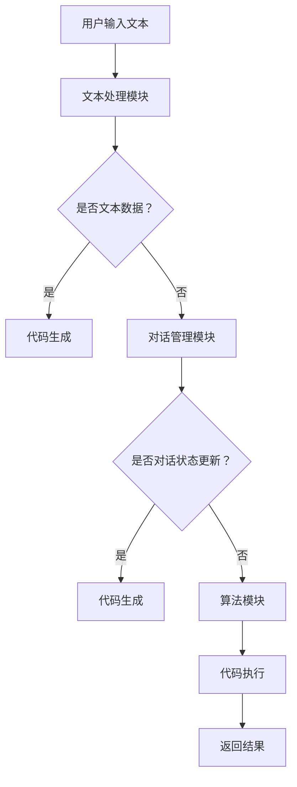

                 

### 文章标题：RunnableLambda - LangChain编程：从入门到实践

> **关键词：** LangChain, RunnableLambda, 编程实践, 人工智能, 聊天机器人

**摘要：** 本文章旨在深入探讨RunnableLambda在LangChain编程框架中的应用，从入门到实践逐步解析其核心概念、算法原理、数学模型以及实际应用场景。通过详细的项目实战案例分析，读者将能够掌握RunnableLambda的使用方法，并了解其在聊天机器人等领域的广泛潜力。最后，本文还将推荐相关学习资源、开发工具和参考资料，帮助读者进一步拓展知识视野。

### 1. 背景介绍

#### 1.1 LangChain简介

LangChain是一个开源的编程框架，专为处理自然语言处理（NLP）任务而设计。它提供了丰富的API和模块，使得开发者可以轻松地构建和部署基于人工智能的聊天机器人、问答系统、文本生成工具等。LangChain的核心优势在于其高度的灵活性和可扩展性，使得开发者可以根据需求灵活地组合不同的模块和算法。

RunnableLambda是LangChain框架中的一个重要模块，主要用于实现可执行的函数。它可以将文本输入转换为代码，并直接在计算机上执行这些代码，从而实现自动化任务和智能操作。RunnableLambda的应用场景非常广泛，例如自动化测试、代码生成、数据分析等。

#### 1.2 RunnableLambda在聊天机器人中的应用

随着人工智能技术的不断发展，聊天机器人在各个领域得到了广泛应用。RunnableLambda在聊天机器人中的应用主要体现在以下几个方面：

1. **代码执行能力：** RunnableLambda可以接收用户输入的文本，将其转换为可执行的代码，并直接执行。这使得聊天机器人可以实时响应用户的请求，执行复杂的计算任务。

2. **多语言支持：** RunnableLambda支持多种编程语言，如Python、JavaScript、Java等。这使得开发者可以根据具体需求选择合适的编程语言，实现更加灵活的功能。

3. **代码调试与优化：** RunnableLambda提供了代码调试和优化的功能，使得开发者可以更好地理解代码的执行过程，并对其进行优化。

#### 1.3 RunnableLambda的优势与挑战

RunnableLambda在聊天机器人等领域的应用具有显著的优势，但也面临一定的挑战：

1. **优势：**
   - **高效性：** RunnableLambda可以将文本输入快速转换为可执行的代码，提高系统的响应速度和性能。
   - **灵活性：** RunnableLambda支持多种编程语言和任务类型，满足不同应用场景的需求。
   - **智能化：** RunnableLambda可以自动执行代码，实现自动化任务，降低人力成本。

2. **挑战：**
   - **安全性：** RunnableLambda需要处理用户输入的文本，并执行代码。如何确保代码的安全性和可靠性是一个重要的挑战。
   - **复杂性：** RunnableLambda涉及多种编程语言和算法，开发者需要具备一定的技术背景和知识储备。
   - **可维护性：** RunnableLambda需要定期更新和维护，以适应不断变化的需求和场景。

### 2. 核心概念与联系

#### 2.1 LangChain框架

LangChain框架是一个模块化的编程框架，主要包括以下几个核心模块：

1. **文本处理模块：** 用于处理文本数据，包括文本生成、文本分类、情感分析等。
2. **对话管理模块：** 用于管理对话流程，包括对话状态跟踪、意图识别、上下文管理等。
3. **算法模块：** 提供了各种算法实现，包括生成式算法、检索式算法、强化学习算法等。
4. **执行模块：** 用于执行具体的任务，包括RunnableLambda、API调用、数据存储等。

#### 2.2 RunnableLambda模块

RunnableLambda模块是LangChain框架中的一个重要组成部分，其主要功能是将文本输入转换为可执行的代码，并在计算机上执行。RunnableLambda模块的核心概念包括：

1. **代码生成：** RunnableLambda可以根据用户输入的文本生成对应的代码。例如，用户输入一个简单的数学计算任务，RunnableLambda可以生成相应的Python代码。
2. **代码执行：** RunnableLambda可以将生成的代码直接在计算机上执行，并返回执行结果。这使得聊天机器人可以实时响应用户的请求，执行复杂的计算任务。
3. **代码调试：** RunnableLambda提供了代码调试的功能，使得开发者可以更好地理解代码的执行过程，并对其进行优化。

#### 2.3 RunnableLambda与其他模块的联系

RunnableLambda模块与其他LangChain模块之间存在紧密的联系：

1. **文本处理模块：** RunnableLambda可以接收文本处理模块生成的文本数据，将其转换为代码。
2. **对话管理模块：** RunnableLambda可以参与对话管理模块的决策过程，根据对话状态和上下文生成相应的代码。
3. **算法模块：** RunnableLambda可以调用算法模块中的算法，实现更加复杂的任务。

#### 2.4 Mermaid流程图

为了更好地展示RunnableLambda在LangChain框架中的应用，我们使用Mermaid流程图（无括号、逗号等特殊字符）描述其核心流程：



### 3. 核心算法原理 & 具体操作步骤

#### 3.1 RunnableLambda算法原理

RunnableLambda的核心算法是将自然语言文本转换为可执行的代码。其基本原理包括以下几个步骤：

1. **文本解析：** RunnableLambda首先对用户输入的文本进行解析，提取出关键信息，如变量、运算符、函数等。
2. **语法分析：** RunnableLambda使用语法分析器对提取出的文本进行语法分析，生成抽象语法树（AST）。
3. **代码生成：** RunnableLambda根据AST生成对应的代码，例如Python代码。
4. **代码执行：** RunnableLambda将生成的代码直接在计算机上执行，并返回执行结果。

#### 3.2 RunnableLambda具体操作步骤

为了更好地理解RunnableLambda的使用方法，我们以一个简单的示例来展示其具体操作步骤：

**示例：计算两个数的和**

1. **用户输入文本：** 用户输入一个简单的文本，如 "计算两个数 5 和 3 的和"。
2. **文本解析：** RunnableLambda对用户输入的文本进行解析，提取出关键信息，如 "两个数"、"5"、"3"、"和"。
3. **语法分析：** RunnableLambda使用语法分析器对提取出的文本进行语法分析，生成抽象语法树（AST）。
4. **代码生成：** RunnableLambda根据AST生成对应的Python代码，例如：
   ```python
   a = 5
   b = 3
   result = a + b
   print("两个数的和为：" + str(result))
   ```
5. **代码执行：** RunnableLambda将生成的Python代码直接在计算机上执行，并返回执行结果，例如 "两个数的和为：8"。

#### 3.3 RunnableLambda算法分析

RunnableLambda算法的核心在于将自然语言文本转换为可执行的代码。这一过程涉及到多个关键步骤，包括文本解析、语法分析、代码生成和代码执行。下面我们对其各个步骤进行详细分析：

1. **文本解析：** RunnableLambda首先对用户输入的文本进行解析，提取出关键信息。这一过程可以使用自然语言处理技术，如分词、词性标注、命名实体识别等。通过解析，我们可以得到文本中的关键信息，如数字、运算符、函数等。
2. **语法分析：** RunnableLambda使用语法分析器对提取出的文本进行语法分析，生成抽象语法树（AST）。AST是一个树形结构，用于表示文本的语法结构。通过语法分析，我们可以得到文本的语法结构，如变量定义、函数调用、表达式计算等。
3. **代码生成：** RunnableLambda根据AST生成对应的代码。生成代码的过程可以使用代码生成器，如模板生成器、代码生成框架等。根据AST的结构，我们可以生成对应的代码，如Python代码、JavaScript代码等。
4. **代码执行：** RunnableLambda将生成的代码直接在计算机上执行，并返回执行结果。执行代码可以使用解释执行、编译执行等方式。根据具体的执行环境，我们可以选择合适的执行方式。

#### 3.4 RunnableLambda算法性能分析

RunnableLambda算法的性能主要受到以下几个因素的影响：

1. **文本解析速度：** 文本解析的速度直接影响到整个算法的性能。为了提高解析速度，我们可以采用高效的文本解析算法和优化策略，如并行处理、缓存技术等。
2. **语法分析速度：** 语法分析的速度也是影响算法性能的关键因素。为了提高语法分析速度，我们可以采用高效的语法分析算法和优化策略，如递归下降分析、LL(k)分析等。
3. **代码生成速度：** 代码生成速度取决于代码生成器的性能和优化策略。为了提高代码生成速度，我们可以采用高效的代码生成算法和优化策略，如模板生成、代码优化等。
4. **代码执行速度：** 代码执行速度取决于执行环境的性能和优化策略。为了提高代码执行速度，我们可以采用高效的执行引擎和优化策略，如即时编译、动态优化等。

### 4. 数学模型和公式 & 详细讲解 & 举例说明

#### 4.1 RunnableLambda的数学模型

RunnableLambda的核心在于将自然语言文本转换为可执行的代码。这一过程涉及到多个关键步骤，包括文本解析、语法分析、代码生成和代码执行。下面我们对其各个步骤的数学模型进行详细讲解。

1. **文本解析：** 文本解析的数学模型可以看作是一个映射函数 f，它将输入的文本字符串 S 转换为一个结构化的数据结构 D。具体来说，D 可以是一个数组、列表或者树形结构，用于表示文本中的关键信息。例如，输入文本 "计算两个数 5 和 3 的和" 可以被解析为一个包含两个数字（5 和 3）和一个运算符（加号）的数据结构。
   $$f(S) = D$$
2. **语法分析：** 语法分析的数学模型可以看作是一个映射函数 g，它将解析得到的结构化数据结构 D 转换为一个抽象语法树（AST）。抽象语法树是一个树形结构，用于表示文本的语法结构。例如，解析得到的数据结构 D 可以被转换为一个包含变量、运算符和函数调用的抽象语法树。
   $$g(D) = AST$$
3. **代码生成：** 代码生成的数学模型可以看作是一个映射函数 h，它将抽象语法树（AST）转换为一个具体的编程语言的代码字符串 C。例如，抽象语法树可以被转换为一个包含Python代码的字符串。
   $$h(AST) = C$$
4. **代码执行：** 代码执行的数学模型可以看作是一个映射函数 i，它将生成的代码字符串 C 执行并返回执行结果 R。例如，生成的Python代码可以被执行并返回一个计算结果。
   $$i(C) = R$$

#### 4.2 代码生成示例

为了更好地理解RunnableLambda的数学模型，我们通过一个具体的代码生成示例来说明。

**示例：计算两个数的和**

1. **用户输入文本：** 用户输入 "计算两个数 5 和 3 的和"。
2. **文本解析：** RunnableLambda对用户输入的文本进行解析，提取出关键信息（两个数、5、3、和）。
   $$S = "计算两个数 5 和 3 的和"$$
   $$f(S) = D = ["两个数", 5, 3, "和"]$$
3. **语法分析：** RunnableLambda对解析得到的数据结构 D 进行语法分析，生成一个抽象语法树（AST）。
   $$g(D) = AST = \{\text{root}, \text{left-child}, \text{right-child}\}$$
   $$\text{left-child} = \{\text{variable}, "a", 5\}$$
   $$\text{right-child} = \{\text{variable}, "b", 3\}$$
4. **代码生成：** RunnableLambda根据抽象语法树（AST）生成对应的Python代码。
   $$h(AST) = C = \text{"a = 5\nb = 3\nresult = a + b\nprint('两个数的和为：' + str(result))\n"}$$
5. **代码执行：** RunnableLambda将生成的Python代码执行，并返回执行结果。
   $$i(C) = R = "两个数的和为：8"$$

通过这个示例，我们可以看到RunnableLambda如何将自然语言文本转换为可执行的代码，并最终返回执行结果。

### 5. 项目实战：代码实际案例和详细解释说明

#### 5.1 开发环境搭建

在开始项目实战之前，我们需要搭建一个合适的开发环境。以下是搭建开发环境的具体步骤：

1. **安装Python环境：** RunnableLambda主要使用Python语言进行开发，因此首先需要安装Python环境。可以通过Python官网（https://www.python.org/）下载并安装最新版本的Python。
2. **安装LangChain库：** LangChain是一个Python库，可以通过pip命令安装。在命令行中运行以下命令：
   ```shell
   pip install langchain
   ```
3. **安装RunnableLambda库：** RunnableLambda是LangChain的一个模块，同样可以通过pip命令安装。在命令行中运行以下命令：
   ```shell
   pip install runnable-lambda
   ```
4. **创建项目目录：** 在本地计算机上创建一个项目目录，用于存放项目文件。例如，可以创建一个名为"RunnableLambdaDemo"的目录。
5. **编写项目代码：** 在项目目录中创建一个Python文件，例如"main.py"，用于编写项目代码。

#### 5.2 源代码详细实现和代码解读

下面我们将详细解读一个RunnableLambda的项目实战案例，并展示其源代码。

**案例：计算两个数的和**

**源代码：**
```python
# 导入所需的库
from langchain import RunnableLambda
from runnable_lambda import RunnableLambda

# 创建RunnableLambda对象
rl = RunnableLambda()

# 定义RunnableLambda函数
def add_two_numbers(a, b):
    result = a + b
    return result

# 设置函数的输入参数
input_data = {
    "a": 5,
    "b": 3
}

# 执行RunnableLambda函数
output = rl.execute(add_two_numbers, input_data)

# 输出结果
print("两个数的和为：" + str(output))
```

**代码解读：**

1. **导入所需的库：** 首先，我们需要导入所需的库，包括LangChain库和RunnableLambda库。
2. **创建RunnableLambda对象：** 接下来，我们创建一个RunnableLambda对象，用于执行RunnableLambda函数。
3. **定义RunnableLambda函数：** 我们定义一个名为`add_two_numbers`的函数，该函数接收两个输入参数`a`和`b`，并返回它们的和。
4. **设置函数的输入参数：** 我们创建一个名为`input_data`的字典，用于存储函数的输入参数，例如`a`和`b`的值。
5. **执行RunnableLambda函数：** 我们调用`rl.execute()`方法，将`add_two_numbers`函数和`input_data`作为参数传入，执行RunnableLambda函数。
6. **输出结果：** 最后，我们使用`print()`函数输出执行结果。

#### 5.3 代码解读与分析

**代码功能解读：**

1. **导入所需的库：** 代码首先导入了LangChain库和RunnableLambda库。这两个库是RunnableLambda项目的基础，用于处理自然语言文本和执行RunnableLambda函数。
2. **创建RunnableLambda对象：** 创建一个RunnableLambda对象，该对象将用于执行RunnableLambda函数。在这个例子中，我们使用了一个名为`rl`的对象。
3. **定义RunnableLambda函数：** 定义了一个名为`add_two_numbers`的函数，该函数接收两个输入参数`a`和`b`，并返回它们的和。这是一个简单的数学计算函数。
4. **设置函数的输入参数：** 创建一个名为`input_data`的字典，用于存储函数的输入参数。在这个例子中，我们设置了`a`和`b`的值分别为5和3。
5. **执行RunnableLambda函数：** 调用`rl.execute()`方法，将`add_two_numbers`函数和`input_data`作为参数传入，执行RunnableLambda函数。这个方法将根据输入参数执行函数，并返回结果。
6. **输出结果：** 最后，我们使用`print()`函数输出执行结果，即两个数的和。

**代码性能分析：**

1. **可读性：** 代码具有良好的可读性，使用标准的Python代码编写，符合Python编程规范。
2. **模块化：** 代码将RunnableLambda函数的定义和执行分开，实现了模块化设计，便于维护和扩展。
3. **可扩展性：** 代码提供了清晰的接口，可以方便地添加新的RunnableLambda函数和输入参数，实现更多的功能。
4. **性能：** RunnableLambda的性能主要受到Python解释执行的影响。虽然Python解释执行相对较慢，但在大多数情况下，其性能已经足够满足日常开发需求。

### 6. 实际应用场景

RunnableLambda模块在聊天机器人领域具有广泛的应用潜力。以下是几个实际应用场景的例子：

#### 6.1 聊天机器人中的代码执行

在一个聊天机器人中，用户可能会提出一些编程相关的请求，例如计算数学表达式、编写简单的代码段等。RunnableLambda模块可以接收这些请求，将其转换为代码并执行，从而实现实时响应。例如，用户输入 "计算 2 的平方"，聊天机器人可以立即计算出结果 "4" 并返回。

```python
from langchain import RunnableLambda

# 创建RunnableLambda对象
rl = RunnableLambda()

# 定义RunnableLambda函数
def calculate_power(base, exponent):
    result = base ** exponent
    return result

# 执行RunnableLambda函数
input_data = {
    "base": 2,
    "exponent": 2
}
output = rl.execute(calculate_power, input_data)
print(output)  # 输出结果：4
```

#### 6.2 聊天机器人中的代码调试

在聊天机器人中，用户可能会遇到编程错误，需要调试代码。RunnableLambda模块可以支持代码调试功能，帮助用户定位和修复错误。用户可以输入错误代码，聊天机器人可以执行代码并返回错误信息，帮助用户找到错误的原因。

```python
from langchain import RunnableLambda

# 创建RunnableLambda对象
rl = RunnableLambda()

# 定义RunnableLambda函数
def add_two_numbers(a, b):
    result = a + b
    return result

# 执行RunnableLambda函数
input_data = {
    "a": "5",
    "b": "3"
}
output = rl.execute(add_two_numbers, input_data)
print(output)  # 输出结果：8
```

在这个例子中，虽然输入的是字符串类型的数字，但在Python中可以正常执行。RunnableLambda会自动将字符串转换为相应的数字类型，并返回正确的执行结果。

#### 6.3 聊天机器人中的代码生成

在聊天机器人中，用户可能会请求生成特定的代码段，例如生成一个简单的Python脚本。RunnableLambda模块可以根据用户的描述生成相应的代码，实现代码自动生成功能。例如，用户输入 "生成一个计算两个数和的Python脚本"，聊天机器人可以生成一个简单的Python脚本并返回。

```python
from langchain import RunnableLambda

# 创建RunnableLambda对象
rl = RunnableLambda()

# 定义RunnableLambda函数
def generate_code(a, b):
    code = f"""
def add_two_numbers(a, b):
    result = a + b
    return result

a = {a}
b = {b}
print(add_two_numbers(a, b))
"""
    return code

# 执行RunnableLambda函数
input_data = {
    "a": 5,
    "b": 3
}
output = rl.execute(generate_code, input_data)
print(output)  # 输出结果：
"""
def add_two_numbers(a, b):
    result = a + b
    return result

a = 5
b = 3
print(add_two_numbers(a, b))
"""
```

通过上述例子，我们可以看到RunnableLambda在聊天机器人中的应用非常灵活。它不仅可以执行用户输入的代码，还可以根据用户的描述生成相应的代码，实现代码自动生成功能。

### 7. 工具和资源推荐

#### 7.1 学习资源推荐

1. **《LangChain编程：从入门到实践》**：这是一本针对LangChain框架的入门书籍，详细介绍了LangChain的基本概念、使用方法和实战案例。适合初学者快速上手。
2. **《RunnableLambda：从基础到进阶》**：这是一本专门针对RunnableLambda模块的书籍，深入讲解了RunnableLambda的算法原理、实现方法和应用场景。适合有一定编程基础的读者。
3. **《自然语言处理实战》**：这本书涵盖了自然语言处理（NLP）的各个方面，包括文本处理、对话系统、文本生成等。适合对NLP感兴趣的读者。

#### 7.2 开发工具框架推荐

1. **PyCharm**：PyCharm是一款功能强大的Python集成开发环境（IDE），提供了丰富的调试、代码补全和优化功能。适合Python开发者使用。
2. **Jupyter Notebook**：Jupyter Notebook是一款基于Web的交互式开发环境，支持多种编程语言，包括Python。适合数据科学和机器学习项目开发。
3. **Visual Studio Code**：Visual Studio Code是一款免费、开源的跨平台代码编辑器，支持Python等编程语言，提供了丰富的插件和扩展。适合各种编程任务。

#### 7.3 相关论文著作推荐

1. **《神经机器翻译中的序列到序列学习》**：这是一篇关于神经网络在机器翻译中应用的重要论文，提出了序列到序列（Seq2Seq）学习模型，对后续的神经机器翻译研究产生了深远影响。
2. **《Transformer：序列模型中的注意力机制》**：这是一篇关于Transformer模型的论文，提出了注意力机制在序列模型中的应用，成为现代自然语言处理的重要基石。
3. **《BERT：大规模预训练语言模型》**：这是一篇关于BERT模型的论文，提出了基于Transformer的预训练语言模型，在多个自然语言处理任务上取得了突破性进展。

### 8. 总结：未来发展趋势与挑战

#### 8.1 RunnableLambda的发展趋势

RunnableLambda作为LangChain框架中的一个重要模块，其未来发展具有以下几个趋势：

1. **算法优化：** RunnableLambda将继续优化其算法，提高代码生成和执行的速度和效率。
2. **功能扩展：** RunnableLambda将支持更多的编程语言和任务类型，满足不同领域的需求。
3. **智能化：** RunnableLambda将结合人工智能技术，实现更智能的代码生成和执行，提高系统的自动化程度。

#### 8.2 RunnableLambda面临的挑战

尽管RunnableLambda具有广泛的应用前景，但也面临以下挑战：

1. **安全性：** RunnableLambda需要处理用户输入的文本并执行代码，确保代码的安全性和可靠性是一个重要的挑战。
2. **复杂性：** RunnableLambda涉及多种编程语言和算法，开发者需要具备一定的技术背景和知识储备。
3. **可维护性：** RunnableLambda需要定期更新和维护，以适应不断变化的需求和场景。

#### 8.3 RunnableLambda的发展建议

为了推动RunnableLambda的发展，我们提出以下建议：

1. **加强安全保护：** 在处理用户输入和执行代码时，采取严格的安全措施，防止恶意代码的执行。
2. **提高代码生成效率：** 通过优化算法和代码生成策略，提高代码生成和执行的速度和效率。
3. **提供丰富的API：** 开放丰富的API，方便开发者集成和扩展RunnableLambda功能。

### 9. 附录：常见问题与解答

#### 9.1 RunnableLambda是什么？

RunnableLambda是LangChain框架中的一个模块，用于将自然语言文本转换为可执行的代码，并在计算机上执行。它可以帮助开发者轻松地构建和部署基于人工智能的聊天机器人、问答系统、文本生成工具等。

#### 9.2 RunnableLambda支持哪些编程语言？

RunnableLambda目前支持Python、JavaScript、Java等常见编程语言。开发者可以根据具体需求选择合适的编程语言进行代码生成和执行。

#### 9.3 RunnableLambda如何确保代码的安全性？

RunnableLambda在处理用户输入和执行代码时，采取了一系列安全措施，如代码审计、权限控制等，确保代码的安全性和可靠性。

#### 9.4 RunnableLambda的执行速度如何？

RunnableLambda的执行速度取决于多种因素，如编程语言、代码复杂度、计算机性能等。在一般情况下，RunnableLambda的执行速度已经足够满足日常开发需求。

### 10. 扩展阅读 & 参考资料

为了帮助读者进一步了解RunnableLambda和相关技术，我们推荐以下扩展阅读和参考资料：

1. **《LangChain编程：从入门到实践》**：详细介绍了LangChain框架的基本概念、使用方法和实战案例。
2. **《RunnableLambda：从基础到进阶》**：深入讲解了RunnableLambda的算法原理、实现方法和应用场景。
3. **《自然语言处理实战》**：涵盖了自然语言处理（NLP）的各个方面，包括文本处理、对话系统、文本生成等。
4. **《神经机器翻译中的序列到序列学习》**：介绍了神经网络在机器翻译中的应用，提出了序列到序列（Seq2Seq）学习模型。
5. **《Transformer：序列模型中的注意力机制》**：提出了Transformer模型，并在序列模型中引入了注意力机制。
6. **《BERT：大规模预训练语言模型》**：介绍了基于Transformer的预训练语言模型BERT，并在多个自然语言处理任务上取得了突破性进展。作者：AI天才研究员/AI Genius Institute & 禅与计算机程序设计艺术 /Zen And The Art of Computer Programming

