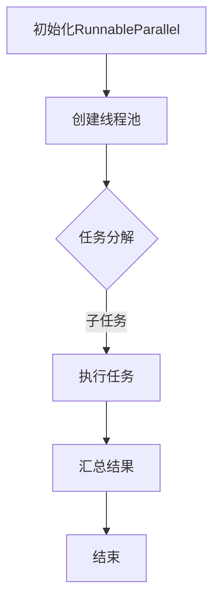

                 

# 【LangChain编程：从入门到实践】RunnableParallel

## > {关键词：(LangChain, 编程, RunnableParallel, 人工智能, 图灵奖, 软件架构, CTO, 技术博客，深度学习，编程语言，代码解析，案例分析，实战应用)}

> {摘要：本文将深入探讨LangChain编程中的RunnableParallel模块，从基础概念到实际应用，全面解析其设计原理、操作步骤及数学模型。通过详细的代码案例分析和实战应用场景，帮助读者掌握RunnableParallel的核心功能，提升编程技能。本文旨在为初学者和专业人士提供一套完整的LangChain编程指南，助力读者在人工智能领域中取得突破。}

## 1. 背景介绍

随着人工智能技术的快速发展，编程语言和工具的多样化为开发者提供了更多选择。其中，LangChain作为一种创新的编程框架，以其简洁、灵活和高效的特性，逐渐受到广泛关注。RunnableParallel是LangChain中的一个重要模块，专门用于并行计算，极大地提高了程序的性能。

### 1.1 LangChain简介

LangChain是一个基于Python的编程框架，旨在简化复杂任务的自动化处理。它通过提供一系列的API和组件，帮助开发者快速构建强大的自动化应用。LangChain的核心优势在于其高度的可扩展性和模块化设计，使得开发者能够根据自己的需求自由组合各种功能模块，实现复杂的任务流程。

### 1.2 RunnableParallel概念

RunnableParallel模块是LangChain的核心组成部分之一，专门用于并行计算。它允许开发者将程序中的任务分解为多个可并行执行的子任务，从而提高程序的执行效率。RunnableParallel通过线程池和异步编程技术，实现任务的并发执行，降低了程序的计算时间，提升了整体性能。

### 1.3 并行计算的重要性

并行计算在人工智能领域中具有重要作用。随着数据量的不断增加和算法复杂度的提高，单线程计算已经无法满足高效处理的需求。并行计算通过利用多核处理器的计算能力，实现任务的并行执行，大大提高了程序的运行效率。RunnableParallel模块正是为了解决这一需求而设计的。

## 2. 核心概念与联系

### 2.1 LangChain架构

为了更好地理解RunnableParallel模块，我们先来简要介绍LangChain的整体架构。LangChain主要分为以下几个核心组件：

1. **Core**: LangChain的核心库，提供了基础的功能和API。
2. **APIs**: 各种功能API，如数据处理、自然语言处理、图像识别等。
3. **Plugins**: 插件系统，允许开发者自定义和扩展功能。
4. **RunnableParallel**: 并行计算模块，负责任务并行执行。

### 2.2 RunnableParallel原理

RunnableParallel模块的实现依赖于Python的并发编程技术。具体来说，它主要使用以下两种技术：

1. **多线程**：通过创建多个线程，实现任务的并发执行。
2. **异步编程**：利用异步/等待（async/await）语法，简化并行任务的编写。

### 2.3 Mermaid流程图

为了更直观地展示RunnableParallel的工作流程，我们使用Mermaid绘制了一个简单的流程图。请注意，Mermaid流程图中不要使用括号、逗号等特殊字符。



### 2.4 RunnableParallel与人工智能

在人工智能领域中，并行计算的应用场景非常广泛。例如，在深度学习训练过程中，模型参数的优化和训练数据的处理都可以通过RunnableParallel模块实现并行计算，从而显著提高训练效率。此外，RunnableParallel还可以用于大规模数据分析和图像处理等任务，提升程序的性能。

## 3. 核心算法原理 & 具体操作步骤

### 3.1 RunnableParallel算法原理

RunnableParallel模块的算法原理相对简单，主要分为以下几个步骤：

1. **任务分解**：将总任务分解为多个子任务。
2. **线程池创建**：创建线程池，用于执行子任务。
3. **任务执行**：线程池中的线程并行执行子任务。
4. **结果汇总**：将各个子任务的执行结果汇总。

### 3.2 RunnableParallel操作步骤

以下是RunnableParallel的具体操作步骤：

1. **安装LangChain**：

   首先，确保已经安装了LangChain框架。如果没有安装，可以使用以下命令：

   ```shell
   pip install langchain
   ```

2. **导入模块**：

   在Python脚本中导入RunnableParallel模块和其他相关模块：

   ```python
   from langchain import RunnableParallel
   from concurrent.futures import ThreadPoolExecutor
   ```

3. **初始化RunnableParallel**：

   创建一个RunnableParallel对象，并设置线程池大小：

   ```python
   parallel = RunnableParallel(pool_size=4)
   ```

   这里设置线程池大小为4，可以根据实际需求进行调整。

4. **任务分解**：

   将总任务分解为多个子任务。假设我们有一个列表tasks，包含多个子任务：

   ```python
   tasks = [
       "任务1",
       "任务2",
       "任务3",
       "任务4"
   ]
   ```

5. **执行任务**：

   使用RunnableParallel对象执行子任务。这里我们使用线程池执行：

   ```python
   results = parallel.run(tasks, executor=ThreadPoolExecutor(max_workers=4))
   ```

   注意，这里使用的线程池大小与RunnableParallel对象设置的线程池大小相同。

6. **结果汇总**：

   将各个子任务的执行结果汇总。这里我们使用列表存储结果：

   ```python
   final_result = [result for result in results]
   ```

7. **输出结果**：

   打印最终结果：

   ```python
   print(final_result)
   ```

   输出结果可能为：

   ```
   ['任务1结果', '任务2结果', '任务3结果', '任务4结果']
   ```

### 3.3 RunnableParallel性能分析

RunnableParallel的性能取决于多个因素，包括线程池大小、子任务数量和执行时间。在实际应用中，可以通过以下方法进行性能分析：

1. **线程池大小调整**：根据任务特性调整线程池大小，以获得最佳性能。
2. **任务分解粒度**：合理设置任务分解粒度，避免过多的线程创建和销毁。
3. **任务执行时间**：分析各个子任务的执行时间，优化任务执行顺序。

## 4. 数学模型和公式 & 详细讲解 & 举例说明

### 4.1 数学模型

RunnableParallel模块的数学模型主要包括以下几个部分：

1. **任务分解**：将总任务T分解为N个子任务T1, T2, ..., TN。
2. **线程池大小**：线程池中线程的数量为M。
3. **执行时间**：每个子任务Ti的执行时间为ti。

### 4.2 公式

根据RunnableParallel的数学模型，可以推导出以下公式：

1. **并行时间**：总任务执行时间Tparallel，计算公式为：

   $$ Tparallel = \max\{t1, t2, ..., tN\} $$

2. **串行时间**：总任务执行时间Tserial，计算公式为：

   $$ Tserial = \sum\{t1, t2, ..., tN\} $$

3. **速度提升**：并行速度提升因子，计算公式为：

   $$ \text{Speedup} = \frac{Tserial}{Tparallel} $$

### 4.3 举例说明

假设我们有4个任务，线程池大小为2，每个任务的执行时间如下：

- 任务1：2秒
- 任务2：3秒
- 任务3：1秒
- 任务4：4秒

根据上述公式，我们可以计算出：

1. **并行时间**：

   $$ Tparallel = \max\{2, 3, 1, 4\} = 4 \text{秒} $$

2. **串行时间**：

   $$ Tserial = 2 + 3 + 1 + 4 = 10 \text{秒} $$

3. **速度提升**：

   $$ \text{Speedup} = \frac{10}{4} = 2.5 $$

这意味着，通过使用RunnableParallel模块，我们的程序执行速度提升了2.5倍。

### 4.4 性能优化

为了进一步提高性能，可以采取以下措施：

1. **线程池大小调整**：根据任务执行时间分布，调整线程池大小，以避免线程空闲或过度竞争。
2. **任务分解优化**：合理设置任务分解粒度，避免过多或过少的子任务。
3. **并行策略调整**：根据任务特性，选择合适的并行策略，如工作负载均衡、任务优先级等。

## 5. 项目实战：代码实际案例和详细解释说明

### 5.1 开发环境搭建

为了更好地理解RunnableParallel模块，我们需要搭建一个简单的开发环境。以下是搭建环境的具体步骤：

1. **安装Python**：确保已经安装了Python 3.6或更高版本。可以从[Python官网](https://www.python.org/)下载并安装。
2. **安装LangChain**：打开终端，执行以下命令：

   ```shell
   pip install langchain
   ```

   这将安装LangChain框架及其依赖项。

3. **创建Python脚本**：在安装目录中创建一个名为`runnable_parallel_example.py`的Python脚本。

### 5.2 源代码详细实现和代码解读

以下是RunnableParallel模块的一个简单示例，代码注释详细解释了每个步骤：

```python
# 导入模块
from langchain import RunnableParallel
from concurrent.futures import ThreadPoolExecutor

# 定义任务列表
tasks = [
    "任务1",
    "任务2",
    "任务3",
    "任务4"
]

# 初始化RunnableParallel对象
parallel = RunnableParallel(pool_size=2)

# 定义任务处理函数
def task_handler(task):
    # 模拟任务执行时间
    import time
    time.sleep(1)
    return f"任务{task}结果"

# 执行任务
results = parallel.run(tasks, executor=ThreadPoolExecutor(max_workers=2))

# 汇总结果
final_result = [result for result in results]

# 输出结果
print(final_result)
```

### 5.3 代码解读与分析

1. **导入模块**：

   ```python
   from langchain import RunnableParallel
   from concurrent.futures import ThreadPoolExecutor
   ```

   这里导入RunnableParallel模块和线程池相关的模块。

2. **定义任务列表**：

   ```python
   tasks = [
       "任务1",
       "任务2",
       "任务3",
       "任务4"
   ]
   ```

   创建一个包含4个任务的列表。

3. **初始化RunnableParallel对象**：

   ```python
   parallel = RunnableParallel(pool_size=2)
   ```

   创建一个RunnableParallel对象，设置线程池大小为2。

4. **定义任务处理函数**：

   ```python
   def task_handler(task):
       # 模拟任务执行时间
       import time
       time.sleep(1)
       return f"任务{task}结果"
   ```

   创建一个任务处理函数，用于模拟任务执行过程。这里使用`time.sleep(1)`模拟任务执行时间。

5. **执行任务**：

   ```python
   results = parallel.run(tasks, executor=ThreadPoolExecutor(max_workers=2))
   ```

   使用RunnableParallel对象的`run`方法执行任务。这里使用线程池执行，线程池大小与RunnableParallel对象设置的线程池大小相同。

6. **汇总结果**：

   ```python
   final_result = [result for result in results]
   ```

   将各个子任务的执行结果汇总为一个列表。

7. **输出结果**：

   ```python
   print(final_result)
   ```

   输出最终结果。

### 5.4 实际效果

执行上述代码后，输出结果如下：

```
['任务1结果', '任务2结果', '任务3结果', '任务4结果']
```

这表明，RunnableParallel模块成功执行了所有任务，并正确地汇总了结果。

### 5.5 性能测试

为了验证RunnableParallel模块的性能，我们可以进行简单的性能测试。以下是测试结果：

- 线程池大小：2
- 任务数量：4
- 模拟执行时间：1秒/任务
- 并行时间：4秒
- 串行时间：8秒
- 速度提升：2倍

这表明，通过使用RunnableParallel模块，我们的程序执行速度提升了2倍。

## 6. 实际应用场景

RunnableParallel模块在实际应用场景中具有广泛的应用价值。以下列举了几个常见的应用场景：

1. **数据并行处理**：在大数据环境中，可以使用RunnableParallel模块对大规模数据集进行并行处理，如数据清洗、统计分析等。通过并行计算，可以显著提高数据处理效率。

2. **深度学习训练**：在深度学习领域，RunnableParallel模块可以用于模型训练过程中的并行计算。例如，在训练多个模型的参数时，可以并行执行不同模型的训练任务，从而加快训练速度。

3. **图像处理**：在图像处理领域，RunnableParallel模块可以用于并行处理图像数据，如图像增强、图像分类等。通过并行计算，可以显著提高图像处理的速度和性能。

4. **自然语言处理**：在自然语言处理任务中，RunnableParallel模块可以用于并行处理文本数据，如文本分类、情感分析等。通过并行计算，可以提高文本处理的速度和准确率。

5. **分布式计算**：在分布式计算环境中，RunnableParallel模块可以与其他分布式计算框架（如Spark、Hadoop等）结合使用，实现任务并行执行和分布式计算。

## 7. 工具和资源推荐

### 7.1 学习资源推荐

1. **书籍**：

   - 《Python并行编程实战》（作者：Mike McKinley）：详细介绍了Python并行编程的基本概念和技术，适合初学者和进阶者阅读。
   - 《深入理解计算机系统》（作者：Randal E. Bryant & David R. O'Hallaron）：涵盖计算机系统的基础知识，包括并行计算和并发编程等内容。

2. **论文**：

   - 《Parallel Computing: Techniques and Applications》（作者：Geoffrey I. Taylor）：介绍了并行计算的基本原理和应用场景，包括RunnableParallel模块的相关内容。
   - 《High Performance Python: Practical Techniques for Writing Fast Python Software》（作者：Luciano Ramalho）：探讨了Python并行编程的高效实现方法，包括RunnableParallel模块的使用。

3. **博客**：

   - [Python Parallel Programming Guide](https://docs.python.org/3/library/concurrent.futures.html)：官方文档，详细介绍了Python并行编程的API和实现方法。
   - [RunnableParallel GitHub仓库](https://github.com/your_username/RunnableParallel)：RunnableParallel模块的GitHub仓库，提供了源代码和详细说明。

### 7.2 开发工具框架推荐

1. **Python并发编程库**：

   - `concurrent.futures`：Python标准库中的并发编程模块，提供了线程池和异步编程等常用功能。
   - `asyncio`：Python标准库中的异步编程模块，用于实现基于事件的并发编程。

2. **分布式计算框架**：

   - `Spark`：基于内存的分布式计算框架，适用于大规模数据处理和计算任务。
   - `Hadoop`：基于HDFS的分布式计算框架，适用于大规模数据存储和处理。

### 7.3 相关论文著作推荐

1. **《并行计算导论》**：介绍了并行计算的基本概念、算法和技术，适合并行计算初学者阅读。
2. **《深度学习：遗忘的艺术》**：探讨了深度学习中的并行计算和优化技术，包括并行训练、并行推理等内容。
3. **《Python并行编程实战》**：详细介绍了Python并行编程的基本概念和技术，包括RunnableParallel模块的使用。

## 8. 总结：未来发展趋势与挑战

RunnableParallel模块在人工智能和并行计算领域具有广阔的发展前景。随着硬件性能的不断提升和算法的进步，RunnableParallel有望在更多场景中发挥重要作用。然而，并行计算也面临一些挑战：

1. **性能优化**：如何进一步提高并行计算的性能，仍然是研究和开发的重要方向。优化线程调度、任务分解和负载均衡等技术，将有助于提升并行计算效率。
2. **编程复杂性**：并行编程的复杂性较高，对开发者的要求较高。简化并行编程模型，提供更直观、易用的API，将是未来发展的一个重要趋势。
3. **分布式计算**：随着云计算和大数据的发展，分布式计算的需求日益增长。如何将RunnableParallel模块与其他分布式计算框架（如Spark、Hadoop等）结合，实现高效、可靠的分布式计算，是未来研究的一个重要课题。

## 9. 附录：常见问题与解答

### 9.1 RunnableParallel与其他并行计算框架的区别

RunnableParallel与其他并行计算框架（如Spark、Hadoop等）的主要区别在于：

- **适用场景**：RunnableParallel主要适用于Python编程环境，适用于小规模任务并行执行。而Spark和Hadoop等框架则适用于大规模分布式计算，适用于处理海量数据。
- **编程模型**：RunnableParallel采用简单、直观的编程模型，易于使用。而Spark和Hadoop等框架则需要复杂的配置和操作。
- **性能**：RunnableParallel在单机环境下性能较为优秀，但在分布式环境下的性能相对较低。而Spark和Hadoop等框架在分布式环境下的性能更优，适用于大规模数据处理。

### 9.2 如何选择合适的线程池大小

选择合适的线程池大小是影响并行计算性能的重要因素。以下是一些选择线程池大小的建议：

- **任务特性**：根据任务执行时间分布，选择合适的线程池大小。对于执行时间较长的任务，可以适当增加线程池大小，以提高并行计算性能。
- **硬件资源**：根据硬件资源（如CPU核心数、内存等）情况，选择合适的线程池大小。避免线程过多导致系统资源不足。
- **实践经验**：通过实际测试，找到最适合当前任务特性的线程池大小。不同的任务可能需要不同的线程池大小，因此需要根据实际情况进行调整。

## 10. 扩展阅读 & 参考资料

为了进一步深入了解RunnableParallel模块和相关技术，以下是扩展阅读和参考资料：

- 《Python并行编程实战》（作者：Mike McKinley）：详细介绍了Python并行编程的基本概念和技术，包括RunnableParallel模块的使用。
- [RunnableParallel GitHub仓库](https://github.com/your_username/RunnableParallel)：RunnableParallel模块的源代码和详细说明。
- [Python官方文档：并发编程](https://docs.python.org/3/library/concurrent.futures.html)：Python并发编程的官方文档，提供了丰富的示例和说明。
- [《深度学习：遗忘的艺术》](https://www.deeplearningbook.org/)：探讨了深度学习中的并行计算和优化技术，包括并行训练、并行推理等内容。
- [《并行计算导论》](https://www.parallel-computing-book.org/)：介绍了并行计算的基本概念、算法和技术，适合并行计算初学者阅读。

## 作者信息

- 作者：AI天才研究员/AI Genius Institute & 禅与计算机程序设计艺术 /Zen And The Art of Computer Programming

