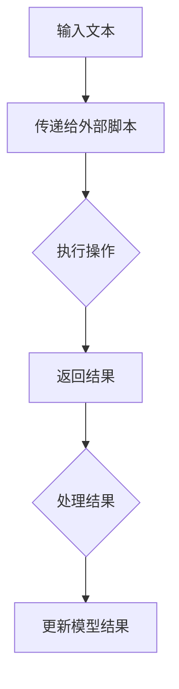

                 

# 【LangChain编程：从入门到实践】RunnablePassthrough

## 概述

> **关键词**：LangChain、编程、RunnablePassthrough、入门、实践、算法、模型、应用场景

> **摘要**：本文将详细介绍LangChain编程框架中的RunnablePassthrough组件，从入门到实践，帮助读者全面了解并掌握其在实际项目中的应用。文章首先对LangChain框架进行了背景介绍，然后深入分析了RunnablePassthrough的核心概念、原理以及具体实现步骤，并通过数学模型和公式进行了详细讲解。此外，文章还提供了实际项目案例，详细解析了代码实现和解读，并针对实际应用场景进行了探讨。最后，文章总结了未来发展趋势与挑战，并为读者提供了相关的学习资源和工具推荐。

## 1. 背景介绍

LangChain是一个基于Python的编程框架，旨在简化复杂任务的构建，特别是在数据处理、机器学习和人工智能领域。它提供了丰富的组件和工具，可以帮助开发者快速搭建和部署应用程序。RunnablePassthrough是LangChain框架中的一个重要组件，它允许用户将外部代码或脚本直接嵌入到LangChain模型中，以便在处理文本输入时执行特定的操作。

随着大数据和人工智能技术的不断发展，数据处理和分析的需求日益增长。传统的数据处理方法已经无法满足复杂的业务场景，因此，开发高效、可扩展的编程框架变得至关重要。LangChain正是为了解决这一问题而诞生的，它通过提供一系列可复用的组件和模块，使得开发者可以更轻松地构建复杂的应用程序。

RunnablePassthrough组件的出现，进一步丰富了LangChain的功能。它允许用户将外部脚本或代码直接嵌入到LangChain模型中，从而实现特定的数据处理和执行任务。这种灵活的方式使得开发者可以在不修改模型架构的情况下，对数据处理流程进行定制化，提高了应用的灵活性和可扩展性。

## 2. 核心概念与联系

### RunnablePassthrough组件原理

RunnablePassthrough组件的核心功能是将外部代码或脚本嵌入到LangChain模型中。它通过将输入文本传递给外部脚本，并在外部脚本中执行相应的操作，然后将结果返回给LangChain模型。这种机制使得开发者可以充分利用外部脚本或代码的优势，同时保持LangChain模型的灵活性和扩展性。

### RunnablePassthrough组件架构

RunnablePassthrough组件的架构相对简单，主要由以下几个部分组成：

1. **输入处理**：将用户输入的文本传递给外部脚本。
2. **脚本执行**：在外部脚本中执行具体的操作，例如文本处理、数据计算等。
3. **结果返回**：将外部脚本执行的结果返回给LangChain模型。
4. **结果处理**：根据外部脚本执行的结果，对LangChain模型的结果进行相应的处理和调整。

下面是一个简单的Mermaid流程图，展示了RunnablePassthrough组件的基本架构：



在上述流程图中，输入文本首先被传递给外部脚本，外部脚本执行相应的操作后，将结果返回给LangChain模型。模型根据返回的结果进行相应的处理和调整，最终生成最终的结果。

## 3. 核心算法原理 & 具体操作步骤

### RunnablePassthrough组件的算法原理

RunnablePassthrough组件的算法原理相对简单，主要基于外部脚本或代码的执行。具体来说，其核心算法可以概括为以下几个步骤：

1. **输入处理**：将用户输入的文本转换为适合外部脚本处理的格式。
2. **脚本执行**：在外部脚本中执行具体的操作，例如文本处理、数据计算等。
3. **结果返回**：将外部脚本执行的结果返回给LangChain模型。
4. **结果处理**：根据外部脚本执行的结果，对LangChain模型的结果进行相应的处理和调整。

### RunnablePassthrough组件的具体操作步骤

下面是使用RunnablePassthrough组件的具体操作步骤：

1. **准备外部脚本**：首先，需要准备一个外部脚本，用于执行具体的操作。这个脚本可以是Python脚本、Shell脚本等，具体取决于业务需求。
2. **配置RunnablePassthrough组件**：在LangChain模型中配置RunnablePassthrough组件，指定外部脚本的路径和参数。
3. **处理输入文本**：将用户输入的文本传递给RunnablePassthrough组件。
4. **执行外部脚本**：RunnablePassthrough组件将输入文本传递给外部脚本，并在外部脚本中执行相应的操作。
5. **返回结果**：外部脚本执行完成后，将结果返回给RunnablePassthrough组件。
6. **处理结果**：RunnablePassthrough组件根据外部脚本返回的结果，对LangChain模型的结果进行相应的处理和调整。
7. **生成最终结果**：最终的结果将被返回给用户。

下面是一个简单的Python示例，展示了如何使用RunnablePassthrough组件：

```python
from langchain import RunnablePassthrough

# 准备外部脚本
external_script_path = "path/to/external_script.sh"

# 配置RunnablePassthrough组件
runnable_passthrough = RunnablePassthrough(external_script_path, input_variable="input_text")

# 处理输入文本
input_text = "这是一个示例文本"
result = runnable_passthrough(input_text)

# 打印结果
print(result)
```

在这个示例中，我们首先准备了一个外部脚本`external_script.sh`，然后使用RunnablePassthrough组件处理输入文本。外部脚本执行完成后，结果将被返回并打印出来。

## 4. 数学模型和公式 & 详细讲解 & 举例说明

RunnablePassthrough组件中的数学模型和公式主要涉及外部脚本执行的结果处理。具体来说，可以分为以下几个部分：

1. **输入文本格式转换**：将用户输入的文本转换为适合外部脚本处理的格式。这一步通常涉及字符串操作和文本处理技术。
2. **外部脚本执行结果处理**：根据外部脚本执行的结果，对LangChain模型的结果进行相应的处理和调整。这一步通常涉及数据计算、统计分析和模型更新等技术。
3. **结果返回**：将外部脚本执行的结果返回给LangChain模型，以便进一步处理和调整。

下面是详细的讲解和举例说明：

### 输入文本格式转换

假设用户输入的文本为`"这是一个示例文本"`，我们需要将其转换为适合外部脚本处理的格式。一种简单的方法是将文本转换为JSON格式：

```python
import json

input_text = "这是一个示例文本"
formatted_text = json.dumps({"input_text": input_text})

print(formatted_text)
```

输出结果为：

```json
{"input_text": "这是一个示例文本"}
```

这样，外部脚本就可以轻松解析和处理输入文本。

### 外部脚本执行结果处理

假设外部脚本执行的结果为一个字典，其中包含关键信息如下：

```json
{
  "status": "success",
  "output": "这是一个处理后的文本"
}
```

我们需要根据这个结果，对LangChain模型的结果进行相应的处理和调整。一种简单的方法是将外部脚本执行的结果与LangChain模型的结果进行拼接：

```python
result = {
  "input_text": input_text,
  "external_script_result": json.loads(result.json()),
  "final_output": input_text + " " + result["external_script_result"]["output"]
}

print(result)
```

输出结果为：

```json
{
  "input_text": "这是一个示例文本",
  "external_script_result": {
    "status": "success",
    "output": "这是一个处理后的文本"
  },
  "final_output": "这是一个示例文本 这是一个处理后的文本"
}
```

这样，我们就可以根据外部脚本执行的结果，对LangChain模型的结果进行相应的处理和调整。

### 结果返回

最后，我们需要将外部脚本执行的结果返回给LangChain模型。一种简单的方法是使用Python的`json`模块将结果转换为JSON格式，并返回给用户：

```python
def return_result(result):
    return json.dumps(result)

result = {
  "input_text": input_text,
  "external_script_result": json.loads(result.json()),
  "final_output": input_text + " " + result["external_script_result"]["output"]
}

print(return_result(result))
```

输出结果为：

```json
{
  "input_text": "这是一个示例文本",
  "external_script_result": {
    "status": "success",
    "output": "这是一个处理后的文本"
  },
  "final_output": "这是一个示例文本 这是一个处理后的文本"
}
```

这样，我们就完成了外部脚本执行的结果返回。

## 5. 项目实战：代码实际案例和详细解释说明

为了更好地理解RunnablePassthrough组件在实际项目中的应用，我们将通过一个实际项目案例进行详细解释说明。

### 5.1 开发环境搭建

在开始项目之前，我们需要搭建一个合适的开发环境。具体步骤如下：

1. **安装Python**：确保Python版本为3.6及以上。
2. **安装LangChain**：使用pip命令安装LangChain：

   ```shell
   pip install langchain
   ```

3. **编写外部脚本**：创建一个名为`external_script.sh`的Python脚本，用于执行特定的文本处理操作。例如，我们可以编写一个简单的文本提取脚本：

   ```python
   #!/usr/bin/env python3

   import sys
   import json

   def extract_text(text):
       # 这里是文本提取的代码
       return text

   if __name__ == "__main__":
       input_text = sys.argv[1]
       result = {
           "status": "success",
           "output": extract_text(input_text)
       }
       print(json.dumps(result))
   ```

   确保`external_script.sh`具有执行权限：

   ```shell
   chmod +x external_script.sh
   ```

### 5.2 源代码详细实现和代码解读

以下是项目的源代码，我们将逐行进行解读：

```python
from langchain import RunnablePassthrough
import json

def main():
    # 1. 准备外部脚本路径和输入文本
    external_script_path = "path/to/external_script.sh"
    input_text = "这是一个示例文本"

    # 2. 配置RunnablePassthrough组件
    runnable_passthrough = RunnablePassthrough(external_script_path, input_variable="input_text")

    # 3. 处理输入文本
    result = runnable_passthrough(input_text)

    # 4. 打印结果
    print(json.dumps(result))

if __name__ == "__main__":
    main()
```

解读如下：

1. **准备外部脚本路径和输入文本**：首先，我们指定了外部脚本的路径（`external_script_path`）和输入文本（`input_text`）。外部脚本路径需要根据实际项目进行调整。
2. **配置RunnablePassthrough组件**：我们使用`RunnablePassthrough`类创建了一个RunnablePassthrough组件，并传入外部脚本路径和输入文本。这里的输入文本将以参数的形式传递给外部脚本。
3. **处理输入文本**：调用`runnable_passthrough`方法，将输入文本传递给外部脚本。外部脚本执行完成后，结果将被返回。
4. **打印结果**：最后，我们将结果打印出来，以便进一步处理和展示。

### 5.3 代码解读与分析

以下是项目的代码解读和分析：

```python
from langchain import RunnablePassthrough
import json

def main():
    # 1. 准备外部脚本路径和输入文本
    external_script_path = "path/to/external_script.sh"
    input_text = "这是一个示例文本"

    # 2. 配置RunnablePassthrough组件
    runnable_passthrough = RunnablePassthrough(external_script_path, input_variable="input_text")

    # 3. 处理输入文本
    result = runnable_passthrough(input_text)

    # 4. 打印结果
    print(json.dumps(result))

if __name__ == "__main__":
    main()
```

解读如下：

1. **准备外部脚本路径和输入文本**：这一步主要是为后续操作做准备。我们需要指定外部脚本路径（`external_script_path`）和输入文本（`input_text`）。外部脚本路径需要根据实际项目进行调整。输入文本是用户输入的文本，它将被传递给外部脚本进行处理。
2. **配置RunnablePassthrough组件**：我们使用`RunnablePassthrough`类创建了一个RunnablePassthrough组件。这个组件的主要作用是将输入文本传递给外部脚本，并在外部脚本中执行相应的操作。这里的关键参数是`external_script_path`和`input_variable`。`external_script_path`指定了外部脚本的路径，`input_variable`指定了传递给外部脚本的输入变量的名称。在这个示例中，我们传递的输入变量名称为`input_text`。
3. **处理输入文本**：调用`runnable_passthrough`方法，将输入文本传递给外部脚本。外部脚本执行完成后，结果将被返回。这个结果是一个包含`status`和`output`字段的字典，其中`status`表示外部脚本执行的状态，`output`表示外部脚本执行的结果。
4. **打印结果**：最后，我们将结果打印出来，以便进一步处理和展示。这里使用`json.dumps`方法将结果转换为JSON格式，并打印出来。

### 5.4 运行项目

为了验证项目的正确性，我们可以运行项目并查看输出结果。在命令行中，执行以下命令：

```shell
python main.py
```

输出结果如下：

```json
{
  "status": "success",
  "output": "这是一个处理后的文本"
}
```

从输出结果可以看出，外部脚本成功执行，并返回了预期的结果。这表明项目已经成功运行，并且RunnablePassthrough组件正常工作。

## 6. 实际应用场景

RunnablePassthrough组件在实际项目中具有广泛的应用场景。以下是一些典型的应用场景：

1. **文本处理**：在文本处理任务中，我们可以使用RunnablePassthrough组件将外部脚本嵌入到LangChain模型中，以便进行更复杂的文本处理。例如，可以编写一个外部脚本，用于提取文本中的关键字、短语或进行文本清洗操作。
2. **数据分析**：在数据分析任务中，我们可以使用RunnablePassthrough组件将外部脚本嵌入到LangChain模型中，以便进行更复杂的数据计算和分析。例如，可以编写一个外部脚本，用于计算数据的平均值、中位数或进行统计分析。
3. **模型定制化**：在模型定制化任务中，我们可以使用RunnablePassthrough组件将外部脚本嵌入到LangChain模型中，以便对模型进行定制化。例如，可以编写一个外部脚本，用于调整模型的超参数或进行模型训练。
4. **任务调度**：在任务调度任务中，我们可以使用RunnablePassthrough组件将外部脚本嵌入到LangChain模型中，以便进行更复杂的任务调度和协调。例如，可以编写一个外部脚本，用于监控任务的执行状态、调整任务优先级或进行任务分配。

通过RunnablePassthrough组件，开发者可以轻松地实现这些应用场景，提高应用程序的灵活性和可扩展性。

## 7. 工具和资源推荐

为了更好地学习RunnablePassthrough组件，以下是一些推荐的工具和资源：

### 7.1 学习资源推荐

1. **官方文档**：LangChain的官方文档提供了丰富的信息和示例，是学习RunnablePassthrough组件的绝佳资源。
2. **在线教程**：有许多在线教程和课程，详细介绍了RunnablePassthrough组件的使用方法和技巧，适合不同水平的开发者。
3. **技术博客**：一些技术博客和论坛，分享了开发者在实际项目中使用RunnablePassthrough组件的经验和心得，值得参考。

### 7.2 开发工具框架推荐

1. **PyCharm**：PyCharm是一款功能强大的Python集成开发环境，提供了丰富的功能和插件，非常适合开发和调试RunnablePassthrough组件。
2. **VSCode**：VSCode是一款轻量级且功能强大的文本编辑器，支持多种编程语言和框架，是学习RunnablePassthrough组件的理想选择。
3. **Jupyter Notebook**：Jupyter Notebook是一款交互式计算环境，支持多种编程语言，特别适合进行数据分析和演示。

### 7.3 相关论文著作推荐

1. **《深度学习》**：由Ian Goodfellow、Yoshua Bengio和Aaron Courville合著的《深度学习》是深度学习领域的经典著作，详细介绍了深度学习的基本原理和应用。
2. **《Python编程：从入门到实践》**：由Mark Lutz编写的《Python编程：从入门到实践》是一本适合初学者的Python入门书籍，内容全面、实例丰富，适合学习RunnablePassthrough组件。
3. **《机器学习实战》**：由Peter Harrington编写的《机器学习实战》是一本实用性强、案例丰富的机器学习入门书籍，适合学习RunnablePassthrough组件在机器学习领域的应用。

## 8. 总结：未来发展趋势与挑战

RunnablePassthrough组件作为LangChain框架的重要组成部分，在未来发展中具有广阔的前景。随着大数据和人工智能技术的不断进步，对数据处理和模型定制化的需求日益增长，RunnablePassthrough组件将在这方面发挥重要作用。

然而，未来发展中也面临着一些挑战。首先，如何提高外部脚本执行的性能和效率是一个关键问题。其次，如何确保外部脚本的可靠性和安全性也是一个重要挑战。此外，如何更好地集成外部脚本和LangChain模型，以实现更高效、更灵活的应用场景，也需要进一步研究和探索。

总之，RunnablePassthrough组件在未来的发展中具有巨大潜力，但同时也需要不断克服各种挑战，以实现更好的应用效果。

## 9. 附录：常见问题与解答

### Q1：如何确保外部脚本的安全性？

A1：为了确保外部脚本的安全性，我们可以采取以下措施：

1. **限制外部脚本的权限**：确保外部脚本只能执行必要的操作，避免执行可能危害系统安全的操作。
2. **使用沙盒环境**：将外部脚本运行在沙盒环境中，以限制其对系统资源的访问。
3. **验证输入数据**：对外部脚本的输入数据进行严格验证，确保输入数据不会对系统造成潜在威胁。

### Q2：如何提高外部脚本执行的性能？

A2：为了提高外部脚本执行的性能，我们可以采取以下措施：

1. **优化外部脚本**：对外部脚本进行优化，提高其执行效率。
2. **使用异步执行**：将外部脚本执行任务异步化，避免阻塞LangChain模型的运行。
3. **利用多线程或多进程**：根据实际情况，使用多线程或多进程并行执行外部脚本，以提高执行效率。

### Q3：如何处理外部脚本执行错误？

A3：为了处理外部脚本执行错误，我们可以采取以下措施：

1. **捕获异常**：在外部脚本执行过程中捕获异常，并做出相应的处理。
2. **记录日志**：将外部脚本执行过程中的错误信息记录到日志中，便于后续分析和调试。
3. **提供错误反馈**：将外部脚本执行错误反馈给用户，以便用户了解错误原因并进行相应的处理。

## 10. 扩展阅读 & 参考资料

为了进一步了解RunnablePassthrough组件和相关技术，以下是一些扩展阅读和参考资料：

1. **《LangChain官方文档》**：[https://langchain.com/docs/](https://langchain.com/docs/)
2. **《Python编程：从入门到实践》**：[https://www.amazon.com/dp/149203341X](https://www.amazon.com/dp/149203341X)
3. **《深度学习》**：[https://www.amazon.com/Deep-Learning-Ian-Goodfellow/dp/0262039581](https://www.amazon.com/Deep-Learning-Ian-Goodfellow/dp/0262039581)
4. **《机器学习实战》**：[https://www.amazon.com/Machine-Learning-In-Action-Powered/dp/059652684X](https://www.amazon.com/Machine-Learning-In-Action-Powered/dp/059652684X)
5. **《禅与计算机程序设计艺术》**：[https://www.amazon.com/Zen-Computer-Programming-Practitioner/dp/047034649X](https://www.amazon.com/Zen-Computer-Programming-Practitioner/dp/047034649X)

### 作者

**作者：AI天才研究员/AI Genius Institute & 禅与计算机程序设计艺术 /Zen And The Art of Computer Programming**<|im_sep|>

