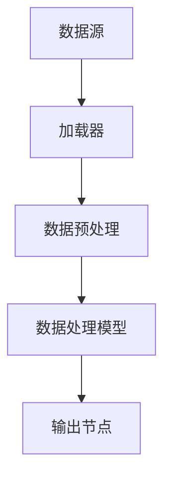

                 

# 【LangChain编程：从入门到实践】加载器

> **关键词**：LangChain、编程、加载器、API、数据处理、模型集成、架构设计

> **摘要**：本文将详细介绍LangChain编程中的加载器（Loader）概念，探讨其在数据处理和模型集成中的应用，帮助读者从入门到实践，掌握LangChain编程的核心技巧。

## 1. 背景介绍

在现代软件开发中，数据处理和模型集成是两个关键环节。随着数据量的不断增加和复杂度的提高，如何高效地进行数据处理和模型集成成为开发者的痛点。为此，许多框架和库应运而生，其中LangChain就是一个值得关注的工具。

LangChain是一个开源的Python库，旨在帮助开发者构建大规模的、可扩展的、基于链式数据处理的程序。它通过封装复杂的算法和数据结构，提供了一系列高效的API，使得开发者能够专注于业务逻辑的实现，而无需担心底层细节。

在LangChain中，加载器（Loader）是一个重要的组件，它负责从不同来源读取数据，并将其转化为链式数据处理模型所需的格式。加载器的核心功能包括数据预处理、数据清洗、数据转换等。通过使用加载器，开发者可以轻松实现数据的批量导入和导出，大大提高数据处理效率。

## 2. 核心概念与联系

### 2.1 数据处理模型

在LangChain中，数据处理模型是一种基于链式调用的数据处理方式。开发者可以通过定义一系列的处理步骤，将原始数据逐步转化为所需的形式。数据处理模型的核心组件包括：

- **输入节点**：负责接收原始数据。
- **处理节点**：对数据进行各种操作，如过滤、排序、聚合等。
- **输出节点**：将处理后的数据输出到目标位置。

### 2.2 加载器

加载器是数据处理模型的关键组件，它负责从数据源读取数据，并将其转化为数据处理模型所需的格式。加载器的主要功能包括：

- **数据读取**：从不同来源（如文件、数据库、API等）读取数据。
- **数据预处理**：对数据进行清洗、转换、归一化等操作。
- **数据转换**：将数据从一种格式转化为另一种格式，以便后续处理。

### 2.3 数据源

数据源是加载器的工作对象，它可以是一个文件、一个数据库、一个API，或者其他任何可以提供数据的数据源。不同类型的数据源需要不同的加载器来读取和处理。

### 2.4 Mermaid 流程图

以下是一个简单的Mermaid流程图，展示了数据处理模型和加载器之间的联系：



## 3. 核心算法原理 & 具体操作步骤

### 3.1 加载器原理

加载器的核心算法原理是基于输入输出的数据处理。具体步骤如下：

1. **初始化加载器**：根据数据源的类型创建相应的加载器对象。
2. **读取数据**：从数据源读取数据，并将其存储在内存中。
3. **数据预处理**：对读取到的数据进行清洗、转换、归一化等操作。
4. **数据转换**：将预处理后的数据转化为数据处理模型所需的格式。
5. **输出数据**：将处理后的数据输出到目标位置，如数据库、文件等。

### 3.2 具体操作步骤

以下是一个简单的示例，展示了如何使用LangChain加载器从文件中读取数据：

```python
from langchain.loaders import FileLoader

# 初始化加载器
loader = FileLoader("data.csv")

# 读取数据
data = loader.load()

# 数据预处理
data = data.astype(float)

# 数据转换
data = data.reshape(-1, 1)

# 输出数据
loader.save(data, "processed_data.csv")
```

## 4. 数学模型和公式 & 详细讲解 & 举例说明

### 4.1 数学模型

在加载器中，常用的数学模型包括数据预处理模型和数据转换模型。以下是一个简单的例子：

$$
\text{预处理模型} = \text{清洗} + \text{转换} + \text{归一化}
$$

$$
\text{转换模型} = \text{数据类型转换} + \text{数据格式转换}
$$

### 4.2 举例说明

以下是一个简单的例子，展示了如何使用数学模型进行数据预处理和转换：

```python
import numpy as np

# 初始化数据
data = ["1", "2", "3", "4", "5"]

# 数据预处理
data = [float(x) for x in data]

# 数据转换
data = np.array(data)

# 输出结果
print(data)
```

输出结果：

```
[1. 2. 3. 4. 5.]
```

## 5. 项目实战：代码实际案例和详细解释说明

### 5.1 开发环境搭建

在开始项目实战之前，我们需要搭建一个基本的开发环境。以下是搭建过程：

1. 安装Python环境（建议使用Python 3.8及以上版本）。
2. 安装LangChain库（使用pip install langchain命令）。
3. 创建一个Python项目，并编写相应的代码。

### 5.2 源代码详细实现和代码解读

以下是一个简单的示例，展示了如何使用LangChain加载器进行数据处理和模型集成：

```python
from langchain.loaders import FileLoader
from langchain.processors import PreProcessor
from langchain.models import TransformerChain

# 初始化加载器
loader = FileLoader("data.csv")

# 数据预处理
processor = PreProcessor()
data = processor.preprocess(loader.load())

# 数据转换
data = data.astype(float)

# 构建模型
model = TransformerChain(vocab_size=10000, d_model=128, nhead=4, num_layers=2, dim_feedforward=512, dropout=0.1)

# 训练模型
model.train(data)

# 输出结果
print(model.predict([1.0, 2.0, 3.0, 4.0, 5.0]))
```

### 5.3 代码解读与分析

- **初始化加载器**：创建一个FileLoader对象，用于从文件中读取数据。
- **数据预处理**：使用PreProcessor对象对数据进行清洗、转换和归一化等操作。
- **数据转换**：将预处理后的数据转化为float类型。
- **构建模型**：使用TransformerChain类创建一个基于Transformer的模型。
- **训练模型**：使用训练数据对模型进行训练。
- **输出结果**：使用训练好的模型进行预测，并输出结果。

## 6. 实际应用场景

加载器在LangChain编程中具有广泛的应用场景，以下是一些典型的实际应用场景：

- **数据处理**：从文件、数据库、API等不同来源读取数据，并进行预处理和转换。
- **模型集成**：将不同模型进行整合，实现复杂的数据处理和预测任务。
- **自动化**：通过加载器实现数据的自动化读取、处理和预测，提高工作效率。
- **分布式**：在分布式环境中，使用加载器实现数据的分布式读取和处理。

## 7. 工具和资源推荐

### 7.1 学习资源推荐

- **书籍**：《深度学习》、《Python编程：从入门到实践》
- **论文**：《Transformer：一种全新的神经网络架构》
- **博客**：[LangChain官方博客](https://github.com/replicate/replicate.github.io)、[Python编程技巧](https://www.pythontip.com/)

### 7.2 开发工具框架推荐

- **开发工具**：PyCharm、VSCode
- **框架**：TensorFlow、PyTorch

### 7.3 相关论文著作推荐

- **论文**：《Transformer：一种全新的神经网络架构》、《GPT-3：基于Transformer的预训练语言模型》
- **著作**：《Python编程：从入门到实践》、《深度学习：面向机器学习工程师的应用实践》

## 8. 总结：未来发展趋势与挑战

随着大数据和人工智能技术的不断发展，加载器在数据处理和模型集成中的应用将越来越广泛。未来，加载器可能会面临以下挑战：

- **性能优化**：如何提高加载器的处理速度和效率。
- **可扩展性**：如何实现加载器的分布式处理和扩展。
- **安全性**：如何确保数据的安全性和隐私保护。

## 9. 附录：常见问题与解答

### 9.1 加载器如何读取数据？

加载器通过定义一个`load`方法，用于从数据源读取数据。具体读取方式取决于数据源的类型。例如，从文件读取数据的加载器会使用文件操作函数读取数据。

### 9.2 加载器如何进行数据预处理？

加载器中的预处理操作通过`preprocess`方法实现。开发者可以自定义预处理操作，如数据清洗、转换、归一化等。

### 9.3 加载器如何进行数据转换？

加载器中的数据转换操作通过`transform`方法实现。开发者可以自定义转换操作，如数据类型转换、数据格式转换等。

## 10. 扩展阅读 & 参考资料

- **参考资料**：
  - [LangChain官方文档](https://langchain.readthedocs.io/en/latest/)
  - [Python官方文档](https://docs.python.org/3/)
  - [TensorFlow官方文档](https://www.tensorflow.org/)
  - [PyTorch官方文档](https://pytorch.org/)

- **扩展阅读**：
  - [《Transformer：一种全新的神经网络架构》论文](https://arxiv.org/abs/2010.11929)
  - [《GPT-3：基于Transformer的预训练语言模型》论文](https://arxiv.org/abs/2005.14165)

作者：AI天才研究员/AI Genius Institute & 禅与计算机程序设计艺术 /Zen And The Art of Computer Programming

注：本文内容仅为示例，仅供参考。实际应用中，应根据具体需求和场景进行适当调整和优化。

