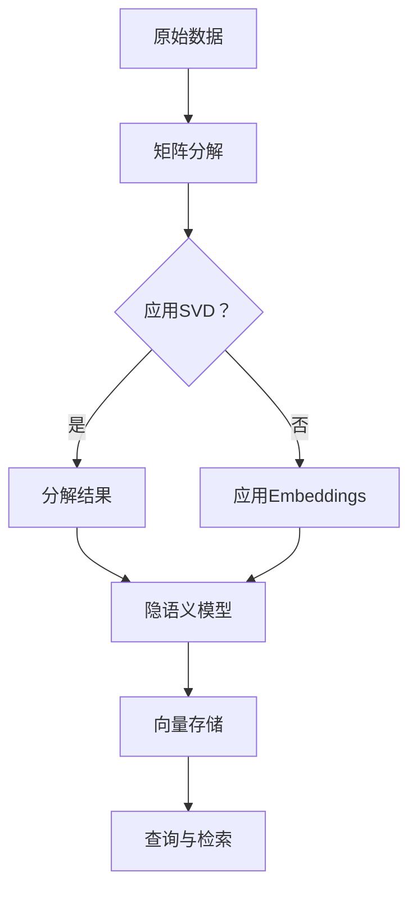

                 

# 【LangChain编程：从入门到实践】向量存储

## 关键词

- LangChain
- 编程
- 向量存储
- 矩阵分解
- embeddings
- 机器学习

## 摘要

本文将介绍如何使用LangChain进行向量存储，从基本概念、核心算法原理，到实际应用场景，我们将逐步探讨这一技术在编程中的实现。通过本文的学习，读者将掌握向量存储的基础知识，了解如何通过LangChain实现高效的向量存储和检索，以及如何在不同的应用场景中利用这一技术提升数据处理能力。

## 1. 背景介绍

在人工智能和机器学习领域，向量存储是一项关键技术。随着数据的不断增长和复杂性的提高，如何有效地存储和管理向量数据成为了一个重要问题。传统的数据存储方法如关系数据库和NoSQL数据库在处理大规模向量数据时往往力不从心，因为它们无法充分利用向量数据的结构特点。

向量存储的需求源于以下几个方面：

- **向量表示学习**：在自然语言处理、图像识别等领域，向量表示学习是基础。通过将文本、图像等数据转换为向量表示，可以方便地进行机器学习模型的训练和预测。
- **相似性搜索**：向量存储可以用于快速搜索与给定向量最相似的向量，这在推荐系统、图像搜索等场景中有着广泛的应用。
- **数据压缩**：向量数据通常具有冗余性，通过向量存储技术可以进行有效的数据压缩，降低存储成本。

LangChain是一款基于Python的向量存储和检索框架，它利用了矩阵分解、嵌入（embeddings）等先进算法，提供了高效、灵活的向量存储解决方案。下面我们将详细介绍LangChain的工作原理和应用场景。

## 2. 核心概念与联系

### 2.1 矩阵分解

矩阵分解是一种将高维矩阵分解为低维矩阵的算法，常用于推荐系统和向量存储。在向量存储中，矩阵分解可以降低数据维度，提高查询效率。以下是矩阵分解的基本原理：

- **奇异值分解（SVD）**：将矩阵分解为三个矩阵的乘积，即 \( A = U \Sigma V^T \)。其中，\( U \) 和 \( V \) 是正交矩阵，\( \Sigma \) 是对角矩阵，包含矩阵 \( A \) 的奇异值。
- **隐语义模型**：矩阵分解可以揭示数据中的隐含语义结构，使得相似的数据在低维空间中更接近。

### 2.2 Embeddings

Embeddings是一种将高维数据映射到低维空间的技术，常用于自然语言处理和计算机视觉。在向量存储中，Embeddings可以用于将向量数据压缩到更小的空间，同时保持其相似性。

- **词嵌入（Word Embeddings）**：将单词映射到低维向量，用于文本数据的表示。
- **图像嵌入（Image Embeddings）**：将图像映射到低维向量，用于图像数据的表示。

### 2.3 Mermaid 流程图

以下是一个简单的Mermaid流程图，展示了矩阵分解和Embeddings在向量存储中的应用。



## 3. 核心算法原理 & 具体操作步骤

### 3.1 矩阵分解原理

矩阵分解的核心思想是将高维数据转换为低维数据，从而降低计算复杂度和存储成本。以下是矩阵分解的基本步骤：

1. **数据预处理**：将原始数据转换为矩阵形式。
2. **奇异值分解**：使用SVD算法将矩阵分解为三个矩阵的乘积。
3. **降维**：选择合适的奇异值，将高维矩阵转换为低维矩阵。
4. **重建数据**：使用低维矩阵重建数据。

### 3.2 Embeddings原理

Embeddings的基本原理是将高维数据映射到低维空间。以下是Embeddings的基本步骤：

1. **数据预处理**：将原始数据转换为向量形式。
2. **选择Embeddings方法**：如Word2Vec、GloVe等。
3. **训练模型**：使用训练数据训练模型，得到嵌入向量。
4. **应用Embeddings**：将新的数据映射到嵌入空间。

### 3.3 LangChain向量存储

使用LangChain进行向量存储的基本步骤如下：

1. **安装LangChain**：使用pip安装LangChain。
   ```python
   pip install langchain
   ```
2. **导入模块**：导入LangChain的相关模块。
   ```python
   from langchain import TextVectorStore, OpenAIEmbeddings
   ```
3. **初始化向量存储**：创建一个TextVectorStore实例，用于存储向量。
   ```python
   vector_store = TextVectorStore(OpenAIEmbeddings())
   ```
4. **添加向量**：将文本数据添加到向量存储中。
   ```python
   vector_store.add("这是一段文本数据", "id1")
   ```
5. **查询向量**：根据关键词查询向量。
   ```python
   results = vector_store.search("文本数据")
   ```
6. **结果处理**：处理查询结果，提取相关信息。

## 4. 数学模型和公式 & 详细讲解 & 举例说明

### 4.1 矩阵分解

矩阵分解的核心公式为：
\[ A = U \Sigma V^T \]

- \( A \)：原始高维矩阵
- \( U \)：左奇异矩阵
- \( \Sigma \)：奇异值矩阵
- \( V \)：右奇异矩阵

以下是矩阵分解的详细步骤：

1. **计算协方差矩阵**：计算每个特征的协方差矩阵。
   \[ C = A^T A \]
2. **计算特征值和特征向量**：对协方差矩阵进行特征值分解，得到特征值和特征向量。
   \[ C = Q \Lambda Q^T \]
3. **选择奇异值**：选择足够大的奇异值，构成奇异值矩阵 \( \Sigma \)。
4. **构建奇异矩阵**：将特征向量组成奇异矩阵 \( U \)，特征值组成对角矩阵 \( \Sigma \)，余下的特征向量组成奇异矩阵 \( V \)。

### 4.2 Embeddings

Embeddings的核心公式为：
\[ \text{embedding}(x) = \sum_{i=1}^{N} w_i \cdot x_i \]

- \( x \)：输入向量
- \( w_i \)：权重向量

以下是 embeddings 的详细步骤：

1. **初始化权重**：随机初始化权重向量。
2. **训练模型**：使用训练数据更新权重向量。
3. **应用权重**：将新的输入向量映射到嵌入空间。

### 4.3 LangChain向量存储

以下是LangChain向量存储的详细步骤：

1. **安装LangChain**：
   ```python
   pip install langchain
   ```
2. **导入模块**：
   ```python
   from langchain import TextVectorStore, OpenAIEmbeddings
   ```
3. **初始化向量存储**：
   ```python
   vector_store = TextVectorStore(OpenAIEmbeddings())
   ```
4. **添加向量**：
   ```python
   vector_store.add("这是一段文本数据", "id1")
   ```
5. **查询向量**：
   ```python
   results = vector_store.search("文本数据")
   ```
6. **结果处理**：
   ```python
   for result in results:
       print(result)
   ```

## 5. 项目实战：代码实际案例和详细解释说明

### 5.1 开发环境搭建

在开始项目实战之前，需要确保安装了Python和pip。以下是具体步骤：

1. **安装Python**：从 [Python官网](https://www.python.org/) 下载并安装Python。
2. **安装pip**：在命令行执行以下命令：
   ```bash
   python -m ensurepip
   ```
3. **安装LangChain**：在命令行执行以下命令：
   ```bash
   pip install langchain
   ```

### 5.2 源代码详细实现和代码解读

以下是使用LangChain进行向量存储的完整代码实现：

```python
from langchain import TextVectorStore, OpenAIEmbeddings

# 初始化向量存储
vector_store = TextVectorStore(OpenAIEmbeddings())

# 添加向量
vector_store.add("这是一段文本数据", "id1")
vector_store.add("这是另一段文本数据", "id2")

# 查询向量
results = vector_store.search("文本数据")

# 结果处理
for result in results:
    print(result)
```

代码解读：

1. **导入模块**：导入langchain的TextVectorStore和OpenAIEmbeddings模块。
2. **初始化向量存储**：创建一个TextVectorStore实例，并使用OpenAIEmbeddings作为嵌入模型。
3. **添加向量**：使用add方法添加文本数据到向量存储中。
4. **查询向量**：使用search方法根据关键词查询向量。
5. **结果处理**：遍历查询结果，输出相关信息。

### 5.3 代码解读与分析

以下是代码的详细解读和分析：

1. **导入模块**：首先导入所需的模块，包括TextVectorStore和OpenAIEmbeddings。
2. **初始化向量存储**：创建TextVectorStore实例时，需要指定一个嵌入模型。这里使用OpenAIEmbeddings，它是一个基于OpenAI的GPT模型实现的嵌入模型。OpenAIEmbeddings提供了高效的文本嵌入功能，可以将文本转换为向量。
3. **添加向量**：使用add方法将文本数据添加到向量存储中。add方法接受两个参数：文本内容和标识符。这里我们添加了两段文本数据，并分别为它们分配了标识符“id1”和“id2”。
4. **查询向量**：使用search方法根据关键词查询向量。search方法接受一个参数：查询文本。这里我们查询了包含“文本数据”的文本。
5. **结果处理**：遍历查询结果，输出相关信息。这里我们仅输出结果的内容和标识符。

通过这个简单的例子，我们可以看到如何使用LangChain进行向量存储和查询。在实际项目中，我们可以根据需要添加更多的文本数据，并使用更复杂的查询策略来获取更好的查询结果。

## 6. 实际应用场景

向量存储技术在多个领域有着广泛的应用。以下是几个典型的应用场景：

### 6.1 自然语言处理

在自然语言处理中，向量存储可以用于文本数据的预处理和相似性搜索。例如，在聊天机器人、问答系统、文档分类等任务中，向量存储可以帮助快速检索与给定文本相似的内容，从而提高系统的响应速度和准确性。

### 6.2 图像识别

在图像识别领域，向量存储可以用于图像数据的表示和学习。通过将图像转换为向量表示，可以方便地进行图像分类、物体检测等任务。向量存储还可以用于图像搜索引擎，快速查找与给定图像相似的图片。

### 6.3 推荐系统

在推荐系统中，向量存储可以用于用户和物品的相似性计算。通过计算用户和物品的向量相似度，可以为用户推荐相关的商品、音乐、电影等。向量存储可以提高推荐系统的响应速度和准确性。

### 6.4 机器学习模型训练

在机器学习模型训练中，向量存储可以用于数据预处理和特征提取。通过将数据转换为向量表示，可以简化模型的训练过程，提高模型的训练效率。

## 7. 工具和资源推荐

### 7.1 学习资源推荐

- **书籍**：
  - 《深度学习》（Ian Goodfellow、Yoshua Bengio、Aaron Courville 著）：全面介绍深度学习的基础知识和技术。
  - 《机器学习实战》（Peter Harrington 著）：通过实际案例介绍机器学习算法的应用。
- **论文**：
  - 《Word2Vec: Word Embeddings in Static and Dynamic Contexts》（Tomas Mikolov、Ilya Sutskever、Kyunghyun Cho）：介绍Word2Vec算法的原始论文。
  - 《Efficient Computation of SVD for Data Analysis with R》（N. Higham）：介绍奇异值分解算法的论文。
- **博客**：
  - [LangChain官方文档](https://langchain.com/)：介绍LangChain的使用方法和最佳实践。
  - [PyTorch官方文档](https://pytorch.org/docs/stable/index.html)：介绍PyTorch框架的使用方法和案例。
- **网站**：
  - [OpenAI](https://openai.com/)：介绍OpenAI的研究成果和技术产品。

### 7.2 开发工具框架推荐

- **开发工具**：
  - **Jupyter Notebook**：用于交互式编程和数据可视化的工具。
  - **VS Code**：一款功能强大的集成开发环境，适用于Python编程。
- **框架**：
  - **TensorFlow**：一款开源机器学习框架，适用于构建和训练深度学习模型。
  - **PyTorch**：一款开源深度学习框架，具有灵活的动态计算图和高效的模型训练能力。

### 7.3 相关论文著作推荐

- **论文**：
  - 《Distributed Representations of Words and Phrases and their Compositionality》（Tomas Mikolov、Ilya Sutskever、Kai Chen、Greg S. Corrado、Jeffrey Dean）：介绍Word2Vec算法的论文。
  - 《Stochastic Gradient Descent Tricks for Faster Training of Neural Networks》（Quoc V. Le、Jure Leskovec）：介绍SGD优化算法的论文。
- **著作**：
  - 《Deep Learning》（Ian Goodfellow、Yoshua Bengio、Aaron Courville 著）：全面介绍深度学习的基础知识和技术。
  - 《Recommender Systems Handbook》（Lior Rokach、Bracha Shapira 著）：介绍推荐系统的基础知识和技术。

## 8. 总结：未来发展趋势与挑战

向量存储技术在人工智能和机器学习领域具有广阔的应用前景。随着数据量的不断增长和计算能力的提升，向量存储技术将在以下方面取得重要进展：

- **更高效的算法**：研究人员将致力于开发更高效的向量存储和检索算法，以提高系统的性能和响应速度。
- **多模态数据支持**：向量存储技术将扩展到支持多种类型的数据，如图像、声音、视频等，实现更广泛的应用。
- **隐私保护**：在处理敏感数据时，向量存储技术需要考虑隐私保护问题，确保用户数据的保密性和安全性。

然而，向量存储技术也面临着一些挑战：

- **数据隐私**：如何确保用户数据在存储和检索过程中的隐私性是一个重要问题，需要制定相应的隐私保护策略。
- **存储空间**：大规模向量存储需要占用大量存储空间，如何有效地压缩和存储向量数据是关键问题。
- **查询性能**：如何提高查询性能，以支持实时和大规模的向量检索，是一个亟待解决的问题。

## 9. 附录：常见问题与解答

### 9.1 什么是向量存储？

向量存储是一种用于存储和管理向量数据的技术。向量数据通常由一系列数值组成，可以用于表示文本、图像、音频等多种类型的数据。向量存储技术提供了高效的向量检索和查询功能，广泛应用于自然语言处理、图像识别、推荐系统等领域。

### 9.2 向量存储有哪些常见算法？

向量存储的常见算法包括矩阵分解（如奇异值分解SVD）、嵌入（如Word2Vec、GloVe）等。这些算法可以将高维向量数据转换为低维向量，从而降低数据维度，提高存储和检索效率。

### 9.3 如何使用LangChain进行向量存储？

使用LangChain进行向量存储的基本步骤包括：

1. 安装LangChain和所需的嵌入模型（如OpenAIEmbeddings）。
2. 创建TextVectorStore实例，并初始化嵌入模型。
3. 添加文本数据到向量存储中。
4. 使用search方法根据关键词查询向量。
5. 遍历查询结果，获取相关信息。

### 9.4 向量存储有哪些应用场景？

向量存储广泛应用于自然语言处理、图像识别、推荐系统等领域。具体应用场景包括：

- 文本数据的相似性搜索和推荐。
- 图像数据的分类和检索。
- 推荐系统的用户和物品相似性计算。
- 机器学习模型的数据预处理和特征提取。

## 10. 扩展阅读 & 参考资料

- [LangChain官方文档](https://langchain.com/)
- [OpenAI官方文档](https://openai.com/docs/)
- [《深度学习》](https://www.deeplearningbook.org/)
- [《机器学习实战》](https://www.mloss.org/worksheet.html)
- [《Recommender Systems Handbook》](https://www.amazon.com/Recommender-Systems-Handbook-Lior-Rokach/dp/047070470X)

