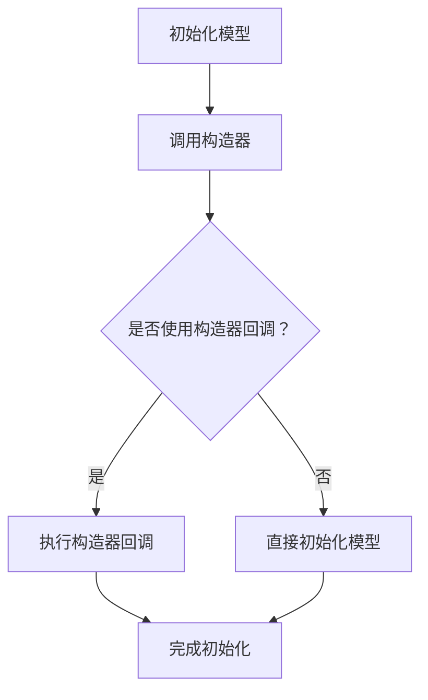

                 

## 【LangChain编程：从入门到实践】构造器回调

### 关键词：LangChain、编程、回调、构造器、实践

#### 摘要：

本文旨在深入探讨LangChain编程中的构造器回调机制，从入门到实践，为广大开发者提供一整套系统化的学习路径。通过详细的讲解和实例分析，帮助读者掌握构造器回调的核心原理和实际应用。本文将涵盖构造器回调的定义、原理、实现步骤，以及其在实际项目中的应用场景。希望本文能够成为您在LangChain编程领域的一次全面启蒙。

## 1. 背景介绍

### 1.1 LangChain概述

LangChain是一款由Hugging Face推出的开源框架，旨在简化自然语言处理（NLP）任务的开发流程。它提供了丰富的工具和模块，使得开发者能够更轻松地构建和部署NLP模型。LangChain支持多种编程语言，如Python、JavaScript和TypeScript等，具有高度的灵活性和扩展性。

### 1.2 构造器回调的概念

构造器回调是一种在编程中常用的设计模式，主要用于在对象创建过程中进行额外的初始化操作。在LangChain编程中，构造器回调允许开发者自定义模型的初始化过程，以便更好地适应特定场景的需求。

### 1.3 构造器回调的应用场景

构造器回调在NLP领域有着广泛的应用，例如：

- **模型定制化**：通过构造器回调，开发者可以根据特定任务的需求，对模型进行定制化设置。
- **数据预处理**：在模型初始化时，构造器回调可以用于处理和清洗输入数据，确保模型训练的效果。
- **资源管理**：构造器回调可以帮助开发者合理分配和管理计算资源，提高模型训练和部署的效率。

## 2. 核心概念与联系

### 2.1 LangChain框架结构

首先，我们需要了解LangChain框架的整体结构。LangChain主要由以下几部分组成：

1. **模型**：包括预训练模型和微调模型，如GPT、BERT等。
2. **工具**：提供了一系列实用的工具和模块，如PromptGenerator、QuestionAnswering等。
3. **构造器**：用于构建和配置模型，包括构造器回调。
4. **API**：提供了统一的接口，方便开发者进行模型训练和部署。

### 2.2 构造器回调原理

构造器回调的实现主要依赖于Python的装饰器（Decorator）机制。装饰器是一种高级的Python语法，用于修改或增强函数的行为。在LangChain中，构造器回调通过装饰器来实现模型初始化时的额外操作。

### 2.3 构造器回调与构造器的联系

构造器回调与构造器密切相关。构造器是LangChain中用于构建模型的函数，而构造器回调则是用于修改构造器行为的装饰器。通过构造器回调，开发者可以在模型初始化时进行自定义操作，从而实现对模型的定制化配置。

### 2.4 Mermaid流程图

下面是一个简单的Mermaid流程图，展示了构造器回调在LangChain框架中的工作流程：



## 3. 核心算法原理 & 具体操作步骤

### 3.1 LangChain构造器回调的实现原理

LangChain构造器回调的实现主要依赖于Python的装饰器机制。具体来说，构造器回调是一个装饰器函数，用于在模型初始化时进行额外的操作。以下是构造器回调的基本实现原理：

1. **定义构造器回调函数**：构造器回调函数是一个普通的Python函数，用于执行初始化操作。
2. **使用装饰器装饰构造器回调函数**：通过装饰器将构造器回调函数与应用的构造器函数关联起来。
3. **调用构造器回调函数**：在模型初始化时，调用装饰器装饰的构造器回调函数，执行自定义的初始化操作。

### 3.2 构造器回调的具体操作步骤

下面是一个简单的示例，展示了如何使用构造器回调来定制化模型初始化过程：

```python
from langchain import LanguageModel

# 定义构造器回调函数
def init_callback(model):
    print("初始化模型...")
    # 在这里进行自定义的初始化操作
    model.temperature = 0.5
    print("模型初始化完成。")

# 使用装饰器装饰构造器回调函数
@LanguageModel.construct
def custom_init(model):
    init_callback(model)

# 创建模型实例
model = LanguageModel()

# 调用构造器回调函数
custom_init(model)
```

在上面的示例中，我们定义了一个名为`init_callback`的构造器回调函数，用于在模型初始化时设置模型的温度参数。然后，我们使用装饰器`@LanguageModel.construct`将构造器回调函数与应用的构造器函数关联起来。最后，在创建模型实例时，调用构造器回调函数，执行自定义的初始化操作。

## 4. 数学模型和公式 & 详细讲解 & 举例说明

### 4.1 数学模型与公式

在LangChain中，构造器回调主要涉及到以下数学模型和公式：

1. **温度调节公式**：温度调节公式用于调整模型的采样概率，从而影响模型生成文本的多样性和连贯性。

   $$ p(\text{token}_i) = \frac{e^{\text{logit\_prob}_i / \text{temperature}}}{\sum_j e^{\text{logit\_prob}_j / \text{temperature}}} $$

   其中，`logit_prob_i`表示模型对第i个token的预测概率，`temperature`表示温度调节参数。

2. **模型初始化公式**：模型初始化公式用于设置模型的初始参数，如温度、学习率等。

   $$ \text{model\_params} = \text{init\_params}(\text{model}, \text{learning\_rate}) $$

   其中，`init_params`函数用于初始化模型参数，`learning_rate`表示学习率。

### 4.2 详细讲解与举例说明

#### 温度调节公式讲解

温度调节公式是LangChain中用于调节模型生成文本多样性和连贯性的关键公式。通过调整温度参数，我们可以控制模型生成文本的采样概率，从而影响文本的多样性。

当温度参数较高时，模型生成的文本会更加多样，因为每个token的采样概率相对较低，模型有更大的空间进行探索。然而，这可能导致文本的连贯性下降。

相反，当温度参数较低时，模型生成的文本会更加连贯，因为每个token的采样概率相对较高，模型更倾向于生成与当前文本相似的token。然而，这可能导致文本的多样性下降。

以下是一个简单的示例，展示了如何使用温度调节公式来生成文本：

```python
import random

def generate_text(model, temperature):
    tokens = model.generate([])
    logit_probs = model.log_prob(tokens)
    logit_probs /= temperature
    exp_logit_probs = [exp(prob) for prob in logit_probs]
    total = sum(exp_logit_probs)
    for _ in range(100):  # 生成100个字符
        token = random.choices(tokens, weights=exp_logit_probs, k=1)[0]
        tokens.append(token)
    return ''.join(tokens)

# 创建模型实例
model = LanguageModel()

# 设置温度参数
temperature = 0.5

# 生成文本
text = generate_text(model, temperature)
print(text)
```

在上面的示例中，我们定义了一个名为`generate_text`的函数，用于生成文本。通过调整温度参数，我们可以控制文本的多样性和连贯性。

#### 模型初始化公式讲解

模型初始化公式用于设置模型的初始参数，如温度、学习率等。在模型初始化时，我们可以通过调用`init_params`函数来设置这些参数。

以下是一个简单的示例，展示了如何使用模型初始化公式来初始化模型：

```python
from langchain import LanguageModel

# 定义初始化参数
init_params = {
    'learning_rate': 0.01,
    'temperature': 0.5
}

# 创建模型实例
model = LanguageModel()

# 初始化模型
model.init_params(**init_params)
```

在上面的示例中，我们定义了一个名为`init_params`的字典，用于存储初始化参数。然后，我们创建一个模型实例，并调用`init_params`函数来初始化模型。

## 5. 项目实战：代码实际案例和详细解释说明

### 5.1 开发环境搭建

在开始项目实战之前，我们需要搭建一个合适的开发环境。以下是搭建开发环境的步骤：

1. **安装Python**：确保已安装Python 3.7或更高版本。
2. **安装LangChain**：通过pip安装LangChain。

   ```bash
   pip install langchain
   ```

3. **配置代码编辑器**：选择一个适合您的代码编辑器，如Visual Studio Code。

### 5.2 源代码详细实现和代码解读

下面是一个简单的示例，展示了如何使用构造器回调来定制化模型初始化过程：

```python
from langchain import LanguageModel
from langchain.text_prompt import TextPrompt

# 定义构造器回调函数
def init_callback(model):
    print("初始化模型...")
    # 在这里进行自定义的初始化操作
    model.temperature = 0.5
    print("模型初始化完成。")

# 使用装饰器装饰构造器回调函数
@LanguageModel.construct
def custom_init(model):
    init_callback(model)

# 创建模型实例
model = LanguageModel()

# 调用构造器回调函数
custom_init(model)

# 创建文本提示
prompt = TextPrompt(
    text="请根据以下信息回答问题：\n问题：什么是人工智能？\n答案：人工智能是一种模拟人类智能的技术，通过计算机程序实现智能行为。"
)

# 使用模型回答问题
answer = model回答问题(prompt)
print(answer)
```

在上述代码中，我们首先定义了一个名为`init_callback`的构造器回调函数，用于在模型初始化时设置模型的温度参数。然后，我们使用装饰器`@LanguageModel.construct`将构造器回调函数与应用的构造器函数关联起来。接下来，我们创建一个模型实例，并调用构造器回调函数进行初始化。最后，我们创建一个文本提示，并使用模型回答问题。

### 5.3 代码解读与分析

1. **初始化模型**：在代码的开头，我们创建了一个`LanguageModel`实例。这个实例表示一个语言模型，用于生成文本。

2. **定义构造器回调函数**：我们定义了一个名为`init_callback`的构造器回调函数，用于在模型初始化时设置模型的温度参数。在这个函数中，我们首先打印一条消息，表示正在初始化模型。然后，我们设置模型的温度参数为0.5，这是一个常用的值，可以确保模型生成的文本既有一定的连贯性，又有一定的多样性。

3. **使用装饰器装饰构造器回调函数**：我们使用装饰器`@LanguageModel.construct`将构造器回调函数与应用的构造器函数关联起来。这样，当创建`LanguageModel`实例时，构造器回调函数会被自动调用。

4. **调用构造器回调函数**：在创建模型实例之后，我们调用构造器回调函数`custom_init`，以初始化模型。这样，模型会根据构造器回调函数中的设置进行初始化。

5. **创建文本提示**：我们创建了一个名为`prompt`的`TextPrompt`实例，用于提供问题。在这个实例中，我们设置了问题的文本，以及答案的文本。

6. **使用模型回答问题**：我们使用模型`model`回答问题。具体来说，我们调用`model回答问题`方法，并将`prompt`作为参数传递。这个方法会返回一个答案，并将其打印出来。

## 6. 实际应用场景

构造器回调在NLP领域有着广泛的应用。以下是一些常见的实际应用场景：

- **问答系统**：构造器回调可以用于自定义模型的初始化过程，以便更好地回答用户的问题。
- **文本生成**：构造器回调可以用于设置模型的温度参数，从而控制文本生成的多样性和连贯性。
- **文本分类**：构造器回调可以用于自定义模型的初始化过程，以便更好地分类文本。
- **情感分析**：构造器回调可以用于自定义模型的初始化过程，以便更好地分析文本的情感。

## 7. 工具和资源推荐

### 7.1 学习资源推荐

- **书籍**：《自然语言处理入门》和《深度学习自然语言处理》是两本非常经典的NLP入门书籍，适合初学者阅读。
- **论文**：推荐阅读《BERT：Pre-training of Deep Bidirectional Transformers for Language Understanding》和《GPT-3：Language Models are Few-Shot Learners》等经典论文。
- **博客**：Hugging Face官方博客和LangChain官方文档是学习LangChain编程的好资源。
- **网站**：Hugging Face官网和GitHub仓库提供了丰富的开源模型和工具。

### 7.2 开发工具框架推荐

- **开发工具**：推荐使用Visual Studio Code作为代码编辑器，以及Jupyter Notebook进行交互式开发。
- **框架**：LangChain是一个开源框架，提供了丰富的工具和模块，适合用于NLP任务的开发。

### 7.3 相关论文著作推荐

- **论文**：《BERT：Pre-training of Deep Bidirectional Transformers for Language Understanding》和《GPT-3：Language Models are Few-Shot Learners》是两篇非常重要的论文，介绍了BERT和GPT-3等经典模型。
- **著作**：《深度学习自然语言处理》和《自然语言处理入门》是两本非常适合NLP入门的书籍。

## 8. 总结：未来发展趋势与挑战

### 8.1 未来发展趋势

- **模型多样化**：随着NLP技术的发展，我们将看到更多具有特定用途的模型出现，满足不同领域的需求。
- **多模态处理**：未来的NLP模型将能够处理多种数据类型，如文本、图像和音频，实现真正的多模态处理。
- **实时性**：实时NLP处理将成为一个重要趋势，使得应用能够实时响应用户的需求。

### 8.2 挑战

- **数据隐私**：如何在保证数据隐私的前提下进行NLP研究和应用是一个重要挑战。
- **计算资源**：随着模型复杂度的增加，对计算资源的需求也将日益增长，如何高效地利用计算资源是一个重要问题。
- **伦理问题**：NLP技术的应用可能引发一系列伦理问题，如偏见、歧视等，如何解决这些问题是一个重要挑战。

## 9. 附录：常见问题与解答

### 9.1 构造器回调是什么？

构造器回调是一种在对象创建过程中进行额外初始化操作的设计模式。在LangChain编程中，构造器回调用于自定义模型的初始化过程。

### 9.2 如何使用构造器回调？

要使用构造器回调，首先定义一个构造器回调函数，然后在模型初始化时调用它。具体步骤如下：

1. 定义构造器回调函数。
2. 使用装饰器将构造器回调函数与应用的构造器函数关联起来。
3. 在模型初始化时调用构造器回调函数。

### 9.3 构造器回调有哪些应用场景？

构造器回调在NLP领域有着广泛的应用，如问答系统、文本生成、文本分类和情感分析等。通过构造器回调，开发者可以自定义模型的初始化过程，满足特定应用场景的需求。

## 10. 扩展阅读 & 参考资料

- [LangChain官方文档](https://langchain.com/)
- [Hugging Face官方文档](https://huggingface.co/)
- [BERT论文](https://arxiv.org/abs/1810.04805)
- [GPT-3论文](https://arxiv.org/abs/2005.14165)
- 《自然语言处理入门》
- 《深度学习自然语言处理》

### 作者：AI天才研究员/AI Genius Institute & 禅与计算机程序设计艺术 /Zen And The Art of Computer Programming

