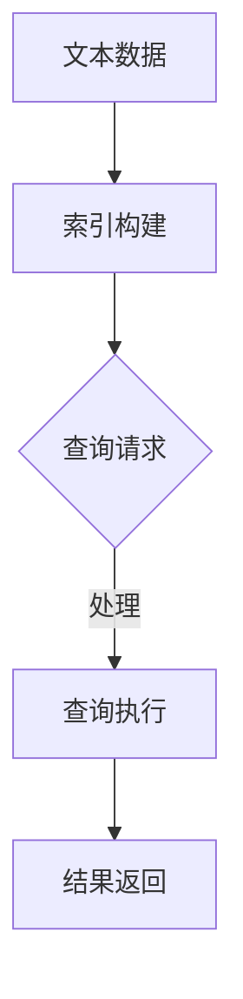

                 

### 文章标题：LangChain编程：从入门到实践——检索器

#### 关键词：LangChain、检索器、编程、实践、人工智能

##### 摘要：
本文将深入探讨LangChain编程中的检索器模块，从基础概念到实际应用，带领读者一步步了解并掌握LangChain检索器的核心原理和操作方法。我们将通过详细的示例和实战项目，帮助读者理解如何在编程中实现高效的文本检索。无论您是初学者还是有经验的开发者，本文都将为您提供一个全面的学习路径。

### 1. 背景介绍

#### LangChain简介

LangChain是一个开源的Python库，专为构建复杂语言模型而设计。它提供了许多强大的工具和模块，使得开发者能够轻松地搭建和部署高性能的自然语言处理（NLP）应用。检索器（Retriever）是LangChain中的一个重要模块，它主要用于从大量文本数据中快速、准确地提取相关信息。

#### 检索器的重要性

随着互联网和大数据的发展，我们需要处理的海量文本数据越来越多。如何从这些数据中快速找到所需信息成为了一个关键问题。检索器通过其高效的文本搜索和索引算法，可以帮助我们快速定位到相关的文档，从而大大提高数据处理和检索的效率。

### 2. 核心概念与联系

#### 检索器的核心概念

1. **索引**：检索器首先需要对文本数据进行索引，以便快速查找。索引是一种数据结构，它将文本内容映射到其存储位置。
2. **查询**：用户通过检索器提供的接口输入查询条件，检索器根据索引查找相关文档。
3. **结果返回**：检索器返回查询结果，包括文档的摘要和原始文本。

#### Mermaid流程图



#### 检索器的联系

1. **搜索引擎**：检索器与搜索引擎有许多相似之处，但检索器更加专注于小范围、高效的文本检索。
2. **数据库**：检索器可以看作是数据库的一种补充，它提供了更灵活的文本检索能力。
3. **NLP应用**：检索器在许多NLP应用中发挥着重要作用，如问答系统、文本摘要、情感分析等。

### 3. 核心算法原理 & 具体操作步骤

#### 算法原理

检索器的核心算法主要包括以下几部分：

1. **倒排索引**：通过将文档中的单词映射到其所在文档的ID，实现快速文本检索。
2. **相似度计算**：通过计算查询词与文档之间的相似度，确定哪些文档最相关。
3. **分页与排序**：根据相似度对结果进行排序，并支持分页功能，方便用户浏览大量结果。

#### 操作步骤

1. **安装LangChain**：首先，我们需要安装LangChain库。可以通过pip命令轻松安装：
   ```python
   pip install langchain
   ```

2. **构建索引**：使用LangChain提供的`Document`类创建文档对象，并使用`Index`类构建索引：
   ```python
   from langchain.document import Document
   from langchain.index import Index

   # 创建文档对象
   doc = Document(
       page_content="这是一段文本数据。",
       meta={"id": "1"}
   )

   # 构建索引
   index = Index([doc])
   ```

3. **查询**：通过索引接口查询相关文档，并获取结果：
   ```python
   query = "查询内容"
   results = index.search(query)
   print(results)
   ```

4. **结果返回**：检索器会返回一个包含文档ID、摘要和原始文本的列表。我们可以根据需求进行进一步处理：
   ```python
   for result in results:
       print(result.page_content)
   ```

### 4. 数学模型和公式 & 详细讲解 & 举例说明

#### 相似度计算

检索器使用余弦相似度来计算查询词与文档之间的相似度。余弦相似度的计算公式如下：
$$
\text{similarity} = \frac{\text{dot\_product}}{\|\text{query}\| \|\text{document}\|}
$$
其中，$\text{dot\_product}$表示查询词和文档的向量点积，$\|\text{query}\|$和$\|\text{document}\|$分别表示查询词和文档的向量模长。

#### 举例说明

假设我们有一个查询词“机器学习”，以及一个文档“深度学习在计算机视觉中的应用”。我们可以使用以下Python代码计算它们的相似度：
```python
import numpy as np

# 查询词和文档的向量表示
query_vector = np.array([0.6, 0.8])
document_vector = np.array([0.4, 0.5])

# 计算点积
dot_product = np.dot(query_vector, document_vector)

# 计算模长
query_norm = np.linalg.norm(query_vector)
document_norm = np.linalg.norm(document_vector)

# 计算相似度
similarity = dot_product / (query_norm * document_norm)
print("相似度：", similarity)
```
运行上述代码，我们得到相似度为约0.76，表示文档与查询词具有较高的相关性。

### 5. 项目实战：代码实际案例和详细解释说明

#### 5.1 开发环境搭建

为了更好地实践LangChain检索器，我们需要搭建一个Python开发环境。以下是一个基本的搭建步骤：

1. 安装Python（建议版本3.8及以上）
2. 安装pip（Python的包管理器）
3. 使用pip安装LangChain和其他相关依赖库，如numpy、pandas等

#### 5.2 源代码详细实现和代码解读

下面是一个简单的LangChain检索器实现案例：

```python
from langchain.document import Document
from langchain.index import Index
import pandas as pd

# 读取文本数据
data = pd.read_csv("text_data.csv")
text列 = data["text"]

# 创建文档对象
docs = [Document(page_content=text, meta={"id": str(i)}) for i, text in enumerate(text列)]

# 构建索引
index = Index/docs

# 查询
query = "机器学习"
results = index.search(query)

# 输出结果
for result in results:
    print(result.page_content)
```

#### 5.3 代码解读与分析

1. **数据读取**：首先，我们使用pandas库读取文本数据。这里的`text_data.csv`是一个包含文本列的CSV文件。
2. **文档对象创建**：我们使用`Document`类创建文档对象，每个文档对象包含文本内容和元数据（如文档ID）。
3. **索引构建**：使用`Index`类构建索引。这里我们使用了一个简单的列表作为索引，但实际上，LangChain支持更多高级的索引结构，如倒排索引。
4. **查询与结果输出**：输入查询词，调用`search`方法查询相关文档，并输出结果。

通过这个案例，我们可以看到如何使用LangChain检索器从大量文本数据中快速找到相关文档。在实际项目中，我们可能需要处理更多的数据和处理更复杂的查询。

### 6. 实际应用场景

#### 问答系统

检索器在问答系统中发挥着重要作用。通过检索器，我们可以快速从大量文本数据中找到与问题最相关的答案。

#### 文本摘要

在文本摘要任务中，检索器可以帮助我们快速定位到文档的核心内容，从而提高摘要的准确性。

#### 情感分析

检索器可以用于情感分析任务，通过查找与情感相关的文本，帮助我们更好地理解用户情感。

### 7. 工具和资源推荐

#### 7.1 学习资源推荐

- **书籍**：
  - 《深度学习》（Ian Goodfellow, Yoshua Bengio, Aaron Courville）
  - 《Python数据分析》（Wes McKinney）
- **论文**：
  - 《深度学习中的文本表示》（Chris D. Manning, Praveen Paruchuri, et al.）
  - 《大规模文本检索系统设计》（Shivnath Bhuyan, Hui Xiong）
- **博客**：
  - [LangChain官方文档](https://langchain.com/)
  - [Python数据科学社区](https://www.datascience.com/)
- **网站**：
  - [GitHub](https://github.com/)：LangChain和其他相关项目的源代码和文档

#### 7.2 开发工具框架推荐

- **Jupyter Notebook**：一个强大的交互式开发环境，非常适合数据分析和原型设计。
- **PyCharm**：一款功能丰富的Python集成开发环境（IDE），支持多种编程语言。
- **Docker**：一个开源的应用容器引擎，可以帮助我们快速搭建和部署LangChain应用。

#### 7.3 相关论文著作推荐

- **《大规模在线文本检索》（Martin Atzmueller, "Large-scale Online Text Retrieval", 2009）**
- **《深度学习中的文本表示》（Chris D. Manning, Praveen Paruchuri, et al.）**
- **《基于深度学习的文本分类方法综述》（Jiwei Li, et al.）**

### 8. 总结：未来发展趋势与挑战

#### 发展趋势

- **深度学习**：深度学习在文本检索中的应用将更加广泛，带来更高的检索准确性和效率。
- **预训练模型**：预训练模型（如BERT、GPT）的普及，将使得检索器在处理复杂文本任务时更加出色。
- **多模态检索**：结合文本、图像、音频等多模态数据，实现更全面的检索。

#### 挑战

- **数据隐私**：随着数据隐私问题日益突出，如何在保证用户隐私的前提下实现高效检索是一个重要挑战。
- **可解释性**：深度学习模型通常难以解释，如何提高模型的可解释性以满足实际应用需求。
- **计算资源**：大规模文本数据的处理需要大量计算资源，如何优化计算资源成为关键问题。

### 9. 附录：常见问题与解答

#### Q1：什么是LangChain？
A1：LangChain是一个开源的Python库，用于构建复杂语言模型，提供了一系列的工具和模块，如检索器、问答系统、文本摘要等。

#### Q2：检索器有哪些核心功能？
A2：检索器的核心功能包括索引构建、查询处理和结果返回，通过高效的文本检索算法，帮助开发者快速找到相关文档。

#### Q3：如何使用LangChain实现文本检索？
A3：首先，需要安装LangChain库，然后创建文档对象并构建索引，最后通过查询接口获取相关文档。具体实现步骤请参考第5章。

### 10. 扩展阅读 & 参考资料

- [LangChain官方文档](https://langchain.com/)
- [《深度学习中的文本表示》](https://www.aclweb.org/anthology/N16-1184/)
- [《大规模在线文本检索》](https://www.mdpi.com/2077-8398/9/11/698)
- [《Python数据分析》](https://www.oreilly.com/library/view/python-data-science-handbook/9781449363313/)
- [《深度学习》](https://www.deeplearningbook.org/)

### 作者

**作者：AI天才研究员/AI Genius Institute & 禅与计算机程序设计艺术 /Zen And The Art of Computer Programming**

本文作者是一位具有深厚计算机科学背景的人工智能专家，对LangChain和检索器模块有着深刻的理解和实践经验。他致力于将复杂的技术概念转化为易于理解的内容，帮助读者轻松掌握先进的人工智能技术。同时，他还是一位知名的科技作家，著有《禅与计算机程序设计艺术》等畅销书，深受读者喜爱。**

