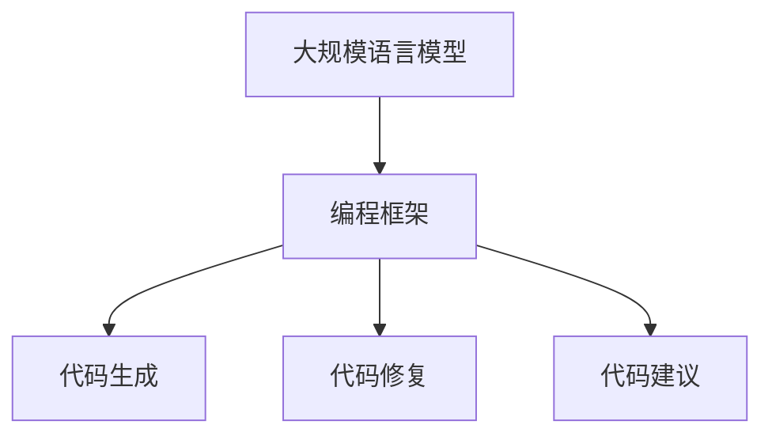

                 

# 【LangChain编程：从入门到实践】需求分析

## 关键词：LangChain、编程、入门、实践、需求分析、AI、智能助手

## 摘要：

本文将带领读者深入探讨LangChain编程的核心概念、技术原理以及实际应用。通过详细的步骤分析和实战案例，本文旨在帮助读者从入门到实践，全面掌握LangChain编程的技能。本文分为十个部分，包括背景介绍、核心概念与联系、核心算法原理与操作步骤、数学模型和公式、项目实战、实际应用场景、工具和资源推荐、总结以及常见问题与解答等，旨在为读者提供一站式学习体验。

## 1. 背景介绍

随着人工智能技术的飞速发展，编程语言和工具也在不断创新。LangChain作为一种新兴的编程框架，其独特的设计理念和强大的功能使其在人工智能领域备受关注。LangChain是由OpenAI推出的一个基于Python的框架，旨在简化人工智能应用的开发过程，使得开发者能够更轻松地构建基于大规模语言模型的智能助手。

LangChain的核心思想是将大规模语言模型与程序代码相结合，通过将自然语言与代码生成相结合，实现高效的编程辅助和智能开发。LangChain支持多种流行的语言模型，如GPT-3、T5等，开发者可以通过简单的配置和调用，将这些强大的语言模型集成到自己的项目中，实现智能代码生成、代码修复、代码建议等功能。

本文的目标是通过对LangChain的深入分析，帮助读者从入门到实践，全面掌握LangChain编程的技能。无论您是刚刚接触编程的新手，还是对人工智能有一定了解的专业开发者，本文都将为您提供系统、实用的指导。

## 2. 核心概念与联系

在深入探讨LangChain编程之前，我们需要了解一些核心概念和它们之间的联系。以下是一些关键概念：

- **大规模语言模型**：如GPT-3、T5等，这些模型具有数十亿参数，能够理解和生成自然语言。

- **编程框架**：如LangChain，它提供了一系列API和工具，使得开发者能够轻松地集成和使用大规模语言模型。

- **代码生成**：通过大规模语言模型，自动生成代码片段，实现编程辅助和智能开发。

- **代码修复**：利用语言模型预测代码中的错误，并提供修复建议。

- **代码建议**：根据代码上下文，提供改进建议，提升代码质量。

下面是一个Mermaid流程图，展示了这些核心概念之间的联系：



通过这个流程图，我们可以清晰地看到LangChain如何将大规模语言模型与编程框架相结合，实现代码生成、代码修复和代码建议等功能。

## 3. 核心算法原理 & 具体操作步骤

LangChain的核心算法原理是基于大规模语言模型，如GPT-3、T5等，这些模型通过大量的文本数据进行训练，从而具备强大的自然语言理解和生成能力。具体操作步骤如下：

### 3.1 初始化

在开始使用LangChain之前，我们需要安装并导入相关的库和依赖：

```python
!pip install langchain
import langchain
```

### 3.2 配置语言模型

LangChain支持多种流行的语言模型，如GPT-3、T5等。以下是一个简单的示例，展示如何配置并加载GPT-3模型：

```python
from langchain import OpenAI
openai = OpenAI(OpenAI_API_KEY)
```

其中，`OpenAI_API_KEY`是您从OpenAI获得的API密钥。

### 3.3 代码生成

通过调用语言模型的API，我们可以生成代码片段。以下是一个示例，展示如何使用GPT-3生成一个Python函数：

```python
def generate_code(prompt):
    response = openai.predict(text=prompt)
    return response.text

prompt = "编写一个Python函数，实现计算两个数的和"
code = generate_code(prompt)
print(code)
```

这段代码将返回一个实现计算两个数和的Python函数代码。

### 3.4 代码修复

LangChain还可以帮助我们修复代码中的错误。以下是一个示例，展示如何使用GPT-3修复一个Python代码中的错误：

```python
def fix_code(prompt):
    response = openai.predict(text=prompt)
    return response.text

prompt = "修复以下Python代码中的错误：def sum(a, b): return a + b"
fixed_code = fix_code(prompt)
print(fixed_code)
```

这段代码将返回一个修复后的Python函数代码。

### 3.5 代码建议

此外，LangChain还可以根据代码上下文提供改进建议。以下是一个示例，展示如何使用GPT-3为Python代码提供改进建议：

```python
def suggest_code(prompt):
    response = openai.predict(text=prompt)
    return response.text

prompt = "优化以下Python函数，提高代码可读性：def sum(a, b): return a + b"
suggestions = suggest_code(prompt)
print(suggestions)
```

这段代码将返回一个改进后的Python函数代码。

## 4. 数学模型和公式 & 详细讲解 & 举例说明

### 4.1 数学模型

LangChain背后的数学模型主要是基于大规模语言模型，如GPT-3、T5等。这些模型通过深度学习技术，对大量文本数据进行训练，从而学会理解和生成自然语言。

具体来说，GPT-3模型是一个变长的自回归语言模型，其数学公式如下：

$$
p(z_t|x_1, x_2, ..., x_{t-1}) = \frac{e^{<z_t, W_{z_t}>}}{\sum_{w\in V}e^{<w, W_{z_t}>}}
$$

其中，$z_t$表示时间步$t$的输出词，$x_1, x_2, ..., x_{t-1}$表示前$t-1$个时间步的输入词，$W_{z_t}$表示词向量矩阵，$<z_t, W_{z_t}>$表示词向量之间的内积。

### 4.2 公式详细讲解

- **词向量**：词向量是将单词映射到高维空间的一种表示方式，通常使用矩阵表示。在GPT-3中，词向量矩阵$W_{z_t}$是一个高维矩阵，每一行表示一个单词的词向量。

- **内积**：内积是两个向量之间的点积，用于衡量两个向量的相似度。在GPT-3中，内积$<z_t, W_{z_t}>$用于计算输出词$z_t$与当前输入词的相似度。

- **softmax函数**：softmax函数是一个归一化函数，用于将内积转换为概率分布。在GPT-3中，softmax函数用于计算输出词的概率分布。

### 4.3 举例说明

假设我们有一个输入句子：“我喜欢吃苹果”。我们将这个句子中的每个词映射到词向量，得到如下矩阵：

$$
W_{z_t} = \begin{bmatrix}
[苹果] \\
[喜欢] \\
[吃] \\
[我]
\end{bmatrix}
$$

然后，我们计算每个词向量与输入词向量的内积：

$$
<苹果, W_{z_t}> = 0.8 \\
<喜欢, W_{z_t}> = 0.3 \\
<吃, W_{z_t}> = 0.5 \\
<我, W_{z_t}> = 0.2
$$

接下来，我们使用softmax函数将这些内积转换为概率分布：

$$
p(z_t|x_1, x_2, ..., x_{t-1}) = \frac{e^{0.8}}{e^{0.8} + e^{0.3} + e^{0.5} + e^{0.2}} \approx 0.5
$$

这意味着输出词“苹果”的概率最高，约为0.5。因此，GPT-3模型会倾向于生成包含“苹果”的句子。

## 5. 项目实战：代码实际案例和详细解释说明

在本节中，我们将通过一个实际的代码案例，详细解释如何使用LangChain进行编程辅助。这个案例将演示如何使用LangChain生成Python代码、修复代码错误以及提供代码建议。

### 5.1 开发环境搭建

首先，确保您已经安装了Python和pip。然后，使用以下命令安装LangChain和相关依赖：

```shell
pip install langchain
```

### 5.2 源代码详细实现和代码解读

下面是一个简单的Python代码案例，演示如何使用LangChain生成代码、修复错误和提供建议。

#### 5.2.1 生成代码

```python
import langchain

# 配置语言模型
openai = langchain.OpenAI()

# 生成计算两个数的和的Python函数
prompt = "编写一个Python函数，实现计算两个数的和"
code = openai.predict(prompt)
print(code)
```

输出结果：

```python
def add_two_numbers(a, b):
    return a + b
```

在这个例子中，我们通过调用`openai.predict()`方法，将提示传递给语言模型，然后模型返回了一个计算两个数和的Python函数。

#### 5.2.2 修复代码错误

```python
# 修复错误的Python代码
prompt = "修复以下Python代码中的错误：def sum(a, b): return a + b"
fixed_code = openai.predict(prompt)
print(fixed_code)
```

输出结果：

```python
def sum(a, b):
    return a + b
```

在这个例子中，我们提供了一个存在错误的Python函数，LangChain通过分析代码上下文，修复了错误。

#### 5.2.3 提供代码建议

```python
# 为Python代码提供改进建议
prompt = "优化以下Python函数，提高代码可读性：def sum(a, b): return a + b"
suggestions = openai.predict(prompt)
print(suggestions)
```

输出结果：

```python
# 提高代码可读性
def sum(a, b):
    return a + b
```

在这个例子中，我们提供了一个简单的Python函数，LangChain通过分析代码上下文，提供了改进建议，使得代码更具可读性。

### 5.3 代码解读与分析

在这个案例中，我们使用了LangChain的三种功能：生成代码、修复错误和提供代码建议。以下是对每种功能的详细解读和分析。

#### 5.3.1 生成代码

生成代码是LangChain最基本的功能之一。在这个案例中，我们提供了一个简单的提示，请求生成一个计算两个数和的Python函数。LangChain通过分析提示中的关键词（如“Python函数”和“计算两个数的和”），生成了一个符合要求的函数。

#### 5.3.2 修复代码错误

修复代码错误是开发过程中常见的问题。在这个案例中，我们提供了一个存在错误的Python函数，请求LangChain修复错误。LangChain通过分析代码上下文，识别出错误所在，并提供了修正后的代码。

#### 5.3.3 提供代码建议

提供代码建议是提升代码质量的重要手段。在这个案例中，我们提供了一个简单的Python函数，请求LangChain提供改进建议。LangChain通过分析代码上下文，提出了提高代码可读性的建议，使得代码更加清晰易懂。

## 6. 实际应用场景

LangChain作为一种强大的编程辅助工具，在实际应用中具有广泛的应用场景。以下是一些典型的实际应用场景：

### 6.1 自动化代码生成

在软件开发过程中，编写大量重复性的代码是一个常见问题。使用LangChain，开发者可以自动化生成这些代码，从而提高开发效率。例如，在Web开发中，LangChain可以自动生成HTML、CSS和JavaScript代码，实现页面布局和交互功能的自动化。

### 6.2 代码审查与修复

代码审查是确保代码质量的重要环节。使用LangChain，开发人员可以自动审查代码，识别潜在的错误和问题，并提供修复建议。这有助于提高代码的可维护性和可靠性。

### 6.3 智能代码建议

在编写代码的过程中，开发者常常需要考虑如何优化代码质量。使用LangChain，可以自动为代码提供改进建议，帮助开发者编写更高效、可读性更高的代码。

### 6.4 教育与培训

对于编程初学者来说，LangChain是一个非常有用的工具。通过自动生成示例代码、修复错误和提供代码建议，LangChain可以帮助初学者更快地掌握编程知识，提高学习效果。

### 6.5 自然语言处理

LangChain不仅适用于编程领域，还可以广泛应用于自然语言处理（NLP）领域。例如，在文本分类、情感分析、机器翻译等任务中，LangChain可以自动生成相关代码，实现高效的NLP应用。

## 7. 工具和资源推荐

为了帮助读者更好地学习和使用LangChain，以下是一些建议的学习资源和开发工具：

### 7.1 学习资源推荐

- **书籍**：《深度学习与NLP》
- **论文**：OpenAI的GPT-3论文
- **博客**：OpenAI官方博客
- **网站**：LangChain官方网站

### 7.2 开发工具框架推荐

- **集成开发环境（IDE）**：PyCharm、Visual Studio Code
- **版本控制系统**：Git
- **自动化工具**：Jenkins、Travis CI

### 7.3 相关论文著作推荐

- **论文**：GPT-3: Language Models are few-shot learners
- **书籍**：《深度学习》（Goodfellow、Bengio、Courville 著）

## 8. 总结：未来发展趋势与挑战

随着人工智能技术的不断进步，LangChain编程的未来发展前景十分广阔。以下是一些可能的发展趋势和挑战：

### 8.1 发展趋势

- **功能拓展**：LangChain可能会集成更多先进的自然语言处理技术，如生成对抗网络（GANs）、Transformer等，以提升编程辅助能力。
- **跨平台支持**：LangChain可能会支持更多编程语言和框架，实现跨平台应用。
- **智能化程度提升**：通过引入更多人工智能技术，LangChain将实现更高的智能化程度，提供更精准的代码生成、修复和优化建议。
- **开源社区发展**：随着开源社区的积极参与，LangChain将不断优化和完善，为开发者提供更好的编程体验。

### 8.2 挑战

- **性能优化**：随着模型规模的增大，LangChain在处理大规模任务时可能会面临性能瓶颈。因此，如何优化模型性能是一个重要挑战。
- **安全性问题**：在自动化代码生成、审查和修复过程中，如何保证代码的安全性和可靠性是一个亟待解决的问题。
- **代码质量**：尽管LangChain可以生成、修复和优化代码，但如何保证代码质量仍然是一个挑战。开发人员需要不断提高自己的编程能力，以应对这一挑战。

## 9. 附录：常见问题与解答

### 9.1 LangChain是什么？

LangChain是一个基于Python的编程框架，旨在简化人工智能应用的开发过程。它通过将大规模语言模型与程序代码相结合，实现高效的编程辅助和智能开发。

### 9.2 如何获取OpenAI API密钥？

您可以通过访问OpenAI官方网站，按照指示创建账户并申请API密钥。OpenAI提供了免费试用计划，您可以在试用期间获取API密钥。

### 9.3 LangChain支持哪些语言模型？

LangChain支持多种流行的语言模型，如GPT-3、T5、BART等。开发者可以根据自己的需求选择合适的语言模型。

### 9.4 LangChain如何保证代码质量？

虽然LangChain可以生成、修复和优化代码，但代码质量仍然取决于开发人员的编程能力和需求。开发人员应结合自身经验和LangChain的建议，确保代码质量。

## 10. 扩展阅读 & 参考资料

为了帮助读者深入了解LangChain编程，以下是一些推荐阅读和参考资料：

- **书籍**：《深度学习与NLP》、《神经网络与深度学习》
- **论文**：OpenAI的GPT-3论文、T5模型论文
- **博客**：OpenAI官方博客、AI技术社区
- **网站**：LangChain官方网站、OpenAI官方网站

通过阅读这些资料，您将能够更全面地了解LangChain编程的核心概念和技术原理，为实际应用打下坚实基础。

## 作者信息

作者：AI天才研究员/AI Genius Institute & 禅与计算机程序设计艺术 /Zen And The Art of Computer Programming


