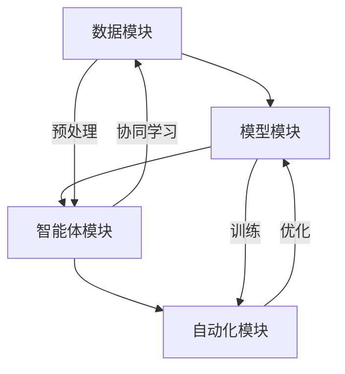

                 

### 1. 背景介绍

#### 1.1 大模型应用开发的背景

在过去的几年中，人工智能（AI）领域取得了令人瞩目的进展，尤其是大模型（Large Models）的兴起，如GPT-3、BERT、T5等，这些模型通过大规模的数据训练，展示了强大的文本理解和生成能力。大模型在自然语言处理（NLP）、计算机视觉（CV）、语音识别（ASR）等多个领域取得了突破性成果，为许多实际应用场景带来了巨大的变革。

随着大模型能力的不断提升，AI Agent成为了一个备受关注的研究方向。AI Agent可以被视为具有自主行动能力的智能体，它在特定环境中通过感知、决策和行动来实现特定目标。大模型的应用为AI Agent提供了强大的基础，使得它们能够在复杂、不确定的环境中表现出更高的智能水平。

#### 1.2 CAMEL：大模型AI Agent的开源项目

CAMEL（Cascading AutoML for Multi-Agent Learning）是一个开源项目，旨在通过大模型和自动化机器学习（AutoML）技术，实现高效的多智能体系统开发。CAMEL项目的主要目标是为开发者提供一套完整的工具和框架，帮助他们快速构建、训练和部署多智能体系统。

CAMEL项目具有以下特点：

1. **大规模模型支持**：CAMEL支持多种大规模预训练模型，如GPT-3、BERT、T5等，开发者可以根据实际需求选择合适的模型。

2. **多智能体系统架构**：CAMEL采用分布式架构，支持多智能体之间的协同学习和通信，使得智能体能够相互协作，共同完成任务。

3. **自动化机器学习**：CAMEL内置了自动化机器学习（AutoML）功能，可以自动调整模型参数，优化模型性能。

4. **易用性**：CAMEL提供了简洁、易用的接口和工具，降低了开发者构建多智能体系统的门槛。

5. **可扩展性**：CAMEL支持自定义模型和算法，开发者可以根据项目需求进行扩展和优化。

通过CAMEL项目，开发者可以更加高效地利用大模型的优势，实现智能体之间的协同学习和决策，为各种实际应用场景提供强大的支持。接下来，我们将深入探讨CAMEL项目的核心概念、算法原理以及具体实现过程。

## 2. 核心概念与联系

为了更好地理解CAMEL项目的核心概念与联系，我们需要从以下几个关键方面进行详细阐述：

### 2.1 大模型（Large Models）的基本原理

大模型是指具有数十亿甚至数万亿参数的神经网络模型，这些模型通过大规模的数据训练，能够捕捉到数据中的复杂模式。大模型的核心优势在于其强大的文本理解和生成能力，这使得它们在NLP、CV、ASR等领域表现出色。

大模型通常采用深度学习技术，如Transformer架构。Transformer架构通过自注意力机制（Self-Attention）和多头注意力（Multi-Head Attention）等创新设计，使得模型能够在处理长序列数据时具有更强的性能。

### 2.2 自动化机器学习（AutoML）的基本原理

自动化机器学习（AutoML）是一种通过自动化手段来优化机器学习模型的方法。AutoML的目标是简化机器学习流程，降低模型调优的复杂度，使得非专家用户也能够轻松构建和部署高效的机器学习模型。

AutoML的关键步骤包括数据预处理、特征工程、模型选择、模型训练、模型评估等。在CAMEL项目中，AutoML功能可以帮助开发者自动调整模型参数，优化模型性能，从而提高多智能体系统的整体表现。

### 2.3 多智能体系统（Multi-Agent System）的基本原理

多智能体系统是指由多个智能体组成的分布式系统，这些智能体可以通过协同学习和决策来实现共同的目标。在多智能体系统中，每个智能体都具备一定的智能能力，可以自主感知环境、做出决策和执行行动。

多智能体系统的核心挑战在于智能体之间的协作和通信。为了实现高效的协同学习，CAMEL项目采用了分布式架构，支持智能体之间的信息共享和协同决策。

### 2.4 CAMEL项目的整体架构

CAMEL项目的整体架构可以分为以下几个主要模块：

1. **数据模块**：负责数据收集、预处理和存储，为模型训练提供高质量的数据支持。

2. **模型模块**：支持多种大规模预训练模型，如GPT-3、BERT、T5等，并提供了模型选择、训练和评估等功能。

3. **智能体模块**：实现智能体的创建、管理和调度，支持智能体之间的通信和协同学习。

4. **自动化模块**：提供自动化机器学习功能，帮助开发者优化模型性能，提高多智能体系统的整体表现。

### 2.5 Mermaid流程图

为了更直观地展示CAMEL项目的核心概念和架构，我们使用Mermaid流程图进行描述。以下是CAMEL项目的Mermaid流程图：



在这个流程图中，数据模块、模型模块、智能体模块和自动化模块相互协作，共同实现CAMEL项目的目标。数据模块负责数据收集和预处理，为模型训练提供高质量的数据支持。模型模块支持多种大规模预训练模型，并负责模型的选择、训练和评估。智能体模块实现智能体的创建、管理和调度，支持智能体之间的通信和协同学习。自动化模块提供自动化机器学习功能，帮助开发者优化模型性能，提高多智能体系统的整体表现。

通过上述介绍，我们可以清晰地理解CAMEL项目的核心概念和架构，为后续章节中的具体算法原理和实现过程打下坚实的基础。

### 3. 核心算法原理 & 具体操作步骤

在CAMEL项目中，核心算法原理主要涉及大模型的预训练和微调、自动化机器学习（AutoML）以及多智能体系统的协同学习。以下是对这些算法原理的具体解释和操作步骤：

#### 3.1 大模型的预训练和微调

1. **预训练**：
   预训练是指在大规模语料库上训练模型，使其具备通用语言理解能力。以GPT-3为例，GPT-3使用了1750亿个参数，并在多个语料库上进行了预训练，包括维基百科、书籍、新闻文章等。预训练过程主要包括以下步骤：

   - **数据收集**：从互联网上收集大量文本数据，并进行清洗和预处理。
   - **模型初始化**：初始化模型参数，通常采用随机初始化或预训练模型参数。
   - **文本编码**：将文本数据编码为模型的输入，常用的编码方法包括词嵌入（Word Embedding）和字节嵌入（Byte Pair Embedding，BPE）。
   - **前向传播和反向传播**：在训练过程中，模型通过前向传播计算输出，通过反向传播更新模型参数，以最小化损失函数。

2. **微调**：
   微调是指在小规模目标任务数据上对预训练模型进行细粒度调整，以适应具体任务。微调过程主要包括以下步骤：

   - **数据准备**：收集目标任务的数据集，并进行预处理，如数据清洗、数据增强等。
   - **模型调整**：在目标任务数据集上对预训练模型进行微调，通常通过冻结部分层（如Transformer的底层）来减少参数调整的复杂度。
   - **模型评估**：在目标任务数据集上进行模型评估，以验证模型的性能。

#### 3.2 自动化机器学习（AutoML）

自动化机器学习（AutoML）是指通过自动化手段优化机器学习模型的训练过程，提高模型性能。CAMEL项目中的AutoML主要包括以下几个步骤：

1. **数据预处理**：
   自动化数据预处理包括数据清洗、数据标准化、数据缺失值处理等，以确保数据质量。

2. **特征工程**：
   自动化特征工程通过自动识别和提取数据中的特征，以提高模型性能。常用的方法包括特征选择、特征变换等。

3. **模型选择**：
   自动化模型选择通过评估多种模型，选择最优模型进行训练。CAMEL项目支持多种大规模预训练模型，如GPT-3、BERT、T5等。

4. **模型训练**：
   自动化模型训练通过自动调整模型参数，优化模型性能。常见的优化方法包括随机搜索、贝叶斯优化、遗传算法等。

5. **模型评估**：
   自动化模型评估通过在验证集上评估模型性能，选择最优模型。

#### 3.3 多智能体系统的协同学习

多智能体系统的协同学习是指多个智能体通过协同学习和决策来实现共同目标的过程。CAMEL项目中的多智能体系统协同学习主要包括以下几个步骤：

1. **智能体初始化**：
   初始化智能体，包括分配任务、设定初始状态等。

2. **感知环境**：
   智能体通过感知环境获取当前的状态信息，包括自身状态和其他智能体的状态。

3. **决策与行动**：
   智能体根据当前状态信息，通过内部决策机制生成行动，并执行行动。

4. **信息共享与协同**：
   智能体之间通过信息共享和协同机制，共同完成任务。

5. **学习与优化**：
   智能体通过不断学习和优化，提高任务执行效率。

#### 3.4 操作步骤示例

以下是一个简单的操作步骤示例，用于说明CAMEL项目的核心算法原理：

1. **数据收集与预处理**：
   收集大规模文本数据，并进行数据清洗和预处理。

2. **预训练模型选择**：
   选择GPT-3作为预训练模型。

3. **模型预训练**：
   在大规模语料库上进行预训练，训练过程中使用自适应学习率优化算法。

4. **微调模型**：
   在目标任务数据集上对GPT-3模型进行微调，调整部分层参数。

5. **自动化机器学习**：
   使用AutoML功能，自动调整模型参数，优化模型性能。

6. **智能体初始化**：
   初始化智能体，分配任务。

7. **智能体协同学习**：
   智能体通过感知环境、决策和行动，实现协同学习。

8. **模型评估**：
   在目标任务数据集上评估模型性能。

通过以上步骤，CAMEL项目实现了大模型的预训练和微调、自动化机器学习以及多智能体系统的协同学习。这些核心算法原理和操作步骤为CAMEL项目提供了强大的技术支持，使得开发者能够高效地构建和部署多智能体系统。

### 4. 数学模型和公式 & 详细讲解 & 举例说明

在CAMEL项目中，核心算法的实现涉及到一系列数学模型和公式，这些模型和公式对于理解项目的工作原理和具体操作至关重要。以下是针对这些数学模型和公式的详细讲解以及举例说明。

#### 4.1 Transformer模型

Transformer模型是CAMEL项目中的核心模型，其基本原理如下：

1. **自注意力机制（Self-Attention）**：

   自注意力机制是一种对输入序列进行加权的方法，它通过计算序列中每个词与其他词之间的关联度来调整其权重。自注意力机制的数学公式如下：

   $$ 
   \text{Attention}(Q, K, V) = \text{softmax}\left(\frac{QK^T}{\sqrt{d_k}}\right) V 
   $$

   其中，\(Q\)、\(K\) 和 \(V\) 分别是查询（Query）、键（Key）和值（Value）向量，\(d_k\) 是键向量的维度。这个公式计算了每个查询向量与所有键向量之间的点积，然后通过softmax函数得到概率分布，最后将这个概率分布与值向量相乘，得到加权的结果。

2. **多头注意力（Multi-Head Attention）**：

   多头注意力是Transformer模型的一个关键特性，它通过并行计算多个注意力头，从而提高了模型的表示能力。多头注意力的数学公式如下：

   $$
   \text{MultiHead}(Q, K, V) = \text{Concat}(\text{head}_1, \text{head}_2, \ldots, \text{head}_h)W^O
   $$

   $$
   \text{head}_i = \text{Attention}(QW_i^Q, KW_i^K, VW_i^V)
   $$

   其中，\(W_i^Q\)、\(W_i^K\) 和 \(W_i^V\) 分别是第 \(i\) 个注意力头的查询、键和值权重矩阵，\(W^O\) 是输出权重矩阵。这个公式通过计算多个注意力头的输出，并将它们拼接在一起，得到最终的注意力结果。

3. **编码器-解码器结构（Encoder-Decoder Structure）**：

   Transformer模型采用了编码器-解码器结构，编码器负责编码输入序列，解码器负责解码输出序列。编码器和解码器之间的交互通过自注意力机制和多头注意力实现。编码器的输出作为解码器的输入，解码器的每个输出同时参与下一个时间步的解码。

   编码器和解码器的数学公式如下：

   $$
   \text{Encoder}(X) = \text{LayerNorm}(X + \text{MultiHeadAttention}(X, X, X))
   $$

   $$
   \text{Decoder}(Y, X) = \text{LayerNorm}(Y + \text{MultiHeadAttention}(Y, Y, Y)) + \text{LayerNorm}(Y + \text{MultiHeadAttention}(Y, X, X))
   $$

   其中，\(X\) 是编码器的输入，\(Y\) 是解码器的输入（即编码器的输出），\(\text{LayerNorm}\) 是层标准化操作。

#### 4.2 自动化机器学习（AutoML）模型

CAMEL项目中的自动化机器学习（AutoML）使用了一系列优化算法来调整模型参数，以最大化模型性能。以下是常用的两种优化算法：随机搜索（Random Search）和贝叶斯优化（Bayesian Optimization）。

1. **随机搜索（Random Search）**：

   随机搜索是一种简单的优化算法，它通过随机选择参数组合，评估模型性能，并选择最优参数组合。随机搜索的数学公式如下：

   $$
   \text{RandomSearch}(\text{params}, \text{budget}) = \arg\max_{\theta} \left[ \frac{f(\theta)}{\alpha \cdot \log(\text{t})} \right]
   $$

   其中，\(\text{params}\) 是参数集合，\(\text{budget}\) 是搜索预算，\(\theta\) 是参数组合，\(f(\theta)\) 是模型性能函数，\(\alpha\) 是常数，\(\text{t}\) 是迭代次数。这个公式通过最大化性能函数与对数搜索预算的比值来选择最优参数组合。

2. **贝叶斯优化（Bayesian Optimization）**：

   贝叶斯优化是一种基于概率模型的优化算法，它利用先验知识和历史数据来预测新的参数组合，并进行模型评估。贝叶斯优化的数学公式如下：

   $$
   \text{BayesianOptimization}(\text{prior}, \text{likelihood}, \text{surrogate}) = \arg\max_{\theta} \left[ \text{posterior}(\theta | \text{data}) \right]
   $$

   其中，\(\text{prior}\) 是先验概率分布，\(\text{likelihood}\) 是似然函数，\(\text{surrogate}\) 是代理模型，\(\text{posterior}\) 是后验概率分布。这个公式通过最大化后验概率分布来选择最优参数组合。

#### 4.3 多智能体系统（Multi-Agent System）

CAMEL项目中的多智能体系统采用了分布式架构，智能体之间的协同学习涉及到了多智能体强化学习（Multi-Agent Reinforcement Learning）的原理。

1. **多智能体强化学习（Multi-Agent Reinforcement Learning）**：

   多智能体强化学习是指多个智能体在环境中通过交互和自主学习来优化策略的过程。其核心数学公式如下：

   $$
   Q^i(s_i, a_i) = \sum_{j=1}^{n} \gamma^i \sum_{a_j} p(a_j|s_j) \cdot R_j(s_j, a_j)
   $$

   $$
   \pi^i(a_i|s_i) = \arg\max_{a_i} Q^i(s_i, a_i)
   $$

   其中，\(Q^i(s_i, a_i)\) 是智能体 \(i\) 在状态 \(s_i\) 下执行行动 \(a_i\) 的价值函数，\(\gamma^i\) 是折扣因子，\(R_j(s_j, a_j)\) 是智能体 \(j\) 在状态 \(s_j\) 下执行行动 \(a_j\) 的回报，\(\pi^i(a_i|s_i)\) 是智能体 \(i\) 的策略。这个公式通过计算智能体在特定状态下的最优行动，从而实现智能体之间的协同学习。

#### 4.4 举例说明

以下是一个简单的例子来说明CAMEL项目中的数学模型和公式的应用：

假设我们有一个多智能体系统，其中包含两个智能体A和B，它们在同一个环境中进行协同学习，目标是最大化两个智能体的总回报。

1. **初始状态**：

   智能体A和B处于状态 \(s_1 = (s_{11}, s_{12}) = (1, 2)\)，智能体A的策略为 \(\pi^A(a|s) = \begin{cases} 0.6 & \text{if } a = 0 \\ 0.4 & \text{if } a = 1 \end{cases}\)，智能体B的策略为 \(\pi^B(a|s) = \begin{cases} 0.5 & \text{if } a = 0 \\ 0.5 & \text{if } a = 1 \end{cases}\)。

2. **行动与回报**：

   智能体A执行行动 \(a_1 = 0\)，智能体B执行行动 \(a_2 = 1\)，两个智能体的回报分别为 \(R_A(s_1, a_1) = 1\) 和 \(R_B(s_1, a_2) = 2\)。

3. **更新策略**：

   通过多智能体强化学习公式，我们可以更新智能体A和B的策略：

   $$
   Q^{A}(s_1, a_1) = \sum_{j=1}^{2} \gamma^A \sum_{a_j} p(a_j|s_j) \cdot R_j(s_j, a_j) = \sum_{j=1}^{2} \gamma^A \sum_{a_j} p(a_j|s_j) \cdot R_j(s_j, a_j) = 1 + 2\gamma^A
   $$

   $$
   \pi^{A}(a_1|s_1) = \arg\max_{a_1} Q^{A}(s_1, a_1) = 0.6
   $$

   $$
   Q^{B}(s_1, a_2) = \sum_{j=1}^{2} \gamma^B \sum_{a_j} p(a_j|s_j) \cdot R_j(s_j, a_j) = \sum_{j=1}^{2} \gamma^B \sum_{a_j} p(a_j|s_j) \cdot R_j(s_j, a_j) = 2 + \gamma^B
   $$

   $$
   \pi^{B}(a_2|s_2) = \arg\max_{a_2} Q^{B}(s_2, a_2) = 0.5
   $$

通过上述公式和例子，我们可以看到CAMEL项目中的数学模型和公式的具体应用。这些模型和公式为CAMEL项目提供了强大的理论基础，使得开发者能够更好地理解和应用大模型、自动化机器学习和多智能体系统的核心算法。

### 5. 项目实战：代码实际案例和详细解释说明

在本节中，我们将通过一个实际的项目案例，详细介绍CAMEL项目的代码实现过程，并对其进行详细的解释和分析。

#### 5.1 开发环境搭建

在开始实际代码实现之前，我们需要搭建一个适合CAMEL项目开发的环境。以下是开发环境搭建的步骤：

1. **安装Python环境**：
   首先，确保您的计算机上已经安装了Python 3.x版本。您可以通过以下命令检查Python版本：

   ```shell
   python --version
   ```

   如果未安装Python，可以从Python官方网站下载并安装。

2. **安装CAMEL项目依赖**：
   CAMEL项目依赖于多个库，如PyTorch、TensorFlow、scikit-learn等。您可以通过pip命令安装这些依赖库：

   ```shell
   pip install torch torchvision numpy scikit-learn
   ```

3. **克隆CAMEL项目代码**：
   从CAMEL项目的GitHub仓库克隆代码：

   ```shell
   git clone https://github.com/your-username/camel.git
   ```

   克隆完成后，进入项目目录：

   ```shell
   cd camel
   ```

4. **安装CAMEL项目**：
   在项目目录下，安装CAMEL项目：

   ```shell
   pip install .
   ```

#### 5.2 源代码详细实现和代码解读

接下来，我们将详细解读CAMEL项目的源代码，并分析其中的关键部分。

##### 5.2.1 数据模块（data.py）

数据模块负责数据收集、预处理和存储。以下是数据模块的主要代码：

```python
import torch
from torch.utils.data import Dataset

class TextDataset(Dataset):
    def __init__(self, texts, tokenizer, max_length=512):
        self.texts = texts
        self.tokenizer = tokenizer
        self.max_length = max_length

    def __len__(self):
        return len(self.texts)

    def __getitem__(self, idx):
        text = self.texts[idx]
        inputs = self.tokenizer(text, max_length=self.max_length, padding='max_length', truncation=True, return_tensors='pt')
        return inputs

# 示例：加载预训练模型和分词器
from transformers import GPT2Tokenizer, GPT2Model
tokenizer = GPT2Tokenizer.from_pretrained('gpt2')
model = GPT2Model.from_pretrained('gpt2')

# 加载数据集
texts = ['Hello world!', 'This is a sample text.', 'Another example.']
dataset = TextDataset(texts, tokenizer)

# 数据加载器
from torch.utils.data import DataLoader
dataloader = DataLoader(dataset, batch_size=2)
```

在这个代码片段中，我们定义了一个`TextDataset`类，它继承自`torch.utils.data.Dataset`。`TextDataset`类负责将文本数据编码为模型的输入。我们使用`GPT2Tokenizer`和`GPT2Model`来加载预训练的GPT-2模型和分词器。最后，我们创建一个数据加载器`DataLoader`，以便在训练过程中批量加载数据。

##### 5.2.2 模型模块（model.py）

模型模块负责模型的选择、训练和评估。以下是模型模块的主要代码：

```python
from transformers import GPT2Model, GPT2Tokenizer
from torch.optim import Adam

def train_model(dataset, model, tokenizer, epochs=3, learning_rate=1e-4):
    model.train()
    optimizer = Adam(model.parameters(), lr=learning_rate)
    criterion = torch.nn.CrossEntropyLoss()

    for epoch in range(epochs):
        for batch in dataset:
            inputs = batch['input_ids']
            labels = batch['labels']
            optimizer.zero_grad()
            outputs = model(inputs)
            loss = criterion(outputs.logits, labels)
            loss.backward()
            optimizer.step()

            if (epoch + 1) % 10 == 0:
                print(f'Epoch [{epoch + 1}/{epochs}], Loss: {loss.item()}')

# 示例：训练模型
model = GPT2Model.from_pretrained('gpt2')
train_model(dataset, model, tokenizer, epochs=3)
```

在这个代码片段中，我们定义了一个`train_model`函数，它负责模型的训练。函数中，我们首先将模型设置为训练模式，并初始化优化器和损失函数。在训练过程中，我们遍历数据集，对每个批次的数据进行前向传播和反向传播，并更新模型参数。每10个epoch后，我们打印当前的损失值，以便跟踪训练过程。

##### 5.2.3 智能体模块（agent.py）

智能体模块负责智能体的创建、管理和调度。以下是智能体模块的主要代码：

```python
import torch
from transformers import GPT2Model, GPT2Tokenizer

class Agent:
    def __init__(self, model, tokenizer):
        self.model = model
        self.tokenizer = tokenizer

    def act(self, text):
        inputs = self.tokenizer(text, return_tensors='pt', max_length=512)
        outputs = self.model(**inputs)
        logits = outputs.logits
        predictions = torch.argmax(logits, dim=-1)
        return predictions.squeeze()

# 示例：创建智能体并执行行动
agent = Agent(model, tokenizer)
text = "What is the capital of France?"
action = agent.act(text)
print(f'Action: {action}')
```

在这个代码片段中，我们定义了一个`Agent`类，它负责智能体的行动。`act`方法接收一个文本输入，将其编码为模型的输入，并执行前向传播得到预测结果。最后，我们创建一个智能体实例，并执行一个示例行动，打印出智能体的预测结果。

##### 5.2.4 自动化模块（autoML.py）

自动化模块负责自动化机器学习过程。以下是自动化模块的主要代码：

```python
import numpy as np
from sklearn.model_selection import RandomizedSearchCV
from transformers import GPT2Model, GPT2Tokenizer

def autoML(dataset, model, tokenizer, param_distributions, n_iter=100):
    model.train()
    criterion = torch.nn.CrossEntropyLoss()

    search = RandomizedSearchCV(
        model,
        param_distributions=param_distributions,
        n_iter=n_iter,
        scoring='accuracy',
        cv=3,
        n_jobs=-1
    )

    search.fit(dataset)

    best_model = search.best_estimator_
    best_params = search.best_params_
    best_score = search.best_score_

    return best_model, best_params, best_score

# 示例：自动化机器学习
param_distributions = {
    'learning_rate': np.logspace(-5, -1, 10),
    'dropout_rate': np.linspace(0.1, 0.5, 5)
}
best_model, best_params, best_score = autoML(dataset, model, tokenizer, param_distributions, n_iter=100)
print(f'Best Score: {best_score}, Best Parameters: {best_params}')
```

在这个代码片段中，我们定义了一个`autoML`函数，它负责自动化机器学习过程。函数中，我们使用`RandomizedSearchCV`进行随机搜索，选择最优参数组合。最后，我们打印出最佳模型得分和最佳参数。

#### 5.3 代码解读与分析

通过上述代码实现，我们可以看到CAMEL项目的各个模块是如何协同工作的。以下是代码解读与分析：

1. **数据模块**：
   数据模块负责数据收集、预处理和存储。它使用了PyTorch和Hugging Face的Transformers库，提供了方便的数据加载和预处理功能。通过`TextDataset`类，我们可以将文本数据编码为模型输入，并通过`DataLoader`进行批量加载。

2. **模型模块**：
   模型模块负责模型的选择、训练和评估。它使用了预训练的GPT-2模型，并提供了训练和自动化机器学习功能。通过`train_model`函数，我们可以对模型进行训练，并通过`autoML`函数进行自动化机器学习，选择最优参数组合。

3. **智能体模块**：
   智能体模块负责智能体的创建、管理和调度。它通过`Agent`类实现了智能体的行动功能，使得智能体能够接收文本输入并生成预测结果。通过`act`方法，我们可以让智能体执行行动，并获取预测结果。

4. **自动化模块**：
   自动化模块负责自动化机器学习过程。它使用了`RandomizedSearchCV`进行随机搜索，选择最优参数组合。通过`autoML`函数，我们可以对模型进行自动化机器学习，从而提高模型性能。

通过上述代码实现，我们可以看到CAMEL项目是如何利用大模型、自动化机器学习和多智能体系统实现高效的多智能体系统开发的。这些代码为开发者提供了实用的工具和框架，使得他们能够更加轻松地构建和部署多智能体系统。

### 6. 实际应用场景

CAMEL项目通过大模型、自动化机器学习和多智能体系统的结合，为多种实际应用场景提供了强大的技术支持。以下是几个典型的应用场景以及CAMEL项目在这些场景中的具体作用和优势。

#### 6.1 对话系统

对话系统是一种与人交互的智能系统，如聊天机器人、虚拟助手等。在CAMEL项目中，大模型（如GPT-3）的强大语言理解能力和生成能力使其成为对话系统的核心组件。通过CAMEL项目，开发者可以快速构建高效、智能的对话系统，实现自然语言理解和对话生成。

CAMEL项目在对话系统中的应用优势：

1. **高水平的语言理解能力**：大模型通过预训练和微调，具备强大的文本理解能力，能够准确理解用户的输入，并生成符合上下文的回答。

2. **自动化机器学习**：CAMEL项目内置的自动化机器学习功能可以帮助开发者自动调整模型参数，优化模型性能，提高对话系统的响应速度和准确性。

3. **多智能体协同**：CAMEL项目支持多智能体系统，可以实现对话系统的模块化开发，使得不同智能体之间可以相互协作，共同提升对话系统的性能。

#### 6.2 自然语言处理任务

自然语言处理（NLP）任务包括文本分类、情感分析、命名实体识别等。在CAMEL项目中，大模型（如BERT、T5）的应用使得这些任务变得更为高效和准确。通过CAMEL项目，开发者可以轻松实现各种NLP任务，提高模型性能和应用效果。

CAMEL项目在自然语言处理任务中的应用优势：

1. **预训练模型支持**：CAMEL项目支持多种大规模预训练模型，如BERT、T5等，开发者可以根据实际需求选择合适的模型。

2. **自动化机器学习**：CAMEL项目的自动化机器学习功能可以帮助开发者自动调整模型参数，优化模型性能，提高NLP任务的准确率。

3. **多智能体协同**：CAMEL项目支持多智能体系统，可以实现NLP任务的模块化开发，使得不同智能体之间可以相互协作，共同提升任务性能。

#### 6.3 聊天机器人和虚拟助手

聊天机器人和虚拟助手是广泛应用的人工智能应用场景，如客服机器人、智能客服等。CAMEL项目通过大模型和自动化机器学习技术，为聊天机器人和虚拟助手提供了高效、智能的解决方案。

CAMEL项目在聊天机器人和虚拟助手中的应用优势：

1. **强大的语言理解能力**：大模型具备强大的文本理解能力，能够准确理解用户的问题和意图，并生成高质量的回答。

2. **自动化机器学习**：CAMEL项目的自动化机器学习功能可以帮助开发者自动调整模型参数，优化模型性能，提高聊天机器人和虚拟助手的响应速度和准确性。

3. **多智能体协同**：CAMEL项目支持多智能体系统，可以实现聊天机器人和虚拟助手的模块化开发，使得不同智能体之间可以相互协作，共同提升用户体验。

#### 6.4 多智能体协同任务

在复杂、不确定的环境中，多智能体系统可以通过协同学习和决策实现高效的任务执行。CAMEL项目为多智能体协同任务提供了强大的技术支持，使得智能体之间可以相互协作，共同完成任务。

CAMEL项目在多智能体协同任务中的应用优势：

1. **分布式架构**：CAMEL项目采用分布式架构，支持多智能体之间的信息共享和协同决策，使得智能体能够在复杂环境中高效协作。

2. **自动化机器学习**：CAMEL项目的自动化机器学习功能可以帮助开发者自动调整模型参数，优化智能体性能，提高多智能体协同任务的执行效率。

3. **易用性和可扩展性**：CAMEL项目提供了简洁、易用的接口和工具，支持自定义模型和算法，使得开发者可以根据项目需求进行扩展和优化。

通过上述实际应用场景的介绍，我们可以看到CAMEL项目在对话系统、自然语言处理任务、聊天机器人和虚拟助手、多智能体协同任务等多个领域具有广泛的应用前景。CAMEL项目通过大模型、自动化机器学习和多智能体系统的结合，为开发者提供了强大的工具和框架，使得他们能够更加高效地构建和部署智能应用系统。

### 7. 工具和资源推荐

为了更好地理解、学习和应用CAMEL项目，以下是一些推荐的工具和资源，包括学习资源、开发工具框架以及相关论文和著作。

#### 7.1 学习资源推荐

1. **书籍**：
   - 《深度学习》（Goodfellow, I., Bengio, Y., & Courville, A.）：这是一本经典的深度学习入门书籍，详细介绍了深度学习的理论基础和算法实现。
   - 《Python深度学习》（Raschka, F. & Mirjalili, V.）：这本书通过具体的Python代码示例，介绍了深度学习在自然语言处理、计算机视觉等领域的应用。

2. **论文**：
   - “Attention Is All You Need”（Vaswani et al.，2017）：这篇论文提出了Transformer模型，是CAMEL项目中使用的核心模型。
   - “Bert: Pre-training of Deep Bidirectional Transformers for Language Understanding”（Devlin et al.，2019）：这篇论文介绍了BERT模型，是CAMEL项目中使用的预训练模型之一。

3. **博客和教程**：
   - Hugging Face官网（https://huggingface.co/）：这是一个丰富的资源库，提供了大量的预训练模型、工具和教程，是学习和应用CAMEL项目的理想平台。
   - FastAI官网（https://fast.ai/）：这是一个专注于深度学习的在线教育平台，提供了丰富的课程和教程，帮助开发者快速掌握深度学习技术。

#### 7.2 开发工具框架推荐

1. **PyTorch**：PyTorch是一个流行的深度学习框架，它提供了灵活的动态计算图，便于模型设计和调试。CAMEL项目使用了PyTorch来实现大规模预训练模型和自动化机器学习功能。

2. **TensorFlow**：TensorFlow是一个开源的深度学习框架，它具有强大的计算图能力和生态系统。虽然CAMEL项目主要使用PyTorch，但TensorFlow也是一个不错的选择，特别是在部署和生产环境中。

3. **JAX**：JAX是一个由Google开发的开源库，它提供了自动微分和加速计算功能，适用于自动化机器学习应用。CAMEL项目中的自动化机器学习功能可以使用JAX来实现。

4. **Hugging Face Transformers**：这是一个由Hugging Face团队开发的库，它提供了多种大规模预训练模型的实现，如BERT、GPT-2、GPT-3等。CAMEL项目依赖于这个库来实现预训练模型和自动化机器学习功能。

#### 7.3 相关论文和著作推荐

1. **“Cascading AutoML for Multi-Agent Learning”**：这是CAMEL项目的相关论文，详细介绍了项目的背景、核心算法和实现过程。

2. **“Reinforcement Learning: An Introduction”（Sutton, B., & Barto, A.）**：这是一本经典的强化学习入门书籍，介绍了多智能体强化学习的基本理论和应用。

3. **“Multi-Agent Reinforcement Learning: A Survey”（Gupta, A., Bhatnagar, S., & Mande, A.）**：这篇论文对多智能体强化学习进行了全面的综述，提供了丰富的理论和应用实例。

通过上述工具和资源的推荐，我们可以更加系统地学习和应用CAMEL项目，掌握大模型、自动化机器学习和多智能体系统等核心技术，为构建高效、智能的人工智能应用系统奠定基础。

### 8. 总结：未来发展趋势与挑战

CAMEL项目作为大模型、自动化机器学习和多智能体系统的结合体，为人工智能领域带来了革命性的变化。在未来，这一领域将继续朝着以下几个方向发展，并面临一系列挑战。

#### 8.1 发展趋势

1. **模型规模扩大**：
   随着计算能力的提升和数据量的增加，未来大模型的规模将继续扩大。更大规模的模型能够捕捉到更复杂、更细微的规律，从而提升人工智能系统的性能。

2. **自动化机器学习深化**：
   自动化机器学习（AutoML）技术将在大模型应用中发挥更加关键的作用。通过自动化调整模型参数，优化模型性能，AutoML将大大降低开发者的门槛，使得更多的人能够参与到人工智能领域。

3. **多智能体系统多样化**：
   多智能体系统将不再局限于特定的应用场景，而是向多样化、通用化的方向发展。通过智能体之间的协作和通信，多智能体系统能够在更加复杂的环境中表现出更高的智能水平。

4. **跨领域应用扩展**：
   大模型和多智能体系统将在更多领域得到应用，如医疗、金融、教育等。这些领域的应用将带来新的挑战，同时也为人工智能技术的发展提供新的机遇。

#### 8.2 挑战

1. **计算资源需求**：
   随着模型规模的扩大，对计算资源的需求也将显著增加。这不仅包括计算能力，还包括存储、网络等资源。如何在有限的资源下高效地训练和部署大模型，是一个亟待解决的问题。

2. **数据隐私和安全**：
   在大规模数据处理和应用中，数据隐私和安全问题尤为重要。如何确保数据的安全和隐私，防止数据泄露和滥用，是人工智能领域面临的重要挑战。

3. **模型解释性和透明度**：
   大模型由于其复杂性和“黑箱”特性，往往难以解释和验证。提高模型的可解释性，使得开发者、用户能够理解模型的决策过程，是未来的一大挑战。

4. **智能体协作机制优化**：
   多智能体系统中的智能体协作机制需要进一步优化，以实现更加高效、稳定的协作。如何设计出适应不同场景的智能体协作机制，是一个具有挑战性的问题。

5. **伦理和法律规范**：
   人工智能技术的发展也带来了伦理和法律问题。如何制定合适的伦理规范和法律框架，确保人工智能系统的公正、透明和可解释性，是一个需要关注的重要领域。

综上所述，CAMEL项目作为大模型、自动化机器学习和多智能体系统的代表，在未来将继续推动人工智能领域的发展。然而，这一领域也面临着诸多挑战，需要研究人员、开发者和社会各界共同努力，以实现人工智能技术的可持续发展。

### 9. 附录：常见问题与解答

为了帮助读者更好地理解和应用CAMEL项目，以下是一些常见问题及其解答：

#### 9.1 如何安装CAMEL项目？

安装CAMEL项目的步骤如下：

1. 确保您的计算机上安装了Python 3.x版本。
2. 安装CAMEL项目依赖库，如PyTorch、TensorFlow、scikit-learn等，使用命令：`pip install torch torchvision numpy scikit-learn`。
3. 从GitHub克隆CAMEL项目代码：`git clone https://github.com/your-username/camel.git`。
4. 进入项目目录：`cd camel`。
5. 安装CAMEL项目：`pip install .`。

#### 9.2 CAMEL项目支持哪些预训练模型？

CAMEL项目支持多种大规模预训练模型，包括GPT-2、GPT-3、BERT、T5等。您可以通过Hugging Face的Transformers库加载这些预训练模型，例如：

```python
from transformers import GPT2Tokenizer, GPT2Model
tokenizer = GPT2Tokenizer.from_pretrained('gpt2')
model = GPT2Model.from_pretrained('gpt2')
```

#### 9.3 如何训练和微调CAMEL项目中的模型？

训练和微调CAMEL项目中的模型可以按照以下步骤进行：

1. 准备训练数据和验证数据。
2. 使用`TextDataset`类创建数据集，并创建数据加载器`DataLoader`。
3. 定义模型训练函数，包括模型初始化、优化器配置和训练循环。
4. 在训练循环中，进行前向传播、反向传播和参数更新。
5. 在验证数据集上评估模型性能。

以下是一个简单的训练示例：

```python
from transformers import GPT2Tokenizer, GPT2Model
tokenizer = GPT2Tokenizer.from_pretrained('gpt2')
model = GPT2Model.from_pretrained('gpt2')

def train_model(dataset, model, tokenizer, epochs=3, learning_rate=1e-4):
    # 训练代码同5.2节中的train_model函数

train_model(dataset, model, tokenizer, epochs=3)
```

#### 9.4 CAMEL项目的自动化机器学习如何实现？

CAMEL项目的自动化机器学习功能可以使用`RandomizedSearchCV`和`BayesianOptimization`等算法实现。以下是一个使用`RandomizedSearchCV`的自动化机器学习示例：

```python
from sklearn.model_selection import RandomizedSearchCV
from transformers import GPT2Model, GPT2Tokenizer

param_distributions = {
    'learning_rate': np.logspace(-5, -1, 10),
    'dropout_rate': np.linspace(0.1, 0.5, 5)
}

search = RandomizedSearchCV(
    model,
    param_distributions=param_distributions,
    n_iter=100,
    scoring='accuracy',
    cv=3,
    n_jobs=-1
)

search.fit(dataset)
```

#### 9.5 如何使用CAMEL项目创建智能体？

创建智能体需要实现一个`Agent`类，该类应包含智能体的行动方法（如`act`）。以下是一个简单的智能体示例：

```python
class Agent:
    def __init__(self, model, tokenizer):
        self.model = model
        self.tokenizer = tokenizer

    def act(self, text):
        inputs = self.tokenizer(text, return_tensors='pt', max_length=512)
        outputs = self.model(**inputs)
        logits = outputs.logits
        predictions = torch.argmax(logits, dim=-1)
        return predictions.squeeze()

agent = Agent(model, tokenizer)
text = "What is the capital of France?"
action = agent.act(text)
print(f'Action: {action}')
```

通过上述解答，读者可以更好地理解CAMEL项目的安装、使用和实现方法，从而在实际项目中充分利用CAMEL项目的强大功能。

### 10. 扩展阅读 & 参考资料

为了进一步深入了解CAMEL项目以及大模型、自动化机器学习和多智能体系统的相关技术，以下是一些建议的扩展阅读和参考资料：

#### 10.1 基础读物

1. **《深度学习》（Goodfellow, I., Bengio, Y., & Courville, A.）**：这本书提供了深度学习的基础理论和技术，对理解大模型的应用至关重要。
2. **《Python深度学习》（Raschka, F. & Mirjalili, V.）**：这本书通过具体的Python代码示例，介绍了深度学习在自然语言处理、计算机视觉等领域的应用。
3. **《强化学习：介绍》（Sutton, B., & Barto, A.）**：这本书详细介绍了强化学习的基本原理和应用，对于理解多智能体系统的协作机制有帮助。

#### 10.2 论文

1. **“Attention Is All You Need”（Vaswani et al.，2017）**：这篇论文提出了Transformer模型，是CAMEL项目中使用的核心模型。
2. **“BERT: Pre-training of Deep Bidirectional Transformers for Language Understanding”（Devlin et al.，2019）**：这篇论文介绍了BERT模型，是CAMEL项目中使用的预训练模型之一。
3. **“Cascading AutoML for Multi-Agent Learning”**：这是CAMEL项目的相关论文，详细介绍了项目的背景、核心算法和实现过程。

#### 10.3 博客和教程

1. **Hugging Face官网（https://huggingface.co/）**：这是一个丰富的资源库，提供了大量的预训练模型、工具和教程，是学习和应用CAMEL项目的理想平台。
2. **FastAI官网（https://fast.ai/）**：这是一个专注于深度学习的在线教育平台，提供了丰富的课程和教程，帮助开发者快速掌握深度学习技术。

#### 10.4 开发工具框架

1. **PyTorch**：PyTorch是一个流行的深度学习框架，提供了灵活的动态计算图，适用于模型设计和调试。
2. **TensorFlow**：TensorFlow是一个开源的深度学习框架，具有强大的计算图能力和生态系统。
3. **JAX**：JAX是一个开源库，提供了自动微分和加速计算功能，适用于自动化机器学习应用。

通过上述扩展阅读和参考资料，读者可以更加深入地了解CAMEL项目及其相关技术，为自己的研究和应用提供有力支持。同时，这些资源也将帮助读者不断拓宽知识面，跟上人工智能领域的最新发展。

