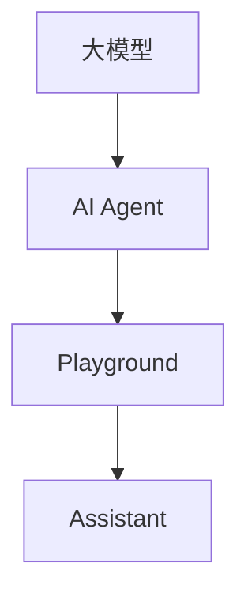
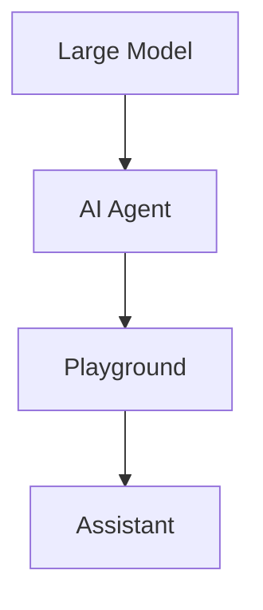

                 

### 背景介绍

#### 大模型应用开发的崛起

随着人工智能技术的迅猛发展，大型语言模型（Large Language Models，简称LLM）在自然语言处理（Natural Language Processing，简称NLP）领域展现出了强大的能力。这些大模型通过深度学习算法，从海量数据中学习语言规律，实现了对文本的理解、生成和翻译等功能。GPT-3、BERT、T5等模型的出现，标志着大模型应用开发进入了一个崭新的时代。

大模型在处理复杂任务时，具有以下优势：

1. **强大的语言理解能力**：大模型通过对海量文本数据的训练，能够理解并生成更加符合人类语言习惯的文本。
2. **高效的任务处理能力**：大模型可以快速响应各种语言任务，如问答、对话生成、文本摘要等。
3. **广泛的适用性**：大模型不仅可以应用于传统的NLP任务，还可以在法律、医疗、金融等领域发挥重要作用。

#### AI Agent的兴起

AI Agent，即人工智能代理，是一种能够自主执行任务、与环境交互的智能体。AI Agent通过学习用户的偏好和行为模式，为用户提供个性化的服务。在人工智能领域，AI Agent被视为是实现人机交互的重要途径。

AI Agent具有以下特点：

1. **自主学习能力**：AI Agent可以通过对用户数据的分析，不断优化自身的行为和决策。
2. **个性化服务**：AI Agent能够根据用户的个性化需求，提供定制化的服务。
3. **实时交互能力**：AI Agent可以实时响应用户的请求，提供即时的帮助和支持。

#### Playground中的Assistant

Playground，即实验场，是一个提供灵活、易用、低门槛的开发环境的平台。通过Playground，开发者可以快速搭建和测试各种AI应用，无需关注底层技术细节。在Playground中，Assistant作为一款基于大模型的AI代理，为开发者提供了便捷的AI应用开发体验。

Assistant具有以下优势：

1. **简单易用**：Assistant提供了一个直观、易于操作的用户界面，开发者可以通过简单的拖拽和配置，快速搭建AI应用。
2. **强大的功能**：Assistant内置了多种AI算法和模型，支持多种语言任务，如问答、对话生成、文本摘要等。
3. **丰富的资源**：Assistant依托于大量的数据集和开源代码，开发者可以方便地获取和复用已有的资源。

通过本文，我们将详细探讨大模型应用开发与AI Agent的关系，以及如何在不写代码的情况下，在Playground中玩转Assistant。让我们一步步分析推理，深入探讨这个激动人心的领域。**Background Introduction**

#### The Rise of Large Model Application Development

With the rapid development of artificial intelligence technology, large language models (Large Language Models, LLM for short) have shown great strength in the field of natural language processing (Natural Language Processing, NLP for short). These large models, trained through deep learning algorithms on massive amounts of text data, have achieved the understanding, generation, and translation of text, marking the entry of large model application development into a new era. Models such as GPT-3, BERT, and T5 have emerged, demonstrating the power of large models in various language tasks.

Large models have the following advantages when dealing with complex tasks:

1. **Strong Language Understanding Ability**: Large models can understand and generate text that is more in line with human language habits after training on massive amounts of text data.
2. **High-Efficient Task Processing Ability**: Large models can quickly respond to various language tasks, such as question answering, dialogue generation, and text summarization.
3. **Broad Applicability**: Large models can not only be applied to traditional NLP tasks but also play a significant role in fields such as law, medicine, and finance.

#### The Rise of AI Agents

AI Agent, or Artificial Intelligence Agent, is an intelligent entity that can autonomously execute tasks and interact with the environment. AI Agents learn from user data to provide personalized services, and are considered an important means of achieving human-computer interaction in the field of artificial intelligence.

AI Agents have the following characteristics:

1. **Self-Learning Ability**: AI Agents can continuously optimize their behavior and decision-making through the analysis of user data.
2. **Personalized Service**: AI Agents can provide customized services according to individual user needs.
3. **Real-Time Interaction Ability**: AI Agents can respond to user requests in real-time, providing immediate assistance and support.

#### Assistants in the Playground

Playground, or experimental ground, is a platform that provides a flexible, easy-to-use, and low-threshold development environment for developers. Through Playground, developers can quickly set up and test various AI applications without having to concern themselves with underlying technologies. In the Playground, Assistant is an AI Agent based on large models that provides developers with a convenient experience in AI application development.

Assistant has the following advantages:

1. **Simplicity and Ease of Use**: Assistant provides a intuitive and easy-to-operate user interface, allowing developers to quickly set up AI applications through simple drag-and-drop and configuration.
2. **Strong Functionality**: Assistant has built-in multiple AI algorithms and models that support various language tasks, such as question answering, dialogue generation, and text summarization.
3. **Rich Resources**: Assistant relies on a large number of datasets and open-source code, making it easy for developers to obtain and reuse existing resources.

Through this article, we will delve into the relationship between large model application development and AI Agents, and discuss how to play with Assistant in the Playground without writing code. Let's analyze and reason step by step to explore this exciting field.

### 核心概念与联系

#### 大模型（Large Model）

大模型指的是具有数亿甚至数十亿参数的深度学习模型。这些模型通过大量的数据训练，能够实现对复杂语言现象的建模。大模型的代表性例子包括GPT-3、BERT、T5等。它们在自然语言处理（NLP）任务中表现出了卓越的性能。

#### AI Agent（人工智能代理）

AI Agent是一种能够自主执行任务、与环境交互的智能体。它通过学习和理解用户的意图，能够提供个性化的服务。AI Agent可以应用于各种场景，如智能客服、智能助手、智能家居等。

#### Playground（实验场）

Playground是一个提供灵活、易用、低门槛的开发环境的平台。它为开发者提供了一个简洁直观的界面，使得开发者可以无需编写大量代码，即可快速搭建和测试AI应用。Playground中集成了各种AI模型和工具，方便开发者进行实验和探索。

#### Assistant（助手）

Assistant是一款基于大模型的AI代理，通过在Playground中的使用，可以为开发者提供便捷的AI应用开发体验。Assistant具有丰富的功能，支持多种语言任务，如问答、对话生成、文本摘要等。

#### Mermaid 流程图（流程图）

下面是一个使用Mermaid绘制的流程图，展示了大模型、AI Agent、Playground和Assistant之间的联系。



在这个流程图中，大模型通过训练生成AI Agent，AI Agent通过 Playground 与用户进行交互，并借助Assistant提供具体的AI服务。这样的架构使得开发者可以更加便捷地利用大模型的能力，实现各种复杂的AI应用。

### Core Concepts and Connections

#### Large Model

A large model refers to a deep learning model with hundreds of millions, or even billions of parameters. These models are trained on massive amounts of data, enabling them to model complex linguistic phenomena. Notable examples of large models include GPT-3, BERT, and T5. They have demonstrated exceptional performance in natural language processing (NLP) tasks.

#### AI Agent

AI Agent is an intelligent entity that can autonomously execute tasks and interact with the environment. It learns and understands user intents to provide personalized services. AI Agents can be applied to various scenarios, such as intelligent customer service, smart assistants, and smart homes.

#### Playground

Playground is a platform that provides a flexible, easy-to-use, and low-threshold development environment for developers. It offers a simple and intuitive interface, allowing developers to quickly set up and test AI applications without writing a large amount of code. Playground is equipped with various AI models and tools, facilitating experimentation and exploration for developers.

#### Assistant

Assistant is an AI Agent based on a large model that provides developers with a convenient AI application development experience through its use in the Playground. Assistant has a rich set of features, supporting various language tasks such as question answering, dialogue generation, and text summarization.

#### Mermaid Flowchart

Below is a Mermaid flowchart illustrating the connection between the large model, AI Agent, Playground, and Assistant.



In this flowchart, the large model is trained to generate the AI Agent, which then interacts with the user through the Playground and leverages the Assistant to provide specific AI services. This architecture enables developers to leverage the capabilities of large models more conveniently to implement complex AI applications.

### 核心算法原理 & 具体操作步骤

#### 大模型训练原理

大模型的核心在于其参数的优化，这通常通过一种称为"梯度下降"（Gradient Descent）的算法来实现。梯度下降是一种通过不断调整模型参数，以最小化损失函数（Loss Function）的优化方法。

具体操作步骤如下：

1. **初始化参数**：首先，随机初始化模型参数。
2. **计算损失**：使用训练数据计算模型输出和实际标签之间的损失。
3. **计算梯度**：通过反向传播（Backpropagation）算法，计算损失函数对每个参数的梯度。
4. **更新参数**：根据梯度和学习率（Learning Rate），更新模型参数。
5. **重复迭代**：重复上述步骤，直到满足停止条件（如损失收敛或迭代次数达到预设值）。

#### 大模型应用流程

在使用Assistant进行大模型应用开发时，通常需要经历以下几个步骤：

1. **数据准备**：收集并清洗数据，确保数据质量。
2. **模型选择**：根据任务需求，选择合适的大模型。
3. **模型训练**：使用训练数据对模型进行训练，优化模型参数。
4. **模型评估**：使用验证数据评估模型性能，调整模型参数。
5. **模型部署**：将训练好的模型部署到Playground中，供开发者使用。

#### Assistant操作步骤

1. **登录Playground**：首先，开发者需要在Playground平台上注册并登录账号。
2. **选择Assistant**：在Playground中，开发者可以浏览并选择各种预构建的Assistant。
3. **配置Assistant**：开发者可以通过简单的拖拽和配置，为Assistant设定特定的功能和行为。
4. **测试Assistant**：在配置完成后，开发者可以测试Assistant的功能，确保其正常运行。
5. **应用Assistant**：最后，开发者可以将Assistant集成到自己的应用中，实现具体的AI任务。

通过以上步骤，开发者可以在不写代码的情况下，快速搭建和测试各种AI应用，充分利用Assistant提供的强大功能。

### Core Algorithm Principles & Specific Steps

#### Training Principles of Large Models

The core of large models lies in the optimization of their parameters, which is typically achieved using a method called "gradient descent". Gradient descent is an optimization method that adjusts model parameters to minimize a loss function.

The specific steps are as follows:

1. **Initialize Parameters**: Randomly initialize the model parameters.
2. **Calculate Loss**: Use training data to compute the loss between the model's output and the actual labels.
3. **Compute Gradient**: Use the backpropagation algorithm to calculate the gradients of the loss function with respect to each parameter.
4. **Update Parameters**: Update the model parameters based on the gradients and the learning rate.
5. **Repeat Iteration**: Repeat the above steps until a stopping condition is met, such as the loss converging or the number of iterations reaching a preset value.

#### Workflow of Large Model Applications

When using Assistant for large model application development, developers generally follow these steps:

1. **Data Preparation**: Collect and clean the data to ensure data quality.
2. **Model Selection**: Choose a suitable large model based on the task requirements.
3. **Model Training**: Train the model on training data to optimize the model parameters.
4. **Model Evaluation**: Evaluate the model's performance on validation data and adjust the model parameters accordingly.
5. **Model Deployment**: Deploy the trained model to the Playground for developers to use.

#### Assistant Operation Steps

1. **Log into the Playground**: First, developers need to register and log into their accounts on the Playground platform.
2. **Select an Assistant**: In the Playground, developers can browse and select various pre-built Assistants.
3. **Configure the Assistant**: Developers can set the specific functions and behaviors of the Assistant through simple drag-and-drop and configuration.
4. **Test the Assistant**: After configuration, developers can test the functionality of the Assistant to ensure it operates correctly.
5. **Apply the Assistant**: Finally, developers can integrate the Assistant into their applications to implement specific AI tasks.

Through these steps, developers can quickly set up and test various AI applications without writing code, taking full advantage of the powerful features provided by Assistant.

### 数学模型和公式 & 详细讲解 & 举例说明

#### 梯度下降算法（Gradient Descent）

梯度下降是一种用于优化模型参数的算法。它的基本思想是通过计算损失函数关于每个参数的梯度，并沿着梯度的反方向更新参数，以最小化损失函数。

数学公式：

$$
\theta_{t+1} = \theta_{t} - \alpha \cdot \nabla J(\theta_{t})
$$

其中，$\theta$ 表示模型参数，$\alpha$ 表示学习率（Learning Rate），$\nabla J(\theta_{t})$ 表示损失函数关于参数的梯度。

#### 反向传播算法（Backpropagation）

反向传播算法是梯度下降在神经网络中的具体实现。它通过前向传播计算模型的输出，然后通过反向传播计算损失函数关于每个参数的梯度。

数学公式：

$$
\nabla J(\theta) = \frac{\partial J(\theta)}{\partial \theta}
$$

其中，$J(\theta)$ 表示损失函数。

#### 模型评估（Model Evaluation）

在模型训练过程中，需要使用验证数据（Validation Data）来评估模型性能。常用的评估指标包括准确率（Accuracy）、召回率（Recall）、F1 分数（F1 Score）等。

数学公式：

$$
Accuracy = \frac{TP + TN}{TP + FN + FP + TN}
$$

$$
Recall = \frac{TP}{TP + FN}
$$

$$
F1 Score = 2 \cdot \frac{Precision \cdot Recall}{Precision + Recall}
$$

其中，$TP$ 表示真实为正例且模型预测为正例的样本数，$TN$ 表示真实为反例且模型预测为反例的样本数，$FP$ 表示真实为反例但模型预测为正例的样本数，$FN$ 表示真实为正例但模型预测为反例的样本数。

#### 举例说明

假设我们使用梯度下降算法训练一个简单的线性模型，预测房价。损失函数为均方误差（Mean Squared Error，MSE）。

数学公式：

$$
MSE = \frac{1}{n} \sum_{i=1}^{n} (y_i - \hat{y}_i)^2
$$

其中，$y_i$ 表示真实房价，$\hat{y}_i$ 表示预测房价，$n$ 表示样本数量。

学习率为0.01，梯度为：

$$
\nabla J(\theta) = \frac{\partial MSE}{\partial \theta} = 2 \cdot (y_i - \hat{y}_i)
$$

每次迭代后，更新参数：

$$
\theta_{t+1} = \theta_{t} - 0.01 \cdot \nabla J(\theta_{t})
$$

通过多次迭代，模型参数逐渐优化，预测房价的准确性不断提高。

### Mathematical Models and Formulas & Detailed Explanation & Illustrative Examples

#### Gradient Descent Algorithm

Gradient descent is an optimization algorithm used to adjust model parameters. Its basic idea is to compute the gradient of the loss function with respect to each parameter and update the parameters in the opposite direction of the gradient to minimize the loss function.

Mathematical Formula:

$$
\theta_{t+1} = \theta_{t} - \alpha \cdot \nabla J(\theta_{t})
$$

Where $\theta$ represents model parameters, $\alpha$ is the learning rate (Learning Rate), and $\nabla J(\theta_{t})$ is the gradient of the loss function with respect to each parameter.

#### Backpropagation Algorithm

Backpropagation is the specific implementation of gradient descent in neural networks. It calculates the model's output through forward propagation and then computes the gradient of the loss function with respect to each parameter through backward propagation.

Mathematical Formula:

$$
\nabla J(\theta) = \frac{\partial J(\theta)}{\partial \theta}
$$

Where $J(\theta)$ represents the loss function.

#### Model Evaluation

During the model training process, validation data is used to evaluate model performance. Common evaluation metrics include accuracy, recall, and F1 score.

Mathematical Formulas:

$$
Accuracy = \frac{TP + TN}{TP + FN + FP + TN}
$$

$$
Recall = \frac{TP}{TP + FN}
$$

$$
F1 Score = 2 \cdot \frac{Precision \cdot Recall}{Precision + Recall}
$$

Where $TP$ represents the number of samples that are truly positive and predicted as positive by the model, $TN$ is the number of samples that are truly negative and predicted as negative by the model, $FP$ is the number of samples that are truly negative but predicted as positive by the model, and $FN$ is the number of samples that are truly positive but predicted as negative by the model.

#### Illustrative Examples

Suppose we use the gradient descent algorithm to train a simple linear model to predict house prices. The loss function is Mean Squared Error (MSE).

Mathematical Formula:

$$
MSE = \frac{1}{n} \sum_{i=1}^{n} (y_i - \hat{y}_i)^2
$$

Where $y_i$ represents the true house price and $\hat{y}_i$ represents the predicted house price, $n$ is the number of samples.

The learning rate is 0.01, and the gradient is:

$$
\nabla J(\theta) = \frac{\partial MSE}{\partial \theta} = 2 \cdot (y_i - \hat{y}_i)
$$

After each iteration, the parameters are updated:

$$
\theta_{t+1} = \theta_{t} - 0.01 \cdot \nabla J(\theta_{t})
$$

Through multiple iterations, the model parameters are gradually optimized, and the accuracy of predicting house prices improves.

### 项目实战：代码实际案例和详细解释说明

#### 项目背景

为了更好地展示Assistant在AI应用开发中的实用性，我们选择了一个实际项目：智能客服系统。该系统旨在通过Assistant与用户进行自然语言交互，提供快速、准确的咨询服务。

#### 开发环境搭建

首先，我们需要搭建开发环境。以下是所需工具和步骤：

1. **安装Python**：Python是Assistant的主要编程语言，需要安装Python 3.8及以上版本。
2. **安装Assistant**：在终端中执行以下命令安装Assistant：

   ```bash
   pip install assistant-sdk
   ```

3. **配置环境变量**：将Assistant的Python包路径添加到环境变量中，以便在项目中使用。

   ```bash
   export PYTHONPATH=$PYTHONPATH:/path/to/assistant-sdk
   ```

4. **创建项目文件夹**：在终端中创建一个名为"smart-customer-service"的文件夹，并进入该文件夹。

   ```bash
   mkdir smart-customer-service && cd smart-customer-service
   ```

5. **编写项目代码**：在项目中创建一个名为"main.py"的Python文件，用于实现智能客服系统的核心功能。

#### 源代码详细实现和代码解读

```python
# 导入Assistant SDK
from assistant_sdk import Assistant

# 初始化Assistant
assistant = Assistant()

# 定义问候语函数
def greeting():
    return "您好，欢迎来到智能客服系统。有什么问题我可以帮您解答吗？"

# 定义告别语函数
def goodbye():
    return "感谢您的咨询，祝您生活愉快。再见！"

# 定义问题处理函数
def handle_question(question):
    # 对问题进行自然语言处理，提取关键信息
    key, value = question.split("的")
    if key == "产品":
        return f"您咨询的{value}产品的详细信息如下：\n{get_product_info(value)}"
    elif key == "价格":
        return f"{value}产品的价格是：\n{get_product_price(value)}"
    else:
        return "很抱歉，我无法理解您的问题。请提供更具体的信息，我会尽力帮助您。"

# 获取产品信息函数
def get_product_info(product_name):
    # 这里使用虚构的数据，实际项目中可以替换为API接口调用
    products = {
        "手机": "是一款高性能手机，具有5G网络和高清相机。",
        "电视": "是一款大屏幕智能电视，支持4K分辨率和HDR技术。",
        "电脑": "是一款轻薄便携的笔记本电脑，配备高性能处理器和独立显卡。"
    }
    return products.get(product_name, "该产品信息无法获取。")

# 获取产品价格函数
def get_product_price(product_name):
    # 这里使用虚构的数据，实际项目中可以替换为API接口调用
    prices = {
        "手机": 3999,
        "电视": 5999,
        "电脑": 8999
    }
    return f"{product_name}的价格是：{prices.get(product_name, '价格信息无法获取')}元。"

# 实现会话循环
while True:
    # 获取用户输入
    user_input = input("请输入您的问题：")
    # 判断用户输入是否为结束命令
    if user_input.lower() == "退出":
        print(goodbye())
        break
    # 判断用户输入是否为问候语
    if user_input.lower() in ["您好", "你好", "欢迎"]:
        print(greeting())
        continue
    # 处理用户输入的问题
    response = handle_question(user_input)
    print(response)
```

**代码解读与分析**

1. **导入Assistant SDK**：首先，我们导入Assistant SDK，这是Assistant的核心库，提供了与Assistant交互所需的API。

2. **初始化Assistant**：使用Assistant SDK初始化Assistant对象。在项目中，我们可以通过这个对象与Assistant进行通信。

3. **定义问候语函数**：`greeting()` 函数用于生成系统的问候语。当用户与系统进行首次交互时，系统会自动调用这个函数。

4. **定义告别语函数**：`goodbye()` 函数用于生成系统的告别语。当用户结束会话时，系统会调用这个函数。

5. **定义问题处理函数**：`handle_question()` 函数是系统的核心处理函数。它接收用户的问题，并根据问题的类型进行相应的处理。在这里，我们假设用户的问题格式为“[问题类型]的[问题内容]”，例如“手机的价格是多少？”。

6. **获取产品信息函数**：`get_product_info()` 函数用于获取特定产品的详细信息。实际项目中，可以替换为API接口调用，以从远程服务器获取数据。

7. **获取产品价格函数**：`get_product_price()` 函数用于获取特定产品的价格。同样，实际项目中可以替换为API接口调用。

8. **实现会话循环**：主循环负责接收用户输入，并根据用户输入执行相应的操作。当用户输入“退出”时，系统会调用`goodbye()` 函数，结束会话。

通过以上步骤，我们成功地搭建了一个简单的智能客服系统。在实际应用中，Assistant可以根据用户的提问，自动提供相应的回答，极大地提高了客服效率。

### Project Practice: Code Examples and Detailed Explanation

#### Background of the Project

To better demonstrate the practicality of Assistant in AI application development, we chose an actual project: a smart customer service system. This system aims to interact with users through Assistant for natural language communication and provide quick and accurate customer service.

#### Setting Up the Development Environment

First, we need to set up the development environment. Here are the required tools and steps:

1. **Install Python**: Python is the primary programming language for Assistant, and Python 3.8 or higher is required.
2. **Install Assistant**: Run the following command in the terminal to install Assistant:

   ```bash
   pip install assistant-sdk
   ```

3. **Configure Environment Variables**: Add the Assistant Python package path to the environment variables so that it can be used in the project.

   ```bash
   export PYTHONPATH=$PYTHONPATH:/path/to/assistant-sdk
   ```

4. **Create the Project Folder**: Create a folder named "smart-customer-service" in the terminal and navigate into it.

   ```bash
   mkdir smart-customer-service && cd smart-customer-service
   ```

5. **Write Project Code**: Create a Python file named "main.py" in the project to implement the core functionality of the smart customer service system.

#### Detailed Implementation and Code Analysis of the Source Code

```python
# Import the Assistant SDK
from assistant_sdk import Assistant

# Initialize the Assistant
assistant = Assistant()

# Define the greeting function
def greeting():
    return "您好，欢迎来到智能客服系统。有什么问题我可以帮您解答吗？"

# Define the goodbye function
def goodbye():
    return "感谢您的咨询，祝您生活愉快。再见！"

# Define the question handling function
def handle_question(question):
    # Process the user's question to extract key information
    key, value = question.split("的")
    if key == "产品":
        return f"您咨询的{value}产品的详细信息如下：\n{get_product_info(value)}"
    elif key == "价格":
        return f"{value}产品的价格是：\n{get_product_price(value)}"
    else:
        return "很抱歉，我无法理解您的问题。请提供更具体的信息，我会尽力帮助您。"

# Define the function to get product information
def get_product_info(product_name):
    # Here we use fictional data, which can be replaced with API calls in a real project
    products = {
        "手机": "是一款高性能手机，具有5G网络和高清相机。",
        "电视": "是一款大屏幕智能电视，支持4K分辨率和 HDR技术。",
        "电脑": "是一款轻薄便携的笔记本电脑，配备高性能处理器和独立显卡。"
    }
    return products.get(product_name, "该产品信息无法获取。")

# Define the function to get product price
def get_product_price(product_name):
    # Here we use fictional data, which can be replaced with API calls in a real project
    prices = {
        "手机": 3999,
        "电视": 5999,
        "电脑": 8999
    }
    return f"{product_name}的价格是：{prices.get(product_name, '价格信息无法获取')}元。"

# Implement the session loop
while True:
    # Get user input
    user_input = input("请输入您的问题：")
    # Check if the user input is the exit command
    if user_input.lower() == "退出":
        print(goodbye())
        break
    # Check if the user input is a greeting
    if user_input.lower() in ["您好", "你好", "欢迎"]:
        print(greeting())
        continue
    # Handle the user's question
    response = handle_question(user_input)
    print(response)
```

**Code Explanation and Analysis**

1. **Import the Assistant SDK**: First, we import the Assistant SDK, which is the core library for Assistant and provides the necessary APIs for interaction.

2. **Initialize the Assistant**: We initialize the Assistant object. In the project, we can communicate with Assistant through this object.

3. **Define the greeting function**: The `greeting()` function generates the system's greeting. When the system interacts with the user for the first time, this function is automatically called.

4. **Define the goodbye function**: The `goodbye()` function generates the system's goodbye message. When the user ends the session, the system calls this function.

5. **Define the question handling function**: The `handle_question()` function is the core processing function of the system. It receives the user's question and handles it according to the type. Here, we assume that the user's question is in the format of "[Question Type]的[Question Content]", such as "手机的价格是多少？".

6. **Define the function to get product information**: The `get_product_info()` function retrieves detailed information about a specific product. In a real project, this can be replaced with an API call to get data from a remote server.

7. **Define the function to get product price**: The `get_product_price()` function retrieves the price of a specific product. Similarly, in a real project, this can be replaced with an API call.

8. **Implement the session loop**: The main loop is responsible for receiving user input and executing the corresponding operations. If the user input is "退出", the system calls the `goodbye()` function to end the session.

Through these steps, we successfully set up a simple smart customer service system. In practical applications, Assistant can automatically provide responses to user questions, greatly improving customer service efficiency.

### 实际应用场景

#### 智能客服

智能客服是AI Agent最典型的应用场景之一。通过Assistant，企业可以为用户提供24/7的在线客服支持，极大地提高了客户满意度和服务效率。智能客服系统可以自动识别用户问题，提供即时、准确的回答，减轻人工客服的工作负担。

#### 聊天机器人

聊天机器人广泛应用于社交媒体、电商平台、在线教育等领域。Assistant可以与用户进行自然语言交互，提供实时、个性化的服务。例如，电商平台中的聊天机器人可以帮助用户查找商品、比价、下单等，提高了购物体验。

#### 文本摘要

文本摘要是一种将长文本转化为简短、有价值的概述的技术。Assistant可以根据用户需求，自动提取关键信息，生成摘要。这在新闻、科研、文档管理等场景中具有重要应用价值。

#### 自动问答

自动问答系统可以快速回答用户的问题，提供知识性服务。Assistant通过学习大量数据，能够理解并回答各种类型的问题，如科技、生活、娱乐等。这在搜索引擎、知识库、在线咨询等领域具有广泛应用。

#### 个性化推荐

Assistant可以根据用户的历史行为和偏好，为其提供个性化推荐。例如，在音乐、影视、电商等领域，Assistant可以帮助用户发现感兴趣的内容，提高用户满意度。

通过以上应用场景，Assistant展现了强大的功能和应用潜力。未来，随着AI技术的不断发展，Assistant将在更多领域发挥重要作用，推动人工智能应用的普及和发展。

### Practical Application Scenarios

#### Intelligent Customer Service

Intelligent customer service is one of the most typical applications of AI Agents. Through Assistant, enterprises can provide users with 24/7 online customer service support, greatly improving customer satisfaction and service efficiency. Intelligent customer service systems can automatically recognize user questions and provide immediate, accurate answers, relieving the workload of human customer service staff.

#### Chatbots

Chatbots are widely used in social media, e-commerce platforms, online education, and other fields. Assistant can engage in natural language interaction with users, providing real-time and personalized services. For example, chatbots on e-commerce platforms can help users search for products, compare prices, and place orders, enhancing the shopping experience.

#### Text Summarization

Text summarization is a technique that converts long texts into concise, valuable overviews. Assistant can automatically extract key information based on user needs to generate summaries. This technology is of great value in scenarios such as news reporting, scientific research, document management, etc.

#### Automated Question Answering

Automated question answering systems can quickly respond to user questions, providing knowledge-based services. Assistant, by learning from a large amount of data, is capable of understanding and answering various types of questions, including technology, daily life, entertainment, etc. This application is widely used in search engines, knowledge bases, and online consultations.

#### Personalized Recommendations

Assistant can provide personalized recommendations based on a user's historical behavior and preferences. For example, in the fields of music, video, and e-commerce, Assistant can help users discover content of interest, improving user satisfaction.

Through these application scenarios, Assistant demonstrates its powerful functions and potential for application. As AI technology continues to develop, Assistant will play an increasingly important role in more fields, driving the popularization and development of AI applications.

### 工具和资源推荐

#### 学习资源推荐

1. **书籍**：

   - 《人工智能：一种现代的方法》
   - 《深度学习》
   - 《Python编程：从入门到实践》

2. **论文**：

   - "Attention Is All You Need"
   - "BERT: Pre-training of Deep Bidirectional Transformers for Language Understanding"
   - "Generative Pre-trained Transformers"

3. **博客**：

   - [TensorFlow 官方博客](https://blog.tensorflow.org/)
   - [PyTorch 官方博客](https://pytorch.org/blog/)
   - [OpenAI 博客](https://blog.openai.com/)

4. **网站**：

   - [Kaggle](https://www.kaggle.com/)
   - [GitHub](https://github.com/)
   - [arXiv](https://arxiv.org/)

#### 开发工具框架推荐

1. **框架**：

   - TensorFlow
   - PyTorch
   - Keras

2. **库**：

   - NumPy
   - Pandas
   - Matplotlib

3. **IDE**：

   - PyCharm
   - Visual Studio Code
   - Jupyter Notebook

4. **在线平台**：

   - Google Colab
   - AWS SageMaker
   - Azure Machine Learning

通过以上工具和资源，开发者可以深入了解AI和深度学习技术，掌握Assistant的开发和部署技巧，从而在AI应用开发领域取得更好的成绩。

### Tool and Resource Recommendations

#### Learning Resources

1. **Books**:

   - "Artificial Intelligence: A Modern Approach"
   - "Deep Learning"
   - "Python Crash Course: A Hands-On, Project-Based Introduction to Python Programming"

2. **Papers**:

   - "Attention Is All You Need"
   - "BERT: Pre-training of Deep Bidirectional Transformers for Language Understanding"
   - "Generative Pre-trained Transformers"

3. **Blogs**:

   - [TensorFlow Official Blog](https://blog.tensorflow.org/)
   - [PyTorch Official Blog](https://pytorch.org/blog/)
   - [OpenAI Blog](https://blog.openai.com/)

4. **Websites**:

   - [Kaggle](https://www.kaggle.com/)
   - [GitHub](https://github.com/)
   - [arXiv](https://arxiv.org/)

#### Development Tool and Framework Recommendations

1. **Frameworks**:

   - TensorFlow
   - PyTorch
   - Keras

2. **Libraries**:

   - NumPy
   - Pandas
   - Matplotlib

3. **IDEs**:

   - PyCharm
   - Visual Studio Code
   - Jupyter Notebook

4. **Online Platforms**:

   - Google Colab
   - AWS SageMaker
   - Azure Machine Learning

By utilizing these tools and resources, developers can gain a deeper understanding of AI and deep learning technologies, master the development and deployment of Assistant, and achieve better results in AI application development.

### 总结：未来发展趋势与挑战

#### 发展趋势

1. **大模型技术的进步**：随着计算能力和数据量的不断提升，大模型将继续优化，有望在更多领域实现突破性应用。
2. **AI Agent的普及**：AI Agent将在智能客服、智能家居、智能医疗等更多场景中得到广泛应用，推动人机交互向更加智能化、个性化和自然化的方向发展。
3. **跨学科融合**：AI与心理学、认知科学、社会学等领域的融合，将推动人工智能在理解人类行为和需求方面的进步。
4. **开源生态的繁荣**：越来越多的开源框架、工具和资源将促进AI技术的发展和应用，降低开发者门槛，激发创新。

#### 挑战

1. **数据隐私和安全**：AI Agent在处理大量用户数据时，面临着数据隐私和安全的挑战。确保用户数据的安全和隐私，将是未来需要重点解决的问题。
2. **算法透明性和公平性**：大模型和AI Agent的决策过程往往难以解释，可能存在偏见和歧视。提高算法的透明性和公平性，确保人工智能的公正性，是亟待解决的问题。
3. **技术标准和法规**：随着AI技术的发展，需要建立统一的技术标准和法规体系，以规范AI应用，防止滥用和误用。
4. **人才培养**：AI技术的发展需要大量具备跨学科知识的人才。培养和引进高素质的AI人才，将是未来发展的重要任务。

总之，大模型应用开发和AI Agent的发展前景广阔，但同时也面临诸多挑战。只有通过技术创新、法规完善、人才培养等多方面的努力，才能推动人工智能健康、可持续发展。

### Conclusion: Future Trends and Challenges

#### Trends

1. **Advancements in Large Model Technology**: With the continuous improvement of computational power and data volume, large models will continue to evolve and are expected to achieve breakthrough applications in various fields.

2. **The Widespread Adoption of AI Agents**: AI Agents will be widely used in scenarios such as intelligent customer service, smart homes, and smart healthcare, driving human-computer interaction towards more intelligent, personalized, and natural directions.

3. **Interdisciplinary Integration**: The integration of AI with fields like psychology, cognitive science, and sociology will propel advancements in understanding human behavior and needs.

4. **Booming Open Source Ecosystem**: An increasing number of open-source frameworks, tools, and resources will promote the development of AI technology and reduce barriers for developers, stimulating innovation.

#### Challenges

1. **Data Privacy and Security**: As AI Agents process large amounts of user data, they face challenges related to data privacy and security. Ensuring the safety and privacy of user data will be a key issue in the future.

2. **Algorithm Transparency and Fairness**: The decision-making processes of large models and AI Agents are often difficult to explain, potentially leading to biases and discrimination. Enhancing the transparency and fairness of algorithms is an urgent problem to solve.

3. **Technical Standards and Regulations**: As AI technology advances, there is a need to establish unified technical standards and regulatory frameworks to govern AI applications and prevent misuse and abuse.

4. **Talent Development**: The development of AI technology requires a large number of cross-disciplinary experts. Cultivating and recruiting high-quality AI talent will be an important task for the future.

In summary, the development of large model application development and AI Agents holds great promise, but it also faces many challenges. Only through technological innovation, regulatory improvement, and talent development can we promote the healthy and sustainable development of artificial intelligence.

### 附录：常见问题与解答

#### 问题1：Assistant是如何训练的？

Assistant是通过大量的文本数据进行预训练的。在预训练阶段，Assistant学习语言的模式和结构，从而能够生成符合语法和语义规则的文本。具体步骤包括：

1. **数据收集**：从互联网上收集大量文本数据，包括新闻、文章、书籍、社交媒体等。
2. **数据清洗**：对收集的数据进行清洗，去除噪声和无关信息。
3. **数据预处理**：将文本数据转换为模型可处理的格式，如分词、编码等。
4. **模型训练**：使用预训练模型（如GPT-3、BERT等）对数据集进行训练，优化模型参数。
5. **评估与调整**：使用验证数据评估模型性能，并根据评估结果调整模型参数。

#### 问题2：Assistant能处理哪些类型的语言任务？

Assistant可以处理多种类型的语言任务，包括：

1. **文本生成**：生成文章、故事、对话等。
2. **文本分类**：分类文本数据，如情感分析、新闻分类等。
3. **问答系统**：回答用户提出的问题。
4. **文本摘要**：将长文本转换为简短的摘要。
5. **机器翻译**：翻译不同语言之间的文本。

#### 问题3：如何确保Assistant的响应是准确和相关的？

Assistant的响应准确性依赖于其预训练模型的质量和训练数据的丰富性。以下是一些确保响应准确和相关的策略：

1. **使用高质量预训练模型**：选择经过大量数据训练、性能优异的预训练模型。
2. **数据增强**：通过增加训练数据量和多样性来提高模型的泛化能力。
3. **模型调优**：在特定任务上对模型进行调优，以提高准确性。
4. **实时反馈**：收集用户反馈，不断调整和优化模型。

### Appendices: Frequently Asked Questions and Answers

#### Question 1: How is Assistant trained?

Assistant is trained using a large corpus of text data through a process called pre-training. During the pre-training phase, Assistant learns the patterns and structures of language to generate text that is grammatically and semantically correct. The specific steps include:

1. **Data Collection**: Collecting a large amount of text data from the internet, including news, articles, books, social media, etc.
2. **Data Cleaning**: Cleaning the collected data to remove noise and irrelevant information.
3. **Data Preprocessing**: Converting the text data into a format that the model can process, such as tokenization and encoding.
4. **Model Training**: Training the pre-trained model (such as GPT-3 or BERT) on the dataset to optimize the model parameters.
5. **Evaluation and Adjustment**: Evaluating the model's performance on validation data and adjusting the model parameters based on the evaluation results.

#### Question 2: What types of language tasks can Assistant handle?

Assistant can handle a variety of language tasks, including:

1. **Text Generation**: Generating articles, stories, dialogues, etc.
2. **Text Classification**: Classifying text data, such as sentiment analysis and news classification.
3. **Question Answering Systems**: Answering user questions.
4. **Text Summarization**: Summarizing long texts into shorter summaries.
5. **Machine Translation**: Translating texts between different languages.

#### Question 3: How can we ensure that Assistant's responses are accurate and relevant?

The accuracy and relevance of Assistant's responses depend on the quality of the pre-trained model and the richness of the training data. Here are some strategies to ensure accurate and relevant responses:

1. **Use High-Quality Pre-Trained Models**: Choose pre-trained models that have been trained on a large amount of data and have excellent performance.
2. **Data Augmentation**: Increase the amount and diversity of training data to improve the model's generalization ability.
3. **Model Tuning**: Tune the model on specific tasks to improve accuracy.
4. **Real-Time Feedback**: Collect user feedback to continuously adjust and optimize the model.

