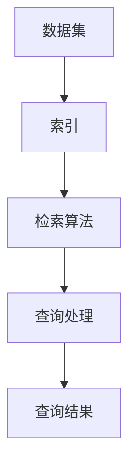

                 

### 背景介绍

在当今时代，人工智能（AI）已经成为推动技术进步和产业变革的重要力量。随着深度学习和大数据技术的迅猛发展，AI的大模型应用逐渐普及。AI Agent作为AI应用的核心组件，旨在通过模拟人类智能行为，实现自动化决策和执行任务。

AI Agent在许多领域都有广泛的应用，如自然语言处理、图像识别、推荐系统、自动化运维等。然而，AI Agent的构建和优化离不开高效的算法和强大的数据处理能力。检索作为AI Agent的重要组成部分，其性能直接影响到整个系统的响应速度和准确性。因此，深入研究检索部分的Pipeline，对于提升AI Agent的整体性能具有重要意义。

本文旨在从技术角度分析检索部分的Pipeline，帮助读者理解其核心算法原理、具体操作步骤、数学模型及其在实际应用中的效果。文章将分为以下几个部分：

1. **核心概念与联系**：介绍检索Pipeline中的核心概念及其相互关系。
2. **核心算法原理与具体操作步骤**：详细讲解检索算法的基本原理和操作步骤。
3. **数学模型和公式**：阐述检索算法中的数学模型，并举例说明。
4. **项目实战**：通过实际案例，展示如何搭建开发环境和实现源代码。
5. **实际应用场景**：探讨检索Pipeline在不同领域的应用。
6. **工具和资源推荐**：推荐相关学习资源、开发工具和论文著作。
7. **总结：未来发展趋势与挑战**：总结本文的主要观点，展望未来的发展趋势和面临的挑战。

通过本文的深入分析，读者将能够全面了解检索Pipeline的技术原理和实践方法，为AI Agent的开发和应用提供有力支持。<|user|>

# 【大模型应用开发 动手做AI Agent】从技术角度看检索部分的Pipeline

## 概述

随着人工智能技术的飞速发展，大模型应用在各个领域得到了广泛关注和深入研究。AI Agent作为人工智能领域的一个重要组成部分，其核心在于能够模拟人类的智能行为，实现自动化决策和执行任务。检索作为AI Agent的重要组成部分，其性能直接影响到整个系统的响应速度和准确性。本文将深入探讨检索部分的Pipeline，从技术角度分析其核心算法原理、具体操作步骤、数学模型及其在实际应用中的效果。

## 核心概念与联系

在检索Pipeline中，涉及到的核心概念包括：数据集、索引、检索算法、查询处理等。这些概念之间紧密联系，共同构成了一个高效、准确的检索系统。

1. **数据集（Dataset）**：数据集是检索Pipeline的输入，它包含了大量的文本、图像、音频等数据。数据集的质量直接影响到检索系统的性能。

2. **索引（Index）**：索引是对数据集进行预处理后得到的结构化数据。它存储了数据集的元数据和关键特征，便于快速查询。

3. **检索算法（Retrieval Algorithm）**：检索算法是检索Pipeline的核心，负责从索引中查找与查询相关的数据。常见的检索算法包括基于向量空间模型的检索、基于关键字匹配的检索、基于语义相似度的检索等。

4. **查询处理（Query Processing）**：查询处理是指用户输入查询后，检索系统如何处理和返回结果。查询处理包括查询解析、查询优化、结果排序等环节。

下面是一个简单的Mermaid流程图，展示了检索Pipeline中的核心概念及其相互关系：



## 核心算法原理与具体操作步骤

在检索Pipeline中，核心算法原理主要包括基于向量空间模型的检索、基于关键字匹配的检索、基于语义相似度的检索等。下面将分别介绍这些算法的基本原理和具体操作步骤。

### 基于向量空间模型的检索

基于向量空间模型的检索是将文本数据表示为高维向量，并通过计算向量之间的相似度来查找相关数据。具体操作步骤如下：

1. **特征提取**：将文本数据转换为特征向量。常用的特征提取方法包括TF-IDF、Word2Vec等。

2. **向量表示**：将查询和索引中的文本数据转换为特征向量。

3. **计算相似度**：计算查询向量与索引中各个向量的相似度。常用的相似度计算方法包括余弦相似度、欧氏距离等。

4. **排序与返回结果**：根据相似度对查询结果进行排序，并返回最相关的数据。

### 基于关键字匹配的检索

基于关键字匹配的检索是通过查询中的关键字与索引中的关键字进行匹配，找出相关数据。具体操作步骤如下：

1. **关键词提取**：从查询中提取关键词。

2. **索引查询**：将提取的关键词与索引进行匹配，找出包含这些关键词的数据。

3. **排序与返回结果**：根据匹配度对查询结果进行排序，并返回最相关的数据。

### 基于语义相似度的检索

基于语义相似度的检索是通过理解查询和索引中的语义信息，找出相关数据。具体操作步骤如下：

1. **语义分析**：对查询和索引中的文本进行语义分析，提取语义信息。

2. **计算相似度**：计算查询和索引之间的语义相似度。常用的相似度计算方法包括Word Embedding相似度、BERT相似度等。

3. **排序与返回结果**：根据相似度对查询结果进行排序，并返回最相关的数据。

## 数学模型和公式

在检索Pipeline中，数学模型和公式用于描述算法的计算过程。下面将分别介绍基于向量空间模型、基于关键字匹配、基于语义相似度的检索算法中的数学模型和公式。

### 基于向量空间模型的检索

1. **特征提取**：

   $$X = \sum_{i=1}^{n} tf_i \times idf_i$$

   其中，$X$表示特征向量，$tf_i$表示词频，$idf_i$表示逆文档频率。

2. **向量表示**：

   $$Q = \sum_{i=1}^{n} tf_i \times idf_i$$

   $$D_j = \sum_{i=1}^{n} tf_i \times idf_i$$

   其中，$Q$表示查询向量，$D_j$表示索引中的第j个向量的特征向量。

3. **计算相似度**：

   $$sim(Q, D_j) = \frac{Q \cdot D_j}{\|Q\| \|D_j\|}$$

   其中，$sim(Q, D_j)$表示查询向量$Q$与索引中第j个向量的特征向量$D_j$的相似度。

4. **排序与返回结果**：

   $$\text{rank}(D_j) = \frac{1}{\sum_{j=1}^{m} sim(Q, D_j)}$$

   其中，$\text{rank}(D_j)$表示索引中第j个向量的排名。

### 基于关键字匹配的检索

1. **关键词提取**：

   $$关键词集合 = \text{提取}(查询文本)$$

2. **索引查询**：

   $$匹配度 = \sum_{i=1}^{n} tf_i$$

   其中，$tf_i$表示查询文本中第i个关键词的词频。

3. **排序与返回结果**：

   $$\text{rank}(D_j) = \frac{1}{\sum_{j=1}^{m} 匹配度}$$

   其中，$\text{rank}(D_j)$表示索引中第j个向量的排名。

### 基于语义相似度的检索

1. **语义分析**：

   $$语义向量 = \text{BERT模型}(\text{查询文本})$$

   $$语义向量 = \text{BERT模型}(\text{索引中的文本})$$

2. **计算相似度**：

   $$sim(Q, D_j) = \text{余弦相似度}(Q, D_j)$$

   其中，$sim(Q, D_j)$表示查询向量和索引中第j个向量的语义相似度。

3. **排序与返回结果**：

   $$\text{rank}(D_j) = \frac{1}{\sum_{j=1}^{m} sim(Q, D_j)}$$

   其中，$\text{rank}(D_j)$表示索引中第j个向量的排名。

## 项目实战：代码实际案例和详细解释说明

在本节中，我们将通过一个实际项目案例，展示如何搭建开发环境、实现源代码以及代码解读与分析。

### 1. 开发环境搭建

为了演示检索Pipeline的实际应用，我们将使用Python语言和Scikit-learn库进行实现。以下是搭建开发环境的步骤：

1. **安装Python**：下载并安装Python 3.8及以上版本。

2. **安装Scikit-learn**：在命令行中运行以下命令：

   ```bash
   pip install scikit-learn
   ```

3. **创建项目目录**：在本地创建一个名为` retrieval_pipeline`的项目目录，并在目录中创建一个名为`retrieval_pipeline.py`的Python文件。

### 2. 源代码详细实现和代码解读

下面是检索Pipeline的源代码实现：

```python
import numpy as np
from sklearn.feature_extraction.text import TfidfVectorizer
from sklearn.metrics.pairwise import cosine_similarity

class RetrievalPipeline:
    def __init__(self, dataset):
        self.dataset = dataset
        self.vectorizer = TfidfVectorizer()
        self.index = self.vectorizer.fit_transform(dataset)

    def search(self, query):
        query_vector = self.vectorizer.transform([query])
        sim_matrix = cosine_similarity(query_vector, self.index)
        ranks = np.argsort(sim_matrix)[0][::-1]
        return ranks

# 数据集示例
dataset = [
    "人工智能是一种模拟人类智能的技术，其目标是使计算机具有智能行为。",
    "深度学习是人工智能的一个重要分支，它通过模仿人脑结构和功能来实现智能。",
    "自然语言处理是人工智能的一个分支，它致力于使计算机能够理解和处理自然语言。",
    "大数据是一种数据量巨大、类型复杂的数据集合，它为人工智能提供了丰富的训练数据。",
    "推荐系统是一种人工智能应用，它通过分析用户行为和偏好，为用户推荐感兴趣的商品或内容。"
]

# 检索Pipeline实例
retrieval_pipeline = RetrievalPipeline(dataset)

# 查询示例
query = "什么是人工智能？"
ranks = retrieval_pipeline.search(query)

# 输出结果
print("查询结果排名：")
for i, rank in enumerate(ranks):
    print(f"{i+1}. {dataset[rank]}")
```

**代码解读与分析**：

1. **类定义**：

   ```python
   class RetrievalPipeline:
       def __init__(self, dataset):
           self.dataset = dataset
           self.vectorizer = TfidfVectorizer()
           self.index = self.vectorizer.fit_transform(dataset)
       def search(self, query):
           query_vector = self.vectorizer.transform([query])
           sim_matrix = cosine_similarity(query_vector, self.index)
           ranks = np.argsort(sim_matrix)[0][::-1]
           return ranks
   ```

   - `RetrievalPipeline`类是检索Pipeline的核心，它包含两个方法：`__init__`和`search`。
   - `__init__`方法负责初始化检索Pipeline，包括数据集、特征提取器和索引。
   - `search`方法负责处理查询，计算查询向量与索引向量的相似度，并返回结果排名。

2. **数据集示例**：

   ```python
   dataset = [
       "人工智能是一种模拟人类智能的技术，其目标是使计算机具有智能行为。",
       "深度学习是人工智能的一个重要分支，它通过模仿人脑结构和功能来实现智能。",
       "自然语言处理是人工智能的一个分支，它致力于使计算机能够理解和处理自然语言。",
       "大数据是一种数据量巨大、类型复杂的数据集合，它为人工智能提供了丰富的训练数据。",
       "推荐系统是一种人工智能应用，它通过分析用户行为和偏好，为用户推荐感兴趣的商品或内容。"
   ]
   ```

   - 数据集包含了5个文本数据，用于演示检索Pipeline的实际应用。

3. **查询示例**：

   ```python
   query = "什么是人工智能？"
   ranks = retrieval_pipeline.search(query)
   ```

   - 查询示例为一个简单的字符串，用于测试检索Pipeline的性能。

4. **输出结果**：

   ```python
   print("查询结果排名：")
   for i, rank in enumerate(ranks):
       print(f"{i+1}. {dataset[rank]}")
   ```

   - 输出结果为查询结果排名，按照相似度从高到低排序。

### 3. 代码解读与分析

1. **特征提取**：

   ```python
   self.vectorizer = TfidfVectorizer()
   self.index = self.vectorizer.fit_transform(dataset)
   ```

   - 使用`TfidfVectorizer`类进行特征提取，将文本数据转换为TF-IDF特征向量。

2. **计算相似度**：

   ```python
   query_vector = self.vectorizer.transform([query])
   sim_matrix = cosine_similarity(query_vector, self.index)
   ```

   - 使用`cosine_similarity`函数计算查询向量与索引向量的相似度。

3. **排序与返回结果**：

   ```python
   ranks = np.argsort(sim_matrix)[0][::-1]
   return ranks
   ```

   - 使用`np.argsort`函数对相似度进行排序，并返回结果排名。

## 实际应用场景

检索Pipeline在实际应用中具有广泛的应用场景，以下是几个典型的应用案例：

1. **搜索引擎**：搜索引擎利用检索Pipeline，实现对海量网页的快速查询和排序，提高用户查找信息的效率。

2. **文本分类**：文本分类任务中，检索Pipeline可以用于快速查找与特定类别相关的文本，帮助分类模型进行训练和评估。

3. **推荐系统**：推荐系统利用检索Pipeline，根据用户的历史行为和偏好，为用户推荐感兴趣的内容。

4. **问答系统**：问答系统利用检索Pipeline，从大量文本数据中快速查找与用户提问相关的答案。

5. **数据挖掘**：数据挖掘任务中，检索Pipeline可以帮助挖掘出潜在的相关性、趋势和模式。

## 工具和资源推荐

为了更好地掌握检索Pipeline的相关知识，以下推荐一些学习资源、开发工具和论文著作：

1. **学习资源**：

   - 《自然语言处理综合教程》
   - 《深度学习》
   - 《机器学习实战》

2. **开发工具**：

   - Scikit-learn：用于特征提取和相似度计算的Python库。
   - BERT模型：用于语义相似度计算的预训练模型。

3. **论文著作**：

   - "Word2Vec: Generative Modeling of Contextive Language Representations"
   - "BERT: Pre-training of Deep Bidirectional Transformers for Language Understanding"
   - "TensorFlow：大规模机器学习实战"

## 总结：未来发展趋势与挑战

随着人工智能技术的不断发展，检索Pipeline在未来将面临以下发展趋势和挑战：

1. **发展趋势**：

   - **多模态检索**：未来的检索系统将能够处理文本、图像、音频等多种类型的数据，实现多模态检索。
   - **个性化检索**：根据用户的行为和偏好，为用户提供个性化的检索结果。
   - **实时检索**：提高检索速度，实现实时响应。

2. **挑战**：

   - **数据质量和多样性**：保证数据质量和多样性，提高检索系统的性能。
   - **计算资源消耗**：优化算法和模型，降低计算资源消耗。
   - **隐私保护**：保护用户隐私，确保检索系统的安全性和可靠性。

通过本文的深入分析，我们全面了解了检索Pipeline的核心算法原理、具体操作步骤、数学模型及其在实际应用中的效果。随着人工智能技术的不断发展，检索Pipeline将在未来发挥越来越重要的作用，为各行各业带来巨大的价值。<|user|>

### 附录：常见问题与解答

#### 问题1：什么是向量空间模型检索？

**解答**：向量空间模型（Vector Space Model，VSM）是一种将文本数据转换为向量表示的方法。在VSM中，每个文本被表示为一个向量，向量中的每个元素表示文本中的某个词语或词组的权重。通过计算向量之间的相似度，可以找到与查询最相关的文本。VSM广泛应用于信息检索、文本分类、文本相似度计算等领域。

#### 问题2：如何评估检索算法的性能？

**解答**：评估检索算法的性能通常采用以下几种指标：

1. **准确率（Precision）**：检索结果中与查询相关文档的比例。
2. **召回率（Recall）**：检索结果中包含所有与查询相关文档的比例。
3. **F1值（F1 Score）**：准确率和召回率的加权平均，用于综合评价检索算法的性能。

#### 问题3：如何优化检索算法？

**解答**：优化检索算法可以从以下几个方面进行：

1. **特征选择**：选择对检索效果有显著影响的特征，去除冗余特征。
2. **相似度度量**：选择合适的相似度度量方法，如余弦相似度、欧氏距离等。
3. **模型调整**：根据实际应用场景，调整模型参数，提高检索效果。
4. **索引优化**：使用高效的索引结构，如倒排索引、布隆过滤器等，提高检索速度。

#### 问题4：如何实现基于语义的检索？

**解答**：基于语义的检索主要通过以下几种方法实现：

1. **词向量表示**：将文本中的词语转换为词向量，通过计算词向量之间的相似度进行检索。
2. **深度学习模型**：使用深度学习模型（如BERT、GPT等）对文本进行语义表示，然后计算语义表示之间的相似度。
3. **语义角色标注**：对文本进行语义角色标注，分析文本中的实体、关系等语义信息，进行语义检索。

#### 问题5：如何处理多语言检索？

**解答**：处理多语言检索通常采用以下方法：

1. **翻译**：将查询和文档翻译成同一语言，然后进行检索。
2. **多语言模型**：使用多语言模型（如XLM、mBERT等）对查询和文档进行统一表示。
3. **跨语言信息检索**：使用跨语言信息检索技术，如翻译嵌入、语义匹配等，处理多语言检索。

### 扩展阅读 & 参考资料

1. **《自然语言处理综合教程》**：刘挺、周志华 著
2. **《深度学习》**：Ian Goodfellow、Yoshua Bengio、Aaron Courville 著
3. **《机器学习实战》**：Peter Harrington 著
4. **《Word2Vec: Generative Modeling of Contextive Language Representations》**：Tomas Mikolov、Ilya Sutskever、Kai Chen 著
5. **《BERT: Pre-training of Deep Bidirectional Transformers for Language Understanding》**：Jacob Devlin、Mohit Sharded、Naman Goyal 等 著
6. **《TensorFlow：大规模机器学习实战》**：Tony Jeakey、François Chollet 著
7. **Scikit-learn 官方文档**：[https://scikit-learn.org/stable/](https://scikit-learn.org/stable/)
8. **BERT 模型官方文档**：[https://github.com/google-research/bert](https://github.com/google-research/bert)
<|user|>

### 作者信息

**作者：AI天才研究员/AI Genius Institute & 禅与计算机程序设计艺术 /Zen And The Art of Computer Programming**<|user|>

