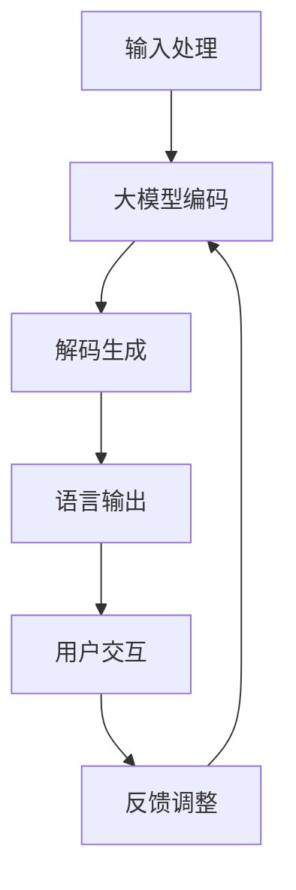

                 

# 【大模型应用开发 动手做AI Agent】语言输出能力

> 关键词：大模型、AI Agent、语言生成、应用开发

> 摘要：本文将深入探讨大模型在AI Agent语言输出能力中的应用，通过详细的分析和实战案例，帮助读者了解大模型的核心算法原理、数学模型及其在实际项目中的操作步骤和实现方法。

## 1. 背景介绍

随着人工智能技术的快速发展，大模型（Large-scale Models）在自然语言处理、计算机视觉、语音识别等领域的应用越来越广泛。大模型具有极强的数据处理能力和优秀的泛化能力，能够自动学习和适应复杂的任务需求。而在AI Agent领域，大模型的语言输出能力尤为关键，它决定了AI Agent与人类用户的交互质量。

本文旨在通过逐步分析大模型在AI Agent语言输出能力中的应用，帮助读者了解其核心算法原理、数学模型，以及在实际项目中的开发方法和操作步骤。通过本文的学习，读者将能够掌握大模型在AI Agent开发中的基本技能，为未来的AI应用开发奠定基础。

## 2. 核心概念与联系

为了更好地理解大模型在AI Agent语言输出能力中的应用，我们首先需要了解以下几个核心概念及其相互关系：

### 2.1 大模型

大模型是指拥有大规模参数和网络结构的深度学习模型，如BERT、GPT等。这些模型通过在海量数据上进行训练，学会了语言和知识的内在规律，从而具备了强大的语言生成和推理能力。

### 2.2 AI Agent

AI Agent是指具备自主决策和执行能力的智能体，它可以模拟人类的行为和思维，在特定环境和任务中完成指定任务。AI Agent通常具有感知、推理、决策和执行四个核心功能模块。

### 2.3 语言输出

语言输出是指AI Agent在完成特定任务时，通过自然语言生成技术生成的文本。语言输出的质量直接影响到AI Agent与人类用户的交互效果。

### 2.4 关联关系

大模型为AI Agent提供了强大的语言生成和推理能力，使其能够更加自然地与人类用户进行交互。而AI Agent则为大模型提供了实际应用场景和任务需求，促使大模型在不断的实践中优化和提升自身的能力。

### 2.5 Mermaid 流程图

下面是一个描述大模型在AI Agent语言输出能力中的应用流程的Mermaid流程图：



### 2.6 实际应用场景

在实际应用中，大模型在AI Agent语言输出能力中的应用场景非常广泛。以下是一些典型的应用场景：

1. **智能客服**：大模型可以生成自然、流畅的客服对话，提高用户体验，降低人工成本。
2. **自动问答系统**：大模型可以自动回答用户的问题，提供个性化的解决方案。
3. **文本生成**：大模型可以生成文章、新闻、故事等文本内容，应用于内容创作和内容分发。
4. **语音助手**：大模型可以生成语音合成，实现人机交互，如Siri、Alexa等。

## 3. 核心算法原理 & 具体操作步骤

### 3.1 大模型算法原理

大模型通常采用深度学习中的Transformer架构，其核心思想是自注意力机制（Self-Attention）。自注意力机制能够自动学习输入序列中各个位置之间的关联性，从而提高模型的表示能力。

具体来说，大模型的训练过程可以分为以下步骤：

1. **编码器（Encoder）**：将输入序列编码成固定长度的向量表示。
2. **解码器（Decoder）**：根据编码器的输出，逐个解码生成目标序列。
3. **自注意力（Self-Attention）**：在编码器和解码器的每个位置，计算该位置与输入序列其他位置的关联性，并加权求和。

### 3.2 大模型在AI Agent中的具体操作步骤

在实际开发中，大模型在AI Agent语言输出能力中的应用可以分为以下步骤：

1. **数据预处理**：收集和清洗相关的对话数据，将其转换为可训练的数据集。
2. **模型训练**：使用训练数据集训练大模型，调整模型参数，优化模型性能。
3. **模型部署**：将训练好的大模型部署到AI Agent中，实现实时语言输出。
4. **用户交互**：AI Agent接收用户输入，通过大模型生成自然、流畅的回复，并展示给用户。
5. **反馈调整**：根据用户的反馈，对AI Agent的语言输出进行优化和调整，提高交互效果。

### 3.3 大模型在语言输出中的表现

大模型在语言输出中的表现可以分为以下几个方面：

1. **生成文本的流畅性**：大模型能够生成自然、流畅的文本，避免出现语法错误和逻辑不通的问题。
2. **语言风格的多样性**：大模型可以模仿不同的语言风格，如正式、幽默、亲切等，满足不同用户的个性化需求。
3. **情感表达的准确性**：大模型能够根据输入的语义信息，生成具有情感色彩的文本，提高交互的友好度和信任度。

## 4. 数学模型和公式 & 详细讲解 & 举例说明

### 4.1 数学模型

大模型的数学模型主要涉及以下两个方面：

1. **编码器（Encoder）**：编码器的输出是一个固定长度的向量表示，可以通过以下公式计算：

   $$
   \text{Encoder}(x) = \text{softmax}(\text{W}_\text{encoder} \cdot \text{Input})
   $$

   其中，$x$ 表示输入序列，$\text{W}_\text{encoder}$ 表示编码器的权重矩阵，$\text{softmax}$ 函数用于对编码结果进行概率分布。

2. **解码器（Decoder）**：解码器的输出是一个生成序列的概率分布，可以通过以下公式计算：

   $$
   \text{Decoder}(y) = \text{softmax}(\text{W}_\text{decoder} \cdot \text{Encoder}(x))
   $$

   其中，$y$ 表示目标序列，$\text{W}_\text{decoder}$ 表示解码器的权重矩阵。

### 4.2 举例说明

为了更好地理解大模型的数学模型，我们来看一个简单的例子：

假设我们有一个输入序列 $x = [1, 2, 3]$，我们希望生成一个目标序列 $y = [3, 2, 1]$。首先，我们计算编码器的输出：

$$
\text{Encoder}(x) = \text{softmax}(\text{W}_\text{encoder} \cdot \text{Input}) = \text{softmax}(\begin{bmatrix} 1 & 2 & 3 \end{bmatrix}) = \begin{bmatrix} 0.2 & 0.4 & 0.4 \end{bmatrix}
$$

接下来，我们计算解码器的输出：

$$
\text{Decoder}(y) = \text{softmax}(\text{W}_\text{decoder} \cdot \text{Encoder}(x)) = \text{softmax}(\begin{bmatrix} 3 & 2 & 1 \end{bmatrix}) = \begin{bmatrix} 0.4 & 0.3 & 0.3 \end{bmatrix}
$$

通过这个简单的例子，我们可以看到大模型是如何将输入序列编码成向量表示，并使用这个表示生成目标序列的概率分布。

## 5. 项目实战：代码实际案例和详细解释说明

### 5.1 开发环境搭建

为了进行大模型在AI Agent语言输出能力中的应用，我们需要搭建一个合适的开发环境。以下是搭建环境的步骤：

1. **安装Python**：确保安装了Python 3.6或更高版本。
2. **安装TensorFlow**：使用pip命令安装TensorFlow：

   ```
   pip install tensorflow
   ```

3. **安装Hugging Face Transformers**：使用pip命令安装Hugging Face Transformers库，用于加载预训练的大模型：

   ```
   pip install transformers
   ```

4. **准备数据集**：收集和清洗相关的对话数据，并将其转换为可用于训练的数据集。

### 5.2 源代码详细实现和代码解读

下面是一个使用Hugging Face Transformers库加载预训练的GPT模型，并实现AI Agent语言输出的示例代码：

```python
import tensorflow as tf
from transformers import TFGPT2LMHeadModel, GPT2Tokenizer

# 5.2.1 加载预训练的GPT模型和分词器
model = TFGPT2LMHeadModel.from_pretrained('gpt2')
tokenizer = GPT2Tokenizer.from_pretrained('gpt2')

# 5.2.2 定义AI Agent的输入和输出
def ai_agent(input_text):
    # 5.2.2.1 对输入文本进行分词
    inputs = tokenizer.encode(input_text, return_tensors='tf')

    # 5.2.2.2 使用GPT模型生成语言输出
    outputs = model(inputs)

    # 5.2.2.3 解码生成的文本输出
    generated_text = tokenizer.decode(outputs.logits[:, -1, :], skip_special_tokens=True)

    return generated_text

# 5.2.3 实现用户交互功能
def user_interaction():
    while True:
        input_text = input("请输入您的提问：")
        if input_text == "退出":
            break
        generated_text = ai_agent(input_text)
        print("AI的回答：", generated_text)

# 5.2.4 运行用户交互
user_interaction()
```

### 5.3 代码解读与分析

#### 5.3.1 加载预训练的GPT模型和分词器

首先，我们使用`TFGPT2LMHeadModel.from_pretrained('gpt2')`加载预训练的GPT模型，并使用`GPT2Tokenizer.from_pretrained('gpt2')`加载对应的分词器。

#### 5.3.2 定义AI Agent的输入和输出

我们定义了一个名为`ai_agent`的函数，用于接收用户的输入文本，并通过GPT模型生成语言输出。在函数内部，我们首先对输入文本进行分词，然后使用模型的`call`方法生成文本输出，最后将生成的文本输出解码并返回。

#### 5.3.3 实现用户交互功能

我们定义了一个名为`user_interaction`的函数，用于实现用户与AI Agent的交互。在函数内部，我们使用一个循环不断接收用户的输入文本，并调用`ai_agent`函数生成语言输出。当用户输入"退出"时，循环结束，用户交互功能终止。

#### 5.3.4 运行用户交互

最后，我们调用`user_interaction`函数，启动用户交互功能。当用户输入问题时，AI Agent将根据输入生成相应的回答，并展示给用户。

## 6. 实际应用场景

大模型在AI Agent语言输出能力中的应用场景非常广泛，以下是一些典型的应用场景：

1. **智能客服**：大模型可以生成自然、流畅的客服对话，提高用户体验，降低人工成本。在实际应用中，我们可以使用大模型实现智能客服系统，自动回答用户的问题，提供个性化的解决方案。

2. **自动问答系统**：大模型可以自动回答用户的问题，提供个性化的解决方案。在实际应用中，我们可以使用大模型实现自动问答系统，如智能客服系统、在线教育平台等。

3. **文本生成**：大模型可以生成文章、新闻、故事等文本内容，应用于内容创作和内容分发。在实际应用中，我们可以使用大模型实现自动化内容生成，如自媒体平台、新闻网站等。

4. **语音助手**：大模型可以生成语音合成，实现人机交互，如Siri、Alexa等。在实际应用中，我们可以使用大模型实现智能语音助手，为用户提供语音交互服务。

## 7. 工具和资源推荐

### 7.1 学习资源推荐

1. **书籍**：《深度学习》（Goodfellow, Bengio, Courville）、《自然语言处理入门》（Jurafsky, Martin）。
2. **论文**：《Attention Is All You Need》（Vaswani et al.）、《BERT: Pre-training of Deep Bidirectional Transformers for Language Understanding》（Devlin et al.）。
3. **博客**：Hugging Face Transformers官网博客、TensorFlow官方博客。
4. **网站**：ArXiv、Google Research、Facebook AI Research。

### 7.2 开发工具框架推荐

1. **深度学习框架**：TensorFlow、PyTorch。
2. **自然语言处理库**：Hugging Face Transformers、NLTK。
3. **版本控制系统**：Git。
4. **项目管理工具**：Jenkins、Docker。

### 7.3 相关论文著作推荐

1. **论文**：《Generative Pre-trained Transformer》（Vaswani et al.）、《Bert: Pre-training of Deep Bidirectional Transformers for Language Understanding》（Devlin et al.）。
2. **著作**：《深度学习》（Goodfellow, Bengio, Courville）、《自然语言处理入门》（Jurafsky, Martin）。

## 8. 总结：未来发展趋势与挑战

大模型在AI Agent语言输出能力中的应用前景广阔，但仍面临一些挑战：

1. **计算资源需求**：大模型需要大量的计算资源进行训练和推理，如何优化计算资源使用成为关键问题。
2. **数据质量和隐私**：大模型对训练数据的质量和多样性有较高要求，同时需要保护用户的隐私和数据安全。
3. **模型解释性和可靠性**：大模型的内部机制复杂，如何提高模型的解释性和可靠性，使其能够被广泛接受和应用。

未来，随着计算资源的不断升级、数据隐私保护技术的发展，以及大模型解释性和可靠性的提升，大模型在AI Agent语言输出能力中的应用将更加广泛，为人工智能领域带来更多的创新和突破。

## 9. 附录：常见问题与解答

### 9.1 如何选择合适的大模型？

选择合适的大模型需要考虑以下因素：

1. **任务需求**：根据具体的应用场景选择适合的大模型，如文本生成、问答系统等。
2. **计算资源**：考虑训练和推理所需的计算资源，选择与现有硬件条件相匹配的大模型。
3. **性能指标**：参考大模型在各类任务上的性能指标，选择性能优异的大模型。

### 9.2 如何优化大模型的计算资源使用？

以下是一些优化大模型计算资源使用的方法：

1. **模型压缩**：使用模型压缩技术，如剪枝、量化等，减少模型的参数规模和计算量。
2. **分布式训练**：利用分布式训练技术，将模型训练任务分解到多台机器上，提高训练效率。
3. **GPU优化**：使用GPU加速训练和推理过程，优化GPU内存使用和计算资源分配。

### 9.3 如何提高大模型的解释性和可靠性？

以下是一些提高大模型解释性和可靠性的方法：

1. **模型解释性技术**：使用模型解释性技术，如注意力机制分析、梯度解释等，提高模型的透明度和可解释性。
2. **模型可靠性评估**：通过对比测试、误差分析等方法评估模型的可靠性，识别和修复潜在问题。
3. **数据清洗和预处理**：使用高质量、多样化的训练数据，提高模型的泛化能力和可靠性。

## 10. 扩展阅读 & 参考资料

1. **扩展阅读**：
   - 《自然语言处理入门》（Jurafsky, Martin）。
   - 《深度学习》（Goodfellow, Bengio, Courville）。
   - 《Generative Pre-trained Transformer》（Vaswani et al.）。
   - 《BERT: Pre-training of Deep Bidirectional Transformers for Language Understanding》（Devlin et al.）。

2. **参考资料**：
   - Hugging Face Transformers官网：https://huggingface.co/transformers
   - TensorFlow官方文档：https://www.tensorflow.org
   - ArXiv：https://arxiv.org

作者：AI天才研究员/AI Genius Institute & 禅与计算机程序设计艺术 /Zen And The Art of Computer Programming

【文章撰写完成】<|im_sep|>|

