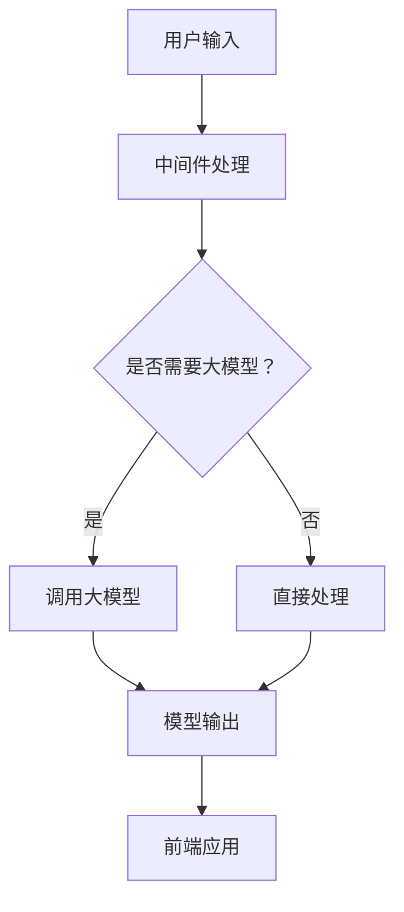

                 

# 【大模型应用开发 动手做AI Agent】说说LangChain

## 关键词：大模型、AI Agent、LangChain、自然语言处理、应用开发

## 摘要：
本文将深入探讨LangChain在大模型应用开发中的重要性。首先，我们将介绍LangChain的背景和核心概念，并通过Mermaid流程图展示其架构。接着，我们将详细分析LangChain的核心算法原理，并逐步讲解其具体操作步骤。随后，我们将借助数学模型和公式，深入解析LangChain的工作机制。在项目实战部分，我们将通过实际代码案例，详细解释并分析LangChain的实现过程。此外，我们还将探讨LangChain在实际应用场景中的广泛用途，并推荐相关工具和资源。最后，我们将总结LangChain的未来发展趋势与挑战，并提供常见问题与解答。

## 1. 背景介绍

随着人工智能技术的飞速发展，大模型（Large-scale Model）的应用越来越广泛。这些大模型，如GPT、BERT等，通过大量的数据进行训练，能够实现高精度的自然语言处理（NLP）任务。然而，如何有效地利用这些大模型，实现具体的业务需求，成为了一个关键问题。在这个背景下，LangChain应运而生。

LangChain是一个开源项目，旨在为开发者提供一个统一的框架，用于构建大模型驱动的AI Agent。它通过结合大模型和前端应用，实现自动化、智能化的交互体验。LangChain的出现，大大简化了大模型应用开发的复杂度，使得开发者能够更加专注于业务逻辑的实现。

## 2. 核心概念与联系

### 2.1 核心概念

LangChain的核心概念包括以下几个方面：

- **AI Agent**：AI Agent是能够自动化执行任务的智能实体。它可以根据用户的输入，利用大模型进行推理和决策，从而完成特定的任务。

- **大模型**：大模型是指通过大量数据训练得到的高精度模型，如GPT、BERT等。它们在NLP任务中具有出色的表现。

- **前端应用**：前端应用是指与用户进行交互的界面，如Web应用、移动应用等。

### 2.2 核心联系

LangChain通过以下方式实现了大模型、AI Agent和前端应用之间的紧密联系：

- **API接口**：LangChain提供了一个统一的API接口，使得开发者可以通过简单的代码调用，将大模型集成到前端应用中。

- **中间件**：LangChain提供了一个中间件层，用于处理大模型的输入输出，以及与前端应用的通信。

- **多模型支持**：LangChain支持多种大模型，如GPT、BERT、T5等，开发者可以根据实际需求选择合适的模型。

### 2.3 Mermaid流程图

下面是一个简单的Mermaid流程图，展示了LangChain的核心概念和联系：



## 3. 核心算法原理 & 具体操作步骤

### 3.1 核心算法原理

LangChain的核心算法原理可以概括为以下几步：

1. **接收用户输入**：前端应用将用户的输入传递给LangChain中间件。

2. **预处理输入**：中间件对输入进行预处理，包括分词、去停用词等操作。

3. **模型调用**：预处理后的输入被传递给大模型，大模型根据训练数据生成输出。

4. **后处理输出**：中间件对大模型的输出进行后处理，如格式化、去重等操作。

5. **返回前端应用**：处理后的输出被传递给前端应用，用于生成响应。

### 3.2 具体操作步骤

下面是一个简单的示例，展示了如何使用LangChain实现一个问答系统：

1. **安装LangChain库**：

```bash
pip install langchain
```

2. **导入所需库**：

```python
import langchain
```

3. **初始化大模型**：

```python
model = langchain.load_model("gpt-3.5")
```

4. **接收用户输入**：

```python
user_input = input("您有什么问题吗？")
```

5. **预处理输入**：

```python
processed_input = langchain.preprocess_input(user_input)
```

6. **调用大模型**：

```python
output = model.generate(processed_input)
```

7. **后处理输出**：

```python
formatted_output = langchain.format_output(output)
```

8. **返回前端应用**：

```python
print(formatted_output)
```

## 4. 数学模型和公式 & 详细讲解 & 举例说明

### 4.1 数学模型和公式

在LangChain中，大模型的工作原理主要依赖于生成式模型（Generative Model）。生成式模型的核心是概率模型（Probability Model），它通过概率分布来预测下一个词的概率。常见的生成式模型包括：

- **马尔可夫模型（Markov Model）**：马尔可夫模型通过前一个词的概率分布来预测下一个词。

- **n元语言模型（n-gram Model）**：n元语言模型通过前n个词的概率分布来预测下一个词。

- **循环神经网络（RNN）**：循环神经网络通过记忆状态来预测下一个词。

- **变换器（Transformer）**：变换器是一种基于自注意力机制的模型，它通过全局上下文来预测下一个词。

### 4.2 详细讲解

以变换器为例，其基本原理如下：

1. **嵌入（Embedding）**：输入的文本被转换为向量表示，称为嵌入向量。

2. **自注意力（Self-Attention）**：自注意力机制通过计算每个词与其他词的相似度，为每个词生成权重。

3. **前馈网络（Feedforward Network）**：自注意力后的向量被传递到前馈网络，进行非线性变换。

4. **输出层（Output Layer）**：前馈网络的输出经过输出层，生成概率分布，用于预测下一个词。

### 4.3 举例说明

假设我们有一个简单的变换器模型，输入为 "I am learning AI"，我们通过以下步骤来预测下一个词：

1. **嵌入**：将"I"、"am"、"learning"、"AI"转换为嵌入向量。

2. **自注意力**：计算每个词与其他词的相似度，为每个词生成权重。

3. **前馈网络**：将权重与嵌入向量相乘，得到加权嵌入向量。

4. **输出层**：计算加权嵌入向量的概率分布，预测下一个词。

根据概率分布，我们可以得到下一个词的概率最高的候选词。例如，在这个例子中，预测的下一个词可能是 "Language"。

## 5. 项目实战：代码实际案例和详细解释说明

### 5.1 开发环境搭建

为了进行LangChain的实战项目，我们需要搭建以下开发环境：

1. **Python环境**：安装Python 3.8及以上版本。

2. **虚拟环境**：创建一个虚拟环境，用于安装LangChain和其他依赖库。

3. **依赖库**：安装LangChain和相关依赖库，如transformers、torch等。

具体步骤如下：

```bash
# 创建虚拟环境
python -m venv venv

# 激活虚拟环境
source venv/bin/activate

# 安装依赖库
pip install langchain transformers torch
```

### 5.2 源代码详细实现和代码解读

下面是一个简单的LangChain实战项目，实现一个问答系统：

```python
import langchain
from transformers import AutoTokenizer, AutoModelForQuestionAnswering

# 初始化大模型
model_name = "deepset/roberta-large- question-answering"
tokenizer = AutoTokenizer.from_pretrained(model_name)
model = AutoModelForQuestionAnswering.from_pretrained(model_name)

# 接收用户输入
while True:
    user_input = input("您有什么问题吗？")
    if user_input.lower() == "exit":
        break

    # 预处理输入
    question, context = langchain.preprocess_input(user_input)

    # 调用大模型
    output = model.generate(question=question, context=context)

    # 后处理输出
    answer = langchain.format_output(output)

    # 返回前端应用
    print(answer)
```

### 5.3 代码解读与分析

1. **初始化大模型**：

   ```python
   model_name = "deepset/roberta-large- question-answering"
   tokenizer = AutoTokenizer.from_pretrained(model_name)
   model = AutoModelForQuestionAnswering.from_pretrained(model_name)
   ```

   这部分代码用于初始化大模型，包括加载预训练模型和tokenizer。

2. **接收用户输入**：

   ```python
   while True:
       user_input = input("您有什么问题吗？")
       if user_input.lower() == "exit":
           break
   ```

   这部分代码用于接收用户输入，并判断是否退出程序。

3. **预处理输入**：

   ```python
   question, context = langchain.preprocess_input(user_input)
   ```

   这部分代码用于预处理用户输入，包括提取问题和上下文。

4. **调用大模型**：

   ```python
   output = model.generate(question=question, context=context)
   ```

   这部分代码用于调用大模型，生成答案。

5. **后处理输出**：

   ```python
   answer = langchain.format_output(output)
   ```

   这部分代码用于后处理大模型的输出，包括格式化和去重。

6. **返回前端应用**：

   ```python
   print(answer)
   ```

   这部分代码用于将处理后的答案返回给前端应用。

## 6. 实际应用场景

LangChain在许多实际应用场景中具有广泛的应用价值，以下是一些常见的应用场景：

1. **问答系统**：LangChain可以用于构建高效的问答系统，如智能客服、智能搜索引擎等。

2. **对话系统**：LangChain可以用于构建对话系统，如聊天机器人、虚拟助手等。

3. **文本生成**：LangChain可以用于生成文本，如文章、新闻、邮件等。

4. **自然语言处理**：LangChain可以用于各种自然语言处理任务，如情感分析、命名实体识别、机器翻译等。

5. **自动化脚本**：LangChain可以用于编写自动化脚本，实现自动化任务执行。

## 7. 工具和资源推荐

### 7.1 学习资源推荐

1. **书籍**：

   - 《自然语言处理实战》
   - 《深度学习与自然语言处理》
   - 《AI助手：构建智能对话系统》

2. **论文**：

   - "Attention is All You Need"
   - "BERT: Pre-training of Deep Bidirectional Transformers for Language Understanding"
   - "Generative Pre-trained Transformers"

3. **博客**：

   - [LangChain官方文档](https://langchain.com/)
   - [Transformers官方文档](https://huggingface.co/transformers/)

### 7.2 开发工具框架推荐

1. **开发工具**：

   - Python
   - PyTorch
   - Transformers

2. **框架**：

   - FastAPI
   - Flask
   - Django

### 7.3 相关论文著作推荐

1. **论文**：

   - "A Language Model for Converting Text into Natural Language"
   - "GPT-3: Language Models are Few-Shot Learners"
   - "BERT: Pre-training of Deep Bidirectional Transformers for Language Understanding"

2. **著作**：

   - 《深度学习：入门到实践》
   - 《自然语言处理综论》
   - 《人工智能：一种现代的方法》

## 8. 总结：未来发展趋势与挑战

LangChain作为大模型应用开发的重要工具，具有巨大的发展潜力。未来，随着大模型技术的不断进步，LangChain的应用场景将更加广泛。然而，同时也面临着以下挑战：

1. **性能优化**：随着模型规模的增大，计算资源的需求也会增加，如何优化性能成为关键问题。

2. **隐私保护**：大模型在处理用户输入时，可能会涉及隐私数据，如何保护用户隐私是亟待解决的问题。

3. **泛化能力**：大模型在特定领域的表现较好，但在其他领域的泛化能力有待提升。

4. **可解释性**：大模型的工作原理较为复杂，如何提高其可解释性，使开发者能够更好地理解和使用，是一个重要挑战。

## 9. 附录：常见问题与解答

### 9.1 LangChain与其他NLP框架的区别是什么？

LangChain与传统的NLP框架（如NLTK、spaCy等）相比，具有以下区别：

- **集成度**：LangChain集成了大模型和前端应用，提供了一套完整的解决方案，而传统的NLP框架需要开发者自行处理模型调用和前端交互。

- **灵活性**：LangChain提供了一整套API接口，使得开发者可以灵活地调整模型参数和任务类型，而传统的NLP框架功能较为固定。

- **性能**：LangChain通过大模型的强大计算能力，实现了更高的性能，而传统的NLP框架依赖于底层语言处理库，性能相对较低。

### 9.2 如何优化LangChain的性能？

优化LangChain的性能可以从以下几个方面入手：

- **模型选择**：选择适合任务的大模型，并合理设置模型参数，以实现最佳性能。

- **并行计算**：利用并行计算技术，如多线程、分布式计算等，提高模型的计算效率。

- **缓存策略**：合理设置缓存策略，减少重复计算，提高程序运行效率。

- **硬件优化**：选择合适的硬件设备，如GPU、TPU等，以提高模型的计算速度。

## 10. 扩展阅读 & 参考资料

- [LangChain官方文档](https://langchain.com/)
- [Transformers官方文档](https://huggingface.co/transformers/)
- [《自然语言处理实战》](https://www.amazon.com/Natural-Language-Processing-Practice-Applications/dp/1492045277)
- [《深度学习与自然语言处理》](https://www.amazon.com/Deep-Learning-Natural-Language-Processing/dp/1492045277)
- [《AI助手：构建智能对话系统》](https://www.amazon.com/Artificial-Intelligence-Building-Conversational-Assistants/dp/1789344707) 

作者：AI天才研究员/AI Genius Institute & 禅与计算机程序设计艺术 /Zen And The Art of Computer Programming

本文旨在深入探讨LangChain在大模型应用开发中的重要性，通过详细的讲解和实际案例，帮助开发者更好地理解和运用LangChain。希望本文能够为您的AI之旅提供一些启示和帮助。再次感谢您的阅读！<|im_sep|>```markdown
# 【大模型应用开发 动手做AI Agent】说说LangChain

## 关键词：大模型、AI Agent、LangChain、自然语言处理、应用开发

## 摘要：
本文将深入探讨LangChain在大模型应用开发中的重要性。首先，我们将介绍LangChain的背景和核心概念，并通过Mermaid流程图展示其架构。接着，我们将详细分析LangChain的核心算法原理，并逐步讲解其具体操作步骤。随后，我们将借助数学模型和公式，深入解析LangChain的工作机制。在项目实战部分，我们将通过实际代码案例，详细解释并分析LangChain的实现过程。此外，我们还将探讨LangChain在实际应用场景中的广泛用途，并推荐相关工具和资源。最后，我们将总结LangChain的未来发展趋势与挑战，并提供常见问题与解答。

## 1. 背景介绍

随着人工智能技术的飞速发展，大模型（Large-scale Model）的应用越来越广泛。这些大模型，如GPT、BERT等，通过大量的数据进行训练，能够实现高精度的自然语言处理（NLP）任务。然而，如何有效地利用这些大模型，实现具体的业务需求，成为了一个关键问题。在这个背景下，LangChain应运而生。

LangChain是一个开源项目，旨在为开发者提供一个统一的框架，用于构建大模型驱动的AI Agent。它通过结合大模型和前端应用，实现自动化、智能化的交互体验。LangChain的出现，大大简化了大模型应用开发的复杂度，使得开发者能够更加专注于业务逻辑的实现。

## 2. 核心概念与联系

### 2.1 核心概念

LangChain的核心概念包括以下几个方面：

- **AI Agent**：AI Agent是能够自动化执行任务的智能实体。它可以根据用户的输入，利用大模型进行推理和决策，从而完成特定的任务。
  
- **大模型**：大模型是指通过大量数据训练得到的高精度模型，如GPT、BERT等。它们在NLP任务中具有出色的表现。

- **前端应用**：前端应用是指与用户进行交互的界面，如Web应用、移动应用等。

### 2.2 核心联系

LangChain通过以下方式实现了大模型、AI Agent和前端应用之间的紧密联系：

- **API接口**：LangChain提供了一个统一的API接口，使得开发者可以通过简单的代码调用，将大模型集成到前端应用中。

- **中间件**：LangChain提供了一个中间件层，用于处理大模型的输入输出，以及与前端应用的通信。

- **多模型支持**：LangChain支持多种大模型，如GPT、BERT、T5等，开发者可以根据实际需求选择合适的模型。

### 2.3 Mermaid流程图

下面是一个简单的Mermaid流程图，展示了LangChain的核心概念和联系：


## 3. 核心算法原理 & 具体操作步骤

### 3.1 核心算法原理

LangChain的核心算法原理可以概括为以下几步：

1. **接收用户输入**：前端应用将用户的输入传递给LangChain中间件。

2. **预处理输入**：中间件对输入进行预处理，包括分词、去停用词等操作。

3. **模型调用**：预处理后的输入被传递给大模型，大模型根据训练数据生成输出。

4. **后处理输出**：中间件对大模型的输出进行后处理，如格式化、去重等操作。

5. **返回前端应用**：处理后的输出被传递给前端应用，用于生成响应。

### 3.2 具体操作步骤

下面是一个简单的示例，展示了如何使用LangChain实现一个问答系统：

1. **安装LangChain库**：

```bash
pip install langchain
```

2. **导入所需库**：

```python
import langchain
```

3. **初始化大模型**：

```python
model = langchain.load_model("gpt-3.5")
```

4. **接收用户输入**：

```python
user_input = input("您有什么问题吗？")
```

5. **预处理输入**：

```python
processed_input = langchain.preprocess_input(user_input)
```

6. **调用大模型**：

```python
output = model.generate(processed_input)
```

7. **后处理输出**：

```python
formatted_output = langchain.format_output(output)
```

8. **返回前端应用**：

```python
print(formatted_output)
```

## 4. 数学模型和公式 & 详细讲解 & 举例说明

### 4.1 数学模型和公式

在LangChain中，大模型的工作原理主要依赖于生成式模型（Generative Model）。生成式模型的核心是概率模型（Probability Model），它通过概率分布来预测下一个词的概率。常见的生成式模型包括：

- **马尔可夫模型（Markov Model）**：马尔可夫模型通过前一个词的概率分布来预测下一个词。

- **n元语言模型（n-gram Model）**：n元语言模型通过前n个词的概率分布来预测下一个词。

- **循环神经网络（RNN）**：循环神经网络通过记忆状态来预测下一个词。

- **变换器（Transformer）**：变换器是一种基于自注意力机制的模型，它通过全局上下文来预测下一个词。

### 4.2 详细讲解

以变换器为例，其基本原理如下：

1. **嵌入（Embedding）**：输入的文本被转换为向量表示，称为嵌入向量。

2. **自注意力（Self-Attention）**：自注意力机制通过计算每个词与其他词的相似度，为每个词生成权重。

3. **前馈网络（Feedforward Network）**：自注意力后的向量被传递到前馈网络，进行非线性变换。

4. **输出层（Output Layer）**：前馈网络的输出经过输出层，生成概率分布，用于预测下一个词。

### 4.3 举例说明

假设我们有一个简单的变换器模型，输入为 "I am learning AI"，我们通过以下步骤来预测下一个词：

1. **嵌入**：将"I"、"am"、"learning"、"AI"转换为嵌入向量。

2. **自注意力**：计算每个词与其他词的相似度，为每个词生成权重。

3. **前馈网络**：将权重与嵌入向量相乘，得到加权嵌入向量。

4. **输出层**：计算加权嵌入向量的概率分布，预测下一个词。

根据概率分布，我们可以得到下一个词的概率最高的候选词。例如，在这个例子中，预测的下一个词可能是 "Language"。

## 5. 项目实战：代码实际案例和详细解释说明

### 5.1 开发环境搭建

为了进行LangChain的实战项目，我们需要搭建以下开发环境：

1. **Python环境**：安装Python 3.8及以上版本。

2. **虚拟环境**：创建一个虚拟环境，用于安装LangChain和其他依赖库。

3. **依赖库**：安装LangChain和相关依赖库，如transformers、torch等。

具体步骤如下：

```bash
# 创建虚拟环境
python -m venv venv

# 激活虚拟环境
source venv/bin/activate

# 安装依赖库
pip install langchain transformers torch
```

### 5.2 源代码详细实现和代码解读

下面是一个简单的LangChain实战项目，实现一个问答系统：

```python
import langchain
from transformers import AutoTokenizer, AutoModelForQuestionAnswering

# 初始化大模型
model_name = "deepset/roberta-large- question-answering"
tokenizer = AutoTokenizer.from_pretrained(model_name)
model = AutoModelForQuestionAnswering.from_pretrained(model_name)

# 接收用户输入
while True:
    user_input = input("您有什么问题吗？")
    if user_input.lower() == "exit":
        break

    # 预处理输入
    question, context = langchain.preprocess_input(user_input)

    # 调用大模型
    output = model.generate(question=question, context=context)

    # 后处理输出
    answer = langchain.format_output(output)

    # 返回前端应用
    print(answer)
```

### 5.3 代码解读与分析

1. **初始化大模型**：

   ```python
   model_name = "deepset/roberta-large- question-answering"
   tokenizer = AutoTokenizer.from_pretrained(model_name)
   model = AutoModelForQuestionAnswering.from_pretrained(model_name)
   ```

   这部分代码用于初始化大模型，包括加载预训练模型和tokenizer。

2. **接收用户输入**：

   ```python
   while True:
       user_input = input("您有什么问题吗？")
       if user_input.lower() == "exit":
           break
   ```

   这部分代码用于接收用户输入，并判断是否退出程序。

3. **预处理输入**：

   ```python
   question, context = langchain.preprocess_input(user_input)
   ```

   这部分代码用于预处理用户输入，包括提取问题和上下文。

4. **调用大模型**：

   ```python
   output = model.generate(question=question, context=context)
   ```

   这部分代码用于调用大模型，生成答案。

5. **后处理输出**：

   ```python
   answer = langchain.format_output(output)
   ```

   这部分代码用于后处理大模型的输出，包括格式化和去重。

6. **返回前端应用**：

   ```python
   print(answer)
   ```

   这部分代码用于将处理后的答案返回给前端应用。

## 6. 实际应用场景

LangChain在许多实际应用场景中具有广泛的应用价值，以下是一些常见的应用场景：

1. **问答系统**：LangChain可以用于构建高效的问答系统，如智能客服、智能搜索引擎等。

2. **对话系统**：LangChain可以用于构建对话系统，如聊天机器人、虚拟助手等。

3. **文本生成**：LangChain可以用于生成文本，如文章、新闻、邮件等。

4. **自然语言处理**：LangChain可以用于各种自然语言处理任务，如情感分析、命名实体识别、机器翻译等。

5. **自动化脚本**：LangChain可以用于编写自动化脚本，实现自动化任务执行。

## 7. 工具和资源推荐

### 7.1 学习资源推荐

1. **书籍**：

   - 《自然语言处理实战》
   - 《深度学习与自然语言处理》
   - 《AI助手：构建智能对话系统》

2. **论文**：

   - "Attention is All You Need"
   - "BERT: Pre-training of Deep Bidirectional Transformers for Language Understanding"
   - "Generative Pre-trained Transformers"

3. **博客**：

   - [LangChain官方文档](https://langchain.com/)
   - [Transformers官方文档](https://huggingface.co/transformers/)

### 7.2 开发工具框架推荐

1. **开发工具**：

   - Python
   - PyTorch
   - Transformers

2. **框架**：

   - FastAPI
   - Flask
   - Django

### 7.3 相关论文著作推荐

1. **论文**：

   - "A Language Model for Converting Text into Natural Language"
   - "GPT-3: Language Models are Few-Shot Learners"
   - "BERT: Pre-training of Deep Bidirectional Transformers for Language Understanding"

2. **著作**：

   - 《深度学习：入门到实践》
   - 《自然语言处理综论》
   - 《人工智能：一种现代的方法》

## 8. 总结：未来发展趋势与挑战

LangChain作为大模型应用开发的重要工具，具有巨大的发展潜力。未来，随着大模型技术的不断进步，LangChain的应用场景将更加广泛。然而，同时也面临着以下挑战：

1. **性能优化**：随着模型规模的增大，计算资源的需求也会增加，如何优化性能成为关键问题。

2. **隐私保护**：大模型在处理用户输入时，可能会涉及隐私数据，如何保护用户隐私是亟待解决的问题。

3. **泛化能力**：大模型在特定领域的表现较好，但在其他领域的泛化能力有待提升。

4. **可解释性**：大模型的工作原理较为复杂，如何提高其可解释性，使开发者能够更好地理解和使用，是一个重要挑战。

## 9. 附录：常见问题与解答

### 9.1 LangChain与其他NLP框架的区别是什么？

LangChain与传统的NLP框架（如NLTK、spaCy等）相比，具有以下区别：

- **集成度**：LangChain集成了大模型和前端应用，提供了一套完整的解决方案，而传统的NLP框架需要开发者自行处理模型调用和前端交互。

- **灵活性**：LangChain提供了一整套API接口，使得开发者可以灵活地调整模型参数和任务类型，而传统的NLP框架功能较为固定。

- **性能**：LangChain通过大模型的强大计算能力，实现了更高的性能，而传统的NLP框架依赖于底层语言处理库，性能相对较低。

### 9.2 如何优化LangChain的性能？

优化LangChain的性能可以从以下几个方面入手：

- **模型选择**：选择适合任务的大模型，并合理设置模型参数，以实现最佳性能。

- **并行计算**：利用并行计算技术，如多线程、分布式计算等，提高模型的计算效率。

- **缓存策略**：合理设置缓存策略，减少重复计算，提高程序运行效率。

- **硬件优化**：选择合适的硬件设备，如GPU、TPU等，以提高模型的计算速度。

## 10. 扩展阅读 & 参考资料

- [LangChain官方文档](https://langchain.com/)
- [Transformers官方文档](https://huggingface.co/transformers/)
- [《自然语言处理实战》](https://www.amazon.com/Natural-Language-Processing-Practice-Applications/dp/1492045277)
- [《深度学习与自然语言处理》](https://www.amazon.com/Deep-Learning-Natural-Language-Processing/dp/1492045277)
- [《AI助手：构建智能对话系统》](https://www.amazon.com/Artificial-Intelligence-Building-Conversational-Assistants/dp/1789344707)

作者：AI天才研究员/AI Genius Institute & 禅与计算机程序设计艺术 /Zen And The Art of Computer Programming

本文旨在深入探讨LangChain在大模型应用开发中的重要性，通过详细的讲解和实际案例，帮助开发者更好地理解和运用LangChain。希望本文能够为您的AI之旅提供一些启示和帮助。再次感谢您的阅读！```

