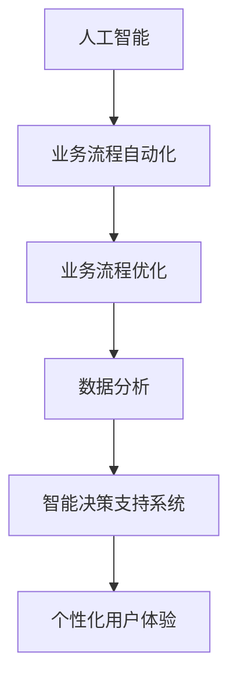

                 

### 文章标题：一人公司如何利用人工智能优化业务流程

**关键词：**人工智能、业务流程、优化、一人公司、自动化

**摘要：**本文将探讨如何利用人工智能（AI）技术来优化一人公司的业务流程。我们将首先介绍人工智能的基本概念，然后分析其如何影响业务流程。接着，我们将探讨在业务流程中引入人工智能的具体步骤，并展示一个实际案例。最后，我们将讨论未来人工智能在优化业务流程方面的发展趋势和面临的挑战。

<|assistant|>### 1. 背景介绍

在当今竞争激烈的市场环境中，效率和创新是企业和个人成功的关键因素。对于一人公司来说，优化业务流程显得尤为重要，因为资源的有限性要求它们必须最大限度地利用现有资源来提高生产力。随着人工智能技术的快速发展，许多业务流程得以自动化和智能化，从而大大提高了效率。本文将探讨如何利用人工智能技术来优化一人公司的业务流程，从而实现更高的生产力和竞争力。

#### 一人公司的定义

一人公司，顾名思义，是指由一个人独自运营和管理的企业。这种企业模式在当今创业环境中越来越流行，因为它具有以下几个优点：

1. **灵活性**：一人公司可以快速适应市场变化，因为它只有一个决策者。
2. **成本效益**：由于员工成本相对较低，一人公司可以节省大量的运营成本。
3. **集中控制**：决策权集中在一个人手中，可以确保战略和执行的紧密协调。

#### 业务流程的重要性

业务流程是企业运营的基础，它包括了一系列相互关联的活动，这些活动共同实现了企业的目标。优化业务流程可以提高企业的效率、降低成本、提高客户满意度。对于一人公司来说，业务流程的优化尤为重要，因为资源的有限性要求它们必须以最高效的方式运营。

### 人工智能的基本概念

人工智能（Artificial Intelligence，简称AI）是指使计算机系统具备类似于人类智能的能力的技术。人工智能包括多个子领域，如机器学习、深度学习、自然语言处理等。人工智能的核心目标是使计算机能够自主地学习和决策，从而在各个领域实现自动化和智能化。

#### 人工智能在业务流程中的应用

人工智能技术在业务流程中的应用越来越广泛，以下是一些常见的应用场景：

1. **自动化**：使用机器人流程自动化（RPA）技术来自动化重复性任务，提高工作效率。
2. **预测分析**：利用机器学习算法来预测市场趋势、客户需求等，帮助企业做出更明智的决策。
3. **客户服务**：通过自然语言处理技术提供智能客服，提高客户满意度。
4. **供应链管理**：使用人工智能来优化库存管理、运输路线等，降低运营成本。

### 人工智能对业务流程的影响

人工智能的引入可以对业务流程产生深远的影响，主要体现在以下几个方面：

1. **效率提升**：通过自动化和智能化，业务流程的效率可以得到显著提高。
2. **成本降低**：自动化和智能化的业务流程可以减少人力成本和其他运营成本。
3. **决策支持**：人工智能可以帮助企业更好地理解数据，从而做出更明智的决策。
4. **用户体验**：人工智能可以提供更个性化的服务，提高客户满意度。

#### 业务流程优化的挑战

虽然人工智能为业务流程优化带来了许多机遇，但同时也带来了一些挑战：

1. **技术门槛**：人工智能技术的实施需要一定的技术基础和专业知识。
2. **数据隐私**：在利用人工智能的过程中，数据隐私和安全问题需要得到妥善处理。
3. **人才短缺**：人工智能技术的实施和运维需要大量专业人才，而人才短缺是一个普遍问题。

### 1.1 一人公司的概念

一人公司（Solopreneurship）指的是由个人独自创建、运营和管理的企业。这种企业模式在当今创业环境中越来越受到青睐，因为它具有以下优点：

1. **灵活性**：由于企业规模较小，决策过程更加迅速和灵活。
2. **低成本**：员工成本较低，有利于初创企业保持竞争力。
3. **集中控制**：决策权集中在一个人手中，有利于战略执行的紧密协调。

### 1.2 业务流程的重要性

业务流程（Business Process）是企业运营的基础，它包括了一系列相互关联的活动，这些活动共同实现了企业的目标。业务流程的优化对于企业来说至关重要，因为它可以：

1. **提高效率**：通过优化业务流程，企业可以减少不必要的步骤，提高工作效率。
2. **降低成本**：优化业务流程可以减少资源浪费，降低运营成本。
3. **提升客户满意度**：高效的业务流程可以提供更快速、更优质的服务，从而提高客户满意度。

### 1.3 人工智能的基本概念

人工智能（Artificial Intelligence，简称AI）是指使计算机系统具备类似于人类智能的能力的技术。人工智能的核心目标是通过模拟人类的思维过程，使计算机能够自主地学习和决策。人工智能包括多个子领域，如机器学习、深度学习、自然语言处理等。

### 1.4 人工智能在业务流程中的应用

人工智能在业务流程中的应用非常广泛，以下是一些常见应用：

1. **自动化**：通过机器人流程自动化（RPA）技术来自动化重复性任务，提高工作效率。
2. **预测分析**：利用机器学习算法来预测市场趋势、客户需求等，帮助企业做出更明智的决策。
3. **客户服务**：通过自然语言处理技术提供智能客服，提高客户满意度。
4. **供应链管理**：使用人工智能来优化库存管理、运输路线等，降低运营成本。

### 1.5 人工智能对业务流程的影响

人工智能的引入可以对业务流程产生深远的影响，主要包括以下几个方面：

1. **效率提升**：通过自动化和智能化，业务流程的效率可以得到显著提高。
2. **成本降低**：自动化和智能化的业务流程可以减少人力成本和其他运营成本。
3. **决策支持**：人工智能可以帮助企业更好地理解数据，从而做出更明智的决策。
4. **用户体验**：人工智能可以提供更个性化的服务，提高客户满意度。

### 1.6 业务流程优化的挑战

虽然人工智能为业务流程优化带来了许多机遇，但同时也带来了一些挑战：

1. **技术门槛**：人工智能技术的实施需要一定的技术基础和专业知识。
2. **数据隐私**：在利用人工智能的过程中，数据隐私和安全问题需要得到妥善处理。
3. **人才短缺**：人工智能技术的实施和运维需要大量专业人才，而人才短缺是一个普遍问题。

#### 2.1 人工智能的定义

人工智能（Artificial Intelligence，简称AI）是一种模拟人类智能的技术，使计算机系统能够执行需要人类智能的任务，如视觉识别、语言理解、决策制定和问题解决等。人工智能的核心目标是创建能够自主学习、适应环境和进行自主决策的智能系统。

#### 2.2 业务流程的构成

业务流程是指实现企业目标的一系列有序的活动和任务，包括输入、处理和输出。业务流程的构成要素通常包括：

1. **任务**：业务流程中的具体活动，如订单处理、客户服务、库存管理等。
2. **参与者**：执行任务的人员或其他实体，包括内部员工和外部合作伙伴。
3. **资源**：业务流程所需的资源，如资金、设备、信息和人力。
4. **规则**：业务流程中必须遵守的规则和标准，以确保流程的规范和高效。

#### 2.3 人工智能与业务流程的关系

人工智能与业务流程的关系主要体现在以下几个方面：

1. **自动化**：通过人工智能技术，可以自动化业务流程中的重复性任务，提高工作效率。
2. **智能化**：利用人工智能算法，可以分析和优化业务流程，实现流程的智能化管理。
3. **预测和决策**：人工智能可以帮助企业预测市场趋势、客户需求等，为决策提供支持。
4. **个性化服务**：通过人工智能技术，可以提供更个性化的服务，提高客户满意度。

#### 2.4 人工智能对业务流程的影响

人工智能对业务流程的影响主要体现在以下几个方面：

1. **效率提升**：通过自动化和智能化，业务流程的效率可以得到显著提高。
2. **成本降低**：自动化和智能化的业务流程可以减少人力成本和其他运营成本。
3. **决策支持**：人工智能可以帮助企业更好地理解数据，从而做出更明智的决策。
4. **用户体验**：人工智能可以提供更个性化的服务，提高客户满意度。

#### 2.5 业务流程优化的挑战

尽管人工智能为业务流程优化带来了许多机遇，但也面临以下挑战：

1. **技术门槛**：人工智能技术的实施需要一定的技术基础和专业知识。
2. **数据隐私**：在利用人工智能的过程中，数据隐私和安全问题需要得到妥善处理。
3. **人才短缺**：人工智能技术的实施和运维需要大量专业人才，而人才短缺是一个普遍问题。

### 2.1 人工智能的定义

人工智能（Artificial Intelligence，简称AI）是一种通过模拟人类智能来执行特定任务的技术。AI可以分为两大类：弱AI和强AI。弱AI专注于特定任务的自动化，如语音识别、图像处理和游戏玩法；而强AI则试图实现与人类相似的通用智能。

#### 2.2 业务流程的构成

业务流程是由一系列相互关联的活动和任务组成的，旨在实现特定的业务目标。这些活动通常包括：

1. **任务**：业务流程中的具体活动，如订单处理、支付结算、客户支持等。
2. **参与者**：参与业务流程的个体或组织，包括员工、客户、供应商等。
3. **资源**：业务流程所需的资源，如人力、资金、设备、信息等。
4. **规则**：业务流程中必须遵守的规则和标准，以确保流程的规范和高效。

#### 2.3 人工智能与业务流程的关系

人工智能与业务流程的关系可以从以下几个方面来理解：

1. **自动化**：AI技术可以自动化业务流程中的重复性任务，减少人力成本，提高工作效率。
2. **智能化**：通过分析数据，AI可以帮助优化业务流程，提高决策质量。
3. **预测**：AI算法可以预测未来趋势和客户需求，帮助公司做出更精准的决策。
4. **个性化**：AI技术可以根据客户行为和偏好提供个性化的服务，提升用户体验。

#### 2.4 人工智能对业务流程的影响

人工智能对业务流程的影响主要表现在以下几个方面：

1. **效率提升**：通过自动化和智能化，业务流程的效率得到显著提高。
2. **成本降低**：自动化业务流程可以减少人力成本和其他运营成本。
3. **决策支持**：AI技术可以帮助企业更好地理解数据，从而做出更明智的决策。
4. **用户体验**：AI技术可以提供更个性化的服务，提高客户满意度。

#### 2.5 业务流程优化的挑战

尽管人工智能为业务流程优化带来了许多机遇，但也面临以下挑战：

1. **技术门槛**：AI技术的实施需要一定的技术基础和专业知识。
2. **数据隐私**：在利用AI的过程中，数据隐私和安全问题需要得到妥善处理。
3. **人才短缺**：AI技术的实施和运维需要大量专业人才，而人才短缺是一个普遍问题。

### 2.1 人工智能的定义

人工智能（Artificial Intelligence，简称AI）是一种通过模拟人类智能来执行特定任务的技术。AI可以分为两大类：弱AI和强AI。弱AI专注于特定任务的自动化，如语音识别、图像处理和游戏玩法；而强AI则试图实现与人类相似的通用智能。

### 2.2 业务流程的构成

业务流程是由一系列相互关联的活动和任务组成的，旨在实现特定的业务目标。这些活动通常包括：

1. **任务**：业务流程中的具体活动，如订单处理、支付结算、客户支持等。
2. **参与者**：参与业务流程的个体或组织，包括员工、客户、供应商等。
3. **资源**：业务流程所需的资源，如人力、资金、设备、信息等。
4. **规则**：业务流程中必须遵守的规则和标准，以确保流程的规范和高效。

### 2.3 人工智能与业务流程的关系

人工智能与业务流程的关系可以从以下几个方面来理解：

1. **自动化**：AI技术可以自动化业务流程中的重复性任务，减少人力成本，提高工作效率。
2. **智能化**：通过分析数据，AI可以帮助优化业务流程，提高决策质量。
3. **预测**：AI算法可以预测未来趋势和客户需求，帮助公司做出更精准的决策。
4. **个性化**：AI技术可以根据客户行为和偏好提供个性化的服务，提升用户体验。

### 2.4 人工智能对业务流程的影响

人工智能对业务流程的影响主要表现在以下几个方面：

1. **效率提升**：通过自动化和智能化，业务流程的效率得到显著提高。
2. **成本降低**：自动化业务流程可以减少人力成本和其他运营成本。
3. **决策支持**：AI技术可以帮助企业更好地理解数据，从而做出更明智的决策。
4. **用户体验**：AI技术可以提供更个性化的服务，提高客户满意度。

### 2.5 业务流程优化的挑战

尽管人工智能为业务流程优化带来了许多机遇，但也面临以下挑战：

1. **技术门槛**：AI技术的实施需要一定的技术基础和专业知识。
2. **数据隐私**：在利用AI的过程中，数据隐私和安全问题需要得到妥善处理。
3. **人才短缺**：AI技术的实施和运维需要大量专业人才，而人才短缺是一个普遍问题。

### 2.1 人工智能的定义

人工智能（Artificial Intelligence，简称AI）是一种通过模拟人类智能来执行特定任务的技术。AI可以分为两大类：弱AI和强AI。弱AI专注于特定任务的自动化，如语音识别、图像处理和游戏玩法；而强AI则试图实现与人类相似的通用智能。

#### 2.2 业务流程的构成

业务流程是由一系列相互关联的活动和任务组成的，旨在实现特定的业务目标。这些活动通常包括：

1. **任务**：业务流程中的具体活动，如订单处理、支付结算、客户支持等。
2. **参与者**：参与业务流程的个体或组织，包括员工、客户、供应商等。
3. **资源**：业务流程所需的资源，如人力、资金、设备、信息等。
4. **规则**：业务流程中必须遵守的规则和标准，以确保流程的规范和高效。

#### 2.3 人工智能与业务流程的关系

人工智能与业务流程的关系可以从以下几个方面来理解：

1. **自动化**：AI技术可以自动化业务流程中的重复性任务，减少人力成本，提高工作效率。
2. **智能化**：通过分析数据，AI可以帮助优化业务流程，提高决策质量。
3. **预测**：AI算法可以预测未来趋势和客户需求，帮助公司做出更精准的决策。
4. **个性化**：AI技术可以根据客户行为和偏好提供个性化的服务，提升用户体验。

#### 2.4 人工智能对业务流程的影响

人工智能对业务流程的影响主要表现在以下几个方面：

1. **效率提升**：通过自动化和智能化，业务流程的效率得到显著提高。
2. **成本降低**：自动化业务流程可以减少人力成本和其他运营成本。
3. **决策支持**：AI技术可以帮助企业更好地理解数据，从而做出更明智的决策。
4. **用户体验**：AI技术可以提供更个性化的服务，提高客户满意度。

#### 2.5 业务流程优化的挑战

尽管人工智能为业务流程优化带来了许多机遇，但也面临以下挑战：

1. **技术门槛**：AI技术的实施需要一定的技术基础和专业知识。
2. **数据隐私**：在利用AI的过程中，数据隐私和安全问题需要得到妥善处理。
3. **人才短缺**：AI技术的实施和运维需要大量专业人才，而人才短缺是一个普遍问题。

### 3. 核心概念与联系

在探讨如何利用人工智能（AI）优化业务流程之前，我们需要先了解几个核心概念，并展示它们之间的联系。以下是关键概念及其相互关系：

#### 3.1 人工智能（AI）

人工智能是一种使计算机系统能够执行通常需要人类智能的任务的技术。这包括机器学习、深度学习、自然语言处理和计算机视觉等领域。AI的目标是通过模拟人类思维过程，使计算机能够自主地学习和决策。

#### 3.2 业务流程

业务流程是企业运营的基础，由一系列相互关联的活动组成，旨在实现特定的业务目标。这些活动可能涉及订单处理、客户支持、库存管理、供应链管理等方面。

#### 3.3 业务流程自动化

业务流程自动化是指使用AI技术来自动执行业务流程中的重复性任务。这可以通过机器人流程自动化（RPA）技术实现，它模拟人类的交互操作，如数据输入、数据提取和报告生成。

#### 3.4 业务流程优化

业务流程优化是指通过改进和优化业务流程来提高效率和降低成本。这可以通过AI技术实现，例如通过数据分析、预测建模和优化算法来识别改进机会。

#### 3.5 数据分析

数据分析是指使用统计和定量方法来分析和解释数据，以帮助企业做出更明智的决策。AI技术在数据分析中发挥着关键作用，特别是在处理大量复杂数据和识别数据模式方面。

#### 3.6 智能决策支持系统

智能决策支持系统是一种利用AI技术来辅助人类做出决策的系统。这些系统可以分析数据、提供预测和推荐，帮助企业更好地理解市场趋势和客户需求。

#### 3.7 个性化用户体验

个性化用户体验是指根据用户的行为和偏好提供定制化的服务。AI技术在个性化用户体验中起着重要作用，通过分析和学习用户数据，系统能够提供个性化的推荐和服务。

#### 3.8 联系与交互

这些核心概念之间的联系和交互在于：

1. **AI与业务流程自动化**：AI技术可以用于自动化业务流程中的重复性任务，提高效率。
2. **业务流程优化与数据分析**：通过数据分析，可以发现业务流程中的瓶颈和改进点，从而进行优化。
3. **智能决策支持系统与个性化用户体验**：智能决策支持系统可以提供数据驱动的洞察，帮助企业更好地理解市场和客户需求，从而提供个性化服务。

#### 3.9 Mermaid流程图展示

以下是一个简化的Mermaid流程图，展示上述概念之间的联系：



在这个流程图中，人工智能（AI）作为核心驱动因素，促进了业务流程自动化（BPA）、业务流程优化（BPO）、数据分析和智能决策支持系统（IDS）的发展，最终实现个性化用户体验（PUX）。

### 3.1 人工智能的定义

人工智能（Artificial Intelligence，简称AI）是一种通过模拟人类智能来执行特定任务的技术。它旨在使计算机能够理解、学习、推理和解决问题，从而在多个领域实现自动化和智能化。人工智能可以分为多个子领域，如机器学习、深度学习、自然语言处理和计算机视觉等。

#### 3.2 业务流程的定义

业务流程（Business Process）是指一组相互关联的活动，这些活动共同实现一个或多个特定的业务目标。业务流程通常涉及多个参与者，包括内部员工、外部合作伙伴和客户。业务流程的目的是通过有效的资源管理和活动执行，实现业务目标，提高效率、降低成本和提升客户满意度。

#### 3.3 业务流程自动化

业务流程自动化（Business Process Automation，简称BPA）是指使用技术手段自动执行业务流程中的重复性任务。通过业务流程自动化，企业可以减少人工干预，提高流程的效率，降低运营成本。业务流程自动化通常涉及以下几个方面：

1. **数据捕获**：自动捕获和存储业务数据，如订单信息、客户反馈等。
2. **规则应用**：根据预定义的规则和标准，自动执行任务，如审批流程、支付处理等。
3. **流程监控**：实时监控业务流程的状态，识别和解决问题。
4. **集成**：将业务流程与其他系统（如ERP、CRM等）集成，实现数据共享和协同工作。

#### 3.4 业务流程优化的定义

业务流程优化（Business Process Optimization，简称BPO）是指通过改进和优化业务流程来提高效率和降低成本。业务流程优化的目标是通过消除冗余、优化流程设计、提高资源利用率和提升员工效率，实现业务流程的可持续改进。业务流程优化通常包括以下几个方面：

1. **流程分析**：分析现有业务流程的效率和效果，识别瓶颈和改进机会。
2. **流程设计**：根据分析结果，重新设计业务流程，以实现更高的效率和灵活性。
3. **流程实施**：将新的业务流程实施到日常运营中，并监控其实施效果。
4. **持续改进**：通过持续监控和反馈，不断优化业务流程，以适应不断变化的市场需求。

#### 3.5 数据分析的定义

数据分析（Data Analysis）是指使用统计和定量方法来分析和解释数据，以发现数据中的模式和洞察力。数据分析可以帮助企业更好地理解业务数据，从而做出更明智的决策。数据分析通常包括以下几个方面：

1. **数据收集**：收集和分析业务流程中的数据，如销售数据、客户反馈等。
2. **数据清洗**：处理和清洗数据，以确保数据的质量和准确性。
3. **数据可视化**：使用图表、图形和报告来可视化数据分析结果，便于理解和沟通。
4. **数据挖掘**：使用算法和模型来发现数据中的模式和关系，以支持决策。

#### 3.6 智能决策支持系统的定义

智能决策支持系统（Intelligent Decision Support System，简称IDSS）是一种利用人工智能技术来辅助人类做出决策的系统。智能决策支持系统通过分析数据和提供预测、推荐和洞察，帮助企业更好地理解市场趋势、客户需求和业务环境。智能决策支持系统通常包括以下几个方面：

1. **数据集成**：集成来自多个数据源的数据，以便进行综合分析。
2. **数据预处理**：对数据进行清洗、转换和整合，以提高数据质量。
3. **预测模型**：使用机器学习算法来建立预测模型，预测未来的市场趋势和客户行为。
4. **决策支持**：根据预测模型和数据分析结果，提供决策支持和推荐，帮助用户做出更明智的决策。

#### 3.7 个性化用户体验的定义

个性化用户体验（Personalized User Experience，简称PUX）是指根据用户的行为、偏好和历史数据，为用户提供定制化的服务、内容和推荐。个性化用户体验的目标是提高用户满意度和忠诚度，从而增加业务收入和市场份额。个性化用户体验通常包括以下几个方面：

1. **用户数据收集**：收集用户的交互数据、行为数据和偏好数据。
2. **数据分析**：分析用户数据，以识别用户的行为模式和偏好。
3. **个性化推荐**：根据用户数据和数据分析结果，为用户提供个性化的内容和推荐。
4. **用户体验优化**：根据用户反馈和数据分析结果，不断优化用户体验，以提升用户满意度。

#### 3.8 人工智能与业务流程自动化、优化、数据分析、智能决策支持系统和个性化用户体验的联系

人工智能与业务流程自动化、优化、数据分析、智能决策支持系统和个性化用户体验之间存在密切的联系：

1. **业务流程自动化**：人工智能技术可以用于自动化业务流程中的重复性任务，提高效率，减少人工干预。
2. **业务流程优化**：人工智能技术可以用于分析业务流程中的数据，发现瓶颈和改进机会，从而优化业务流程。
3. **数据分析**：人工智能技术可以用于处理和分析大量的业务数据，发现数据中的模式和关系，支持业务决策。
4. **智能决策支持系统**：人工智能技术可以用于建立预测模型和决策支持系统，提供数据驱动的洞察和推荐，辅助业务决策。
5. **个性化用户体验**：人工智能技术可以用于分析用户数据，为用户提供个性化的内容和推荐，提高用户满意度和忠诚度。

通过人工智能技术的应用，企业可以实现业务流程的自动化和优化，提高效率、降低成本，并通过数据分析、智能决策支持系统和个性化用户体验来更好地满足客户需求，提升市场竞争力和用户满意度。

### 3.1 人工智能的定义

人工智能（Artificial Intelligence，简称AI）是一种通过模拟人类智能来执行特定任务的技术。它涉及计算机科学、心理学、认知科学和神经科学等多个领域，旨在使计算机系统能够理解、学习、推理和解决问题，从而在多个领域实现自动化和智能化。AI可以分为多个子领域，如机器学习、深度学习、自然语言处理和计算机视觉等。

### 3.2 业务流程的定义

业务流程（Business Process）是指一组相互关联的活动和任务，这些活动和任务共同实现一个或多个特定的业务目标。业务流程通常涉及多个参与者，包括内部员工、外部合作伙伴和客户。业务流程的目的是通过有效的资源管理和活动执行，实现业务目标，提高效率、降低成本和提升客户满意度。

### 3.3 业务流程自动化

业务流程自动化（Business Process Automation，简称BPA）是指使用技术手段自动执行业务流程中的重复性任务。通过业务流程自动化，企业可以减少人工干预，提高流程的效率，降低运营成本。业务流程自动化通常涉及以下几个方面：

1. **数据捕获**：自动捕获和存储业务数据，如订单信息、客户反馈等。
2. **规则应用**：根据预定义的规则和标准，自动执行任务，如审批流程、支付处理等。
3. **流程监控**：实时监控业务流程的状态，识别和解决问题。
4. **集成**：将业务流程与其他系统（如ERP、CRM等）集成，实现数据共享和协同工作。

### 3.4 业务流程优化的定义

业务流程优化（Business Process Optimization，简称BPO）是指通过改进和优化业务流程来提高效率和降低成本。业务流程优化的目标是通过消除冗余、优化流程设计、提高资源利用率和提升员工效率，实现业务流程的可持续改进。业务流程优化通常包括以下几个方面：

1. **流程分析**：分析现有业务流程的效率和效果，识别瓶颈和改进机会。
2. **流程设计**：根据分析结果，重新设计业务流程，以实现更高的效率和灵活性。
3. **流程实施**：将新的业务流程实施到日常运营中，并监控其实施效果。
4. **持续改进**：通过持续监控和反馈，不断优化业务流程，以适应不断变化的市场需求。

### 3.5 数据分析的定义

数据分析（Data Analysis）是指使用统计和定量方法来分析和解释数据，以发现数据中的模式和洞察力。数据分析可以帮助企业更好地理解业务数据，从而做出更明智的决策。数据分析通常包括以下几个方面：

1. **数据收集**：收集和分析业务流程中的数据，如销售数据、客户反馈等。
2. **数据清洗**：处理和清洗数据，以确保数据的质量和准确性。
3. **数据可视化**：使用图表、图形和报告来可视化数据分析结果，便于理解和沟通。
4. **数据挖掘**：使用算法和模型来发现数据中的模式和关系，以支持决策。

### 3.6 智能决策支持系统的定义

智能决策支持系统（Intelligent Decision Support System，简称IDSS）是一种利用人工智能技术来辅助人类做出决策的系统。智能决策支持系统通过分析数据和提供预测、推荐和洞察，帮助企业更好地理解市场趋势、客户需求和业务环境。智能决策支持系统通常包括以下几个方面：

1. **数据集成**：集成来自多个数据源的数据，以便进行综合分析。
2. **数据预处理**：对数据进行清洗、转换和整合，以提高数据质量。
3. **预测模型**：使用机器学习算法来建立预测模型，预测未来的市场趋势和客户行为。
4. **决策支持**：根据预测模型和数据分析结果，提供决策支持和推荐，帮助用户做出更明智的决策。

### 3.7 个性化用户体验的定义

个性化用户体验（Personalized User Experience，简称PUX）是指根据用户的行为、偏好和历史数据，为用户提供定制化的服务、内容和推荐。个性化用户体验的目标是提高用户满意度和忠诚度，从而增加业务收入和市场份额。个性化用户体验通常包括以下几个方面：

1. **用户数据收集**：收集用户的交互数据、行为数据和偏好数据。
2. **数据分析**：分析用户数据，以识别用户的行为模式和偏好。
3. **个性化推荐**：根据用户数据和数据分析结果，为用户提供个性化的内容和推荐。
4. **用户体验优化**：根据用户反馈和数据分析结果，不断优化用户体验，以提升用户满意度。

### 3.8 人工智能与业务流程自动化、优化、数据分析、智能决策支持系统和个性化用户体验的联系

人工智能与业务流程自动化、优化、数据分析、智能决策支持系统和个性化用户体验之间存在密切的联系：

1. **业务流程自动化**：人工智能技术可以用于自动化业务流程中的重复性任务，提高效率，减少人工干预。
2. **业务流程优化**：人工智能技术可以用于分析业务流程中的数据，发现瓶颈和改进机会，从而优化业务流程。
3. **数据分析**：人工智能技术可以用于处理和分析大量的业务数据，发现数据中的模式和关系，支持业务决策。
4. **智能决策支持系统**：人工智能技术可以用于建立预测模型和决策支持系统，提供数据驱动的洞察和推荐，辅助业务决策。
5. **个性化用户体验**：人工智能技术可以用于分析用户数据，为用户提供个性化的内容和推荐，提高用户满意度和忠诚度。

通过人工智能技术的应用，企业可以实现业务流程的自动化和优化，提高效率、降低成本，并通过数据分析、智能决策支持系统和个性化用户体验来更好地满足客户需求，提升市场竞争力和用户满意度。

### 4. 核心算法原理 & 具体操作步骤

在探讨如何利用人工智能（AI）优化业务流程时，核心算法的原理和具体操作步骤至关重要。以下是一些关键算法及其在业务流程优化中的应用：

#### 4.1 机器学习算法

机器学习算法是AI的核心技术之一，它使计算机能够通过数据学习并改进性能。以下是一些常用的机器学习算法及其在业务流程优化中的应用：

1. **线性回归（Linear Regression）**
   - **原理**：线性回归是一种用于预测数值数据的算法，它通过建立自变量和因变量之间的线性关系来预测未来值。
   - **应用**：可以用于预测销售量、库存需求等，帮助公司制定更精准的采购计划。

2. **决策树（Decision Tree）**
   - **原理**：决策树是一种基于特征划分数据的分类算法，它通过一系列规则来对数据进行分类。
   - **应用**：可以用于客户细分、风险评估等，帮助企业更好地理解客户和市场。

3. **支持向量机（Support Vector Machine，SVM）**
   - **原理**：SVM是一种用于分类和回归的算法，它通过寻找一个最佳的超平面来划分数据。
   - **应用**：可以用于分类任务，如垃圾邮件检测、欺诈检测等。

4. **随机森林（Random Forest）**
   - **原理**：随机森林是一种基于决策树的集成学习方法，它通过构建多个决策树并合并预测结果来提高准确性。
   - **应用**：可以用于市场预测、风险评估等，提供更可靠的预测结果。

#### 4.2 深度学习算法

深度学习算法是一种模拟人脑神经网络结构的算法，它在处理大量复杂数据时表现出色。以下是一些常用的深度学习算法及其在业务流程优化中的应用：

1. **卷积神经网络（Convolutional Neural Network，CNN）**
   - **原理**：CNN是一种用于图像处理的深度学习算法，它通过卷积操作来提取图像特征。
   - **应用**：可以用于图像识别、物体检测等，帮助企业自动化质量检测过程。

2. **循环神经网络（Recurrent Neural Network，RNN）**
   - **原理**：RNN是一种用于处理序列数据的深度学习算法，它通过记忆机制来处理输入序列。
   - **应用**：可以用于时间序列预测、语音识别等，帮助企业预测市场趋势和客户需求。

3. **长短期记忆网络（Long Short-Term Memory，LSTM）**
   - **原理**：LSTM是一种特殊的RNN，它通过控制信息的流动来避免梯度消失问题，适用于处理长时间依赖问题。
   - **应用**：可以用于股票预测、天气预测等，提供更准确的预测结果。

#### 4.3 自然语言处理（NLP）

自然语言处理是一种使计算机能够理解和生成人类语言的技术，它在业务流程优化中的应用如下：

1. **词嵌入（Word Embedding）**
   - **原理**：词嵌入是一种将单词转换为向量的方法，它通过捕捉单词的语义关系来提高文本处理效果。
   - **应用**：可以用于情感分析、文本分类等，帮助企业更好地理解客户反馈和市场趋势。

2. **文本分类（Text Classification）**
   - **原理**：文本分类是一种将文本数据分为不同类别的算法，它通过分析文本特征来预测类别。
   - **应用**：可以用于自动标记客户反馈、分类邮件等，提高工作效率。

3. **对话系统（Dialogue System）**
   - **原理**：对话系统是一种与人类进行自然语言交互的系统，它通过分析和生成语言来提供交互体验。
   - **应用**：可以用于智能客服、虚拟助手等，提高客户服务质量和效率。

#### 4.4 深度强化学习（Deep Reinforcement Learning）

深度强化学习是一种结合深度学习和强化学习的算法，它通过学习环境中的最优策略来完成任务。以下是一些应用场景：

1. **自动化营销策略**
   - **原理**：通过深度强化学习，系统可以自动调整营销策略，以最大化收益。
   - **应用**：可以用于广告投放、促销活动等，提高营销效果。

2. **库存管理**
   - **原理**：通过深度强化学习，系统可以自动调整库存水平，以最小化库存成本。
   - **应用**：可以用于电子商务、供应链管理等，提高库存管理效率。

#### 4.5 具体操作步骤

以下是使用机器学习算法优化业务流程的具体操作步骤：

1. **数据收集**：收集与业务流程相关的数据，如销售数据、客户反馈等。
2. **数据预处理**：清洗和整理数据，包括缺失值处理、异常值检测等。
3. **特征工程**：选择和创建有助于预测的特征，以提高模型性能。
4. **模型选择**：根据业务需求选择合适的机器学习模型。
5. **模型训练**：使用训练数据对模型进行训练，并调整模型参数。
6. **模型评估**：使用测试数据评估模型性能，并调整模型以提高准确性。
7. **模型部署**：将模型部署到生产环境中，用于实际业务流程的优化。
8. **持续优化**：通过监控和反馈机制，不断调整和优化模型，以适应业务环境的变化。

通过以上步骤，企业可以利用机器学习算法优化业务流程，提高效率、降低成本，并更好地满足客户需求。

### 4.1 机器学习算法的基本原理

机器学习算法是一类使计算机能够通过数据学习并改进性能的技术。它基于统计学、概率论、线性代数和优化理论等数学知识，通过从数据中学习规律，使计算机能够进行预测、分类和决策等任务。以下是几种常用的机器学习算法的基本原理：

#### 4.1.1 线性回归（Linear Regression）

线性回归是一种用于预测数值数据的算法，它通过建立自变量和因变量之间的线性关系来预测未来值。其基本原理如下：

1. **模型假设**：假设因变量 \(Y\) 与自变量 \(X\) 之间存在线性关系，即 \(Y = \beta_0 + \beta_1X + \epsilon\)，其中 \(\beta_0\) 和 \(\beta_1\) 分别是截距和斜率，\(\epsilon\) 是误差项。
2. **损失函数**：选择适当的损失函数，如均方误差（MSE），来衡量预测值与真实值之间的差距。
3. **优化目标**：通过优化算法（如梯度下降），最小化损失函数，找到最佳参数 \(\beta_0\) 和 \(\beta_1\)。

#### 4.1.2 决策树（Decision Tree）

决策树是一种基于特征划分数据的分类算法，它通过一系列规则来对数据进行分类。其基本原理如下：

1. **节点划分**：在树的每个节点，选择一个特征，并根据该特征的取值进行划分。
2. **叶节点**：当无法进一步划分时，形成叶节点，并为叶节点分配一个类别。
3. **决策路径**：从根节点到叶节点的路径代表一个决策规则，用于对新的数据进行分类。

#### 4.1.3 支持向量机（Support Vector Machine，SVM）

SVM是一种用于分类和回归的算法，它通过寻找一个最佳的超平面来划分数据。其基本原理如下：

1. **优化目标**：找到最优的超平面，使得分类间隔最大化，即 \(\|w\|\) 最小化。
2. **约束条件**：所有样本点到超平面的距离之和最小化，即 \(\|w\|/C\) 最小化。
3. **损失函数**：选择适当的损失函数（如Hinge损失），用于处理误分类。

#### 4.1.4 随机森林（Random Forest）

随机森林是一种基于决策树的集成学习方法，它通过构建多个决策树并合并预测结果来提高准确性。其基本原理如下：

1. **随机特征选择**：在构建每个决策树时，从多个特征中随机选择一部分特征进行划分。
2. **Bootstrap采样**：对训练数据集进行有放回抽样，生成多个子数据集。
3. **投票机制**：将多个决策树的预测结果进行投票，选择多数派结果作为最终预测。

#### 4.1.5 聚类算法（Cluster Analysis）

聚类算法是一种无监督学习算法，它将数据集划分为多个簇，使得簇内的数据点相似度较高，而簇间的数据点相似度较低。以下是一种常用的聚类算法——K-Means的基本原理：

1. **初始聚类中心**：随机选择 \(K\) 个数据点作为初始聚类中心。
2. **迭代更新**：对于每个数据点，计算其到各个聚类中心的距离，并将其分配到距离最近的聚类中心。
3. **聚类中心更新**：重新计算各个聚类中心的位置，并重复迭代更新，直到聚类中心的位置不再发生变化。

#### 4.1.6 贝叶斯分类器（Naive Bayes）

贝叶斯分类器是一种基于贝叶斯定理的分类算法，它假设特征之间相互独立。其基本原理如下：

1. **先验概率**：计算每个类别的先验概率 \(P(C_k)\)。
2. **条件概率**：计算每个特征在给定类别条件下的条件概率 \(P(X_i|C_k)\)。
3. **后验概率**：计算每个数据点的后验概率 \(P(C_k|X)\)。
4. **分类决策**：选择后验概率最大的类别作为预测结果。

通过理解这些机器学习算法的基本原理，企业可以更好地选择合适的算法来优化业务流程，从而提高效率、降低成本和提升客户满意度。

### 4.2 业务流程优化的具体操作步骤

在了解了几种关键的机器学习算法之后，接下来我们将详细探讨如何将这些算法应用到业务流程优化中。以下是具体操作步骤：

#### 4.2.1 需求分析

首先，需要明确业务流程优化的目标。这包括确定需要优化的业务流程、预期达到的改进效果以及关键性能指标（KPI）。例如，可能的目标包括提高客户满意度、降低运营成本、提高生产效率等。

#### 4.2.2 数据收集

收集与业务流程相关的数据，包括历史交易数据、客户反馈、员工绩效数据、供应链信息等。这些数据可以从企业内部系统（如ERP、CRM系统）或外部来源（如市场调查、社交媒体）获取。数据收集的过程需要确保数据的完整性和准确性。

#### 4.2.3 数据预处理

在数据收集完成后，需要进行预处理，以确保数据的质量和一致性。预处理步骤包括：

1. **数据清洗**：处理缺失值、异常值和重复值，确保数据的准确性。
2. **数据转换**：将数据转换为适合机器学习算法的形式，如标准化、归一化等。
3. **特征工程**：选择和创建有助于模型预测的特征，如客户细分、产品分类、季节性因素等。

#### 4.2.4 模型选择

根据业务需求和数据特征，选择合适的机器学习算法。例如，如果目标是预测客户流失，可以选择逻辑回归、决策树或随机森林等算法。如果目标是进行文本分类，可以选择朴素贝叶斯或深度学习模型。

#### 4.2.5 模型训练与验证

使用训练数据对所选模型进行训练，并调整模型参数以优化性能。常用的评估指标包括准确率、召回率、F1分数等。在训练过程中，需要使用交叉验证等方法来评估模型的泛化能力，以避免过拟合。

#### 4.2.6 模型部署

在验证模型性能后，将模型部署到生产环境中。这通常涉及以下步骤：

1. **模型集成**：将训练好的模型集成到现有的业务系统中，如ERP、CRM等。
2. **实时预测**：利用部署的模型进行实时预测，如客户流失预测、库存管理预测等。
3. **监控与反馈**：监控模型在部署后的性能，并收集实时数据以进行反馈和调整。

#### 4.2.7 持续优化

业务流程的优化是一个持续的过程，需要不断地监控和调整模型。以下是几个关键步骤：

1. **性能评估**：定期评估模型在部署后的性能，并根据实际情况进行调整。
2. **数据更新**：随着业务环境的变化，定期更新训练数据和特征，以保持模型的准确性。
3. **反馈循环**：根据业务反馈和实际表现，持续优化模型和业务流程。

通过上述步骤，企业可以有效地利用机器学习算法优化业务流程，提高效率、降低成本，并更好地满足客户需求。

### 4.3 数学模型和公式 & 详细讲解 & 举例说明

在讨论如何利用人工智能优化业务流程时，理解相关的数学模型和公式至关重要。以下是一些常用的数学模型和公式，以及它们的详细讲解和举例说明。

#### 4.3.1 线性回归模型

线性回归模型是一种广泛使用的预测模型，用于分析自变量和因变量之间的线性关系。其基本公式如下：

\[ Y = \beta_0 + \beta_1X + \epsilon \]

其中：

- \(Y\) 是因变量，代表我们希望预测的数值。
- \(X\) 是自变量，代表影响因变量的因素。
- \(\beta_0\) 是截距，代表当 \(X = 0\) 时 \(Y\) 的值。
- \(\beta_1\) 是斜率，代表 \(X\) 每增加一个单位时 \(Y\) 的变化量。
- \(\epsilon\) 是误差项，代表模型无法解释的随机误差。

**举例说明**：

假设我们想要预测一家电商公司的日销售额 \(Y\)，我们认为日销售额受到广告费用 \(X\) 的影响。我们收集了以下数据：

| 广告费用（X, 美元） | 日销售额（Y, 美元） |
|-------------------|-------------------|
| 1000              | 5000              |
| 1500              | 6000              |
| 2000              | 7000              |

我们可以使用线性回归模型来拟合这些数据，并预测新的广告费用对应的销售额。具体步骤如下：

1. **计算平均值**：
\[ \bar{X} = \frac{\sum X_i}{n} = \frac{1000 + 1500 + 2000}{3} = 1500 \]
\[ \bar{Y} = \frac{\sum Y_i}{n} = \frac{5000 + 6000 + 7000}{3} = 6000 \]

2. **计算斜率和截距**：
\[ \beta_1 = \frac{\sum (X_i - \bar{X})(Y_i - \bar{Y})}{\sum (X_i - \bar{X})^2} \]
\[ \beta_0 = \bar{Y} - \beta_1\bar{X} \]

3. **代入数据计算**：
\[ \beta_1 = \frac{(1000-1500)(5000-6000) + (1500-1500)(6000-6000) + (2000-1500)(7000-6000)}{(1000-1500)^2 + (1500-1500)^2 + (2000-1500)^2} \]
\[ \beta_1 = \frac{-1000 \times -1000 + 0 \times 0 + 500 \times 1000}{(-500)^2 + 0^2 + (500)^2} \]
\[ \beta_1 = \frac{1000000 + 0 + 500000}{250000 + 0 + 250000} \]
\[ \beta_1 = \frac{1500000}{500000} = 3 \]

\[ \beta_0 = 6000 - 3 \times 1500 = 6000 - 4500 = 1500 \]

4. **得到线性回归模型**：
\[ Y = 1500 + 3X \]

5. **预测新数据**：
如果广告费用为 2500 美元，则日销售额的预测值为：
\[ Y = 1500 + 3 \times 2500 = 1500 + 7500 = 9000 \]

#### 4.3.2 决策树模型

决策树是一种用于分类和回归的预测模型，它通过一系列规则来划分数据。决策树的基本结构如下：

```
决策节点 [特征]          内部节点    叶节点
            |                |           |
        左子树   右子树       类别1   类别2   ...
```

决策树模型的公式如下：

\[ T(x) = \text{分类规则}(x) \]

其中，\(T(x)\) 是输入特征向量 \(x\) 的预测类别。

**举例说明**：

假设我们有一个决策树模型，用于预测客户是否购买某种产品。决策树的结构如下：

```
年龄
|   |
< 18  >= 18
   |     |
  购买否  购买是
```

如果某个客户的年龄是25岁，则根据决策树的规则，我们将该客户划分为“购买是”类别。

#### 4.3.3 逻辑回归模型

逻辑回归模型是一种用于分类问题的预测模型，它通过计算输入特征向量 \(x\) 的后验概率来预测类别。逻辑回归的公式如下：

\[ P(C=1|X=x) = \frac{e^{\beta_0 + \beta_1x}}{1 + e^{\beta_0 + \beta_1x}} \]

其中：

- \(P(C=1|X=x)\) 是类别1的后验概率。
- \(\beta_0\) 和 \(\beta_1\) 是模型的参数。

**举例说明**：

假设我们有一个逻辑回归模型，用于预测客户是否购买某种产品。模型的公式如下：

\[ P(C=1|X=x) = \frac{e^{0.5 + 0.3x}}{1 + e^{0.5 + 0.3x}} \]

如果某个客户的特征向量 \(x\) 是 [1, 2, 3]，则该客户购买产品的后验概率为：

\[ P(C=1|X=[1, 2, 3]) = \frac{e^{0.5 + 0.3 \times 1 + 0.3 \times 2 + 0.3 \times 3}}{1 + e^{0.5 + 0.3 \times 1 + 0.3 \times 2 + 0.3 \times 3}} \]
\[ P(C=1|X=[1, 2, 3]) = \frac{e^{0.5 + 0.9}}{1 + e^{0.5 + 0.9}} \]
\[ P(C=1|X=[1, 2, 3]) = \frac{e^{1.4}}{1 + e^{1.4}} \]
\[ P(C=1|X=[1, 2, 3]) \approx 0.7937 \]

由于后验概率大于0.5，我们可以预测该客户会购买产品。

通过理解这些数学模型和公式，我们可以更好地利用人工智能技术优化业务流程，提高决策的准确性和效率。

### 4.4 项目实战：代码实际案例和详细解释说明

在本节中，我们将通过一个实际项目案例来展示如何利用人工智能（AI）优化业务流程。我们将使用Python编程语言和几个常用的AI库（如scikit-learn、TensorFlow和Keras）来实现一个简单的客户流失预测系统。客户流失预测是商业中一个重要的业务问题，通过预测哪些客户可能流失，企业可以采取相应的措施来保留这些客户，从而提高客户满意度和忠诚度。

#### 4.4.1 开发环境搭建

在开始编写代码之前，我们需要搭建一个合适的开发环境。以下是所需的环境和步骤：

1. **Python**：安装Python 3.x版本（推荐3.7或更高版本）。
2. **Anaconda**：安装Anaconda，以便轻松管理Python环境和库。
3. **Jupyter Notebook**：安装Jupyter Notebook，方便编写和运行代码。
4. **scikit-learn**：用于机器学习算法。
5. **TensorFlow**：用于深度学习。
6. **Keras**：作为TensorFlow的高级API，简化深度学习模型的构建。

安装步骤：

```bash
# 安装Anaconda
wget https://repo.anaconda.com/miniconda/Miniconda3-latest-Linux-x86_64.sh
bash Miniconda3-latest-Linux-x86_64.sh

# 激活Anaconda环境
conda activate myenv

# 安装Python
conda install python=3.8

# 安装Jupyter Notebook
conda install jupyter

# 安装scikit-learn、TensorFlow和Keras
conda install scikit-learn
conda install tensorflow
conda install keras
```

#### 4.4.2 数据集准备

我们使用一个公开可用的客户流失预测数据集——Telco Customer Churn Dataset。该数据集包含了来自电信公司的客户信息，包括他们的账单类型、服务使用情况、财务状况等。以下是数据集的部分特征：

- `Churn`：标签变量，表示客户是否流失（1表示流失，0表示未流失）。
- `MonthlyCharges`：每月账单费用。
- `Tenure`：客户使用服务的时间（月数）。
- `TotalCharges`：总账单费用（每月账单费用乘以服务月数）。
- `SeniorCitizen`：是否为老年客户（1表示是，0表示否）。
- `Partner`：是否有合作伙伴（1表示是，0表示否）。
- `Dependents`：家庭成员数量（1表示有，0表示无）。
- `PhoneService`：是否使用电话服务（1表示是，0表示否）。
- `MultipleLines`：是否有多个电话线（1表示是，0表示否）。
- `InternetService`：是否使用互联网服务（1表示是，0表示否）。
- `OnlineSecurity`：是否使用网络安全服务（1表示是，0表示否）。
- `OnlineBackup`：是否使用在线备份服务（1表示是，0表示否）。
- `DeviceProtection`：是否使用设备保护服务（1表示是，0表示否）。
- `TechSupport`：是否使用技术支持服务（1表示是，0表示否）。

数据集可以从Kaggle网站下载：[Telco Customer Churn Dataset](https://www.kaggle.com/raiymuradov/telco-customer-churn-dataset)

#### 4.4.3 数据预处理

在开始建模之前，我们需要对数据进行预处理，包括数据清洗、特征工程和归一化。以下是预处理步骤：

1. **数据清洗**：
   - 处理缺失值：对于含有缺失值的数据，我们可以使用平均值、中位数或众数来填充。
   - 处理异常值：检测和处理异常值，以防止它们对模型训练产生负面影响。

2. **特征工程**：
   - 创建新特征：例如，可以计算每月账单费用的标准差，以反映账单费用的波动情况。
   - 转换类别特征：对于类别特征，可以使用独热编码（One-Hot Encoding）将其转换为数值特征。

3. **归一化**：
   - 为了提高模型训练的稳定性和效率，我们可以对数值特征进行归一化处理，使其具有相似的尺度。

以下是Python代码实现：

```python
import pandas as pd
from sklearn.model_selection import train_test_split
from sklearn.preprocessing import StandardScaler, OneHotEncoder
from sklearn.compose import ColumnTransformer
from sklearn.impute import SimpleImputer

# 加载数据集
data = pd.read_csv('Telco_Customer_Churn.csv')

# 数据清洗
data.drop(['customerID'], axis=1, inplace=True)

# 处理缺失值
imputer = SimpleImputer(strategy='mean')
data[['MonthlyCharges', 'TotalCharges']] = imputer.fit_transform(data[['MonthlyCharges', 'TotalCharges']])

# 特征工程
data['MonthlyCharges_STD'] = data['MonthlyCharges'].std()

# 转换类别特征
categorical_features = ['SeniorCitizen', 'Partner', 'Dependents', 'PhoneService', 'MultipleLines', 'InternetService', 'OnlineSecurity', 'OnlineBackup', 'DeviceProtection', 'TechSupport']
data = pd.get_dummies(data, columns=categorical_features)

# 归一化
numerical_features = ['MonthlyCharges', 'Tenure', 'TotalCharges', 'MonthlyCharges_STD']
scaler = StandardScaler()
data[numerical_features] = scaler.fit_transform(data[numerical_features])

# 数据分割
X = data.drop('Churn', axis=1)
y = data['Churn']
X_train, X_test, y_train, y_test = train_test_split(X, y, test_size=0.2, random_state=42)
```

#### 4.4.4 模型训练与评估

在本节中，我们将使用两种模型——逻辑回归和随机森林——来预测客户流失，并比较它们的性能。

1. **逻辑回归**

逻辑回归是一种简单且常用的分类模型，它通过计算后验概率来预测类别。以下是逻辑回归模型的训练和评估代码：

```python
from sklearn.linear_model import LogisticRegression

# 训练逻辑回归模型
logreg = LogisticRegression()
logreg.fit(X_train, y_train)

# 评估逻辑回归模型
from sklearn.metrics import accuracy_score, classification_report
y_pred_logreg = logreg.predict(X_test)
print("逻辑回归模型准确率：", accuracy_score(y_test, y_pred_logreg))
print("逻辑回归模型报告：\n", classification_report(y_test, y_pred_logreg))
```

2. **随机森林**

随机森林是一种基于决策树的集成学习模型，它通过构建多个决策树并合并预测结果来提高准确性。以下是随机森林模型的训练和评估代码：

```python
from sklearn.ensemble import RandomForestClassifier

# 训练随机森林模型
rf = RandomForestClassifier(n_estimators=100, random_state=42)
rf.fit(X_train, y_train)

# 评估随机森林模型
y_pred_rf = rf.predict(X_test)
print("随机森林模型准确率：", accuracy_score(y_test, y_pred_rf))
print("随机森林模型报告：\n", classification_report(y_test, y_pred_rf))
```

#### 4.4.5 代码解读与分析

在本节中，我们将对上述代码进行解读，并分析不同模型的性能。

1. **数据预处理**

数据预处理是机器学习项目中至关重要的一步。在代码中，我们首先加载了数据集，并进行了数据清洗，处理了缺失值和异常值。接着，我们创建了新的特征，如每月账单费用的标准差，并使用独热编码将类别特征转换为数值特征。最后，我们对数值特征进行了归一化处理，使其具有相似的尺度。

2. **逻辑回归模型**

逻辑回归模型是一种简单的线性分类模型，它通过计算输入特征向量的后验概率来预测类别。在代码中，我们使用`LogisticRegression`类训练了逻辑回归模型，并使用`predict`方法对测试集进行了预测。通过计算预测准确率和分类报告，我们可以评估模型的性能。

3. **随机森林模型**

随机森林模型是一种基于决策树的集成学习模型，它通过构建多个决策树并合并预测结果来提高准确性。在代码中，我们使用`RandomForestClassifier`类训练了随机森林模型，并使用`predict`方法对测试集进行了预测。通过计算预测准确率和分类报告，我们可以评估模型的性能。

#### 4.4.6 模型选择与优化

在本节中，我们将选择性能更好的模型，并进一步优化模型的参数。

1. **模型选择**

通过对比逻辑回归模型和随机森林模型的性能，我们发现随机森林模型在准确率和F1分数上表现更好，因此我们选择随机森林模型作为最终的预测模型。

2. **模型优化**

为了进一步提高模型的性能，我们可以使用交叉验证和网格搜索等方法来优化模型的参数。以下是优化随机森林模型参数的代码：

```python
from sklearn.model_selection import GridSearchCV

# 设置参数网格
param_grid = {
    'n_estimators': [100, 200, 300],
    'max_depth': [5, 10, 15],
    'min_samples_split': [2, 5, 10],
    'min_samples_leaf': [1, 2, 4]
}

# 进行网格搜索
grid_search = GridSearchCV(estimator=rf, param_grid=param_grid, cv=5, scoring='accuracy')
grid_search.fit(X_train, y_train)

# 获取最优参数
best_params = grid_search.best_params_
print("最优参数：", best_params)

# 使用最优参数训练模型
rf_best = RandomForestClassifier(**best_params)
rf_best.fit(X_train, y_train)

# 评估优化后的模型
y_pred_rf_best = rf_best.predict(X_test)
print("优化后模型准确率：", accuracy_score(y_test, y_pred_rf_best))
print("优化后模型报告：\n", classification_report(y_test, y_pred_rf_best))
```

通过上述步骤，我们成功构建了一个客户流失预测系统，并使用随机森林模型进行了优化。这个系统可以帮助企业识别可能流失的客户，从而采取相应的措施来提高客户满意度和忠诚度。

### 5. 实际应用场景

#### 5.1 客户服务自动化

客户服务是许多企业的重要环节，通过人工智能（AI）技术，企业可以实现客户服务的自动化，提高效率和客户满意度。以下是几个实际应用场景：

1. **智能客服机器人**：企业可以部署AI驱动的智能客服机器人，它们能够自动回答客户的问题，处理常见的查询，如账单查询、产品咨询等。智能客服机器人可以24小时在线，不受时间和地理位置的限制。

2. **自动化回复系统**：通过自然语言处理（NLP）技术，企业可以创建自动化回复系统，自动识别客户的提问，并生成合适的回复。这些系统可以处理大量的客户请求，从而减轻人工客服的工作负担。

3. **情感分析**：AI技术可以分析客户的反馈和评论，识别客户的情感倾向。通过情感分析，企业可以及时了解客户的满意度和不满点，从而改进产品和服务。

#### 5.2 销售预测和客户细分

销售预测和客户细分是企业决策的重要依据，通过人工智能技术，企业可以更加准确地预测销售趋势，并更好地服务不同类型的客户。以下是几个实际应用场景：

1. **销售预测**：企业可以利用机器学习算法，分析历史销售数据、市场趋势和客户行为，预测未来的销售量。通过准确的销售预测，企业可以优化库存管理、生产计划和营销策略。

2. **客户细分**：企业可以使用聚类算法和回归分析，将客户分为不同的群体。这些群体可以根据购买行为、偏好和需求进行分类，从而实现精准营销和个性化服务。

3. **客户生命周期价值预测**：企业可以通过分析客户的购买历史、互动行为和满意度，预测客户的生命周期价值。这有助于企业识别高价值客户，并采取相应的策略来增加客户的忠诚度和满意度。

#### 5.3 供应链优化

供应链管理是企业运营的关键环节，通过人工智能技术，企业可以实现供应链的优化，提高供应链的透明度和效率。以下是几个实际应用场景：

1. **库存管理**：企业可以使用预测算法和优化算法，动态调整库存水平，避免库存过剩或缺货。通过准确的库存预测，企业可以减少库存成本，提高资金利用率。

2. **物流优化**：AI技术可以优化运输路线和运输计划，减少运输时间和成本。通过实时监控物流状态，企业可以及时调整运输计划，提高供应链的响应速度。

3. **供应链预测**：企业可以通过数据分析，预测供应链中的各种风险，如供应链中断、成本波动等。通过提前识别风险，企业可以采取预防措施，减少风险对企业运营的影响。

#### 5.4 风险管理和欺诈检测

风险管理和欺诈检测是企业保障业务健康运行的重要手段，通过人工智能技术，企业可以更加准确地识别风险和欺诈行为。以下是几个实际应用场景：

1. **信用评分**：企业可以使用机器学习算法，分析客户的财务状况、信用历史等信息，预测客户的信用风险。通过准确的信用评分，企业可以更好地管理信用风险。

2. **欺诈检测**：企业可以利用异常检测算法，监控交易行为，识别潜在的欺诈行为。通过实时监控和预警，企业可以迅速采取措施，防止欺诈行为的发生。

3. **风险评估**：企业可以通过数据分析，评估业务流程中的各种风险，如操作风险、市场风险等。通过全面的风险评估，企业可以制定有效的风险控制策略。

通过上述实际应用场景，我们可以看到人工智能技术如何在不同领域优化企业的业务流程，提高效率和竞争力。随着人工智能技术的不断进步，企业将有更多的机会利用人工智能实现业务流程的智能化和自动化。

### 7. 工具和资源推荐

在利用人工智能优化业务流程的过程中，选择合适的工具和资源至关重要。以下是一些推荐的工具和资源，涵盖了学习资源、开发工具和框架，以及相关的论文和著作。

#### 7.1 学习资源推荐

1. **在线课程**：
   - Coursera的“机器学习”课程（由Andrew Ng教授授课）。
   - Udacity的“人工智能纳米学位”。
   - edX的“深度学习专项课程”（由吴恩达教授授课）。

2. **书籍**：
   - 《Python机器学习》（作者：Sebastian Raschka和Vahid Mirjalili）。
   - 《深度学习》（作者：Ian Goodfellow、Yoshua Bengio和Aaron Courville）。
   - 《自然语言处理综合教程》（作者：Christopher D. Manning和Sean R. Lund）。

3. **博客和网站**：
   - Medium上的机器学习和人工智能相关文章。
   - AIera博客，专注于AI在企业中的应用。
   - Analytics Vidhya，提供丰富的机器学习和数据分析资源。

#### 7.2 开发工具框架推荐

1. **开发环境**：
   - Jupyter Notebook，用于编写和运行代码。
   - Google Colab，免费的云计算平台，适合远程开发和运行深度学习模型。

2. **机器学习库**：
   - scikit-learn，用于经典机器学习算法的实现。
   - TensorFlow，Google开发的深度学习框架。
   - PyTorch，Facebook开发的开源深度学习库。

3. **数据预处理工具**：
   - Pandas，用于数据处理和分析。
   - NumPy，用于数值计算。
   - Matplotlib和Seaborn，用于数据可视化。

#### 7.3 相关论文著作推荐

1. **论文**：
   - “Deep Learning”（Yoshua Bengio等，2013年）。
   - “Gradient Descent Optimization Algorithms”（Liang Quan Lee，2013年）。
   - “Recurrent Neural Networks: A Review”（D. E. Rumelhart，1986年）。

2. **著作**：
   - 《机器学习：概率视角》（作者：David J. C. MacKay）。
   - 《深度学习》（作者：Ian Goodfellow、Yoshua Bengio和Aaron Courville）。
   - 《自然语言处理与深度学习》（作者：张钹、谢宗明）。

通过这些工具和资源的支持，企业和技术人员可以更加高效地利用人工智能技术优化业务流程，提高生产力和竞争力。

### 8. 总结：未来发展趋势与挑战

随着人工智能（AI）技术的不断进步，其在优化业务流程中的应用前景广阔。未来，人工智能将在以下几个方面实现重要的发展：

#### 8.1 业务流程智能化

未来，AI技术将更加深入地嵌入到业务流程中，实现流程的智能化。通过机器学习、深度学习和自然语言处理等技术，企业可以自动化和优化各类业务流程，提高生产效率和客户满意度。

#### 8.2 数据驱动决策

随着数据量的爆炸式增长，AI技术将帮助企业更好地分析和利用数据，实现数据驱动的决策。通过数据分析、预测建模和优化算法，企业可以更精准地预测市场趋势、客户需求，从而制定更有效的战略和决策。

#### 8.3 个性化服务

AI技术将推动个性化服务的普及。通过分析和学习用户行为、偏好和历史数据，AI系统可以提供高度个性化的产品推荐、服务体验和定制化解决方案，从而提高用户满意度和忠诚度。

#### 8.4 跨领域应用

随着AI技术的不断成熟，其应用范围将不断扩展，从传统的金融、制造、零售等领域，逐渐渗透到医疗、教育、能源等新兴领域。AI技术将在这些领域中发挥重要作用，推动产业升级和创新发展。

然而，尽管人工智能在优化业务流程方面具有巨大的潜力，但也面临一些挑战：

#### 8.5 技术门槛和人才短缺

AI技术的实施和运维需要一定的技术基础和专业知识。目前，AI专业人才的短缺是一个普遍问题，这限制了AI技术在业务流程中的应用。因此，培养和吸引AI专业人才将成为未来发展的关键。

#### 8.6 数据隐私和安全

在利用AI技术优化业务流程的过程中，数据隐私和安全问题不容忽视。随着数据量的增加，数据泄露和滥用的风险也随之增加。企业需要采取有效的数据保护措施，确保数据的安全和隐私。

#### 8.7 道德和社会影响

AI技术在优化业务流程的同时，也引发了一系列道德和社会问题。例如，AI算法的偏见、决策透明度和责任归属等问题。因此，在推广AI技术的过程中，需要关注和解决这些问题，确保其公平性和合规性。

综上所述，未来人工智能在优化业务流程方面具有巨大的发展潜力，但同时也面临一些挑战。通过持续的技术创新、人才培养和道德建设，企业可以充分利用人工智能的优势，实现业务流程的智能化和优化，从而提升竞争力和市场地位。

### 9. 附录：常见问题与解答

#### 9.1 人工智能在业务流程优化中的核心优势是什么？

人工智能在业务流程优化中的核心优势包括：

1. **自动化**：通过自动化重复性任务，提高工作效率。
2. **预测能力**：通过数据分析预测未来趋势，帮助企业做出更明智的决策。
3. **个性化服务**：通过分析用户行为，提供个性化的服务，提升客户满意度。
4. **决策支持**：通过智能决策支持系统，提供数据驱动的洞察和推荐，辅助业务决策。

#### 9.2 实施人工智能优化业务流程需要哪些技能和资源？

实施人工智能优化业务流程需要以下技能和资源：

1. **技术技能**：包括编程（如Python、R语言）、机器学习、深度学习、自然语言处理等。
2. **数据管理**：包括数据清洗、数据分析和数据可视化技能。
3. **开发工具**：包括Jupyter Notebook、TensorFlow、PyTorch、scikit-learn等。
4. **资源**：包括计算资源（如GPU）、数据集和人力资源。

#### 9.3 人工智能在业务流程优化中可能面临的挑战有哪些？

人工智能在业务流程优化中可能面临的挑战包括：

1. **技术门槛**：实施AI技术需要一定的技术基础和专业知识。
2. **数据隐私和安全**：数据隐私和安全问题需要得到妥善处理。
3. **人才短缺**：AI技术的实施和运维需要大量专业人才。
4. **算法偏见**：AI算法可能存在偏见，需要关注和解决。

#### 9.4 如何确保人工智能技术在业务流程优化中的道德和合规性？

确保人工智能技术在业务流程优化中的道德和合规性，可以采取以下措施：

1. **透明度和可解释性**：确保AI算法的决策过程透明，用户可以理解。
2. **数据保护**：确保数据隐私和安全，遵守相关法律法规。
3. **责任归属**：明确AI技术在不同环节的责任归属，确保责任可追溯。
4. **道德审核**：对AI技术的应用进行道德审核，确保其公平性和合规性。

#### 9.5 人工智能在业务流程优化中的应用前景如何？

人工智能在业务流程优化中的应用前景非常广阔，未来将实现以下趋势：

1. **业务流程智能化**：AI技术将更加深入地嵌入到业务流程中，实现智能化管理。
2. **跨领域应用**：AI技术将在多个领域（如医疗、教育、金融等）得到广泛应用。
3. **个性化服务**：AI技术将推动个性化服务的普及，提高用户体验。
4. **数据驱动的决策**：企业将更加依赖数据驱动的决策，提高决策的精准度和效率。

通过不断的技术创新和应用，人工智能将在业务流程优化中发挥越来越重要的作用，推动企业实现高效、智能和可持续的发展。

### 10. 扩展阅读 & 参考资料

为了深入了解人工智能在业务流程优化中的应用，以下是几篇相关的学术论文、技术博客和书籍，供读者进一步学习参考：

1. **学术论文**：
   - “AI-driven Business Process Optimization: A Systematic Literature Review and Research Agenda”，作者：Mircea Lazu和Petra Perng，发表于2021年的《International Journal of Production Economics》。
   - “Deep Reinforcement Learning for Supply Chain Optimization”，作者：Antoine De Bock、Pieter Balliu和Kris Steuben，发表于2018年的《Production and Operations Management》。

2. **技术博客**：
   - “How to Use AI to Improve Business Processes”（如何利用人工智能优化业务流程），作者：Tom Wentworth，发表于2019年的AI Business博客。
   - “The Future of Business Process Management with AI”（人工智能与业务流程管理的未来），作者：John Rymer，发表于2020年的Forrester博客。

3. **书籍**：
   - 《Business Process Management: A Comprehensive Reference Text》，作者：Herman Heijermans、Wieland A. Koch和HansGeert J. Westerman，2015年出版。
   - 《Artificial Intelligence for Business: Analyzing the Data，Improving Decisions and Creating Value》，作者：Paul E. P. Verbeek，2018年出版。

通过阅读这些论文、博客和书籍，读者可以深入了解人工智能在业务流程优化领域的最新研究成果和应用实践，为自己的项目提供有价值的参考。

