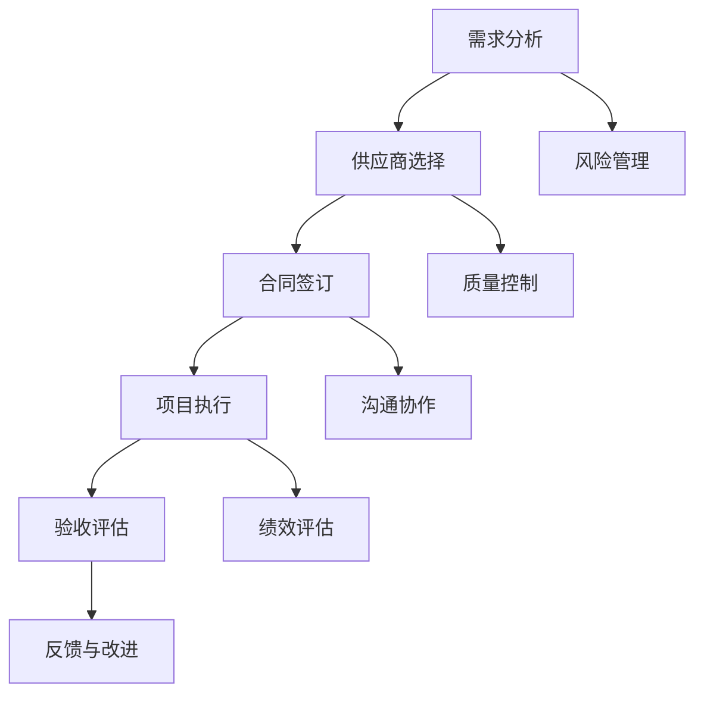

                 

# 一人公司如何利用外包资源

## 关键词
- 一人公司
- 外包资源
- 效率提升
- 成本控制
- 专业化服务
- 风险管理

## 摘要
本文旨在探讨一人公司如何通过有效利用外包资源来提高业务效率和降低成本。文章将分析外包的优势与挑战，介绍外包的核心概念和运作模式，并提供实际操作步骤和案例分析。此外，还将讨论外包在具体应用场景中的价值，并推荐相关工具和资源，帮助读者更好地理解和实施外包策略。

## 1. 背景介绍

一人公司，顾名思义，是指由单一创始人或个体经营的企业。这种模式在近年来随着互联网的发展和创业环境的优化，变得越来越流行。一人公司的优势在于其灵活性、快速决策和低成本运营。然而，对于一人公司来说，资源有限，特别是在技术和市场拓展方面，单打独斗往往难以应对复杂的商业环境。

外包作为一种外部资源的引入方式，已经成为现代企业提高效率和降低成本的重要手段。外包可以涵盖从简单的数据处理到复杂的技术开发等多个领域。对于一人公司而言，外包不仅可以弥补自身在技术和人力资源方面的不足，还可以专注于核心业务的拓展，从而实现更高的业务价值。

本文将详细探讨一人公司如何利用外包资源，包括外包的优势、外包的核心概念、实际操作步骤、案例分析以及工具和资源推荐等，旨在为读者提供一套实用的外包策略。

## 2. 核心概念与联系

### 2.1 外包的定义与分类

外包（Outsourcing）是指企业将原本内部处理的部分业务或职能，交给外部专业公司或个人来完成。根据外包的内容和目的，可以将外包分为以下几类：

- **流程外包**：企业将某一业务流程交给外部公司处理，如客户服务、数据处理、财务管理等。
- **技术外包**：企业将特定技术需求外包给外部技术公司或专家，如软件开发、系统维护、网络安全等。
- **人力资源外包**：企业将人力资源管理部分或全部职能外包给专业的人力资源公司，如招聘、培训、员工福利管理等。
- **市场外包**：企业将市场营销活动外包给专业市场公司，如广告投放、市场调研、品牌推广等。

### 2.2 外包的优势与挑战

#### 外包的优势

1. **成本节约**：通过外包，企业可以避免大量的人力资源投入，减少设备购置和维护成本。
2. **专业化服务**：外包公司专注于某一领域，通常具备更高的专业水平和丰富的经验，能够提供更高效、高质量的服务。
3. **灵活性**：外包服务可以根据企业的需求灵活调整，帮助企业快速应对市场变化。
4. **风险分散**：将某些高风险业务外包给专业公司，可以降低企业自身承担的风险。

#### 外包的挑战

1. **数据安全**：外包可能涉及企业敏感信息的泄露，需要严格的数据保护和保密措施。
2. **沟通困难**：企业与外包公司之间存在信息不对称，可能会导致沟通不畅，影响项目的进度和质量。
3. **控制难度**：外包业务的管理和控制难度较大，需要建立有效的监督和评估机制。

### 2.3 外包运作模式

#### 外包流程

1. **需求分析**：明确外包的具体需求和目标，制定外包策略。
2. **供应商选择**：根据需求，选择合适的外包供应商，进行招标或直接采购。
3. **合同签订**：与外包供应商签订详细的合同，明确双方的权利和义务。
4. **项目执行**：按照合同要求，进行项目执行和管理。
5. **验收评估**：对外包服务进行验收评估，确保达到预期效果。
6. **反馈与改进**：收集反馈信息，持续改进外包服务质量。

#### 外包管理

1. **风险管理**：对外包过程中的风险进行识别、评估和管理。
2. **质量控制**：建立质量控制机制，确保外包服务的质量和效果。
3. **沟通协作**：建立有效的沟通渠道，确保双方信息的及时传递和协作。
4. **绩效评估**：对外包供应商的绩效进行评估，激励其提高服务质量。

### 2.4 外包核心概念架构图



## 3. 核心算法原理 & 具体操作步骤

### 3.1 外包需求分析

#### 需求分析步骤：

1. **确定外包目标**：明确外包的目的是什么，是降低成本、提高效率，还是专注于核心业务。
2. **分析内部能力**：评估企业自身在技术、人力资源等方面的优势和短板。
3. **定义外包范围**：确定哪些业务或职能适合外包，以及外包的具体内容和要求。
4. **预算和资源**：制定外包预算，明确可投入的资源。

### 3.2 供应商选择

#### 选择供应商步骤：

1. **市场调研**：收集潜在供应商的信息，了解其资质、经验、案例等。
2. **筛选供应商**：根据需求，对供应商进行初步筛选，重点关注其专业能力和服务质量。
3. **招标或直接采购**：根据具体情况，选择招标或直接采购的方式，签订合同。

### 3.3 合同签订

#### 合同签订步骤：

1. **合同条款**：明确双方的权利和义务，包括服务内容、质量标准、交付时间、费用结算等。
2. **保密协议**：签订保密协议，确保外包过程中的信息安全。
3. **合同审核**：法律顾问对合同进行审核，确保合同合法、有效。

### 3.4 项目执行

#### 项目执行步骤：

1. **项目启动**：明确项目目标、范围、时间表和团队组成。
2. **项目沟通**：建立有效的沟通机制，确保项目进展信息的及时传递。
3. **项目监控**：定期监控项目进度和质量，确保项目按计划进行。
4. **问题解决**：及时解决项目执行过程中出现的问题，确保项目顺利进行。

### 3.5 验收评估

#### 验收评估步骤：

1. **验收标准**：制定明确的验收标准，确保验收过程有据可依。
2. **验收测试**：进行验收测试，验证外包服务的质量和效果。
3. **反馈调整**：根据验收结果，对外包服务进行反馈和调整。

### 3.6 反馈与改进

#### 反馈与改进步骤：

1. **收集反馈**：收集客户、内部员工等对外包服务的反馈。
2. **问题分析**：分析反馈信息，找出存在的问题和改进方向。
3. **持续改进**：根据分析结果，持续改进外包服务质量。

## 4. 数学模型和公式 & 详细讲解 & 举例说明

### 4.1 成本效益分析

外包的成本效益分析是决定外包决策的重要依据。以下是一个简化的成本效益分析模型：

#### 成本效益分析模型

\[ \text{成本效益比} = \frac{\text{外包成本}}{\text{内部成本}} \]

其中：

- **外包成本**：包括外包服务费用、沟通成本、管理成本等。
- **内部成本**：包括内部人员工资、设备购置和维护成本、培训成本等。

#### 举例说明

假设一家一人公司需要开发一款移动应用，内部开发成本为每月10万元，而外包给一家专业的软件开发公司，费用为每月6万元。同时，还需要考虑其他相关成本，如沟通成本、项目管理成本等。

\[ \text{成本效益比} = \frac{60000}{100000} = 0.6 \]

成本效益比为0.6，说明外包比内部开发更经济有效。此外，还可以考虑时间效益，即外包能够更快地完成项目，从而带来更大的效益。

### 4.2 风险评估模型

风险评估是外包过程中至关重要的一环。以下是一个简化的风险评估模型：

\[ \text{风险指数} = \frac{\text{风险发生概率} \times \text{风险影响程度}}{\text{风险可接受程度}} \]

其中：

- **风险发生概率**：指风险发生的可能性，通常用概率值表示。
- **风险影响程度**：指风险发生时对企业的影响程度，如时间延迟、成本增加、数据泄露等。
- **风险可接受程度**：指企业对风险的容忍程度，通常与企业的业务目标、风险偏好等因素相关。

#### 举例说明

假设一家一人公司计划将客户服务外包给一家专业的客服公司，风险因素包括数据泄露、服务中断、客户满意度下降等。

- **数据泄露**：风险发生概率为0.2，风险影响程度为0.5，风险可接受程度为0.3。
- **服务中断**：风险发生概率为0.1，风险影响程度为0.6，风险可接受程度为0.4。
- **客户满意度下降**：风险发生概率为0.3，风险影响程度为0.4，风险可接受程度为0.5。

\[ \text{风险指数} = \frac{0.2 \times 0.5 \times 0.3 + 0.1 \times 0.6 \times 0.4 + 0.3 \times 0.4 \times 0.5}{0.3} = 0.2333 \]

风险指数为0.2333，表明外包客户服务的风险相对较低，可以接受。

### 4.3 项目评估模型

项目评估是对外包项目执行效果进行综合评价的方法。以下是一个简化的项目评估模型：

\[ \text{项目评估得分} = \frac{\text{项目完成度} + \text{质量评分} + \text{成本效益比}}{3} \]

其中：

- **项目完成度**：指外包项目按计划完成的程度，通常用百分比表示。
- **质量评分**：指外包服务的质量评分，通常采用5分制或10分制。
- **成本效益比**：同成本效益分析模型。

#### 举例说明

假设一家一人公司的外包项目完成度为90%，质量评分为8分，成本效益比为0.6。

\[ \text{项目评估得分} = \frac{0.9 + 8 + 0.6}{3} = 2.9 \]

项目评估得分为2.9，表明外包项目执行效果良好。

## 5. 项目实战：代码实际案例和详细解释说明

### 5.1 开发环境搭建

为了更好地演示外包在软件开发中的应用，我们以一家一人公司开发一个简单的博客平台为例。以下是开发环境的搭建步骤：

1. **确定开发语言和框架**：选择Python作为开发语言，并使用Django作为Web框架。
2. **安装Python**：在本地或云服务器上安装Python环境，版本建议为3.8以上。
3. **安装Django**：使用pip命令安装Django：
   ```shell
   pip install django
   ```
4. **创建Django项目**：使用以下命令创建一个名为“blog_project”的Django项目：
   ```shell
   django-admin startproject blog_project
   ```
5. **创建Django应用**：在项目目录下创建一个名为“blog_app”的Django应用：
   ```shell
   python manage.py startapp blog_app
   ```

### 5.2 源代码详细实现和代码解读

以下是博客平台的核心源代码实现，包括模型定义、视图函数、URL配置等。

#### 5.2.1 模型定义

在“blog_app”应用的`models.py`文件中，定义了博客文章的模型：

```python
from django.db import models

class Post(models.Model):
    title = models.CharField(max_length=100)
    content = models.TextField()
    created_at = models.DateTimeField(auto_now_add=True)
```

**解读**：Post模型包含三个字段：title（文章标题），content（文章内容），created_at（创建时间）。其中，created_at字段使用了`auto_now_add`参数，表示创建时间自动设置为当前时间。

#### 5.2.2 视图函数

在“blog_app”应用的`views.py`文件中，定义了展示博客文章列表和详细页面的视图函数：

```python
from django.shortcuts import render
from .models import Post

def post_list(request):
    posts = Post.objects.all()
    return render(request, 'blog_app/post_list.html', {'posts': posts})

def post_detail(request, pk):
    post = Post.objects.get(pk=pk)
    return render(request, 'blog_app/post_detail.html', {'post': post})
```

**解读**：post_list视图函数查询所有博客文章，并将其传递给模板文件`post_list.html`。post_detail视图函数根据文章ID（pk）查询特定文章，并传递给模板文件`post_detail.html`。

#### 5.2.3 URL配置

在“blog_project”项目的`urls.py`文件中，配置了视图函数的URL映射：

```python
from django.contrib import admin
from django.urls import path
from . import views

urlpatterns = [
    path('admin/', admin.site.urls),
    path('posts/', views.post_list, name='post_list'),
    path('posts/<int:pk>/', views.post_detail, name='post_detail'),
]
```

**解读**：配置了两个URL路径，一个是博客文章列表页面`/posts/`，另一个是博客文章详细页面`/posts/<int:pk>/`。其中，`<int:pk>`表示URL路径中的文章ID参数。

### 5.3 代码解读与分析

以上代码实现了一个简单的博客平台，主要包括模型定义、视图函数和URL配置。以下是关键代码段的解读与分析：

- **模型定义**：Post模型用于存储博客文章的基本信息，包括标题、内容和创建时间。模型字段的设计遵循了Python和Django的数据模型设计原则，确保数据的规范性和一致性。
- **视图函数**：视图函数是Django框架的核心组件，用于处理HTTP请求并返回响应。post_list和post_detail视图函数分别实现了博客文章列表和详细页面的展示功能，采用了常见的MVC（模型-视图-控制器）架构。
- **URL配置**：URL配置文件用于映射URL路径和视图函数，实现了路由功能。这种配置方式使得代码结构清晰，易于维护和扩展。

通过以上代码实现，一人公司可以快速搭建一个功能简单的博客平台，而无需深入了解复杂的Web开发技术。这体现了外包在提高开发效率、降低开发难度方面的优势。

## 6. 实际应用场景

### 6.1 效率提升

一人公司通过外包，可以专注于核心业务的发展，从而提高整体效率。例如，在市场营销方面，一人公司可以将市场调研、广告投放等外包给专业的市场公司，利用其丰富的经验和资源，快速获取市场洞察，制定更有效的营销策略。在技术方面，一人公司可以将系统开发、运维等外包给专业的技术团队，专注于产品创新和优化，提高产品的市场竞争力。

### 6.2 成本控制

外包可以有效地降低企业的运营成本。一人公司通过外包，可以避免大量的人力资源投入和设备购置成本，同时也可以减少管理成本。例如，将人力资源外包给专业的人力资源公司，可以节省招聘、培训、薪酬管理等成本；将技术外包给专业的技术团队，可以避免高昂的技术开发和维护成本。

### 6.3 专业化服务

外包公司通常专注于某一领域，具备更高的专业水平和丰富的经验。通过外包，一人公司可以享受到专业化服务，提高业务质量。例如，在软件开发方面，外包公司可以提供专业的技术支持，确保系统的稳定性和安全性；在客户服务方面，外包公司可以提供专业的客户咨询和售后服务，提升客户满意度。

### 6.4 风险管理

外包可以帮助一人公司分散风险。通过将某些高风险业务外包给专业公司，一人公司可以降低自身承担的风险。例如，将客户数据存储和处理外包给专业的云计算服务提供商，可以确保数据的安全性和可靠性；将财务外包给专业的会计师事务所，可以降低财务风险。

### 6.5 市场拓展

外包可以帮助一人公司快速拓展市场。通过外包，一人公司可以快速获取新的市场资源和渠道，扩大业务规模。例如，将市场调研和推广外包给专业的市场公司，可以快速了解市场趋势和消费者需求，制定更有效的市场拓展策略。

## 7. 工具和资源推荐

### 7.1 学习资源推荐

- **书籍**：
  - 《外包管理：战略、执行与风险控制》
  - 《外包的本质：如何打造全球领先的供应链》
- **论文**：
  - 《企业外包决策影响因素研究》
  - 《外包与外包商绩效关系研究》
- **博客/网站**：
  - https://www.outsourcing-japan.com/
  - https://www.outsourcing-magazine.com/

### 7.2 开发工具框架推荐

- **开源框架**：
  - Django：Python Web开发框架，适用于快速构建Web应用程序。
  - React：JavaScript库，适用于构建用户界面和前端应用程序。
  - Spring Boot：Java开发框架，适用于构建企业级应用程序。
- **云服务提供商**：
  - AWS：提供丰富的云计算服务，包括计算、存储、数据库、网络等。
  - Azure：微软的云计算平台，提供广泛的服务，支持多种开发语言和框架。
  - Google Cloud：谷歌的云计算服务，提供高效、可靠、安全的云基础设施。

### 7.3 相关论文著作推荐

- **论文**：
  - 《外包战略对企业绩效的影响研究》
  - 《基于风险评估的外包决策模型》
- **著作**：
  - 《外包：全球商业的新模式》
  - 《供应链外包：理论与实践》

## 8. 总结：未来发展趋势与挑战

外包作为现代企业提升竞争力的重要手段，其应用范围和深度正不断扩展。未来，外包趋势将呈现以下几个特点：

1. **技术驱动**：随着云计算、大数据、人工智能等技术的发展，外包服务将更加智能化、自动化，提高外包效率和效果。
2. **平台化**：外包服务将逐渐向平台化发展，通过共享平台实现资源的优化配置和高效利用。
3. **全球化**：全球化的趋势将进一步推动外包业务的发展，跨国外包将成为常态，企业可以更灵活地获取全球资源。
4. **风险管理**：外包过程中的风险管理将得到更多关注，企业将更加重视数据安全、合同管理等方面。

然而，外包也面临一些挑战：

1. **数据安全**：外包可能涉及企业敏感信息的泄露，需要严格的数据保护和保密措施。
2. **沟通协作**：企业与外包供应商之间的沟通协作难度较大，需要建立有效的沟通机制。
3. **质量控制**：外包服务的质量难以控制，需要建立完善的质量管理体系。
4. **法律法规**：不同国家和地区的法律法规对外包有不同的要求，企业需要遵守相关法律法规。

一人公司在利用外包资源时，应充分考虑这些发展趋势和挑战，制定合理的策略和措施，确保外包业务的顺利进行。

## 9. 附录：常见问题与解答

### 9.1 什么是外包？

外包是指企业将原本内部处理的部分业务或职能，交给外部专业公司或个人来完成。

### 9.2 外包有哪些类型？

外包可分为流程外包、技术外包、人力资源外包和市场外包等类型。

### 9.3 外包的优势有哪些？

外包的优势包括成本节约、专业化服务、灵活性和风险分散等。

### 9.4 外包的挑战有哪些？

外包的挑战包括数据安全、沟通困难、控制难度等。

### 9.5 如何选择外包供应商？

选择外包供应商应考虑其资质、经验、案例、服务质量等因素。

### 9.6 如何管理外包项目？

外包项目应进行需求分析、供应商选择、合同签订、项目执行、验收评估和反馈改进等环节的管理。

## 10. 扩展阅读 & 参考资料

- 《外包管理：战略、执行与风险控制》
- 《外包的本质：如何打造全球领先的供应链》
- 《企业外包决策影响因素研究》
- 《外包与外包商绩效关系研究》
- https://www.outsourcing-japan.com/
- https://www.outsourcing-magazine.com/  
- 《Django Web开发教程》
- 《React入门与实践》
- 《Spring Boot实战》
- https://aws.amazon.com/
- https://azure.microsoft.com/
- https://cloud.google.com/  
- 《全球化时代的供应链管理》
- 《跨国外包：理论与实践》

## 作者

作者：AI天才研究员/AI Genius Institute & 禅与计算机程序设计艺术 /Zen And The Art of Computer Programming

本文旨在为读者提供一套实用的外包策略，帮助一人公司充分利用外部资源，提升业务效率和竞争力。通过详细的分析和案例分析，读者可以更好地理解外包的核心概念和实际应用，从而制定适合自己的外包策略。希望本文能为读者带来启示和帮助。

