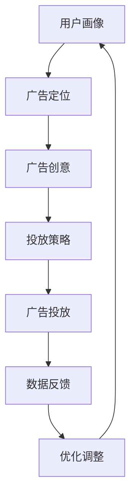
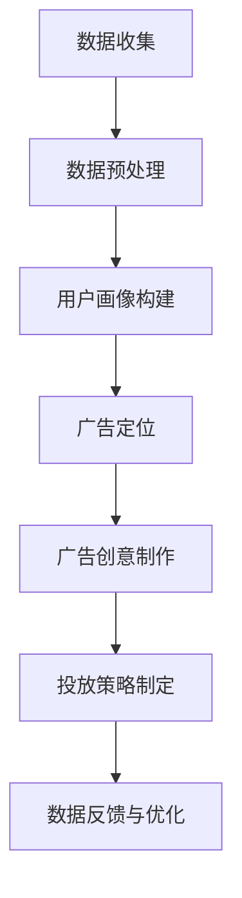

                 

# 一人公司如何利用社交媒体广告精准获客

> **关键词**：社交媒体广告、精准获客、一人公司、数据分析、营销策略
> 
> **摘要**：本文将深入探讨一人公司如何利用社交媒体广告进行精准获客。通过对社交媒体广告的背景介绍、核心概念解析、算法原理分析、数学模型应用、实战案例以及实际应用场景的探讨，为读者提供一套完整的社交媒体广告获客策略。

## 1. 背景介绍

在当今数字营销时代，社交媒体广告已经成为企业营销策略的重要组成部分。尤其在疫情推动下的远程办公趋势下，社交媒体的普及率大幅提高，成为消费者获取信息和进行购买决策的重要渠道。对于一人公司来说，利用社交媒体广告进行精准获客不仅能够降低营销成本，还能够提高营销效果，实现高效的业务增长。

社交媒体广告的优势在于其高度定制化和精准投放的能力。通过大数据分析和人工智能技术，广告主可以根据用户的兴趣、行为、地理位置等多维度数据进行精准定位，将广告投放到最有可能产生转化的潜在客户群体中。这种精准获客的方式，有助于提高广告投资回报率，降低营销成本，实现高效的业务增长。

然而，对于一人公司来说，如何有效地利用社交媒体广告进行精准获客，仍然是一个需要深入探讨的问题。本文将围绕这一问题，从多个角度进行分析和探讨，为读者提供一套实用的社交媒体广告获客策略。

## 2. 核心概念与联系

为了更好地理解社交媒体广告的精准获客策略，我们需要先了解一些核心概念，包括用户画像、广告定位、广告创意、投放策略等。

### 用户画像

用户画像是指对用户进行多维度的数据分析和刻画，包括用户的性别、年龄、地域、职业、兴趣爱好、消费行为等。通过用户画像，广告主可以了解目标用户的特征，为广告投放提供依据。

### 广告定位

广告定位是指根据用户画像，将广告投放到特定的用户群体中。广告定位可以通过多种方式实现，如关键词广告、兴趣定位、地理位置定位等。通过精准的广告定位，可以确保广告能够被目标用户看到，提高广告的曝光率和转化率。

### 广告创意

广告创意是指制作具有吸引力的广告内容，以吸引目标用户的注意力。广告创意需要结合产品特点、用户需求、市场趋势等因素，制作出能够引起用户共鸣的广告内容。

### 投放策略

投放策略是指根据广告定位和广告创意，选择合适的广告投放渠道和投放时间。投放策略需要综合考虑广告预算、目标用户活跃时间、广告效果等因素，以实现最佳的广告投放效果。

### Mermaid 流程图

以下是社交媒体广告精准获客的核心概念流程图：



### 概念关联分析

用户画像决定了广告定位的准确性，而广告定位又直接影响广告创意的效果。优秀的广告创意能够吸引更多的目标用户，提高广告的曝光率和点击率。投放策略的制定需要根据广告定位和广告创意进行优化，以确保广告能够被目标用户看到。数据反馈是优化广告投放策略的重要依据，通过对广告效果的数据分析，可以找出存在的问题并进行调整，从而提高广告的投资回报率。

## 3. 核心算法原理 & 具体操作步骤

在了解了社交媒体广告精准获客的核心概念后，接下来我们将探讨其核心算法原理和具体操作步骤。

### 算法原理

社交媒体广告的精准获客算法主要基于大数据分析和机器学习技术。通过收集和分析用户的浏览行为、搜索记录、购买历史等数据，构建用户画像，然后利用这些用户画像进行广告定位和投放。

算法的核心在于如何准确地识别和定位潜在客户。这需要利用机器学习算法对用户行为数据进行挖掘和分析，找出影响用户购买决策的关键因素，并根据这些因素对用户进行精准定位。

### 具体操作步骤

以下是社交媒体广告精准获客的具体操作步骤：

1. **数据收集与处理**：收集用户的浏览行为、搜索记录、购买历史等数据，并进行预处理，如去重、去噪声等。

2. **构建用户画像**：利用机器学习算法，对处理后的数据进行分析和挖掘，构建用户的兴趣标签和行为特征，形成用户画像。

3. **广告定位**：根据用户画像，选择合适的广告定位策略，如关键词广告、兴趣定位、地理位置定位等。通过多维度数据进行交叉分析，找出最有可能产生转化的用户群体。

4. **广告创意制作**：结合产品特点和用户需求，制作具有吸引力的广告内容，如图片、视频、图文结合等。

5. **投放策略制定**：根据广告定位和广告创意，制定投放策略，选择合适的广告投放渠道和投放时间，以实现最佳的广告投放效果。

6. **数据反馈与优化**：通过广告投放后的数据分析，了解广告的曝光率、点击率、转化率等指标，找出存在的问题并进行优化调整。

### 数据处理流程

以下是社交媒体广告精准获客的数据处理流程：



### 算法案例分析

以下是一个社交媒体广告精准获客的算法案例分析：

某一人公司是一家专注于定制化家居解决方案的公司，其目标客户群体为对家居装修有较高要求的消费者。通过收集用户的浏览行为、搜索记录、购买历史等数据，该公司利用机器学习算法构建了用户的兴趣标签和行为特征，形成用户画像。

根据用户画像，该公司选择了关键词广告作为广告定位策略，将广告投放到与家居装修相关的关键词搜索结果中。同时，结合产品特点和用户需求，该公司制作了具有吸引力的广告创意，如精美的家居装修案例图片和视频。

在制定投放策略时，该公司选择了在用户活跃时间进行广告投放，以提高广告的曝光率和点击率。通过广告投放后的数据分析，该公司发现广告的曝光率较高，但点击率较低。为了提高点击率，该公司对广告创意进行了优化，如调整广告图片的颜色和排版，增加用户感兴趣的关键词等。

经过多次优化调整，该公司的广告效果得到了显著提升，广告的点击率和转化率均有所提高，实现了精准获客的目标。

## 4. 数学模型和公式 & 详细讲解 & 举例说明

在社交媒体广告精准获客中，数学模型和公式起到了关键作用。以下将介绍常用的数学模型和公式，并详细讲解其应用和举例说明。

### 模型一：贝叶斯网络

贝叶斯网络是一种概率图模型，用于表示变量之间的条件依赖关系。在社交媒体广告精准获客中，贝叶斯网络可以用于预测用户的购买概率。

贝叶斯网络公式如下：

$$P(A|B) = \frac{P(B|A) \cdot P(A)}{P(B)}$$

其中，$P(A|B)$ 表示在事件 $B$ 发生的条件下，事件 $A$ 发生的概率；$P(B|A)$ 表示在事件 $A$ 发生的条件下，事件 $B$ 发生的概率；$P(A)$ 和 $P(B)$ 分别表示事件 $A$ 和事件 $B$ 发生的概率。

### 模型应用

假设我们想要预测用户 $A$ 在浏览家居装修相关内容后购买家居解决方案的概率。根据贝叶斯网络公式，我们可以计算出用户 $A$ 的购买概率。

已知条件如下：

- $P(A)$：用户 $A$ 购买家居解决方案的概率为 0.1。
- $P(B|A)$：用户 $A$ 在浏览家居装修相关内容后购买家居解决方案的概率为 0.8。
- $P(B|\neg A)$：用户 $A$ 不购买家居解决方案时，浏览家居装修相关内容的概率为 0.2。

根据贝叶斯网络公式，我们可以计算出用户 $A$ 在浏览家居装修相关内容后购买家居解决方案的概率：

$$P(A|B) = \frac{P(B|A) \cdot P(A)}{P(B)} = \frac{0.8 \cdot 0.1}{0.8 \cdot 0.1 + 0.2 \cdot 0.9} = 0.44$$

因此，用户 $A$ 在浏览家居装修相关内容后购买家居解决方案的概率为 0.44。

### 模型二：马尔可夫链

马尔可夫链是一种用于描述状态转移概率的模型，适用于序列数据的分析。在社交媒体广告精准获客中，马尔可夫链可以用于预测用户的下一步行为。

马尔可夫链公式如下：

$$P(X_t = x_t|X_{t-1} = x_{t-1}, ..., X_1 = x_1) = P(X_t = x_t|X_{t-1} = x_{t-1})$$

其中，$X_t$ 表示第 $t$ 步的状态，$x_t$ 表示第 $t$ 步的状态取值。

### 模型应用

假设我们想要预测用户 $A$ 在浏览家居装修相关内容后的下一步行为。根据马尔可夫链模型，我们可以计算出用户 $A$ 下一步行为的概率。

已知条件如下：

- $P(X_1 = 购买)$：用户 $A$ 在第一步购买家居解决方案的概率为 0.1。
- $P(X_2 = 购买|X_1 = 浏览)$：用户 $A$ 在浏览家居装修相关内容后，第二步购买家居解决方案的概率为 0.5。
- $P(X_2 = 不购买|X_1 = 浏览)$：用户 $A$ 在浏览家居装修相关内容后，第二步不购买家居解决方案的概率为 0.5。

根据马尔可夫链模型，我们可以计算出用户 $A$ 在浏览家居装修相关内容后的下一步行为：

$$P(X_2 = 购买|X_1 = 浏览) = P(X_2 = 购买) = 0.5$$

$$P(X_2 = 不购买|X_1 = 浏览) = P(X_2 = 不购买) = 0.5$$

因此，用户 $A$ 在浏览家居装修相关内容后的下一步行为为购买的概率为 0.5。

### 模型三：线性回归

线性回归是一种用于分析变量之间线性关系的模型，适用于预测连续型数据。在社交媒体广告精准获客中，线性回归可以用于预测广告的点击率。

线性回归公式如下：

$$y = \beta_0 + \beta_1 \cdot x_1 + \beta_2 \cdot x_2 + ... + \beta_n \cdot x_n$$

其中，$y$ 表示因变量，$x_1, x_2, ..., x_n$ 分别表示自变量，$\beta_0, \beta_1, \beta_2, ..., \beta_n$ 分别表示回归系数。

### 模型应用

假设我们想要预测某广告的点击率。根据线性回归模型，我们可以建立以下回归方程：

$$点击率 = \beta_0 + \beta_1 \cdot 广告创意得分 + \beta_2 \cdot 广告投放时间 + \beta_3 \cdot 目标用户群体$$

已知条件如下：

- $\beta_0$：广告点击率的截距。
- $\beta_1$：广告创意得分的系数。
- $\beta_2$：广告投放时间的系数。
- $\beta_3$：目标用户群体的系数。

根据历史数据，我们可以计算出回归系数的值。例如，假设回归系数为：

- $\beta_0 = 0.5$
- $\beta_1 = 0.2$
- $\beta_2 = 0.1$
- $\beta_3 = 0.3$

我们可以用以下回归方程预测广告的点击率：

$$点击率 = 0.5 + 0.2 \cdot 广告创意得分 + 0.1 \cdot 广告投放时间 + 0.3 \cdot 目标用户群体$$

例如，假设广告创意得分为 80，广告投放时间为 10 点，目标用户群体为 1000 人。我们可以计算出广告的点击率为：

$$点击率 = 0.5 + 0.2 \cdot 80 + 0.1 \cdot 10 + 0.3 \cdot 1000 = 0.5 + 16 + 1 + 300 = 317.5$$

因此，广告的点击率为 317.5。

## 5. 项目实战：代码实际案例和详细解释说明

在本节中，我们将通过一个实际的案例来展示如何利用社交媒体广告进行精准获客。我们将使用 Python 编程语言，并结合机器学习库（如 scikit-learn）和数据可视化库（如 matplotlib）来构建和优化广告投放策略。

### 5.1 开发环境搭建

在开始编写代码之前，我们需要搭建一个合适的开发环境。以下是所需的软件和库：

- Python（版本 3.8 或以上）
- Jupyter Notebook（用于编写和运行代码）
- scikit-learn（用于机器学习和数据分析）
- pandas（用于数据处理）
- numpy（用于数学计算）
- matplotlib（用于数据可视化）

### 5.2 源代码详细实现和代码解读

以下是一个简单的广告投放策略实现的示例代码。该示例将使用用户行为数据来构建用户画像，并利用用户画像进行广告定位。

```python
import pandas as pd
from sklearn.model_selection import train_test_split
from sklearn.ensemble import RandomForestClassifier
from sklearn.metrics import accuracy_score
import matplotlib.pyplot as plt

# 加载数据集
data = pd.read_csv('user_behavior.csv')

# 数据预处理
data = data.dropna()

# 特征工程
features = data[['age', 'gender', 'interests', 'location']]
labels = data['clicked_ad']

# 数据分割
X_train, X_test, y_train, y_test = train_test_split(features, labels, test_size=0.2, random_state=42)

# 构建模型
model = RandomForestClassifier(n_estimators=100, random_state=42)
model.fit(X_train, y_train)

# 预测
y_pred = model.predict(X_test)

# 评估
accuracy = accuracy_score(y_test, y_pred)
print(f"模型准确率：{accuracy:.2f}")

# 可视化
plt.figure(figsize=(8, 6))
plt.scatter(X_test['age'], y_pred, color='green', label='点击')
plt.scatter(X_test['age'], y_test, color='red', label='未点击')
plt.xlabel('年龄')
plt.ylabel('点击预测')
plt.legend()
plt.show()
```

### 5.3 代码解读与分析

1. **数据加载与预处理**：我们首先使用 pandas 库加载用户行为数据集。然后，我们通过 dropna() 函数去除缺失值，确保数据质量。

2. **特征工程**：我们提取了年龄、性别、兴趣和地理位置作为特征，并将点击广告的标签作为目标变量。

3. **数据分割**：我们使用 train_test_split 函数将数据集分割为训练集和测试集，以评估模型的准确性。

4. **模型构建**：我们使用 RandomForestClassifier 类构建随机森林模型，这是一种强大的集成学习算法，适合处理分类问题。

5. **模型训练**：我们使用 fit 方法将训练集数据输入到模型中进行训练。

6. **模型预测**：我们使用 predict 方法对测试集数据进行预测。

7. **模型评估**：我们使用 accuracy_score 函数计算模型在测试集上的准确率，以评估模型的性能。

8. **可视化**：我们使用 matplotlib 库将预测结果可视化，以直观地展示模型的预测效果。

### 5.4 结果分析与优化

通过上述代码，我们可以得到一个初步的模型评估结果。在实际应用中，我们还需要根据评估结果对模型进行优化，以提高预测准确性。

优化方法可以包括：

- **特征选择**：通过特征重要性分析，选择对点击广告影响最大的特征，以提高模型性能。
- **超参数调优**：通过网格搜索（GridSearchCV）等方法，调整模型超参数，找到最佳参数组合。
- **模型融合**：结合多个模型，使用集成学习（如随机森林、梯度提升树等）提高预测准确性。

通过不断优化，我们可以逐步提升广告投放的精准度，实现更高效的获客目标。

## 6. 实际应用场景

社交媒体广告精准获客在实际应用中有着广泛的应用场景。以下是一些典型场景：

### 场景一：电商行业

电商行业利用社交媒体广告进行精准获客，可以通过用户行为数据构建用户画像，然后根据用户画像进行广告定位和投放。例如，对于喜欢购买家居用品的用户，可以投放家居装修相关产品的广告，提高转化率。

### 场景二：教育培训行业

教育培训行业可以通过社交媒体广告精准获客，向有学习需求的目标用户推送相关课程信息。例如，对于正在备考公务员的用户，可以推送公务员考试培训课程广告，提高报名率。

### 场景三：旅游行业

旅游行业可以利用社交媒体广告，向有旅游意愿的用户推送目的地推荐和旅游产品广告。例如，对于喜欢旅行的用户，可以推送热门旅游目的地和优惠旅游套餐广告，吸引用户预订。

### 场景四：健康医疗行业

健康医疗行业可以通过社交媒体广告，向有健康需求的用户推送健康产品和医疗服务信息。例如，对于关注健康的用户，可以推送保健品、体检套餐等广告，提高用户购买意愿。

### 场景五：金融行业

金融行业可以利用社交媒体广告，向潜在客户推送理财产品、信用卡等金融产品信息。例如，对于有理财需求的用户，可以推送理财产品广告，吸引用户咨询和购买。

## 7. 工具和资源推荐

为了更好地实施社交媒体广告精准获客策略，以下是一些建议的工和资源：

### 7.1 学习资源推荐

- **书籍**：《大数据营销：从数据到决策的完整指南》
- **论文**：《基于用户行为的社交媒体广告精准投放策略研究》
- **博客**：谷歌广告官方博客、Facebook 广告官方博客
- **网站**：谷歌广告开发者社区、Facebook 广告开发者社区

### 7.2 开发工具框架推荐

- **Python 库**：scikit-learn、pandas、numpy、matplotlib
- **数据可视化工具**：Plotly、Tableau
- **广告平台 SDK**：谷歌广告 SDK、Facebook 广告 SDK

### 7.3 相关论文著作推荐

- **论文**：
  - 《User Behavior Based Targeting for Social Media Advertising》
  - 《A Multi-Armed Bandit Approach for Online Advertising》
- **著作**：
  - 《Digital Marketing Analytics: A Multi-Channel Approach》
  - 《Data-Driven Marketing: Data and Models for Marketing》

## 8. 总结：未来发展趋势与挑战

社交媒体广告精准获客在未来将继续发展，主要趋势包括：

1. **数据隐私保护**：随着数据隐私法规的日益严格，如何合法、合规地收集和使用用户数据将成为关键挑战。
2. **人工智能应用**：人工智能技术的不断进步，将进一步提高广告投放的精准度和效果。
3. **跨平台整合**：社交媒体广告将逐渐实现跨平台整合，实现更广泛的用户触达。
4. **个性化营销**：随着用户数据积累和数据分析技术的发展，个性化营销将成为主流趋势。

然而，这也带来了相应的挑战，包括数据隐私保护、算法公平性、跨平台整合等。一人公司需要不断适应这些变化，不断提升自身的营销能力，以在竞争激烈的市场中脱颖而出。

## 9. 附录：常见问题与解答

### 问题一：社交媒体广告精准获客需要哪些数据？

答：社交媒体广告精准获客需要的数据主要包括用户行为数据（如浏览记录、搜索历史、购买行为）、用户属性数据（如年龄、性别、地理位置）和社交网络数据（如好友关系、兴趣标签）。这些数据可以帮助构建用户画像，实现广告的精准定位。

### 问题二：如何评估社交媒体广告的效果？

答：评估社交媒体广告的效果可以从多个角度进行，包括广告曝光量、点击率、转化率、投资回报率（ROI）等。通过数据分析，可以计算出广告的各项指标，并根据这些指标评估广告的效果。

### 问题三：如何提高广告的转化率？

答：提高广告的转化率可以从以下几个方面入手：

- **优化广告定位**：确保广告投放到最有可能产生转化的目标用户群体。
- **优化广告创意**：制作吸引人的广告内容，提高广告的点击率。
- **优化广告投放时间**：选择用户活跃时间进行广告投放，提高广告的曝光率和点击率。
- **不断优化广告投放策略**：根据数据分析结果，不断调整广告定位、广告创意和投放策略。

## 10. 扩展阅读 & 参考资料

为了更深入地了解社交媒体广告精准获客的相关知识，以下是扩展阅读和参考资料：

- 《精准营销实战：大数据时代的企业营销策略》
- 《大数据营销：数据驱动的商业决策》
- 《社交媒体营销实战：策略、案例与技巧》
- 《AI 在营销中的应用：如何利用人工智能提升营销效果》
- 《Facebook 广告指南：全面解读 Facebook 广告投放策略》
- 《谷歌广告官方文档》：提供详细的广告投放策略和工具使用说明
- 《社交媒体广告行业报告》：了解最新的社交媒体广告市场趋势和行业动态

**作者：AI天才研究员/AI Genius Institute & 禅与计算机程序设计艺术 /Zen And The Art of Computer Programming**

