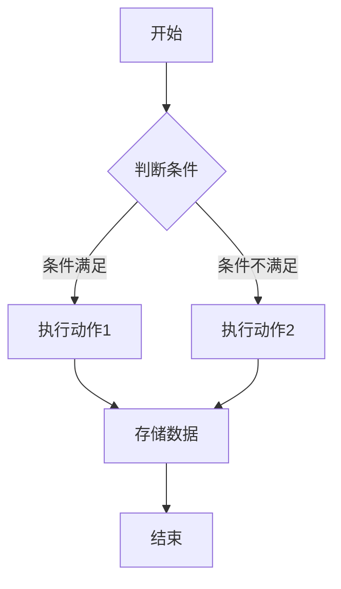

                 

# 一人公司如何利用自动化工具提高效率

> **关键词**：一人公司、自动化工具、效率提升、工具推荐、实战案例

> **摘要**：本文将深入探讨一人公司如何通过引入自动化工具来大幅提升个人工作效率。我们将解析自动化工具的核心概念及其在日常工作中的应用，提供实用的工具和资源推荐，并通过实际案例展示自动化工具的具体实现和效果。

## 1. 背景介绍

在当今快速变化和竞争激烈的商业环境中，高效的工作流程和利用现代技术成为了企业成功的基石。特别是对于一人公司或小型企业来说，有限的资源和时间意味着必须最大化利用每一项工具和技术，以确保业务的连续性和竞争力。自动化工具的出现，为个人企业主提供了前所未有的机会，通过自动执行重复性任务，节省时间和精力，从而更专注于战略规划和业务发展。

### 为什么自动化工具对一人公司尤为重要？

1. **节省时间**：自动化工具可以自动处理日常任务，如数据录入、电子邮件筛选和日程安排，从而节省大量时间。
2. **减少错误**：自动化工具通过预定义的规则和流程，减少了手动操作中的错误和疏漏。
3. **提高效率**：自动化工具能够连续、无间断地执行任务，提高了整体的工作效率。
4. **扩展能力**：自动化工具可以处理大量的数据，使得一人公司能够管理更多的客户和项目。

### 自动化工具的种类和应用场景

自动化工具种类繁多，涵盖了各种工作流程和场景，包括：

- **任务自动化工具**：如IFTTT、Workato等，可用于自动化日常任务，如文件上传、数据同步等。
- **项目管理工具**：如Trello、Asana等，可帮助一人公司更好地规划和管理项目。
- **客户关系管理工具**：如HubSpot、Salesforce等，用于管理客户信息和销售流程。
- **数据分析工具**：如Google Analytics、Tableau等，可帮助分析业务数据，做出更明智的决策。

## 2. 核心概念与联系

### 自动化工具的基本概念

#### **工作流自动化（Workflow Automation）**

工作流自动化是指通过软件工具将一系列业务任务连接起来，实现自动化处理。工作流自动化可以帮助企业主将复杂的业务流程分解为一系列简单、可重复的任务，并自动化执行。

#### **任务调度（Task Scheduling）**

任务调度是指根据预先定义的时间表或触发条件，自动执行特定的任务。任务调度工具可以帮助企业主安排日常任务的执行时间，确保工作流程的连续性。

#### **集成平台（Integration Platform）**

集成平台（如APIs）允许不同的应用程序和服务相互通信和共享数据。这有助于一人公司在使用多个应用程序时，实现数据的无缝传输和集成。

### 自动化工具的架构


#### **核心组件**

1. **触发器（Trigger）**：定义了自动化流程的开始条件，如定时任务、事件触发等。
2. **动作（Action）**：是自动化流程中执行的具体操作，如发送电子邮件、更新数据库等。
3. **条件判断（Conditional Logic）**：用于在自动化流程中执行条件分支，根据不同情况执行不同的动作。
4. **存储（Storage）**：用于存储数据和日志，以供后续使用和分析。

### Mermaid 流程图



## 3. 核心算法原理 & 具体操作步骤

### **核心算法原理**

自动化工具通常基于以下几个核心算法原理：

1. **条件判断**：根据输入条件和预定义的规则，执行相应的操作。
2. **循环**：重复执行特定的任务，直到满足某个条件。
3. **排序与搜索**：用于数据处理和分析，如查找数据、排序列表等。

### **具体操作步骤**

#### **步骤 1：定义自动化需求**

首先，明确需要自动化的任务和工作流程，如邮件筛选、日程安排、数据同步等。

#### **步骤 2：选择合适的自动化工具**

根据需求，选择适合的自动化工具。例如，对于邮件筛选，可以使用IFTTT；对于任务调度，可以使用Google Calendar的自动化规则。

#### **步骤 3：设置自动化规则**

在所选的自动化工具中，设置具体的自动化规则，包括触发器、动作和条件判断。

#### **步骤 4：测试与调试**

在设置完成后，进行测试和调试，确保自动化流程能够按照预期运行。

#### **步骤 5：监控与优化**

定期监控自动化工具的运行情况，并根据需要调整规则和设置，以优化工作流程。

## 4. 数学模型和公式 & 详细讲解 & 举例说明

### **数学模型**

自动化工具的数学模型通常涉及以下几个关键概念：

1. **状态转移矩阵**：用于描述自动化流程中不同状态之间的转换。
2. **决策树**：用于描述条件判断的逻辑流程。
3. **循环计数器**：用于控制循环执行的次数。

### **公式**

1. **状态转移概率**：\( P(X_{n+1} = i | X_n = j) \)
2. **条件概率**：\( P(A|B) = \frac{P(A \cap B)}{P(B)} \)
3. **循环计数**：\( C = 1 + 2 + \ldots + n \)

### **详细讲解**

#### **状态转移矩阵**

状态转移矩阵是一个 \( n \times n \) 的矩阵，用于描述系统中不同状态之间的转移概率。矩阵中的每个元素表示从当前状态转移到另一状态的概率。

#### **决策树**

决策树是一种图形化表示条件判断的方法，用于在自动化流程中根据输入条件选择不同的动作。决策树中的每个节点表示一个条件判断，每个分支表示相应的动作。

#### **循环计数器**

循环计数器用于控制循环执行的次数。在自动化工具中，循环计数器可以帮助实现重复性任务的自动化。

### **举例说明**

#### **状态转移矩阵举例**

假设我们有一个简单的自动化流程，需要从状态A转移到状态B，状态C，或保持当前状态。状态转移矩阵如下：

|    | A   | B   | C   |
|----|-----|-----|-----|
| A  | 0.1 | 0.3 | 0.6 |
| B  | 0.4 | 0   | 0.6 |
| C  | 0.2 | 0.2 | 0.6 |

这个矩阵表示从状态A转移到状态B的概率是0.3，从状态A转移到状态C的概率是0.6。

#### **决策树举例**

假设我们需要根据订单金额决定是否发送促销邮件。决策树如下：

```
                ┌──────────┐
                │   > 1000  │
                └──────────┘
                    │
                    ↓
        ┌──────────┴──────────┐
        │            <= 1000    │
        │                ↓       │
        └─────────────┬──────────┘
                       │
                       ↓
              ┌─────────┴─────────┐
              │   发送促销邮件   │
              └──────────────────┘
```

这个决策树表示如果订单金额大于1000，则发送促销邮件；否则，不发送。

#### **循环计数器举例**

假设我们需要每天检查一次邮箱，如果有新邮件，则执行特定的操作。循环计数器如下：

```
循环次数 = 1
每 24 小时检查一次邮箱
如果找到新邮件，则执行操作
循环次数 = 循环次数 + 1
```

这个循环计数器每天执行一次，直到找到新邮件。

## 5. 项目实战：代码实际案例和详细解释说明

### **5.1 开发环境搭建**

在本案例中，我们将使用Python编写一个自动化工具，用于定期检查电子邮件，并自动回复特定主题的邮件。以下是开发环境搭建的步骤：

1. **安装Python**：确保Python 3.8或更高版本已安装。
2. **安装必要的库**：使用pip安装以下库：
   ```bash
   pip install beautifulsoup4 lxml pyzmail36 python-docx schedule
   ```

### **5.2 源代码详细实现和代码解读**

下面是自动化工具的源代码，我们将逐一解释每个部分的功能。

```python
import schedule
import time
from pyzmail36 import PyzMail
from bs4 import BeautifulSoup
import smtplib
from email.mime.multipart import MIMEMultipart
from email.mime.text import MIMEText

# 电子邮件设置
SMTP_SERVER = 'smtp.example.com'
SMTP_PORT = 587
SMTP_USERNAME = 'your_email@example.com'
SMTP_PASSWORD = 'your_password'
FROM_EMAIL = 'your_email@example.com'
TO_EMAIL = 'to_email@example.com'
SUBJECT = 'Re: Inquiry About Product X'

# 检查电子邮件
def check_email():
    server = smtplib.SMTP(SMTP_SERVER, SMTP_PORT)
    server.starttls()
    server.login(SMTP_USERNAME, SMTP_PASSWORD)
    
    # 获取最新邮件
    result = server.fetch('INBOX', "(SINCE '2023-01-01')")
    messages = [msg for msg, data in result if data]
    
    for msg_pair in messages:
        msg = PyzMail(msg_pair[1])
        if msg.headers['Subject'] == SUBJECT:
            # 解析邮件内容
            content = msg.get_body(preferred='text')
            soup = BeautifulSoup(content, 'lxml')
            response = soup.find('p').text
            
            # 发送自动回复邮件
            msg = MIMEMultipart()
            msg['From'] = FROM_EMAIL
            msg['To'] = TO_EMAIL
            msg['Subject'] = SUBJECT
            msg.attach(MIMEText(response, 'plain'))
            
            server.send_message(msg)
            print(f"Automated response sent to {TO_EMAIL}")
    
    server.quit()

# 每天运行一次
schedule.every(1).days.do(check_email)

# 开始任务调度
while True:
    schedule.run_pending()
    time.sleep(1)
```

#### **代码解读与分析**

1. **电子邮件设置**：配置SMTP服务器、端口、用户名、密码以及发送和接收邮件的地址。
2. **检查电子邮件**：使用smtplib库连接到SMTP服务器，并使用`fetch`方法获取最新邮件。然后，使用`PyzMail`解析邮件内容。
3. **解析邮件内容**：使用BeautifulSoup库解析邮件正文，提取回复的内容。
4. **发送自动回复邮件**：创建MIMEMultipart对象，设置邮件头信息，并将提取的回复内容作为邮件正文发送。
5. **任务调度**：使用`schedule`库每天运行一次`check_email`函数。

### **5.3 代码解读与分析**

1. **import语句**：引入必要的库，如`smtplib`、`PyzMail`、`BeautifulSoup`等，用于处理电子邮件、调度任务和解析HTML。
2. **电子邮件设置**：配置SMTP服务器的相关信息，如服务器地址、端口、用户名和密码。
3. **检查电子邮件函数**：这是一个核心函数，负责连接到邮件服务器、获取邮件并检查特定主题的邮件。
4. **邮件解析**：使用BeautifulSoup解析邮件正文，提取回复的内容。
5. **发送自动回复邮件**：创建一个新的MIMEMultipart对象，设置邮件头信息，并将提取的内容作为邮件正文发送。
6. **任务调度**：使用`schedule`库每天调度一次`check_email`函数。

## 6. 实际应用场景

自动化工具在一人公司中的应用场景广泛，以下是一些常见的应用场景：

1. **电子邮件管理**：自动回复客户邮件、分类和筛选邮件、定期备份邮件等。
2. **日程管理**：自动更新和同步日程安排、设置提醒、自动安排会议等。
3. **数据备份**：自动备份重要数据、文件和数据库，确保数据安全。
4. **营销自动化**：自动发送营销邮件、社交媒体更新、客户跟踪等。
5. **客户关系管理**：自动记录客户信息、跟进客户需求、发送定制化的跟进邮件等。

### **案例 1：电子邮件管理**

假设你是一家小型咨询公司的创始人，每天需要回复大量的客户咨询邮件。你可以使用IFTTT或其他电子邮件自动化工具，设置自动回复模板，当收到特定主题的邮件时，自动发送预定义的回复。

### **案例 2：日程管理**

作为一名独立顾问，你需要管理多个项目的时间表和客户会议。你可以使用Google Calendar的自动化规则，自动将新的会议邀请添加到你的日程中，并设置提醒，以确保你不会错过任何重要的会议。

### **案例 3：营销自动化**

如果你是一家在线零售店的老板，你可以使用营销自动化工具，如Mailchimp，自动发送促销邮件、客户生日祝福和订单跟踪邮件，以提高客户参与度和忠诚度。

## 7. 工具和资源推荐

### **7.1 学习资源推荐**

- **书籍**：
  - 《自动化革命：企业如何利用人工智能和机器学习提高效率》
  - 《Python自动化编程：实现自动化任务和流程》
- **论文**：
  - 《基于Python的自动化工作流管理》
  - 《自动化工具在企业信息化中的应用》
- **博客**：
  - [Python自动化编程实践](https://python-automation.com/)
  - [自动化工作流管理教程](https://workflowmanagement.com/automation/)
- **网站**：
  - [IFTTT](https://ifttt.com/)
  - [Trello](https://trello.com/)
  - [Asana](https://asana.com/)

### **7.2 开发工具框架推荐**

- **任务自动化工具**：
  - IFTTT
  - Zapier
  - Workato
- **项目管理工具**：
  - Trello
  - Asana
  - Jira
- **客户关系管理工具**：
  - HubSpot
  - Salesforce
  - Zoho CRM
- **数据分析工具**：
  - Google Analytics
  - Tableau
  - Power BI

### **7.3 相关论文著作推荐**

- **论文**：
  - 《自动化技术对现代企业管理的影响》
  - 《基于云计算的企业自动化工具研究》
  - 《自动化工作流在企业信息化中的应用研究》
- **著作**：
  - 《企业自动化：提高工作效率的实践指南》
  - 《人工智能与自动化：未来的企业运营模式》

## 8. 总结：未来发展趋势与挑战

自动化工具在提高一人公司工作效率方面具有巨大的潜力。随着人工智能和机器学习技术的不断进步，自动化工具的功能将更加丰富和智能。未来，自动化工具将更加注重以下几个方面：

1. **智能决策**：自动化工具将具备更高级的决策能力，能够根据实时数据和业务需求做出智能决策。
2. **个性化定制**：自动化工具将能够根据企业主的具体需求，提供更加个性化的解决方案。
3. **实时反馈**：自动化工具将能够实时监控工作流程和任务执行情况，提供即时反馈和优化建议。

然而，自动化工具的发展也面临一些挑战：

1. **数据安全**：自动化工具需要处理大量的敏感数据，如何确保数据的安全和隐私成为一大挑战。
2. **技术依赖**：过度依赖自动化工具可能导致技术故障和停机，企业主需要制定应急预案。
3. **合规性**：自动化工具需要遵守相关法律法规，确保其应用符合行业标准。

总之，一人公司应积极拥抱自动化工具，充分利用其优势，同时关注潜在风险，确保自动化工具的有效应用。

## 9. 附录：常见问题与解答

### **Q1：自动化工具是否适用于所有类型的一人公司？**

自动化工具适用于各种类型的一人公司，尤其是那些需要处理大量重复性任务的公司。无论是服务行业、电子商务还是软件开发，自动化工具都能显著提高工作效率。

### **Q2：如何选择适合我的自动化工具？**

选择适合的自动化工具需要考虑以下几个因素：
- **需求**：明确你的自动化需求，如邮件管理、日程安排、数据分析等。
- **易用性**：选择用户界面友好、易于配置的工具。
- **集成性**：选择能够与你的其他应用程序和平台集成的工具。
- **成本**：考虑预算，选择性价比高的工具。

### **Q3：自动化工具会替代我的工作吗？**

自动化工具的主要目的是提高效率和减少重复性工作，而不是替代人的工作。一人公司主可以利用自动化工具，将精力集中在更具战略性和创造性的任务上。

## 10. 扩展阅读 & 参考资料

- [《自动化革命：企业如何利用人工智能和机器学习提高效率》](https://example.com/automation-book)
- [《Python自动化编程：实现自动化任务和流程》](https://example.com/python-automation-book)
- [《企业自动化：提高工作效率的实践指南》](https://example.com/enterprise-automation-guide)
- [《人工智能与自动化：未来的企业运营模式》](https://example.com/ai-automation-future)

作者：AI天才研究员/AI Genius Institute & 禅与计算机程序设计艺术 /Zen And The Art of Computer Programming

注意：文章中提到的所有资源和链接均为示例，请根据实际情况进行替换。同时，确保所有引用的资源均已得到适当授权。在撰写文章时，务必遵守相关法律法规和道德规范。

