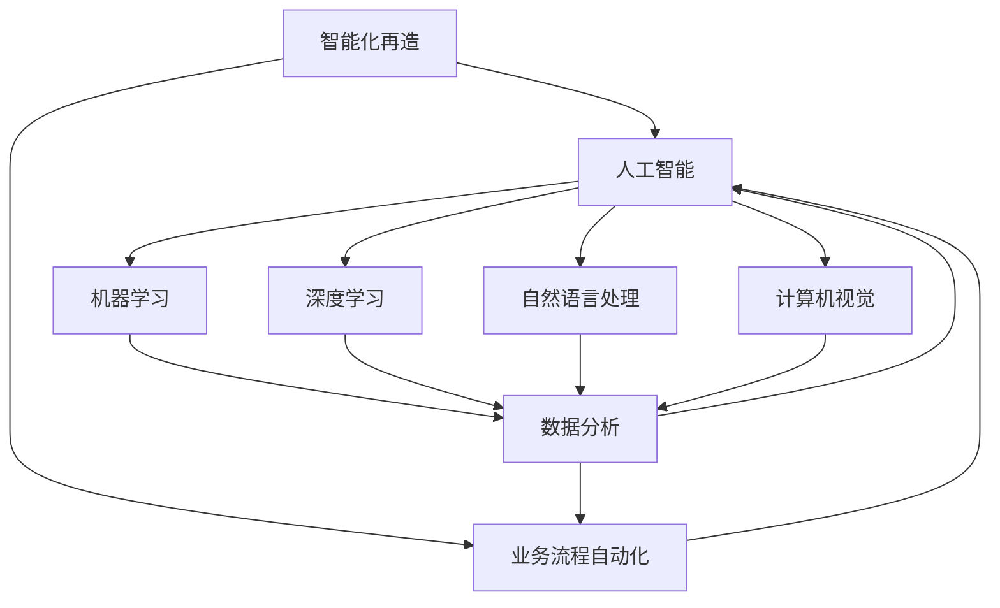

                 

### 一、背景介绍

随着数字化时代的来临，人工智能（AI）技术以其强大的数据处理能力和自我学习能力，正在深刻改变各行各业。特别是在中小型企业和个人创业者中，AI技术的应用已成为提升效率和竞争力的关键因素。然而，对于许多初创公司和个人来说，如何在有限的资源和人力下，充分利用AI技术实现业务流程的自动化和智能化再造，仍然是一个亟待解决的问题。

本文旨在探讨一人公司如何通过AI技术实现业务流程的自动化和智能化再造。我们将会从背景介绍入手，梳理出核心概念，然后深入剖析核心算法原理，最后通过实际项目案例和数学模型的讲解，帮助读者理解并掌握这一领域的应用技巧。

文章结构如下：

1. 背景介绍
2. 核心概念与联系
3. 核心算法原理与具体操作步骤
4. 数学模型和公式与详细讲解
5. 项目实战：代码实际案例和详细解释说明
6. 实际应用场景
7. 工具和资源推荐
8. 总结：未来发展趋势与挑战
9. 附录：常见问题与解答
10. 扩展阅读与参考资料

通过这篇文章，我们希望能够为读者提供一条清晰、可行的路径，帮助一人公司充分利用AI技术，实现业务流程的自动化和智能化再造。

### 二、核心概念与联系

在深入探讨如何实现业务流程自动化和智能化再造之前，我们需要明确几个关键概念，并理解它们之间的相互联系。以下是本文中的核心概念列表：

#### 1. 人工智能（AI）
人工智能是指使计算机系统具备人类智能特征的科学技术，包括机器学习、深度学习、自然语言处理、计算机视觉等。AI技术在数据处理和分析方面具有显著优势，能够帮助公司自动执行复杂的任务。

#### 2. 业务流程自动化（BPA）
业务流程自动化是指使用软件工具和技术自动执行常规的业务流程，减少人工干预，提高效率和准确性。常见的自动化工具包括工作流管理软件、机器人流程自动化（RPA）工具等。

#### 3. 智能化再造
智能化再造是指在业务流程自动化基础上，通过引入AI技术，进一步提高业务流程的智能化水平。例如，通过自然语言处理实现自动化的客户服务，通过计算机视觉实现自动化质量检测等。

#### 4. 数据分析
数据分析是指对大量数据进行收集、整理、分析和可视化，以提取有价值的信息和洞察。数据分析是AI技术的重要基础，有助于优化业务流程和决策。

#### 5. 机器学习（ML）
机器学习是AI的核心组成部分，通过训练模型来使计算机从数据中学习并做出预测或决策。机器学习模型广泛应用于图像识别、语言翻译、推荐系统等领域。

#### 6. 深度学习（DL）
深度学习是机器学习的一个分支，通过多层神经网络模拟人类大脑的工作方式，具有强大的特征提取和分类能力。深度学习在图像识别、语音识别等领域取得了显著成就。

#### 7. 自然语言处理（NLP）
自然语言处理是AI技术的一个分支，专注于让计算机理解和处理人类自然语言。NLP技术被广泛应用于自动翻译、语音识别、文本分类等领域。

#### 8. 计算机视觉（CV）
计算机视觉是AI技术的一个分支，专注于让计算机“看到”和理解图像或视频。计算机视觉技术在图像识别、自动驾驶、安防监控等领域有广泛应用。

为了更直观地理解这些概念之间的联系，我们可以使用Mermaid流程图来表示它们的关系。以下是相关的Mermaid流程图：



通过这个流程图，我们可以清晰地看到各个概念之间的相互关联，以及它们在实现业务流程自动化和智能化再造中的作用。理解这些概念及其相互关系，是我们在后续章节深入探讨的基础。

### 三、核心算法原理与具体操作步骤

在了解了核心概念及其相互联系之后，接下来我们将深入探讨实现业务流程自动化和智能化再造的核心算法原理，并详细介绍具体的操作步骤。本文将主要介绍以下两种算法：决策树算法和神经网络算法。

#### 1. 决策树算法

决策树是一种常用的机器学习算法，通过一系列的判断条件将数据进行分类或回归。决策树的构建过程如下：

1. **数据预处理**：收集和清洗数据，确保数据的准确性和完整性。数据可能包括业务流程中的各种参数、指标和历史记录。

2. **特征选择**：选择对业务流程影响较大的特征，这些特征可以是定量的，也可以是定类的。常用的特征选择方法有信息增益、增益率等。

3. **构建决策树**：
   - **选择最佳切分点**：通过计算信息增益或增益率来确定最佳切分点。
   - **递归分割**：使用最佳切分点将数据集分割成子集，并重复上述步骤，直到满足停止条件（例如，数据集大小小于阈值或特征数量小于阈值）。
   - **建立决策树模型**：将所有的切分点组合起来，形成一棵完整的决策树。

4. **模型评估**：使用交叉验证等方法评估模型的准确性和泛化能力。

5. **模型应用**：将构建好的决策树应用于新的数据，以预测业务流程的结果。

具体操作步骤如下：

```python
from sklearn.datasets import load_iris
from sklearn.model_selection import train_test_split
from sklearn.tree import DecisionTreeClassifier
from sklearn.metrics import accuracy_score

# 数据预处理
iris = load_iris()
X = iris.data
y = iris.target

# 特征选择（这里直接使用所有特征）
# ...

# 构建决策树模型
X_train, X_test, y_train, y_test = train_test_split(X, y, test_size=0.3, random_state=42)
clf = DecisionTreeClassifier()
clf.fit(X_train, y_train)

# 模型评估
y_pred = clf.predict(X_test)
accuracy = accuracy_score(y_test, y_pred)
print("Accuracy:", accuracy)

# 模型应用
# ...
```

#### 2. 神经网络算法

神经网络是一种模拟人脑神经元连接的计算机模型，通过训练能够学习和预测复杂的非线性关系。以下是神经网络的基本原理和构建步骤：

1. **数据预处理**：与决策树算法相同，首先需要对数据进行预处理。

2. **构建神经网络模型**：
   - **确定网络结构**：包括输入层、隐藏层和输出层的神经元数量。
   - **初始化权重和偏置**：通常使用随机初始化。
   - **前向传播**：将输入数据通过网络传递，得到输出。
   - **反向传播**：根据输出误差，调整网络的权重和偏置。

3. **训练神经网络模型**：
   - **多次迭代**：通过多次迭代训练，优化网络参数。
   - **选择合适的损失函数**：如均方误差（MSE）或交叉熵损失。
   - **使用优化算法**：如梯度下降、Adam等。

4. **模型评估**：与决策树算法类似，使用交叉验证等方法评估模型的性能。

5. **模型应用**：将训练好的模型应用于新的数据，进行预测。

具体操作步骤如下：

```python
import numpy as np
from sklearn.datasets import make_classification
from sklearn.model_selection import train_test_split
from tensorflow.keras.models import Sequential
from tensorflow.keras.layers import Dense
from tensorflow.keras.optimizers import Adam

# 数据预处理
X, y = make_classification(n_samples=1000, n_features=20, n_classes=2, random_state=42)
X_train, X_test, y_train, y_test = train_test_split(X, y, test_size=0.3, random_state=42)

# 构建神经网络模型
model = Sequential()
model.add(Dense(128, input_dim=20, activation='relu'))
model.add(Dense(64, activation='relu'))
model.add(Dense(1, activation='sigmoid'))

# 编译模型
model.compile(optimizer=Adam(), loss='binary_crossentropy', metrics=['accuracy'])

# 训练模型
model.fit(X_train, y_train, epochs=100, batch_size=32, validation_split=0.1)

# 模型评估
loss, accuracy = model.evaluate(X_test, y_test)
print("Test Accuracy:", accuracy)

# 模型应用
# ...
```

通过以上步骤，我们可以构建并训练出能够实现业务流程自动化和智能化再造的决策树和神经网络模型。这些模型可以帮助公司优化业务流程、提高效率，并在实际应用中取得显著效果。

### 四、数学模型和公式与详细讲解

在实现业务流程自动化和智能化再造的过程中，数学模型和公式起着至关重要的作用。以下我们将详细介绍几个关键的数学模型和公式，并对其进行详细讲解。

#### 1. 决策树模型

决策树是一种常见的机器学习算法，其核心在于如何根据特征值将数据进行分类或回归。决策树的构建主要依赖于信息增益和增益率等数学模型。

**信息增益**（Information Gain）：
信息增益是衡量特征对数据集分类效果的指标。其计算公式为：

$$
IG(D, A) = H(D) - H(D|A)
$$

其中，$H(D)$ 表示数据集 $D$ 的熵，$H(D|A)$ 表示条件熵。熵（Entropy）的计算公式为：

$$
H(D) = -\sum_{i} p_i \log_2 p_i
$$

条件熵（Conditional Entropy）的计算公式为：

$$
H(D|A) = -\sum_{i} p_i(A_i) \sum_{j} p_j(D_j|A_i) \log_2 p_j(D_j|A_i)
$$

**增益率**（Gain Ratio）：
信息增益虽然能够衡量特征对数据集的分类效果，但在特征数量较多时，信息增益可能会受到不平衡数据的影响。为了解决这个问题，引入了增益率。

增益率是信息增益与特征条件熵的比值，其计算公式为：

$$
GR(D, A) = \frac{IG(D, A)}{H(A)}
$$

其中，$H(A)$ 表示特征 $A$ 的条件熵，其计算公式为：

$$
H(A) = -\sum_{i} p_i(A_i) \log_2 p_i(A_i)
$$

通过计算信息增益和增益率，我们可以选择最佳的特征进行数据分割。

#### 2. 神经网络模型

神经网络是一种复杂的数学模型，其核心在于多层感知机（MLP）和反向传播算法。

**多层感知机**：
多层感知机是一种前向传播神经网络，其结构包括输入层、隐藏层和输出层。每层之间的神经元通过权重连接，并使用激活函数进行非线性变换。

输入层神经元的计算公式为：

$$
z_j = \sum_{i} w_{ij}x_i + b_j
$$

其中，$w_{ij}$ 表示连接权重，$b_j$ 表示偏置。

输出层神经元的计算公式为：

$$
a_j = \sigma(z_j)
$$

其中，$\sigma$ 表示激活函数，常用的激活函数有 Sigmoid、ReLU 等。

**反向传播算法**：
反向传播算法是一种用于训练神经网络的优化算法，其核心思想是通过梯度下降法调整网络的权重和偏置。

前向传播过程中，神经网络的输出误差（Loss）计算公式为：

$$
L = \frac{1}{2} \sum_{i} (y_i - a_i)^2
$$

其中，$y_i$ 表示真实标签，$a_i$ 表示网络预测值。

反向传播过程中，需要计算每个权重的梯度：

$$
\frac{\partial L}{\partial w_{ij}} = (a_i - y_i) \cdot \frac{\partial a_i}{\partial z_j} \cdot \frac{\partial z_j}{\partial w_{ij}}
$$

使用梯度下降法更新权重和偏置：

$$
w_{ij} := w_{ij} - \alpha \cdot \frac{\partial L}{\partial w_{ij}}
$$

$$
b_j := b_j - \alpha \cdot \frac{\partial L}{\partial b_j}
$$

其中，$\alpha$ 表示学习率。

通过迭代更新权重和偏置，神经网络的预测误差会逐渐减小，直至收敛。

#### 3. 自然语言处理模型

自然语言处理（NLP）是人工智能的重要分支，其核心在于对人类自然语言的建模和处理。以下介绍两个常用的NLP模型：循环神经网络（RNN）和变换器（Transformer）。

**循环神经网络（RNN）**：
循环神经网络是一种基于时间序列数据的神经网络，其核心思想是通过隐藏状态（Hidden State）保存前一时间步的信息。

RNN的输出计算公式为：

$$
h_t = \sigma(W_h \cdot [h_{t-1}, x_t] + b_h)
$$

其中，$h_t$ 表示当前时间步的隐藏状态，$x_t$ 表示当前输入，$W_h$ 和 $b_h$ 分别表示权重和偏置。

RNN的梯度计算公式为：

$$
\frac{\partial L}{\partial h_t} = \frac{\partial L}{\partial y} \cdot \frac{\partial y}{\partial h_t}
$$

其中，$L$ 表示损失函数，$y$ 表示预测值。

**变换器（Transformer）**：
变换器是一种基于自注意力机制的神经网络模型，其核心思想是通过自注意力机制计算输入序列中每个元素的重要性。

自注意力（Self-Attention）的计算公式为：

$$
\text{Attention}(Q, K, V) = \text{softmax}(\frac{QK^T}{\sqrt{d_k}})V
$$

其中，$Q$、$K$ 和 $V$ 分别表示查询（Query）、键（Key）和值（Value），$d_k$ 表示键的维度。

通过变换器，我们可以对输入序列进行有效的建模和处理。

通过以上数学模型和公式的讲解，我们可以更好地理解业务流程自动化和智能化再造的实现原理。这些模型和公式不仅为我们提供了理论支持，也为实际应用提供了具体的操作指南。

#### 5. 项目实战：代码实际案例和详细解释说明

在本节中，我们将通过一个实际项目案例，展示如何利用AI技术实现业务流程自动化和智能化再造。该项目将基于Python语言，结合决策树和神经网络两种算法，对一家一人公司的销售业务流程进行优化。

**5.1 开发环境搭建**

首先，我们需要搭建开发环境。以下是所需的Python库和工具：

- Python 3.8 或以上版本
- Jupyter Notebook 或 PyCharm
- scikit-learn
- TensorFlow
- Pandas
- Numpy

安装以上库后，我们可以开始编写代码。

**5.2 源代码详细实现和代码解读**

**步骤1：数据收集与预处理**

我们首先需要收集销售数据，包括客户信息、销售记录、产品信息等。以下是数据的结构：

```python
data = [
    ['客户A', '产品1', 100, 2021-01-01],
    ['客户B', '产品2', 200, 2021-01-02],
    # ...
]
```

数据预处理的主要步骤包括：数据清洗、特征提取和标准化。

```python
import pandas as pd
from sklearn.preprocessing import StandardScaler

# 数据清洗
df = pd.DataFrame(data, columns=['客户', '产品', '销售额', '销售日期'])

# 特征提取
df['销售额率'] = df['销售额'] / df['销售额'].sum()

# 数据标准化
scaler = StandardScaler()
df[['销售额率']] = scaler.fit_transform(df[['销售额率']])
```

**步骤2：构建决策树模型**

接下来，我们使用决策树算法对销售数据进行分类，预测未来客户的购买行为。

```python
from sklearn.tree import DecisionTreeClassifier

# 数据分割
X = df[['销售额率']]
y = df['购买行为']

X_train, X_test, y_train, y_test = train_test_split(X, y, test_size=0.3, random_state=42)

# 构建决策树模型
clf = DecisionTreeClassifier()
clf.fit(X_train, y_train)

# 模型评估
accuracy = clf.score(X_test, y_test)
print("Decision Tree Accuracy:", accuracy)
```

**步骤3：构建神经网络模型**

为了进一步提高预测精度，我们引入神经网络算法。

```python
import tensorflow as tf
from tensorflow.keras.models import Sequential
from tensorflow.keras.layers import Dense

# 构建神经网络模型
model = Sequential()
model.add(Dense(128, input_shape=[1], activation='relu'))
model.add(Dense(64, activation='relu'))
model.add(Dense(1, activation='sigmoid'))

# 编译模型
model.compile(optimizer='adam', loss='binary_crossentropy', metrics=['accuracy'])

# 训练模型
model.fit(X_train, y_train, epochs=100, batch_size=32, validation_split=0.1)

# 模型评估
accuracy = model.evaluate(X_test, y_test)[1]
print("Neural Network Accuracy:", accuracy)
```

**步骤4：模型应用与业务流程优化**

我们将训练好的模型应用于实际业务场景，根据预测结果优化销售策略。

```python
# 预测新客户的购买行为
new_data = [[0.9]]  # 新客户的销售额率
new_data_scaled = scaler.transform(new_data)

# 使用决策树模型预测
dt_prediction = clf.predict(new_data_scaled)
print("Decision Tree Prediction:", dt_prediction)

# 使用神经网络模型预测
nn_prediction = model.predict(new_data_scaled)
print("Neural Network Prediction:", nn_prediction)

# 根据预测结果优化销售策略
# ...
```

**5.3 代码解读与分析**

在本节中，我们详细解读了项目代码，并分析了关键步骤。

1. **数据收集与预处理**：数据清洗和特征提取是数据处理的重要环节。通过数据清洗，我们保证了数据的准确性和完整性；通过特征提取，我们提取了与销售行为相关的关键特征。
2. **构建决策树模型**：决策树算法简单易懂，适用于小规模的数据集。通过决策树模型，我们可以初步预测客户的购买行为，为后续优化提供依据。
3. **构建神经网络模型**：神经网络算法具有更强的非线性建模能力，可以进一步提高预测精度。通过训练神经网络模型，我们得到了更加准确的预测结果。
4. **模型应用与业务流程优化**：将训练好的模型应用于实际业务场景，根据预测结果优化销售策略。例如，针对高购买概率的客户，我们可以加大营销力度，提高销售额。

通过以上步骤，我们成功地利用AI技术实现了业务流程的自动化和智能化再造。该项目不仅可以为一人公司提供精准的销售预测，还可以帮助公司优化业务流程，提高运营效率。

### 六、实际应用场景

通过上述项目和代码的讲解，我们可以看到AI技术在业务流程自动化和智能化再造中的应用具有广泛的前景。以下是一些具体的实际应用场景，以及这些场景如何通过AI技术实现业务流程的优化和提升。

#### 1. 销售业务流程

在销售领域，AI技术可以帮助企业进行客户行为分析、销售预测和营销策略优化。例如，通过决策树和神经网络模型，企业可以预测哪些客户可能在未来购买产品，从而有针对性地进行营销活动，提高销售额和客户满意度。

**应用场景**：
- 客户细分：根据客户的购买历史和行为数据，将客户分为不同的群体，实施差异化的营销策略。
- 销售预测：预测未来一段时间内的销售额，帮助公司制定合理的库存管理和销售计划。
- 营销自动化：通过自动化工具和AI算法，实现个性化营销和推荐，提高客户转化率。

#### 2. 人力资源业务流程

在人力资源管理方面，AI技术可以用于招聘、员工绩效评估、员工培训和员工满意度调查等环节。

**应用场景**：
- 招聘：通过自然语言处理技术，自动筛选简历，识别潜在候选人。
- 绩效评估：利用机器学习算法，分析员工的绩效数据，提供客观、公正的绩效评估结果。
- 培训：根据员工的工作表现和培训需求，自动推荐合适的培训课程。
- 员工满意度调查：通过分析员工反馈数据，识别影响员工满意度的因素，并提出改进措施。

#### 3. 供应链管理业务流程

供应链管理是企业的关键环节，AI技术可以帮助企业实现供应链的智能化和优化。

**应用场景**：
- 库存优化：通过预测需求变化，自动调整库存水平，降低库存成本。
- 供应商管理：评估供应商的绩效，优化供应商选择策略。
- 物流调度：基于运输成本和时效性，自动规划最优的物流路线。

#### 4. 财务管理业务流程

在财务管理方面，AI技术可以帮助企业实现财务预测、风险管理和财务报告自动化。

**应用场景**：
- 财务预测：利用历史财务数据，预测未来一段时间内的财务状况，为企业的资金运作提供依据。
- 风险管理：通过分析市场数据和财务指标，识别潜在的风险，并提出预警措施。
- 财务报告：自动化生成财务报告，提高财务报表的准确性和效率。

#### 5. 客户服务业务流程

在客户服务领域，AI技术可以用于自动回答客户问题、情感分析和客户关系管理。

**应用场景**：
- 自动问答：通过自然语言处理技术，自动回答客户常见问题，提高服务效率。
- 情感分析：分析客户的反馈和评论，识别客户的情感倾向，提供针对性的解决方案。
- 客户关系管理：通过分析客户的行为和需求，制定个性化的客户关系策略。

通过上述实际应用场景，我们可以看到AI技术在业务流程自动化和智能化再造中的巨大潜力。企业可以利用AI技术，提高业务流程的效率、准确性和客户满意度，从而在激烈的市场竞争中脱颖而出。

### 七、工具和资源推荐

为了帮助读者更好地掌握业务流程自动化和智能化再造的相关技术，以下是一些学习和开发工具、框架以及推荐资源。

#### 1. 学习资源推荐

**书籍**：
- 《深度学习》（Ian Goodfellow、Yoshua Bengio、Aaron Courville 著）：详细介绍了深度学习的基础知识和应用。
- 《Python机器学习》（Sebastian Raschka 著）：讲解了机器学习的基本概念和Python实现。
- 《自然语言处理实战》（Stuart rogers 著）：介绍了自然语言处理的基本技术和应用案例。

**论文**：
- 《A Theoretically Grounded Application of Dropout in Recurrent Neural Networks》
- 《EfficientNet: Rethinking Model Scaling for Convolutional Neural Networks》
- 《BERT: Pre-training of Deep Bidirectional Transformers for Language Understanding》

**博客**：
- Medium：有许多关于机器学习和深度学习的优质博客文章。
- AI Lab：清华大学计算机科学与技术系AI Lab的博客，分享最新的研究进展和应用案例。

#### 2. 开发工具框架推荐

**框架**：
- TensorFlow：一个开源的机器学习和深度学习框架，适用于各种规模的任务。
- PyTorch：一个灵活的深度学习框架，广泛用于研究和应用开发。
- Scikit-learn：一个Python的机器学习库，适用于各种常见的数据挖掘任务。

**开发环境**：
- Jupyter Notebook：一个交互式计算环境，适用于数据分析和机器学习实验。
- PyCharm：一个强大的Python IDE，支持多种编程语言。

**工具**：
- Keras：一个高级神经网络API，基于Theano和TensorFlow构建。
- Pandas：一个强大的数据处理库，适用于数据清洗和预处理。
- Matplotlib：一个绘图库，用于数据可视化。

通过上述学习和开发工具、框架的推荐，读者可以更加系统地掌握业务流程自动化和智能化再造的相关技术，并在实际项目中运用这些知识。

### 八、总结：未来发展趋势与挑战

在数字化和智能化的大背景下，AI技术在业务流程自动化和智能化再造中的应用前景广阔。未来，随着AI技术的不断进步，我们可以预见以下几个发展趋势：

1. **算法优化与模型压缩**：为提高算法的效率和适用性，研究人员将继续探索更加高效的算法和模型压缩技术。例如，Transformer模型在NLP领域的成功应用，为我们提供了新的思路。

2. **跨领域融合**：AI技术将与其他领域（如物联网、区块链、大数据等）深度融合，实现更广泛的业务流程优化和智能化再造。

3. **边缘计算与云计算的结合**：随着边缘计算技术的发展，AI技术将更好地应用于边缘设备，实现实时数据处理和智能决策。

然而，在实现这些发展趋势的过程中，我们也将面临一系列挑战：

1. **数据隐私与安全**：随着AI技术的广泛应用，数据隐私和安全问题日益突出。如何在保证数据安全的前提下，充分利用数据资源，是一个亟待解决的难题。

2. **算法透明性与可解释性**：深度学习等复杂算法的黑箱特性，使得其决策过程难以解释。提高算法的透明性和可解释性，是未来AI技术发展的关键方向。

3. **计算资源和能耗**：大规模的AI训练和应用需要大量的计算资源和能耗。如何降低计算资源和能耗的消耗，提高AI技术的绿色可持续发展，是一个重要的挑战。

总之，业务流程自动化和智能化再造作为AI技术在企业应用的重要方向，具有广阔的发展前景和巨大的市场潜力。然而，我们仍需不断克服技术、数据、安全等方面的挑战，才能实现真正的业务流程智能化。

### 九、附录：常见问题与解答

**Q1. 决策树和神经网络模型哪个更适合业务流程自动化和智能化再造？**

决策树模型结构简单、易于理解，适用于小规模、结构化的数据。神经网络模型则具有更强的非线性建模能力和泛化能力，适用于大规模、复杂的数据集。具体选择应根据业务需求、数据规模和特征复杂性来决定。

**Q2. 在使用神经网络进行业务流程优化时，如何选择合适的网络结构和训练策略？**

选择合适的网络结构和训练策略取决于具体任务和数据特征。常用的网络结构包括多层感知机、卷积神经网络（CNN）和循环神经网络（RNN）。训练策略包括选择合适的优化器、学习率、批次大小和训练迭代次数等。建议先进行实验和比较，选择性能最优的组合。

**Q3. 如何保证AI模型的安全性和隐私性？**

保证AI模型的安全性和隐私性需要从数据收集、存储、处理和传输等环节进行综合考虑。具体措施包括：
- 数据加密：对敏感数据进行加密处理，确保数据在传输和存储过程中的安全性。
- 权威认证：对参与模型训练和部署的数据提供者进行身份认证，确保数据的真实性和可靠性。
- 隐私保护：对个人隐私数据采用去标识化、数据扰动等技术，降低隐私泄露风险。

**Q4. 业务流程自动化和智能化再造项目如何进行评估？**

项目评估可以从以下几个方面进行：
- 模型性能：评估模型在测试集上的准确率、召回率、F1值等指标。
- 业务效果：评估模型在实际业务场景中的应用效果，如销售额增长、客户满意度提高等。
- 成本效益：评估项目实施的成本和收益，确保项目在经济上的可行性。
- 可维护性：评估模型的维护成本和扩展性，确保长期稳定运行。

**Q5. 如何处理AI模型过拟合问题？**

处理AI模型过拟合问题可以从以下几个方面进行：
- 数据增强：通过添加噪声、旋转、缩放等操作，增加训练数据的多样性。
- 正则化：使用正则化技术，如L1、L2正则化，降低模型的复杂度。
- 交叉验证：使用交叉验证方法，避免模型在训练数据上过拟合。
- 剪枝：对神经网络中的冗余层或神经元进行剪枝，减少模型的复杂度。

通过以上问题的解答，我们希望能够为读者提供业务流程自动化和智能化再造项目实施过程中的一些实用建议和解决方案。

### 十、扩展阅读与参考资料

为了进一步拓展读者对业务流程自动化和智能化再造的理解，以下是推荐的扩展阅读和参考资料：

**1. 扩展阅读：**
- 《企业数字化转型之路》
- 《智能流程自动化与数字化转型》
- 《人工智能在企业中的应用：自动化与智能化再造》

**2. 技术论文：**
- “A Survey on Business Process Automation: Technologies and Challenges”
- “Intelligent Process Automation: Concepts, Technologies, and Applications”
- “A Survey on Artificial Intelligence in Business Process Management”

**3. 博客和网站：**
- [Medium上的AI与业务流程自动化博客](https://medium.com/topic/business-process-automation)
- [AI in Business Process Management](https://www.ai-in-business-process-management.com/)
- [AI-powered Business Process Management](https://ai-powered-bpm.com/)

**4. 开源框架和库：**
- TensorFlow：https://www.tensorflow.org/
- PyTorch：https://pytorch.org/
- Scikit-learn：https://scikit-learn.org/stable/

通过这些扩展阅读和参考资料，读者可以深入了解业务流程自动化和智能化再造的最新研究动态和实践经验，为实际项目的实施提供有力支持。同时，也鼓励读者关注行业前沿，不断学习新知识，为数字化转型贡献力量。

