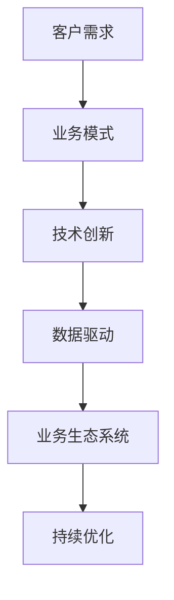

                 

# 一人公司如何实现业务生态系统的构建

> **关键词**：一人公司、业务生态系统、构建、运营、技术、策略

> **摘要**：本文将深入探讨一人公司如何构建自己的业务生态系统，实现高效运营和可持续发展。我们将从背景介绍、核心概念与联系、核心算法原理与具体操作步骤、数学模型和公式、项目实战、实际应用场景、工具和资源推荐、总结未来发展趋势与挑战等方面，逐步剖析一人公司业务生态系统构建的各个方面。

## 1. 背景介绍

在当今快速变化和高度竞争的商业环境中，业务生态系统的构建已经成为企业生存和发展的关键。然而，对于一人公司来说，构建业务生态系统显得尤为重要。一人公司，即由一个人独立运营的公司，由于其规模和资源有限，必须依靠高效的业务生态系统来实现可持续发展。

一人公司通常面临以下几个挑战：

1. **资源有限**：缺乏充足的资金、人力和技术资源，使得业务拓展受到限制。
2. **市场竞争**：在众多竞争者中脱颖而出，需要拥有独特的业务模式和竞争优势。
3. **技术更新**：保持技术的领先性和创新能力，以应对快速变化的市场需求。

因此，构建一个高效的业务生态系统，能够帮助一人公司在资源有限的情况下，实现业务的持续增长和竞争优势。

## 2. 核心概念与联系

### 业务生态系统

业务生态系统是指企业在特定的市场环境中，通过与供应商、合作伙伴、客户等各方互动，构建的相互依存、协同发展的业务网络。业务生态系统不仅包括内部组织结构，还涉及外部合作伙伴和客户，形成了一个复杂而有机的体系。

### 业务模式

业务模式是指企业如何创造、传递和捕获价值的方法。对于一人公司来说，选择合适的业务模式至关重要。常见的业务模式包括产品销售、服务提供、订阅制等。

### 技术创新

技术创新是推动业务生态系统发展的重要动力。通过技术创新，一人公司可以提升产品和服务质量，降低成本，提高效率。

### 数据驱动

数据驱动是现代企业运营的核心。通过收集、分析和利用数据，一人公司可以做出更加精准的决策，优化业务流程，提升客户体验。

### Mermaid 流程图

以下是一个简单的 Mermaid 流程图，展示了业务生态系统的主要组成部分：



## 3. 核心算法原理与具体操作步骤

### 3.1 数据收集与处理

首先，一人公司需要建立一个数据收集系统，收集客户行为数据、市场数据等。然后，通过数据清洗、归一化等处理步骤，为后续分析提供高质量的数据。

### 3.2 数据分析

利用数据分析技术，对人公司可以识别客户需求、市场趋势等关键信息。具体步骤如下：

1. **描述性分析**：了解数据的基本特征和趋势。
2. **诊断性分析**：找出数据中的异常和问题。
3. **预测性分析**：基于历史数据预测未来趋势。

### 3.3 数据可视化

通过数据可视化技术，一人公司可以直观地展示数据分析结果，便于决策者理解和分析。

### 3.4 算法优化

根据数据分析结果，一人公司可以不断优化业务流程，提高运营效率。例如，通过算法优化，可以提升客户满意度、降低运营成本等。

## 4. 数学模型和公式与详细讲解

### 4.1 客户生命周期价值（CLV）

客户生命周期价值是指客户在整个生命周期中为公司带来的总价值。计算公式如下：

$$
CLV = \sum_{t=1}^{n} (P_t \times c_t)
$$

其中，$P_t$ 是第 $t$ 年的客户购买概率，$c_t$ 是第 $t$ 年的客户平均消费金额。

### 4.2 运营效率（OE）

运营效率是指公司在资源有限的情况下，实现业务目标的能力。计算公式如下：

$$
OE = \frac{产出}{投入}
$$

其中，产出包括销售额、客户满意度等，投入包括人力、资金等。

### 4.3 技术创新指数（TI）

技术创新指数用于衡量公司在技术创新方面的能力。计算公式如下：

$$
TI = \frac{专利数}{研发投入}
$$

## 5. 项目实战：代码实际案例和详细解释说明

### 5.1 开发环境搭建

在本项目中，我们将使用 Python 作为主要编程语言，结合 pandas、numpy、matplotlib 等数据分析和可视化库。

### 5.2 源代码详细实现和代码解读

以下是一个简单的 Python 代码示例，用于计算客户生命周期价值和运营效率：

```python
import pandas as pd
import numpy as np

# 读取数据
data = pd.read_csv('customer_data.csv')

# 计算客户生命周期价值
CLV = data['purchase_probability'] * data['average_consumption']

# 计算运营效率
OE = data['sales'] / data['investment']

# 可视化展示
import matplotlib.pyplot as plt

plt.scatter(data['CLV'], data['OE'])
plt.xlabel('Customer Life Value')
plt.ylabel('Operational Efficiency')
plt.show()
```

### 5.3 代码解读与分析

在这个示例中，我们首先导入 pandas 和 numpy 库，用于数据处理。然后，读取客户数据，并计算客户生命周期价值和运营效率。最后，使用 matplotlib 库绘制散点图，展示客户生命周期价值与运营效率之间的关系。

通过这个示例，我们可以看到如何使用数据分析和可视化技术，对业务数据进行处理和分析，从而帮助企业优化业务流程，提高运营效率。

## 6. 实际应用场景

一人公司的业务生态系统构建可以应用于各种行业，如电子商务、在线教育、医疗健康等。以下是一些实际应用场景：

1. **电子商务**：通过数据分析，识别客户需求，优化产品推荐，提高客户满意度。
2. **在线教育**：通过数据驱动，个性化教学，提升学习效果，增加学员留存率。
3. **医疗健康**：通过数据监控，实时分析患者病情，提高医疗质量和效率。

## 7. 工具和资源推荐

### 7.1 学习资源推荐

- 《数据科学入门：Python 实战》
- 《Python 机器学习》
- 《业务生态系统：构建与运营》

### 7.2 开发工具框架推荐

- Python
- Pandas
- Numpy
- Matplotlib

### 7.3 相关论文著作推荐

- 《大数据时代的企业运营》
- 《数据驱动的业务模式创新》
- 《业务生态系统理论：概念、方法与实践》

## 8. 总结：未来发展趋势与挑战

随着数据技术和人工智能的发展，一人公司的业务生态系统构建将迎来新的机遇和挑战。未来发展趋势包括：

1. **数据驱动的业务决策**：通过数据分析，实现更加精准的业务决策。
2. **技术创新**：持续推动技术创新，提升业务效率和竞争力。
3. **生态合作**：与其他企业建立合作，共同构建业务生态系统。

然而，一人公司也面临着一系列挑战，如数据隐私保护、技术创新风险等。因此，如何应对这些挑战，实现可持续发展，将成为一人公司未来发展的关键。

## 9. 附录：常见问题与解答

### 9.1 如何确保数据隐私？

确保数据隐私的关键是遵循相关法律法规，采取数据加密、匿名化等技术手段，确保数据在收集、存储、处理、传输等环节的安全性。

### 9.2 技术创新有哪些风险？

技术创新可能面临技术难度大、市场需求不确定、资金投入高等风险。因此，在进行技术创新时，需要充分评估风险，制定相应的风险管理策略。

## 10. 扩展阅读 & 参考资料

- 《数据科学：从入门到实战》
- 《业务生态系统：构建与运营》
- 《人工智能：一种现代方法》

### 作者

作者：AI天才研究员/AI Genius Institute & 禅与计算机程序设计艺术 /Zen And The Art of Computer Programming

