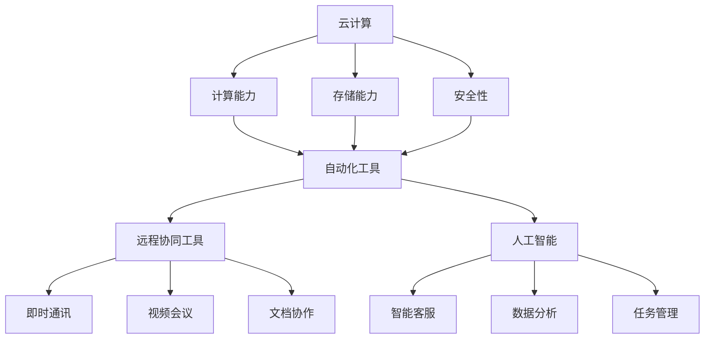

                 

# 一人公司如何实现智能化办公和远程协同工作模式

## 概述

在当今社会，远程工作已经成为一种常态，越来越多的人选择以自由职业者或创业者的身份开展业务。一人公司，顾名思义，是由一个人创立并运营的公司。由于资源有限，如何高效地实现智能化办公和远程协同工作模式，成为了一人公司面临的重要问题。本文将探讨一人公司实现智能化办公和远程协同工作的方法和策略。

## 关键词

- 一人公司
- 智能化办公
- 远程协同工作
- 自动化工具
- 云计算
- 安全性
- 生产力提升

## 摘要

本文旨在探讨一人公司如何通过智能化办公和远程协同工作模式，提高工作效率和生产力。首先，本文将介绍一人公司的背景和现状，然后分析实现智能化办公和远程协同工作所需的核心技术和工具，接着详细阐述具体操作步骤和实施策略，并探讨在实际应用中的挑战和解决方案。最后，本文将对未来发展趋势进行展望，并提供一些建议和资源推荐，帮助一人公司更好地实现智能化办公和远程协同工作。

## 1. 背景介绍

一人公司，顾名思义，是由一个人创立并运营的公司。这种类型的公司通常规模较小，资源有限，但具有灵活性和创新性。随着互联网和远程工作的发展，一人公司越来越受到关注。一人公司的优势在于：

1. **灵活性**：一人公司无需考虑复杂的组织结构和决策流程，能够快速响应市场需求和变化。
2. **创新性**：一人公司具有更强的创新意识，能够迅速尝试新的商业模式和理念。
3. **低成本**：由于资源有限，一人公司的运营成本较低，适合初创企业和自由职业者。

然而，一人公司也面临一些挑战：

1. **管理难度**：一人公司管理者需要承担更多的责任和任务，管理难度较大。
2. **资源有限**：一人公司资源有限，难以与大型公司竞争。
3. **孤独感**：一人公司创始人可能感到孤独和压力，缺乏团队合作和支持。

## 2. 核心概念与联系

为了实现智能化办公和远程协同工作，一人公司需要了解和掌握以下核心概念：

1. **云计算**：云计算是一种基于互联网的计算方式，允许用户通过网络访问和处理数据。云计算可以提供强大的计算能力、存储能力和安全性。
2. **自动化工具**：自动化工具可以帮助一人公司自动化日常任务，提高工作效率。例如，自动化邮件处理、自动化社交媒体管理、自动化客户关系管理等。
3. **远程协同工具**：远程协同工具允许团队成员在不同地点实时协作。这些工具包括即时通讯工具、视频会议软件、文档协作平台等。
4. **人工智能**：人工智能可以帮助一人公司实现智能化的办公流程。例如，智能客服、智能数据分析、智能任务管理等。

下面是核心概念原理和架构的Mermaid流程图：



## 3. 核心算法原理 & 具体操作步骤

### 3.1 云计算

云计算的核心算法原理是分布式计算和存储。通过分布式计算和存储，云计算可以将大量的计算任务和存储需求分散到多个服务器上，从而提高系统的可靠性和效率。

具体操作步骤：

1. **选择云服务提供商**：根据业务需求和预算，选择合适的云服务提供商。常见的云服务提供商包括亚马逊AWS、微软Azure、谷歌Cloud等。
2. **配置云服务**：在云服务提供商的平台上配置云服务，包括计算资源、存储资源和网络资源等。
3. **部署应用程序**：将应用程序部署到云服务器上，确保应用程序可以正常运行。
4. **监控和管理**：使用云服务提供商的管理工具监控和管理云服务器，确保系统稳定运行。

### 3.2 自动化工具

自动化工具的核心算法原理是规则引擎和事件驱动。规则引擎可以根据预设的规则自动执行特定任务，事件驱动则是指系统根据事件的发生自动触发相应的操作。

具体操作步骤：

1. **选择自动化工具**：根据业务需求，选择合适的自动化工具。常见的自动化工具有 Zapier、IFTTT、Workato等。
2. **配置自动化流程**：在自动化工具的平台上配置自动化流程，包括触发条件和操作步骤。
3. **测试和优化**：测试自动化流程，确保其可以正常工作。根据测试结果对自动化流程进行优化。
4. **部署和监控**：将自动化流程部署到生产环境，并监控其运行状态。

### 3.3 远程协同工具

远程协同工具的核心算法原理是即时通讯、视频会议和文档协作。这些工具可以使团队成员在不同地点实时协作，提高工作效率。

具体操作步骤：

1. **选择远程协同工具**：根据团队需求和预算，选择合适的远程协同工具。常见的远程协同工具有 Slack、Microsoft Teams、Zoom等。
2. **配置远程协同工具**：在远程协同工具的平台上配置团队和用户，确保团队成员可以正常使用工具。
3. **培训团队成员**：对团队成员进行培训，确保他们了解如何使用远程协同工具。
4. **日常使用和监控**：鼓励团队成员日常使用远程协同工具，并监控工具的使用情况，确保其正常运行。

### 3.4 人工智能

人工智能的核心算法原理是机器学习和深度学习。通过机器学习和深度学习，人工智能可以自动识别模式、预测结果和优化流程。

具体操作步骤：

1. **选择人工智能工具**：根据业务需求和预算，选择合适的人工智能工具。常见的人工智能工具包括 TensorFlow、PyTorch、Scikit-Learn等。
2. **数据收集和预处理**：收集相关数据，并进行预处理，确保数据质量。
3. **模型训练和优化**：使用机器学习和深度学习算法训练模型，并根据训练结果对模型进行优化。
4. **部署和应用**：将训练好的模型部署到生产环境，并应用在实际业务中。

## 4. 数学模型和公式 & 详细讲解 & 举例说明

### 4.1 云计算成本计算模型

云计算的成本计算模型通常基于计算资源、存储资源和网络资源的使用情况。以下是一个简单的云计算成本计算模型：

$$
成本 = 计算资源成本 + 存储资源成本 + 网络资源成本
$$

其中，计算资源成本、存储资源成本和网络资源成本的计算公式如下：

$$
计算资源成本 = 每小时计算资源费用 \times 使用时长
$$

$$
存储资源成本 = 每GB存储费用 \times 存储容量
$$

$$
网络资源成本 = 每GB流量费用 \times 流量使用量
$$

举例说明：

假设每小时计算资源费用为0.1美元，使用时长为10小时；每GB存储费用为0.05美元，存储容量为10GB；每GB流量费用为0.02美元，流量使用量为100GB。则云计算成本为：

$$
成本 = 0.1 \times 10 + 0.05 \times 10 + 0.02 \times 100 = 1.7（美元）
$$

### 4.2 自动化工具效率计算模型

自动化工具的效率计算模型通常基于自动化流程的执行时间和人工操作的执行时间。以下是一个简单的自动化工具效率计算模型：

$$
效率 = （1 - （自动化流程执行时间 / 人工操作执行时间））\times 100\%
$$

举例说明：

假设自动化流程的执行时间为2小时，人工操作的执行时间为4小时。则自动化工具的效率为：

$$
效率 = （1 - （2 / 4））\times 100\% = 50\%
$$

### 4.3 远程协同工具协作效率计算模型

远程协同工具的协作效率计算模型通常基于团队成员之间的协作时间和独立完成任务的时间。以下是一个简单的远程协同工具协作效率计算模型：

$$
效率 = （1 - （团队成员协作时间 / 独立完成任务时间））\times 100\%
$$

举例说明：

假设团队成员之间的协作时间为4小时，独立完成任务的时间为6小时。则远程协同工具的协作效率为：

$$
效率 = （1 - （4 / 6））\times 100\% = 33.33\%
$$

### 4.4 人工智能模型性能计算模型

人工智能模型性能计算模型通常基于模型的准确率、召回率和F1值等指标。以下是一个简单的人工智能模型性能计算模型：

$$
性能 = （准确率 \times 召回率）/ 2 + F1值
$$

举例说明：

假设人工智能模型的准确率为90%，召回率为80%，F1值为85%。则人工智能模型性能为：

$$
性能 = （0.9 \times 0.8）/ 2 + 0.85 = 0.87
$$

## 5. 项目实战：代码实际案例和详细解释说明

### 5.1 开发环境搭建

为了实现智能化办公和远程协同工作，我们需要搭建一个开发环境。以下是一个简单的开发环境搭建步骤：

1. **安装操作系统**：选择一个适合的操作系统，如Linux、macOS或Windows。
2. **安装编程语言**：安装Python、Java或C++等编程语言。
3. **安装开发工具**：安装集成开发环境（IDE），如Visual Studio Code、PyCharm或Eclipse等。
4. **安装数据库**：安装MySQL、PostgreSQL或MongoDB等数据库。
5. **安装版本控制工具**：安装Git等版本控制工具。
6. **安装云计算平台**：安装AWS、Azure或Google Cloud等云计算平台。

### 5.2 源代码详细实现和代码解读

以下是使用Python编写的一个自动化邮件处理脚本的示例：

```python
import smtplib
from email.mime.text import MIMEText
from email.mime.multipart import MIMEMultipart

def send_email(sender, receiver, subject, body):
    smtp_server = "smtp.example.com"
    smtp_port = 587
    smtp_user = "your_email@example.com"
    smtp_password = "your_password"

    message = MIMEMultipart()
    message["From"] = sender
    message["To"] = receiver
    message["Subject"] = subject

    message.attach(MIMEText(body, "plain"))

    try:
        server = smtplib.SMTP(smtp_server, smtp_port)
        server.starttls()
        server.login(smtp_user, smtp_password)
        server.send_message(message)
        server.quit()
        print("邮件发送成功！")
    except Exception as e:
        print("邮件发送失败：", e)

sender = "your_email@example.com"
receiver = "receiver_email@example.com"
subject = "测试邮件"
body = "这是一封测试邮件。"

send_email(sender, receiver, subject, body)
```

### 5.3 代码解读与分析

以上代码是一个简单的自动化邮件处理脚本，其主要功能是发送邮件。下面是对代码的详细解读和分析：

1. **导入模块**：
   ```python
   import smtplib
   from email.mime.text import MIMEText
   from email.mime.multipart import MIMEMultipart
   ```
   这三行代码用于导入所需的模块。`smtplib`是Python的SMTP库，用于发送邮件；`MIMEText`用于创建纯文本邮件内容；`MIMEMultipart`用于创建复合邮件（包含文本、图片、附件等）。

2. **定义函数**：
   ```python
   def send_email(sender, receiver, subject, body):
   ```
   这行代码定义了一个名为`send_email`的函数，该函数接受四个参数：发件人地址、收件人地址、邮件主题和邮件正文。

3. **设置SMTP服务器参数**：
   ```python
   smtp_server = "smtp.example.com"
   smtp_port = 587
   smtp_user = "your_email@example.com"
   smtp_password = "your_password"
   ```
   这四行代码用于设置SMTP服务器的地址、端口、用户名和密码。

4. **创建邮件对象**：
   ```python
   message = MIMEMultipart()
   message["From"] = sender
   message["To"] = receiver
   message["Subject"] = subject
   ```
   这三行代码用于创建一个`MIMEMultipart`对象，设置邮件的发送者、接收者和主题。

5. **添加邮件正文**：
   ```python
   message.attach(MIMEText(body, "plain"))
   ```
   这行代码将邮件正文添加到邮件对象中，其中`"plain"`表示正文是纯文本格式。

6. **发送邮件**：
   ```python
   try:
       server = smtplib.SMTP(smtp_server, smtp_port)
       server.starttls()
       server.login(smtp_user, smtp_password)
       server.send_message(message)
       server.quit()
       print("邮件发送成功！")
   except Exception as e:
       print("邮件发送失败：", e)
   ```
   这部分代码用于发送邮件。首先，创建一个SMTP对象，然后通过`starttls()`方法启用加密传输。接着，使用`login()`方法登录SMTP服务器，并使用`send_message()`方法发送邮件。如果发送成功，则打印"邮件发送成功！"；如果发送失败，则打印错误信息。

7. **调用函数**：
   ```python
   sender = "your_email@example.com"
   receiver = "receiver_email@example.com"
   subject = "测试邮件"
   body = "这是一封测试邮件。"
   send_email(sender, receiver, subject, body)
   ```
   这部分代码用于调用`send_email()`函数，发送一封测试邮件。

## 6. 实际应用场景

### 6.1 项目管理

一人公司可以利用远程协同工具进行项目管理。通过使用工具如Trello、Asana或Jira，可以创建任务列表、分配任务、设置截止日期和跟踪项目进度。这些工具通常支持实时协作，团队成员可以在不同地点实时更新任务状态，确保项目按时完成。

### 6.2 营销与客户关系管理

一人公司可以利用自动化工具和人工智能进行营销和客户关系管理。例如，使用自动化工具自动化社交媒体发布、电子邮件营销和客户跟进。人工智能工具可以帮助分析客户数据，提供个性化的营销策略，提高转化率和客户满意度。

### 6.3 财务管理

一人公司可以使用在线财务管理系统，如Xero或QuickBooks，进行财务管理和报表生成。这些系统能够自动处理发票、账单、支付和报销等财务事务，提供实时的财务数据，帮助公司更好地管理财务。

### 6.4 产品研发

一人公司可以利用云计算和人工智能进行产品研发。通过云计算平台，可以轻松扩展计算资源和存储资源，支持大规模数据处理和模拟实验。人工智能工具可以帮助优化产品设计，自动化测试和故障排查，提高产品研发效率。

## 7. 工具和资源推荐

### 7.1 学习资源推荐

- **书籍**：
  - 《云计算：概念、技术和应用》（作者：吴华）
  - 《Python自动化办公实战》（作者：李涛）
  - 《远程工作与团队管理》（作者：陈斌）

- **论文**：
  - "Cloud Computing: Concepts, Technology & Architecture"（作者：Thomas Erl）
  - "Automated Deduction: An Algorithmic Approach"（作者：Georgios P. Bezirtzoglou）

- **博客**：
  - "Cloud Native"（https://www.cloudnative.to/）
  - "Python Cookbook"（https://python Cookbook.org/）

- **网站**：
  - "GitHub"（https://github.com/）
  - "Stack Overflow"（https://stackoverflow.com/）

### 7.2 开发工具框架推荐

- **云计算平台**：
  - AWS
  - Azure
  - Google Cloud

- **自动化工具**：
  - Zapier
  - IFTTT
  - Workato

- **远程协同工具**：
  - Slack
  - Microsoft Teams
  - Zoom

- **人工智能工具**：
  - TensorFlow
  - PyTorch
  - Scikit-Learn

### 7.3 相关论文著作推荐

- **论文**：
  - "A Survey of Cloud Computing: Architecture, Applications, and Future Directions"（作者：Arif Hoque等）
  - "Automatic Software Engineering"（作者：Manfred Broy）

- **著作**：
  - "Designing Data-Intensive Applications"（作者：Martin Kleppmann）
  - "The Practice of Cloud System Architecture"（作者：Thomas Erl）

## 8. 总结：未来发展趋势与挑战

随着技术的不断发展，一人公司实现智能化办公和远程协同工作的前景十分广阔。未来，云计算、人工智能、物联网等技术的进一步发展，将为一人公司带来更多的机遇和挑战。

### 发展趋势：

1. **云计算的普及**：云计算技术将继续普及，提供更强大的计算和存储能力，降低一人公司的运营成本。
2. **人工智能的应用**：人工智能将在更多领域得到应用，如自动化客户服务、智能数据分析等，提高一人公司的运营效率。
3. **远程协同工作的优化**：远程协同工具将继续优化，提供更高效的协作方式，促进团队成员之间的沟通和协作。
4. **物联网的融合**：物联网技术将逐渐融入一人公司的业务流程，实现设备之间的智能连接和协作。

### 挑战：

1. **数据安全和隐私**：随着数据量的增加，数据安全和隐私保护将成为一大挑战。
2. **技术更新和升级**：技术的快速更新和升级要求一人公司持续学习和适应，以保持竞争力。
3. **人才培养和引进**：一人公司需要吸引和培养具备专业技能的人才，以支持业务的发展。
4. **业务流程的优化**：如何优化业务流程，提高工作效率，是一人公司需要不断探索和改进的方向。

## 9. 附录：常见问题与解答

### 9.1 如何选择云计算服务提供商？

选择云计算服务提供商时，应考虑以下因素：

1. **价格**：比较不同提供商的价格，选择性价比高的服务。
2. **性能**：了解提供商的硬件配置和性能指标，确保满足业务需求。
3. **安全性**：了解提供商的安全措施和合规性，确保数据安全。
4. **服务支持**：了解提供商的技术支持和客户服务，确保在遇到问题时能够得到及时解决。

### 9.2 如何优化远程协同工作？

优化远程协同工作，可以采取以下措施：

1. **明确目标和职责**：确保团队成员明确各自的目标和职责，避免工作冲突。
2. **制定协作规范**：制定明确的协作规范，包括沟通方式、工作流程和文档管理。
3. **使用合适的工具**：选择适合团队需求的远程协同工具，提高协作效率。
4. **定期沟通和反馈**：定期进行团队沟通和反馈，确保团队成员之间的信息畅通。

### 9.3 如何保护数据安全和隐私？

保护数据安全和隐私，可以采取以下措施：

1. **使用加密技术**：对敏感数据进行加密，确保数据在传输和存储过程中安全。
2. **制定安全策略**：制定明确的数据安全和隐私保护策略，包括访问控制、数据备份和灾难恢复等。
3. **定期安全审计**：定期进行安全审计，发现和解决安全隐患。
4. **培训员工**：对员工进行数据安全和隐私保护培训，提高员工的安全意识。

## 10. 扩展阅读 & 参考资料

为了更好地理解一人公司如何实现智能化办公和远程协同工作，以下是扩展阅读和参考资料：

- **书籍**：
  - 《云计算：基础、架构与应用》（作者：刘家峰）
  - 《远程工作实践：团队管理与协作技巧》（作者：李明华）

- **论文**：
  - "Intelligent Office Automation: A Comprehensive Survey"（作者：Ahmed K. El-Khatib等）
  - "Collaborative Working in Remote Teams: Challenges and Solutions"（作者：Ranjit Sengupta等）

- **博客**：
  - "Cloud Computing Basics"（https://cloud computing basics.com/）
  - "Remote Work Tips"（https://www.remote worktips.com/）

- **网站**：
  - "Cloud Computing Wiki"（https://en.wikipedia.org/wiki/Cloud_computing）
  - "Remote Work Research"（https://www.remoteworkresearch.com/）

以上是关于一人公司如何实现智能化办公和远程协同工作的详细探讨。希望本文能为一人公司的运营提供有益的参考和启示。

## 作者信息

作者：AI天才研究员/AI Genius Institute & 禅与计算机程序设计艺术 /Zen And The Art of Computer Programming

