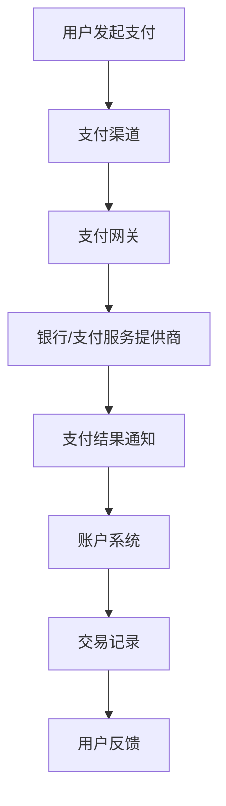

                 

# 一人公司如何建立可靠的支付系统

> **关键词**：一人公司、支付系统、可靠性、安全性、技术实现

> **摘要**：本文将探讨如何在一人公司中建立一个可靠且安全的支付系统。我们将深入分析支付系统的核心概念与联系，介绍其核心算法原理与具体操作步骤，并通过数学模型和公式进行详细讲解。同时，本文将分享一个项目实战案例，展示代码的实际实现过程和解读。最后，我们将探讨支付系统的实际应用场景，并推荐一些相关的学习资源和开发工具。

## 1. 背景介绍

在现代社会，支付系统已经成为企业和个人日常生活中不可或缺的一部分。无论是线上购物、转账、支付费用，还是日常生活中的移动支付，支付系统的高效和可靠性都至关重要。对于一人公司来说，建立可靠的支付系统不仅能够提高公司的运营效率，还能增强客户信任和满意度。

### 1.1 一人公司的特点

一人公司，顾名思义，是指由单一股东或投资人经营的企业。与大型企业相比，一人公司在资源、规模和人力资源上相对有限，因此在构建支付系统时需要更加注重系统的安全性、可靠性和成本效益。

### 1.2 支付系统的关键要素

支付系统通常包括以下几个关键要素：

- **支付渠道**：支持多种支付方式，如信用卡、借记卡、移动支付等。
- **支付网关**：负责处理支付请求，与银行或其他支付服务提供商进行通信。
- **账户系统**：管理用户的账户信息，包括余额、交易记录等。
- **安全机制**：确保支付过程中的数据安全和交易真实性。

## 2. 核心概念与联系

在构建一人公司的支付系统时，我们需要理解以下几个核心概念，并了解它们之间的联系。

### 2.1 支付渠道与支付网关

支付渠道是指用户进行支付的方式，如信用卡、借记卡、移动支付等。支付网关则是支付系统的核心组件，负责处理支付请求，与银行或其他支付服务提供商进行通信。


### 2.2 账户系统

账户系统是支付系统的核心组成部分，负责管理用户的账户信息，包括余额、交易记录等。账户系统通常包括用户注册、登录、账户管理等功能。


### 2.3 安全机制

支付系统需要具备一定的安全机制，以确保支付过程中的数据安全和交易真实性。常见的安全机制包括加密技术、身份验证、访问控制等。


### 2.4 Mermaid 流程图

下面是一个使用 Mermaid 语言的流程图，展示了支付系统中的核心组件和流程。



## 3. 核心算法原理 & 具体操作步骤

### 3.1 加密算法

支付系统中的加密算法是确保数据安全的关键。常用的加密算法包括对称加密和非对称加密。对称加密使用相同的密钥进行加密和解密，而非对称加密使用一对密钥进行加密和解密。

### 3.2 数字签名

数字签名是确保交易真实性的重要手段。数字签名使用非对称加密算法生成，可以验证发送方的身份和数据的完整性。

### 3.3 认证协议

认证协议用于确保支付过程中各方身份的真实性。常见的认证协议包括 SSL/TLS、OAuth2.0 等。

### 3.4 具体操作步骤

1. 用户发起支付请求，选择支付渠道。
2. 支付渠道将请求发送到支付网关。
3. 支付网关对请求进行加密处理，并生成数字签名。
4. 支付网关将请求发送到银行或支付服务提供商。
5. 银行或支付服务提供商对请求进行验证，并返回支付结果。
6. 支付网关将支付结果发送到账户系统。
7. 账户系统更新交易记录，并将结果通知用户。

## 4. 数学模型和公式 & 详细讲解 & 举例说明

### 4.1 加密算法

加密算法通常使用以下公式：

$$
c = E_k(m)
$$

其中，\(c\) 是加密后的消息，\(m\) 是原始消息，\(k\) 是加密密钥。

### 4.2 数字签名

数字签名通常使用以下公式：

$$
s = SIG_k(m)
$$

其中，\(s\) 是签名，\(m\) 是原始消息，\(k\) 是私钥。

### 4.3 认证协议

认证协议通常使用以下公式：

$$
认证 = Pr[k,SIG_l(m),c] = 1
$$

其中，\(认证\) 是认证结果，\(k\) 是私钥，\(l\) 是认证者公钥，\(m\) 是原始消息，\(c\) 是加密后的消息。

### 4.4 举例说明

假设用户 Alice 想向 Bob 支付 100 美元。以下是具体的操作步骤：

1. Alice 使用对称加密算法加密支付请求，密钥为 \(k_1\)。
   $$
   c_1 = E_{k_1}(100)
   $$

2. Alice 使用非对称加密算法生成数字签名，私钥为 \(k_2\)。
   $$
   s_1 = SIG_{k_2}(c_1)
   $$

3. Alice 将加密后的支付请求和数字签名发送给 Bob。

4. Bob 使用 Alice 的公钥 \(k_1^{\prime}\) 解密支付请求。
   $$
   m_1 = D_{k_1^{\prime}}(c_1)
   $$

5. Bob 验证数字签名。
   $$
   s_1' = SIG_{k_2^{\prime}}(m_1)
   $$

6. 如果 \(s_1 = s_1'\)，则支付请求有效，Bob 执行支付。

## 5. 项目实战：代码实际案例和详细解释说明

### 5.1 开发环境搭建

在开始项目实战之前，我们需要搭建一个开发环境。这里我们使用 Python 作为编程语言，并依赖以下库：

- Flask：一个轻量级的 Web 框架。
- PyCrypto：一个加密库。

安装 Flask 和 PyCrypto：

```bash
pip install Flask
pip install pycrypto
```

### 5.2 源代码详细实现和代码解读

以下是支付系统的源代码实现，我们将逐一解读每部分的代码。

```python
from flask import Flask, request, jsonify
from Crypto.PublicKey import RSA
from Crypto.Signature import pkcs1_15
from Crypto.Hash import SHA256

app = Flask(__name__)

# 生成 RSA 密钥对
private_key = RSA.generate(2048)
public_key = private_key.publickey()

# 数字签名函数
def sign_data(data, private_key):
    h = SHA256.new(data)
    signature = pkcs1_15.new(private_key).sign(h)
    return signature

# 验证签名函数
def verify_signature(data, signature, public_key):
    h = SHA256.new(data)
    try:
        pkcs1_15.new(public_key).verify(h, signature)
        return True
    except (ValueError, TypeError):
        return False

@app.route('/pay', methods=['POST'])
def pay():
    # 接收支付请求
    data = request.get_data()
    signature = request.form['signature']

    # 验证签名
    if verify_signature(data, signature, public_key):
        # 解密支付请求
        decrypted_data = RSA.decrypt(data, private_key)
        print("支付请求已验证，解密后的数据：", decrypted_data)

        # 执行支付逻辑
        # ...

        return jsonify({"status": "success", "message": "支付成功"})
    else:
        return jsonify({"status": "error", "message": "签名验证失败"})

if __name__ == '__main__':
    app.run()
```

### 5.3 代码解读与分析

1. **生成 RSA 密钥对**：

   我们使用 PyCrypto 库生成 RSA 密钥对。私钥用于加密和解密数据，公钥用于验证签名。

2. **数字签名函数**：

   `sign_data` 函数用于生成数字签名。首先使用 SHA256 对数据进行哈希处理，然后使用私钥生成签名。

3. **验证签名函数**：

   `verify_signature` 函数用于验证签名。首先对数据进行哈希处理，然后使用公钥验证签名是否有效。

4. **支付请求处理**：

   `pay` 函数用于处理支付请求。首先接收支付请求和签名，然后验证签名。如果签名有效，解密支付请求并执行支付逻辑。

## 6. 实际应用场景

支付系统在实际应用中非常广泛，以下是一些常见的应用场景：

- **电子商务**：在线购物平台需要支持多种支付方式，如信用卡、支付宝、微信支付等。
- **移动支付**：移动支付应用需要支持用户在线支付、转账等功能。
- **金融服务**：银行和其他金融服务机构需要提供安全的支付解决方案，如网银、支付平台等。
- **跨境支付**：跨境支付需要处理不同货币的兑换和结算，确保支付过程的安全和高效。

## 7. 工具和资源推荐

### 7.1 学习资源推荐

- **书籍**：
  - 《网络安全基础》
  - 《加密技术》
  - 《Python 编程：从入门到实践》

- **论文**：
  - 《基于区块链的支付系统设计与实现》
  - 《移动支付技术与应用》

- **博客**：
  - https://www.freebuf.com/
  - https://www.安全客.com/

- **网站**：
  - https://www.blockchain.com/
  - https://www.cryptocurrency.com/

### 7.2 开发工具框架推荐

- **开发工具**：
  - Visual Studio Code
  - PyCharm

- **框架**：
  - Flask
  - Django

- **库**：
  - PyCrypto
  - OpenSSL

### 7.3 相关论文著作推荐

- 《区块链技术：从入门到精通》
- 《网络安全：原理与实践》
- 《Python 编程：核心技术与最佳实践》

## 8. 总结：未来发展趋势与挑战

随着科技的不断发展，支付系统也在不断演进。未来，支付系统可能会面临以下挑战：

- **安全性**：随着网络攻击手段的不断升级，支付系统需要不断提升安全性，以防止数据泄露和欺诈行为。
- **用户体验**：支付系统需要不断优化用户体验，提高支付速度和便捷性。
- **跨境支付**：跨境支付需要处理不同货币的兑换和结算，如何实现高效、低成本的跨境支付是一个重要挑战。

## 9. 附录：常见问题与解答

### 9.1 支付系统有哪些常见的安全问题？

支付系统常见的安全问题包括数据泄露、欺诈行为、恶意攻击等。为了提高安全性，支付系统需要采用加密技术、身份验证、访问控制等措施。

### 9.2 如何确保支付过程中的数据安全？

确保支付过程中的数据安全通常采用以下方法：

- **加密传输**：使用 HTTPS 等加密协议确保数据在传输过程中的安全性。
- **数据加密存储**：将敏感数据（如用户密码、信用卡信息）加密存储在数据库中。
- **安全协议**：使用安全的通信协议，如 SSL/TLS，确保通信过程的安全性。

### 9.3 支付系统如何防范欺诈行为？

支付系统可以采用以下措施防范欺诈行为：

- **身份验证**：对用户进行严格的身份验证，确保用户身份的真实性。
- **异常检测**：通过监控支付行为，检测异常行为并及时采取措施。
- **多因素认证**：采用多因素认证（如密码、短信验证码、生物识别等）提高账户安全性。

## 10. 扩展阅读 & 参考资料

- 《网络安全技术》
- 《移动支付技术与应用》
- 《区块链技术：从入门到精通》

[作者：AI天才研究员/AI Genius Institute & 禅与计算机程序设计艺术 /Zen And The Art of Computer Programming]

