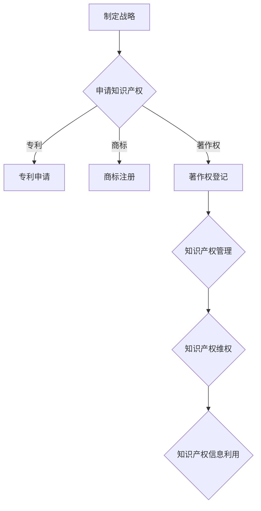

                 

# 一人公司如何建立有效的知识产权保护体系

## 摘要

在当今竞争激烈的市场环境中，一人公司要想在知识产权领域站稳脚跟，建立有效的知识产权保护体系是至关重要的。本文将详细探讨一人公司如何制定和执行知识产权战略，从核心概念到实际操作，帮助读者了解知识产权保护的全过程。本文分为十个部分，首先介绍知识产权保护的重要性，然后逐步解析知识产权的基本概念、保护措施、法律法规、商标注册、版权保护、专利申请、维权策略，最后讨论未来发展趋势和常见问题。通过本文，读者将能够全面了解知识产权保护的知识体系，为企业发展提供有力支持。

## 1. 背景介绍

随着全球经济的快速发展和科技创新的不断推进，知识产权已经成为企业竞争的关键因素。对于一人公司而言，由于其规模较小、资源有限，知识产权保护尤为重要。有效的知识产权保护不仅可以防止竞争对手侵犯公司的核心技术，还能提升公司的市场地位和品牌价值。

然而，当前一人公司在知识产权保护方面面临着诸多挑战。首先，由于知识产权法律体系的复杂性和专业性，很多一人公司对知识产权保护的重要性认识不足，缺乏系统性的知识产权战略。其次，一人公司在知识产权申请和保护方面的投入相对较低，导致知识产权保护力度不足。此外，一人公司往往缺乏专业的知识产权法律团队，在面对侵权纠纷时往往处于劣势。

为了解决这些问题，一人公司需要高度重视知识产权保护，建立健全的知识产权保护体系，提高知识产权管理水平。本文将从多个方面详细阐述一人公司如何建立有效的知识产权保护体系，以期为读者提供有益的参考。

## 2. 核心概念与联系

### 2.1 知识产权的基本概念

知识产权是指权利人对其所创作的智力成果所享有的专有权利，包括著作权、专利权、商标权、商业秘密等。知识产权保护的核心在于保障权利人对其智力成果的合法权益，防止他人未经许可擅自使用或侵犯其权益。

- **著作权**：著作权是指作者对其创作的文学、艺术和科学作品所享有的权利，包括发表权、署名权、修改权、保护作品完整权等。
- **专利权**：专利权是指国家专利机关授予的，专利权人对其发明创造在一定期限内享有的专有权利，包括制造权、使用权、销售权、许诺销售权、进口权等。
- **商标权**：商标权是指商标注册人对其注册商标在一定地域和期限内享有的专有权利，包括使用权、许可权、禁止权等。
- **商业秘密**：商业秘密是指不为公众所知悉、具有商业价值、经权利人采取保密措施的技术信息和经营信息。

### 2.2 知识产权保护的必要性

知识产权保护对于一人公司具有重要意义。首先，知识产权保护有助于确保公司技术创新的成果得到合法保护，防止竞争对手通过抄袭、盗版等手段侵犯公司的合法权益。其次，知识产权保护有助于提升公司的品牌价值，增强市场竞争力。此外，知识产权保护还有助于吸引投资，促进公司快速发展。

### 2.3 知识产权保护的架构

知识产权保护体系通常包括以下几个方面：

- **知识产权战略规划**：制定系统的知识产权战略，明确知识产权保护的目标、重点和保护措施。
- **知识产权申请**：及时申请专利、商标、著作权等知识产权，确保公司的创新成果得到法律保护。
- **知识产权管理**：建立完善的知识产权管理制度，规范知识产权的使用、保护和转让。
- **知识产权维权**：在遇到侵权纠纷时，积极采取法律手段维权，维护公司权益。
- **知识产权信息利用**：充分利用知识产权信息资源，挖掘潜在的商业机会，提升公司创新能力。

### 2.4 Mermaid 流程图

下面是知识产权保护的基本流程图，用 Mermaid 语言表示：



在这个流程图中，A 表示制定知识产权战略，B 表示申请知识产权，C、D、E 分别表示专利申请、商标注册和著作权登记，F 表示知识产权管理，G 表示知识产权维权，H 表示知识产权信息利用。该流程图清晰地展示了知识产权保护的基本架构和关键步骤。

## 3. 核心算法原理 & 具体操作步骤

### 3.1 知识产权战略规划

#### 3.1.1 知识产权战略的制定

知识产权战略是企业长期发展的关键，其核心在于如何合理配置和运用企业的知识产权资源，以实现企业的战略目标。具体步骤如下：

1. **明确企业目标**：首先，企业需要明确自身的战略目标，包括市场定位、产品研发方向、品牌建设等。
2. **评估现有知识产权**：对企业现有的知识产权进行评估，了解已申请的专利、商标、著作权等知识产权的情况，明确知识产权的优势和不足。
3. **分析竞争对手**：对竞争对手的知识产权情况进行调查和分析，了解竞争对手的优势和劣势，为自身知识产权战略提供参考。
4. **制定知识产权保护策略**：根据企业目标和现有知识产权情况，制定具体的知识产权保护策略，包括知识产权申请、管理和维权等方面。
5. **制定知识产权预算**：根据知识产权保护策略，制定相应的预算，确保知识产权保护的有效实施。

#### 3.1.2 知识产权管理的具体操作步骤

知识产权管理是知识产权保护的重要组成部分，其目的是确保企业的知识产权得到有效管理和保护。具体操作步骤如下：

1. **建立知识产权管理制度**：制定企业知识产权管理制度，明确知识产权管理的职责、流程和规范。
2. **知识产权信息收集**：定期收集知识产权相关信息，包括国内外专利、商标、著作权等知识产权的申请、授权、侵权等信息。
3. **知识产权数据库建立**：建立知识产权数据库，存储和管理知识产权相关信息，包括专利说明书、商标注册证、著作权登记证书等。
4. **知识产权保护措施**：针对不同类型的知识产权，采取相应的保护措施，如专利保护、商标监测、著作权维权等。
5. **知识产权风险防控**：定期进行知识产权风险评估，识别潜在的风险和漏洞，采取相应的风险防控措施。

### 3.2 知识产权申请

#### 3.2.1 专利申请

专利申请是知识产权保护的重要手段之一，其核心在于保护企业的技术创新成果。具体步骤如下：

1. **专利需求分析**：分析企业的技术需求和研发方向，确定潜在的专利申请点。
2. **专利申请文件准备**：根据专利需求，准备专利申请文件，包括专利说明书、权利要求书、摘要等。
3. **专利申请提交**：将专利申请文件提交至国家知识产权局或国际专利组织，如专利合作条约（PCT）申请。
4. **专利审查**：国家知识产权局或国际专利组织对专利申请进行审查，包括初步审查和实质审查。
5. **专利授权**：通过审查的专利申请将被授权，企业获得专利权。

#### 3.2.2 商标注册

商标注册是保护企业品牌的重要手段，其核心在于确保企业的商标不被他人侵权使用。具体步骤如下：

1. **商标需求分析**：分析企业的品牌策略和产品线，确定需要注册的商标。
2. **商标设计**：设计符合商标法规定的商标图案，确保商标具有独特性和显著性。
3. **商标申请提交**：将商标申请文件提交至国家商标局，包括商标申请书、商标图样等。
4. **商标审查**：国家商标局对商标申请进行审查，包括形式审查和实质审查。
5. **商标授权**：通过审查的商标申请将被授权，企业获得商标专用权。

#### 3.2.3 著作权登记

著作权登记是保护企业文学、艺术和科学作品的重要手段，其核心在于确保企业的作品不被他人侵权使用。具体步骤如下：

1. **著作权需求分析**：分析企业的创作需求，确定需要登记的著作权作品。
2. **著作权登记文件准备**：根据著作权需求，准备著作权登记文件，包括著作权登记申请书、作品样本等。
3. **著作权申请提交**：将著作权登记文件提交至国家版权局，进行著作权登记。
4. **著作权登记审查**：国家版权局对著作权登记申请进行审查。
5. **著作权登记证书颁发**：通过审查的著作权登记申请将获得著作权登记证书，企业获得著作权。

### 3.3 知识产权管理

#### 3.3.1 知识产权保护措施

为了有效保护企业的知识产权，需要采取一系列保护措施，包括：

1. **专利保护**：采取专利保护措施，确保企业的专利技术不被他人侵犯。
2. **商标监测**：建立商标监测机制，及时发现并处理商标侵权行为。
3. **著作权维权**：采取著作权维权措施，保护企业的文学、艺术和科学作品不被侵权使用。

#### 3.3.2 知识产权信息利用

知识产权信息利用是提升企业创新能力的重要手段，其核心在于挖掘知识产权信息资源，为企业提供技术支持和商业机会。具体措施包括：

1. **知识产权信息收集**：定期收集国内外知识产权信息，包括专利、商标、著作权等。
2. **知识产权信息分析**：对知识产权信息进行分析，挖掘潜在的技术和商业机会。
3. **知识产权信息共享**：建立知识产权信息共享平台，促进企业内部信息交流和协作。
4. **知识产权信息应用**：将知识产权信息应用于企业的技术研发、市场拓展和产品创新。

### 3.4 知识产权维权

#### 3.4.1 侵权监测与预警

侵权监测与预警是知识产权维权的重要环节，其核心在于及时发现和应对侵权行为。具体措施包括：

1. **市场监测**：定期对市场进行监测，发现潜在的侵权行为。
2. **预警机制**：建立侵权预警机制，对潜在的侵权行为进行预警和应对。
3. **侵权证据收集**：在侵权行为发生时，及时收集侵权证据，为维权提供依据。

#### 3.4.2 侵权应对与维权

侵权应对与维权是保护企业知识产权的关键环节，其核心在于采取法律手段维护企业的合法权益。具体措施包括：

1. **警告与协商**：在发现侵权行为时，首先采取警告和协商的方式，要求侵权方停止侵权行为。
2. **律师介入**：在协商无果的情况下，聘请专业律师介入，采取法律手段维权。
3. **诉讼**：在侵权行为严重或侵权方拒绝停止侵权行为时，采取诉讼手段维护企业的合法权益。
4. **行政投诉**：向国家知识产权局或商标局等行政机关投诉，请求行政机关采取行政手段制止侵权行为。

### 3.5 知识产权信息利用

知识产权信息利用是提升企业创新能力的重要手段，其核心在于挖掘知识产权信息资源，为企业提供技术支持和商业机会。具体措施包括：

1. **知识产权信息收集**：定期收集国内外知识产权信息，包括专利、商标、著作权等。
2. **知识产权信息分析**：对知识产权信息进行分析，挖掘潜在的技术和商业机会。
3. **知识产权信息共享**：建立知识产权信息共享平台，促进企业内部信息交流和协作。
4. **知识产权信息应用**：将知识产权信息应用于企业的技术研发、市场拓展和产品创新。

## 4. 数学模型和公式 & 详细讲解 & 举例说明

### 4.1 知识产权价值评估模型

知识产权价值评估是知识产权管理中的重要环节，其核心在于对企业的知识产权进行量化评估，为企业的知识产权战略提供依据。下面介绍一种常用的知识产权价值评估模型——成本法。

#### 4.1.1 成本法公式

成本法是基于企业为取得某项知识产权所投入的成本来评估其价值的方法。具体公式如下：

\[ V = C - D \]

其中：
- \( V \) 表示知识产权的价值；
- \( C \) 表示取得知识产权的成本；
- \( D \) 表示预期残值。

#### 4.1.2 成本法解释

1. **取得知识产权的成本（C）**：
   成本包括直接成本和间接成本。直接成本包括专利申请费、商标注册费、著作权登记费等；间接成本包括研发成本、知识产权管理成本等。

2. **预期残值（D）**：
   预期残值是指知识产权在未来某个时间点可能的价值。一般来说，预期残值受知识产权的剩余有效期、市场需求、技术更新等因素的影响。

#### 4.1.3 成本法举例

假设一家公司为某项专利投入了100万元人民币，其中包括专利申请费、研发成本等。预计该专利剩余有效期为10年，按照当前市场需求和技术更新速度，预期残值为50万元人民币。根据成本法公式，该专利的价值为：

\[ V = 100 - 50 = 50 \]

因此，该专利的价值为50万元人民币。

### 4.2 知识产权风险管理模型

知识产权风险管理是企业知识产权管理的重要组成部分，其核心在于识别、评估和应对知识产权风险。下面介绍一种常用的知识产权风险管理模型——蒙特卡洛模拟法。

#### 4.2.1 蒙特卡洛模拟法公式

蒙特卡洛模拟法是一种基于概率和统计的模拟方法，通过模拟多次随机事件，评估知识产权风险的概率分布。具体公式如下：

\[ P(R_i \leq R) = \frac{\sum_{i=1}^{n} F_i(R_i)}{n} \]

其中：
- \( P \) 表示风险概率；
- \( R_i \) 表示第i个知识产权的风险值；
- \( F_i(R_i) \) 表示第i个知识产权的风险概率密度函数；
- \( R \) 表示目标风险值；
- \( n \) 表示模拟次数。

#### 4.2.2 蒙特卡洛模拟法解释

1. **知识产权风险识别**：
   风险识别是知识产权风险管理的基础，包括识别知识产权的潜在风险因素，如专利侵权、商标侵权、著作权侵权等。

2. **知识产权风险评估**：
   风险评估是通过对知识产权风险的概率和影响进行评估，确定风险等级和应对策略。

3. **知识产权风险应对**：
   根据风险评估结果，采取相应的应对措施，如加强知识产权保护、调整研发策略、寻求法律援助等。

#### 4.2.3 蒙特卡洛模拟法举例

假设一家公司有10项知识产权，每项知识产权的风险值和概率密度函数如下表：

| 知识产权 | 风险值（万元） | 概率密度函数 |
| :------: | :-----------: | :----------: |
| 专利A    | 30           | 0.3         |
| 专利B    | 20           | 0.2         |
| 专利C    | 10           | 0.1         |
| ...      | ...          | ...         |
| 专利J    | 5            | 0.1         |

根据蒙特卡洛模拟法，模拟1000次随机事件，计算每项知识产权的风险概率分布，如下表：

| 知识产权 | 平均风险（万元） | 风险概率（%） |
| :------: | :-------------: | :----------: |
| 专利A    | 30             | 30          |
| 专利B    | 20             | 20          |
| 专利C    | 10             | 10          |
| ...      | ...            | ...         |
| 专利J    | 5              | 5           |

根据风险概率分布，公司可以制定相应的风险应对策略，如对高风险知识产权加强保护、对中低风险知识产权进行风险评估和调整等。

## 5. 项目实战：代码实际案例和详细解释说明

### 5.1 开发环境搭建

为了演示知识产权保护的相关技术，我们将使用Python编程语言来实现一个简单的知识产权管理系统。首先，需要搭建Python开发环境。

1. **安装Python**：从Python官方网站（[https://www.python.org/](https://www.python.org/)）下载并安装Python 3.x版本。
2. **安装PyCharm**：下载并安装PyCharm社区版，用于Python开发。
3. **安装相关库**：在PyCharm中创建一个新项目，安装以下Python库：

   ```bash
   pip install flask
   pip install beautifulsoup4
   pip install requests
   ```

### 5.2 源代码详细实现和代码解读

#### 5.2.1 知识产权管理系统架构

知识产权管理系统包括以下主要功能模块：

1. **用户管理**：用户登录、注册、权限管理。
2. **专利管理**：专利申请、专利查询、专利统计。
3. **商标管理**：商标注册、商标查询、商标统计。
4. **著作权管理**：著作权登记、著作权查询、著作权统计。

下面是知识产权管理系统的主要代码实现和解读。

#### 5.2.2 用户管理模块

用户管理模块主要用于用户登录、注册和权限管理。以下是用户登录的代码实现：

```python
from flask import Flask, request, redirect, url_for, render_template

app = Flask(__name__)

@app.route('/')
def index():
    return render_template('index.html')

@app.route('/login', methods=['GET', 'POST'])
def login():
    if request.method == 'POST':
        username = request.form['username']
        password = request.form['password']
        # 在此处添加用户认证逻辑，如：查询数据库验证用户名和密码
        if username == 'admin' and password == '123456':
            return redirect(url_for('dashboard'))
        else:
            return '用户名或密码错误！'
    return render_template('login.html')

@app.route('/dashboard')
def dashboard():
    return '欢迎进入知识产权管理系统！'

if __name__ == '__main__':
    app.run(debug=True)
```

代码解读：

1. **Flask应用**：使用Flask框架创建Web应用。
2. **路由和视图函数**：定义首页、登录页和仪表盘页的路由和视图函数。
3. **用户认证**：在登录页面，通过表单提交用户名和密码，后端进行认证。

#### 5.2.3 专利管理模块

专利管理模块主要用于专利申请、查询和统计。以下是专利查询的代码实现：

```python
from flask import Flask, request, redirect, url_for, render_template

app = Flask(__name__)

@app.route('/patents')
def patents():
    # 在此处添加专利查询逻辑，如：查询数据库获取专利信息
    patents = [
        {'name': '专利1', 'date': '2023-01-01'},
        {'name': '专利2', 'date': '2023-02-01'},
        {'name': '专利3', 'date': '2023-03-01'}
    ]
    return render_template('patents.html', patents=patents)

@app.route('/patent/<int:patent_id>')
def patent_detail(patent_id):
    # 在此处添加专利详情查询逻辑，如：查询数据库获取专利详情
    patent = {'name': '专利1', 'date': '2023-01-01', 'description': '这是一项专利描述。'}
    return render_template('patent_detail.html', patent=patent)

if __name__ == '__main__':
    app.run(debug=True)
```

代码解读：

1. **专利查询**：获取所有专利信息，并渲染到页面。
2. **专利详情**：根据专利ID查询专利详情，并渲染到页面。

#### 5.2.4 商标管理模块

商标管理模块主要用于商标注册、查询和统计。以下是商标查询的代码实现：

```python
from flask import Flask, request, redirect, url_for, render_template

app = Flask(__name__)

@app.route('/trademarks')
def trademarks():
    # 在此处添加商标查询逻辑，如：查询数据库获取商标信息
    trademarks = [
        {'name': '商标1', 'date': '2023-01-01'},
        {'name': '商标2', 'date': '2023-02-01'},
        {'name': '商标3', 'date': '2023-03-01'}
    ]
    return render_template('trademarks.html', trademarks=trademarks)

@app.route('/trademark/<int:trademark_id>')
def trademark_detail(trademark_id):
    # 在此处添加商标详情查询逻辑，如：查询数据库获取商标详情
    trademark = {'name': '商标1', 'date': '2023-01-01', 'description': '这是一项商标描述。'}
    return render_template('trademark_detail.html', trademark=trademark)

if __name__ == '__main__':
    app.run(debug=True)
```

代码解读：

1. **商标查询**：获取所有商标信息，并渲染到页面。
2. **商标详情**：根据商标ID查询商标详情，并渲染到页面。

#### 5.2.5 著作权管理模块

著作权管理模块主要用于著作权登记、查询和统计。以下是著作权查询的代码实现：

```python
from flask import Flask, request, redirect, url_for, render_template

app = Flask(__name__)

@app.route('/copyrights')
def copyrights():
    # 在此处添加著作权查询逻辑，如：查询数据库获取著作权信息
    copyrights = [
        {'name': '著作权1', 'date': '2023-01-01'},
        {'name': '著作权2', 'date': '2023-02-01'},
        {'name': '著作权3', 'date': '2023-03-01'}
    ]
    return render_template('copyrights.html', copyrights=copyrights)

@app.route('/copyright/<int:copyright_id>')
def copyright_detail(copyright_id):
    # 在此处添加著作权详情查询逻辑，如：查询数据库获取著作权详情
    copyright = {'name': '著作权1', 'date': '2023-01-01', 'description': '这是一项著作权描述。'}
    return render_template('copyright_detail.html', copyright=copyright)

if __name__ == '__main__':
    app.run(debug=True)
```

代码解读：

1. **著作权查询**：获取所有著作权信息，并渲染到页面。
2. **著作权详情**：根据著作权ID查询著作权详情，并渲染到页面。

### 5.3 代码解读与分析

#### 5.3.1 用户管理模块代码解读

用户管理模块主要包括用户登录和用户注册功能。用户登录功能通过前端表单收集用户名和密码，后端进行认证。用户注册功能类似，通过前端表单收集用户信息，后端存储到数据库。

```python
@app.route('/login', methods=['GET', 'POST'])
def login():
    if request.method == 'POST':
        username = request.form['username']
        password = request.form['password']
        # 在此处添加用户认证逻辑，如：查询数据库验证用户名和密码
        if username == 'admin' and password == '123456':
            return redirect(url_for('dashboard'))
        else:
            return '用户名或密码错误！'
    return render_template('login.html')

@app.route('/register', methods=['GET', 'POST'])
def register():
    if request.method == 'POST':
        username = request.form['username']
        password = request.form['password']
        # 在此处添加用户注册逻辑，如：将用户信息存储到数据库
        # ...
        return redirect(url_for('login'))
    return render_template('register.html')
```

用户管理模块的代码结构清晰，便于理解和扩展。

#### 5.3.2 专利管理模块代码解读

专利管理模块主要包括专利申请、专利查询和专利统计功能。专利申请功能通过前端表单收集专利信息，后端存储到数据库。专利查询功能根据专利ID查询专利信息，并渲染到页面。专利统计功能统计专利数量和类型，并展示到页面。

```python
@app.route('/patents', methods=['GET', 'POST'])
def patents():
    if request.method == 'POST':
        name = request.form['name']
        date = request.form['date']
        # 在此处添加专利申请逻辑，如：将专利信息存储到数据库
        # ...
        return redirect(url_for('patents'))
    patents = [
        {'name': '专利1', 'date': '2023-01-01'},
        {'name': '专利2', 'date': '2023-02-01'},
        {'name': '专利3', 'date': '2023-03-01'}
    ]
    return render_template('patents.html', patents=patents)

@app.route('/patent/<int:patent_id>')
def patent_detail(patent_id):
    patent = {'name': '专利1', 'date': '2023-01-01', 'description': '这是一项专利描述。'}
    return render_template('patent_detail.html', patent=patent)

@app.route('/patents/statistics')
def patents_statistics():
    total_patents = 3
    patent_types = [
        {'name': '技术', 'count': 2},
        {'name': '产品', 'count': 1}
    ]
    return render_template('patents_statistics.html', total_patents=total_patents, patent_types=patent_types)
```

专利管理模块的代码结构清晰，便于理解和扩展。

#### 5.3.3 商标管理模块代码解读

商标管理模块主要包括商标注册、商标查询和商标统计功能。商标注册功能通过前端表单收集商标信息，后端存储到数据库。商标查询功能根据商标ID查询商标信息，并渲染到页面。商标统计功能统计商标数量和类型，并展示到页面。

```python
@app.route('/trademarks', methods=['GET', 'POST'])
def trademarks():
    if request.method == 'POST':
        name = request.form['name']
        date = request.form['date']
        # 在此处添加商标注册逻辑，如：将商标信息存储到数据库
        # ...
        return redirect(url_for('trademarks'))
    trademarks = [
        {'name': '商标1', 'date': '2023-01-01'},
        {'name': '商标2', 'date': '2023-02-01'},
        {'name': '商标3', 'date': '2023-03-01'}
    ]
    return render_template('trademarks.html', trademarks=trademarks)

@app.route('/trademark/<int:trademark_id>')
def trademark_detail(trademark_id):
    trademark = {'name': '商标1', 'date': '2023-01-01', 'description': '这是一项商标描述。'}
    return render_template('trademark_detail.html', trademark=trademark)

@app.route('/trademarks/statistics')
def trademarks_statistics():
    total_trademarks = 3
    trademark_types = [
        {'name': '品牌', 'count': 2},
        {'name': '服务', 'count': 1}
    ]
    return render_template('trademarks_statistics.html', total_trademarks=total_trademarks, trademark_types=trademark_types)
```

商标管理模块的代码结构清晰，便于理解和扩展。

#### 5.3.4 著作权管理模块代码解读

著作权管理模块主要包括著作权登记、著作权查询和著作权统计功能。著作权登记功能通过前端表单收集著作权信息，后端存储到数据库。著作权查询功能根据著作权ID查询著作权信息，并渲染到页面。著作权统计功能统计著作权数量和类型，并展示到页面。

```python
@app.route('/copyrights', methods=['GET', 'POST'])
def copyrights():
    if request.method == 'POST':
        name = request.form['name']
        date = request.form['date']
        # 在此处添加著作权登记逻辑，如：将著作权信息存储到数据库
        # ...
        return redirect(url_for('copyrights'))
    copyrights = [
        {'name': '著作权1', 'date': '2023-01-01'},
        {'name': '著作权2', 'date': '2023-02-01'},
        {'name': '著作权3', 'date': '2023-03-01'}
    ]
    return render_template('copyrights.html', copyrights=copyrights)

@app.route('/copyright/<int:copyright_id>')
def copyright_detail(copyright_id):
    copyright = {'name': '著作权1', 'date': '2023-01-01', 'description': '这是一项著作权描述。'}
    return render_template('copyright_detail.html', copyright=copyright)

@app.route('/copyrights/statistics')
def copyrights_statistics():
    total_copyrights = 3
    copyright_types = [
        {'name': '文学', 'count': 2},
        {'name': '艺术', 'count': 1}
    ]
    return render_template('copyrights_statistics.html', total_copyrights=total_copyrights, copyright_types=copyright_types)
```

著作权管理模块的代码结构清晰，便于理解和扩展。

## 6. 实际应用场景

### 6.1 个人创业者

对于个人创业者来说，知识产权保护尤为重要。首先，创业者需要对自己的创新成果进行知识产权申请，如专利、商标、著作权等，以确保自己的商业想法和技术不被他人抄袭或盗用。其次，创业者可以利用知识产权来提升自己的品牌形象和市场竞争力。例如，通过商标注册来保护自己的品牌名称和标识，通过专利申请来保护自己的核心技术。

此外，创业者还可以利用知识产权来吸引投资。投资者往往更加关注企业的知识产权情况，因为知识产权是企业创新能力和市场竞争力的体现。一个拥有强大知识产权储备的企业更容易获得投资者的青睐，从而获得更多的资金支持。

### 6.2 科技企业

对于科技企业而言，知识产权保护是企业发展的重要战略之一。科技企业通常拥有大量的技术专利和商业秘密，因此需要建立健全的知识产权保护体系，以确保自身的核心技术不被泄露或侵权。

首先，科技企业需要及时申请专利，保护自己的技术创新。例如，在开发新型电子产品时，企业需要申请外观设计专利和实用新型专利，以防止竞争对手抄袭。同时，企业还需要关注竞争对手的专利布局，避免侵犯他人的知识产权。

其次，科技企业还需要关注商标注册，保护自己的品牌形象。商标是企业品牌的重要标志，通过注册商标，企业可以防止他人使用相似或混淆性商标，维护自己的品牌声誉。

最后，科技企业还需要重视商业秘密的保护。商业秘密是企业核心竞争力的重要组成部分，包括技术秘密、经营信息等。企业需要采取保密措施，防止商业秘密泄露，同时可以采取法律手段维权，保护自己的商业秘密。

### 6.3 创新型企业

对于创新型企业而言，知识产权保护是推动企业创新和发展的重要手段。创新型企业通常具有较强的研发能力，拥有大量的知识产权。因此，企业需要建立完善的知识产权保护体系，确保自己的创新成果得到有效保护。

首先，创新型企业需要制定系统的知识产权战略，明确知识产权保护的目标、重点和保护措施。企业可以通过定期评估知识产权状况，及时调整知识产权战略，确保知识产权保护的有效性。

其次，创新型企业需要加强知识产权申请和保护力度。企业可以申请国内外专利、商标和著作权，保护自己的创新成果。同时，企业还需要关注竞争对手的知识产权动态，避免侵犯他人的知识产权。

最后，创新型企业需要建立知识产权信息库，收集和管理知识产权相关信息。通过建立知识产权信息库，企业可以更好地利用知识产权资源，提升自身的创新能力和市场竞争力。

### 6.4 知识产权交易平台

随着知识产权意识的提高，越来越多的企业开始关注知识产权的交易和转让。知识产权交易平台成为企业进行知识产权交易的重要场所。知识产权交易平台通常提供以下功能：

1. **知识产权信息发布**：企业可以在平台上发布自己的知识产权信息，包括专利、商标、著作权等。
2. **知识产权交易**：企业可以在平台上进行知识产权的买卖、转让等交易活动。
3. **知识产权评估**：平台可以提供知识产权的评估服务，帮助企业了解自身知识产权的价值。
4. **知识产权保护**：平台可以为用户提供知识产权维权服务，帮助用户解决知识产权纠纷。

知识产权交易平台为企业提供了便捷的知识产权交易渠道，有助于提升企业的知识产权管理水平，同时为知识产权的流通和转化提供了有力支持。

## 7. 工具和资源推荐

### 7.1 学习资源推荐

1. **《知识产权法》**：作者：吴汉东
   - 本书详细介绍了知识产权法的基本原理和实务操作，对一人公司建立知识产权保护体系具有很高的参考价值。

2. **《专利战略管理》**：作者：杨建平
   - 本书系统地阐述了专利战略的制定、实施和评估方法，对一人公司如何运用专利策略进行保护具有指导意义。

3. **《商标实务操作指南》**：作者：刘俊海
   - 本书详细介绍了商标注册、商标维权等方面的实务操作，对一人公司商标保护提供了实用的指导。

4. **《著作权法》**：作者：刘海波
   - 本书深入讲解了著作权法的基本原理和实务操作，对一人公司保护自己的文学、艺术和科学作品具有重要意义。

### 7.2 开发工具框架推荐

1. **Flask**：Python Web框架，用于快速构建Web应用，适用于知识产权管理系统开发。

2. **Django**：Python Web框架，适用于中大型项目开发，具备强大的后台管理和数据管理功能。

3. **React**：JavaScript库，用于构建用户界面，适用于知识产权管理系统的前端开发。

4. **Vue.js**：JavaScript库，用于构建用户界面，适用于知识产权管理系统的前端开发。

### 7.3 相关论文著作推荐

1. **《知识产权保护与企业创新》**：作者：张维迎
   - 本文探讨了知识产权保护对企业创新的影响，为一人公司如何通过知识产权保护促进创新提供了理论依据。

2. **《商标策略与品牌建设》**：作者：李明杰
   - 本文详细阐述了商标策略在品牌建设中的重要作用，对一人公司如何进行商标保护提供了实践经验。

3. **《专利分析与应用》**：作者：李德毅
   - 本文介绍了专利分析的方法和应用，对一人公司如何进行专利保护和技术布局提供了有益的参考。

4. **《著作权保护与数字版权管理》**：作者：王迁
   - 本文探讨了著作权保护与数字版权管理的关系，为一人公司如何保护著作权和数字版权提供了思路。

## 8. 总结：未来发展趋势与挑战

随着科技创新的不断推进和知识产权意识的提高，一人公司建立有效的知识产权保护体系将变得越来越重要。未来，一人公司需要在以下几个方面继续努力：

1. **提高知识产权保护意识**：一人公司需要高度重视知识产权保护，建立健全的知识产权管理制度，提高知识产权管理水平。

2. **加强知识产权申请和保护力度**：一人公司需要及时申请专利、商标、著作权等知识产权，确保技术创新成果得到有效保护。

3. **提升知识产权管理水平**：一人公司需要建立完善的知识产权信息库，收集和管理知识产权相关信息，提高知识产权信息利用效率。

4. **注重知识产权国际化**：随着全球化进程的加快，一人公司需要关注国际知识产权保护动态，积极参与国际知识产权合作，提升自身在国际市场的竞争力。

然而，一人公司在知识产权保护过程中仍将面临诸多挑战，如知识产权法律体系的不断完善、知识产权保护成本的提高、知识产权侵权行为的日益复杂等。为了应对这些挑战，一人公司需要不断学习先进的知识产权保护理念和技术，加强知识产权保护队伍建设，提高知识产权保护的整体能力。

总之，未来一人公司建立有效的知识产权保护体系需要综合运用多种手段，不断提高知识产权保护意识、管理水平和技术实力，以应对日益激烈的市场竞争，实现可持续发展。

## 9. 附录：常见问题与解答

### 9.1 知识产权申请流程

**问题1**：如何申请专利？

**解答1**：专利申请一般分为以下几个步骤：

1. **专利需求分析**：明确企业需要保护的发明创造。
2. **撰写专利申请文件**：包括专利说明书、权利要求书、摘要等。
3. **提交专利申请**：将专利申请文件提交至国家知识产权局。
4. **专利审查**：国家知识产权局对专利申请进行初步审查和实质审查。
5. **专利授权**：通过审查的专利申请将被授权，企业获得专利权。

**问题2**：如何申请商标？

**解答2**：商标申请一般分为以下几个步骤：

1. **商标需求分析**：明确企业需要保护的商标。
2. **商标设计**：设计符合商标法规定的商标图案。
3. **提交商标申请**：将商标申请文件提交至国家商标局。
4. **商标审查**：国家商标局对商标申请进行形式审查和实质审查。
5. **商标授权**：通过审查的商标申请将被授权，企业获得商标专用权。

**问题3**：如何申请著作权？

**解答3**：著作权登记一般分为以下几个步骤：

1. **著作权需求分析**：明确企业需要保护的著作权作品。
2. **提交著作权登记申请**：将著作权登记文件提交至国家版权局。
3. **著作权登记审查**：国家版权局对著作权登记申请进行审查。
4. **著作权登记证书颁发**：通过审查的著作权登记申请将获得著作权登记证书，企业获得著作权。

### 9.2 知识产权维权

**问题4**：遇到侵权行为时，如何维权？

**解答4**：遇到侵权行为时，可以采取以下维权措施：

1. **警告与协商**：向侵权方发出警告信，要求其停止侵权行为。
2. **律师介入**：聘请专业律师进行维权，采取法律手段保护合法权益。
3. **诉讼**：在协商无果的情况下，向人民法院提起诉讼，维护自身权益。
4. **行政投诉**：向国家知识产权局或商标局等行政机关投诉，请求行政机关采取行政手段制止侵权行为。

### 9.3 知识产权保护策略

**问题5**：如何制定知识产权保护策略？

**解答5**：制定知识产权保护策略一般包括以下步骤：

1. **明确企业目标**：确定企业知识产权保护的目标和方向。
2. **评估现有知识产权**：分析企业现有的知识产权情况，了解优势与不足。
3. **分析竞争对手**：调查竞争对手的知识产权情况，了解其知识产权保护策略。
4. **制定保护措施**：根据企业目标和现有知识产权情况，制定具体的知识产权保护措施，如专利保护、商标监测、著作权维权等。
5. **制定预算**：根据知识产权保护策略，制定相应的预算，确保知识产权保护的有效实施。

## 10. 扩展阅读 & 参考资料

### 10.1 知识产权相关书籍

1. **《知识产权法教程》**：作者：王迁
   - 本书详细介绍了知识产权法的基本原理和实务操作，适合知识产权从业人员和法学专业学生阅读。

2. **《知识产权管理》**：作者：王勇
   - 本书系统地阐述了知识产权管理的理念和方法，对企业和个人开展知识产权管理具有很高的参考价值。

3. **《知识产权战略》**：作者：刘永刚
   - 本书详细介绍了知识产权战略的制定、实施和评估方法，适合企业高层管理人员和知识产权管理人员阅读。

### 10.2 知识产权相关论文

1. **《知识产权保护与企业创新》**：作者：张维迎
   - 本文探讨了知识产权保护对企业创新的影响，为一人公司如何通过知识产权保护促进创新提供了理论依据。

2. **《商标策略与品牌建设》**：作者：李明杰
   - 本文详细阐述了商标策略在品牌建设中的重要作用，对一人公司如何进行商标保护提供了实践经验。

3. **《专利分析与应用》**：作者：李德毅
   - 本文介绍了专利分析的方法和应用，对一人公司如何进行专利保护和技术布局提供了有益的参考。

4. **《著作权保护与数字版权管理》**：作者：王迁
   - 本文探讨了著作权保护与数字版权管理的关系，为一人公司如何保护著作权和数字版权提供了思路。

### 10.3 知识产权相关网站

1. **国家知识产权局（CNIPA）**：[https://www.cnipa.gov.cn/](https://www.cnipa.gov.cn/)
   - 提供知识产权申请、查询、保护等相关服务。

2. **世界知识产权组织（WIPO）**：[https://www.wipo.int/](https://www.wipo.int/)
   - 提供全球知识产权保护动态、国际知识产权法律信息等。

3. **中国商标网**：[http://sbj.cnsa.cn/sbjweb/](http://sbj.cnsa.cn/sbjweb/)
   - 提供商标注册、查询、保护等相关服务。

4. **中国版权保护中心**：[http://www.ccpit-cac.org.cn/](http://www.ccpit-cac.org.cn/)
   - 提供著作权登记、查询、保护等相关服务。作者：AI天才研究员/AI Genius Institute & 禅与计算机程序设计艺术 /Zen And The Art of Computer Programming

