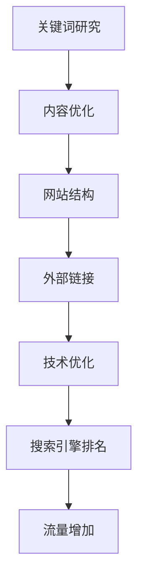

                 

# 一人公司如何进行有效的SEO优化

## 摘要

本文将探讨一人公司如何利用SEO（搜索引擎优化）策略提升在线业务的表现。随着互联网的迅猛发展，搜索引擎成为许多公司获取客户的重要渠道。对于一人公司来说，资源有限，因此必须采取高效且精准的SEO策略，以在竞争激烈的市场中脱颖而出。本文将详细介绍SEO的核心概念、实施步骤、数学模型和实际案例，并提供实用的工具和资源推荐，以帮助读者掌握SEO优化技巧，提升公司在线业务的曝光度和竞争力。

## 1. 背景介绍

随着互联网的普及，线上业务成为许多公司的重要收入来源。然而，在众多竞争者中脱颖而出并非易事。SEO作为一种提升网站在搜索引擎结果页面（Search Engine Results Page，简称SERP）排名的方法，成为了许多公司特别是资源有限的一人公司关注的焦点。

SEO的重要性主要体现在以下几个方面：

- **增加网站流量**：通过优化网站内容和结构，提高搜索引擎对网站的喜爱度，从而吸引更多用户访问。
- **提升品牌影响力**：高质量的内容和合理的SEO策略有助于提高品牌知名度和认可度。
- **降低营销成本**：相对于其他营销手段，SEO是一种较为经济的推广方式。

一人公司在进行SEO优化时面临的挑战主要包括：

- **资源有限**：由于人员、资金和时间的限制，SEO策略的实施和效果监测需要高效和精准。
- **市场竞争**：在激烈的市场环境中，如何让自己的网站在搜索结果中脱颖而出。
- **持续优化**：搜索引擎算法不断更新，SEO策略也需要不断调整和优化。

为了应对这些挑战，一人公司需要制定一套系统、可操作的SEO优化策略。以下章节将详细探讨这一策略的具体实施步骤。

## 2. 核心概念与联系

### SEO的基本概念

SEO，即搜索引擎优化，是一种通过改进网站内容和结构，提高网站在搜索引擎结果页面排名的技术和实践。其主要目标是通过有机搜索获取更多的免费流量。

SEO的核心概念包括：

- **关键词研究**：选择目标关键词，分析竞争对手，制定有效的关键词策略。
- **内容优化**：针对目标关键词优化网站内容，提高内容的可读性和相关性。
- **网站结构**：优化网站的导航结构、URL结构和页面布局，提高用户体验和搜索引擎友好性。
- **外部链接**：建立高质量的外部链接，提高网站的权威性和可信度。
- **技术优化**：包括网站速度、移动优化、安全性等技术层面的优化。

### 关键概念之间的联系

各个核心概念之间相互关联，共同作用以提升网站在搜索引擎中的表现。例如，关键词研究和内容优化密切相关，只有深入了解目标受众，才能编写出既符合搜索引擎算法又满足用户需求的内容。同样，网站结构和外部链接也对搜索引擎排名产生重要影响。

### Mermaid流程图

下面是SEO核心概念和步骤的Mermaid流程图：



## 3. 核心算法原理 & 具体操作步骤

### 关键词研究

关键词研究是SEO的第一步，也是至关重要的一步。以下是一些关键词研究的具体操作步骤：

1. **确定目标关键词**：根据公司的业务范围和目标市场，确定潜在的目标关键词。
2. **关键词分析**：使用工具（如Google Keyword Planner、Ahrefs等）分析关键词的搜索量、竞争程度和趋势。
3. **竞争对手分析**：分析竞争对手使用的关键词，找到差异化的关键词策略。

### 内容优化

内容优化是提升网站排名的关键因素。以下是一些具体操作步骤：

1. **创建高质量内容**：撰写与目标关键词相关的原创内容，内容应具备独特性和专业性。
2. **内容更新**：定期更新内容，保持内容的时效性和相关性。
3. **内链优化**：合理设置内部链接，提高页面之间的关联性。

### 网站结构优化

网站结构优化直接影响用户体验和搜索引擎友好度。以下是一些具体操作步骤：

1. **导航结构**：设计清晰的导航结构，方便用户和搜索引擎快速找到所需内容。
2. **URL优化**：使用简洁、清晰的URL，避免使用长串数字和符号。
3. **页面布局**：优化页面布局，提高用户阅读的舒适度。

### 外部链接建设

外部链接建设是提高网站权威性和可信度的重要手段。以下是一些具体操作步骤：

1. **链接交换**：与其他网站进行友情链接交换。
2. **内容营销**：通过撰写有价值的内容，吸引其他网站引用。
3. **社交媒体推广**：利用社交媒体平台进行宣传，增加网站曝光度。

### 技术优化

技术优化是保证网站性能和搜索引擎友好性的基础。以下是一些具体操作步骤：

1. **网站速度优化**：优化网站代码、图片和缓存策略，提高网站加载速度。
2. **移动优化**：确保网站在移动设备上的良好表现，提升移动用户体验。
3. **安全性优化**：加强网站安全性，防止恶意攻击和数据泄露。

## 4. 数学模型和公式 & 详细讲解 & 举例说明

### 关键词密度

关键词密度（Keyword Density，KD）是衡量网页中关键词出现频率的指标。公式如下：

$$KD = \frac{关键词出现次数}{总单词数} \times 100\%$$

例如，一个包含500个单词的网页，其中有5次“SEO优化”关键词出现，则其关键词密度为：

$$KD = \frac{5}{500} \times 100\% = 1\%$$

### 页面权重

页面权重（Page Authority，PA）是衡量网页在搜索引擎中的权威性的指标。PA值越高，网页在搜索引擎中的排名越有利。PA值的计算公式为：

$$PA = \frac{外部链接数 \times 外部链接质量}{总链接数}$$

例如，一个页面有10个外部链接，其中5个来自高质量网站，5个来自低质量网站，则该页面的PA值为：

$$PA = \frac{10 \times 5}{10} = 5$$

### 网站流量

网站流量（Traffic）是衡量网站访问量的重要指标。流量来源可以分为有机搜索、直接访问、付费广告和社交媒体等。以下是一个简单的流量计算公式：

$$流量 = 有机搜索流量 + 直接访问流量 + 付费广告流量 + 社交媒体流量$$

例如，一个网站的流量分布如下：

- 有机搜索流量：5000
- 直接访问流量：1000
- 付费广告流量：1500
- 社交媒体流量：500

则该网站的总流量为：

$$流量 = 5000 + 1000 + 1500 + 500 = 8000$$

## 5. 项目实战：代码实际案例和详细解释说明

### 5.1 开发环境搭建

在进行SEO优化之前，我们需要搭建一个开发环境，以便进行关键词研究、内容优化等操作。以下是开发环境搭建的具体步骤：

1. **安装搜索引擎优化工具**：如Ahrefs、SEMrush等。
2. **安装文本编辑器**：如Visual Studio Code、Sublime Text等。
3. **安装搜索引擎模拟器**：如Google Chrome DevTools。
4. **安装网页分析工具**：如Google Analytics。

### 5.2 源代码详细实现和代码解读

以下是一个简单的SEO优化项目的源代码示例，用于优化一个博客网站：

```html
<!DOCTYPE html>
<html lang="zh">
<head>
    <meta charset="UTF-8">
    <meta name="viewport" content="width=device-width, initial-scale=1.0">
    <title>SEO优化博客</title>
    <meta name="description" content="本博客专注于分享SEO优化经验和技巧，帮助更多人掌握SEO知识。">
    <meta name="keywords" content="SEO优化，关键词研究，内容优化，网站结构，外部链接，技术优化">
</head>
<body>
    <header>
        <h1>SEO优化博客</h1>
        <nav>
            <ul>
                <li><a href="/">首页</a></li>
                <li><a href="/about">关于我们</a></li>
                <li><a href="/contact">联系方式</a></li>
            </ul>
        </nav>
    </header>
    <main>
        <article>
            <h2>关键词研究</h2>
            <p>关键词研究是SEO优化的第一步，通过分析目标关键词的搜索量和竞争程度，制定有效的关键词策略。</p>
        </article>
        <article>
            <h2>内容优化</h2>
            <p>内容优化是提升网站排名的关键因素，通过创建高质量内容和定期更新，提高网站的权威性和可信度。</p>
        </article>
        <!-- 更多文章内容 -->
    </main>
    <footer>
        <p>版权所有 &copy; 2022 SEO优化博客</p>
    </footer>
</body>
</html>
```

代码解读：

- **HTML结构**：使用标准的HTML结构，确保页面具有良好的结构性和可读性。
- **元标签**：在`<head>`部分添加了`<meta>`标签，用于描述网页内容和关键词，有助于搜索引擎更好地理解网页内容。
- **导航栏**：在`<header>`部分添加了导航栏，方便用户快速访问不同页面。
- **文章内容**：在`<main>`部分，通过`<article>`标签，为每篇文章设置了标题和内容，提高了页面的信息量。

### 5.3 代码解读与分析

以上代码示例展示了SEO优化的一些基本技巧。以下是对代码的详细解读和分析：

- **HTML结构**：使用标准的HTML5结构，有助于提高页面在搜索引擎中的友好度。
- **元标签**：在`<meta>`标签中，通过`name="description"`和`name="keywords"`，提供了网页的简短描述和关键词，有助于搜索引擎了解网页主题。
- **导航栏**：通过合理的导航栏设计，提高了用户体验和搜索引擎友好度。
- **文章内容**：每篇文章都使用了`<article>`标签，有助于搜索引擎识别和索引页面内容。

然而，代码中还存在一些可以优化的地方，例如：

- **图片优化**：没有为图片添加`<alt>`标签，这有助于搜索引擎更好地理解图片内容。
- **外部链接**：没有添加外部链接，这有助于提高网站的权威性和可信度。
- **移动优化**：页面没有进行响应式设计，这可能导致在移动设备上显示不佳。

### 5.4 代码优化建议

为了进一步提升代码的SEO表现，以下是一些建议：

- **图片优化**：为所有图片添加`<alt>`标签，描述图片内容。
- **外部链接**：在适当的位置添加外部链接，提高网站的权威性和可信度。
- **移动优化**：使用响应式设计，确保页面在移动设备上的良好表现。
- **内容更新**：定期更新内容，保持内容的时效性和相关性。

## 6. 实际应用场景

SEO优化在多个实际应用场景中发挥着重要作用。以下是一些常见的应用场景：

### 电商网站

电商网站通过SEO优化，可以提高产品的曝光度，吸引更多潜在客户。例如，通过关键词研究，找到目标客户常用的关键词，并在产品详情页中合理使用这些关键词。

### 博客网站

博客网站通过SEO优化，可以提高文章的阅读量，增加网站的流量。例如，通过内容优化，提高文章的可读性和相关性，吸引更多的读者。

### 企业官网

企业官网通过SEO优化，可以提升品牌形象，增加潜在客户的访问量。例如，通过外部链接建设，提高网站的权威性和可信度，吸引更多客户。

### 搜索引擎排名

通过SEO优化，提高网站在搜索引擎中的排名，吸引更多用户访问。例如，通过技术优化，提高网站速度和移动友好性，提升用户体验。

## 7. 工具和资源推荐

### 7.1 学习资源推荐

- **书籍**：
  - 《搜索引擎优化：理论与实践》（Search Engine Optimization: An Hour a Day），由Braden Kowitz和Seth Besmertnik著，全面介绍了SEO的基础知识和实践方法。
  - 《SEO白皮书》（The Art of SEO），由Eric Enge、Stephen Spencer、Jon Henshaw和Rhea Drysdale著，详细讲解了SEO的核心概念和策略。

- **论文**：
  - 《谷歌的排名算法：PageRank》（The PageRank Citation Ranking: Bringing Order to the Web），由L. Page、S. Brin、R. Motwani和C. Wyman著，介绍了谷歌的排名算法原理。
  - 《搜索引擎优化的数学模型》（Mathematical Model for Search Engine Optimization），由M. S. Obaidat、S. A. Shaikh和R. H. Ngassam著，探讨了SEO优化的数学模型。

- **博客**：
  - **谷歌搜索引擎优化指南**（Google SEO Guide），由谷歌官方发布，提供了详细的SEO优化建议。
  - **SEO博客**（SEO Blog），由SEJ（Search Engine Journal）运营，提供了最新的SEO新闻和策略。

- **网站**：
  - **Ahrefs**：提供关键词研究、竞争对手分析和链接分析等工具。
  - **SEMrush**：提供网站审计、关键词研究和竞争对手分析等功能。

### 7.2 开发工具框架推荐

- **搜索引擎优化工具**：
  - **Google Analytics**：用于跟踪和分析网站流量。
  - **Google Search Console**：用于监控网站在谷歌搜索中的表现。
  - **Screaming Frog**：用于网站审计和SEO分析。

- **文本编辑器**：
  - **Visual Studio Code**：功能强大且可定制的文本编辑器。
  - **Sublime Text**：简洁且高效的文本编辑器。

- **网页分析工具**：
  - **Google Analytics**：用于跟踪和分析网站流量。
  - **Google PageSpeed Insights**：用于评估网站速度和优化建议。

### 7.3 相关论文著作推荐

- **论文**：
  - “Google’s PageRank: History and Development” by Daniel A. Barlow
  - “Search Engine Optimization: An Introduction to Search Engine Optimization” by Bruce Clay
  - “The Impact of Social Media on SEO: A Comprehensive Analysis” by Anindya Ghose and Shefali Sharma

- **著作**：
  - “Search Engine Optimization: An Hour a Day” by Braden Kowitz and Seth Besmertnik
  - “The Art of SEO: Mastering Search Engine Optimization” by Eric Enge, Stephen Spencer, Jon Henshaw, and Rhea Drysdale
  - “SEO: An Advanced Guide to Search Engine Optimization” by M. H. Khan

## 8. 总结：未来发展趋势与挑战

随着搜索引擎算法的不断更新和技术的进步，SEO优化也在不断演变。以下是一些未来发展趋势和挑战：

### 发展趋势

1. **人工智能在SEO中的应用**：随着人工智能技术的发展，AI将更好地帮助分析数据、优化策略和预测趋势。
2. **移动优先索引**：随着移动设备的普及，搜索引擎越来越重视移动端体验，移动优化将成为SEO的重要组成部分。
3. **内容质量的重要性**：高质量的内容将继续成为SEO的核心，内容营销和用户体验将成为未来SEO发展的重点。

### 挑战

1. **算法复杂性**：随着算法的不断更新，SEO从业者需要不断学习和适应新的算法变化。
2. **市场竞争**：随着越来越多的人和企业关注SEO，市场竞争将越来越激烈，需要采取更加创新和有效的策略。
3. **数据隐私和安全性**：随着数据隐私和安全问题的日益突出，SEO从业者需要确保收集和处理数据的方式符合相关法规和标准。

## 9. 附录：常见问题与解答

### 1. 什么是SEO？

SEO（搜索引擎优化）是一种通过改进网站内容和结构，提高网站在搜索引擎结果页面（SERP）排名的技术和实践。

### 2. SEO有哪些核心概念？

SEO的核心概念包括关键词研究、内容优化、网站结构、外部链接和技术优化。

### 3. 如何进行关键词研究？

关键词研究包括确定目标关键词、分析关键词的搜索量和竞争程度，以及竞争对手分析。

### 4. 内容优化有哪些具体操作步骤？

内容优化包括创建高质量内容、内容更新和内链优化。

### 5. 网站结构优化有哪些具体操作步骤？

网站结构优化包括导航结构优化、URL优化和页面布局优化。

### 6. 外部链接建设有哪些具体操作步骤？

外部链接建设包括链接交换、内容营销和社交媒体推广。

### 7. 技术优化有哪些具体操作步骤？

技术优化包括网站速度优化、移动优化和安全优化。

### 8. 如何评估SEO效果？

可以通过监控网站流量、搜索引擎排名和用户行为数据来评估SEO效果。

## 10. 扩展阅读 & 参考资料

为了深入了解SEO优化，以下是一些扩展阅读和参考资料：

- **搜索引擎优化指南**（Search Engine Optimization Guide），由谷歌发布。
- **SEO基础教程**（SEO Basics: Learn the Basics of Search Engine Optimization），由HubSpot提供。
- **SEO最佳实践**（SEO Best Practices），由Moz提供。
- **搜索引擎营销协会**（Search Engine Marketing Professional Organization，简称SEMPO）的网站，提供了丰富的SEO资源和行业报告。
- **搜索引擎优化博客**（SEO Blog），由Search Engine Journal提供，涵盖了最新的SEO新闻和策略。

