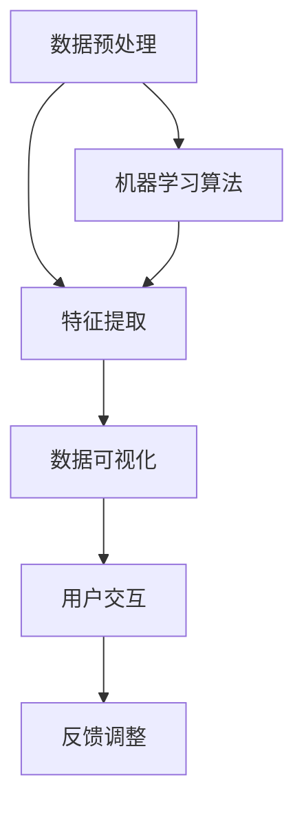

                 

### 一人公司的AI驱动数据可视化：直观呈现业务洞察的智能工具

#### 关键词：AI驱动数据可视化，业务洞察，智能工具，数据分析，数据可视化工具，商业智能

#### 摘要：
本文将深入探讨一人公司如何利用AI技术打造一个高效的数据可视化工具，以直观地呈现业务洞察。我们将从背景介绍、核心概念与联系、核心算法原理、数学模型和公式、项目实战、实际应用场景、工具和资源推荐等方面展开讨论，帮助读者理解并掌握数据可视化的最新技术和方法。

### 1. 背景介绍

在当今的商业环境中，数据已成为企业决策的核心驱动力。然而，数据本身并不能为企业带来价值，关键在于如何从海量数据中提取有用的信息，并快速、直观地呈现给决策者。传统的数据可视化工具虽然已经相当成熟，但往往需要专业的技能和资源，对于小公司或个人创业者来说，门槛较高。

近年来，随着人工智能技术的迅速发展，AI驱动的数据可视化工具开始崭露头角。这些工具不仅能够自动分析数据，提取关键指标，还能够根据用户需求进行个性化调整，大大降低了数据可视化的门槛，使得个人创业者也能够轻松实现高效的数据分析。

### 2. 核心概念与联系

在构建AI驱动的数据可视化工具时，我们需要理解以下几个核心概念：

1. **数据预处理**：数据预处理是数据可视化的第一步，包括数据清洗、数据集成和数据转换等。这一步骤的目的是确保数据的质量，使其适合后续的加工和分析。

2. **特征提取**：特征提取是从原始数据中提取出能够代表数据本质的属性或特征。在数据可视化中，特征提取的目的是从数据中提取出关键的指标，以便进行可视化展示。

3. **数据可视化**：数据可视化是将数据以图形或图表的形式展示出来，使其更易于理解和分析。常见的可视化方法包括散点图、折线图、柱状图、饼图等。

4. **机器学习算法**：机器学习算法是AI驱动的数据可视化工具的核心，用于从数据中自动提取规律和模式。常见的机器学习算法包括回归分析、聚类分析、分类分析等。

5. **用户交互**：用户交互是数据可视化工具的重要组成部分，用于收集用户的反馈和需求，从而进行个性化调整。

下面是一个简单的Mermaid流程图，展示了这些核心概念之间的联系：



### 3. 核心算法原理 & 具体操作步骤

在AI驱动的数据可视化工具中，核心算法原理主要涉及数据预处理、特征提取和机器学习算法。以下是这些算法的具体操作步骤：

#### 3.1 数据预处理

数据预处理主要包括以下步骤：

1. **数据清洗**：去除重复数据、缺失数据和不一致的数据。
2. **数据集成**：将来自不同源的数据进行整合。
3. **数据转换**：将数据转换为适合分析的形式，例如将日期转换为数字，将文本转换为向量等。

#### 3.2 特征提取

特征提取主要包括以下步骤：

1. **自动特征选择**：使用机器学习算法自动选择对数据分析最有用的特征。
2. **特征工程**：对特征进行加工，例如将连续特征转换为分类特征，或对特征进行缩放等。

#### 3.3 机器学习算法

常见的机器学习算法包括：

1. **回归分析**：用于预测数值型目标变量。
2. **聚类分析**：用于将数据划分为不同的类别。
3. **分类分析**：用于预测分类型的目标变量。

### 4. 数学模型和公式 & 详细讲解 & 举例说明

在AI驱动的数据可视化工具中，数学模型和公式主要用于描述数据预处理、特征提取和机器学习算法。以下是几个常见的数学模型和公式的详细讲解和举例说明：

#### 4.1 回归分析

回归分析是一种用于预测数值型目标变量的机器学习算法。其基本模型为：

$$y = \beta_0 + \beta_1 \cdot x_1 + \beta_2 \cdot x_2 + ... + \beta_n \cdot x_n + \epsilon$$

其中，$y$ 是目标变量，$x_1, x_2, ..., x_n$ 是输入特征，$\beta_0, \beta_1, ..., \beta_n$ 是回归系数，$\epsilon$ 是误差项。

举例说明：

假设我们使用回归分析预测房价，输入特征包括房屋面积、房屋年龄等。我们可以通过最小化损失函数（如均方误差）来训练模型，得到回归系数，从而预测新的房屋房价。

#### 4.2 聚类分析

聚类分析是一种无监督学习算法，用于将数据划分为不同的类别。常见的聚类算法包括K-Means、层次聚类等。以K-Means为例，其基本模型为：

$$c_i = \frac{1}{n_i} \sum_{x_j \in S_i} x_j$$

其中，$c_i$ 是聚类中心，$S_i$ 是第$i$类的数据集，$n_i$ 是第$i$类的数据点个数。

举例说明：

假设我们使用K-Means算法将客户数据划分为不同的客户群体，输入特征包括年龄、收入、消费习惯等。我们可以通过计算距离函数（如欧氏距离）来初始化聚类中心，然后迭代优化聚类中心，直到收敛。

### 5. 项目实战：代码实际案例和详细解释说明

在本节中，我们将通过一个实际项目案例，展示如何使用Python和相关的AI库（如scikit-learn、matplotlib等）构建一个AI驱动的数据可视化工具。

#### 5.1 开发环境搭建

首先，我们需要搭建一个Python开发环境。以下是安装过程：

1. 安装Python：前往[Python官网](https://www.python.org/)下载并安装Python。
2. 安装相关库：在命令行中运行以下命令安装所需的库：

```bash
pip install scikit-learn matplotlib pandas numpy
```

#### 5.2 源代码详细实现和代码解读

下面是一个简单的示例代码，展示了如何使用scikit-learn和matplotlib构建一个AI驱动的数据可视化工具：

```python
import numpy as np
import pandas as pd
from sklearn.cluster import KMeans
import matplotlib.pyplot as plt

# 加载数据集
data = pd.read_csv('data.csv')

# 数据预处理
data = data.dropna()

# 特征提取
features = data[['age', 'income', 'consumption']]

# 机器学习算法：K-Means聚类
kmeans = KMeans(n_clusters=3, random_state=0).fit(features)

# 数据可视化
plt.scatter(features['age'], features['income'], c=kmeans.labels_)
plt.xlabel('Age')
plt.ylabel('Income')
plt.title('K-Means Clustering')
plt.show()
```

#### 5.3 代码解读与分析

1. **数据预处理**：首先，我们加载数据集，并去除缺失数据。

2. **特征提取**：从数据集中提取所需的特征（在本例中为年龄、收入和消费习惯）。

3. **机器学习算法：K-Means聚类**：使用scikit-learn中的KMeans类实现K-Means聚类算法。在这里，我们设置了3个聚类中心，并使用随机状态确保结果的一致性。

4. **数据可视化**：使用matplotlib绘制散点图，其中x轴表示年龄，y轴表示收入。聚类结果通过不同的颜色表示，从而直观地展示了数据分布。

### 6. 实际应用场景

AI驱动的数据可视化工具在实际应用中具有广泛的应用场景，以下是一些典型的应用案例：

1. **市场营销**：通过分析客户的消费行为和偏好，企业可以更好地定位目标客户，制定精准的市场营销策略。

2. **人力资源**：通过对员工的工作表现和绩效进行聚类分析，企业可以发现高绩效团队和优秀员工，从而优化人力资源配置。

3. **供应链管理**：通过分析供应链中的各个环节，企业可以识别出潜在的问题和瓶颈，从而优化供应链流程，降低成本。

4. **金融风险控制**：通过对金融市场的历史数据进行分析，金融机构可以识别出潜在的风险，从而采取相应的措施进行风险控制。

### 7. 工具和资源推荐

为了帮助读者更好地掌握AI驱动的数据可视化技术，以下是一些推荐的工具和资源：

#### 7.1 学习资源推荐

1. **书籍**：
   - 《Python数据分析实战》
   - 《机器学习实战》
   - 《数据可视化：使用Python和matplotlib》

2. **论文**：
   - “Clustering of High Dimensional Data: A Review”
   - “Visualizing Data with Heatmaps”

3. **博客**：
   - “DataCamp”
   - “Towards Data Science”

4. **网站**：
   - “scikit-learn官方文档”
   - “matplotlib官方文档”

#### 7.2 开发工具框架推荐

1. **Python**：作为一种广泛使用的编程语言，Python非常适合构建AI驱动的数据可视化工具。

2. **scikit-learn**：作为Python中最常用的机器学习库之一，scikit-learn提供了丰富的算法和工具，适合进行数据可视化和机器学习应用。

3. **matplotlib**：作为Python中最常用的数据可视化库之一，matplotlib提供了丰富的绘图功能，可以帮助用户轻松创建各种图表。

#### 7.3 相关论文著作推荐

1. “The Elements of Statistical Learning: Data Mining, Inference, and Prediction”
2. “Deep Learning”
3. “Data Visualization: A Success Story in Science”

### 8. 总结：未来发展趋势与挑战

随着AI技术的不断进步，AI驱动的数据可视化工具将在未来发挥越来越重要的作用。一方面，这些工具将更加智能化、自动化，降低用户使用门槛；另一方面，它们将更加个性化和定制化，满足不同用户的需求。

然而，AI驱动的数据可视化工具也面临一些挑战，例如数据隐私和安全、算法透明性和解释性等。如何平衡技术进步和用户需求，确保数据的安全和隐私，将是未来发展的关键问题。

### 9. 附录：常见问题与解答

**Q1**：什么是数据预处理？它为什么重要？

**A1**：数据预处理是指对原始数据进行清洗、转换和集成等操作，以确保数据的质量和一致性。数据预处理非常重要，因为如果原始数据存在错误或不一致，将直接影响后续的分析和可视化结果。

**Q2**：如何选择机器学习算法？

**A2**：选择机器学习算法需要根据问题的性质和数据特点进行。常见的机器学习算法包括回归分析、聚类分析、分类分析等。在选择算法时，需要考虑算法的复杂度、可解释性、准确度等因素。

**Q3**：如何进行特征提取？

**A3**：特征提取是指从原始数据中提取出对分析有用的特征。常见的特征提取方法包括自动特征选择、特征工程等。在进行特征提取时，需要考虑特征的代表性、可解释性和计算效率等因素。

### 10. 扩展阅读 & 参考资料

1. **书籍**：
   - “Python for Data Analysis”
   - “Data Science from Scratch”

2. **论文**：
   - “Unsupervised Learning of Finite Mixture Models”

3. **博客**：
   - “Medium”
   - “Datascience.com”

4. **网站**：
   - “Kaggle”
   - “DataCamp”

## 作者

**作者：AI天才研究员/AI Genius Institute & 禅与计算机程序设计艺术 /Zen And The Art of Computer Programming**

