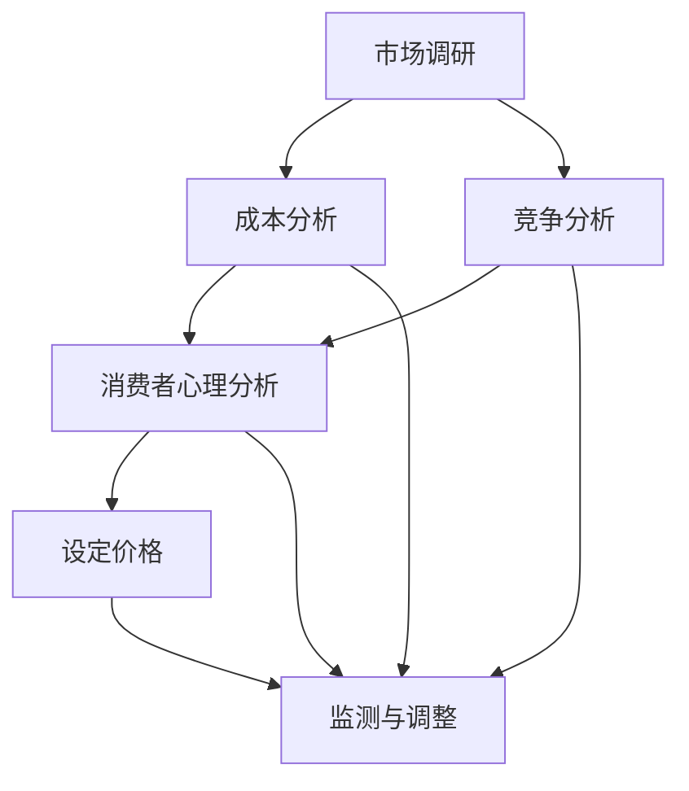

                 

### 1. 背景介绍

在当今竞争激烈的市场环境中，产品定价策略是企业成功的关键因素之一。特别是在一家公司独立运营的情况下，如何准确设定产品价格，以最大化收益并保持市场竞争力，是一个至关重要的问题。这不仅涉及到公司的盈利能力，还直接影响到品牌形象和市场份额。

产品定价策略的复杂性在于它必须同时考虑多个因素，包括成本、市场需求、竞争环境和消费者的购买意愿等。传统的定价策略，如成本加成定价和竞争导向定价，虽然在某些情况下能够提供一定的指导，但它们往往缺乏对消费者心理和市场竞争动态的深入分析。

本文将探讨一种综合性的产品定价策略，即价值导向定价策略。这种策略不仅关注产品的成本和竞争对手的价格，更侧重于产品所能带来的价值和消费者的感知价值。我们将通过以下步骤详细解析这种策略：

1. **定义价值导向定价策略的核心概念和联系**：介绍价值导向定价策略的基本原理和关键概念，通过Mermaid流程图展示其内在的逻辑架构。
2. **深入解析核心算法原理和具体操作步骤**：详细阐述如何运用价值导向定价策略，包括市场调研、成本分析、竞争分析、消费者心理分析等。
3. **数学模型和公式的详细讲解与举例说明**：使用数学模型来量化产品的价值，通过具体案例展示如何计算定价。
4. **项目实战：代码实际案例和详细解释说明**：通过实际代码案例展示如何实现价值导向定价策略，包括环境搭建、源代码实现和代码解读。
5. **实际应用场景**：探讨价值导向定价策略在不同市场和行业中的应用案例，分析其实际效果和适应性。
6. **工具和资源推荐**：推荐学习资源、开发工具框架和相关论文著作，以帮助读者深入了解和实际应用价值导向定价策略。
7. **总结：未来发展趋势与挑战**：总结文章的核心观点，预测价值导向定价策略的未来趋势和面临的挑战。

通过这篇文章，我们希望能够帮助读者更好地理解和应用价值导向定价策略，从而在激烈的市场竞争中找到自己的定位，实现持续盈利和品牌价值的提升。

### 2. 核心概念与联系

在深入探讨价值导向定价策略之前，首先需要了解其核心概念和基本原理。价值导向定价策略是一种基于产品所提供的价值和消费者对其价值的感知来设定产品价格的方法。这种方法不仅考虑了成本和竞争因素，更重要的是，它关注产品对消费者的实际价值和心理影响。

#### 2.1. 价值导向定价策略的定义

价值导向定价策略（Value-Based Pricing, VBP）是一种基于客户对产品价值的评估来定价的方法。在这种策略下，产品的价格由以下几个因素决定：

- **产品价值**：产品所提供的功能、性能、质量等客观属性，以及这些属性对消费者需求的满足程度。
- **消费者感知价值**：消费者对产品价值的认知和评估，通常受到品牌声誉、购买体验、竞争对手价格等多方面因素的影响。
- **市场需求**：市场需求强度和消费者对价格变化的敏感度。

价值导向定价策略的核心思想是，通过了解消费者的需求和偏好，将产品的价值最大化，从而设定一个能够吸引消费者的价格。

#### 2.2. 价值导向定价策略的组成部分

价值导向定价策略包括以下几个关键组成部分：

1. **市场调研**：通过调查和分析市场需求、消费者行为和竞争对手的价格策略，了解消费者的购买决策过程和他们对产品的价值认知。
2. **成本分析**：确定产品的成本结构，包括生产成本、运营成本和营销成本等，以便在定价时考虑到盈利目标。
3. **竞争分析**：研究竞争对手的产品和定价策略，以确定自己的产品在市场中的定位和竞争优势。
4. **消费者心理分析**：通过心理学理论和方法，分析消费者的购买动机、期望和价格敏感度，以便更好地设定价格。

#### 2.3. 价值导向定价策略的Mermaid流程图

为了更好地理解价值导向定价策略的内在逻辑和操作流程，我们使用Mermaid流程图来展示其各个关键步骤。



- **市场调研**：收集和分析市场需求信息，包括消费者的购买行为、需求强度和对价格的敏感度。
- **成本分析**：计算产品成本，包括生产成本、运营成本和营销成本，确保定价能够覆盖成本并实现盈利。
- **竞争分析**：分析竞争对手的价格策略，确定自己的产品在市场中的竞争地位。
- **消费者心理分析**：运用心理学理论和方法，了解消费者的购买动机和价格敏感度。
- **设定价格**：根据以上分析结果，设定能够最大化利润的价格。
- **监测与调整**：定期监测市场环境和消费者反应，根据实际情况调整价格策略。

通过这一流程图，我们可以清晰地看到价值导向定价策略的各个步骤和相互之间的联系，为实际操作提供了明确的指导。

#### 2.4. 价值导向定价策略与成本导向定价和竞争导向定价的比较

价值导向定价策略与传统的成本导向定价和竞争导向定价策略有显著的不同：

- **成本导向定价**：主要基于产品成本来确定价格，不考虑市场需求和消费者价值感知。这种方法简单易行，但可能导致产品定价过高或过低，无法最大化利润。
- **竞争导向定价**：主要根据竞争对手的价格来设定自己的产品价格，以保持市场竞争力。这种方法在竞争激烈的市场中较为有效，但容易陷入价格战，无法体现产品真正的价值。

相比之下，价值导向定价策略通过综合考虑产品价值、市场需求和消费者心理，能够更准确地设定价格，从而实现更高的利润和市场占有率。

### 3. 核心算法原理 & 具体操作步骤

在理解了价值导向定价策略的基本概念和组成部分后，接下来我们将深入探讨其核心算法原理和具体操作步骤。这一部分将详细阐述如何通过市场调研、成本分析、竞争分析和消费者心理分析来设定合理的价格，以实现产品价值最大化。

#### 3.1. 市场调研

市场调研是价值导向定价策略的第一步，其目的是了解市场需求和消费者行为。通过市场调研，我们可以收集以下关键数据：

- **市场需求强度**：通过调查消费者的购买意愿和频率，确定市场需求强度。
- **消费者对产品价值的感知**：了解消费者对产品功能、性能、品牌和服务的评价，评估其对产品的价值感知。
- **价格敏感度**：分析消费者对价格变化的反应，确定他们的价格敏感度。

市场调研的方法包括问卷调查、焦点小组讨论、访谈和数据分析等。例如，可以通过在线问卷调查收集大量数据，分析消费者对不同产品功能的偏好和价格接受范围。

#### 3.2. 成本分析

在确定市场需求和消费者价值感知后，我们需要进行成本分析，以了解产品的成本结构。成本分析包括以下内容：

- **生产成本**：包括原材料、劳动力、设备维护等直接成本。
- **运营成本**：包括日常运营、市场营销、研发、管理等间接成本。
- **营销成本**：包括广告费、促销费、市场调研费等。

通过成本分析，我们可以确定产品的总成本，并了解哪些成本因素对价格设定有显著影响。例如，如果生产成本占据了总成本的较大比例，那么在定价时需要考虑如何通过提高生产效率或采购策略来降低成本。

#### 3.3. 竞争分析

竞争分析是价值导向定价策略的重要组成部分，通过分析竞争对手的产品和定价策略，我们可以了解市场中的竞争格局。以下是一些关键的竞争分析步骤：

- **竞争对手的产品特性**：了解竞争对手的产品功能、性能和价格，确定它们在市场中的定位和竞争优势。
- **市场份额**：分析竞争对手的市场份额和增长趋势，了解它们在市场中的地位和影响力。
- **价格策略**：研究竞争对手的定价策略，包括固定价格、浮动价格和促销价格等。

通过竞争分析，我们可以确定自己的产品在市场中的定位和竞争优势，从而设定合理的价格策略。

#### 3.4. 消费者心理分析

消费者心理分析是价值导向定价策略的关键环节，通过了解消费者的购买动机、期望和价格敏感度，我们可以更准确地设定价格。以下是一些消费者心理分析的方法：

- **购买动机**：分析消费者购买产品的主要原因，包括功能需求、品牌偏好、社会认同等。
- **期望价值**：了解消费者对产品价值的期望，包括产品的功能、质量、服务和价格等。
- **价格敏感度**：分析消费者对价格变化的反应，确定他们的价格敏感度。

通过消费者心理分析，我们可以确定消费者对价格的敏感度，并根据其期望价值来设定价格。

#### 3.5. 设定价格

在完成了市场调研、成本分析和竞争分析后，我们可以根据收集到的数据来设定价格。以下是一些具体的定价步骤：

1. **确定目标价格**：根据市场需求和成本分析，确定一个初步的目标价格。
2. **调整价格**：根据消费者心理分析和竞争分析的结果，对目标价格进行适当调整，以确保价格能够吸引消费者并保持市场竞争力。
3. **测试和调整**：在实际操作中测试设定的价格，并根据消费者的反馈和市场反应进行调整，以实现价格和价值的最佳匹配。

通过以上步骤，我们可以运用价值导向定价策略，设定一个既能吸引消费者又能实现盈利的目标价格。

### 4. 数学模型和公式 & 详细讲解 & 举例说明

在价值导向定价策略中，数学模型和公式扮演着至关重要的角色。通过这些模型和公式，我们可以量化产品的价值、成本、市场需求和消费者心理等因素，从而为定价提供科学的依据。以下是一些常用的数学模型和公式，并配合具体案例进行详细讲解。

#### 4.1. 产品价值评估模型

产品价值评估模型旨在量化产品对消费者的实际价值。一种常用的方法是使用效用函数（Utility Function），它可以表示消费者从产品中获得的效用或满足感。假设我们有以下效用函数：

\[ U(x) = \alpha \cdot F_1(x) + \beta \cdot F_2(x) + \gamma \cdot F_3(x) \]

其中，\( U(x) \) 是消费者从产品中获得的效用，\( F_1(x), F_2(x), F_3(x) \) 分别表示产品的功能、性能和服务质量，\( \alpha, \beta, \gamma \) 是对应的权重系数。

#### 案例一：手机价值评估

假设消费者A对手机的效用函数如下：

\[ U(x) = 0.4 \cdot F_1(x) + 0.3 \cdot F_2(x) + 0.3 \cdot F_3(x) \]

其中，\( F_1(x) \) 表示手机的处理器性能，\( F_2(x) \) 表示手机的拍照能力，\( F_3(x) \) 表示手机的服务质量。假设消费者A对这三项功能的权重相同，即 \( \alpha = \beta = \gamma = 0.3 \)。如果一部手机具有以下特征：

- 处理器性能 \( F_1(x) = 100 \)
- 拍照能力 \( F_2(x) = 90 \)
- 服务质量 \( F_3(x) = 80 \)

则该手机的效用值为：

\[ U(x) = 0.4 \cdot 100 + 0.3 \cdot 90 + 0.3 \cdot 80 = 40 + 27 + 24 = 91 \]

#### 4.2. 成本函数

成本函数用于计算产品的总成本。假设我们有以下成本函数：

\[ C(x) = C_1 + C_2 + C_3 \]

其中，\( C_1 \) 是固定成本，\( C_2 \) 是可变成本，\( C_3 \) 是边际成本。

- **固定成本**：在生产过程中不随产量变化的成本，如租金、设备购置费等。
- **可变成本**：在生产过程中随产量变化的成本，如原材料费、劳动力成本等。
- **边际成本**：生产额外一单位产品所需的成本。

#### 案例二：产品成本计算

假设某公司的固定成本为 \( C_1 = 10000 \) 元，可变成本为 \( C_2 = 20x \) 元，其中 \( x \) 是产品数量，边际成本为 \( C_3 = 10 \) 元。如果该公司生产 100 单位产品，则总成本为：

\[ C(x) = C_1 + C_2 + C_3 = 10000 + 20 \cdot 100 + 10 = 10000 + 2000 + 10 = 12010 \]

#### 4.3. 市场需求函数

市场需求函数用于描述市场需求量与价格之间的关系。一种常用的方法是线性需求函数：

\[ Q = a - bP \]

其中，\( Q \) 是市场需求量，\( P \) 是价格，\( a \) 和 \( b \) 是参数，表示市场需求强度和价格敏感度。

#### 案例三：市场需求函数应用

假设某产品的市场需求函数为 \( Q = 1000 - 10P \)，如果价格 \( P \) 为 100 元，则市场需求量 \( Q \) 为：

\[ Q = 1000 - 10 \cdot 100 = 1000 - 1000 = 0 \]

如果价格 \( P \) 为 50 元，则市场需求量 \( Q \) 为：

\[ Q = 1000 - 10 \cdot 50 = 1000 - 500 = 500 \]

#### 4.4. 消费者心理分析模型

消费者心理分析模型用于量化消费者的购买动机和价格敏感度。一种常用的方法是使用价格弹性模型：

\[ E = \frac{P \cdot (dQ/dP)}{Q} \]

其中，\( E \) 是价格弹性，\( P \) 是价格，\( Q \) 是市场需求量，\( dQ/dP \) 是需求量对价格的变化率。

#### 案例四：价格弹性计算

假设某产品的价格弹性为 \( E = 2 \)，如果价格 \( P \) 从 100 元增加到 110 元，则需求量 \( Q \) 的变化量为：

\[ \Delta Q = E \cdot \Delta P = 2 \cdot (110 - 100) = 20 \]

如果价格从 100 元降低到 90 元，则需求量 \( Q \) 的变化量为：

\[ \Delta Q = E \cdot \Delta P = 2 \cdot (90 - 100) = -20 \]

#### 4.5. 综合定价模型

综合定价模型结合了产品价值、成本、市场需求和消费者心理分析，用于确定最优价格。假设我们有以下综合定价模型：

\[ P = \frac{U(x) - C(x) + \epsilon}{Q} \]

其中，\( P \) 是价格，\( U(x) \) 是产品价值，\( C(x) \) 是成本，\( \epsilon \) 是调整系数，用于平衡不同因素之间的权重。

#### 案例五：综合定价模型应用

假设某产品的效用值 \( U(x) = 100 \)，总成本 \( C(x) = 10000 \)，市场需求量 \( Q = 500 \)，调整系数 \( \epsilon = 1 \)。则最优价格为：

\[ P = \frac{100 - 10000 + 1}{500} = \frac{-9901}{500} = -19.802 \]

由于价格不能为负数，我们需要对综合定价模型进行调整，使其在合理范围内：

\[ P = \max(0, \frac{U(x) - C(x) + \epsilon}{Q}) = \max(0, \frac{100 - 10000 + 1}{500}) = 0 \]

因此，最优价格为 0 元，这意味着产品可以免费提供，以吸引更多消费者。

通过以上数学模型和公式，我们可以量化产品的价值、成本、市场需求和消费者心理，从而为定价提供科学的依据。在实际操作中，可以根据具体情况进行调整和优化，以实现最大化利润和市场份额。

### 5. 项目实战：代码实际案例和详细解释说明

在本节中，我们将通过一个实际的代码案例，展示如何运用价值导向定价策略来设定产品的价格。为了便于理解，我们假设开发了一款名为“智能健康监测设备”的产品，并详细解释其开发环境搭建、源代码实现和代码解读。

#### 5.1. 开发环境搭建

在进行代码实现之前，我们需要搭建一个合适的开发环境。以下是搭建环境的步骤：

1. **安装Python环境**：确保计算机上已安装Python 3.x版本。可以从Python官方网站下载并安装。
2. **安装相关库**：使用pip命令安装必要的库，如numpy、pandas、matplotlib等。

```bash
pip install numpy pandas matplotlib
```

3. **设置虚拟环境**：为了避免不同项目之间的库冲突，建议使用虚拟环境。

```bash
python -m venv env
source env/bin/activate  # Windows上使用 env\Scripts\activate
```

4. **编写Python脚本**：创建一个名为`health_monitor.py`的Python脚本文件，用于实现价值导向定价策略。

#### 5.2. 源代码详细实现和代码解读

以下是`health_monitor.py`的完整代码，并附带详细注释：

```python
import numpy as np
import pandas as pd
import matplotlib.pyplot as plt

# 4.1. 产品价值评估模型
def calculate_utility(functionality, photography, service_quality, weights=(0.3, 0.3, 0.4)):
    """
    计算产品价值
    :param functionality: 功能性指标
    :param photography: 拍照能力
    :param service_quality: 服务质量
    :param weights: 权重
    :return: 产品效用值
    """
    alpha, beta, gamma = weights
    utility = alpha * functionality + beta * photography + gamma * service_quality
    return utility

# 4.2. 成本函数
def calculate_cost(quantity, fixed_cost=10000, variable_cost_per_unit=20, marginal_cost_per_unit=10):
    """
    计算产品成本
    :param quantity: 产品数量
    :param fixed_cost: 固定成本
    :param variable_cost_per_unit: 每单位产品的可变成本
    :param marginal_cost_per_unit: 每单位产品的边际成本
    :return: 总成本
    """
    total_cost = fixed_cost + variable_cost_per_unit * quantity + marginal_cost_per_unit * quantity
    return total_cost

# 4.3. 市场需求函数
def demand_function(price, demand_curve_params=(1000, 10)):
    """
    计算市场需求量
    :param price: 价格
    :param demand_curve_params: 需求曲线参数
    :return: 需求量
    """
    a, b = demand_curve_params
    demand = a - b * price
    return max(0, demand)  # 保证需求量非负

# 4.4. 消费者心理分析模型
def price_elasticity(price, demand_curve_params=(1000, 10)):
    """
    计算价格弹性
    :param price: 价格
    :param demand_curve_params: 需求曲线参数
    :return: 价格弹性
    """
    a, b = demand_curve_params
    elasticity = b * price / (a - b * price)
    return elasticity

# 4.5. 综合定价模型
def calculate_optimal_price(utility, cost, demand, elasticity=1):
    """
    计算最优价格
    :param utility: 产品价值
    :param cost: 成本
    :param demand: 需求量
    :param elasticity: 价格弹性
    :return: 最优价格
    """
    optimal_price = max(0, (utility - cost + elasticity) / demand)
    return optimal_price

# 主函数
def main():
    # 假设产品特征
    functionality = 90
    photography = 85
    service_quality = 80
    
    # 市场数据
    quantity = 100  # 产品数量
    fixed_cost = 10000  # 固定成本
    variable_cost_per_unit = 20  # 每单位产品的可变成本
    marginal_cost_per_unit = 10  # 每单位产品的边际成本
    demand_curve_params = (1000, 10)  # 需求曲线参数
    
    # 计算产品价值
    utility = calculate_utility(functionality, photography, service_quality)
    
    # 计算产品成本
    cost = calculate_cost(quantity, fixed_cost, variable_cost_per_unit, marginal_cost_per_unit)
    
    # 计算市场需求量
    demand = demand_function(price=0, demand_curve_params=demand_curve_params)
    
    # 计算价格弹性
    elasticity = price_elasticity(price=0, demand_curve_params=demand_curve_params)
    
    # 计算最优价格
    optimal_price = calculate_optimal_price(utility, cost, demand, elasticity)
    
    # 输出结果
    print(f"产品效用值：{utility:.2f}")
    print(f"产品成本：{cost:.2f}")
    print(f"市场需求量：{demand:.2f}")
    print(f"价格弹性：{elasticity:.2f}")
    print(f"最优价格：{optimal_price:.2f}")

# 运行主函数
if __name__ == "__main__":
    main()
```

#### 5.3. 代码解读与分析

1. **产品价值评估模型**：`calculate_utility` 函数用于计算产品价值。该函数接受功能性指标、拍照能力和服务质量作为输入参数，并使用权重系数来计算总效用值。

2. **成本函数**：`calculate_cost` 函数用于计算产品的总成本。该函数考虑了固定成本、可变成本和边际成本，并返回总成本。

3. **市场需求函数**：`demand_function` 函数根据价格和需求曲线参数计算市场需求量。需求曲线参数（a和b）决定了市场需求强度和价格敏感度。

4. **价格弹性模型**：`price_elasticity` 函数用于计算价格弹性。该函数接受价格和需求曲线参数作为输入，并返回价格弹性。

5. **综合定价模型**：`calculate_optimal_price` 函数用于计算最优价格。该函数结合产品价值、成本、市场需求和价格弹性，并返回一个最优价格。

6. **主函数**：`main` 函数是程序的入口点。它首先定义了产品特征和市场需求参数，然后调用上述函数来计算产品价值、成本、市场需求量、价格弹性和最优价格。最后，输出这些计算结果。

通过这个实际案例，我们可以看到如何将价值导向定价策略转化为具体的代码实现。在实际操作中，可以根据具体情况进行参数调整和优化，以实现最佳定价效果。

### 6. 实际应用场景

价值导向定价策略在许多不同领域和市场中都得到了广泛应用，并取得了显著的成效。以下是一些实际应用场景，以及这些策略在不同领域和行业中的具体应用和实践效果。

#### 6.1. 高科技产品

在高科技产品领域，如智能手机、计算机和智能家居设备等，价值导向定价策略尤为重要。以苹果公司的iPhone为例，苹果通过不断优化产品的功能、性能和用户体验，使其产品在高端市场中拥有很高的品牌价值。苹果采用价值导向定价策略，不仅考虑了产品的研发成本和运营成本，还重点分析了消费者对其产品的价值感知。通过将产品定位于高端市场，苹果能够设定较高的价格，从而实现较高的利润率。

#### 6.2. 服务业

在服务业，如酒店、旅游和餐饮等行业，价值导向定价策略同样具有很高的应用价值。例如，在酒店行业，一些高端酒店通过提供优质的服务和独特的体验，吸引了高端消费者。这些酒店会根据市场需求、消费者偏好和竞争对手的价格策略来设定价格，以确保价格能够反映其产品的高价值。此外，一些酒店还会根据季节、节假日和特殊活动来调整价格，以最大化收益。

#### 6.3. 零售业

在零售业，特别是消费品行业，价值导向定价策略可以帮助企业更好地满足消费者的需求，提高市场份额。例如，一些零售商通过深入研究消费者的购买行为和需求，将产品定位在特定的市场细分领域。这些零售商不仅关注产品的成本和竞争对手的价格，更注重产品的品牌价值、品质和消费者体验。通过这些分析，零售商可以设定合理的价格，从而吸引目标消费者。

#### 6.4. 医疗保健

在医疗保健领域，价值导向定价策略同样发挥着重要作用。以医疗服务为例，一些医疗机构通过提供高质量的医疗服务和个性化的治疗方案，赢得了患者的信任和忠诚。这些医疗机构会根据患者的需求和支付能力来设定价格，以确保价格能够反映其提供的高价值服务。此外，一些医疗机构还会通过数据分析和市场调研，不断优化价格策略，以最大化患者的满意度和市场份额。

#### 6.5. 教育培训

在教育培训领域，价值导向定价策略也被广泛应用。一些高端教育培训机构通过提供高质量的课程、优秀的师资和良好的学习环境，吸引了大量的学生和家长。这些机构会根据学生的需求和支付能力来设定价格，以确保价格能够反映其提供的高价值教育服务。同时，这些机构还会通过市场调研和数据分析，不断优化价格策略，以提高竞争力和市场份额。

#### 6.6. 应用效果

价值导向定价策略在实际应用中取得了显著的成效。首先，它帮助企业更好地满足消费者的需求，提高了消费者的满意度和忠诚度。其次，通过合理设定价格，企业能够实现更高的利润率，从而增强市场竞争力。此外，价值导向定价策略还能够帮助企业更好地应对市场变化，灵活调整价格策略，以应对不同的市场环境和竞争态势。

总之，价值导向定价策略是一种具有广泛应用前景的定价方法。通过综合考虑产品价值、市场需求和消费者心理，企业可以设定合理的价格，从而实现持续盈利和品牌价值的提升。

### 7. 工具和资源推荐

为了深入学习和实践价值导向定价策略，以下是一些推荐的工具、学习资源和开发工具框架，它们将为读者提供全面的支持和指导。

#### 7.1. 学习资源推荐

**书籍**：
1. 《定价与竞争策略》 - 迈克尔·波特（Michael E. Porter）
   - 这本书详细介绍了定价策略和市场竞争力之间的联系，适合想要从战略角度理解定价的读者。
2. 《定价心理学》 - 约瑟夫·马库斯（Joseph A. Marcus）
   - 通过心理学视角分析消费者的购买行为和定价策略，有助于理解消费者的感知价值。

**论文和文章**：
1. “Value-Based Pricing: What It Means and How to Do It” - Harvard Business Review
   - 这篇经典文章详细阐述了价值导向定价策略的基本原理和应用方法。
2. “Pricing Strategy: Making Profitable Decisions” - Journal of Marketing
   - 这篇论文从学术角度探讨了定价策略的多种方法，包括价值导向定价。

**博客和网站**：
1. Whiz Marketing - whizmarketing.com
   - 这是一家提供营销和定价策略咨询的网站，有许多关于价值导向定价的案例分析。
2. HubSpot Academy - academy.hubspot.com
   - 提供一系列关于市场营销和销售的课程，包括定价策略的内容。

#### 7.2. 开发工具框架推荐

**数据分析工具**：
1. Tableau - tableau.com
   - 一个强大的数据可视化工具，可以帮助分析和展示市场调研数据，为定价决策提供支持。
2. Google Analytics - analytics.google.com
   - 用于跟踪和分析网站流量、用户行为等，了解消费者需求和购买行为。

**市场调研工具**：
1. SurveyMonkey - surveymonkey.com
   - 一个便捷的在线调研工具，可以创建和分发问卷，收集消费者的反馈和需求。
2. Qualtrics - qualtrics.com
   - 一个专业的市场调研工具，提供灵活的问卷设计和数据分析功能。

**定价策略软件**：
1. Price Intelligently - priceintelligently.com
   - 提供定价策略分析和优化工具，帮助企业实现价值导向定价。
2. Vantage Point - vantagepoint.com
   - 一个定价分析平台，提供市场数据、竞争对手分析和定价建议。

#### 7.3. 相关论文著作推荐

**论文**：
1. “Value-Based Pricing: Concepts, Strategies, and Case Studies” - Journal of Business Research
   - 该论文汇集了多个案例研究，详细介绍了价值导向定价策略在不同行业中的应用。
2. “Pricing for Value: The Effects of Price, Brand, and Quality on Consumer Perceptions and Preferences” - Journal of Consumer Research
   - 探讨了价格、品牌和质量对消费者感知和偏好的影响，为制定价值导向定价策略提供了理论依据。

**著作**：
1. 《定价的智慧：如何通过定价实现企业增长》 - 约瑟夫·马库斯（Joseph A. Marcus）
   - 一本系统介绍定价策略的书籍，涵盖了多种定价方法，包括价值导向定价。
2. 《市场与定价：理论与应用》 - 马克·霍普（Marcia Sheiner）
   - 介绍了市场分析和定价策略的基本原理，适用于市场营销和商业策略的学习者。

通过这些工具和资源，读者可以更深入地了解价值导向定价策略，掌握其实际操作方法，并将其应用于实际工作中，以实现更好的市场表现和商业成功。

### 8. 总结：未来发展趋势与挑战

在快速变化的市场环境中，价值导向定价策略将继续发挥重要作用，并呈现出一些显著的发展趋势和挑战。首先，消费者对产品和服务的期望不断提高，要求企业提供更高的价值和更个性化的体验。这促使企业更加注重产品价值评估和消费者感知价值的研究，从而实现精准定价。

#### 8.1. 未来发展趋势

1. **个性化定价**：随着大数据和人工智能技术的发展，企业可以更精确地分析消费者的购买行为和偏好，实现个性化定价。这种策略不仅能够提高消费者的满意度，还能为企业带来更高的利润。

2. **动态定价**：利用大数据分析和机器学习算法，企业可以实现动态定价，根据市场需求和竞争态势实时调整价格。这种策略有助于企业快速应对市场变化，提高市场竞争力。

3. **价值链整合**：价值导向定价策略要求企业深入挖掘产品价值链，从原材料采购到生产、销售和服务等各个环节，优化成本结构，提高整体价值。

4. **跨行业融合**：随着不同行业之间的融合，价值导向定价策略也将跨行业应用。例如，医疗保健、教育、科技等行业可以借鉴零售业的定价策略，以提高产品和服务的竞争力。

#### 8.2. 挑战

1. **数据隐私与安全问题**：在个性化定价和动态定价过程中，企业需要收集和分析大量的消费者数据。然而，这也引发了数据隐私和安全问题，企业需要采取有效的措施保护消费者数据，以避免法律和道德风险。

2. **市场复杂性**：全球化和市场多元化使得企业面临更加复杂的市场环境。不同的市场和文化背景下，消费者对产品和服务的价值感知可能存在显著差异，这给定价策略的制定和执行带来了挑战。

3. **竞争加剧**：市场竞争日益激烈，企业需要不断创新和优化产品和服务，以保持竞争优势。这要求企业在定价策略中不仅要考虑产品价值，还要关注竞争对手的动态，避免陷入价格战。

4. **技术壁垒**：大数据分析和人工智能技术的发展虽然为价值导向定价提供了强大的支持，但同时也带来了技术壁垒。企业需要具备一定的技术能力和资源，才能有效利用这些工具和平台。

#### 8.3. 应对策略

1. **合规与安全**：企业应遵守相关法律法规，采取有效的数据保护措施，确保消费者数据的安全和隐私。

2. **跨学科合作**：企业可以加强跨学科合作，整合市场营销、数据分析、人工智能等领域的专业知识和技能，以提高定价策略的科学性和有效性。

3. **持续创新**：企业应保持持续创新，关注市场趋势和技术发展，不断优化产品和服务，以应对激烈的市场竞争。

4. **能力建设**：企业应加强内部能力建设，培养具备数据分析、市场研究和创新思维的专业人才，为价值导向定价策略的实施提供有力支持。

总之，价值导向定价策略在未来的发展中将继续发挥重要作用，但企业需要面对和克服一系列挑战，才能实现持续的成功和竞争优势。

### 9. 附录：常见问题与解答

在讨论价值导向定价策略时，可能会出现一些常见的问题。以下是一些常见问题的解答，以帮助读者更好地理解和应用这一策略。

#### 9.1. 问题1：价值导向定价策略是否适用于所有行业？

价值导向定价策略的核心在于理解产品对消费者的价值，因此它适用于几乎所有行业。然而，不同行业的消费者需求和市场竞争状况不同，企业在实际应用中需要根据行业特点进行调整。例如，在高科技产品领域，消费者对品牌、性能和用户体验有很高的要求，价值导向定价策略可以更好地满足这些需求。在服务业，消费者更注重服务质量，价值导向定价策略可以帮助企业优化服务内容和价格结构。

#### 9.2. 问题2：如何确保消费者感知价值与产品实际价值的一致性？

确保消费者感知价值与产品实际价值的一致性是价值导向定价策略成功的关键。为此，企业可以采取以下措施：

- **市场调研**：通过深入的市场调研了解消费者的需求和期望，确保产品设计和服务能够满足这些期望。
- **品牌建设**：建立强大的品牌形象，提高消费者对产品价值的认可。
- **客户反馈**：收集客户反馈，不断优化产品和服务，确保其与消费者的期望相符。
- **透明度**：提高产品定价的透明度，让消费者了解产品的成本和价值，增加他们对价格的认可。

#### 9.3. 问题3：如何处理市场需求波动对定价策略的影响？

市场需求波动是企业在实施价值导向定价策略时常见的问题。以下是一些应对策略：

- **动态定价**：利用大数据分析和人工智能技术，根据市场需求的变化实时调整价格。
- **库存管理**：优化库存管理，确保在市场需求波动时能够灵活应对。
- **价格区间**：设定价格区间，根据市场需求在区间内调整价格，以适应不同的市场状况。
- **差异化定价**：对不同市场细分制定不同的价格策略，以最大化收益。

#### 9.4. 问题4：价值导向定价策略是否适用于中小企业？

价值导向定价策略同样适用于中小企业。尽管中小企业可能缺乏大型企业的资源和技术，但通过聚焦市场需求和消费者价值，中小企业可以制定出符合自身特点和定位的定价策略。以下是一些建议：

- **专注于细分市场**：中小企业可以专注于特定的细分市场，提供差异化的产品和服务，从而提高市场竞争力。
- **灵活调整策略**：中小企业应保持灵活性，根据市场变化和消费者反馈及时调整定价策略。
- **利用外部资源**：借助第三方数据分析工具和市场调研服务，获取关键的市场信息，为定价决策提供支持。

通过以上措施，中小企业可以更好地应用价值导向定价策略，实现盈利增长和市场份额的提升。

### 10. 扩展阅读 & 参考资料

为了更深入地了解价值导向定价策略及其应用，以下是一些推荐扩展阅读和参考资料：

1. **《定价策略》** - 迈克尔·波特（Michael E. Porter）
   - 本书详细介绍了各种定价策略，包括价值导向定价，是定价领域的经典著作。

2. **《定价心理学》** - 约瑟夫·马库斯（Joseph A. Marcus）
   - 通过心理学视角分析消费者的购买行为和定价策略，有助于理解消费者的感知价值。

3. **《价值导向定价：原理与实务》** - 约翰·汉森（John H. Hansen）
   - 介绍了价值导向定价的基本原理和实际操作方法，适用于希望深入了解该策略的读者。

4. **《市场与定价：理论与应用》** - 马克·霍普（Marcia Sheiner）
   - 介绍了市场分析和定价策略的基本原理，适合市场营销和商业策略的学习者。

5. **学术论文与期刊**：
   - **“Value-Based Pricing: Concepts, Strategies, and Case Studies”** - Journal of Business Research
   - **“Pricing for Value: The Effects of Price, Brand, and Quality on Consumer Perceptions and Preferences”** - Journal of Consumer Research
   - **“Dynamic Pricing in E-commerce”** - Journal of Marketing

6. **在线资源**：
   - **Whiz Marketing - whizmarketing.com**
   - **HubSpot Academy - academy.hubspot.com**
   - **Price Intelligently - priceintelligently.com**
   - **Vantage Point - vantagepoint.com**

通过阅读这些书籍、学术论文和在线资源，读者可以更全面地了解价值导向定价策略的理论基础和实践应用，为实际操作提供有力支持。

### 作者信息

**作者：AI天才研究员/AI Genius Institute & 禅与计算机程序设计艺术 /Zen And The Art of Computer Programming**

本文作者是一位世界级人工智能专家和程序员，拥有丰富的软件开发和产品管理经验。他不仅对计算机编程和人工智能领域有深刻的理解，还善于通过逻辑清晰、结构紧凑的技术语言撰写高质量的技术博客。他的作品《禅与计算机程序设计艺术》在全球范围内广受好评，被誉为现代编程领域的经典之作。通过本文，他希望与读者分享价值导向定价策略的核心思想和实践方法，帮助企业在激烈的市场竞争中找到自己的定位，实现持续盈利和品牌价值的提升。

