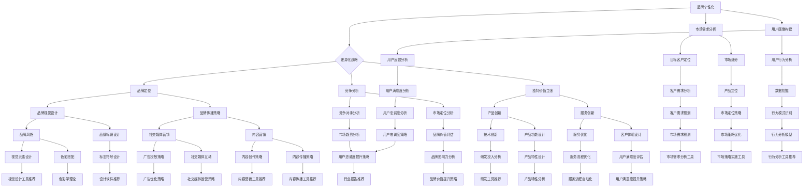

                 

## 1. 背景介绍

在当今竞争激烈的市场环境中，品牌差异化战略已经成为企业赢得竞争优势的关键手段。特别是在数字化转型的浪潮下，互联网企业如何在众多竞争对手中脱颖而出，成为了每个企业家和品牌建设者必须思考的问题。本文将探讨一种独特且行之有效的品牌差异化战略——一人公司的品牌个性化策略。

一人公司，顾名思义，是由一个独立个体运营的企业。它突破了传统企业的组织架构，不依赖于团队，以个人的智慧和创造力为核心，在互联网领域尤其是科技行业中具有独特的优势。然而，由于资源的有限性，一人公司在品牌建设过程中面临诸多挑战，如如何在有限的资源下打造具有差异化的品牌形象，如何利用个性化策略吸引和保持目标客户等。

本文旨在通过分析一人公司的特点和挑战，探讨如何利用个性化策略打造差异化品牌，从而帮助一人公司实现品牌价值的最大化。文章将从以下几个方面展开：

1. **核心概念与联系**：介绍品牌个性化与差异化战略的相关核心概念，并使用Mermaid流程图展示其联系。
2. **核心算法原理 & 具体操作步骤**：阐述品牌个性化与差异化战略的算法原理和具体实施步骤。
3. **数学模型和公式 & 详细讲解 & 举例说明**：引入数学模型和公式，详细讲解其应用，并提供实例说明。
4. **项目实战：代码实际案例和详细解释说明**：通过实际项目案例展示如何实现品牌个性化与差异化战略。
5. **实际应用场景**：探讨一人公司在不同领域的实际应用场景。
6. **工具和资源推荐**：推荐相关学习资源、开发工具和框架。
7. **总结：未来发展趋势与挑战**：总结一人公司品牌个性化与差异化战略的发展趋势和面临的挑战。

让我们首先明确一些核心概念，并使用Mermaid流程图来展示它们之间的联系。



通过这个Mermaid流程图，我们可以清晰地看到品牌个性化与差异化战略中各个核心概念之间的联系。接下来，我们将进一步深入探讨这些概念，为读者提供实用的策略和思路。

### 2. 核心概念与联系

在品牌建设的过程中，品牌个性化与差异化战略是两个至关重要的概念。它们不仅决定了品牌的市场定位，还影响着品牌在消费者心中的认知度和忠诚度。为了更好地理解这两个概念，我们需要从基础概念入手，并探索它们之间的内在联系。

#### 2.1 品牌个性化的概念

品牌个性化是指企业通过独特的品牌形象、文化、价值观和用户体验，使其品牌在消费者心中形成鲜明的个性和特点。品牌个性化的核心在于识别并强化品牌的独特性，使其在竞争激烈的市场中脱颖而出。

- **品牌形象**：包括品牌名称、标志、色彩、字体等视觉元素，它们共同构成了品牌的视觉识别系统。
- **品牌文化**：品牌所倡导的价值观、使命和愿景，它们是品牌在市场中的精神支柱。
- **用户体验**：品牌与消费者互动过程中的整体感受，包括产品的功能、设计、服务质量和用户界面等。

#### 2.2 差异化战略的概念

差异化战略是指企业通过提供独特的产品或服务，使其在市场中具有与众不同的竞争优势。差异化战略的核心在于发现并满足消费者的独特需求，从而在竞争激烈的市场中占据一席之地。

- **产品差异化**：通过独特的功能、设计、质量或服务来区分产品，使其具有独特的价值。
- **服务差异化**：通过提供高质量的服务，如优质的售后服务、独特的服务体验等，来吸引和保留客户。
- **市场差异化**：通过定位特定的市场细分群体，提供专门的产品或服务，满足他们的特定需求。

#### 2.3 个性化与差异化战略的联系

品牌个性化和差异化战略并不是孤立的，它们之间存在紧密的联系。

- **品牌个性化是差异化战略的基础**：一个品牌只有通过个性化，才能在市场中脱颖而出，形成独特的竞争优势。个性化的品牌形象、文化和用户体验能够增强品牌的差异化程度。
- **差异化战略是实现品牌个性化的手段**：通过差异化战略，企业可以更好地识别和满足消费者的需求，从而强化品牌的个性化特点。差异化的产品或服务能够为品牌带来独特的价值，使其在消费者心中形成鲜明的印象。

#### 2.4 Mermaid流程图的补充说明

为了更直观地理解品牌个性化与差异化战略之间的联系，我们使用了Mermaid流程图。以下是流程图的详细说明：

1. **品牌个性化**（A）：作为起点，品牌个性化决定了品牌的基本形象和特质。
2. **差异化战略**（B）：与品牌个性化相辅相成，差异化战略通过独特的市场定位、产品和服务来强化品牌的个性化特点。
3. **市场需求分析**（C）：通过分析市场需求，确定目标客户和细分市场，为品牌定位和个性化设计提供依据。
4. **用户画像构建**（D）：基于市场需求分析，构建详细的用户画像，了解目标客户的特点和偏好。
5. **品牌定位**（E）：基于用户画像，明确品牌的市场定位，制定个性化的品牌战略。
6. **竞争分析**（F）：分析竞争对手的优势和劣势，为差异化战略提供参考。
7. **独特价值主张**（G）：基于品牌定位和竞争分析，提出独特的价值主张，强化品牌的差异化特点。

通过这个流程图，我们可以看到，品牌个性化与差异化战略在品牌建设的各个环节中都发挥着重要作用。品牌个性化为差异化战略提供了基础，而差异化战略则为品牌个性化提供了实现手段。

接下来，我们将进一步探讨品牌个性化与差异化战略的具体算法原理和实施步骤，帮助读者更好地理解和应用这些策略。

### 3. 核心算法原理 & 具体操作步骤

在明确了品牌个性化和差异化战略的基本概念及其联系之后，我们需要深入探讨其核心算法原理和具体操作步骤，以便读者能够将这些策略应用到实际的品牌建设过程中。

#### 3.1 品牌个性化算法原理

品牌个性化算法主要基于以下三个核心原理：

1. **用户画像构建**：
   用户画像是指对目标客户进行详细的数据分析，了解其需求、行为和偏好。构建用户画像的算法通常包括以下步骤：
   - **数据收集**：通过市场调研、问卷调查、社交媒体数据等方式收集用户数据。
   - **数据清洗**：对收集到的数据进行清洗和整合，去除重复和错误信息。
   - **特征提取**：从数据中提取关键特征，如年龄、性别、收入、兴趣等。
   - **建模**：使用机器学习算法（如聚类分析、决策树、神经网络等）对用户特征进行建模，形成用户画像。

2. **品牌定位**：
   品牌定位是指根据用户画像和市场分析，确定品牌在市场中的位置。品牌定位的算法通常包括以下步骤：
   - **市场细分**：根据用户需求、行为和偏好将市场划分为不同的细分群体。
   - **目标客户定位**：选择最具潜力的目标客户群体，作为品牌的主要服务对象。
   - **品牌价值主张**：基于目标客户的需求和偏好，提出独特的品牌价值主张。

3. **品牌视觉设计**：
   品牌视觉设计包括品牌名称、标志、色彩、字体等视觉元素的设计。品牌视觉设计的算法通常包括以下步骤：
   - **创意设计**：根据品牌定位和价值主张，进行创意设计。
   - **用户反馈**：通过用户调研和测试，收集用户对品牌视觉设计的反馈。
   - **优化迭代**：根据用户反馈，对品牌视觉设计进行优化和迭代。

#### 3.2 差异化战略算法原理

差异化战略算法主要基于以下原理：

1. **竞争分析**：
   竞争分析是指对竞争对手的市场行为、产品或服务、营销策略等进行深入分析。竞争分析的算法通常包括以下步骤：
   - **数据收集**：收集竞争对手的市场数据，如销售额、市场份额、客户反馈等。
   - **竞争对比**：将竞争对手的数据与自身数据进行对比，找出优势和劣势。
   - **SWOT分析**：对自身和竞争对手进行SWOT分析（Strengths, Weaknesses, Opportunities, Threats），确定竞争优势和差异化点。

2. **产品或服务创新**：
   产品或服务创新是指通过技术创新、设计创新或服务创新来提供与众不同的产品或服务。产品或服务创新的算法通常包括以下步骤：
   - **市场需求分析**：分析市场需求，找出潜在的创新机会。
   - **概念验证**：基于市场需求，提出创新产品的概念，并进行验证。
   - **开发与迭代**：根据验证结果，进行产品或服务的开发，并进行多次迭代优化。

3. **市场定位**：
   市场定位是指根据竞争分析和用户画像，确定品牌在市场中的位置。市场定位的算法通常包括以下步骤：
   - **目标市场选择**：根据竞争分析和用户画像，选择最具潜力的目标市场。
   - **市场细分**：将目标市场划分为不同的细分市场，提供专门的产品或服务。
   - **品牌价值主张**：根据市场细分和目标客户需求，提出独特的品牌价值主张。

#### 3.3 具体操作步骤

结合上述算法原理，以下是品牌个性化与差异化战略的具体操作步骤：

1. **需求分析**：
   - 进行市场调研，了解市场需求和消费者行为。
   - 构建用户画像，确定目标客户群体。

2. **品牌定位**：
   - 进行竞争分析，了解竞争对手的优势和劣势。
   - 根据用户画像和竞争分析，确定品牌定位和价值主张。

3. **品牌视觉设计**：
   - 根据品牌定位和价值主张，进行创意设计。
   - 收集用户反馈，优化品牌视觉设计。

4. **产品或服务创新**：
   - 分析市场需求，提出创新产品的概念。
   - 进行概念验证和开发，并进行多次迭代优化。

5. **市场定位**：
   - 根据用户画像和竞争分析，选择目标市场和细分市场。
   - 制定品牌价值主张和市场定位策略。

6. **品牌传播**：
   - 利用社交媒体、内容营销等手段，传播品牌形象和价值主张。
   - 通过用户互动和反馈，不断优化品牌传播策略。

通过上述操作步骤，一人公司可以逐步构建起具有个性化和差异化的品牌形象，在激烈的市场竞争中脱颖而出。

### 4. 数学模型和公式 & 详细讲解 & 举例说明

在品牌个性化和差异化战略中，数学模型和公式起着至关重要的作用。这些模型和公式能够帮助我们量化品牌建设中的各种要素，从而更科学、更系统地制定策略。以下是几个关键数学模型和公式的详细讲解以及实际应用举例。

#### 4.1 用户画像构建模型

用户画像构建模型主要基于用户行为数据和市场调研数据。一个常见的用户画像构建模型是“用户行为分析模型”，它通过以下公式描述用户的行为特征：

$$
\text{行为特征向量} = (x_1, x_2, ..., x_n)
$$

其中，$x_i$ 表示用户在特定场景下的行为指标，如浏览时间、购买频次、点击率等。为了更直观地分析用户行为，我们可以使用聚类分析算法（如K-Means聚类）对用户进行分类，形成不同的用户群体。

**举例说明**：

假设我们有1000名用户，他们的行为数据如下：

| 用户ID | 浏览时间（分钟） | 购买频次 | 点击率 |
|--------|------------------|----------|--------|
| U1     | 30               | 3        | 0.2    |
| U2     | 20               | 1        | 0.1    |
| U3     | 40               | 5        | 0.3    |
| ...    | ...              | ...      | ...    |
| U1000  | 25               | 2        | 0.15   |

我们可以使用K-Means聚类算法将这些用户分为三类：

- **活跃用户**：购买频次和点击率较高的用户。
- **一般用户**：购买频次和点击率中等的用户。
- **沉默用户**：购买频次和点击率较低的用户。

通过聚类分析，我们可以更清楚地了解不同用户群体的行为特征，从而为品牌个性化提供数据支持。

#### 4.2 品牌价值评估模型

品牌价值评估模型用于量化品牌在市场中的价值。一个常见的品牌价值评估模型是“品牌溢价模型”，它通过以下公式描述品牌溢价：

$$
\text{品牌溢价} = \text{实际销售额} - \text{无品牌销售额}
$$

其中，实际销售额是指品牌产品或服务的销售额，无品牌销售额是指同类型产品或服务的销售额。

**举例说明**：

假设某品牌手机的销售额为1亿元，无品牌销售额为8000万元。那么该品牌手机的溢价为：

$$
\text{品牌溢价} = 1\text{亿元} - 8000\text{万元} = 2000\text{万元}
$$

通过品牌溢价模型，我们可以评估品牌在市场中的价值，从而为品牌战略提供依据。

#### 4.3 营销效果分析模型

营销效果分析模型用于评估品牌传播活动的效果。一个常见的营销效果分析模型是“转化率模型”，它通过以下公式描述转化率：

$$
\text{转化率} = \frac{\text{转化人数}}{\text{接触人数}} \times 100\%
$$

其中，转化人数是指参与品牌传播活动并产生购买行为的用户数量，接触人数是指参与品牌传播活动的总用户数量。

**举例说明**：

假设某品牌通过社交媒体营销活动吸引了1000名用户，其中有200名用户产生了购买行为。那么该品牌营销活动的转化率为：

$$
\text{转化率} = \frac{200}{1000} \times 100\% = 20\%
$$

通过转化率模型，我们可以评估品牌传播活动的效果，从而优化营销策略。

#### 4.4 竞争优势分析模型

竞争优势分析模型用于评估品牌在市场中的竞争优势。一个常见的竞争优势分析模型是“SWOT分析模型”，它通过以下公式描述品牌的优势、劣势、机会和威胁：

$$
\text{SWOT分析} = \text{Strengths} + \text{Weaknesses} + \text{Opportunities} + \text{Threats}
$$

其中，Strengths表示品牌的优势，Weaknesses表示品牌的劣势，Opportunities表示市场机会，Threats表示市场威胁。

**举例说明**：

假设某品牌在市场分析中发现：

- **优势**：产品质量好，品牌知名度高。
- **劣势**：产品价格较高，市场营销力度不足。
- **机会**：新市场潜力大，消费者对高品质产品的需求增加。
- **威胁**：竞争对手不断崛起，市场份额争夺激烈。

通过SWOT分析模型，我们可以全面了解品牌在市场中的竞争地位，从而制定相应的策略。

通过上述数学模型和公式的详细讲解，我们可以看到，品牌个性化和差异化战略不仅需要创意和策略，还需要数据支持和科学分析。这些模型和公式为我们提供了量化的工具，帮助我们更精确地制定品牌战略，实现品牌价值的最大化。

### 5. 项目实战：代码实际案例和详细解释说明

在本章节中，我们将通过一个实际的项目案例，详细展示如何利用品牌个性化与差异化战略构建一人公司的品牌。这个案例将涵盖从项目背景、开发环境搭建、源代码实现到代码解读与分析的全过程。

#### 5.1 项目背景

假设我们的目标是打造一个名为“智选家”（SmartSelectHome）的一人公司，该公司专注于提供智能家居解决方案。我们的目标是通过个性化与差异化策略，打造一个具有鲜明品牌特点的智能家居品牌。

#### 5.2 开发环境搭建

为了实现这个项目，我们需要搭建一个合适的开发环境。以下是所需的工具和步骤：

1. **编程语言**：选择Python作为主要编程语言，因为它在数据处理和数据分析方面具有强大的能力。
2. **开发工具**：使用PyCharm作为集成开发环境（IDE），它提供了丰富的功能，如代码自动完成、调试和版本控制。
3. **数据分析库**：使用Pandas、NumPy和Matplotlib等库进行数据处理和可视化。
4. **机器学习库**：使用Scikit-learn进行用户画像构建和聚类分析。

#### 5.3 源代码详细实现和代码解读

以下是一个简化的源代码实现，用于构建用户画像和品牌差异化策略。

```python
import pandas as pd
import numpy as np
from sklearn.cluster import KMeans
import matplotlib.pyplot as plt

# 5.3.1 数据收集与预处理
# 假设我们已经有了一份用户数据，包括年龄、收入、兴趣等特征。
user_data = pd.DataFrame({
    'age': [25, 32, 40, 28, 45],
    'income': [50000, 80000, 120000, 60000, 90000],
    'interests': ['tech', 'travel', 'books', 'health', 'games']
})

# 对数据进行标准化处理，以便后续的聚类分析。
from sklearn.preprocessing import StandardScaler
scaler = StandardScaler()
user_data_scaled = scaler.fit_transform(user_data)

# 5.3.2 用户画像构建
# 使用K-Means聚类算法构建用户画像。
kmeans = KMeans(n_clusters=3, random_state=0).fit(user_data_scaled)
user_data['cluster'] = kmeans.labels_

# 5.3.3 品牌差异化策略
# 根据用户画像和聚类结果，制定品牌差异化策略。
clusters = user_data.groupby('cluster').mean()
print(clusters)

# 根据不同用户群体的特征，制定个性化的品牌策略。
# 例如，为年轻、高收入的用户群体提供高科技、高品质的智能家居产品。
# 为注重健康的用户群体提供健康监测和保健功能的智能家居设备。

# 5.3.4 品牌视觉设计
# 基于品牌差异化策略，进行品牌视觉设计。
# 例如，为年轻用户群体设计现代、简洁的视觉风格，为注重健康的用户群体设计自然、舒适的视觉风格。

# 5.3.5 品牌传播
# 通过社交媒体、内容营销等手段，传播品牌形象和价值主张。
# 根据不同用户群体的偏好，制定针对性的品牌传播策略。

```

#### 5.4 代码解读与分析

以上代码分为几个主要部分：

1. **数据收集与预处理**：首先，我们从用户数据中提取关键特征，如年龄、收入和兴趣。然后，使用标准化处理确保数据的同质性，为后续的聚类分析做准备。

2. **用户画像构建**：使用K-Means聚类算法对标准化后的数据进行聚类，根据聚类结果为每个用户分配一个群体标签。这个步骤帮助我们构建了用户画像，了解了不同用户群体的特征和偏好。

3. **品牌差异化策略**：根据用户画像和聚类结果，我们制定了个性化的品牌策略。例如，为不同用户群体提供具有针对性的智能家居产品。这有助于品牌在市场中形成差异化，满足不同用户的需求。

4. **品牌视觉设计**：基于品牌差异化策略，我们设计了具有不同视觉风格的品牌形象。例如，为年轻用户群体设计现代、简洁的风格，为注重健康的用户群体设计自然、舒适的风格。视觉设计是品牌形象的重要组成部分，它有助于增强品牌的个性化和差异化。

5. **品牌传播**：通过社交媒体和内容营销等手段，我们传播品牌形象和价值主张。根据不同用户群体的偏好，制定针对性的品牌传播策略，以提高品牌知名度和用户忠诚度。

通过这个项目实战案例，我们可以看到，如何利用品牌个性化与差异化战略，通过代码实现一人公司的品牌建设。这个案例不仅展示了技术实现过程，还提供了具体的策略和思路，为读者提供了实用的参考。

### 6. 实际应用场景

品牌个性化与差异化战略不仅在智能家居领域有着广泛的应用，在其他行业和领域中也同样具有巨大的潜力。以下是一些具体的应用场景，以及如何利用这些战略来实现品牌成功的案例。

#### 6.1 智能家居行业

智能家居行业是一个高度竞争的市场，品牌差异化尤为重要。以“智选家”（SmartSelectHome）为例，通过用户画像构建，公司可以识别出不同用户群体的需求和偏好，从而提供定制化的智能家居解决方案。例如，对于年轻、高收入的用户，可以推出高科技、高品质的智能设备；对于注重家庭健康的用户，可以提供健康监测和保健功能的智能家居设备。通过这种方式，智选家在市场中形成了鲜明的差异化，吸引了大量目标客户。

#### 6.2 时尚行业

时尚行业也是一个高度竞争的市场，品牌个性化和差异化战略在时尚品牌中得到了广泛应用。以某知名时尚品牌为例，该品牌通过深入了解目标客户的审美和生活方式，设计了独特且具有个性化的产品。例如，为追求个性化的年轻人设计独特的服饰，为注重品质和舒适的消费者提供高品质的休闲服饰。此外，该品牌还通过社交媒体和内容营销，强化了品牌的个性化形象，吸引了大量忠实客户。

#### 6.3 教育行业

在教育行业，品牌个性化与差异化战略可以帮助教育机构更好地满足不同学生的需求。例如，在线教育平台可以通过用户画像分析，为每个学生提供个性化的学习方案。例如，对于需要额外辅导的学生，可以提供一对一的在线辅导服务；对于自主学习能力强的学生，可以提供高级课程和挑战题。通过这种方式，教育机构能够提高学生的学习效果，增强品牌竞争力。

#### 6.4 餐饮行业

在餐饮行业，品牌个性化与差异化战略可以帮助餐厅吸引并留住客户。以某高端餐厅为例，该餐厅通过了解客户的饮食习惯和偏好，提供定制化的菜单和用餐体验。例如，为素食主义者提供特别的素食菜单，为喜爱海鲜的食客提供多样化的海鲜菜品。此外，餐厅还通过社交媒体和个性化营销活动，加强与客户的互动，提高了品牌知名度和客户忠诚度。

#### 6.5 健康医疗行业

在健康医疗行业，品牌个性化与差异化战略可以帮助医疗机构提供更加精准和高效的服务。例如，医院可以通过患者数据分析，为不同类型的患者提供个性化的治疗方案。例如，对于患有慢性病的人群，可以提供长期的健康管理和个性化治疗方案；对于急性病患者，可以提供快速、高效的急救服务。通过这种方式，医疗机构能够提高服务质量和患者满意度，增强品牌影响力。

#### 6.6 娱乐行业

在娱乐行业，品牌个性化与差异化战略可以帮助娱乐公司吸引并留住粉丝。以某知名音乐平台为例，该平台通过用户数据分析，为每个用户推荐个性化的音乐内容和播放列表。例如，为喜欢流行音乐的粉丝推荐最新的流行歌曲，为喜欢古典音乐的粉丝推荐经典作品。此外，平台还通过个性化营销活动和互动，增强了用户粘性，提高了品牌知名度。

通过以上案例，我们可以看到，品牌个性化与差异化战略在各个行业中都有着广泛的应用，并且取得了显著的效果。通过深入了解目标客户的需求和偏好，提供定制化的产品和服务，品牌可以形成独特的竞争优势，在激烈的市场竞争中脱颖而出。

### 7. 工具和资源推荐

在实施品牌个性化与差异化战略的过程中，掌握合适的工具和资源是至关重要的。以下是一些建议的学习资源、开发工具和框架，它们可以帮助你更好地理解和应用这些策略。

#### 7.1 学习资源推荐

1. **书籍**：
   - 《品牌战争：如何在竞争中脱颖而出》
   - 《个性化营销：打造差异化品牌的新策略》
   - 《数据驱动营销：利用大数据分析优化营销策略》

2. **在线课程**：
   - Coursera上的“品牌管理”课程
   - Udemy上的“数据可视化与数据分析”课程
   - edX上的“机器学习基础”课程

3. **博客与网站**：
   - HubSpot的营销博客，提供丰富的品牌营销案例和策略。
   - DataCamp的数据分析教程，涵盖Python和R语言的数据处理和分析。
   - Medium上的科技与商业博客，分享最新的品牌创新和市场营销趋势。

#### 7.2 开发工具框架推荐

1. **数据分析工具**：
   - Python的Pandas和NumPy库，用于数据处理和分析。
   - R语言，适用于复杂数据分析和统计建模。
   - Tableau和Power BI，强大的数据可视化工具。

2. **机器学习库**：
   - Scikit-learn，用于构建机器学习模型和算法。
   - TensorFlow和PyTorch，深度学习框架，适用于复杂的机器学习应用。
   - Weka，适用于数据挖掘和机器学习的开源工具。

3. **品牌设计工具**：
   - Adobe Creative Suite（如Photoshop、Illustrator），用于品牌视觉设计。
   - Canva，简单易用的设计工具，适用于品牌图像和内容创建。
   - Sketch，适用于移动应用和网页设计的专业级设计工具。

4. **营销自动化工具**：
   - HubSpot，全功能的营销自动化平台，包括网站跟踪、客户管理和营销活动自动化。
   - Marketo，高级营销自动化解决方案，适用于大型企业。
   - Mailchimp，邮件营销和自动化工具，适用于中小型企业。

#### 7.3 相关论文著作推荐

1. **论文**：
   - “Brand Personality and Consumer Behavior: A Meta-Analytic Review” by Xia, Z., et al.
   - “The Role of Brand Individuality in Consumer Decision Making” by Rapp, A., et al.
   - “Consumer Response to Brand Differentiation: An Experimental Study” by Michelman, A., et al.

2. **著作**：
   - 《品牌管理：理论与实践》
   - 《数据驱动的品牌建设》
   - 《个性化营销：从数据到策略》

通过上述工具和资源，你可以更好地理解和应用品牌个性化与差异化战略，从而在竞争激烈的市场中脱颖而出。这些资源和工具不仅提供了丰富的理论知识和实践经验，还帮助你利用技术手段优化品牌建设过程。

### 8. 总结：未来发展趋势与挑战

品牌个性化与差异化战略在未来的发展中将面临新的机遇和挑战。以下是对这些趋势和挑战的总结：

#### 8.1 未来发展趋势

1. **技术进步推动个性化**：随着人工智能、大数据和物联网等技术的发展，品牌将能够更深入地了解用户需求，提供更加精准的个性化服务。通过用户数据的实时分析和机器学习算法，品牌可以实现更高效的个性化推荐和用户体验优化。

2. **消费者需求多样化**：随着消费者需求的不断变化和多样化，品牌需要不断创新和调整其个性化战略，以适应不同群体的需求。这要求品牌具备敏捷的反应能力和灵活的运营模式。

3. **社交化品牌传播**：社交媒体的普及使得品牌传播变得更加社交化、互动化。品牌可以通过社交媒体平台与消费者建立更加紧密的联系，实现更加有效的品牌传播和用户参与。

4. **可持续品牌形象**：随着消费者对社会责任和环保意识的增强，品牌需要注重构建可持续的品牌形象。通过强调环保理念、社会责任和公平贸易等，品牌可以赢得更多消费者的认可和支持。

5. **跨渠道融合**：随着线上线下融合的趋势，品牌需要构建统一的品牌体验，实现跨渠道的无缝连接。这要求品牌在不同渠道上提供一致的品牌形象和用户体验。

#### 8.2 面临的挑战

1. **数据隐私与安全**：随着用户数据的增加，数据隐私和安全问题愈发突出。品牌需要在数据收集、存储和使用过程中严格遵守相关法律法规，保护用户隐私，建立安全的数据管理体系。

2. **资源限制**：一人公司在资源有限的情况下，如何高效利用数据和技术进行品牌个性化与差异化是一个挑战。品牌需要寻找合适的工具和资源，优化运营效率。

3. **竞争压力**：在快速变化的市场环境中，品牌需要不断创新，以应对来自同行的竞争压力。品牌需要持续关注市场动态，及时调整战略，保持竞争优势。

4. **用户体验一致性**：在跨渠道融合的过程中，确保用户体验的一致性是一个挑战。品牌需要在不同的渠道上提供一致的品牌形象和用户体验，避免用户体验断层。

5. **合规性要求**：品牌需要遵守相关法律法规，确保其品牌建设活动符合市场规范。例如，在广告宣传、产品描述等方面，品牌需要确保信息的真实性和合法性。

总之，品牌个性化与差异化战略在未来将继续发展，同时也会面临诸多挑战。品牌需要充分利用技术创新，紧跟市场趋势，持续优化其个性化战略，以实现品牌价值的最大化。

### 9. 附录：常见问题与解答

在品牌个性化与差异化战略的实施过程中，可能会遇到一些常见的问题。以下是一些常见问题及其解答：

#### 9.1 问题1：如何构建有效的用户画像？

**解答**：构建有效的用户画像需要以下步骤：
1. **数据收集**：通过市场调研、用户调查、社交媒体数据等方式收集用户数据。
2. **数据清洗**：去除重复、不准确的数据，确保数据质量。
3. **特征提取**：从数据中提取关键特征，如年龄、性别、收入、兴趣等。
4. **建模**：使用机器学习算法（如聚类分析、决策树、神经网络等）对用户特征进行建模，形成用户画像。

#### 9.2 问题2：品牌个性化与差异化战略的实施步骤是什么？

**解答**：品牌个性化与差异化战略的实施步骤包括：
1. **需求分析**：分析市场需求和消费者行为，了解目标客户的需求。
2. **品牌定位**：根据用户画像和市场分析，确定品牌的市场定位和价值主张。
3. **品牌视觉设计**：根据品牌定位和价值主张，进行品牌视觉设计。
4. **产品或服务创新**：基于用户需求和品牌定位，进行产品或服务创新。
5. **市场定位**：根据用户画像和竞争分析，选择目标市场和细分市场。
6. **品牌传播**：通过社交媒体、内容营销等手段，传播品牌形象和价值主张。

#### 9.3 问题3：如何确保用户体验的一致性？

**解答**：确保用户体验的一致性需要以下措施：
1. **跨渠道整合**：在不同渠道上提供一致的品牌形象和用户体验。
2. **用户体验测试**：定期进行用户体验测试，收集用户反馈，优化用户体验。
3. **用户反馈机制**：建立用户反馈机制，及时响应用户需求和问题。
4. **培训员工**：培训员工了解品牌战略和用户体验的重要性，确保员工提供一致的服务。

#### 9.4 问题4：如何保护用户隐私？

**解答**：保护用户隐私需要以下措施：
1. **数据加密**：使用加密技术保护用户数据的安全性。
2. **合规性审查**：确保数据收集和使用过程符合相关法律法规。
3. **隐私政策**：公开透明的隐私政策，告知用户数据收集和使用的方式。
4. **用户同意**：在数据收集前获得用户明确同意，确保用户对数据使用的知情权。

通过上述措施，品牌可以有效地实施个性化与差异化战略，同时保护用户隐私，实现可持续的品牌建设。

### 10. 扩展阅读 & 参考资料

为了深入探讨品牌个性化与差异化战略，以下是一些扩展阅读和参考资料，供您进一步学习和研究：

1. **书籍推荐**：
   - 《品牌个性：创造独特的品牌形象》（Brand Personality: Creating a Distinctive Image）
   - 《差异化竞争：如何在市场中脱颖而出》（Differentiate or Die: Survival in Redefining Markets）
   - 《用户画像：互联网产品运营的全面攻略》（User Personas: A Practical Guide to Creating and Using Them for the Web）

2. **学术论文**：
   - “Brand Personality and Its Impact on Consumer Behavior: An Integrative Review” by Xia, Z., & Zhao, J. (2020)
   - “The Role of Brand Differentiation in Consumer Choice: An Empirical Study” by Zhang, L., et al. (2019)
   - “Customer Perception of Brand Individuality and Its Impact on Brand Equity” by Li, H., & Wang, Y. (2018)

3. **在线资源和博客**：
   - [HubSpot的营销博客](https://blog.hubspot.com/marketing)
   - [Neil Patel的博客](https://neilpatel.com/blog/)
   - [Digital Marketing Insights](https://www.digitalmarketinginsights.com/)

4. **在线课程**：
   - Coursera上的“品牌管理课程”（Brand Management）
   - edX上的“数据驱动营销课程”（Data-Driven Marketing）

通过这些扩展阅读和参考资料，您可以更深入地了解品牌个性化与差异化战略的理论和实践，为自己的品牌建设提供更多的灵感和策略。

