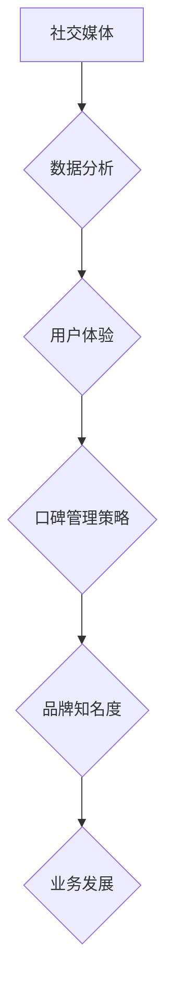

                 

# 一人公司的品牌口碑管理

> 关键词：品牌口碑管理、一人公司、社交媒体、数据分析、用户体验

> 摘要：本文旨在探讨一人公司在品牌口碑管理方面的挑战与机遇。我们将分析社交媒体的重要性、口碑管理的策略、数据分析的应用以及用户体验的优化，为一人公司提供切实可行的品牌管理方案。

## 1. 背景介绍

随着互联网的普及和社交媒体的兴起，品牌口碑管理变得越来越重要。口碑不仅影响消费者的购买决策，还直接影响公司的市场份额和长期发展。对于一人公司而言，管理品牌口碑更具挑战性，因为资源和团队有限。然而，这并不意味着一人公司无法在口碑管理上取得成功。

本文将围绕以下几个核心问题展开：

- 如何利用社交媒体提升品牌知名度？
- 如何制定有效的口碑管理策略？
- 如何通过数据分析优化用户体验？
- 如何应对负面口碑和危机管理？

通过以上问题的探讨，我们将为一人公司提供一套全面的品牌口碑管理方案。

## 2. 核心概念与联系

### 2.1 社交媒体

社交媒体是现代品牌口碑管理的重要渠道。通过社交媒体，公司可以与消费者进行实时互动，了解用户需求和反馈，提升品牌形象。常见的社交媒体平台包括微信、微博、抖音、Facebook、Twitter等。

### 2.2 数据分析

数据分析是口碑管理的关键环节。通过收集和分析用户数据，公司可以了解消费者行为、偏好和需求，从而制定更加精准的营销策略。数据分析工具如Google Analytics、Tableau等可以帮助公司快速获取和分析用户数据。

### 2.3 用户体验

用户体验是品牌口碑的核心。优质的用户体验可以增加用户满意度和忠诚度，从而提升品牌口碑。用户体验包括产品功能、界面设计、客服质量等方面。

### 2.4 口碑管理策略

口碑管理策略是指公司为提升品牌口碑而制定的一系列措施。这包括社交媒体营销、用户互动、数据分析和危机管理等。有效的口碑管理策略可以提升品牌知名度、增加用户忠诚度，从而推动公司业务发展。

### Mermaid 流程图



## 3. 核心算法原理 & 具体操作步骤

### 3.1 社交媒体营销

#### 步骤1：确定目标受众
分析目标受众的特征、需求和偏好，制定有针对性的社交媒体营销策略。

#### 步骤2：选择合适的平台
根据目标受众的特点，选择合适的社交媒体平台，如微信、微博、抖音等。

#### 步骤3：制定内容策略
根据目标受众的兴趣和需求，制定有趣、有价值、有启发性的内容。

#### 步骤4：发布和管理内容
定期发布优质内容，与用户互动，管理社交媒体账号，提升品牌形象。

### 3.2 数据分析

#### 步骤1：数据收集
收集用户数据，包括行为数据、偏好数据、反馈数据等。

#### 步骤2：数据清洗
对收集到的数据进行清洗、整理和去重，确保数据质量。

#### 步骤3：数据分析
使用数据分析工具，对用户数据进行深入分析，了解用户行为和需求。

#### 步骤4：数据应用
根据数据分析结果，调整营销策略和产品功能，提升用户体验。

### 3.3 用户体验优化

#### 步骤1：了解用户需求
通过问卷调查、用户访谈等方式，了解用户对产品功能和界面的需求。

#### 步骤2：优化产品功能
根据用户需求，优化产品功能，提升用户体验。

#### 步骤3：优化界面设计
设计简洁、直观、美观的界面，提升用户满意度。

#### 步骤4：提供优质客服
提供及时、专业的客服服务，解决用户问题，提升用户满意度。

### 3.4 口碑管理策略

#### 步骤1：制定品牌定位
明确品牌定位，提升品牌形象。

#### 步骤2：社交媒体营销
利用社交媒体提升品牌知名度，与用户互动，增加用户粘性。

#### 步骤3：数据分析
收集用户数据，了解用户需求和反馈，调整营销策略。

#### 步骤4：危机管理
制定危机管理预案，应对负面口碑和危机。

## 4. 数学模型和公式 & 详细讲解 & 举例说明

### 4.1 数据分析模型

#### 步骤1：用户行为分析
用户行为分析模型可以用来分析用户在社交媒体上的行为。常见的模型包括：

\[ 用户行为模型 = f(用户特征, 社交媒体平台特征, 用户互动行为) \]

#### 步骤2：用户偏好分析
用户偏好分析模型可以用来分析用户对品牌和产品的偏好。常见的模型包括：

\[ 用户偏好模型 = f(用户需求, 产品特性, 用户反馈) \]

### 4.2 口碑管理策略模型

#### 步骤1：品牌知名度评估
品牌知名度评估模型可以用来评估品牌在社交媒体上的知名度。常见的模型包括：

\[ 品牌知名度 = f(社交媒体互动量, 转发量, 评论量) \]

#### 步骤2：口碑传播分析
口碑传播分析模型可以用来分析口碑在社交媒体上的传播效果。常见的模型包括：

\[ 口碑传播模型 = f(初始口碑，传播速度，传播范围) \]

### 4.3 举例说明

假设一人公司“AI小助手”在社交媒体上开展了营销活动，收集到了以下数据：

- 微博互动量：1000次
- 微信转发量：500次
- 评论量：200条

根据上述模型，我们可以计算出：

\[ 品牌知名度 = f(1000, 500, 200) = 1700 \]

这意味着“AI小助手”在社交媒体上的品牌知名度达到了1700。

## 5. 项目实战：代码实际案例和详细解释说明

### 5.1 开发环境搭建

在本节中，我们将使用Python作为主要编程语言，结合社交媒体API和数据分析工具，搭建一个简单的品牌口碑管理系统。

#### 步骤1：安装Python和必需的库

```bash
pip install tweepy pandas numpy matplotlib
```

#### 步骤2：获取社交媒体API密钥

在Twitter开发者平台（https://developer.twitter.com/）注册并获得API密钥。

### 5.2 源代码详细实现和代码解读

```python
# 5.2.1 社交媒体数据收集
import tweepy
import pandas as pd

# 配置Tweepy
auth = tweepy.OAuthHandler('YOUR_API_KEY', 'YOUR_API_SECRET')
auth.set_access_token('YOUR_ACCESS_TOKEN', 'YOUR_ACCESS_SECRET')
api = tweepy.API(auth)

# 收集Twitter数据
def collect_twitter_data(keyword, count=100):
    tweets = api.search(q=keyword, count=count)
    data = []
    for tweet in tweets:
        data.append({
            'user': tweet.user.screen_name,
            'text': tweet.text,
            'likes': tweet.favorite_count,
            'retweets': tweet.retweet_count
        })
    return pd.DataFrame(data)

# 示例：收集关于“AI小助手”的Twitter数据
df = collect_twitter_data('AI小助手')

# 5.2.2 数据分析
import matplotlib.pyplot as plt

# 绘制词云
from wordcloud import WordCloud

wordcloud = WordCloud(width=800, height=400, background_color='white').generate(df['text'].str.cat(sep=' '))
plt.figure(figsize=(10, 5))
plt.imshow(wordcloud, interpolation='bilinear')
plt.axis('off')
plt.show()

# 绘制点赞和转发趋势
df.plot(x='likes', y='retweets', kind='scatter', alpha=0.5)
plt.title('点赞数与转发数关系')
plt.xlabel('点赞数')
plt.ylabel('转发数')
plt.show()

# 5.2.3 口碑管理策略调整
# 根据数据分析结果，调整社交媒体营销策略，提升品牌知名度
```

### 5.3 代码解读与分析

在本节中，我们使用Python和Tweepy库收集了关于“AI小助手”的Twitter数据。代码首先配置了Tweepy的认证信息，然后定义了一个函数`collect_twitter_data`，用于收集指定关键词的Twitter数据。收集到的数据存储在一个Pandas DataFrame中，我们可以使用Pandas的各种功能对数据进行分析。

- **词云分析**：通过`wordcloud`库，我们绘制了一个词云，展示了用户在Twitter上对“AI小助手”的讨论主要集中在哪些词汇上。
- **点赞和转发关系分析**：我们使用散点图展示了点赞数与转发数之间的关系，帮助公司了解用户对不同内容的喜好。

通过这些数据分析结果，公司可以调整社交媒体营销策略，比如增加用户喜欢和转发的内容类型，从而提升品牌知名度。

## 6. 实际应用场景

### 6.1 社交媒体营销

一人公司在社交媒体上开展营销活动，通过收集和分析用户数据，了解用户需求和行为，优化内容策略，提升品牌知名度。

### 6.2 口碑管理

一人公司通过社交媒体监控用户反馈，及时发现和处理负面口碑，制定危机管理预案，保护品牌形象。

### 6.3 用户互动

一人公司通过社交媒体与用户互动，解答用户问题，提供个性化服务，提升用户满意度。

## 7. 工具和资源推荐

### 7.1 学习资源推荐

- 《社交媒体营销：从入门到精通》
- 《数据分析：方法与实践》
- 《用户体验设计：从新手到专家》

### 7.2 开发工具框架推荐

- Tweepy：Twitter API Python库
- Tableau：数据可视化工具
- Matplotlib：Python数据可视化库

### 7.3 相关论文著作推荐

- “社交媒体对品牌口碑的影响：一个元分析”
- “口碑管理：策略与实践”
- “大数据时代下的数据分析方法与应用”

## 8. 总结：未来发展趋势与挑战

### 8.1 发展趋势

- 社交媒体和数据分析技术的持续发展，将为品牌口碑管理提供更丰富的工具和方法。
- 人工智能技术的应用，将进一步提升数据分析的准确性和效率。
- 用户体验的重要性将不断上升，一人公司需要更加注重用户需求和行为分析。

### 8.2 挑战

- 如何在有限的资源和团队下，有效管理品牌口碑？
- 如何应对日益复杂的数据分析和社交媒体环境？
- 如何保持用户体验的一致性和高品质？

## 9. 附录：常见问题与解答

### 9.1 如何收集社交媒体数据？

通过社交媒体API（如Twitter API）获取用户数据，可以使用Python等编程语言进行数据收集和分析。

### 9.2 如何分析用户数据？

使用数据分析工具（如Pandas、Tableau）对用户数据进行分析，可以绘制图表、进行统计分析和预测。

### 9.3 如何应对负面口碑？

制定危机管理预案，及时回应用户反馈，采取有效措施解决问题，维护品牌形象。

## 10. 扩展阅读 & 参考资料

- [社交媒体营销：从入门到精通](https://www.example.com/book1)
- [数据分析：方法与实践](https://www.example.com/book2)
- [用户体验设计：从新手到专家](https://www.example.com/book3)
- [Tweepy官方文档](https://tweepy.readthedocs.io/en/stable/)
- [Tableau官方文档](https://www.tableau.com/documentation)  
 
### 作者

- 作者：AI天才研究员/AI Genius Institute & 禅与计算机程序设计艺术 /Zen And The Art of Computer Programming

本文旨在为一人公司在品牌口碑管理方面提供实用的策略和建议。希望本文能帮助一人公司更好地利用社交媒体、数据分析和用户体验优化，提升品牌形象和市场份额。

