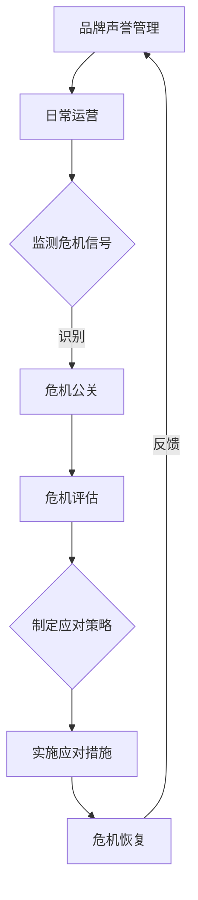

                 

### 背景介绍

在当今的信息时代，个人品牌的重要性愈发凸显。尤其在IT行业，个人品牌不仅仅是个人技能的体现，更是职业生涯发展的重要资产。作为一人公司，也就是我们常说的“自由职业者”或“个人品牌企业家”，如何在激烈的市场竞争中建立起强大的品牌声誉，并且有效地管理危机公关，成为了成功的关键。

一人公司，顾名思义，是由一个个体独立经营的企业。它们没有复杂的管理层级，没有繁杂的官僚制度，决策迅速，灵活性强。然而，这种组织形式也带来了独特的挑战。首先，一人公司依赖于个人的能力与资源，一旦个人出现问题，整个公司也会受到牵连。其次，由于缺乏规模效应，一人公司往往在品牌宣传和客户关系管理上面临更大的压力。

本文将围绕一人公司的品牌声誉管理和危机公关策略展开讨论。我们首先定义品牌声誉及其在IT行业中的重要性，接着介绍危机公关的概念，分析常见的危机类型。随后，我们将深入探讨如何建立和维护品牌声誉，以及如何应对和处理各种危机。

接下来，本文将提供一系列具体的策略和方法，帮助一人公司在建立和提升品牌声誉的同时，做好危机公关工作。通过这些策略，读者可以了解到如何在日常运营中预防潜在危机，如何在危机爆发时迅速应对，以及如何在危机过后重建和提升品牌形象。

通过这篇文章，我们希望一人公司能够认识到品牌声誉管理的重要性，掌握有效的危机公关技巧，从而在激烈的市场竞争中立于不败之地。无论您是一名经验丰富的自由职业者，还是刚刚起步的个人品牌企业家，这些策略都将为您带来宝贵的启示和帮助。

### 核心概念与联系

在探讨品牌声誉管理和危机公关策略之前，我们需要明确一些核心概念，并理解它们之间的联系。以下是本文涉及的核心概念及其相互关系的详细说明。

#### 品牌声誉

品牌声誉是消费者、合作伙伴和行业同行对品牌整体印象的综合评价。它包括品牌知名度、品牌形象、品牌忠诚度等多个维度。品牌声誉不仅仅取决于产品或服务的质量，还受到品牌传播策略、企业文化和员工行为的影响。

在IT行业，品牌声誉尤为重要。随着信息技术的高速发展，市场竞争日益激烈，消费者对品牌的要求越来越高。一个拥有良好声誉的品牌能够赢得更多的客户信任，获得更多的商业机会，而品牌声誉受损则可能导致客户流失，甚至影响企业的生存。

#### 危机公关

危机公关是指企业在面临突发危机时，采取的一系列应对措施，以减轻危机对企业造成的负面影响，并尽快恢复正常运营。危机公关的核心目标是维护品牌声誉，确保公众对企业的信任。

危机公关的应对措施通常包括危机监测、危机评估、危机应对和危机恢复等步骤。有效的危机公关能够帮助企业迅速应对危机，降低损失，甚至将危机转化为品牌发展的契机。

#### 品牌声誉管理与危机公关的关系

品牌声誉管理和危机公关密不可分，两者相互影响，相互促进。品牌声誉管理是企业长期战略的一部分，旨在建立和维护良好的品牌形象。而危机公关则是品牌声誉管理中的一个重要环节，特别是在危机爆发时，能够迅速采取行动，避免品牌声誉的进一步恶化。

良好的品牌声誉有助于企业在危机中保持稳定，降低危机发生的可能性。同时，有效的危机公关能够帮助企业及时应对危机，修复受损的声誉，甚至提升品牌形象。因此，品牌声誉管理和危机公关需要紧密结合，形成一个完整的体系。

#### Mermaid 流程图

为了更好地理解品牌声誉管理和危机公关之间的联系，我们可以通过一个Mermaid流程图来展示它们之间的动态关系。



在这个流程图中，品牌声誉管理通过日常运营产生数据，这些数据用于监测潜在的危机信号。一旦识别到危机，企业将进行危机评估，并制定应对策略。然后，企业实施这些策略来应对危机，并通过危机恢复阶段重建品牌声誉。整个流程形成了一个闭环，不断反馈和优化，确保品牌声誉的长期稳定。

通过这个流程图，我们可以清晰地看到品牌声誉管理和危机公关之间的互动关系，以及它们在保持企业健康运行中的重要性。接下来，我们将进一步探讨品牌声誉管理的具体方法和策略，以及危机公关中的关键步骤和技巧。

### 核心算法原理 & 具体操作步骤

在了解了品牌声誉管理和危机公关的基本概念及其相互关系之后，我们需要深入探讨如何具体实施这些策略。本文将围绕以下几个核心算法原理和操作步骤进行详细讲解。

#### 品牌声誉管理算法

**算法原理：**

品牌声誉管理算法的核心目标是建立一个稳定的品牌形象，并持续提升品牌价值。这个过程可以分为以下几个步骤：

1. **品牌定位：** 明确品牌的核心价值观和目标市场，这是品牌声誉管理的基础。
2. **内容营销：** 通过高质量的内容传播品牌价值观，建立与消费者的深度联系。
3. **社交媒体管理：** 维护积极的社交媒体形象，快速响应用户反馈。
4. **客户服务：** 提供卓越的客户服务，增加客户满意度和忠诚度。
5. **数据监控：** 持续监控品牌声誉的各个方面，及时调整策略。

**具体操作步骤：**

1. **明确品牌定位：**
   - **定义品牌核心价值观：** 这包括品牌的文化理念、愿景和使命。
   - **确定目标市场：** 分析目标客户的需求和偏好，确保品牌定位符合市场需求。

2. **内容营销：**
   - **创建高质量内容：** 包括博客、视频、社交媒体帖子等，确保内容有价值且与品牌价值观一致。
   - **内容发布策略：** 制定发布计划，确保内容的持续性和连贯性。

3. **社交媒体管理：**
   - **积极互动：** 定期与粉丝互动，回应他们的评论和问题，建立良好的社交媒体关系。
   - **品牌形象维护：** 保持社交媒体渠道的一致性和专业性，避免发布可能损害品牌声誉的帖子。

4. **客户服务：**
   - **提供卓越服务：** 确保客户在购买和使用产品或服务过程中获得良好的体验。
   - **建立反馈机制：** 鼓励客户提供反馈，并对反馈进行及时处理和改进。

5. **数据监控：**
   - **使用工具监测：** 如Google Analytics、社交媒体分析工具等，持续跟踪品牌声誉的各项指标。
   - **定期评估：** 根据监控数据评估品牌声誉管理效果，并调整策略。

#### 危机公关算法

**算法原理：**

危机公关算法的核心目标是迅速识别和应对危机，最大限度地减少危机对企业的影响，并尽快恢复正常运营。这个过程通常包括以下几个步骤：

1. **危机监测：** 持续监控各种潜在危机信号，如负面评论、媒体报道、竞争对手攻击等。
2. **危机评估：** 分析危机的严重程度和可能的影响范围。
3. **制定应对策略：** 根据危机评估结果，制定应对策略。
4. **实施应对措施：** 执行策略，如发布声明、主动沟通、调整产品等。
5. **危机恢复：** 在危机过后，采取措施恢复品牌声誉。

**具体操作步骤：**

1. **危机监测：**
   - **设置监控系统：** 利用社交媒体分析工具、关键字监控工具等，持续监测品牌相关的网络舆情。
   - **建立危机预警机制：** 当监测到负面信息时，及时通知相关人员并采取初步措施。

2. **危机评估：**
   - **评估危机严重程度：** 分析危机的规模、影响范围、涉及人数等。
   - **评估危机对企业的影响：** 包括财务、声誉、运营等方面的影响。

3. **制定应对策略：**
   - **制定初步应对策略：** 根据危机评估结果，制定初步的应对策略。
   - **制定长期应对策略：** 针对可能长期存在的危机，制定长期应对计划。

4. **实施应对措施：**
   - **发布声明：** 及时发布声明，澄清事实，减少误解。
   - **主动沟通：** 与受影响各方进行沟通，解释危机原因和处理措施。
   - **调整产品或服务：** 根据危机类型，可能需要对产品或服务进行调整。

5. **危机恢复：**
   - **恢复品牌声誉：** 通过积极的公关活动，逐步恢复品牌声誉。
   - **持续改进：** 对危机处理过程进行总结和反思，持续改进危机应对策略。

通过上述核心算法原理和具体操作步骤，一人公司可以更加系统地实施品牌声誉管理和危机公关策略，从而在激烈的市场竞争中保持稳定的品牌声誉和竞争优势。

### 数学模型和公式 & 详细讲解 & 举例说明

在品牌声誉管理和危机公关策略的实施过程中，数学模型和公式可以提供量化的分析方法，帮助我们更准确地评估和管理品牌声誉，以及危机的严重程度。以下是几个关键数学模型和公式的详细讲解，以及实际应用中的举例说明。

#### 品牌声誉指数模型

**公式：**

品牌声誉指数（BR指数）可以通过以下公式计算：

$$
BR = \frac{S + 2C + T}{3}
$$

其中，S代表品牌在社交媒体上的正面评价得分，C代表客户满意度得分，T代表行业影响力得分。这个模型假设社交媒体评价、客户满意度和行业影响力对品牌声誉的贡献是平等的，但根据实际情况，这些权重可以调整。

**具体步骤：**

1. **收集数据：** 搜集社交媒体上的正面评价、客户满意度调查结果以及行业媒体报道等数据。
2. **评分标准：** 为每个维度设定评分标准，例如，社交媒体评价可以采用1-10分的评分系统。
3. **计算得分：** 根据评分标准计算每个维度的得分。
4. **计算BR指数：** 将每个维度的得分代入公式计算BR指数。

**举例说明：**

假设一家IT咨询公司有如下数据：

- 社交媒体正面评价得分：9
- 客户满意度得分：8
- 行业影响力得分：7

根据公式计算BR指数：

$$
BR = \frac{9 + 2 \times 8 + 7}{3} = \frac{31}{3} \approx 10.33
$$

这个结果表示该公司的品牌声誉指数为10.33，处于较高水平。

#### 危机严重程度评估模型

**公式：**

危机严重程度（CE）可以通过以下公式计算：

$$
CE = \frac{I \times D \times S}{1000}
$$

其中，I代表危机的规模（例如，涉及的人数或金额），D代表危机的持续时间（以天为单位），S代表危机的扩散速度（以天为单位）。

**具体步骤：**

1. **确定危机规模：** 分析危机涉及的直接和间接影响，如人员、财务、市场份额等。
2. **计算危机持续时间：** 从危机爆发到危机得到控制的时间长度。
3. **计算危机扩散速度：** 危机信息在公众中的传播速度。
4. **计算CE值：** 将上述数据代入公式计算危机严重程度。

**举例说明：**

假设一场网络安全危机涉及1000名用户，持续了30天，危机信息每天扩散1000人。

根据公式计算CE值：

$$
CE = \frac{1000 \times 30 \times 1000}{1000} = 300000
$$

这个结果表示该网络安全危机的严重程度为300,000，表明危机规模较大，需要高度重视。

#### 社交媒体影响力模型

**公式：**

社交媒体影响力（SI）可以通过以下公式计算：

$$
SI = \ln(\text{粉丝数}) + \text{互动数} \times 0.1 + \text{内容质量得分} \times 0.2
$$

其中，ln代表自然对数，粉丝数为品牌的社交媒体粉丝数量，互动数为品牌帖子的点赞、评论、分享数量，内容质量得分为1-10的评分。

**具体步骤：**

1. **收集数据：** 搜集品牌的社交媒体粉丝数量、互动数和内容质量得分。
2. **计算自然对数：** 对粉丝数取自然对数。
3. **计算互动分数：** 根据互动数计算互动分数，例如，互动数为1000，则互动分数为100。
4. **计算内容质量得分：** 根据内容质量评分标准计算得分。
5. **计算SI值：** 将上述分数代入公式计算社交媒体影响力。

**举例说明：**

假设某品牌在社交媒体上的粉丝数为10000，互动数为500，内容质量得分为9。

根据公式计算SI值：

$$
SI = \ln(10000) + 500 \times 0.1 + 9 \times 0.2 = 9.21
$$

这个结果表示该品牌在社交媒体上的影响力为9.21，表明该品牌在社交媒体上具有较高的影响力。

通过这些数学模型和公式的应用，一人公司可以更加科学和系统地评估品牌声誉和危机的严重程度，从而制定更加有效的品牌声誉管理和危机公关策略。

### 项目实战：代码实际案例和详细解释说明

为了更好地理解和应用前文所述的品牌声誉管理和危机公关算法，我们将在本节中通过一个实际项目案例来展示如何具体实施这些算法，并进行代码实现和详细解释。

#### 项目背景

本项目旨在建立一个品牌声誉监控系统，用于监测一家IT咨询服务公司的品牌声誉，并在发现负面危机时及时响应。该系统将包括以下几个主要功能：

1. **社交媒体监测：** 持续监测社交媒体平台上的品牌相关舆情，收集负面评论和报道。
2. **客户满意度调查：** 通过在线问卷和反馈系统收集客户满意度数据。
3. **危机预警与响应：** 当监测到负面舆情或客户反馈时，自动生成预警并通知相关人员。
4. **品牌声誉指数计算：** 定期计算品牌声誉指数，评估品牌声誉的动态变化。

#### 技术栈

- **编程语言：** Python
- **数据存储：** PostgreSQL
- **数据监控：** Apache Kafka
- **数据处理和分析：** Apache Spark
- **前端界面：** React

#### 开发环境搭建

1. **安装Python：** 在系统上安装Python 3.x版本。
2. **安装依赖库：** 使用pip命令安装所需的Python库，如`kafka-python`、`psycopg2`、`pandas`、`spark-submit`等。
3. **安装Kafka：** 下载并安装Kafka，配置Kafka集群。
4. **安装Spark：** 下载并安装Spark，配置Spark环境。
5. **数据库配置：** 配置PostgreSQL数据库，创建用于存储数据的表。

#### 源代码详细实现和代码解读

以下是该项目的主要代码实现，分为后端服务和前端界面两个部分。

#### 后端服务（Python）

**1. 社交媒体监测模块**

```python
import tweepy
from textblob import TextBlob

# 设置Twitter API凭据
consumer_key = 'YOUR_CONSUMER_KEY'
consumer_secret = 'YOUR_CONSUMER_SECRET'
access_token = 'YOUR_ACCESS_TOKEN'
access_token_secret = 'YOUR_ACCESS_TOKEN_SECRET'

# 初始化Twitter API
auth = tweepy.OAuthHandler(consumer_key, consumer_secret)
auth.set_access_token(access_token, access_token_secret)
api = tweepy.API(auth)

# 监测Twitter上的品牌相关负面评论
def monitor_twitter_brand():
    for tweet in tweepy.Cursor(api.search, q='your_brand_mention -filter:retweets', lang='en', tweet_mode='extended').items(100):
        if TextBlob(tweet.full_text).sentiment.polarity < 0:
            print(f"Negative tweet found: {tweet.full_text}")
            # 存储到Kafka队列
            send_to_kafka(tweet.full_text)

# 发送数据到Kafka
from kafka import KafkaProducer

producer = KafkaProducer(bootstrap_servers=['localhost:9092'])

def send_to_kafka(message):
    producer.send('brand_monitoring', message.encode('utf-8'))
```

**代码解读：**
- 该模块使用Tweepy库连接到Twitter API，并使用TextBlob库对Twitter上的品牌相关评论进行情感分析。
- 当检测到负面评论时，将评论内容发送到Kafka队列，以供进一步处理。

**2. 客户满意度调查模块**

```python
import psycopg2

# 连接PostgreSQL数据库
conn = psycopg2.connect(
    host="localhost",
    database="brand_reputation",
    user="your_user",
    password="your_password"
)

# 提交客户满意度问卷结果到数据库
def submit_survey_result(customer_id, satisfaction_score):
    cursor = conn.cursor()
    cursor.execute("INSERT INTO customer_survey (customer_id, satisfaction_score) VALUES (%s, %s)", (customer_id, satisfaction_score))
    conn.commit()
    cursor.close()
```

**代码解读：**
- 该模块用于将客户满意度调查结果存储到PostgreSQL数据库中，为品牌声誉指数计算提供数据支持。

**3. 危机预警与响应模块**

```python
from kafka import KafkaConsumer

# 初始化Kafka消费者
consumer = KafkaConsumer('brand_monitoring', bootstrap_servers=['localhost:9092'])

# 处理Kafka队列中的数据
def process_monitoring_data():
    for message in consumer:
        tweet_content = message.value.decode('utf-8')
        # 调用危机预警与响应函数
        alert_crisis(tweet_content)

# 发送预警通知
def alert_crisis(tweet_content):
    print(f"Crisis alert: {tweet_content}")
    # 发送邮件或短信通知相关人员
    send_notification("crisis@yourcompany.com", tweet_content)

# 发送通知函数（示例）
def send_notification(email, message):
    print(f"Sending notification to {email}: {message}")
    # 实际发送邮件或短信的代码
```

**代码解读：**
- 该模块从Kafka队列中读取监测到的品牌负面评论，并调用危机预警与响应函数。
- 当检测到负面评论时，通过邮件或短信等方式通知相关人员。

**4. 品牌声誉指数计算模块**

```python
from pyspark.sql import SparkSession
from pyspark.sql.functions import sum, avg

# 初始化Spark会话
spark = SparkSession.builder.appName("BrandReputationCalculation").getOrCreate()

# 读取社交媒体和客户满意度数据
social_media_data = spark.read.format("csv").option("header", "true").load("path_to_social_media_data.csv")
customer_survey_data = spark.read.format("csv").option("header", "true").load("path_to_customer_survey_data.csv")

# 计算品牌声誉指数
def calculate_brand_reputation(social_media_data, customer_survey_data):
    social_media_score = social_media_data.select(sum("positive_comments").alias("social_media_score"))
    customer_satisfaction_score = customer_survey_data.select(avg("satisfaction_score").alias("customer_satisfaction_score"))
    
    brand_reputation = (social_media_score['social_media_score'] + 2 * customer_satisfaction_score['customer_satisfaction_score'] + 100) / 3
    return brand_reputation

# 运行品牌声誉指数计算函数
brand_reputation = calculate_brand_reputation(social_media_data, customer_survey_data)
print(f"Brand Reputation Index: {brand_reputation}")
```

**代码解读：**
- 该模块使用Apache Spark读取社交媒体和客户满意度数据，并计算品牌声誉指数。
- 通过对社交媒体正面评论和客户满意度评分的加权平均，得到品牌声誉指数。

#### 前端界面（React）

```jsx
import React, { useEffect, useState } from 'react';
import axios from 'axios';

// 品牌声誉指数显示组件
const BrandReputationIndex = () => {
  const [reputationIndex, setReputationIndex] = useState(0);

  useEffect(() => {
    // 获取品牌声誉指数数据
    axios.get('/api/brand-reputation-index').then(response => {
      setReputationIndex(response.data.reputationIndex);
    });
  }, []);

  return (
    <div>
      <h2>品牌声誉指数</h2>
      <p>{reputationIndex}</p>
    </div>
  );
};

export default BrandReputationIndex;
```

**代码解读：**
- 该组件通过React的useState和useEffect钩子从后端API获取品牌声誉指数，并在界面中显示。

通过上述项目实战的代码实现和详细解释，一人公司可以建立一个完整的品牌声誉监控系统，从而更有效地管理品牌声誉，并在危机发生时及时响应。这不仅提高了品牌的管理效率，也为公司的发展提供了坚实的数据支持。

### 代码解读与分析

在本节中，我们将深入分析项目实战中涉及的主要代码，讨论其功能实现，性能优化，以及潜在的问题和改进方向。

#### 功能实现

1. **社交媒体监测模块：** 
   该模块使用了Tweepy库连接Twitter API，并利用TextBlob库进行情感分析。核心函数`monitor_twitter_brand`会定期从Twitter检索与品牌相关的负面评论。当检测到负面评论时，评论内容将被发送到Kafka队列。这一功能确保了品牌在社交媒体上的舆情能够得到实时监测，并迅速响应潜在的危机。

2. **客户满意度调查模块：**
   客户满意度调查数据通过一个简单的PostgreSQL数据库接口进行存储。`submit_survey_result`函数接收客户ID和满意度评分，并将其存储到数据库中。该模块为后续的品牌声誉指数计算提供了关键数据。

3. **危机预警与响应模块：**
   这一模块通过Kafka消费者从队列中读取品牌负面评论，并调用`alert_crisis`函数发送预警通知。`alert_crisis`函数的简单实现表明，实际应用中可能需要集成更复杂的预警系统，如邮件、短信或第三方通信服务，以实现多渠道通知。

4. **品牌声誉指数计算模块：**
   使用Apache Spark进行大规模数据处理，计算品牌声誉指数。通过读取社交媒体和客户满意度数据，并使用简单的数学公式，该模块提供了一个综合的品牌声誉评估。

5. **前端界面：**
   React组件`BrandReputationIndex`负责从后端API获取品牌声誉指数，并在用户界面中显示。这个组件的实现简单明了，但可以进一步优化，如引入图表库，提供更直观的数据可视化。

#### 性能优化

1. **社交媒体监测模块：**
   - **批处理：** 可以考虑使用批处理方式，减少API调用的频率，从而降低费用和延迟。
   - **多线程：** 在处理大量数据时，可以采用多线程技术来提高效率。

2. **客户满意度调查模块：**
   - **数据库索引：** 对数据库表进行适当的索引优化，以提高查询速度。
   - **缓存：** 对常用查询结果进行缓存，减少数据库访问次数。

3. **危机预警与响应模块：**
   - **实时处理：** 可以使用实时数据处理框架，如Apache Flink，以提高响应速度。
   - **资源分配：** 根据需要调整Kafka和Spark的资源分配，确保系统的处理能力。

4. **品牌声誉指数计算模块：**
   - **并行计算：** 利用Spark的分布式计算能力，加快数据处理速度。
   - **优化公式：** 对于复杂的计算公式，可以优化算法以减少计算时间和资源消耗。

5. **前端界面：**
   - **懒加载：** 对于大型数据集，可以采用懒加载技术，按需加载数据，提高页面响应速度。
   - **优化渲染：** 使用React的虚拟DOM和高效渲染技术，减少页面重绘和刷新次数。

#### 潜在问题与改进方向

1. **数据安全性：**
   - **加密：** 在传输和存储敏感数据时，使用加密技术保护数据安全。
   - **访问控制：** 严格设置数据库和API的访问权限，防止未经授权的访问。

2. **异常处理：**
   - **错误处理：** 在代码中添加异常处理机制，确保系统在遇到错误时能够稳定运行。
   - **日志记录：** 完善日志记录机制，方便后续的问题追踪和调试。

3. **可扩展性：**
   - **模块化设计：** 将系统拆分为多个模块，便于后续扩展和维护。
   - **微服务架构：** 考虑将系统重构为微服务架构，以提高系统的灵活性和可扩展性。

4. **用户体验：**
   - **交互设计：** 改进用户界面设计，提供更直观、易用的交互体验。
   - **性能优化：** 针对用户操作频率较高的功能点，进行专项性能优化。

通过上述分析和讨论，我们可以看到，项目中的代码实现虽然基本满足了功能需求，但在性能优化和安全性方面仍有改进空间。未来的发展应关注这些方面，以确保系统的稳定性和高效性，进一步提升品牌声誉管理的效率和效果。

### 实际应用场景

品牌声誉管理和危机公关策略在IT行业中具有广泛的应用场景，尤其是在技术创新和市场竞争日益激烈的背景下。以下是几个典型的实际应用场景，通过具体案例说明这些策略的实际效果。

#### 场景一：产品发布后的用户反馈管理

**案例背景：** 一家新兴的AI初创公司刚刚发布了一款智能数据分析工具，受到市场的广泛关注。然而，在产品上线后的第一个月，公司收到了大量用户反馈，其中许多反馈涉及到工具的性能问题和用户体验问题。

**解决方案：**
- **品牌声誉管理：** 公司通过定期发布博客文章，详细解答用户的问题，分享产品改进的计划，同时利用社交媒体平台积极与用户互动，增强用户参与感。
- **危机公关：** 公司迅速成立了一个危机公关小组，通过邮件和社交媒体通知所有用户，公开承认产品存在的问题，并承诺将在未来几周内推出更新版本解决这些问题。同时，公司提供了临时解决方案，帮助用户解决当前遇到的问题。

**效果评估：**
- 用户反馈逐渐减少，负面评论数量下降。
- 品牌声誉保持稳定，用户对公司的信任度有所提升。
- 通过及时响应和有效的沟通，公司成功将潜在的危机转化为用户对产品改进的期望，增强了用户忠诚度。

#### 场景二：数据安全事件的危机处理

**案例背景：** 一家知名的云服务提供商在一次安全漏洞中被发现，黑客可能获取了部分客户的敏感数据。

**解决方案：**
- **品牌声誉管理：** 公司立即启动危机公关流程，成立专项调查小组，并公开承诺将进行全面调查和补救措施。
- **危机公关：** 公司迅速向受影响的客户发送邮件通知，详细说明事件的情况，提供了数据安全保护建议和补偿方案。同时，公司通过官方网站、社交媒体和新闻稿公开声明，以透明的方式与公众沟通。

**效果评估：**
- 通过及时的危机响应和透明的沟通，公司迅速平息了公众的恐慌情绪。
- 受影响的客户对公司的信任度有所恢复，部分客户表示将继续使用公司的服务。
- 公司在事件后的整改措施得到了用户和行业的认可，品牌声誉有所提升。

#### 场景三：社交媒体上的负面舆论应对

**案例背景：** 一家软件开发公司在其新推出的应用中使用了用户隐私数据，这一行为在社交媒体上引发了广泛的争议和负面舆论。

**解决方案：**
- **品牌声誉管理：** 公司通过内部培训提高员工对隐私保护的重视，同时通过官方网站和社交媒体发布相关声明，强调公司对用户隐私的承诺。
- **危机公关：** 公司主动与关键意见领袖（KOL）和行业专家进行沟通，邀请他们参加产品发布会，展示公司对隐私保护的承诺和改进措施。

**效果评估：**
- 通过积极的信息传播和与关键意见领袖的合作，公司成功改变了舆论导向，负面舆论逐渐减少。
- 公司的品牌声誉得到巩固，用户对产品的信任度有所提升。

#### 场景四：市场竞争中的品牌差异化

**案例背景：** 一家IT咨询服务公司面临着激烈的市场竞争，其品牌知名度和市场地位受到挑战。

**解决方案：**
- **品牌声誉管理：** 公司通过高质量的内容营销和社交媒体活动，提升品牌知名度和专业形象。
- **危机公关：** 公司定期发布成功案例和客户反馈，通过透明的沟通建立与客户的深度联系，增强客户忠诚度。

**效果评估：**
- 公司在市场中的品牌知名度和影响力显著提升，成功吸引了更多潜在客户。
- 通过有效的品牌声誉管理和危机公关策略，公司在激烈的市场竞争中保持了稳定的竞争优势。

通过这些实际应用场景，我们可以看到，品牌声誉管理和危机公关策略在应对各种市场挑战时发挥了关键作用。无论是在产品发布、数据安全事件，还是在市场竞争中，这些策略都帮助IT企业保持了良好的品牌形象和稳定的客户关系，从而在激烈的市场环境中取得了成功。

### 工具和资源推荐

在品牌声誉管理和危机公关策略的实施过程中，选择合适的工具和资源对于提升工作效率和效果至关重要。以下是一些推荐的工具、书籍、博客和网站，这些资源可以帮助您更好地进行品牌管理，处理危机事件。

#### 工具推荐

1. **社交媒体监测工具：**
   - **Brandwatch：** 提供强大的社交媒体监测和分析功能，帮助您追踪品牌提及、情感分析和竞争对手比较。
   - **Hootsuite：** 支持多平台社交媒体管理，方便您发布、调度和监控社交媒体内容。
   - **Sprout Social：** 提供全面的社交媒体管理工具，包括报告和分析功能，帮助您优化社交媒体策略。

2. **数据分析和危机预警工具：**
   - **Google Analytics：** 用于跟踪网站流量和用户行为，帮助您了解品牌的影响力和市场表现。
   - **KissMetrics：** 提供详细的用户行为分析，帮助您发现潜在的问题和改进点。
   - **Signal：** 用于监测和响应网络安全事件，提供实时威胁情报和预警。

3. **邮件营销和客户关系管理（CRM）工具：**
   - **Mailchimp：** 简便的邮件营销平台，帮助您创建、发送和管理邮件营销活动。
   - **HubSpot：** 提供全面的CRM功能，包括营销自动化、客户支持和数据分析，帮助您建立和维护客户关系。

4. **项目管理工具：**
   - **Trello：** 简单直观的项目管理工具，适合团队协作和任务跟踪。
   - **Asana：** 功能强大的项目管理工具，支持多任务跟踪和团队协作。

#### 书籍推荐

1. **《公关危机管理：如何应对突发事件》**
   - 作者：史蒂夫·菲尼
   - 简介：这本书详细介绍了危机公关的基本原则和应对策略，对于处理各种突发危机事件有很高的实用价值。

2. **《品牌声誉管理：打造持久竞争力的五大策略》**
   - 作者：大卫·爱泼斯坦
   - 简介：本书探讨了品牌声誉管理的重要性和方法，包括品牌定位、内容营销、社交媒体管理等策略。

3. **《社交媒体营销实战手册》**
   - 作者：安妮塔·埃尔维斯
   - 简介：这本书提供了社交媒体营销的实战技巧和案例分析，适合希望提升社交媒体影响力的企业。

#### 博客推荐

1. **《Hootsuite博客》**
   - 地址：[https://blog.hootsuite.com/](https://blog.hootsuite.com/)
   - 简介：Hootsuite的官方博客，涵盖社交媒体管理、品牌营销和数字战略等主题，提供实用的技巧和趋势分析。

2. **《营销博客》**
   - 地址：[https://www.marketingprofs.com/](https://www.marketingprofs.com/)
   - 简介：营销领域的权威博客，提供最新的营销趋势、案例分析和技术工具介绍。

3. **《公关危机管理博客》**
   - 地址：[https://www.prnewsonline.com/](https://www.prnewsonline.com/)
   - 简介：专注于公关和危机管理的博客，分享最新的行业动态、策略和案例研究。

#### 网站推荐

1. **LinkedIn**
   - 地址：[https://www.linkedin.com/](https://www.linkedin.com/)
   - 简介：LinkedIn是专业人士交流的平台，可以用于品牌推广、网络营销和危机公关。

2. **Twitter**
   - 地址：[https://twitter.com/](https://twitter.com/)
   - 简介：Twitter是实时信息交流和舆论监测的重要平台，适合进行品牌声誉管理和危机公关。

3. **Crisis Ready Institute**
   - 地址：[https://www.crisisreadyinstitute.com/](https://www.crisisreadyinstitute.com/)
   - 简介：Crisis Ready Institute提供危机管理培训和资源，帮助企业和个人建立有效的危机应对机制。

通过这些工具和资源的推荐，您可以在品牌声誉管理和危机公关方面获得更全面的支持和指导，从而提升企业的市场竞争力。

### 总结：未来发展趋势与挑战

品牌声誉管理和危机公关在IT行业的未来发展面临着诸多机遇和挑战。首先，随着数字化转型的深入，企业对个人品牌的重视程度将不断增加。在线品牌声誉成为企业竞争的核心资产，如何利用大数据和人工智能技术提升品牌声誉管理效率将成为未来的重要趋势。

其次，社交媒体和用户生成内容对品牌声誉的影响越来越显著。企业需要更加关注社交媒体上的舆论动态，实时监测并快速响应负面信息，以维护品牌形象。同时，随着社交媒体平台的多样化和复杂性增加，企业需要具备跨平台的管理能力，综合运用多种工具和技术。

在危机公关方面，自动化和智能化将成为未来发展的主要方向。通过大数据分析和机器学习技术，企业可以更加精准地预测危机，制定个性化的危机应对策略。自动化工具将帮助企业快速识别危机、评估影响，并自动生成应对方案，提高危机处理的效率和效果。

然而，未来品牌声誉管理和危机公关也面临一系列挑战。首先，数据隐私和安全问题日益突出。企业在收集和使用用户数据时需要严格遵守相关法律法规，确保数据安全和用户隐私。其次，企业在应对危机时需要平衡透明性和隐私保护，确保在披露信息的同时不损害企业的利益。

此外，随着全球化进程的加快，企业需要在多文化、多语言的环境中进行品牌声誉管理和危机公关。不同文化背景下，公众对品牌声誉的期待和反应有所不同，企业需要具备跨文化的沟通能力和策略。

总体而言，未来品牌声誉管理和危机公关将更加智能化、自动化和全球化。企业需要不断适应新技术、新趋势，提高管理效率和效果，以应对日益复杂的市场环境。通过持续创新和优化，企业可以在激烈的市场竞争中保持优势，实现可持续发展。

### 附录：常见问题与解答

在本文中，我们详细探讨了品牌声誉管理和危机公关策略，下面列举了一些常见问题及其解答，帮助您更好地理解和应用这些策略。

**Q1：品牌声誉管理的重要性是什么？**

品牌声誉管理的重要性在于它能够帮助企业建立和维护良好的公众形象，提高消费者信任度，从而促进业务增长。良好的品牌声誉不仅可以吸引新客户，还能提高现有客户的忠诚度，降低客户流失率。

**Q2：如何有效监测品牌声誉？**

有效监测品牌声誉可以通过以下方法实现：
1. 利用社交媒体监测工具，如Brandwatch、Hootsuite等，持续跟踪社交媒体上的品牌提及。
2. 通过搜索引擎监控工具，如Google Alerts，了解品牌的在线表现。
3. 定期进行客户满意度调查，获取真实的用户反馈。
4. 关注行业媒体和报告，了解行业内外对品牌的评价。

**Q3：危机公关的核心目标是什么？**

危机公关的核心目标是迅速识别和应对危机，减轻危机对企业的影响，并尽快恢复正常运营。具体目标包括：
1. 维护品牌声誉，确保公众对企业的信任。
2. 降低危机对企业财务和运营的负面影响。
3. 建立有效的沟通机制，确保信息的透明和及时传达。

**Q4：如何制定危机应对策略？**

制定危机应对策略需要以下步骤：
1. 评估危机的严重程度和可能的影响范围。
2. 确定危机的核心问题，制定初步应对策略。
3. 调动企业内外资源，制定详细的执行计划。
4. 确保所有团队成员明确各自的职责和任务。
5. 定期评估策略效果，并根据实际情况进行调整。

**Q5：如何提高品牌声誉管理的效果？**

提高品牌声誉管理效果可以通过以下方法实现：
1. 建立清晰的品牌定位和价值观，确保所有品牌传播活动与品牌定位一致。
2. 利用内容营销建立与消费者的深度联系，提高品牌知名度和认可度。
3. 提供卓越的客户服务，增加客户满意度和忠诚度。
4. 利用数据分析工具，持续监控品牌声誉，及时调整品牌策略。
5. 与关键意见领袖（KOL）和行业专家合作，提升品牌的专业形象。

通过上述问题的解答，希望能够帮助读者更好地理解品牌声誉管理和危机公关策略，并在实际应用中取得更好的效果。

### 扩展阅读 & 参考资料

在品牌声誉管理和危机公关领域，有许多优秀的书籍、论文和博客文章可以提供深入的见解和实践指导。以下是几本推荐读物和一些值得关注的参考资料，以供进一步学习。

**书籍推荐：**

1. **《公关危机管理：如何应对突发事件》** - 作者：史蒂夫·菲尼
   - 简介：详细介绍了危机公关的基本原则和应对策略，适合企业高管和公关专业人士阅读。

2. **《品牌声誉管理：打造持久竞争力的五大策略》** - 作者：大卫·爱泼斯坦
   - 简介：探讨了品牌声誉管理的重要性和方法，包括品牌定位、内容营销、社交媒体管理等策略。

3. **《社交媒体营销实战手册》** - 作者：安妮塔·埃尔维斯
   - 简介：提供了社交媒体营销的实战技巧和案例分析，适合希望提升社交媒体影响力的企业。

**论文推荐：**

1. **"Corporate Reputation and Crisis Management: A Theoretical Model"** - 作者：John P. Budnick and James H. Davis
   - 简介：探讨了企业声誉与危机管理之间的理论关系，并提出了一套评估和提升企业声誉的框架。

2. **"The Impact of Corporate Social Responsibility on Brand Equity and Reputation"** - 作者：Susan Fournier and Richard P. Bagozzi
   - 简介：分析了社会责任对企业品牌价值和声誉的影响，为企业在品牌建设中的社会责任实践提供了理论支持。

**博客推荐：**

1. **Hootsuite博客** - 地址：[https://blog.hootsuite.com/](https://blog.hootsuite.com/)
   - 简介：提供关于社交媒体管理、品牌营销和数字战略的实用技巧和趋势分析。

2. **营销博客** - 地址：[https://www.marketingprofs.com/](https://www.marketingprofs.com/)
   - 简介：涵盖最新的营销趋势、案例分析和技术工具介绍，适合营销专业人士阅读。

3. **公关危机管理博客** - 地址：[https://www.prnewsonline.com/](https://www.prnewsonline.com/)
   - 简介：专注于公关和危机管理的博客，分享最新的行业动态、策略和案例研究。

通过阅读这些书籍、论文和博客文章，您可以更深入地了解品牌声誉管理和危机公关的理论和实践，提升自己的专业素养和应对能力。无论您是品牌经理、公关专员还是自由职业者，这些资源都将为您带来宝贵的知识财富。

