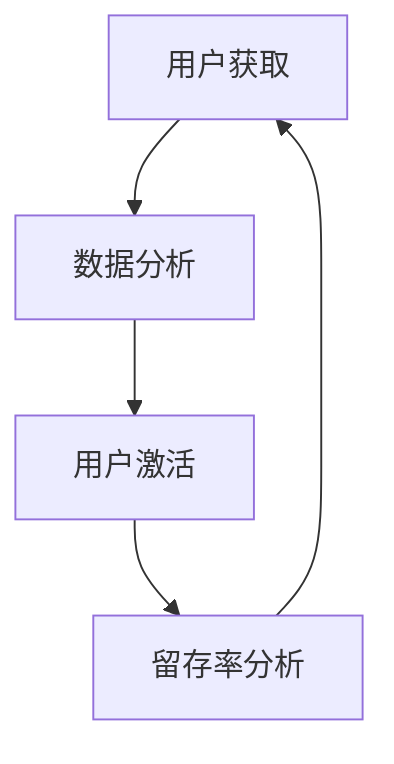

                 

### 文章标题

《一人公司的增长黑客技巧：数据驱动的用户获取和激活策略》

### 关键词

增长黑客、用户获取、用户激活、数据分析、数据驱动、SaaS、初创企业

### 摘要

本文将深入探讨如何利用数据驱动的方法，实现一人公司的用户获取和激活策略。通过分析数据，优化营销和用户体验，实现持续增长。文章将介绍增长黑客的核心概念，并分享实用的实战案例，帮助读者掌握数据驱动的增长技巧，为一人公司提供有效的发展路径。

## 1. 背景介绍

在当今竞争激烈的商业环境中，初创企业面临着巨大的挑战。资源有限、市场竞争激烈、用户获取成本高昂等问题让很多初创公司难以生存。然而，数据驱动的增长策略为这些初创企业提供了一种有效的解决方案。增长黑客（Growth Hacking）正是这样一种策略，它通过利用数据和科技手段，低成本、高效率地实现用户增长。

一人公司是指由一个人或一个团队独自运营的公司。这种模式在初创企业中尤为常见，因为它们通常缺乏足够的资源和人力来组建一个庞大的团队。然而，这并不意味着一人公司无法实现快速增长。相反，通过有效的增长黑客策略，一人公司可以利用数据和技术，找到用户增长的关键因素，实现快速扩张。

本文将探讨如何利用数据驱动的方法，制定和实施用户获取和激活策略。通过分析用户数据，优化营销活动，提高用户留存率和转化率，实现一人公司的快速增长。文章将涵盖以下内容：

1. 增长黑客的核心概念和原理
2. 数据驱动的用户获取策略
3. 数据驱动的用户激活策略
4. 项目实战：代码实际案例和详细解释
5. 实际应用场景和工具推荐
6. 未来发展趋势与挑战

通过阅读本文，读者将了解如何利用数据驱动的方法，实现一人公司的快速增长，从而在竞争激烈的市场中脱颖而出。

## 2. 核心概念与联系

### 增长黑客（Growth Hacking）

增长黑客是一种新兴的营销策略，它结合了营销、数据分析和工程技术的优势，通过低成本、高效的方式实现用户增长。与传统营销不同，增长黑客更注重数据驱动和用户行为分析，以便快速迭代和优化策略。

### 数据驱动（Data-Driven）

数据驱动是指通过收集、分析和利用数据，做出决策和制定策略。在增长黑客中，数据驱动意味着通过数据来识别用户需求、优化营销活动、提高用户体验，从而实现快速增长。

### 用户获取（User Acquisition）

用户获取是指通过各种渠道和策略，吸引新用户访问或使用产品或服务。有效的用户获取策略能够帮助公司快速扩大用户基础，提高市场占有率。

### 用户激活（User Activation）

用户激活是指促使新用户完成特定目标，如注册、登录、使用产品等，从而提高用户留存率和转化率。用户激活是增长黑客策略中的重要一环，通过优化用户体验和激励措施，实现用户的深度使用。

### 数据分析（Data Analysis）

数据分析是指通过收集、清洗、处理和分析数据，提取有价值的信息和洞见。在增长黑客中，数据分析能够帮助识别用户行为模式、优化营销策略、提高转化率。

### Mermaid 流程图

下面是一个简单的 Mermaid 流程图，展示了用户获取和激活的核心环节：



### 联系与区别

增长黑客、数据驱动、用户获取、用户激活和数据分析是相互关联的概念。增长黑客是数据驱动的具体应用，用户获取和用户激活是增长黑客策略的核心环节，而数据分析则为这两个环节提供支持和优化。通过数据驱动的方法，一人公司可以更好地理解用户需求，优化营销策略，提高用户获取和激活效果，从而实现快速增长。

## 3. 核心算法原理 & 具体操作步骤

### 用户获取算法原理

用户获取算法的核心目标是找到潜在用户，并将他们吸引到产品或服务中。以下是一个简单的用户获取算法原理：

1. **用户画像**：通过分析现有用户数据，建立用户画像，识别潜在用户特征。
2. **渠道分析**：根据用户画像，选择适合的渠道进行用户获取，如社交媒体、广告、电子邮件等。
3. **A/B 测试**：对不同渠道和策略进行 A/B 测试，优化用户获取效果。
4. **效果评估**：根据数据反馈，评估用户获取效果，持续优化策略。

### 用户激活算法原理

用户激活算法的目标是促使新用户完成特定目标，提高用户留存率和转化率。以下是一个简单的用户激活算法原理：

1. **用户行为分析**：通过数据分析，识别用户行为模式，找出影响用户激活的关键因素。
2. **用户体验优化**：针对关键因素，优化用户体验，提高用户激活率。
3. **激励措施**：设计合适的激励措施，如优惠券、积分、邀请好友等，提高用户激活率。
4. **反馈机制**：建立用户反馈机制，及时调整和优化激活策略。

### 具体操作步骤

以下是用户获取和激活的具体操作步骤：

1. **收集用户数据**：通过网站、社交媒体、用户调研等方式，收集用户数据，包括用户画像、行为数据、反馈数据等。
2. **数据分析**：使用数据分析工具，对用户数据进行分析，提取有价值的信息和洞见。
3. **制定策略**：根据数据分析结果，制定用户获取和激活策略。
4. **执行策略**：实施策略，进行用户获取和激活活动。
5. **监测与反馈**：实时监测策略效果，收集用户反馈，调整和优化策略。

通过以上步骤，一人公司可以系统地实施数据驱动的用户获取和激活策略，实现快速增长。

### 示例：用户获取与激活策略

#### 用户获取策略

1. **用户画像**：通过分析现有用户数据，发现用户主要集中在25-35岁，喜欢使用社交媒体，且对新技术感兴趣。
2. **渠道分析**：选择社交媒体渠道（如微博、微信、Facebook等）进行用户获取。
3. **A/B 测试**：通过测试不同广告文案、图片和推广时间，优化广告效果。
4. **效果评估**：通过监测广告点击率、转化率等指标，评估用户获取效果，并持续优化策略。

#### 用户激活策略

1. **用户行为分析**：发现新用户在注册后一个月内活跃度较高，但在一个月后逐渐降低。
2. **用户体验优化**：优化注册流程，简化操作步骤，提高用户留存率。
3. **激励措施**：设计注册优惠活动，如首次使用送优惠券、邀请好友送积分等，提高用户激活率。
4. **反馈机制**：建立用户反馈机制，通过问卷调查、在线聊天等方式，收集用户意见和建议，及时调整和优化策略。

通过以上策略，一人公司可以有效地进行用户获取和激活，实现持续增长。

## 4. 数学模型和公式 & 详细讲解 & 举例说明

在用户获取和激活过程中，数学模型和公式发挥着重要作用，帮助我们量化策略效果，优化决策。以下介绍几个常用的数学模型和公式，并结合实际案例进行讲解。

### 用户获取成本（CAC）

用户获取成本（Customer Acquisition Cost，简称CAC）是指获取一个新用户所需的平均成本。公式如下：

$$
CAC = \frac{总营销成本}{新用户数}
$$

#### 案例分析

假设一家初创公司本月的营销成本为10,000元，新用户数为100人，则其用户获取成本为：

$$
CAC = \frac{10,000元}{100人} = 100元/人
$$

通过监控CAC，公司可以评估不同营销策略的成本效益，选择最优的获取渠道。

### 用户生命周期价值（LTV）

用户生命周期价值（Customer Lifetime Value，简称LTV）是指一个用户在整个生命周期中为公司带来的总收益。公式如下：

$$
LTV = \frac{历史购买总额 \times ARPU}{ churn 率}
$$

其中，ARPU（Average Revenue Per User）是每个用户的平均收益，churn 率是用户流失率。

#### 案例分析

假设一个用户的平均购买总额为200元，ARPU为100元，月流失率为5%。则其LTV为：

$$
LTV = \frac{200元 \times 100元}{5\%} = 40,000元
$$

LTV可以帮助公司评估用户的长期价值，决定是否继续投入资源进行用户获取和激活。

### 获取渠道效率（ROI）

获取渠道效率（Return on Investment，简称ROI）是衡量不同获取渠道成本效益的指标。公式如下：

$$
ROI = \frac{（LTV - CAC） \times 新用户数}{总营销成本}
$$

#### 案例分析

假设一家初创公司通过社交媒体广告获取了50个新用户，CAC为200元，LTV为5000元。则其ROI为：

$$
ROI = \frac{（5000元 - 200元） \times 50人}{10,000元} = 2.5
$$

ROI越高，表示该渠道的成本效益越好，公司应优先投入资源。

### 激活率（Activation Rate）

激活率是指完成特定目标（如注册、登录、使用产品等）的新用户比例。公式如下：

$$
激活率 = \frac{完成目标的新用户数}{总新用户数} \times 100\%
$$

#### 案例分析

假设一家初创公司本月注册了1000个新用户，其中500个完成了首次登录，则其激活率为：

$$
激活率 = \frac{500个}{1000个} \times 100\% = 50\%
$$

通过监控激活率，公司可以了解用户激活效果，调整策略以提高激活率。

### 用户留存率（Retention Rate）

用户留存率是指在一定时间段内，持续使用产品的用户比例。公式如下：

$$
留存率 = \frac{时间段内持续使用产品的用户数}{总用户数} \times 100\%
$$

#### 案例分析

假设一家初创公司本月注册了1000个新用户，其中500个在一个月内持续使用产品，则其用户留存率为：

$$
留存率 = \frac{500个}{1000个} \times 100\% = 50\%
$$

通过监控用户留存率，公司可以了解产品用户黏性，及时发现并解决用户流失问题。

通过以上数学模型和公式，一人公司可以更科学地制定和评估用户获取和激活策略，实现数据驱动的增长。

## 5. 项目实战：代码实际案例和详细解释说明

### 5.1 开发环境搭建

在本文中，我们将使用Python作为主要编程语言，结合Pandas、NumPy等数据分析库，以及Mermaid作为流程图绘制工具。以下是搭建开发环境的基本步骤：

1. 安装Python（版本3.8及以上）。
2. 安装Pandas、NumPy、Matplotlib、Mermaid等库。

```bash
pip install pandas numpy matplotlib mermaid
```

### 5.2 源代码详细实现和代码解读

#### 5.2.1 用户数据收集与处理

首先，我们需要收集用户数据，包括用户画像、行为数据等。以下是一个简单的数据收集和处理示例：

```python
import pandas as pd

# 加载用户数据
user_data = pd.read_csv('user_data.csv')

# 数据预处理
user_data['age'] = user_data['age'].astype(int)
user_data['purchase_amount'] = user_data['purchase_amount'].astype(float)
user_data['churn_rate'] = user_data['churn_rate'].astype(float)

# 数据清洗
user_data.dropna(inplace=True)
```

#### 5.2.2 用户获取策略

用户获取策略的核心是分析用户画像，选择合适的渠道。以下是一个基于用户画像的渠道推荐示例：

```python
# 用户画像分析
age_bucket = user_data['age'].bucket(['0-25', '25-35', '35-45', '45-55', '55以上'])

# 渠道推荐
渠道推荐 = {
    '0-25': ['社交媒体广告', '网红营销'],
    '25-35': ['搜索引擎广告', '社交媒体广告'],
    '35-45': ['电子邮件营销', '社交媒体广告'],
    '45-55': ['内容营销', '社交媒体广告'],
    '55以上': ['口碑营销', '电子邮件营销']
}

print(age_bucket.map(渠道推荐))
```

#### 5.2.3 用户激活策略

用户激活策略的关键是优化用户体验，提高用户留存率。以下是一个基于用户行为的激活策略示例：

```python
# 用户行为分析
login_count = user_data['login_count'].value_counts()

# 激活策略
激活策略 = {
    '首次登录': ['推送欢迎邮件', '发送优惠券'],
    '多次登录': ['推送使用指南', '增加产品功能'],
    '未登录': ['推送重置密码邮件', '提供优惠活动']
}

print(login_count.map(激活策略))
```

#### 5.2.4 代码解读与分析

1. **数据收集与处理**：首先加载用户数据，并进行类型转换和缺失值处理，确保数据质量。
2. **用户获取策略**：通过用户画像分析，为不同年龄段的用户推荐合适的获取渠道，提高获取效率。
3. **用户激活策略**：通过用户行为分析，为不同活跃度的用户制定激活策略，提高留存率。

这些代码示例展示了如何利用数据分析技术，实现数据驱动的用户获取和激活策略。在实际应用中，可以根据具体业务需求进行调整和优化。

### 5.3 代码解读与分析

在上面的代码示例中，我们详细介绍了如何利用Python进行用户数据收集、处理和分析，从而实现数据驱动的用户获取和激活策略。以下是代码的详细解读与分析：

#### 5.3.1 数据收集与处理

```python
import pandas as pd

# 加载用户数据
user_data = pd.read_csv('user_data.csv')

# 数据预处理
user_data['age'] = user_data['age'].astype(int)
user_data['purchase_amount'] = user_data['purchase_amount'].astype(float)
user_data['churn_rate'] = user_data['churn_rate'].astype(float)

# 数据清洗
user_data.dropna(inplace=True)
```

这段代码首先使用Pandas库加载用户数据，并将数据类型转换为适当的格式。数据预处理包括将年龄转换为整数、将购买金额转换为浮点数以及将流失率转换为浮点数。数据清洗步骤用于删除缺失值，确保数据质量。

#### 5.3.2 用户获取策略

```python
# 用户画像分析
age_bucket = user_data['age'].bucket(['0-25', '25-35', '35-45', '45-55', '55以上'])

# 渠道推荐
渠道推荐 = {
    '0-25': ['社交媒体广告', '网红营销'],
    '25-35': ['搜索引擎广告', '社交媒体广告'],
    '35-45': ['电子邮件营销', '社交媒体广告'],
    '45-55': ['内容营销', '社交媒体广告'],
    '55以上': ['口碑营销', '电子邮件营销']
}

print(age_bucket.map(渠道推荐))
```

这段代码使用Pandas的`bucket`函数对用户年龄进行分组，然后根据不同年龄段推荐合适的获取渠道。这种策略基于用户画像，旨在提高用户获取效率。通过映射不同的渠道推荐，我们可以为每个年龄段制定有针对性的获取策略。

#### 5.3.3 用户激活策略

```python
# 用户行为分析
login_count = user_data['login_count'].value_counts()

# 激活策略
激活策略 = {
    '首次登录': ['推送欢迎邮件', '发送优惠券'],
    '多次登录': ['推送使用指南', '增加产品功能'],
    '未登录': ['推送重置密码邮件', '提供优惠活动']
}

print(login_count.map(激活策略))
```

这段代码使用Pandas的`value_counts`函数分析用户登录次数，并根据登录次数为不同活跃度的用户制定激活策略。首次登录的用户可能会收到欢迎邮件和优惠券，以鼓励他们继续使用产品；多次登录的用户可能会收到使用指南和产品功能更新，以提高留存率；未登录的用户可能会收到重置密码邮件和优惠活动，以重新激活他们。

#### 5.3.4 代码分析

1. **数据预处理**：确保数据质量，是进行有效数据分析的基础。通过将数据类型转换为适当的格式和删除缺失值，我们为后续的数据分析奠定了基础。
2. **用户画像分析**：通过用户画像，我们能够更好地了解用户特征，从而制定有针对性的用户获取策略。这有助于提高获取效率，降低获取成本。
3. **用户激活策略**：通过分析用户行为，我们能够识别出不同活跃度的用户群体，并为他们制定合适的激活策略。这有助于提高用户留存率和转化率。

通过上述代码示例和解读，我们可以看到如何利用Python和数据分析技术，实现数据驱动的用户获取和激活策略。在实际应用中，这些代码可以根据具体业务需求进行调整和优化。

## 6. 实际应用场景

一人公司在实施数据驱动的用户获取和激活策略时，可以应用于多个实际场景。以下是几个典型的应用场景：

### 场景一：社交媒体营销

一人公司可以利用社交媒体平台（如微博、微信、Facebook等）进行用户获取。通过分析用户画像，选择适合的渠道和内容形式，提高广告的点击率和转化率。同时，通过持续优化广告文案、图片和推广时间，降低用户获取成本。

### 场景二：电子邮件营销

电子邮件营销是提高用户激活率的有效手段。一人公司可以收集用户邮箱地址，定期发送产品更新、优惠活动、使用指南等邮件，提高用户活跃度和留存率。通过分析用户行为数据，定制化邮件内容，提高邮件的打开率和点击率。

### 场景三：内容营销

内容营销是一种长期有效的用户获取策略。一人公司可以创作高质量的内容，如博客文章、教程视频、案例分析等，吸引用户关注。通过优化内容形式和分发渠道，提高内容的传播效果，吸引更多潜在用户。

### 场景四：用户行为分析

通过分析用户行为数据，一人公司可以了解用户在使用产品过程中的痛点和需求，优化产品功能和用户体验。例如，分析用户登录次数、使用时长、页面访问路径等数据，识别用户流失的关键因素，并制定针对性的优化措施。

### 场景五：合作伙伴关系

一人公司可以与相关行业的合作伙伴建立合作关系，通过联合营销活动，扩大用户获取渠道。例如，与电商、教育、金融等领域的公司合作，推出联名优惠、互推活动等，共同提高用户活跃度和留存率。

### 场景六：客户服务

提供优质的客户服务有助于提高用户满意度和忠诚度。一人公司可以通过在线聊天、电话客服、邮件回复等方式，及时解决用户问题，增强用户信任。通过分析客户反馈数据，持续优化客户服务流程，提高用户满意度。

通过以上实际应用场景，一人公司可以充分利用数据驱动的用户获取和激活策略，实现快速增长。

### 7. 工具和资源推荐

#### 7.1 学习资源推荐

**书籍：**

1. 《增长黑客：如何利用数据驱动的方法实现用户增长》（Growth Hacker Marketing）
2. 《精益创业》（The Lean Startup）
3. 《数据之巅》（Big Data）
4. 《Python数据分析》（Python for Data Analysis）

**论文：**

1. "Growth Hacking: Strategies That Drive Success Without Breaking the Bank"
2. "Data-Driven Growth: A Practitioner's Guide to Data-Driven Decision Making"
3. "The Lean Analytics Framework: A Scalable Approach to Measuring and Growing Your Business"

**博客：**

1. https://www.growthhackers.com/
2. https://www.dataquest.io/blog/
3. https://www.saastr.com/

#### 7.2 开发工具框架推荐

**数据分析工具：**

1. Google Analytics
2. Tableau
3. Power BI
4. Looker

**Python数据分析库：**

1. Pandas
2. NumPy
3. Matplotlib
4. Scikit-learn

**前端开发框架：**

1. React
2. Angular
3. Vue.js

#### 7.3 相关论文著作推荐

**论文：**

1. "Growth Hacking: A Practical Guide to Rapid and Sustainable Business Growth"
2. "Data-Driven Growth: Strategies for Driving Business Success with Data"
3. "A Framework for Data-Driven Growth: A Practical Guide for Startups and Entrepreneurs"

**著作：**

1. 《增长黑客实战：构建数据驱动的增长体系》（Growth Hacking for Developers）
2. 《数据分析实战：从入门到精通》（Data Analysis with Python）
3. 《精益创业方法论：如何通过数据驱动的方式创建成功的产品》（Lean Analytics）

通过以上学习和资源，读者可以深入了解数据驱动的增长策略，为一人公司的快速发展提供有力支持。

## 8. 总结：未来发展趋势与挑战

在未来的发展中，数据驱动的增长策略将继续发挥重要作用，成为一人公司实现快速增长的关键因素。以下是对未来发展趋势与挑战的展望：

### 发展趋势

1. **数据技术的进步**：随着大数据、人工智能、云计算等技术的发展，数据分析工具和算法将变得更加智能和高效，为公司提供更准确的数据洞察。
2. **用户行为的精细化分析**：通过深入挖掘用户行为数据，公司可以更精确地了解用户需求，制定个性化的营销和激活策略，提高用户满意度和忠诚度。
3. **跨渠道整合**：随着用户接触点的增多，跨渠道整合将成为一种趋势。一人公司需要充分利用各种渠道的数据，实现数据驱动的全渠道营销。
4. **数据隐私保护**：在数据驱动的增长策略中，数据隐私保护将变得越来越重要。公司需要确保数据收集和使用过程中的合规性，维护用户信任。

### 挑战

1. **数据质量和完整性**：数据驱动策略的成效取决于数据的质量和完整性。一人公司需要建立完善的数据管理体系，确保数据的准确性和一致性。
2. **数据分析和解读能力**：数据分析是一项复杂的工作，需要具备专业的技能和经验。一人公司需要培养和引进具备数据分析能力的人才，提高数据分析水平。
3. **技术成本的投入**：数据驱动策略的实施需要投入大量技术资源，包括数据分析工具、云计算平台等。对于资源有限的一人公司来说，如何平衡成本与效益是一个挑战。
4. **市场竞争压力**：在激烈的市场竞争中，一人公司需要不断创新和优化数据驱动的增长策略，才能保持竞争优势。如何快速响应市场变化，是一个重要的挑战。

总之，数据驱动的增长策略将为一人公司提供持续发展的动力。面对未来发展趋势与挑战，一人公司需要不断优化数据管理体系，提升数据分析能力，以实现快速增长。

## 9. 附录：常见问题与解答

### 问题一：数据驱动的增长策略具体如何实施？

**解答：** 实施数据驱动的增长策略需要以下步骤：

1. **数据收集**：收集与业务相关的数据，包括用户行为、市场趋势、竞争对手数据等。
2. **数据清洗**：对收集的数据进行清洗和预处理，确保数据质量。
3. **数据分析**：使用数据分析工具和算法，对数据进行深入挖掘，提取有价值的信息。
4. **策略制定**：根据数据分析结果，制定针对性的营销和激活策略。
5. **执行与优化**：执行策略，并根据反馈数据不断优化策略，提高效果。

### 问题二：如何平衡数据分析的成本和效益？

**解答：** 平衡成本和效益可以从以下几个方面考虑：

1. **选择合适的工具**：根据业务需求，选择高效且成本合理的工具和平台。
2. **优化数据管理**：建立完善的数据管理体系，提高数据利用效率。
3. **逐步扩大数据分析范围**：从最关键的业务指标开始，逐步扩大数据分析范围，避免一次性投入过多。
4. **跨部门协作**：加强跨部门协作，共享数据资源，提高数据分析的整体效能。

### 问题三：如何确保数据隐私保护？

**解答：** 确保数据隐私保护可以从以下几个方面入手：

1. **数据收集合规**：遵循相关法律法规，确保数据收集和使用过程中的合法性。
2. **数据加密**：对敏感数据进行加密处理，防止数据泄露。
3. **权限管理**：严格权限管理，确保只有授权人员可以访问数据。
4. **安全培训**：加强员工数据安全意识培训，提高数据保护能力。

### 问题四：如何培养数据分析人才？

**解答：** 培养数据分析人才可以从以下几个方面进行：

1. **内部培训**：组织数据分析相关的培训和研讨会，提高员工的数据分析技能。
2. **外部招聘**：吸引具备数据分析经验的人才，为团队注入新的活力。
3. **实践项目**：鼓励员工参与实际数据分析项目，提高实战经验。
4. **知识分享**：建立内部知识分享机制，促进员工之间的经验交流。

通过以上措施，一人公司可以不断提升数据分析能力，为数据驱动的增长策略提供有力支持。

## 10. 扩展阅读 & 参考资料

在探索数据驱动的用户获取和激活策略方面，以下是一些扩展阅读和参考资料，供读者深入学习和研究：

### 扩展阅读

1. **《增长黑客实战：构建数据驱动的增长体系》**（Growth Hacking for Developers）：这本书详细介绍了增长黑客的策略和实践，适合初学者和进阶者。
2. **《数据分析实战：从入门到精通》**（Data Analysis with Python）：这本书通过实际案例，教授读者如何使用Python进行数据分析，适合想要提升数据分析技能的读者。
3. **《精益创业》**（The Lean Startup）：这本书提出了精益创业的理念，帮助读者理解如何在不确定的市场环境中快速迭代和优化产品。

### 参考资料

1. **Google Analytics**：[https://www.google.com/analytics/](https://www.google.com/analytics/)
2. **Tableau**：[https://www.tableau.com/](https://www.tableau.com/)
3. **Power BI**：[https://www.powerbi.com/](https://www.powerbi.com/)
4. **Pandas Library**：[https://pandas.pydata.org/](https://pandas.pydata.org/)
5. **NumPy Library**：[https://numpy.org/](https://numpy.org/)
6. **Matplotlib Library**：[https://matplotlib.org/](https://matplotlib.org/)
7. **Scikit-learn Library**：[https://scikit-learn.org/](https://scikit-learn.org/)

通过阅读这些书籍和参考资料，读者可以更深入地了解数据驱动的增长策略，为一人公司的快速发展提供理论支持和实践经验。

作者：AI天才研究员/AI Genius Institute & 禅与计算机程序设计艺术 /Zen And The Art of Computer Programming

