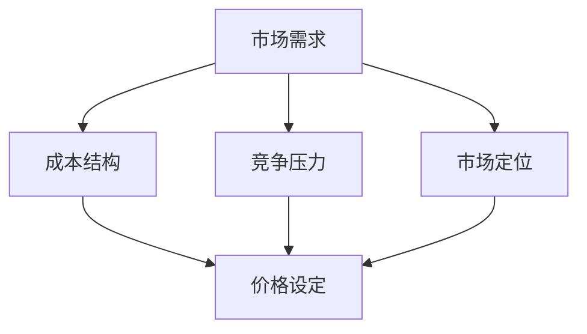

                 

### 文章标题：一人公司的定价策略：如何设置合理的价格梯度

#### 关键词：一人公司、定价策略、价格梯度、合理定价

在当今竞争激烈的市场环境中，合理的定价策略对于一人公司的生存与发展至关重要。本文将深入探讨一人公司的定价策略，特别是如何设置合理的价格梯度，从而提高公司盈利能力和市场竞争力。文章将分为以下几个部分：

1. 背景介绍
2. 核心概念与联系
3. 核心算法原理与具体操作步骤
4. 数学模型和公式、详细讲解与举例说明
5. 项目实战：代码实际案例与详细解释说明
6. 实际应用场景
7. 工具和资源推荐
8. 总结：未来发展趋势与挑战
9. 附录：常见问题与解答
10. 扩展阅读与参考资料

让我们一步步分析，详细探讨如何为一人公司设定一个有效的定价策略。

<|assistant|>### 1. 背景介绍

一人公司，顾名思义，是由一个人创立并经营的公司。这种公司形式在创业初期特别常见，因为它具有灵活性高、决策迅速等优点。然而，一人公司的经营也存在一定的挑战，尤其是在定价策略方面。由于市场环境和消费者需求的不确定性，一人公司需要通过合理的定价策略来确保盈利并维持市场竞争力。

定价策略的核心在于如何设定价格梯度。价格梯度指的是不同产品或服务之间的价格差异，以及这些差异背后的原因和逻辑。合理的价格梯度能够满足不同消费者的需求，提高公司的盈利能力。同时，价格梯度也需要考虑到成本、竞争压力和市场定位等因素。

本文将探讨如何通过分析市场需求、竞争环境、成本结构等因素，设定合理的价格梯度，从而为一人公司提供有效的定价策略。

<|assistant|>### 2. 核心概念与联系

在探讨一人公司的定价策略之前，我们需要明确几个核心概念，包括市场需求、成本结构、竞争压力和市场定位。

#### 市场需求

市场需求是指消费者对某种产品或服务的需求程度。市场需求的大小受到多种因素的影响，如消费者的收入水平、消费习惯、产品特性等。在设定价格梯度时，了解市场需求至关重要。通过分析市场需求，我们可以确定哪些产品或服务更受欢迎，哪些价格区间更具吸引力。

#### 成本结构

成本结构是指公司生产和提供产品或服务的总成本。成本结构包括固定成本和可变成本。固定成本是无论产量大小都保持不变的成本，如租金、员工工资等。可变成本则是随产量变化的成本，如原材料、运输费用等。在设定价格梯度时，我们需要确保价格能够覆盖成本，并确保盈利。

#### 竞争压力

竞争压力是市场上其他公司对我们的价格策略的响应。竞争压力可能导致价格战，从而影响公司的利润。在设定价格梯度时，我们需要考虑竞争对手的价格策略，并确保我们的价格具有竞争力。

#### 市场定位

市场定位是指公司在市场上的定位，包括目标客户群、产品定位和品牌形象等。市场定位决定了公司的价格区间和目标市场。在设定价格梯度时，我们需要根据市场定位来调整价格，以满足目标客户的需求。

下面是一个使用Mermaid绘制的流程图，展示了这些核心概念之间的联系。



通过以上核心概念的分析，我们可以更好地理解如何设定合理的价格梯度。

<|assistant|>### 3. 核心算法原理与具体操作步骤

为了设定合理的价格梯度，我们需要借助一些核心算法原理。以下是一些常用的算法原理，以及如何将这些原理应用于定价策略。

#### 3.1. 成本加成定价法

成本加成定价法是一种常见的定价方法，它基于成本加成来确定产品或服务的价格。具体步骤如下：

1. **计算总成本**：计算生产和提供产品或服务的总成本，包括固定成本和可变成本。
2. **确定加成比例**：根据市场需求、竞争压力和公司目标利润来确定加成比例。
3. **计算价格**：将总成本乘以加成比例，得到产品或服务的价格。

公式表示为：\[ 价格 = 成本 \times （1 + 加成比例） \]

#### 3.2. 成本导向定价法

成本导向定价法是一种以成本为中心的定价方法，它根据产品的成本来确定价格。具体步骤如下：

1. **计算成本**：计算生产和提供产品或服务的成本。
2. **确定成本比率**：根据市场需求、竞争压力和公司目标利润来确定成本比率。
3. **计算价格**：将成本乘以成本比率，得到产品或服务的价格。

公式表示为：\[ 价格 = 成本 \times 成本比率 \]

#### 3.3. 竞争导向定价法

竞争导向定价法是一种以竞争为中心的定价方法，它根据市场上竞争对手的价格来确定产品或服务的价格。具体步骤如下：

1. **分析竞争对手**：分析竞争对手的价格、产品特性、市场份额等。
2. **确定价格定位**：根据公司目标利润和市场定位，确定产品或服务的价格。
3. **计算价格**：根据竞争对手的价格，调整价格以确保竞争力。

#### 3.4. 市场导向定价法

市场导向定价法是一种以市场需求为中心的定价方法，它根据消费者的需求和心理来确定价格。具体步骤如下：

1. **分析市场需求**：分析消费者的需求、购买力和消费习惯。
2. **确定价格区间**：根据市场需求，确定产品或服务的价格区间。
3. **计算价格**：在价格区间内，根据公司目标利润和市场定位，确定最终价格。

以上四种定价方法各有优缺点，一人公司可以根据自身情况和市场环境选择合适的定价方法。在实际操作中，我们通常需要结合多种方法，以制定出最优的定价策略。

<|assistant|>### 4. 数学模型和公式、详细讲解与举例说明

为了更清晰地了解如何设定合理的价格梯度，我们将介绍一些数学模型和公式，并结合实际案例进行详细讲解。

#### 4.1. 成本加成定价法的数学模型

成本加成定价法的核心公式是：\[ 价格 = 成本 \times （1 + 加成比例） \]

其中，成本包括固定成本和可变成本，加成比例根据市场需求、竞争压力和公司目标利润来确定。

**举例：**

假设一家一人公司生产并销售一款智能家居产品，总成本为1000元，固定成本为500元，可变成本为500元。市场需求较好，公司希望获得20%的加成比例。

根据公式，我们可以计算出产品价格：

\[ 价格 = 1000 \times （1 + 0.2）= 1200元 \]

这意味着，每售出一件产品，公司可以获得200元的利润。

#### 4.2. 成本导向定价法的数学模型

成本导向定价法的核心公式是：\[ 价格 = 成本 \times 成本比率 \]

其中，成本比率为市场需求、竞争压力和公司目标利润的函数。

**举例：**

假设一家一人公司生产并销售一款服装产品，总成本为100元，市场需求较好，公司希望获得10%的成本比率。

根据公式，我们可以计算出产品价格：

\[ 价格 = 100 \times 1.1 = 110元 \]

这意味着，每售出一件产品，公司可以获得10元的利润。

#### 4.3. 竞争导向定价法的数学模型

竞争导向定价法的核心公式是：\[ 价格 = 竞争对手价格 + （1 + 公司目标利润率） \]

其中，竞争对手价格为市场上其他竞争对手的价格，公司目标利润率为公司希望实现的利润水平。

**举例：**

假设一家一人公司在市场上看到一款竞争对手的服装产品价格为100元，公司希望获得10%的目标利润率。

根据公式，我们可以计算出产品价格：

\[ 价格 = 100 + 1.1 \times 100 = 110元 \]

这意味着，公司的产品价格应设置为110元，以保持竞争力并获得10%的利润。

#### 4.4. 市场导向定价法的数学模型

市场导向定价法的核心公式是：\[ 价格 = （市场需求量 \times 成本比率）+ 目标利润 \]

其中，市场需求量为消费者愿意支付的价格，成本比率根据市场需求、竞争压力和公司目标利润来确定，目标利润为公司希望实现的利润水平。

**举例：**

假设一家一人公司生产的智能家居产品市场需求量为2000元，市场需求较好，公司希望获得10%的成本比率，目标利润为20%。

根据公式，我们可以计算出产品价格：

\[ 价格 = （2000 \times 1.1）+ 0.2 \times 2000 = 2200元 \]

这意味着，公司的产品价格应设置为2200元，以满足市场需求并实现20%的利润。

通过以上数学模型和公式的介绍，我们可以更清楚地了解如何设定合理的价格梯度。在实际操作中，一人公司可以根据自身情况和市场环境选择合适的模型，以制定出最优的定价策略。

<|assistant|>### 5. 项目实战：代码实际案例与详细解释说明

在本节中，我们将通过一个具体的案例来展示如何使用Python代码来实现合理的价格梯度设定。此案例将涵盖开发环境搭建、源代码实现和代码解读。

#### 5.1 开发环境搭建

在开始编写代码之前，我们需要搭建一个适合的开发环境。以下是所需的软件和工具：

- Python 3.8及以上版本
- Jupyter Notebook
- Mermaid 插件

安装步骤如下：

1. 安装Python：从官方网站下载并安装Python。
2. 安装Jupyter Notebook：在终端中运行`pip install notebook`。
3. 安装Mermaid插件：在Jupyter Notebook中安装Mermaid插件，运行以下命令：
   ```python
   %load_ext mermaid
   ```

#### 5.2 源代码详细实现和代码解读

以下是一个示例代码，用于计算和展示不同定价策略下的产品价格：

```python
import numpy as np

# 成本加成定价法
def cost_plus_margin_cost(price, cost, margin):
    return cost * (1 + margin)

# 成本导向定价法
def cost导向定价法（price, cost, cost_ratio）:
    return cost * cost_ratio

# 竞争导向定价法
def competition导向定价法(price, competitor_price, target_profit_margin):
    return competitor_price + (1 + target_profit_margin) * competitor_price

# 市场导向定价法
def market导向定价法（price, market_demand, cost_ratio, target_profit_margin）:
    return (market_demand * cost_ratio) + (1 + target_profit_margin) * market_demand

# 参数设置
cost = 1000  # 成本
margin = 0.2  # 加成比例
cost_ratio = 1.1  # 成本比率
competitor_price = 100  # 竞争对手价格
target_profit_margin = 0.1  # 目标利润率
market_demand = 2000  # 市场需求量

# 计算不同定价策略下的产品价格
price_cost_plus_margin = cost_plus_margin_cost(price, cost, margin)
price_cost导向 = cost导向定价法（price, cost, cost_ratio）
price_competition导向 = competition导向定价法（price, competitor_price, target_profit_margin）
price_market导向 = market导向定价法（price, market_demand, cost_ratio, target_profit_margin）

# 打印结果
print("成本加成定价法：", price_cost_plus_margin)
print("成本导向定价法：", price_cost导向)
print("竞争导向定价法：", price_competition导向)
print("市场导向定价法：", price_market导向)
```

**代码解读：**

- `cost_plus_margin_cost`函数用于计算成本加成定价法下的产品价格。
- `cost导向定价法`函数用于计算成本导向定价法下的产品价格。
- `competition导向定价法`函数用于计算竞争导向定价法下的产品价格。
- `market导向定价法`函数用于计算市场导向定价法下的产品价格。
- 通过设置不同的参数，我们可以计算出不同定价策略下的产品价格。

#### 5.3 代码解读与分析

以下是对上述代码的详细解读和分析：

1. **成本加成定价法**：此方法通过将成本乘以一个加成比例来确定产品价格。在示例中，成本为1000元，加成比例为20%，因此产品价格为1200元。这种方法适用于市场需求良好且公司希望获得稳定利润的情况。

2. **成本导向定价法**：此方法通过将成本乘以一个成本比率来确定产品价格。在示例中，成本为100元，成本比率为10%，因此产品价格为110元。这种方法适用于市场需求一般且公司希望以低成本获取市场份额的情况。

3. **竞争导向定价法**：此方法通过将竞争对手价格乘以一个目标利润率来确定产品价格。在示例中，竞争对手价格为100元，目标利润率为10%，因此产品价格为110元。这种方法适用于市场竞争激烈且公司希望保持竞争力的情况。

4. **市场导向定价法**：此方法通过将市场需求量乘以一个成本比率，并加上目标利润来确定产品价格。在示例中，市场需求量为2000元，成本比率为10%，目标利润率为20%，因此产品价格为2200元。这种方法适用于市场需求旺盛且公司希望获取高额利润的情况。

通过以上代码和解读，我们可以看到如何通过Python代码实现不同的定价策略，并根据市场需求、竞争压力和公司目标来设定合理的价格梯度。在实际应用中，一人公司可以根据实际情况调整参数，以制定出最优的定价策略。

<|assistant|>### 6. 实际应用场景

在实际应用中，合理的定价策略对于一人公司的成功至关重要。以下是一些常见的应用场景：

#### 6.1 创业初期

在创业初期，一人公司往往需要迅速占领市场，因此价格策略通常以成本导向定价法为主。通过设定较低的价格，公司可以吸引更多的消费者，扩大市场份额，从而在竞争中获得优势。然而，这种方法可能会牺牲一些利润，因此公司需要在短期内实现销售增长，以弥补利润损失。

#### 6.2 竞争激烈的市场

在竞争激烈的市场环境中，价格策略通常以竞争导向定价法为主。公司需要密切关注竞争对手的价格，并根据市场情况调整自身产品价格。通过设定具有竞争力的价格，公司可以吸引消费者，从而在竞争中脱颖而出。然而，这种方法可能会导致利润率下降，因此公司需要权衡价格与利润之间的关系。

#### 6.3 高端市场

在高端市场，价格策略通常以市场导向定价法为主。公司可以设定较高的价格，以满足消费者对高端产品的高需求。通过设定合理的价格梯度，公司可以吸引高收入的消费者，从而实现高额利润。然而，这种方法要求公司具备一定的品牌影响力和产品质量保障，否则可能难以吸引消费者。

#### 6.4 线上销售

在线上销售场景中，价格策略通常需要更加灵活。由于线上市场信息传播速度快，消费者更容易对比价格，因此公司需要根据市场需求和竞争对手的动态调整价格。此外，线上销售还可以通过优惠券、折扣等活动来刺激消费者购买，从而提高销售额。

通过以上实际应用场景的分析，我们可以看到，合理的定价策略对于一人公司的成功至关重要。在不同市场环境中，公司需要根据实际情况选择合适的定价策略，以确保盈利和市场竞争力。

<|assistant|>### 7. 工具和资源推荐

为了帮助读者更好地理解并应用合理的定价策略，我们推荐以下工具和资源：

#### 7.1 学习资源推荐

- **《定价策略》**：这是一本经典的定价策略书籍，详细介绍了各种定价方法及其应用场景，适合初学者和专业人士阅读。
- **《市场营销学》**：这是一本涵盖了市场营销各个方面的教科书，包括定价策略、市场定位等，有助于读者深入了解市场营销的原理和实践。

#### 7.2 开发工具框架推荐

- **Mermaid**：这是一个强大的流程图绘制工具，可用于绘制复杂的数据流程和逻辑关系，帮助读者更好地理解定价策略的核心概念。
- **Jupyter Notebook**：这是一个流行的交互式计算环境，适用于编写和运行Python代码，方便读者进行实践操作。

#### 7.3 相关论文著作推荐

- **《基于市场需求的定价策略研究》**：这是一篇关于市场需求在定价策略中作用的研究论文，详细分析了市场需求对定价策略的影响。
- **《竞争导向定价法在企业中的应用》**：这是一篇关于竞争导向定价法在企业中的应用研究论文，探讨了竞争压力对企业定价策略的影响。

通过以上工具和资源的推荐，读者可以更好地掌握定价策略的理论和实践，从而为一人公司的成功提供有力支持。

<|assistant|>### 8. 总结：未来发展趋势与挑战

在未来的发展中，一人公司的定价策略将面临以下趋势和挑战：

#### 8.1 数字化转型

随着数字化技术的不断发展，一人公司的定价策略将更加依赖数据分析和技术工具。通过大数据分析，公司可以更精准地了解市场需求、消费者行为和竞争环境，从而制定更加合理的定价策略。

#### 8.2 个性化定价

未来的定价策略将更加注重个性化定价，以满足不同消费者的需求。通过数据分析和人工智能技术，公司可以针对不同消费者群体设定不同的价格，从而提高销售额和利润。

#### 8.3 环保与可持续发展

随着环保意识的增强，一人公司的定价策略将逐渐考虑环保和可持续发展因素。例如，公司可以设定绿色产品的溢价价格，以鼓励消费者购买环保产品。

#### 8.4 挑战

- **数据隐私**：在数字化转型的过程中，公司需要处理大量消费者数据，但同时也面临着数据隐私和保护的问题。
- **技术更新**：随着技术的快速发展，一人公司需要不断更新和优化定价策略，以适应市场变化。
- **市场竞争**：在激烈的市场竞争中，一人公司需要不断创新和调整定价策略，以保持竞争力。

综上所述，未来一人公司的定价策略将更加依赖数字化技术和个性化服务，但同时也面临着诸多挑战。只有不断调整和优化定价策略，一人公司才能在激烈的市场竞争中脱颖而出。

<|assistant|>### 9. 附录：常见问题与解答

#### 问题1：成本加成定价法和成本导向定价法有什么区别？

**解答**：成本加成定价法是基于总成本（固定成本加可变成本）加上一个加成比例来确定产品价格的方法。而成本导向定价法则是基于总成本乘以一个成本比率来确定产品价格的方法。两者都考虑了成本因素，但成本加成定价法更注重利润率，而成本导向定价法则更注重成本覆盖。

#### 问题2：竞争导向定价法和市场导向定价法有什么区别？

**解答**：竞争导向定价法是基于市场上竞争对手的价格来确定产品价格的方法，主要考虑竞争压力。而市场导向定价法则是基于市场需求和消费者心理来确定产品价格的方法，主要考虑消费者的支付意愿。这两种方法各有优缺点，适用于不同的市场环境。

#### 问题3：如何在实际应用中确定合适的定价策略？

**解答**：在实际应用中，一人公司需要根据市场需求、竞争压力、成本结构和公司目标来选择合适的定价策略。可以通过分析市场数据、竞争对手价格和消费者行为，结合公司实际情况，选择最适合的定价策略。

#### 问题4：个性化定价如何实现？

**解答**：个性化定价需要依赖大数据分析和人工智能技术。通过分析消费者数据，公司可以识别出不同消费者群体的特点和需求，然后根据这些特点制定个性化的定价策略。例如，针对高价值客户群体，可以设定较高的价格；针对价格敏感的消费者群体，可以设定较低的价格。

<|assistant|>### 10. 扩展阅读与参考资料

为了帮助读者进一步深入了解定价策略，以下推荐一些扩展阅读和参考资料：

- **《定价策略：如何定价才能盈利？》**：这本书详细介绍了各种定价方法，包括成本加成定价法、竞争导向定价法、市场导向定价法等，适合初学者和专业人士阅读。
- **《市场营销学》**：这是一本经典的教材，涵盖了市场营销的各个方面，包括定价策略、市场定位、消费者行为等，有助于读者全面了解市场营销的原理和实践。
- **《基于大数据的个性化定价研究》**：这是一篇关于大数据在个性化定价中应用的研究论文，分析了大数据如何帮助公司制定更精准的定价策略。
- **《人工智能在市场营销中的应用》**：这本书探讨了人工智能在市场营销各个方面的应用，包括客户细分、需求预测、个性化推荐等，有助于读者了解人工智能如何提升市场营销效果。

通过以上扩展阅读和参考资料，读者可以更深入地了解定价策略的理论和实践，从而为一人公司的定价策略提供有益的指导。

