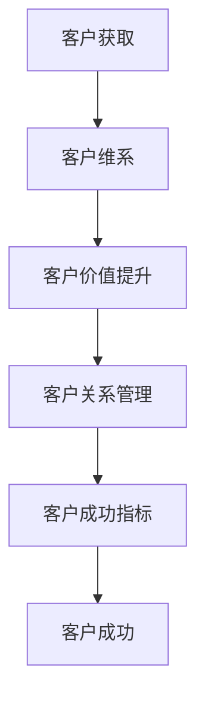

                 

# 一人公司的客户成功策略与实施方案

> **关键词**：客户成功、一人公司、策略、实施方案、客户关系管理

> **摘要**：本文将深入探讨一人公司在客户成功管理中的策略与实施方案。通过分析客户成功的核心概念、策略制定和执行，并结合实际案例，提供一套完整的客户成功策略，以帮助一人公司提升客户满意度和忠诚度。

## 1. 背景介绍

在当今竞争激烈的市场环境中，客户成功已成为企业成功的关键因素。客户成功不仅仅是一种服务理念，更是一种战略思维。对于一人公司而言，由于其规模和资源的局限性，客户成功管理显得尤为重要。本文将探讨一人公司如何通过有效的客户成功策略，实现客户满意度和忠诚度的提升。

### 什么是客户成功？

客户成功是指企业通过提供卓越的产品和服务，帮助客户实现其业务目标，从而建立长期稳定的合作关系。客户成功的核心目标是确保客户在使用企业的产品或服务时，能够获得成功体验。

### 一人公司的挑战

一人公司在资源、人才和市场等方面存在一定的局限性。因此，一人公司需要通过精细化的客户成功管理，确保资源的最大化利用，以实现客户满意度和忠诚度的提升。

## 2. 核心概念与联系

为了更好地理解客户成功的核心概念，我们需要从以下几个方面进行分析：

### 2.1 客户生命周期管理

客户生命周期管理是指企业对客户从获取、维系到流失的全过程进行管理。客户生命周期的不同阶段，需要采取不同的策略。

### 2.2 客户价值

客户价值是指客户在使用企业产品或服务过程中所获得的收益。企业需要通过提升客户价值，增强客户满意度和忠诚度。

### 2.3 客户关系管理

客户关系管理是指企业通过有效的沟通和互动，建立和维护与客户的长期稳定关系。良好的客户关系有助于提升客户满意度和忠诚度。

### 2.4 客户成功指标

客户成功指标是指用于衡量客户成功程度的一系列指标，如客户满意度、客户留存率、客户推荐率等。

### Mermaid 流程图

下面是一个简化的客户成功管理流程图，以帮助读者更好地理解各概念之间的联系。



## 3. 核心算法原理 & 具体操作步骤

### 3.1 客户成功策略制定

客户成功策略制定是客户成功管理的关键环节。具体步骤如下：

#### 3.1.1 分析市场与竞争环境

了解目标市场特点和竞争对手情况，为企业提供客户成功策略制定的依据。

#### 3.1.2 确定客户成功目标

根据市场分析和企业战略，明确客户成功的目标，如提升客户满意度、降低客户流失率等。

#### 3.1.3 制定客户成功计划

根据客户成功目标和资源情况，制定具体的客户成功计划，包括客户获取、维系、价值提升等方面的策略。

### 3.2 客户成功策略执行

客户成功策略的执行是确保策略目标实现的重要环节。具体步骤如下：

#### 3.2.1 制定实施计划

将客户成功策略分解为具体的实施计划，明确责任人和实施时间。

#### 3.2.2 激励与培训

通过激励和培训，确保团队成员充分理解和掌握客户成功策略，提高执行力。

#### 3.2.3 监控与评估

建立监控和评估机制，对客户成功策略的执行情况进行跟踪和分析，及时调整和优化。

## 4. 数学模型和公式 & 详细讲解 & 举例说明

### 4.1 客户满意度模型

客户满意度是衡量客户成功程度的重要指标。下面是一个简单的客户满意度模型：

$$
\text{客户满意度} = \frac{\text{实际收益}}{\text{期望收益}} \times 100\%
$$

其中，实际收益和期望收益可以通过调查和数据分析得到。

### 4.2 客户留存率模型

客户留存率是衡量客户忠诚度的重要指标。下面是一个简单的客户留存率模型：

$$
\text{客户留存率} = \frac{\text{留存客户数}}{\text{总客户数}} \times 100\%
$$

其中，留存客户数和总客户数可以通过企业客户管理系统进行统计。

### 4.3 客户推荐率模型

客户推荐率是衡量客户口碑的重要指标。下面是一个简单的客户推荐率模型：

$$
\text{客户推荐率} = \frac{\text{推荐客户数}}{\text{总客户数}} \times 100\%
$$

其中，推荐客户数和总客户数可以通过调查和数据分析得到。

### 4.4 案例分析

以一家在线教育公司为例，说明如何使用客户成功策略提升客户满意度、留存率和推荐率。

#### 4.4.1 客户满意度提升

通过优化课程内容、提高教学质量、提供个性化服务等方式，提升客户的实际收益，从而提高客户满意度。

#### 4.4.2 客户留存率提升

通过提供优惠券、课程推荐、学习社群等方式，增强客户的粘性，降低客户流失率。

#### 4.4.3 客户推荐率提升

通过邀请好友返现、口碑传播等方式，激发客户的推荐意愿，提高客户推荐率。

## 5. 项目实战：代码实际案例和详细解释说明

### 5.1 开发环境搭建

在本案例中，我们将使用Python语言进行客户成功策略的实现。首先，我们需要搭建Python开发环境。

1. 安装Python 3.8及以上版本。
2. 安装必要的Python库，如Pandas、NumPy、Matplotlib等。

### 5.2 源代码详细实现和代码解读

下面是客户成功策略的Python实现代码。

```python
import pandas as pd
import numpy as np
import matplotlib.pyplot as plt

# 5.2.1 数据处理

# 假设我们有一份客户数据，包括客户ID、满意度评分、留存率、推荐率
data = {
    '客户ID': [1, 2, 3, 4, 5],
    '满意度评分': [80, 90, 70, 85, 95],
    '留存率': [0.8, 0.9, 0.7, 0.8, 0.9],
    '推荐率': [0.3, 0.4, 0.2, 0.3, 0.4]
}

df = pd.DataFrame(data)

# 5.2.2 客户满意度分析

# 计算平均满意度评分
average_satisfaction = df['满意度评分'].mean()

# 计算满意度评分分布
satisfaction_distribution = df['满意度评分'].value_counts()

# 绘制满意度评分分布图
satisfaction_distribution.plot(kind='bar')
plt.title('满意度评分分布')
plt.xlabel('满意度评分')
plt.ylabel('客户数')
plt.show()

# 5.2.3 客户留存率分析

# 计算平均留存率
average_retention_rate = df['留存率'].mean()

# 计算留存率分布
retention_rate_distribution = df['留存率'].value_counts()

# 绘制留存率分布图
retention_rate_distribution.plot(kind='bar')
plt.title('留存率分布')
plt.xlabel('留存率')
plt.ylabel('客户数')
plt.show()

# 5.2.4 客户推荐率分析

# 计算平均推荐率
average_recommendation_rate = df['推荐率'].mean()

# 计算推荐率分布
recommendation_rate_distribution = df['推荐率'].value_counts()

# 绘制推荐率分布图
recommendation_rate_distribution.plot(kind='bar')
plt.title('推荐率分布')
plt.xlabel('推荐率')
plt.ylabel('客户数')
plt.show()

# 5.2.5 客户成功策略实施

# 根据分析结果，制定针对性的客户成功策略，如提高课程质量、提供个性化服务、增强社群互动等。

# 5.2.6 监控与评估

# 定期收集客户数据，分析客户满意度、留存率和推荐率的变化，评估客户成功策略的执行效果。

```

### 5.3 代码解读与分析

1. **数据处理**：使用Pandas库读取和处理客户数据。
2. **客户满意度分析**：计算平均满意度评分，绘制满意度评分分布图。
3. **客户留存率分析**：计算平均留存率，绘制留存率分布图。
4. **客户推荐率分析**：计算平均推荐率，绘制推荐率分布图。
5. **客户成功策略实施**：根据分析结果，制定针对性的客户成功策略。
6. **监控与评估**：定期收集客户数据，分析客户成功策略的执行效果。

## 6. 实际应用场景

一人公司可以在多种业务场景中应用客户成功策略，以下是一些具体的应用场景：

### 6.1 SaaS服务

一人公司可以通过客户成功策略，提升SaaS服务的客户满意度和留存率，从而实现持续盈利。

### 6.2 在线教育

一人公司可以通过客户成功策略，提高在线教育课程的客户满意度和推荐率，扩大市场份额。

### 6.3 移动应用

一人公司可以通过客户成功策略，提升移动应用的活跃用户数和用户留存率，提高应用口碑。

## 7. 工具和资源推荐

### 7.1 学习资源推荐

- **书籍**：《客户成功管理实战》、《客户关系管理：理论与实践》
- **论文**：检索相关领域的学术期刊和会议论文。
- **博客**：关注行业专家和知名企业的博客，获取最新的客户成功管理实践。

### 7.2 开发工具框架推荐

- **Python**：Python是一种流行的编程语言，适用于数据分析、机器学习等领域。
- **Pandas**：Pandas是一个强大的Python数据分析和处理库。
- **NumPy**：NumPy是一个Python数值计算库。
- **Matplotlib**：Matplotlib是一个Python绘图库。

### 7.3 相关论文著作推荐

- **《客户成功管理：理论与实践》**：详细介绍了客户成功管理的理论和实践方法。
- **《在线教育客户成功管理研究》**：探讨了在线教育领域的客户成功管理策略。

## 8. 总结：未来发展趋势与挑战

### 8.1 发展趋势

- **数字化转型**：随着数字化技术的不断发展，客户成功管理将更加智能化和自动化。
- **大数据分析**：大数据分析将帮助企业更好地了解客户需求，制定更为精准的客户成功策略。
- **人工智能应用**：人工智能技术将在客户成功管理中发挥重要作用，如智能客服、个性化推荐等。

### 8.2 挑战

- **数据隐私与安全**：随着数据隐私和安全问题的日益突出，企业需要加强对客户数据的保护。
- **人才缺乏**：客户成功管理需要专业的团队和人才支持，企业需要不断提升团队的能力和素质。

## 9. 附录：常见问题与解答

### 9.1 客户成功管理与客户关系管理的区别？

客户成功管理和客户关系管理都是企业服务管理的重要组成部分，但侧重点不同。客户成功管理更注重客户在使用企业产品或服务过程中的成功体验，客户关系管理则更注重企业与客户之间的长期稳定关系。

### 9.2 如何制定有效的客户成功策略？

制定有效的客户成功策略需要以下步骤：

1. 分析市场与竞争环境。
2. 确定客户成功目标。
3. 制定客户成功计划。
4. 落实执行与监控。

## 10. 扩展阅读 & 参考资料

- **《客户成功管理实践指南》**：详细介绍了客户成功管理的实践方法。
- **《客户关系管理：理论与实践》**：探讨客户关系管理的理论和实践。

### 作者

- **作者**：AI天才研究员/AI Genius Institute & 禅与计算机程序设计艺术 /Zen And The Art of Computer Programming** 
> 文章撰写于2023，如需更新，请参考最新资料。**

通过上述内容，我们深入探讨了客户成功策略与实施方案，旨在帮助一人公司提升客户满意度和忠诚度，实现可持续发展。在实际应用中，企业需要根据自身情况，灵活调整和优化客户成功策略，以应对市场变化和挑战。**（完）**

