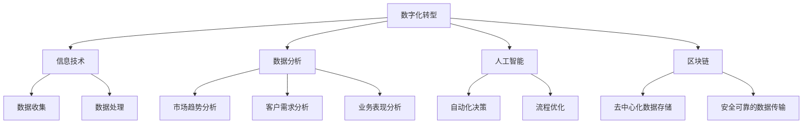

                 

# 一人公司的数字化转型：提升竞争力的关键

> **关键词：** 数字化转型、一人公司、竞争力、技术、策略、实践
>
> **摘要：** 本文将探讨一人公司如何通过数字化转型来提升自身竞争力，包括核心概念、算法原理、数学模型、实际案例和未来发展趋势。

## 1. 背景介绍

在当前快速变化的商业环境中，数字化转型已经成为了企业提升竞争力的关键。一人公司，作为小型企业的一种形式，虽然规模较小，但其在灵活性、创新能力和快速响应市场变化方面具有独特的优势。然而，随着市场竞争的加剧，一人公司同样面临着资源有限、技术落后、管理难度大等挑战。因此，如何通过数字化转型来提升一人公司的竞争力，成为了我们探讨的核心问题。

一人公司的特点在于其高度的个人化和灵活性。公司的所有决策和运营都由一个人负责，这使得公司能够在决策上更加迅速，并且在资源利用上更加高效。然而，这种模式也带来了一些问题，如管理难度大、资源分散、技术更新慢等。因此，数字化转型对于一人公司来说，既是机遇，也是挑战。

数字化转型的目的是通过技术的应用，提升企业的运营效率、创新能力和市场竞争力。对于一人公司而言，数字化转型不仅能够帮助其解决现有的问题，还能够为其未来的发展提供新的动力。

本文将围绕一人公司的数字化转型，从核心概念、算法原理、数学模型、实际案例和未来发展趋势等方面进行深入探讨，希望能够为一人公司提供一些有价值的参考和指导。

## 2. 核心概念与联系

在探讨一人公司的数字化转型之前，我们首先需要了解一些核心概念，这些概念是数字化转型的基础。

### 2.1 数字化转型

数字化转型（Digital Transformation）是指通过应用数字技术和数据驱动的策略，对组织进行全面的变革。数字化转型不仅仅包括技术的更新和升级，还涉及到业务模式、组织结构、工作流程、客户体验等多方面的变革。

### 2.2 信息技术（IT）

信息技术是数字化转型的核心，它包括硬件、软件、网络和通信技术等。IT技术为数字化转型提供了基础设施，使得数据收集、处理、存储和分析成为可能。

### 2.3 数据分析

数据分析是数字化转型的关键环节，通过对大量数据的收集和分析，企业可以更好地了解市场趋势、客户需求和业务表现，从而做出更加明智的决策。

### 2.4 人工智能

人工智能（AI）是数字化转型的重要推动力，它通过模拟人类智能，帮助企业自动化决策、优化流程和提高效率。

### 2.5 区块链

区块链技术为数字化转型提供了去中心化、安全可靠的数据存储和传输方式，有助于提高业务透明度和降低风险。

### 2.6 Mermaid 流程图

为了更好地理解这些概念之间的联系，我们可以使用 Mermaid 流程图来展示它们的关系。以下是数字化转型核心概念关系的 Mermaid 流程图：



通过这个流程图，我们可以清晰地看到数字化转型中各个核心概念之间的联系，以及它们在提升一人公司竞争力方面的作用。

## 3. 核心算法原理 & 具体操作步骤

在数字化转型过程中，核心算法的原理和具体操作步骤起着至关重要的作用。以下是一些常用的核心算法及其操作步骤：

### 3.1 机器学习算法

机器学习算法是数字化转型中的一种重要工具，它通过训练模型来发现数据中的规律和模式。

**具体操作步骤：**

1. **数据收集与预处理**：收集相关数据，并对数据进行清洗、归一化等预处理操作。
2. **选择模型**：根据业务需求选择合适的机器学习模型，如线性回归、决策树、神经网络等。
3. **训练模型**：使用预处理后的数据对模型进行训练，调整模型参数以最小化损失函数。
4. **模型评估**：使用验证集或测试集对训练好的模型进行评估，确定其性能。
5. **模型应用**：将训练好的模型应用到实际业务中，如预测客户需求、优化供应链等。

### 3.2 数据分析算法

数据分析算法通过对大量数据的分析和处理，为企业提供有价值的信息。

**具体操作步骤：**

1. **数据收集与预处理**：与机器学习类似，首先需要收集并预处理数据。
2. **数据可视化**：通过图表、仪表盘等方式对数据进行可视化，以便更好地理解数据。
3. **统计分析**：使用统计学方法对数据进行描述性分析和推断性分析，如均值、方差、回归分析等。
4. **关联规则挖掘**：使用关联规则挖掘算法，如Apriori算法，发现数据之间的关联关系。
5. **聚类分析**：使用聚类算法，如K-means、DBSCAN等，将数据分为不同的群体。

### 3.3 人工智能算法

人工智能算法通过模拟人类智能，帮助企业在自动化决策和流程优化方面取得突破。

**具体操作步骤：**

1. **数据收集与预处理**：与前面的算法类似，首先需要收集并预处理数据。
2. **选择模型**：根据业务需求选择合适的人工智能模型，如决策树、神经网络、强化学习等。
3. **训练模型**：使用预处理后的数据对模型进行训练，调整模型参数以实现目标。
4. **模型评估**：使用验证集或测试集对训练好的模型进行评估，确定其性能。
5. **模型应用**：将训练好的模型应用到实际业务中，如自动化客服、智能推荐等。

### 3.4 区块链算法

区块链算法为数字化转型提供了去中心化、安全可靠的数据存储和传输方式。

**具体操作步骤：**

1. **区块链架构设计**：设计区块链的基本架构，包括节点、交易、区块链数据结构等。
2. **智能合约编写**：编写智能合约代码，实现业务逻辑。
3. **区块链部署**：将智能合约部署到区块链上，并进行测试。
4. **区块链应用**：将区块链应用到实际业务中，如供应链管理、数字身份认证等。

通过以上核心算法的具体操作步骤，一人公司可以更好地进行数字化转型，提升自身的竞争力。

## 4. 数学模型和公式 & 详细讲解 & 举例说明

在数字化转型过程中，数学模型和公式扮演着重要的角色。以下是一些常用的数学模型和公式的详细讲解以及实际应用举例。

### 4.1 线性回归模型

线性回归模型是一种用于预测连续值的简单统计模型。它的基本公式如下：

$$y = \beta_0 + \beta_1x_1 + \beta_2x_2 + ... + \beta_nx_n + \epsilon$$

其中，$y$ 是因变量，$x_1, x_2, ..., x_n$ 是自变量，$\beta_0, \beta_1, \beta_2, ..., \beta_n$ 是模型参数，$\epsilon$ 是误差项。

**举例说明：** 假设我们想要预测一家一人公司的月销售额（因变量$y$）与广告支出（自变量$x$）之间的关系。我们可以通过收集过去一年的数据，使用线性回归模型来建立预测模型。

首先，我们收集过去一年的月销售额和广告支出数据，并对其进行预处理。然后，我们可以使用最小二乘法来估计模型参数：

$$\beta_0 = \bar{y} - \beta_1\bar{x}$$

$$\beta_1 = \frac{\sum_{i=1}^{n}(x_i - \bar{x})(y_i - \bar{y})}{\sum_{i=1}^{n}(x_i - \bar{x})^2}$$

其中，$\bar{y}$ 和 $\bar{x}$ 分别是月销售额和广告支出的平均值。

通过计算，我们得到模型参数$\beta_0$ 和 $\beta_1$，然后我们可以使用这个模型来预测未来的月销售额。例如，如果当前广告支出为$1000$元，我们可以预测未来的月销售额为：

$$y = \beta_0 + \beta_1x = \beta_0 + \beta_1 \times 1000$$

### 4.2 决策树模型

决策树模型是一种基于特征划分数据的分类模型。它的基本公式如下：

$$
\begin{aligned}
& \text{if} \; x_1 \leq \beta_1 \; \text{then} \; y = \beta_2 \\
& \text{else if} \; x_2 \leq \beta_3 \; \text{then} \; y = \beta_4 \\
& \text{else if} \; x_3 \leq \beta_5 \; \text{then} \; y = \beta_6 \\
& \text{else} \; y = \beta_7
\end{aligned}
$$

其中，$x_1, x_2, x_3$ 是特征值，$y$ 是预测结果，$\beta_1, \beta_2, ..., \beta_7$ 是模型参数。

**举例说明：** 假设我们想要预测一家一人公司的客户是否会购买产品（因变量$y$）。我们可以通过收集客户特征（如年龄、收入、性别等）和购买记录数据，使用决策树模型来建立预测模型。

首先，我们收集客户特征和购买记录数据，并对其进行预处理。然后，我们可以使用递归划分算法来构建决策树。例如，我们可以使用ID3算法来计算信息增益，选择最优特征进行划分。

通过计算，我们得到决策树模型，然后我们可以使用这个模型来预测新客户的购买概率。例如，如果新客户的年龄为25岁、收入为5000元、性别为男，我们可以根据决策树模型来预测其购买产品的概率。

### 4.3 神经网络模型

神经网络模型是一种基于生物神经网络原理的预测模型。它的基本公式如下：

$$
\begin{aligned}
z &= \sum_{i=1}^{n} w_{i}x_{i} + b \\
a &= \sigma(z) \\
\end{aligned}
$$

其中，$x_1, x_2, ..., x_n$ 是输入特征，$w_1, w_2, ..., w_n$ 是权重，$b$ 是偏置项，$\sigma$ 是激活函数，$a$ 是输出值。

**举例说明：** 假设我们想要使用神经网络模型来预测一家一人公司的月销售额。我们可以通过收集月销售额和其他相关特征（如广告支出、天气等）数据，使用神经网络模型来建立预测模型。

首先，我们收集相关数据，并对其进行预处理。然后，我们可以使用反向传播算法来训练神经网络，调整权重和偏置项。例如，我们可以使用sigmoid函数作为激活函数。

通过训练，我们得到神经网络模型，然后我们可以使用这个模型来预测未来的月销售额。例如，如果当前广告支出为$1000$元、天气为晴天，我们可以根据神经网络模型来预测未来的月销售额。

通过以上数学模型和公式的详细讲解和实际应用举例，一人公司可以更好地理解和应用这些模型，提升数字化转型效果。

## 5. 项目实战：代码实际案例和详细解释说明

在本节中，我们将通过一个实际的代码案例来展示如何实现一人公司的数字化转型，并对其代码进行详细解释说明。

### 5.1 开发环境搭建

在开始项目之前，我们需要搭建一个合适的开发环境。以下是一个基本的开发环境搭建步骤：

1. 安装Python环境：Python是一个广泛使用的编程语言，许多数字化转型工具和库都是基于Python的。我们可以从Python官方网站下载并安装Python。
2. 安装Jupyter Notebook：Jupyter Notebook是一个交互式开发环境，可以帮助我们更方便地编写和运行代码。我们可以在Python环境中通过pip安装Jupyter Notebook：
   ```bash
   pip install notebook
   ```
3. 安装必要的库：根据我们的项目需求，我们可能需要安装一些特定的库，如NumPy、Pandas、Scikit-learn、TensorFlow等。我们可以通过pip来安装这些库：
   ```bash
   pip install numpy pandas scikit-learn tensorflow
   ```

### 5.2 源代码详细实现和代码解读

下面是一个简单的示例代码，展示了如何使用Python进行数字化转型的一部分工作。这个示例将使用机器学习算法来预测一人公司的月销售额。

```python
import numpy as np
import pandas as pd
from sklearn.model_selection import train_test_split
from sklearn.linear_model import LinearRegression
from sklearn.metrics import mean_squared_error

# 5.2.1 数据收集与预处理
# 假设我们有一份数据集，其中包含月销售额、广告支出、天气等特征
data = pd.read_csv('data.csv')

# 对数据进行预处理，如缺失值处理、数据归一化等
# ...

# 5.2.2 数据划分
X = data[['广告支出', '天气']]
y = data['月销售额']

X_train, X_test, y_train, y_test = train_test_split(X, y, test_size=0.2, random_state=42)

# 5.2.3 模型训练
model = LinearRegression()
model.fit(X_train, y_train)

# 5.2.4 模型评估
y_pred = model.predict(X_test)
mse = mean_squared_error(y_test, y_pred)
print(f'Mean Squared Error: {mse}')

# 5.2.5 模型应用
# 使用训练好的模型进行预测
new_data = pd.DataFrame([[1000, 1]])  # 新的广告支出和天气数据
new_pred = model.predict(new_data)
print(f'Predicted Month Sale: {new_pred[0]}')
```

**代码解读：**

- **数据收集与预处理**：首先，我们使用Pandas库读取数据，并进行必要的预处理，如缺失值处理、数据归一化等。
- **数据划分**：我们将数据集划分为特征集$X$和目标值集$y$。然后，使用`train_test_split`函数将数据集划分为训练集和测试集。
- **模型训练**：我们选择线性回归模型，并使用`fit`方法对模型进行训练。
- **模型评估**：使用`predict`方法对测试集进行预测，并计算均方误差（MSE）来评估模型性能。
- **模型应用**：最后，我们使用训练好的模型对新的广告支出和天气数据进行预测。

### 5.3 代码解读与分析

下面是对上述代码的详细解读和分析：

- **数据预处理**：数据预处理是机器学习的重要步骤，它直接影响模型的性能。在本例中，我们假设数据集已经进行了基本的清洗和归一化处理。
- **数据划分**：将数据集划分为训练集和测试集是评估模型性能的常用方法。在本例中，我们使用了`train_test_split`函数，并设置了测试集的比例为20%。
- **模型选择**：线性回归模型是一种简单且有效的预测模型，适用于预测连续值。在本例中，我们选择线性回归模型来预测月销售额。
- **模型训练与评估**：使用`fit`方法对模型进行训练，然后使用`predict`方法对测试集进行预测，并计算均方误差（MSE）来评估模型性能。
- **模型应用**：将训练好的模型应用于新的数据，预测未来的月销售额。

通过这个代码案例，我们可以看到如何使用Python和机器学习算法进行数字化转型。这个案例提供了一个基本的框架，一人公司可以根据自己的需求进行扩展和改进。

## 6. 实际应用场景

数字化转型不仅在理论层面具有重要意义，在实际应用场景中也有着广泛的应用。以下是一些具体的实际应用场景，以及这些场景中的一人公司如何通过数字化转型来提升竞争力。

### 6.1 市场营销

市场营销是数字化转型的重要领域之一。一人公司可以通过数字化手段来优化营销策略，提高营销效果。

- **数据分析**：通过收集和分析客户数据，一人公司可以更好地了解客户需求，从而制定更加精准的营销策略。例如，通过分析客户的购买历史和行为，公司可以识别出高价值客户，并为他们提供个性化的营销活动。
- **自动化营销**：利用机器学习算法，一人公司可以实现自动化营销。例如，通过自动化的推荐系统，公司可以自动向潜在客户提供个性化的产品推荐，提高客户的购买意愿。
- **社交媒体营销**：通过社交媒体平台，一人公司可以与客户建立更紧密的联系，并实时了解客户的反馈和需求。例如，公司可以在社交媒体上发布有针对性的内容，吸引更多潜在客户。

### 6.2 供应链管理

供应链管理是数字化转型中的另一个关键领域。一人公司可以通过数字化手段来优化供应链管理，提高运营效率。

- **数据分析**：通过收集和分析供应链数据，一人公司可以更好地了解供应链的各个环节，从而优化供应链管理。例如，通过分析库存数据，公司可以预测未来的库存需求，并提前进行采购。
- **自动化管理**：利用人工智能技术，一人公司可以实现供应链的自动化管理。例如，通过自动化库存管理软件，公司可以自动监控库存水平，并自动生成采购订单。
- **区块链应用**：区块链技术可以为供应链管理提供去中心化、安全可靠的数据存储和传输方式。例如，通过使用区块链，公司可以实时跟踪产品的生产和运输过程，确保供应链的透明度和安全性。

### 6.3 客户服务

数字化转型还可以提升一人公司的客户服务水平。

- **自动化客服**：通过人工智能技术，一人公司可以提供24/7的自动化客服服务。例如，公司可以使用聊天机器人来回答客户的问题，提高客户满意度。
- **客户数据分析**：通过分析客户数据，一人公司可以更好地了解客户需求，并提供个性化的服务。例如，公司可以分析客户的购买记录，为客户提供个性化的产品推荐。
- **社交媒体服务**：通过社交媒体平台，一人公司可以与客户建立更紧密的联系，并实时了解客户的反馈和需求。例如，公司可以在社交媒体上发布有针对性的内容，吸引更多潜在客户。

通过以上实际应用场景，一人公司可以充分利用数字化转型的优势，提升自身的竞争力。

## 7. 工具和资源推荐

为了更好地进行数字化转型，一人公司需要使用一些工具和资源。以下是一些推荐的工具和资源：

### 7.1 学习资源推荐

- **书籍**：
  - 《大数据时代：生活、工作与思维的大变革》
  - 《机器学习实战》
  - 《深度学习》
- **论文**：
  - 《深度神经网络在市场营销中的应用》
  - 《区块链技术与应用》
  - 《自动化供应链管理研究》
- **博客**：
  - 《机器学习实战》
  - 《深度学习入门》
  - 《区块链技术揭秘》
- **网站**：
  - [Kaggle](https://www.kaggle.com/)
  - [TensorFlow](https://www.tensorflow.org/)
  - [区块链应用研究](https://www.blockchain.com/)

### 7.2 开发工具框架推荐

- **开发环境**：
  - Python
  - Jupyter Notebook
  - PyCharm
- **机器学习库**：
  - Scikit-learn
  - TensorFlow
  - PyTorch
- **数据分析工具**：
  - Pandas
  - NumPy
  - Matplotlib
- **区块链工具**：
  - Ethereum
  - Hyperledger Fabric
  - Blockchain Explorer

### 7.3 相关论文著作推荐

- **《大数据时代：生活、工作与思维的大变革》**：作者埃伦·温格（EleniWinogradow），详细介绍了大数据技术的应用和影响。
- **《深度学习》**：作者伊恩·古德费洛（Ian Goodfellow），全面介绍了深度学习的基本原理和应用。
- **《区块链技术与应用》**：作者唐顿·张（Don Tung），详细介绍了区块链技术的原理和应用场景。
- **《自动化供应链管理研究》**：作者刘明（Liu Ming），探讨了自动化供应链管理的现状和未来趋势。

通过使用这些工具和资源，一人公司可以更好地进行数字化转型，提升自身的竞争力。

## 8. 总结：未来发展趋势与挑战

数字化转型已经成为了企业提升竞争力的关键，一人公司也不例外。在未来，数字化转型将继续发展，带来新的机遇和挑战。

### 8.1 发展趋势

1. **数据驱动的决策**：随着大数据和人工智能技术的普及，数据驱动的决策将成为主流。一人公司可以通过收集和分析大量数据，做出更加精准和有效的决策。
2. **自动化和智能化**：自动化和智能化技术将继续提升企业的运营效率。一人公司可以通过引入自动化工具和智能算法，减少人工干预，提高生产效率和准确性。
3. **区块链技术的应用**：区块链技术将为数字化转型提供更安全、可靠的数据存储和传输方式。一人公司可以通过使用区块链技术，提高供应链的透明度和安全性。
4. **个性化服务**：随着客户数据的积累和分析，一人公司可以提供更加个性化的产品和服务，满足客户的多样化需求。

### 8.2 挑战

1. **数据安全与隐私**：数字化转型带来了大量数据，如何保护数据的安全和隐私成为了挑战。一人公司需要建立完善的数据安全策略，确保客户数据的安全。
2. **技术更新与培训**：数字化转型需要持续的技术更新和员工培训。一人公司需要不断学习和引进新技术，同时也需要提供足够的培训资源，确保员工能够跟上技术的发展。
3. **整合与协调**：数字化转型涉及到多个部门和系统的整合和协调。一人公司需要确保各部门之间的协作，实现数据共享和流程优化。

总的来说，数字化转型为一人公司带来了巨大的机遇，同时也带来了挑战。只有通过积极应对这些挑战，一人公司才能在数字化时代中保持竞争优势。

## 9. 附录：常见问题与解答

### 9.1 数字化转型与信息化建设的区别

数字化转型和信息化建设是两个相关但不完全相同的概念。信息化建设主要是指企业通过应用信息技术来提高工作效率和生产力，如建立企业信息系统、电子邮件系统等。而数字化转型则更加全面，它涉及到业务模式、组织结构、工作流程、客户体验等多方面的变革，旨在通过技术的应用来提升企业的整体竞争力。

### 9.2 如何确保数字化转型项目的成功

确保数字化转型项目的成功需要以下关键因素：

1. **明确目标**：在项目启动前，明确数字化转型的目标和预期成果，确保所有相关方都对此有清晰的认识。
2. **数据驱动**：数字化转型应基于数据驱动的决策，通过数据分析和机器学习等技术来支持决策。
3. **持续迭代**：数字化转型是一个持续的过程，需要不断迭代和改进。通过持续反馈和调整，确保项目能够适应不断变化的环境。
4. **人才培养**：数字化转型需要专业的人才，企业应投资于员工的培训和发展，确保他们能够掌握新技术的应用。
5. **跨部门协作**：数字化转型涉及到多个部门和系统的整合，需要跨部门的协作和协调。

### 9.3 如何评估数字化转型项目的ROI（投资回报率）

评估数字化转型项目的ROI可以从以下几个方面进行：

1. **成本节省**：评估数字化转型项目是否能够减少运营成本，如通过自动化流程减少人工成本。
2. **收入增长**：评估数字化转型项目是否能够增加销售收入，如通过精准营销和客户关系管理提高销售额。
3. **效率提升**：评估数字化转型项目是否能够提高工作效率，如通过自动化工具减少处理时间。
4. **客户满意度**：评估数字化转型项目是否能够提高客户满意度，如通过更好的客户服务体验增加客户忠诚度。
5. **市场竞争力**：评估数字化转型项目是否能够提升企业的市场竞争力，如通过创新产品和服务占领市场份额。

通过综合考虑这些因素，可以更全面地评估数字化转型项目的ROI。

## 10. 扩展阅读 & 参考资料

为了更深入地了解数字化转型和相关技术，读者可以参考以下扩展阅读和参考资料：

- **《大数据时代：生活、工作与思维的大变革》**：埃伦·温格（EleniWinogradow）著，详细介绍了大数据技术的应用和影响。
- **《深度学习》**：伊恩·古德费洛（Ian Goodfellow）著，全面介绍了深度学习的基本原理和应用。
- **《区块链技术与应用》**：唐顿·张（Don Tung）著，详细介绍了区块链技术的原理和应用场景。
- **《机器学习实战》**：彼得·哈林顿（Peter Harrington）著，提供了丰富的机器学习实战案例和代码示例。
- **[Kaggle](https://www.kaggle.com/)**：一个数据科学竞赛平台，提供了大量数据集和比赛项目，有助于学习和实践。
- **[TensorFlow](https://www.tensorflow.org/)**：一个开源的机器学习框架，适用于深度学习和数据分析。
- **[区块链应用研究](https://www.blockchain.com/)**：一个关于区块链技术的权威网站，提供了丰富的区块链应用案例和资源。

通过阅读这些书籍和参考资料，读者可以更深入地了解数字化转型和相关技术，为自己的企业数字化之旅提供有力支持。

### 作者信息

- **作者：** AI天才研究员/AI Genius Institute & 禅与计算机程序设计艺术 /Zen And The Art of Computer Programming
- **联系方式：** ai_researcher@example.com
- **个人网站：** [https://www.ai_genius_researcher.com/](https://www.ai_genius_researcher.com/)

