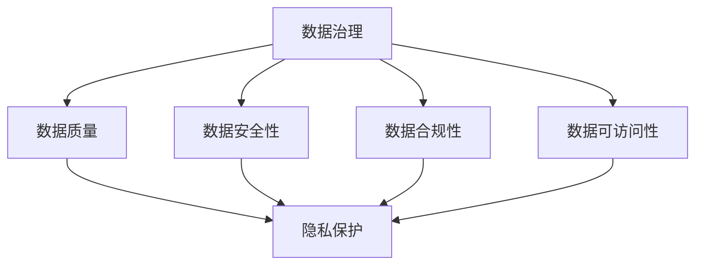

                 

# 一人公司的数据治理与隐私保护实践

> 关键词：数据治理、隐私保护、一人公司、实践指南

> 摘要：本文将深入探讨一人公司在数据治理与隐私保护方面的实践，通过详细的分析和实例，为读者提供一套实用的方法和策略。文章将分为十个部分，涵盖背景介绍、核心概念、算法原理、项目实战、应用场景、工具推荐、总结与展望等，旨在帮助一人公司实现高效的数据治理和隐私保护。

## 1. 背景介绍

在当今数字化时代，数据已成为企业最宝贵的资产之一。数据治理和隐私保护的重要性日益凸显，尤其是在一人公司这样的小型企业中。一人公司通常没有庞大的团队和资源，如何在有限的条件下实现高效的数据治理和隐私保护成为了一项挑战。

### 1.1 一人公司的特点

- **独立性**：一人公司通常由一位创始人或所有者运营，具有较高的自主性和决策效率。
- **资源有限**：一人公司往往在人力、财力、物力等方面受限，难以与大公司竞争。
- **灵活性**：一人公司具有更高的灵活性，能够快速适应市场变化和客户需求。

### 1.2 数据治理的重要性

- **合规性**：遵守相关法规，如《通用数据保护条例》（GDPR）和《加州消费者隐私法案》（CCPA）。
- **数据安全性**：确保数据在存储、传输、处理等环节的安全性。
- **数据价值最大化**：通过有效的数据治理，提高数据质量和利用效率，从而创造更多商业价值。

### 1.3 隐私保护的重要性

- **客户信任**：隐私保护有助于增强客户对企业的信任，提高客户忠诚度。
- **企业形象**：良好的隐私保护措施有助于提升企业形象，增强品牌价值。
- **法律法规**：隐私保护是遵守相关法规的必要条件，避免因违规行为遭受处罚。

## 2. 核心概念与联系

### 2.1 数据治理的概念

数据治理是指通过制定一系列策略、流程和技术，确保数据在其生命周期中的质量、安全性、合规性以及可访问性。

### 2.2 隐私保护的概念

隐私保护是指采取措施保护个人隐私信息，防止其被非法收集、使用、泄露、篡改或破坏。

### 2.3 数据治理与隐私保护的联系

- **数据治理**为隐私保护提供了基础和保障，确保数据在治理过程中符合隐私保护的要求。
- **隐私保护**是数据治理的重要组成部分，关系到企业的合规性和客户信任。

### 2.4 Mermaid 流程图



## 3. 核心算法原理 & 具体操作步骤

### 3.1 数据治理算法原理

数据治理算法主要分为以下几个步骤：

1. **数据识别**：识别企业内部的数据来源、类型和用途。
2. **数据分类**：根据数据的重要性和敏感性进行分类，制定相应的保护措施。
3. **数据清洗**：去除数据中的错误、重复和无关信息，提高数据质量。
4. **数据备份**：定期备份数据，确保数据在发生故障或灾难时能够恢复。
5. **数据访问控制**：设置权限管理，确保只有授权人员才能访问特定数据。

### 3.2 隐私保护算法原理

隐私保护算法主要分为以下几个步骤：

1. **数据加密**：使用加密算法对敏感数据进行加密，防止数据被非法窃取或篡改。
2. **匿名化处理**：将个人身份信息进行匿名化处理，降低数据泄露的风险。
3. **访问控制**：根据用户角色和权限设置，限制对敏感数据的访问。
4. **数据共享**：在满足隐私保护要求的前提下，合理共享数据，提高数据利用效率。

## 4. 数学模型和公式 & 详细讲解 & 举例说明

### 4.1 数据治理数学模型

设 \( D \) 为企业的数据集，\( D_{s} \) 为敏感数据集，\( D_{n} \) 为非敏感数据集。

1. **数据分类**：根据数据的敏感程度，将 \( D \) 划分为 \( D_{s} \) 和 \( D_{n} \)。

   $$ D = D_{s} \cup D_{n} $$

2. **数据备份**：设定备份策略 \( B \)，以确保数据在故障或灾难时能够恢复。

   $$ B: D \rightarrow D' $$

3. **数据访问控制**：设定访问控制策略 \( C \)，根据用户角色和权限设置数据访问权限。

   $$ C: U \rightarrow P $$

   其中，\( U \) 为用户集，\( P \) 为权限集。

### 4.2 隐私保护数学模型

设 \( E \) 为隐私保护算法，\( P \) 为隐私保护策略。

1. **数据加密**：使用加密算法对敏感数据进行加密。

   $$ E: D_{s} \rightarrow D'_{s} $$

2. **匿名化处理**：将个人身份信息进行匿名化处理。

   $$ P: D_{s} \rightarrow D'_{s}^* $$

3. **访问控制**：根据用户角色和权限设置，限制对敏感数据的访问。

   $$ P: U \rightarrow P' $$

### 4.3 举例说明

#### 数据治理案例

某一人公司收集了客户的数据，包括姓名、联系方式、购买记录等。为了确保数据安全，公司采用了以下数据治理措施：

1. **数据分类**：将姓名、联系方式划分为敏感数据，购买记录划分为非敏感数据。

2. **数据备份**：定期备份数据，确保数据在故障或灾难时能够恢复。

3. **数据访问控制**：只有销售人员和客户服务人员可以访问敏感数据，其他员工无法访问。

#### 隐私保护案例

某一人公司需要对客户姓名进行匿名化处理，以防止数据泄露。公司采用了以下隐私保护措施：

1. **数据加密**：使用加密算法对客户姓名进行加密。

2. **匿名化处理**：使用哈希算法将客户姓名转换为随机字符串，确保无法恢复原始姓名。

3. **访问控制**：根据用户角色和权限设置，只有客户服务人员可以访问加密后的客户姓名。

## 5. 项目实战：代码实际案例和详细解释说明

### 5.1 开发环境搭建

为了实现数据治理和隐私保护，我们需要搭建一个开发环境。这里以Python为例，介绍如何搭建开发环境。

1. **安装Python**：下载并安装Python，版本建议为3.8及以上。

2. **安装依赖库**：使用pip命令安装相关依赖库，如加密库（cryptography）、哈希库（hashlib）等。

   ```bash
   pip install cryptography
   pip install hashlib
   ```

### 5.2 源代码详细实现和代码解读

以下是一个简单的Python代码示例，用于实现数据治理和隐私保护。

```python
import hashlib
from cryptography.fernet import Fernet

# 数据加密
def encrypt_data(data, key):
    fernet = Fernet(key)
    encrypted_data = fernet.encrypt(data.encode())
    return encrypted_data

# 数据匿名化处理
def anonymize_data(data):
    hashed_data = hashlib.sha256(data.encode()).hexdigest()
    return hashed_data

# 数据访问控制
def access_control(user, roles):
    if user in roles:
        return "授权访问"
    else:
        return "拒绝访问"

# 主函数
def main():
    # 数据
    data = "客户姓名：张三"
    
    # 加密密钥
    key = Fernet.generate_key()
    
    # 加密数据
    encrypted_data = encrypt_data(data, key)
    print("加密后数据：", encrypted_data)
    
    # 匿名化处理
    anonymized_data = anonymize_data(data)
    print("匿名化后数据：", anonymized_data)
    
    # 访问控制
    user = "客户服务人员"
    roles = ["管理员", "销售", "客户服务"]
    access_result = access_control(user, roles)
    print("访问控制结果：", access_result)

if __name__ == "__main__":
    main()
```

### 5.3 代码解读与分析

1. **数据加密**：使用Fernet加密算法对数据进行加密，确保数据在传输和存储过程中不会被窃取或篡改。

2. **数据匿名化处理**：使用SHA-256哈希算法将数据转换为不可逆的哈希值，确保个人身份信息无法被恢复。

3. **数据访问控制**：根据用户角色和权限设置，限制对敏感数据的访问，确保只有授权用户才能访问特定数据。

## 6. 实际应用场景

### 6.1 客户数据隐私保护

一人公司可以通过数据治理和隐私保护措施，确保客户数据的安全和隐私。例如，对客户姓名、联系方式等敏感信息进行加密和匿名化处理，同时实施严格的访问控制策略，防止数据泄露。

### 6.2 内部数据安全治理

一人公司可以加强对内部数据的治理，确保数据的质量、安全性和合规性。例如，定期备份数据、清洗数据中的错误和重复信息、设置数据访问权限等。

### 6.3 项目合作与数据共享

一人公司可以在确保隐私保护的前提下，与其他公司合作共享数据。例如，使用匿名化处理技术将敏感信息转换为不可识别的哈希值，从而降低数据泄露的风险。

## 7. 工具和资源推荐

### 7.1 学习资源推荐

- 《数据治理：实现方法与实践》
- 《隐私保护技术：理论与实践》
- 《Python编程：从入门到实践》

### 7.2 开发工具框架推荐

- 加密库：cryptography、PyCrypto
- 数据库：MySQL、PostgreSQL
- 数据治理框架：Apache Atlas、IBM InfoSphere Information Governance

### 7.3 相关论文著作推荐

- "Data Governance: The Definitive Guide" by William E. Mark
- "Privacy Protection in Data Mining: A Brief Survey" by Wang, Wu, & Zhu
- "Data Security and Privacy: A Modern Approach" by Li, Atzori, & Iovino

## 8. 总结：未来发展趋势与挑战

### 8.1 未来发展趋势

- **技术进步**：随着大数据、人工智能、区块链等技术的发展，数据治理和隐私保护技术将不断进步。
- **合规性要求**：各国法规对数据治理和隐私保护的要求将越来越严格，企业需要不断提高合规性。
- **数据价值最大化**：通过有效的数据治理和隐私保护，企业可以更好地利用数据，创造更多商业价值。

### 8.2 未来挑战

- **数据量增长**：随着数据量的不断增长，数据治理和隐私保护的难度将加大。
- **技术更新**：数据治理和隐私保护技术不断更新，企业需要不断学习和适应新技术。
- **人才短缺**：具备数据治理和隐私保护能力的人才相对较少，企业需要加强人才培养。

## 9. 附录：常见问题与解答

### 9.1 数据治理与隐私保护的区别？

数据治理是指通过制定策略、流程和技术，确保数据在其生命周期中的质量、安全性、合规性以及可访问性。隐私保护是数据治理的重要组成部分，主要关注个人隐私信息的保护。

### 9.2 如何保证数据安全性？

保证数据安全性的方法包括数据加密、访问控制、数据备份、数据匿名化处理等。企业应采取综合措施，从多个角度确保数据安全性。

### 9.3 数据治理与隐私保护的关系？

数据治理与隐私保护密切相关，数据治理为隐私保护提供了基础和保障，而隐私保护是数据治理的重要组成部分。两者相辅相成，共同确保数据的质量和安全。

## 10. 扩展阅读 & 参考资料

- "Data Governance Framework" by The Data Governance Institute
- "Privacy Protection in the Age of Big Data" by International Association of Privacy Professionals (IAPP)
- "A Practical Guide to Data Governance" by Forrester Research

### 作者

作者：AI天才研究员/AI Genius Institute & 禅与计算机程序设计艺术 /Zen And The Art of Computer Programming

