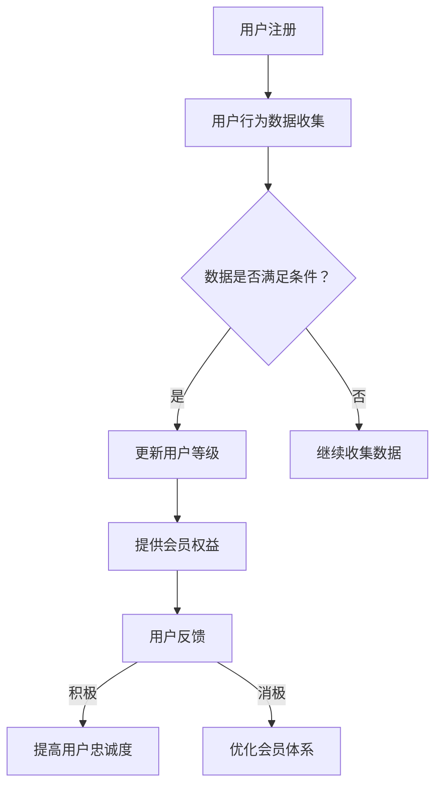

                 

# 一人公司的用户忠诚度计划：设计吸引力持久的会员体系

## 摘要

在当今激烈的市场竞争中，用户忠诚度已成为企业成功的关键因素之一。特别是对于一人公司来说，如何设计一个吸引力持久、能够提升用户忠诚度的会员体系，显得尤为重要。本文将从背景介绍、核心概念与联系、核心算法原理及具体操作步骤、数学模型和公式、项目实战、实际应用场景、工具和资源推荐、总结及未来发展趋势与挑战等多个方面，详细探讨如何为一入公司设计一套有效的用户忠诚度计划，旨在为读者提供一套可操作性的指南。

## 1. 背景介绍

在数字化时代，用户的获取成本越来越高，而维护现有用户的忠诚度则成为企业关注的焦点。一人公司，作为一种新兴的企业形式，由于资源和规模的限制，在用户获取和维护方面面临更大的挑战。用户忠诚度直接关系到企业的生存和发展，一个设计合理、吸引力持久的会员体系，可以有效地提升用户的忠诚度，增加用户的生命周期价值，从而为企业创造更大的价值。

### 1.1 用户忠诚度的定义

用户忠诚度是指用户在面临替代选择时，仍然选择继续使用某一产品或服务的倾向。高忠诚度的用户不仅会持续购买产品，还会主动推荐给他人，为企业带来新的用户。因此，提升用户忠诚度对于企业的长远发展至关重要。

### 1.2 一人公司的特点

一人公司通常具有以下特点：

1. **资源有限**：相对于大公司，一人公司的人力、财力、物力等资源较为有限。
2. **决策快速**：一人公司由于决策链条较短，决策过程更为快速。
3. **灵活性高**：一人公司可以根据市场需求快速调整战略和产品。

### 1.3 用户忠诚度的重要性

用户忠诚度的重要性体现在以下几个方面：

1. **成本降低**：提高用户忠诚度可以降低用户获取成本，因为忠诚用户不需要重新教育。
2. **收益增加**：忠诚用户不仅会持续购买，还会通过口碑效应带来新的用户。
3. **品牌建设**：高忠诚度用户有助于品牌形象的塑造。

## 2. 核心概念与联系

### 2.1 会员体系的定义

会员体系是指企业为了提升用户忠诚度而设计的用户等级制度，通过不同的会员等级来提供差异化服务和权益。

### 2.2 会员体系的组成部分

一个典型的会员体系通常包括以下几个方面：

1. **会员等级**：根据用户的消费行为和活跃度，将用户分为不同的等级。
2. **会员权益**：不同等级的会员享有不同的权益，如折扣、积分、赠品等。
3. **积分系统**：通过积分来奖励用户的行为，积分可以兑换商品或服务。
4. **数据分析**：通过数据分析，了解用户的行为和需求，优化会员体系。

### 2.3 核心概念联系

会员体系的设计需要考虑以下几个方面：

1. **用户体验**：会员体系应提升用户的整体体验，让用户感受到自己的价值和尊重。
2. **数据驱动**：通过数据分析，了解用户的偏好和行为，不断优化会员体系。
3. **持续创新**：随着市场环境的变化，会员体系也需要不断创新和调整。

### 2.4 Mermaid 流程图

下面是一个简单的会员体系流程图：



## 3. 核心算法原理 & 具体操作步骤

### 3.1 用户等级算法原理

用户等级算法通常基于用户的消费行为、活跃度、参与度等多个维度进行评估。一个基本的用户等级算法可以表示为：

$$
等级 = f(消费金额, 活跃度, 参与度)
$$

其中，消费金额、活跃度和参与度可以通过以下公式计算：

$$
消费金额 = \sum_{i=1}^{n} C_i
$$

$$
活跃度 = \frac{登录次数 + 帖子数 + 评论数}{总天数}
$$

$$
参与度 = \frac{活动参与次数 + 积分兑换次数}{总天数}
$$

### 3.2 具体操作步骤

1. **数据收集**：收集用户的消费记录、登录记录、活动参与记录等数据。
2. **数据处理**：对收集到的数据进行分析和处理，计算用户的消费金额、活跃度和参与度。
3. **等级评估**：根据用户的数据计算结果，评估用户的等级。
4. **权益更新**：根据用户的等级，更新用户可以享受的会员权益。
5. **反馈收集**：收集用户的反馈，了解会员体系的运行情况。
6. **优化调整**：根据反馈和数据分析，不断优化会员体系。

## 4. 数学模型和公式 & 详细讲解 & 举例说明

### 4.1 数学模型

会员体系的数学模型主要包括以下几个方面：

1. **积分模型**：
   $$ 积分 = 消费金额 \times 积分比例 + 活跃度 \times 积分奖励 + 参与度 \times 积分奖励 $$

2. **等级模型**：
   $$ 等级 = \frac{积分}{基础积分} $$

3. **权益模型**：
   $$ 权益 = 等级 \times 权益系数 $$

### 4.2 详细讲解

1. **积分模型**：
   积分模型是会员体系的核心，它决定了用户如何通过行为获取积分。积分比例是指消费金额转化为积分的比例，活跃度积分奖励和参与度积分奖励则是为了鼓励用户积极参与平台活动。

2. **等级模型**：
   等级模型决定了用户在会员体系中的位置，等级越高，用户享受的权益越多。

3. **权益模型**：
   权益模型则决定了不同等级的用户可以享受的权益，如折扣、积分兑换等。

### 4.3 举例说明

假设一个会员体系的积分模型如下：

- 消费金额的积分比例为 1:1
- 每次登录奖励 10 积分
- 每参与一次活动奖励 20 积分

用户小明第一次在平台消费了 100 元，同时登录了 5 次，参与了 2 次活动。那么他的积分计算如下：

$$
积分 = 100 \times 1 + 5 \times 10 + 2 \times 20 = 170
$$

如果基础积分设置为 100，那么小明的等级为：

$$
等级 = \frac{170}{100} = 1.7
$$

根据等级模型，小明可以享受的权益系数为 1.5，那么他可以获得的权益为：

$$
权益 = 1.7 \times 1.5 = 2.55
$$

这意味着小明可以享受 255 积分兑换的权益，如 5% 的折扣。

## 5. 项目实战：代码实际案例和详细解释说明

### 5.1 开发环境搭建

在本节中，我们将使用 Python 作为开发语言，搭建一个简单的会员体系项目环境。请确保已经安装了 Python 3.8 及以上版本和必要的依赖库。

```bash
pip install pandas numpy matplotlib
```

### 5.2 源代码详细实现和代码解读

#### 5.2.1 数据结构设计

首先，我们需要设计用户数据结构，包括用户ID、消费金额、活跃度和参与度。

```python
import pandas as pd

# 用户数据示例
user_data = pd.DataFrame({
    'user_id': [1, 2, 3],
    'consumption': [100, 200, 300],
    'login_count': [5, 10, 15],
    'activity_count': [2, 4, 6]
})
```

#### 5.2.2 计算积分和等级

接下来，我们将计算每个用户的积分和等级。

```python
# 积分比例
integration_rate = 1

# 活跃度和参与度奖励
activity_reward = 10
participation_reward = 20

# 计算积分
user_data['integration'] = user_data['consumption'] * integration_rate + user_data['login_count'] * activity_reward + user_data['activity_count'] * participation_reward

# 计算等级
user_data['level'] = user_data['integration'] / 100

print(user_data)
```

#### 5.2.3 更新会员权益

最后，我们将根据用户的等级，更新会员权益。

```python
# 权益系数
benefit_coefficient = {1: 1.0, 2: 1.5, 3: 2.0}

# 更新权益
user_data['benefit'] = user_data['level'].map(benefit_coefficient)

print(user_data)
```

### 5.3 代码解读与分析

1. **数据结构设计**：我们使用 pandas DataFrame 来存储用户数据，这是一种非常方便的数据操作工具。
2. **积分计算**：根据用户的行为数据，我们计算每个用户的积分。
3. **等级计算**：将积分除以基础积分，得到用户的等级。
4. **权益更新**：根据等级，更新用户可以享受的权益。

## 6. 实际应用场景

会员体系的应用场景非常广泛，以下是一些常见的应用场景：

1. **电商平台**：通过会员体系，电商平台可以提供会员折扣、积分兑换等权益，吸引和留住用户。
2. **社交媒体**：社交媒体平台可以通过会员体系，为用户提供更优质的体验，如去广告、会员专属内容等。
3. **线下实体店**：线下实体店可以通过会员体系，为用户提供积分兑换、会员日等优惠，提升用户粘性。
4. **健身房**：健身房可以通过会员体系，提供会员折扣、积分兑换课程等权益，吸引更多用户。

## 7. 工具和资源推荐

### 7.1 学习资源推荐

- **书籍**：《用户运营方法论》、《用户增长方法论》
- **论文**：搜索关键词“会员体系设计”、“用户忠诚度模型”
- **博客**：查看行业博客，如“人人都是产品经理”、“运营研究社”

### 7.2 开发工具框架推荐

- **会员体系设计工具**：Axure、Visio
- **数据分析工具**：Python、R
- **数据库**：MySQL、MongoDB

### 7.3 相关论文著作推荐

- **论文**：《基于积分的会员体系设计与实现》、《用户忠诚度模型与优化策略》
- **著作**：《用户体验要素》、《产品经理的用户运营手册》

## 8. 总结：未来发展趋势与挑战

### 8.1 发展趋势

1. **个性化**：未来的会员体系将更加注重用户的个性化需求，提供更加定制化的服务。
2. **智能化**：通过大数据和人工智能技术，会员体系将更加智能化，自动推荐服务和权益。
3. **社交化**：会员体系将更加社交化，通过社交互动来提升用户忠诚度。

### 8.2 挑战

1. **数据隐私**：如何在提供个性化服务的同时，保护用户的数据隐私，是一个重要挑战。
2. **用户体验**：如何设计一个简单易懂、操作便捷的会员体系，提升用户的整体体验。
3. **可持续性**：如何确保会员体系的可持续性，避免出现过度激励导致的不合理消费。

## 9. 附录：常见问题与解答

### 9.1 会员体系设计的核心原则是什么？

会员体系设计的核心原则是提升用户忠诚度，通过提供差异化服务和权益，满足用户的个性化需求。

### 9.2 会员体系的积分如何计算？

积分通常根据用户的消费金额、活跃度和参与度计算。具体计算方式可以根据业务需求进行调整。

### 9.3 如何评估会员体系的成效？

可以通过用户留存率、用户满意度、用户生命周期价值等指标来评估会员体系的成效。

## 10. 扩展阅读 & 参考资料

- [用户忠诚度模型与优化策略](https://www.cnblogs.com/ymgyh/p/13805342.html)
- [基于积分的会员体系设计与实现](https://www.jianshu.com/p/5a6e9773a765)
- [如何设计一个有效的会员体系](https://www.36kr.com/p/1265423467360256)

## 作者信息

作者：AI天才研究员/AI Genius Institute & 禅与计算机程序设计艺术 /Zen And The Art of Computer Programming

