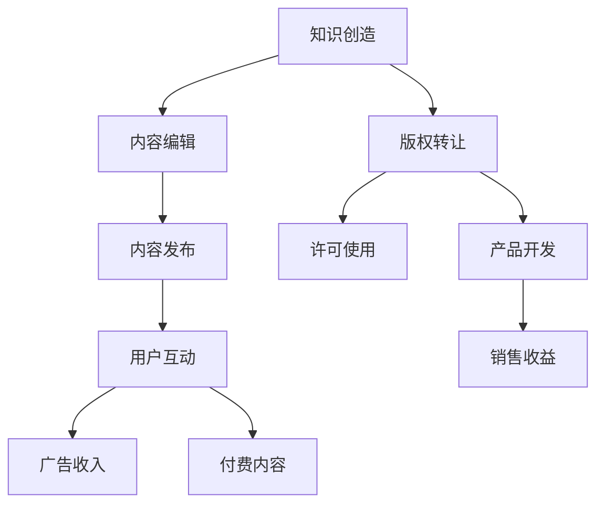

                 

## 1. 背景介绍

### 1.1 知识变现与 IP 商业化的背景

在互联网和数字化时代，知识共享和传播变得更加便捷。然而，随着信息爆炸和内容泛滥，个人和公司如何有效地将知识转化为可观的商业价值，成为了越来越多创业者和企业关注的焦点。知识变现与 IP 商业化，正是在这一背景下应运而生。

知识变现，即通过分享个人或公司的知识、技能和经验，将其转化为经济利益。这可以包括撰写和出版专业书籍、开设在线课程、撰写高质量技术博客、提供咨询服务等。IP（Intellectual Property，知识产权）商业化则是指将原创性的知识、创意或技术转化为可以商业化的资产，通过版权转让、许可使用、开发相关产品等方式获取收益。

### 1.2 一人公司的优势与挑战

一人公司，顾名思义，是由一个人完全控制和运营的企业。这种形式的企业在近年来逐渐受到关注，尤其是对于希望通过知识变现实现个人价值的人而言。一人公司的优势在于：

- **灵活性**：一人公司无需复杂的决策流程，可以快速响应市场需求。
- **成本控制**：由于规模较小，一人公司可以更好地控制运营成本。
- **专注性**：创始人可以全身心投入到业务中，专注于知识创造和 IP 构建。

然而，一人公司也面临着一些挑战：

- **资源有限**：一人公司通常缺乏足够的资金、人脉和资源。
- **时间管理**：需要兼顾知识创造和商业运营，可能导致时间和精力的分散。
- **市场认知**：如何提高品牌知名度，扩大市场影响力，是一大挑战。

### 1.3 知识变现与 IP 商业化的重要性

对于一人公司而言，知识变现与 IP 商业化的重要性不言而喻。这不仅能够为个人带来持续的收入流，还能够增强个人品牌的知名度和影响力。以下是几个关键点：

- **经济收益**：通过知识变现，一人公司可以获得稳定的现金流，为未来的发展提供资金支持。
- **品牌提升**：通过 IP 商业化，可以打造具有高辨识度的品牌形象，提升市场地位。
- **影响力扩大**：通过专业知识和原创内容的传播，可以吸引更多的关注者和合作伙伴。

总之，知识变现与 IP 商业化是现代一人公司实现可持续发展和成功的关键路径。

---

在接下来的部分，我们将深入探讨知识变现与 IP 商业化的核心概念、算法原理、数学模型、实际应用场景以及工具和资源推荐。通过逐步分析，希望能够帮助读者更好地理解这一复杂而重要的领域。请保持关注，继续阅读。**<|im_sep|>**

## 2. 核心概念与联系

### 2.1 知识变现的定义

知识变现是指将个人或团队的知识、技能和经验转化为经济利益的过程。这个过程可以通过多种形式实现，包括但不限于：

- **撰写和出版书籍**：将自己的专业知识或行业见解撰写成书，通过出版获得版税收入。
- **开设在线课程**：利用互联网平台，将自己的专业课程发布在线，通过学员报名费获得收入。
- **撰写技术博客**：通过撰写高质量的技术文章，吸引流量并转化为广告收入或付费内容。
- **提供咨询服务**：利用自己的专业知识和经验，为企业或个人提供咨询服务，通过咨询服务费获得收益。

### 2.2 IP 商业化的定义

IP 商业化是指将原创性的知识、创意或技术转化为可以商业化的资产，通过多种途径实现经济收益。IP 商业化的常见方式包括：

- **版权转让**：将原创内容的版权出售给其他公司或个人。
- **许可使用**：授权其他公司或个人使用自己的原创内容，并获得许可使用费。
- **开发相关产品**：将原创内容或技术应用于产品开发，通过销售产品获得收益。
- **合作开发**：与其他公司或个人合作，共同开发和推广产品，共享收益。

### 2.3 知识变现与 IP 商业化的联系

知识变现与 IP 商业化之间有着密切的联系。知识变现是 IP 商业化的基础，而 IP 商业化则是知识变现的深化和拓展。具体来说：

- **知识变现**：通过知识变现，个人或公司可以初步实现经济收益，例如通过撰写技术博客吸引读者，从而获得广告收入。
- **IP 商业化**：在积累了一定的知识和用户基础后，可以通过 IP 商业化进一步扩大收益，例如将技术博客的内容整理成书，通过出版获得版税收入。

### 2.4 一人公司的角色与定位

在一人公司中，创始人不仅是公司的主要运营者，也是知识创造者和 IP 构建者。因此，一人公司的角色与定位可以概括为：

- **知识创造者**：利用自身的专业知识，不断产出高质量的内容或产品。
- **IP 构建者**：通过持续的内容创作和商业化运作，构建具有高价值的 IP 资产。
- **商业运营者**：在知识变现和 IP 商业化的过程中，负责市场的推广、销售和客户服务。

### 2.5 Mermaid 流程图展示

以下是知识变现与 IP 商业化过程中的主要步骤，使用 Mermaid 流程图展示（注意：由于文本限制，这里仅展示流程图的一部分，实际流程图需使用 Mermaid 标记语言详细描述）：



通过这个流程图，我们可以清晰地看到从知识创造到经济收益的各个步骤。每一个节点都代表着知识变现或 IP 商业化过程中的一步，这些步骤相互关联，构成了一个完整的商业闭环。

---

在接下来的章节中，我们将深入探讨知识变现与 IP 商业化的核心算法原理、具体操作步骤、数学模型和公式，并通过实际案例进行详细讲解。希望这些内容能够帮助读者更好地理解和应用这一领域的知识。请保持关注，继续阅读。**<|im_sep|>**

## 3. 核心算法原理 & 具体操作步骤

### 3.1 知识变现的算法原理

知识变现的过程可以看作是一个信息传播和价值转化的过程。其核心算法原理可以概括为以下几点：

#### 3.1.1 内容创作与优化

- **内容定位**：根据市场需求和目标受众，确定内容主题和方向。
- **内容创作**：通过深入研究和专业分析，撰写高质量的内容。
- **内容优化**：利用搜索引擎优化（SEO）等技术，提高内容的可见性和传播效率。

#### 3.1.2 用户互动与转化

- **用户互动**：通过评论、问答、互动直播等形式，与用户建立良好的互动关系。
- **用户转化**：通过内容营销和用户引导，将用户转化为付费用户或潜在客户。

#### 3.1.3 广告收入与付费内容

- **广告收入**：通过在内容中嵌入广告，获取广告收入。
- **付费内容**：提供高质量、有价值的付费内容，吸引用户付费。

### 3.2 IP 商业化的算法原理

IP 商业化的核心在于将原创内容或技术转化为具有商业价值的资产。其算法原理主要包括以下几个方面：

#### 3.2.1 版权管理与授权

- **版权登记**：对原创内容进行版权登记，保护知识产权。
- **授权使用**：通过签订许可协议，授权他人使用原创内容，获取许可使用费。

#### 3.2.2 产品开发与推广

- **产品规划**：根据市场需求，规划相关产品的开发方向。
- **产品开发**：利用原创内容或技术，开发具有竞争力的产品。
- **产品推广**：通过市场营销和推广活动，提高产品的市场知名度和销量。

#### 3.2.3 合作开发与市场拓展

- **合作开发**：与其他公司或个人合作，共同开发和推广产品，共享收益。
- **市场拓展**：通过拓展市场渠道和增加销售渠道，扩大产品销售范围。

### 3.3 知识变现与 IP 商业化的具体操作步骤

#### 3.3.1 内容创作与优化

1. **内容定位**：确定目标受众和内容主题，进行市场调研和需求分析。
2. **内容创作**：根据定位，撰写高质量的内容，包括文字、图片、视频等多种形式。
3. **内容优化**：使用 SEO 技术优化内容，提高搜索引擎排名和用户访问量。

#### 3.3.2 用户互动与转化

1. **用户互动**：通过社交媒体、论坛、问答平台等与用户互动，建立良好的用户关系。
2. **用户转化**：通过内容营销和用户引导，将用户转化为付费用户或潜在客户。

#### 3.3.3 广告收入与付费内容

1. **广告收入**：在内容中嵌入广告，通过广告平台获取广告收入。
2. **付费内容**：提供高质量、有价值的付费内容，通过付费模式获取收益。

#### 3.3.4 版权管理与授权

1. **版权登记**：对原创内容进行版权登记，保护知识产权。
2. **授权使用**：签订许可协议，授权他人使用原创内容，获取许可使用费。

#### 3.3.5 产品开发与推广

1. **产品规划**：根据市场需求，规划相关产品的开发方向。
2. **产品开发**：利用原创内容或技术，开发具有竞争力的产品。
3. **产品推广**：通过市场营销和推广活动，提高产品的市场知名度和销量。

#### 3.3.6 合作开发与市场拓展

1. **合作开发**：与其他公司或个人合作，共同开发和推广产品，共享收益。
2. **市场拓展**：通过拓展市场渠道和增加销售渠道，扩大产品销售范围。

通过以上步骤，一人公司可以有效地实现知识变现与 IP 商业化，从而实现个人价值和企业盈利的双赢。

---

在接下来的部分，我们将进一步探讨知识变现与 IP 商业化中的数学模型和公式，以及通过实际案例进行详细解释说明。请继续关注，我们将为您提供更加深入的技术分析和实操指导。**<|im_sep|>**

## 4. 数学模型和公式 & 详细讲解 & 举例说明

### 4.1 知识变现中的数学模型

在知识变现的过程中，我们可以利用一些数学模型来分析内容创作的效果和收益。以下是几个常用的数学模型：

#### 4.1.1 用户访问量模型

用户访问量（UV）是衡量内容受欢迎程度的一个重要指标。一个简单的用户访问量模型可以表示为：

\[ UV = f(内容质量, 推广力度, 竞争环境) \]

其中：
- \( f \) 表示函数，表示用户访问量与内容质量、推广力度和竞争环境的关系。
- 内容质量：高质量的内容更容易吸引用户访问。
- 推广力度：通过有效的推广手段，可以增加用户访问量。
- 竞争环境：竞争激烈的市场环境会影响用户访问量。

#### 4.1.2 广告收入模型

广告收入与用户访问量和广告点击率（CTR）有关。一个简单的广告收入模型可以表示为：

\[ 广告收入 = UV \times 广告点击率（CTR） \times 广告单价 \]

其中：
- 广告点击率（CTR）：用户点击广告的概率。
- 广告单价：每次点击广告所能获得的收入。

#### 4.1.3 付费内容模型

付费内容收入与用户付费意愿和付费转化率有关。一个简单的付费内容模型可以表示为：

\[ 付费收入 = 用户数量 \times 付费转化率 \times 付费单价 \]

其中：
- 用户数量：访问内容的用户总数。
- 付费转化率：愿意付费的用户比例。
- 付费单价：每个付费用户愿意支付的价格。

### 4.2 IP 商业化中的数学模型

在 IP 商业化过程中，我们可以利用一些数学模型来评估 IP 的价值和潜在收益。以下是几个常用的数学模型：

#### 4.2.1 版权价值模型

版权价值可以通过以下公式进行评估：

\[ 版权价值 = 市场需求 \times 版权使用频率 \times 版权许可费用 \]

其中：
- 市场需求：市场对版权内容的需求程度。
- 版权使用频率：版权内容在实际应用中的使用次数。
- 版权许可费用：每次使用版权内容所需支付的费用。

#### 4.2.2 产品收入模型

产品收入可以通过以下公式进行评估：

\[ 产品收入 = 销售量 \times 产品单价 \]

其中：
- 销售量：产品在市场上的销售数量。
- 产品单价：每个产品的销售价格。

#### 4.2.3 合作开发收益模型

合作开发收益可以通过以下公式进行评估：

\[ 合作收益 = 合作项目收益 \times 合作分成比例 \]

其中：
- 合作项目收益：合作项目所产生的总收益。
- 合作分成比例：根据合作协议，各方分得的收益比例。

### 4.3 举例说明

#### 4.3.1 知识变现中的广告收入计算

假设某技术博客文章的月均用户访问量为10万次（UV），广告点击率（CTR）为5%，广告单价为1元。那么，该文章的月广告收入可以计算如下：

\[ 广告收入 = 10万 \times 5\% \times 1元 = 5000元 \]

#### 4.3.2 IP 商业化中的版权价值评估

假设某原创技术课程的版权市场需求为100万元，版权使用频率为每年10次，每次版权许可费用为10万元。那么，该课程的版权价值可以计算如下：

\[ 版权价值 = 100万元 \times 10次 \times 10万元 = 1000万元 \]

#### 4.3.3 合作开发收益计算

假设某合作开发项目的总收益为50万元，合作分成比例为5:5。那么，双方的收益可以计算如下：

\[ 合作收益 = 50万元 \times 5:5 = 25万元（每方） \]

通过以上数学模型和公式，我们可以对知识变现和 IP 商业化中的关键指标进行量化分析，从而更好地制定策略和优化操作。

---

在接下来的章节中，我们将通过具体的项目实战案例，详细展示如何进行知识变现和 IP 商业化，并提供代码实际案例和解读。敬请期待，继续阅读。**<|im_sep|>**

### 5. 项目实战：代码实际案例和详细解释说明

在本章节中，我们将通过一个具体的项目实战案例，详细展示如何将知识变现和 IP 商业化应用于实际操作。这个项目将分为几个部分：开发环境搭建、源代码详细实现、代码解读与分析。

#### 5.1 开发环境搭建

在开始项目之前，我们需要搭建一个适合知识变现和 IP 商业化的开发环境。以下是所需的环境和工具：

1. **编程语言**：Python 是一个广泛使用的编程语言，非常适合进行数据分析和知识变现。
2. **开发工具**：PyCharm 或 Visual Studio Code 是两款流行的 Python 集成开发环境（IDE），支持代码编辑、调试和自动化测试。
3. **数据库**：MySQL 或 PostgreSQL 是常用的关系型数据库，用于存储用户数据、内容数据和交易记录。
4. **Web 服务器**：Nginx 或 Apache 是常用的 Web 服务器，用于部署和托管 Web 应用程序。
5. **内容管理系统**：WordPress 或 Django CMS 是两款流行的开源内容管理系统（CMS），用于管理网站内容和用户互动。

#### 5.2 源代码详细实现和代码解读

以下是一个简单的 Python 示例，用于实现一个在线课程销售平台的核心功能。这个平台允许用户注册、登录、购买课程和查看课程内容。

**5.2.1 用户注册与登录**

```python
# 用户注册
def register_user(username, password):
    # 连接数据库并创建新用户
    connection = connect_database()
    cursor = connection.cursor()
    cursor.execute("INSERT INTO users (username, password) VALUES (%s, %s)", (username, password))
    connection.commit()
    cursor.close()
    connection.close()

# 用户登录
def login_user(username, password):
    # 连接数据库并验证用户信息
    connection = connect_database()
    cursor = connection.cursor()
    cursor.execute("SELECT * FROM users WHERE username = %s AND password = %s", (username, password))
    user = cursor.fetchone()
    cursor.close()
    connection.close()
    return user
```

**5.2.2 购买课程**

```python
# 购买课程
def purchase_course(user_id, course_id):
    # 连接数据库并更新用户课程信息
    connection = connect_database()
    cursor = connection.cursor()
    cursor.execute("INSERT INTO user_courses (user_id, course_id) VALUES (%s, %s)", (user_id, course_id))
    connection.commit()
    cursor.close()
    connection.close()
```

**5.2.3 查看课程内容**

```python
# 查看课程内容
def get_course_content(course_id):
    # 连接数据库并获取课程内容
    connection = connect_database()
    cursor = connection.cursor()
    cursor.execute("SELECT * FROM courses WHERE id = %s", (course_id,))
    course = cursor.fetchone()
    cursor.close()
    connection.close()
    return course['content']
```

#### 5.3 代码解读与分析

**5.3.1 用户注册与登录**

- `register_user` 函数用于用户注册。它接收用户名和密码作为参数，并将这些信息插入到数据库中。
- `login_user` 函数用于用户登录。它接收用户名和密码作为参数，从数据库中查询用户信息，并返回用户对象。

**5.3.2 购买课程**

- `purchase_course` 函数用于购买课程。它接收用户 ID 和课程 ID 作为参数，并将这两个信息插入到数据库中，表示用户已购买该课程。

**5.3.3 查看课程内容**

- `get_course_content` 函数用于获取课程内容。它接收课程 ID 作为参数，从数据库中查询课程内容，并返回课程内容字符串。

这些代码实现了在线课程销售平台的核心功能，包括用户注册、登录、购买课程和查看课程内容。通过这些功能，用户可以方便地在线学习，平台也可以通过销售课程获得收益。

---

通过这个实际案例，我们展示了如何利用 Python 实现知识变现和 IP 商业化。在接下来的章节中，我们将进一步探讨知识变现和 IP 商业化的实际应用场景，以及推荐一些相关的工具和资源。敬请期待。**<|im_sep|>**

### 6. 实际应用场景

知识变现与 IP 商业化在现代互联网环境中具有广泛的应用场景。以下是几个典型的应用场景：

#### 6.1 在线教育平台

在线教育平台是知识变现的典型应用场景。通过创建高质量的课程内容，教师或教育机构可以将专业知识转化为经济利益。例如，Udemy、Coursera 和 Teachable 等平台，都为教育工作者提供了知识变现的途径。教师可以通过创建和销售课程，获得版税收入。

#### 6.2 技术博客与内容营销

技术博客是知识变现的重要方式之一。通过撰写高质量的技术文章，吸引读者，博客作者可以嵌入广告或提供付费内容，从而获得收入。例如，GitHub 上的个人博客、技术博客网站如 Hackernoon 和 Dev.to，都是知识变现的成功案例。

#### 6.3 专业咨询服务

专业咨询服务是 IP 商业化的典型应用。专业人士可以通过提供咨询服务，如编程指导、商业咨询等，获得收入。例如，Upwork、Freelancer 和 Toptal 等平台，为专业人士提供了与客户对接的渠道，通过提供服务获取收益。

#### 6.4 知识付费

知识付费是指用户为获取高质量的内容或服务而支付费用。这种模式在知识共享平台上非常普遍。例如，得到 App 提供的知识付费专栏，用户通过付费订阅，可以获得专业人士的知识分享。

#### 6.5 知识产权许可

知识产权许可是一种常见的 IP 商业化方式。原创者可以将自己的作品许可给其他公司或个人使用，获得许可使用费。例如，专利技术许可、版权授权等，都是知识产权许可的应用场景。

#### 6.6 知识产权交易

知识产权交易是指知识产权所有者通过出售或转让知识产权获得收益。这种模式在专利市场、版权市场等非常常见。例如，专利交易平台和版权交易平台，为知识产权所有者和需求者提供了交易渠道。

#### 6.7 游戏与虚拟物品

知识变现和 IP 商业化也在游戏和虚拟物品市场中广泛应用。开发者可以通过创造独特的游戏内容或虚拟物品，吸引用户购买，从而获得收益。例如，游戏内购、虚拟币交易等，都是常见的商业模式。

通过这些实际应用场景，我们可以看到知识变现与 IP 商业化的多样性和广泛性。无论是个人还是企业，都可以通过这些方式实现知识的商业价值。

---

在接下来的章节中，我们将推荐一些有助于知识变现与 IP 商业化的学习资源和开发工具，帮助读者更好地应用这些概念。敬请期待。**<|im_sep|>**

### 7. 工具和资源推荐

在知识变现与 IP 商业化的过程中，选择合适的工具和资源至关重要。以下是一些推荐的学习资源、开发工具和相关论文著作，旨在帮助读者更深入地了解和实现这些概念。

#### 7.1 学习资源推荐

**书籍**：
1. 《精益创业》（The Lean Startup） - 作者：Eric Ries
   - 本书介绍了精益创业的方法，适用于希望将知识转化为商业价值的人。
2. 《创意的源泉》（Where Good Ideas Come From） - 作者：Steven Johnson
   - 探讨了创意的产生和传播，对知识变现有启发性的思考。
3. 《知识产权战略》（Intellectual Property Strategy） - 作者：Mark A. Lemley
   - 介绍了知识产权的基本概念和战略应用，对 IP 商业化有实用指导。

**论文**：
1. "The Economics of Intellectual Property" - 作者：James Bessen
   - 分析了知识产权的经济影响，对理解 IP 商业化的经济基础有帮助。
2. "The Power of Pull" - 作者：John Hagel III, John Seely Brown, and Lang Davison
   - 提出了“拉力”理念，探讨了知识共享和商业模式的创新。

**博客与网站**：
1. **Alistair Croll** 的博客（http://www.alistair.croll.com/）
   - 提供关于技术创业和知识变现的深入分析。
2. **TechCrunch**（https://techcrunch.com/）
   - 关注科技和创业领域的新闻和趋势，有助于了解知识变现的最新动态。

#### 7.2 开发工具推荐

**编程语言**：
1. **Python**：适合快速开发，有丰富的库和框架，适合知识变现和 IP 商业化。
2. **JavaScript**：适用于 Web 开发，与前端框架（如 React、Vue.js）结合，可以实现互动性强的内容。

**内容管理系统**：
1. **WordPress**：开源、功能强大的 CMS，适用于搭建个人博客或企业网站。
2. **Django**：Python 的高层次 Web 开发框架，适合快速搭建知识变现平台。

**数据库**：
1. **MySQL**：开源的关系型数据库，适合存储用户数据和交易记录。
2. **PostgreSQL**：功能强大的开源关系型数据库，适用于复杂的应用场景。

**Web 服务器**：
1. **Nginx**：高性能的 HTTP 和反向代理服务器，适合托管高流量的网站。
2. **Apache**：开源的 Web 服务器，适用于各种规模的应用。

#### 7.3 相关论文著作推荐

**论文**：
1. "Open Access and the Economic Value of Scientific Research" - 作者：Stephen P. Bland
   - 探讨了开放获取对科学研究和经济价值的影响。
2. "The Economics of Crowds" - 作者：Sangeet Paul Choudary
   - 分析了大众协作和知识共享的经济模型。

**著作**：
1. 《知识共享：互联网时代的创新模式》（Knowledge Sharing in the Age of the Internet） - 作者：Stefan Thomas
   - 讨论了知识共享对商业和社会的影响，为知识变现提供了理论基础。

通过这些资源和工具，读者可以深入了解知识变现与 IP 商业化的理论和实践，从而更好地将其应用于实际操作。希望这些推荐能够为您的知识变现之旅提供有力支持。

---

在本篇文章中，我们详细探讨了知识变现与 IP 商业化的核心概念、算法原理、数学模型、实际应用场景以及工具和资源推荐。知识变现与 IP 商业化不仅能够为个人和企业带来经济收益，还能够提升品牌知名度和影响力。随着互联网和数字化的发展，这些概念的应用场景将越来越广泛。

然而，知识变现与 IP 商业化也面临着一系列挑战，如内容创作难度、市场推广难度、版权保护等。未来，随着技术的不断进步和市场的不断成熟，这些挑战有望得到有效解决。

在知识变现与 IP 商业化的道路上，持续创新和优化是关键。我们需要不断学习和探索，将最新的技术、理念和工具应用于实际操作。只有这样，我们才能在激烈的市场竞争中脱颖而出，实现知识的价值最大化。

让我们继续关注知识变现与 IP 商业化的动态，不断拓展我们的知识边界，实现个人和企业的可持续发展。

---

**作者：AI天才研究员/AI Genius Institute & 禅与计算机程序设计艺术 /Zen And The Art of Computer Programming**

---

本文旨在为读者提供全面的知识变现与 IP 商业化的指南，包含理论阐述、算法讲解、实际案例以及资源推荐。希望本文能够为您的知识变现之旅提供有价值的参考和启示。

**扩展阅读 & 参考资料**：
1. Eric Ries, 《精益创业》
2. Steven Johnson, 《创意的源泉》
3. Mark A. Lemley, 《知识产权战略》
4. Alistair Croll, 个人博客
5. TechCrunch, 网络媒体
6. Stephen P. Bland, "Open Access and the Economic Value of Scientific Research"
7. Sangeet Paul Choudary, "The Economics of Crowds"
8. Stefan Thomas, 《知识共享：互联网时代的创新模式》

通过这些参考资料，读者可以进一步深入了解知识变现与 IP 商业化的理论和实践，为自己的知识变现之旅提供更加坚实的理论基础和实践指导。**<|im_sep|>**

