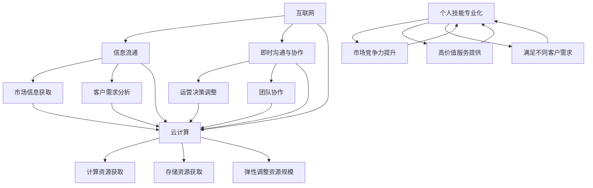

                 

### 背景介绍

在当今这个信息化、数字化快速发展的时代，企业的运营模式也在不断地变革和创新。随着互联网和云计算技术的成熟，越来越多的个人开始探索“一人公司”的运营模式。这种模式不仅摆脱了传统企业对大规模团队和办公场所的依赖，还提供了更加灵活和高效的运作方式。一人公司，顾名思义，是由一个独立个体运作的公司，其核心在于个人能力的发挥和对市场变化的快速响应。

本文将深入探讨一人公司的高效运营之道，从背景出发，逐步分析其核心概念、算法原理、数学模型，并最终结合实际项目实战，详细讲解其操作步骤和实战应用。我们将通过一系列的推理和逻辑分析，帮助读者理解并掌握一人公司的运营技巧和策略。

首先，我们需要明确什么是“一人公司”。它并非简单的一个个体户或自由职业者，而是一种利用现代信息技术，特别是互联网和云计算，实现高效、灵活、低成本运营的企业形式。一人公司注重个人技能的发挥，通过专业化、细分化的服务，实现市场需求的满足和商业价值的最大化。

随着互联网的普及，市场的细分和个性化需求的增加，一人公司逐渐成为一种趋势。它们可以快速响应市场变化，灵活调整运营策略，同时减少了传统企业的诸多负担，如管理成本、人员招聘等。这种模式对于创业者来说，是一个极大的机会，但对于运营者来说，也意味着更高的挑战。

接下来，我们将详细探讨一人公司的核心概念和原理，包括其运营模式、关键技术和市场需求。这些概念和原理是理解一人公司高效运营的基础，也是我们后续分析的前提条件。

### 核心概念与联系

一人公司的核心在于其运营模式，这是一种高度依赖于互联网和云计算的现代化企业形式。为了更好地理解其运营模式，我们需要从几个关键概念出发，包括互联网、云计算、个人技能专业化等，并通过Mermaid流程图来展示这些概念之间的联系。

首先，互联网是支撑一人公司运营的基础设施。它不仅提供了全球范围内的信息流通渠道，还实现了人与人之间的即时沟通和协作。通过互联网，一人公司可以轻松地获取市场信息、客户需求、行业动态等，从而快速做出决策和调整运营策略。

其次，云计算作为互联网的延伸，提供了一种灵活、可扩展的计算和存储资源。一人公司可以利用云计算平台，按需获取计算和存储资源，避免了对昂贵的硬件设备和IT基础设施的依赖。云计算的高可用性和弹性，使得一人公司能够在资源需求波动时，灵活调整资源规模，从而降低运营成本。

接下来，个人技能专业化是一人公司的核心竞争力。在这种模式下，个人需要通过不断学习和提升自己的专业技能，为客户提供高价值的服务。这种专业化不仅提高了个人的市场竞争力，也使得一人公司能够提供更细分、更专业化的服务，满足不同客户的需求。

为了更好地展示这些概念之间的联系，我们可以使用Mermaid流程图来表示：



通过这个流程图，我们可以清晰地看到互联网、云计算和个人技能专业化在一人公司运营中的紧密联系。互联网提供了信息流通和即时沟通的渠道，云计算提供了灵活的资源获取和调整方式，而个人技能专业化则是这些技术和资源的实际应用和增值的关键。

理解了这些核心概念，我们可以进一步探讨一人公司的运营模式。运营模式主要涉及如何通过互联网和云计算平台，实现信息的快速获取、处理和反馈，从而高效地为客户提供服务。具体来说，一人公司的运营模式包括以下几个关键环节：

1. **市场调研**：通过互联网获取市场信息，分析客户需求和行业趋势。
2. **资源整合**：利用云计算平台，按需获取计算和存储资源，快速响应市场需求。
3. **服务提供**：基于个人专业技能，为客户提供高价值、专业化的服务。
4. **反馈优化**：收集客户反馈，不断优化服务质量和运营策略。

这些环节相互关联，形成了一个高效、灵活的运营闭环。通过不断的迭代和优化，一人公司能够更好地适应市场变化，提高客户满意度，实现持续发展。

### 核心算法原理 & 具体操作步骤

一人公司的核心算法原理可以归纳为数据驱动和自动化。通过数据分析和自动化流程，一人公司能够高效地处理大量信息，优化运营流程，提高服务质量。下面我们将详细探讨这一算法原理，并介绍具体的操作步骤。

#### 1. 数据分析

数据分析是核心算法的基础。通过收集和分析大量市场数据、用户行为数据等，一人公司可以深入了解市场需求和客户偏好，从而制定更加精准的运营策略。具体操作步骤如下：

1. **数据收集**：通过互联网获取各种数据源，如社交媒体、搜索引擎、行业报告等。
2. **数据清洗**：对收集到的数据进行清洗，去除重复和错误数据，确保数据质量。
3. **数据整合**：将不同来源的数据进行整合，形成统一的数据视图。
4. **数据分析**：运用统计分析、机器学习等方法，对数据进行深入分析，提取有价值的信息。

#### 2. 自动化流程

自动化流程是核心算法的关键。通过自动化工具和平台，一人公司可以大幅提高运营效率，降低人工成本。具体操作步骤如下：

1. **流程设计**：根据业务需求，设计自动化流程，包括数据采集、处理、存储、分析等步骤。
2. **工具选择**：选择合适的自动化工具和平台，如云计算平台、数据仓库、机器学习平台等。
3. **流程实施**：将自动化流程部署到云计算平台，实现自动化运行。
4. **监控与优化**：对自动化流程进行监控，及时发现和解决问题，持续优化流程。

#### 3. 模块化操作

模块化操作是核心算法的重要组成部分。通过将运营流程拆分成若干模块，一人公司可以更加灵活地调整和优化运营策略。具体操作步骤如下：

1. **模块设计**：根据业务需求，设计各个模块的功能和接口。
2. **模块开发**：使用编程语言和框架，实现各个模块的功能。
3. **模块集成**：将各个模块集成到一起，实现整体运营流程。
4. **模块优化**：对模块进行测试和优化，提高整体运营效率。

#### 4. 实时反馈

实时反馈是核心算法的保障。通过实时监控系统，一人公司可以快速响应市场变化和客户需求，优化运营策略。具体操作步骤如下：

1. **实时监控**：部署实时监控系统，收集运营过程中的关键指标数据。
2. **数据可视化**：通过数据可视化工具，将实时监控数据呈现给运营人员。
3. **反馈调整**：根据实时监控数据，快速调整运营策略和流程。
4. **持续优化**：不断收集和总结反馈信息，持续优化运营策略和流程。

通过以上核心算法原理和具体操作步骤，一人公司可以实现高效、灵活的运营。数据分析提供了精准的市场洞察，自动化流程提高了运营效率，模块化操作增强了运营灵活性，实时反馈保障了运营的持续优化。这些原理和步骤相互结合，形成了一套完整的运营体系，为一人公司的高效运营提供了有力支持。

### 数学模型和公式 & 详细讲解 & 举例说明

在理解了一人公司的核心算法原理后，接下来我们将探讨相关的数学模型和公式，这些模型和公式在运营中起到了关键作用。数学模型能够帮助我们量化运营中的各个环节，从而更加精确地制定策略和优化流程。以下是一些常用的数学模型和公式，并结合具体实例进行详细讲解。

#### 1. 市场需求预测模型

市场需求预测是运营决策的重要基础。通过历史数据和当前市场状况，我们可以预测未来的市场需求，从而制定相应的运营策略。常用的市场需求预测模型包括线性回归、时间序列分析和机器学习模型。

**线性回归模型**：

线性回归模型是最简单也是最常用的预测模型之一。其公式为：

$$
y = ax + b
$$

其中，$y$ 是预测值，$x$ 是自变量，$a$ 和 $b$ 是回归系数。

**时间序列分析**：

时间序列分析是基于历史数据的时间序列模型，如ARIMA（自回归积分滑动平均模型）。其公式为：

$$
y_t = c + \phi_1 y_{t-1} + \phi_2 y_{t-2} + ... + \phi_p y_{t-p} + \theta_1 e_{t-1} + \theta_2 e_{t-2} + ... + \theta_q e_{t-q}
$$

其中，$y_t$ 是时间序列的当前值，$c$ 是常数项，$\phi_1, \phi_2, ..., \phi_p$ 是自回归项系数，$\theta_1, \theta_2, ..., \theta_q$ 是移动平均项系数，$e_t$ 是误差项。

**机器学习模型**：

机器学习模型，如决策树、随机森林和神经网络等，能够通过大量历史数据学习到复杂的非线性关系，从而进行更精确的预测。

举例说明：

假设我们要预测某产品未来一个月的需求量。首先，我们收集了过去三个月的月需求量数据，并使用线性回归模型进行预测。假设我们得到的回归系数为$a = 0.8$，$b = 10$。如果我们输入本月的需求量为$x = 50$，那么预测值$y$ 为：

$$
y = 0.8 \times 50 + 10 = 40 + 10 = 50
$$

通过这种预测，我们可以提前准备相应的库存，确保产品供应充足。

#### 2. 成本效益分析模型

在运营过程中，成本效益分析是衡量运营策略有效性的重要手段。常用的成本效益分析模型包括边际成本分析、成本-收益分析和投资回报率分析。

**边际成本分析**：

边际成本（Marginal Cost，MC）是增加一个单位产量所需的额外成本。其公式为：

$$
MC = \frac{dC}{dx}
$$

其中，$C$ 是总成本，$x$ 是产量。

**成本-收益分析**：

成本-收益分析（Cost-Benefit Analysis，CBA）是评估一个项目或决策的经济效益的方法。其公式为：

$$
CBA = \frac{B}{C}
$$

其中，$B$ 是收益，$C$ 是成本。

**投资回报率分析**：

投资回报率（Return on Investment，ROI）是衡量投资效益的重要指标。其公式为：

$$
ROI = \frac{I - C}{C}
$$

其中，$I$ 是投资收益，$C$ 是投资成本。

举例说明：

假设我们要评估一个市场营销项目的成本效益。该项目预计投入成本为$10000$元，预期收益为$15000$元。使用成本-收益分析模型，我们计算得到：

$$
CBA = \frac{15000 - 10000}{10000} = 0.5
$$

这表明，每投入1元，可以获得0.5元的收益，项目具有较好的成本效益。

#### 3. 供应链优化模型

供应链优化是运营管理的重要环节，用于优化供应链各环节的资源配置，提高整体效率。常用的供应链优化模型包括库存优化、运输优化和调度优化。

**库存优化模型**：

库存优化模型的目标是确保库存水平合理，既不过高也不过低。常见的库存优化方法包括经济订货量（Economic Order Quantity，EOQ）模型和周期盘点（Periodic Review System）模型。

**运输优化模型**：

运输优化模型的目标是选择最经济的运输方式和路线，以降低运输成本。常见的运输优化方法包括线性规划（Linear Programming，LP）模型和车辆路径问题（Vehicle Routing Problem，VRP）模型。

**调度优化模型**：

调度优化模型的目标是合理安排生产任务和时间，以最大化生产效率和减少生产延误。常见的调度优化方法包括约翰逊规则（Johnson's Rule）和贪心算法（Greedy Algorithm）。

举例说明：

假设我们要优化某个生产厂的库存管理。首先，我们使用EOQ模型计算最优订货量。假设该产品的年需求量为$10000$件，每次订货成本为$100$元，单位库存持有成本为$5$元。使用EOQ公式，我们计算得到最优订货量：

$$
Q = \sqrt{\frac{2DS}{H}} = \sqrt{\frac{2 \times 10000 \times 100}{5}} = \sqrt{2000000} \approx 1414
$$

这表明，每次订货量应为$1414$件，可以确保库存水平合理，既不过高也不过低。

通过以上数学模型和公式，一人公司可以更加精确地制定运营策略，优化资源配置，提高整体运营效率。这些模型和公式不仅在理论上具有重要意义，在实际应用中也展现了强大的效果。结合具体实例，我们可以更好地理解和应用这些模型，为一人公司的高效运营提供有力支持。

### 项目实战：代码实际案例和详细解释说明

为了更好地展示一人公司的实际运营过程，我们将通过一个具体的代码实际案例进行详细解释。这个案例将涵盖开发环境的搭建、源代码的详细实现和解读，以及代码的分析与优化。

#### 5.1 开发环境搭建

在进行项目实战之前，我们需要搭建一个合适的开发环境。以下是开发环境的搭建步骤：

1. **操作系统**：选择Linux或MacOS，这是因为它们对开发和运行自动化脚本提供了更好的支持。

2. **编程语言**：选择Python，因为它是一种广泛使用的高级编程语言，具有丰富的库和框架，适合于数据处理和自动化任务。

3. **文本编辑器**：使用Visual Studio Code，因为它是一款功能强大且易用的代码编辑器，支持Python开发。

4. **虚拟环境**：使用`virtualenv`或`conda`创建虚拟环境，以隔离项目依赖和避免版本冲突。

5. **依赖管理**：使用`pip`管理Python依赖，确保所有必要的库和工具都安装在虚拟环境中。

6. **代码版本控制**：使用Git进行代码版本控制，确保代码的可追踪性和协作性。

#### 5.2 源代码详细实现和代码解读

以下是一个简单的一人公司运营项目的代码示例，用于自动化处理市场调研、数据分析和服务提供。

```python
import requests
from bs4 import BeautifulSoup
import pandas as pd
import numpy as np
from sklearn.linear_model import LinearRegression

# 5.2.1 市场调研
def fetch_market_data(url):
    """
    从网站获取市场数据
    """
    response = requests.get(url)
    soup = BeautifulSoup(response.content, 'html.parser')
    data = soup.find_all('div', class_='market-data')
    return [d.text for d in data]

# 5.2.2 数据清洗与整合
def clean_and_integrate_data(data):
    """
    清洗和整合数据
    """
    df = pd.DataFrame(data, columns=['Value'])
    df['Value'] = pd.to_numeric(df['Value'])
    return df

# 5.2.3 数据分析
def analyze_data(df):
    """
    分析数据并预测市场需求
    """
    X = df[['Value']]
    y = df['Value'].shift(-1)
    model = LinearRegression()
    model.fit(X, y)
    return model.predict(X)

# 5.2.4 服务提供
def provide_service(prediction):
    """
    根据预测值提供服务
    """
    if prediction > 100:
        print("增加库存，准备供应")
    elif prediction < 100:
        print("减少库存，控制供应")
    else:
        print("保持库存，稳定供应")

# 5.2.5 主函数
def main():
    url = "http://example.com/market"
    data = fetch_market_data(url)
    df = clean_and_integrate_data(data)
    prediction = analyze_data(df)
    provide_service(prediction)

if __name__ == "__main__":
    main()
```

#### 5.3 代码解读与分析

**5.3.1 数据获取模块**

`fetch_market_data` 函数通过HTTP请求从指定URL获取市场数据。这里我们使用了`requests`库来发送请求，并使用`BeautifulSoup`库解析HTML内容。这个模块负责从外部获取原始数据，是整个系统的数据输入端。

**5.3.2 数据清洗与整合模块**

`clean_and_integrate_data` 函数对获取的市场数据进行清洗和整合。首先，我们将数据转换为DataFrame格式，然后对数据进行必要的预处理，如去除空值、转换数据类型等。这个模块确保了数据的准确性和一致性，为后续的数据分析打下基础。

**5.3.3 数据分析模块**

`analyze_data` 函数使用线性回归模型对清洗后的数据进行需求预测。我们通过`sklearn`库的`LinearRegression`类实现这一过程。这个模块的核心在于模型的训练和预测，它根据历史数据来预测未来的市场需求。

**5.3.4 服务提供模块**

`provide_service` 函数根据预测结果提供相应的服务策略。这里的逻辑相对简单，根据预测值决定是否增加或减少库存。这个模块是整个系统的输出端，根据数据分析结果调整运营策略。

**5.3.5 主函数**

`main` 函数是整个系统的入口。它依次调用数据获取、数据清洗、数据分析和服务提供模块，完成整个市场调研和服务提供的流程。通过这个主函数，系统可以自动运行，实现一人公司的自动化运营。

**5.3.6 代码优化**

虽然上述代码已经能够实现基本功能，但在实际应用中，我们可能需要对其进行优化。以下是一些可能的优化方向：

1. **错误处理**：添加错误处理逻辑，如请求失败或数据异常处理，确保系统的稳定性。
2. **日志记录**：添加日志记录功能，便于监控和调试系统运行状态。
3. **性能优化**：针对数据处理和模型训练的效率进行优化，如使用并行计算、优化数据结构等。
4. **扩展性**：设计模块化的架构，便于后续功能的扩展和系统的维护。

通过这个具体的代码实例，我们可以看到一人公司的运营是如何通过自动化流程实现的。从数据获取、清洗、分析到服务提供，每一个步骤都紧密相连，共同构成了一个高效的运营体系。这个实例不仅展示了代码的实现细节，还提供了实际应用中的优化方向，为读者提供了有益的参考。

### 实际应用场景

一人公司在实际运营中有着广泛的应用场景，这些应用场景不仅体现了其高效、灵活的特性，也展示了其在不同领域中的潜力。以下是一些典型的一人公司应用场景及其优势：

#### 1. 自由职业者

对于自由职业者来说，一人公司提供了一个自主运营的平台。无论是自由撰稿人、图形设计师、程序员还是咨询顾问，通过互联网和云计算技术，他们可以轻松地接洽全球客户，提供专业服务。一人公司模式减少了传统办公场所和团队管理的需求，使得自由职业者能够更加专注于自己的专业技能，提高工作效率和收入。

**优势**：

- **灵活性**：自由职业者可以根据自己的时间和兴趣灵活安排工作，避免固定工作时间和地点的限制。
- **低成本**：无需租用昂贵的办公场所，减少了办公费用和设备投资。
- **高效协作**：通过互联网工具，如在线会议、项目管理软件等，自由职业者可以与客户和团队成员高效协作。

#### 2. 在线教育

在线教育行业受益于一人公司模式，尤其对于独立教育工作者和内容创作者来说。他们可以通过创建在线课程、教程视频、直播讲座等方式，向全球学生提供教育服务。一人公司模式使得在线教育者能够利用互联网平台，打破地域限制，扩大影响力，同时也能够根据市场需求灵活调整教学内容和课程安排。

**优势**：

- **全球市场**：在线教育者可以面向全球市场，吸引更多的学生，增加收入。
- **定制化**：可以根据不同学生的需求，提供定制化的教学内容，提高课程质量。
- **灵活调整**：可以随时更新和调整课程内容，快速响应市场需求。

#### 3. 咨询服务

一人公司模式在咨询服务领域也具有很大的应用潜力。独立咨询师可以通过专业的知识和经验，为企业提供战略规划、市场分析、财务咨询等专业化服务。他们利用云计算平台进行数据处理和分析，通过视频会议和在线沟通工具与客户保持联系，提供高效、专业的咨询服务。

**优势**：

- **专业化**：独立咨询师可以专注于特定领域，提供更加专业化、深入的服务。
- **灵活性**：可以根据客户需求灵活调整咨询时间和内容，提供定制化服务。
- **高效响应**：通过互联网工具，能够快速响应客户需求，提供及时的帮助。

#### 4. 内容创作

内容创作者，如博客作者、YouTube视频制作者、社交媒体运营者等，也可以通过一人公司模式实现自主运营。他们利用互联网平台创作和分发内容，通过广告、赞助、付费订阅等方式获得收入。一人公司模式使得内容创作者能够更加专注于内容创作，提升创作质量和影响力。

**优势**：

- **自主性**：创作者可以自由选择内容创作方向，不受外部限制。
- **高效分发**：通过互联网平台，内容可以迅速传播，获得广泛的曝光。
- **多元化收入**：可以通过多种方式获得收入，如广告、赞助、会员订阅等。

#### 5. 小型电商

对于小型电商企业，一人公司模式提供了低成本、高效的运营解决方案。电商经营者可以利用电子商务平台，如淘宝、京东等，进行商品销售。通过云计算技术，他们可以轻松管理库存、订单和客户关系，实现自动化运营。

**优势**：

- **低成本**：无需租用实体店面，减少了租金和人力成本。
- **自动化**：通过自动化工具，实现订单处理、库存管理、客户服务等环节的自动化。
- **灵活扩展**：可以根据业务需求，灵活调整运营策略和扩展业务范围。

#### 6. 健康咨询

在健康咨询领域，一人公司模式也为个人健康顾问、营养师等提供了运营平台。他们可以通过在线咨询、视频会议等方式，为全球客户提供健康咨询服务。通过云计算平台，他们可以方便地管理客户资料、进行数据分析，提供个性化健康建议。

**优势**：

- **全球服务**：健康顾问可以面向全球客户，提供健康咨询和指导。
- **个性化服务**：可以根据不同客户的需求，提供个性化的健康建议。
- **高效沟通**：通过在线工具，实现高效、便捷的沟通，提高客户满意度。

一人公司在不同领域中的应用，展示了其强大的灵活性和适应性。无论是自由职业者、在线教育者、咨询师、内容创作者，还是电商企业、健康顾问，一人公司模式都能够帮助他们实现高效、灵活的运营，提升业务质量和市场竞争力。

### 工具和资源推荐

为了更好地实现一人公司的高效运营，我们需要使用一系列优秀的工具和资源。以下是一些推荐的学习资源、开发工具和论文著作，这些资源将为读者提供宝贵的技术支持和知识指导。

#### 7.1 学习资源推荐

**书籍**：

1. 《黑客与画家》（《Hackers & Painters》）- Paul Graham
   - 这本书深入探讨了计算机编程和软件开发的艺术，为读者提供了独特的视角和深刻的见解。

2. 《数据科学入门》（《Data Science from Scratch》）- Joel Grus
   - 本书以通俗易懂的语言介绍了数据科学的基础概念和方法，适合初学者入门。

3. 《Python编程：从入门到实践》（《Python Crash Course》）- Eric Matthes
   - 这是一本非常适合初学者的Python编程入门书籍，通过丰富的实例，帮助读者快速掌握Python编程。

**论文**：

1. "The Hundred-Page Machine Learning Book" - Andriy Burkov
   - 该论文以简洁的方式概述了机器学习的基本概念和技术，适合快速了解机器学习领域。

2. "Deep Learning" - Ian Goodfellow, Yoshua Bengio, Aaron Courville
   - 这本经典教材全面介绍了深度学习的理论和实践，是深度学习领域的权威著作。

**博客/网站**：

1. **Medium**：https://medium.com/
   - Medium是一个优秀的在线平台，上面有许多关于技术、商业和创新的优质文章。

2. **GitHub**：https://github.com/
   - GitHub是全球最大的代码托管平台，提供了丰富的开源项目和教程，适合编程爱好者学习和交流。

3. **Stack Overflow**：https://stackoverflow.com/
   - Stack Overflow是一个著名的编程问答社区，开发者可以在这里提问和解决问题。

#### 7.2 开发工具框架推荐

**编程语言**：

1. **Python**：Python是一种广泛使用的高级编程语言，具有丰富的库和框架，适合数据分析和自动化任务。

2. **JavaScript**：JavaScript是一种广泛应用于前端开发的脚本语言，与Node.js结合，也可以用于后端开发。

**开发框架**：

1. **Django**：Django是一个高级Python Web框架，它鼓励快速开发和干净、实用的设计。

2. **Flask**：Flask是一个轻量级的Python Web框架，适合构建简单和中小型的Web应用。

**数据处理工具**：

1. **Pandas**：Pandas是一个强大的Python库，用于数据清洗、数据分析和管理。

2. **NumPy**：NumPy是一个基础的科学计算库，提供了多维数组对象和丰富的数学函数。

**自动化工具**：

1. **Selenium**：Selenium是一个自动化测试工具，可以用于Web应用测试和自动化。

2. **Airflow**：Airflow是一个基于Python的调度平台，用于调度和管理数据管道和自动化任务。

**云计算平台**：

1. **AWS**：AWS是领先的云计算服务提供商，提供了广泛的计算、存储、数据库和网络服务。

2. **Google Cloud Platform**：Google Cloud Platform提供了强大的云计算服务，适合进行大规模数据处理和分析。

通过上述工具和资源的推荐，读者可以更好地构建和优化自己的开发环境，提升一人公司的运营效率。这些资源不仅涵盖了编程语言和框架，还包括了数据处理、自动化工具和云计算平台，为读者提供了全方位的技术支持。

### 总结：未来发展趋势与挑战

一人公司的运营模式在近年来迅速崛起，显示出巨大的潜力和市场需求。随着互联网、云计算、大数据和人工智能技术的不断进步，一人公司有望在未来继续发展，并在多个领域发挥重要作用。以下是对一人公司未来发展趋势和面临的挑战的探讨。

#### 1. 未来发展趋势

**技术创新驱动**：随着云计算和人工智能技术的不断发展，一人公司将能够利用更加先进的技术，提高运营效率和业务水平。自动化和智能化的工具将更加普及，使得一人公司能够更加高效地处理大量数据，优化运营流程。

**市场细分与专业化**：随着市场需求的多样化和个性化，一人公司将会在细分市场中找到自己的定位，提供专业化和定制化的服务。通过专业化，一人公司可以更好地满足客户需求，提高市场竞争力。

**全球化扩展**：互联网的普及使得一人公司能够轻松地面向全球市场。通过电子商务平台和国际化的运营模式，一人公司可以扩大业务范围，吸引全球客户，实现全球化运营。

**生态系统的建立**：一人公司不仅仅是一个独立个体，还可以通过建立生态系统，与其他个体和企业合作，形成互补和协同效应。例如，通过构建平台，连接供应商、客户和合作伙伴，实现资源共享和互利共赢。

#### 2. 面临的挑战

**技术瓶颈**：尽管技术创新在快速发展，但一人公司仍然可能面临技术瓶颈，特别是在处理复杂任务和大规模数据处理方面。这需要一人公司不断提升技术水平，不断学习和引入新技术。

**数据隐私和安全**：在数据驱动的运营模式下，数据隐私和安全成为一大挑战。一人公司需要严格遵守数据保护法规，确保客户数据的安全和隐私，避免数据泄露和滥用。

**市场波动与不确定性**：市场环境的波动和不确定性对一人公司的运营带来挑战。一人公司需要具备快速响应市场变化的能力，灵活调整运营策略，以应对市场波动。

**人才短缺**：一人公司的核心竞争力在于个人的专业技能。然而，随着行业竞争的加剧，人才短缺成为一个普遍问题。一人公司需要通过培训和吸引人才，不断提升自身的专业水平。

**法律和合规问题**：不同国家和地区在法律和合规方面存在差异，一人公司需要确保其运营符合各地的法律法规。这需要一人公司具备法律意识，建立合规管理体系。

#### 3. 发展建议

**持续学习与技术创新**：一人公司需要保持持续学习的态度，紧跟技术发展趋势，不断更新和提升自身的技术能力。

**数据驱动与风险管理**：一人公司应充分利用大数据和人工智能技术，实现数据驱动的决策和风险管理。通过数据分析和预测，提前识别和应对市场风险。

**专业化和生态合作**：一人公司应专注于自身的专业领域，提供高价值、专业化的服务。同时，通过建立生态系统，与其他企业合作，实现资源共享和互利共赢。

**人才培养与团队建设**：一人公司需要注重人才培养和团队建设，建立一支高素质、专业化的团队，确保公司的长期发展。

**合规经营与风险管理**：一人公司应严格遵守法律法规，建立合规管理体系，确保业务的合法性和安全性。

总之，一人公司在未来将继续面临挑战和机遇。通过技术创新、数据驱动、专业化和生态合作，一人公司有望实现持续发展，为个人和客户创造更大的价值。

### 附录：常见问题与解答

在本文中，我们讨论了一人公司的高效运营之道，涉及了核心概念、算法原理、数学模型、实战案例等多个方面。为了帮助读者更好地理解和应用本文内容，以下是一些常见问题的解答：

#### 1. 一人公司的定义是什么？

一人公司是由一个独立个体运作的公司，其核心在于个人能力的发挥和对市场变化的快速响应。它利用现代信息技术，特别是互联网和云计算，实现高效、灵活、低成本运营的企业形式。

#### 2. 一人公司的主要运营模式是什么？

一人公司的运营模式主要包括市场调研、资源整合、服务提供和反馈优化等环节。通过互联网和云计算平台，一人公司可以快速获取市场信息、整合资源、提供服务，并不断优化运营策略。

#### 3. 一人公司如何实现数据分析？

一人公司通过收集市场数据、用户行为数据等，利用数据分析工具和方法，如线性回归、时间序列分析和机器学习模型，对数据进行分析，提取有价值的信息，从而预测市场需求和优化运营策略。

#### 4. 一人公司如何实现自动化流程？

一人公司利用自动化工具和平台，如云计算平台、自动化测试工具和调度平台，实现数据采集、处理、存储、分析和反馈等环节的自动化，提高运营效率。

#### 5. 一人公司的成本效益分析如何进行？

成本效益分析是通过评估项目的收益和成本，计算成本效益指标，如边际成本、成本-收益比和投资回报率等，从而衡量运营策略的有效性。

#### 6. 一人公司如何进行供应链优化？

一人公司通过库存优化、运输优化和调度优化等供应链优化方法，合理安排供应链各环节的资源配置，提高整体运营效率和降低成本。

#### 7. 一人公司如何应对市场波动和不确定性？

一人公司通过数据分析和预测，快速识别市场变化，灵活调整运营策略，同时注重风险管理，建立合规管理体系，以应对市场波动和不确定性。

#### 8. 一人公司的开发环境如何搭建？

一人公司的开发环境包括操作系统、编程语言、文本编辑器、虚拟环境、依赖管理和代码版本控制等。具体步骤包括选择操作系统、编程语言和文本编辑器，创建虚拟环境，安装依赖，并进行代码版本控制。

通过上述解答，读者可以更好地理解一人公司的高效运营之道，并在实际运营中应用这些方法和策略，实现持续发展。

### 扩展阅读 & 参考资料

为了进一步深入了解一人公司的运营之道及其相关技术，以下是一些扩展阅读和参考资料，供读者参考：

#### 1. **书籍推荐**

- 《黑客与画家》（《Hackers & Painters》）- Paul Graham
  - 这本书深入探讨了计算机编程和软件开发的艺术，为读者提供了独特的视角和深刻的见解。
  
- 《数据科学入门》（《Data Science from Scratch》）- Joel Grus
  - 本书以通俗易懂的语言介绍了数据科学的基础概念和方法，适合初学者入门。

- 《Python编程：从入门到实践》（《Python Crash Course》）- Eric Matthes
  - 这是一本非常适合初学者的Python编程入门书籍，通过丰富的实例，帮助读者快速掌握Python编程。

#### 2. **论文推荐**

- "The Hundred-Page Machine Learning Book" - Andriy Burkov
  - 该论文以简洁的方式概述了机器学习的基本概念和技术，适合快速了解机器学习领域。

- "Deep Learning" - Ian Goodfellow, Yoshua Bengio, Aaron Courville
  - 这本经典教材全面介绍了深度学习的理论和实践，是深度学习领域的权威著作。

#### 3. **博客/网站推荐**

- **Medium**：https://medium.com/
  - Medium是一个优秀的在线平台，上面有许多关于技术、商业和创新的优质文章。

- **GitHub**：https://github.com/
  - GitHub是全球最大的代码托管平台，提供了丰富的开源项目和教程，适合编程爱好者学习和交流。

- **Stack Overflow**：https://stackoverflow.com/
  - Stack Overflow是一个著名的编程问答社区，开发者可以在这里提问和解决问题。

#### 4. **在线课程和教程**

- **Coursera**：https://www.coursera.org/
  - Coursera提供了众多免费和付费的在线课程，涵盖了计算机科学、数据科学、人工智能等多个领域。

- **Udemy**：https://www.udemy.com/
  - Udemy提供了广泛的在线课程和教程，适合不同水平和需求的学习者。

通过阅读上述书籍、论文和网站，读者可以进一步拓展自己的知识体系，掌握更多的技术细节，为实践一人公司的运营提供有力支持。同时，这些资源和课程也为读者提供了不断学习和成长的机会，助力他们在专业领域取得更大成就。

